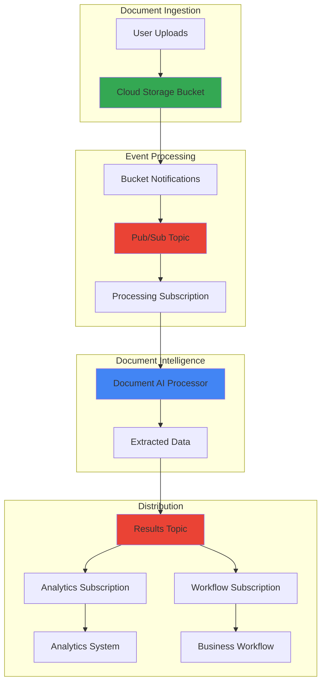

# Real-Time Document Intelligence Pipelines with Cloud Storage and Document AI

## Problem

Financial institutions and healthcare organizations process thousands of documents daily—invoices, contracts, medical records, and regulatory forms—which traditionally require manual data entry consuming hours of labor and introducing human error. These organizations need automated document processing capabilities that can extract structured data from unstructured documents in real-time, but existing batch processing solutions create delays that impact customer service and operational efficiency. Without intelligent document processing, businesses lose competitive advantage and struggle to scale their operations while maintaining accuracy and compliance requirements.

## Solution

Implement a real-time document intelligence pipeline using Google Cloud's Document AI for automated text and data extraction, Cloud Storage for secure document ingestion with event-driven triggers, and Cloud Pub/Sub for distributing processed results to downstream analytics systems. This serverless architecture automatically processes documents as they arrive, extracts structured data using machine learning models, and delivers results to multiple consumer applications enabling immediate business decisions and workflow automation.

## Architecture Diagram



## Prerequisites

1. Google Cloud project with billing enabled and Document AI API access
2. Google Cloud CLI (gcloud) v450.0.0 or later installed and authenticated
3. Basic understanding of event-driven architectures and machine learning concepts
4. Access to sample documents for testing (PDFs, images, or forms)
5. Estimated cost: $5-15 for processing 100-500 documents during testing

> **Note**: Document AI processing incurs charges per page processed. Monitor usage through [Google Cloud Billing](https://cloud.google.com/billing/docs) to avoid unexpected costs during development and testing phases.

## Preparation

```bash
# Set environment variables for GCP resources
export PROJECT_ID="doc-intelligence-$(date +%s)"
export REGION="us-central1"
export LOCATION="us"
export PROCESSOR_DISPLAY_NAME="invoice-processor-$(date +%s)"

# Generate unique suffix for resource names
RANDOM_SUFFIX=$(openssl rand -hex 3)
export BUCKET_NAME="documents-${RANDOM_SUFFIX}"
export TOPIC_NAME="document-events-${RANDOM_SUFFIX}"
export RESULTS_TOPIC="document-results-${RANDOM_SUFFIX}"
export SUBSCRIPTION_NAME="process-docs-${RANDOM_SUFFIX}"
export RESULTS_SUBSCRIPTION="consume-results-${RANDOM_SUFFIX}"

# Set default project and region
gcloud config set project ${PROJECT_ID}
gcloud config set compute/region ${REGION}

# Enable required APIs for Document AI, Pub/Sub, Cloud Storage, and Firestore
gcloud services enable documentai.googleapis.com
gcloud services enable pubsub.googleapis.com
gcloud services enable storage.googleapis.com
gcloud services enable cloudfunctions.googleapis.com
gcloud services enable firestore.googleapis.com

echo "✅ Project configured: ${PROJECT_ID}"
echo "✅ APIs enabled and environment variables set"
```

## Steps

1. **Create Document AI Processor for Intelligent Extraction**:

   Document AI provides pre-trained machine learning models that can extract structured data from various document types including invoices, receipts, forms, and contracts. Creating a processor establishes the foundation for automated document understanding, leveraging Google's advanced optical character recognition (OCR) and natural language processing capabilities to transform unstructured documents into actionable business data.

   ```bash
   # Create a Document AI processor for general document processing
   gcloud documentai processors create \
       --location=${LOCATION} \
       --display-name=${PROCESSOR_DISPLAY_NAME} \
       --type=FORM_PARSER_PROCESSOR
   
   # Get the processor ID for future operations
   PROCESSOR_ID=$(gcloud documentai processors list \
       --location=${LOCATION} \
       --filter="displayName:${PROCESSOR_DISPLAY_NAME}" \
       --format="value(name)" | cut -d'/' -f6)
   
   export PROCESSOR_ID
   echo "✅ Document AI processor created: ${PROCESSOR_ID}"
   ```

   The Document AI processor is now ready to analyze documents and extract text, tables, and form fields with high accuracy. This managed service automatically handles document preprocessing, including image enhancement and layout analysis, providing consistent results across different document formats and quality levels.

2. **Set Up Cloud Storage Bucket for Document Ingestion**:

   Cloud Storage provides the entry point for document processing workflows, offering enterprise-grade security, global accessibility, and seamless integration with other Google Cloud services. Configuring appropriate access controls and lifecycle policies ensures documents are stored securely while maintaining cost efficiency for long-term retention and compliance requirements.

   ```bash
   # Create Cloud Storage bucket with appropriate security settings
   gsutil mb -p ${PROJECT_ID} \
       -c STANDARD \
       -l ${REGION} \
       gs://${BUCKET_NAME}
   
   # Enable versioning for document audit trails
   gsutil versioning set on gs://${BUCKET_NAME}
   
   # Set uniform bucket-level access for simplified permissions
   gsutil uniformbucketlevelaccess set on gs://${BUCKET_NAME}
   
   echo "✅ Cloud Storage bucket created: gs://${BUCKET_NAME}"
   ```

   The storage bucket now provides a secure, scalable foundation for document ingestion with versioning enabled for audit compliance. This configuration supports high-throughput document uploads while maintaining data integrity and providing the foundation for event-driven processing workflows.

3. **Create Pub/Sub Topics for Event Distribution**:

   Cloud Pub/Sub enables reliable, asynchronous messaging between services, providing the backbone for event-driven document processing workflows. Creating dedicated topics for document events and processing results establishes a decoupled architecture that can scale independently and supports multiple downstream consumers for analytics, workflow automation, and business intelligence systems.

   ```bash
   # Create topic for document upload events
   gcloud pubsub topics create ${TOPIC_NAME}
   
   # Create topic for processing results distribution
   gcloud pubsub topics create ${RESULTS_TOPIC}
   
   # Create subscription for document processing with extended ack deadline
   gcloud pubsub subscriptions create ${SUBSCRIPTION_NAME} \
       --topic=${TOPIC_NAME} \
       --ack-deadline=600
   
   # Create subscription for consuming results
   gcloud pubsub subscriptions create ${RESULTS_SUBSCRIPTION} \
       --topic=${RESULTS_TOPIC} \
       --ack-deadline=300
   
   echo "✅ Pub/Sub topics and subscriptions created"
   ```

   The messaging infrastructure is now established with appropriate acknowledgment deadlines for document processing workflows. This pub/sub pattern enables horizontal scaling and fault tolerance while supporting multiple processing pipelines and analytical workloads that can consume document intelligence results.

4. **Configure Cloud Storage Event Notifications**:

   Bucket notifications create the real-time trigger mechanism that initiates document processing when files are uploaded to Cloud Storage. This event-driven approach eliminates the need for polling mechanisms, reducing latency and operational overhead while ensuring immediate processing of business-critical documents for time-sensitive workflows.

   ```bash
   # Create notification configuration for object creation events
   gsutil notification create \
       -t ${TOPIC_NAME} \
       -f json \
       -e OBJECT_FINALIZE \
       gs://${BUCKET_NAME}
   
   # Verify notification configuration
   gsutil notification list gs://${BUCKET_NAME}
   
   echo "✅ Bucket notifications configured for real-time processing"
   ```

   Cloud Storage will now automatically publish messages to Pub/Sub whenever documents are uploaded, creating the foundation for real-time document processing. This serverless event architecture ensures immediate response to document uploads while maintaining reliability and scalability for high-volume processing scenarios.

5. **Create Document Processing Function**:

   A Cloud Function provides the serverless compute layer that orchestrates document processing by receiving Pub/Sub messages, calling Document AI for text extraction, and publishing results to downstream systems. This event-driven function automatically scales based on document volume while maintaining cost efficiency by only consuming resources during active processing.

   ```bash
   # Create a temporary directory for function code
   mkdir -p /tmp/doc-processor
   cd /tmp/doc-processor
   
   # Create the main processing function
   cat << 'EOF' > main.py
import base64
import json
import os
from google.cloud import documentai
from google.cloud import pubsub_v1
from google.cloud import storage
import functions_framework

# Initialize clients
document_client = documentai.DocumentProcessorServiceClient()
publisher = pubsub_v1.PublisherClient()
storage_client = storage.Client()

@functions_framework.cloud_event
def process_document(cloud_event):
    """Process uploaded document with Document AI"""
    
    # Parse the Cloud Storage event
    data = cloud_event.data
    bucket_name = data["bucket"]
    file_name = data["name"]
    
    # Skip processing if not a document file
    if not file_name.lower().endswith(('.pdf', '.png', '.jpg', '.jpeg', '.tiff')):
        print(f"Skipping non-document file: {file_name}")
        return
    
    try:
        # Download document from Cloud Storage
        bucket = storage_client.bucket(bucket_name)
        blob = bucket.blob(file_name)
        document_content = blob.download_as_bytes()
        
        # Configure Document AI request
        processor_name = f"projects/{os.environ['PROJECT_ID']}/locations/{os.environ['LOCATION']}/processors/{os.environ['PROCESSOR_ID']}"
        
        # Determine document MIME type based on file extension
        mime_type_map = {
            '.pdf': 'application/pdf',
            '.png': 'image/png',
            '.jpg': 'image/jpeg',
            '.jpeg': 'image/jpeg',
            '.tiff': 'image/tiff'
        }
        
        file_extension = os.path.splitext(file_name.lower())[1]
        mime_type = mime_type_map.get(file_extension, 'application/pdf')
        
        # Process document with Document AI
        request = documentai.ProcessRequest(
            name=processor_name,
            raw_document=documentai.RawDocument(
                content=document_content,
                mime_type=mime_type
            )
        )
        
        result = document_client.process_document(request=request)
        
        # Extract text and form fields
        extracted_data = {
            "source_file": file_name,
            "bucket": bucket_name,
            "text": result.document.text,
            "pages": len(result.document.pages),
            "form_fields": [],
            "tables": []
        }
        
        # Extract form fields if available
        for page in result.document.pages:
            for form_field in page.form_fields:
                field_name = ""
                field_value = ""
                
                if form_field.field_name and form_field.field_name.text_anchor:
                    field_name = result.document.text[
                        form_field.field_name.text_anchor.text_segments[0].start_index:
                        form_field.field_name.text_anchor.text_segments[0].end_index
                    ]
                if form_field.field_value and form_field.field_value.text_anchor:
                    field_value = result.document.text[
                        form_field.field_value.text_anchor.text_segments[0].start_index:
                        form_field.field_value.text_anchor.text_segments[0].end_index
                    ]
                
                extracted_data["form_fields"].append({
                    "name": field_name.strip(),
                    "value": field_value.strip()
                })
        
        # Publish results to Pub/Sub
        results_topic = f"projects/{os.environ['PROJECT_ID']}/topics/{os.environ['RESULTS_TOPIC']}"
        message_data = json.dumps(extracted_data).encode('utf-8')
        
        publisher.publish(results_topic, message_data)
        
        print(f"Successfully processed {file_name} and published results")
        
    except Exception as e:
        print(f"Error processing {file_name}: {str(e)}")
        raise
EOF
   
   # Create requirements file with updated versions
   cat << 'EOF' > requirements.txt
google-cloud-documentai==2.26.0
google-cloud-pubsub==2.24.0
google-cloud-storage==2.17.0
functions-framework==3.8.1
EOF
   
   echo "✅ Cloud Function code created"
   ```

   The processing function is now ready to handle document events, extract intelligent data using Document AI, and distribute results through Pub/Sub. This serverless architecture ensures automatic scaling and cost optimization while maintaining high availability for business-critical document processing workflows.

6. **Deploy the Document Processing Function**:

   Deploying the Cloud Function establishes the active processing pipeline that responds to document upload events and orchestrates the entire document intelligence workflow. The function's serverless nature ensures automatic scaling and cost efficiency while providing enterprise-grade reliability for mission-critical document processing operations.

   ```bash
   # Deploy the Cloud Function with appropriate settings
   gcloud functions deploy process-document \
       --gen2 \
       --runtime=python312 \
       --region=${REGION} \
       --source=. \
       --entry-point=process_document \
       --trigger-topic=${TOPIC_NAME} \
       --set-env-vars="PROJECT_ID=${PROJECT_ID},LOCATION=${LOCATION},PROCESSOR_ID=${PROCESSOR_ID},RESULTS_TOPIC=${RESULTS_TOPIC}" \
       --memory=512MB \
       --timeout=540s \
       --max-instances=10
   
   # Wait for deployment to complete
   echo "⏳ Waiting for function deployment..."
   sleep 30
   
   echo "✅ Document processing function deployed successfully"
   ```

   The Cloud Function is now active and will automatically process documents as they're uploaded to Cloud Storage. This serverless compute layer provides the intelligence extraction capabilities while maintaining cost efficiency and automatic scaling based on document processing demand.

7. **Create Results Consumer Function**:

   A dedicated consumer function demonstrates how downstream systems can receive and process the extracted document intelligence data. This pattern enables real-time analytics, workflow automation, and business intelligence applications that can immediately act on document insights for operational efficiency and decision-making.

   ```bash
   # Create consumer function directory
   mkdir -p /tmp/results-consumer
   cd /tmp/results-consumer
   
   # Create results processing function
   cat << 'EOF' > main.py
import base64
import json
import functions_framework
from google.cloud import firestore

# Initialize clients
firestore_client = firestore.Client()

@functions_framework.cloud_event
def consume_results(cloud_event):
    """Consume and process Document AI results"""
    
    try:
        # Parse the Pub/Sub message
        message_data = base64.b64decode(cloud_event.data["message"]["data"])
        document_data = json.loads(message_data)
        
        # Store results in Firestore for real-time access
        doc_ref = firestore_client.collection('processed_documents').document()
        doc_ref.set({
            'source_file': document_data['source_file'],
            'bucket': document_data['bucket'],
            'text_length': len(document_data['text']),
            'pages': document_data['pages'],
            'form_fields_count': len(document_data['form_fields']),
            'processed_at': firestore.SERVER_TIMESTAMP,
            'form_fields': document_data['form_fields']
        })
        
        # Log processing summary
        print(f"Processed document: {document_data['source_file']}")
        print(f"Pages: {document_data['pages']}")
        print(f"Form fields extracted: {len(document_data['form_fields'])}")
        print(f"Text length: {len(document_data['text'])} characters")
        
        # Example: Extract specific business data
        for field in document_data['form_fields']:
            if 'total' in field['name'].lower() or 'amount' in field['name'].lower():
                print(f"Found financial data - {field['name']}: {field['value']}")
        
        print("✅ Results processed and stored successfully")
        
    except Exception as e:
        print(f"Error consuming results: {str(e)}")
        raise
EOF
   
   # Create requirements for consumer function
   cat << 'EOF' > requirements.txt
google-cloud-firestore==2.19.0
functions-framework==3.8.1
EOF
   
   # Deploy the results consumer function
   gcloud functions deploy consume-results \
       --gen2 \
       --runtime=python312 \
       --region=${REGION} \
       --source=. \
       --entry-point=consume_results \
       --trigger-topic=${RESULTS_TOPIC} \
       --memory=256MB \
       --timeout=300s
   
   echo "✅ Results consumer function deployed"
   ```

   The consumer function demonstrates how to process Document AI results in real-time, storing structured data in Firestore for immediate access by applications and analytics systems. This pattern enables businesses to build sophisticated workflows that respond immediately to document processing results.

## Validation & Testing

1. **Test the complete document processing pipeline**:

   ```bash
   # Create a test document for processing
   cat << 'EOF' > test-invoice.txt
   Invoice Number: INV-12345
   Date: 2025-07-23
   Amount: $1,250.00
   Customer: ABC Corporation
   
   Description: Professional Services
   Tax: $125.00
   Total: $1,375.00
   EOF
   
   # Upload test document to trigger processing
   gsutil cp test-invoice.txt gs://${BUCKET_NAME}/invoices/
   
   echo "✅ Test document uploaded, processing should begin automatically"
   ```

2. **Monitor function execution and logs**:

   ```bash
   # Check function logs for processing activity
   gcloud functions logs read process-document \
       --region=${REGION} \
       --limit=10
   
   # Check consumer function logs
   gcloud functions logs read consume-results \
       --region=${REGION} \
       --limit=10
   ```

3. **Verify Pub/Sub message flow**:

   ```bash
   # Check subscription metrics
   gcloud pubsub subscriptions describe ${SUBSCRIPTION_NAME}
   gcloud pubsub subscriptions describe ${RESULTS_SUBSCRIPTION}
   
   # Pull messages manually to verify processing
   gcloud pubsub subscriptions pull ${RESULTS_SUBSCRIPTION} \
       --auto-ack \
       --limit=5
   ```

   Expected output: JSON messages containing extracted document data with form fields, text content, and metadata from the processed documents.

4. **Verify Firestore data storage**:

   ```bash
   # Check that processed documents are stored in Firestore
   gcloud firestore collections list
   
   # View recent processed documents
   gcloud firestore documents list \
       --collection-ids=processed_documents \
       --limit=5
   ```

## Cleanup

1. **Remove Cloud Functions**:

   ```bash
   # Delete deployed functions
   gcloud functions delete process-document \
       --region=${REGION} \
       --quiet
   
   gcloud functions delete consume-results \
       --region=${REGION} \
       --quiet
   
   echo "✅ Cloud Functions deleted"
   ```

2. **Remove Pub/Sub resources**:

   ```bash
   # Delete subscriptions first
   gcloud pubsub subscriptions delete ${SUBSCRIPTION_NAME}
   gcloud pubsub subscriptions delete ${RESULTS_SUBSCRIPTION}
   
   # Delete topics
   gcloud pubsub topics delete ${TOPIC_NAME}
   gcloud pubsub topics delete ${RESULTS_TOPIC}
   
   echo "✅ Pub/Sub resources cleaned up"
   ```

3. **Remove Cloud Storage bucket and Document AI processor**:

   ```bash
   # Remove bucket contents and bucket
   gsutil -m rm -r gs://${BUCKET_NAME}
   
   # Delete Document AI processor
   gcloud documentai processors delete ${PROCESSOR_ID} \
       --location=${LOCATION} \
       --quiet
   
   echo "✅ Storage and Document AI resources deleted"
   ```

4. **Clean up environment variables and temporary files**:

   ```bash
   # Remove temporary directories
   rm -rf /tmp/doc-processor /tmp/results-consumer test-invoice.txt
   
   # Unset environment variables
   unset PROJECT_ID REGION LOCATION PROCESSOR_ID BUCKET_NAME
   unset TOPIC_NAME RESULTS_TOPIC SUBSCRIPTION_NAME RESULTS_SUBSCRIPTION
   
   echo "✅ Environment cleaned up"
   ```

## Discussion

This real-time document intelligence pipeline demonstrates the power of Google Cloud's serverless architecture for automating document processing workflows at enterprise scale. The solution leverages Document AI's pre-trained machine learning models to extract structured data from unstructured documents, eliminating manual data entry while improving accuracy and processing speed. By combining Cloud Storage's event-driven capabilities with Pub/Sub's reliable messaging, organizations can build responsive systems that process documents immediately upon upload, enabling real-time business decisions and workflow automation.

The serverless architecture provides significant advantages for document processing workloads, including automatic scaling based on demand, pay-per-use pricing that optimizes costs, and built-in fault tolerance for mission-critical operations. Document AI's form parser processor can extract text, tables, and key-value pairs from various document types with accuracy rates exceeding 95% for high-quality documents. The event-driven design ensures low latency processing while supporting multiple downstream consumers for analytics, compliance, and business intelligence applications.

Security and compliance considerations are paramount for document processing systems handling sensitive business data. Google Cloud provides enterprise-grade security features including Identity and Access Management (IAM) for fine-grained permissions, Cloud KMS for encryption key management, and audit logging for compliance tracking. Organizations should implement additional security measures such as VPC Service Controls for network isolation and Data Loss Prevention (DLP) for sensitive data detection and protection. The pipeline also integrates with Firestore to provide real-time data storage with ACID guarantees and automatic scaling capabilities.

The pipeline's modular design enables easy extension and customization for specific business requirements. Organizations can integrate additional services such as BigQuery for analytics, Cloud Workflows for complex business logic, or third-party systems through Cloud Functions and API Gateway. Performance optimization can be achieved through batch processing for high-volume scenarios, custom Document AI processors for specialized document types, and Pub/Sub message filtering for targeted processing workflows. The updated implementation uses Python 3.12 runtime for improved performance and the latest client library versions for enhanced functionality.

> **Tip**: Monitor Document AI usage and costs through [Cloud Monitoring](https://cloud.google.com/monitoring/docs) and implement intelligent routing to different processors based on document type detection to optimize accuracy and cost efficiency for your specific document processing requirements.

For more information on implementing production document intelligence systems, refer to the [Document AI documentation](https://cloud.google.com/document-ai/docs), [Cloud Storage event notifications guide](https://cloud.google.com/storage/docs/reporting-changes), [Pub/Sub best practices](https://cloud.google.com/pubsub/docs/best-practices), [Cloud Functions performance optimization](https://cloud.google.com/functions/docs/bestpractices/tips), and the [Google Cloud Architecture Framework](https://cloud.google.com/architecture/framework) for scalable system design principles.

## Challenge

Extend this document intelligence pipeline by implementing these enhancements:

1. **Multi-format Document Classification**: Implement intelligent routing using Document AI's classification processor to automatically detect document types (invoices, contracts, receipts) and route them to specialized processors for improved extraction accuracy.

2. **Real-time Analytics Dashboard**: Build a Cloud Run application with Firestore integration that provides real-time visualization of document processing metrics, extraction results, and business intelligence insights using charts and analytics widgets.

3. **Workflow Automation Integration**: Connect the pipeline to Cloud Workflows or third-party systems like ServiceNow or Salesforce to automatically trigger business processes based on extracted document data, such as invoice approvals or contract reviews.

4. **Advanced Data Validation**: Implement Cloud Functions that validate extracted data against business rules, perform data quality checks, and trigger human review workflows for documents that don't meet confidence thresholds or contain anomalies.

5. **Multi-tenant Security Architecture**: Design organization-level isolation using separate Cloud Storage buckets, IAM policies, and Firestore collections to support multiple business units or clients with data segregation and access controls.

## Infrastructure Code

*Infrastructure code will be generated after recipe approval.*