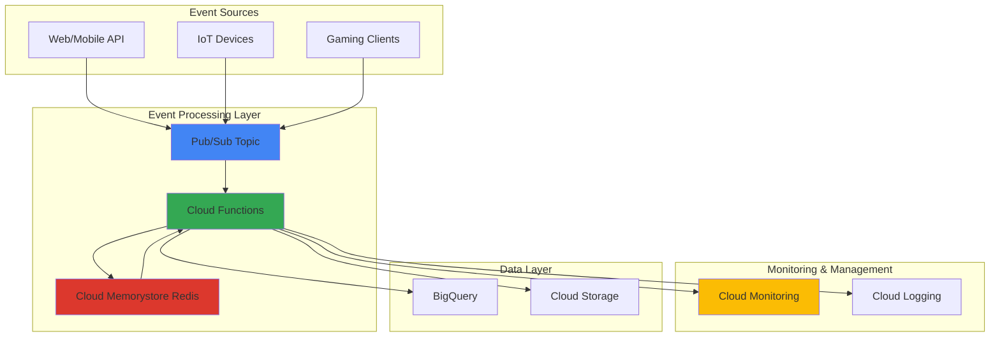

# Real-Time Event Processing with Cloud Memorystore and Pub/Sub

## Problem

E-commerce platforms, gaming applications, and IoT systems require sub-millisecond data processing to handle millions of concurrent events like user sessions, real-time leaderboards, and sensor data streams. Traditional database-backed solutions introduce latency bottlenecks that degrade user experience, while managing distributed caching infrastructure demands significant operational overhead and expertise in Redis clustering, failover mechanisms, and performance tuning.

## Solution

Build a high-performance event processing system using Cloud Memorystore for Redis as an in-memory cache layer, Pub/Sub for reliable message queuing, and Cloud Functions for serverless event handling. This architecture provides sub-millisecond data access through managed Redis instances while leveraging Pub/Sub's event-driven model to decouple producers from consumers, enabling horizontal scaling and fault tolerance without infrastructure management complexity.

## Architecture Diagram



## Prerequisites

1. Google Cloud account with billing enabled and appropriate permissions for Compute, Memorystore, Pub/Sub, and Cloud Functions
2. Google Cloud CLI (gcloud) installed and configured, or access to Cloud Shell
3. Basic understanding of Redis data structures and caching patterns
4. Familiarity with event-driven architecture and message queuing concepts
5. Estimated cost: $15-25 for running this tutorial (includes Memorystore Basic tier, Pub/Sub messages, and Cloud Functions invocations)

> **Note**: This recipe uses Cloud Memorystore Basic tier for demonstration. Production workloads should consider Standard tier for high availability and automatic failover capabilities.

## Preparation

```bash
# Set environment variables for consistent resource naming
export PROJECT_ID="event-processing-$(date +%s)"
export REGION="us-central1"
export ZONE="us-central1-a"

# Generate unique suffix for resource names to avoid conflicts
RANDOM_SUFFIX=$(openssl rand -hex 3)
export REDIS_INSTANCE="event-cache-${RANDOM_SUFFIX}"
export PUBSUB_TOPIC="events-topic-${RANDOM_SUFFIX}"
export FUNCTION_NAME="event-processor-${RANDOM_SUFFIX}"

# Set default project and region for subsequent operations
gcloud config set project ${PROJECT_ID}
gcloud config set compute/region ${REGION}
gcloud config set compute/zone ${ZONE}

# Enable required Google Cloud APIs for the services we'll use
gcloud services enable redis.googleapis.com
gcloud services enable pubsub.googleapis.com
gcloud services enable cloudfunctions.googleapis.com
gcloud services enable cloudbuild.googleapis.com
gcloud services enable monitoring.googleapis.com
gcloud services enable vpcaccess.googleapis.com

echo "✅ Project configured: ${PROJECT_ID}"
echo "✅ APIs enabled and region set to: ${REGION}"
```

## Steps

1. **Create Cloud Memorystore Redis Instance**:

   Cloud Memorystore for Redis provides a fully managed, in-memory data store that delivers sub-millisecond latency for caching and real-time applications. Unlike self-managed Redis deployments, Memorystore handles patching, monitoring, and failover automatically while providing enterprise-grade security through private IP addresses and IAM integration. This managed service scales from small development instances to production-ready clusters with up to 300GB of memory.

   ```bash
   # Create Redis instance with Basic tier for development/testing
   gcloud redis instances create ${REDIS_INSTANCE} \
       --size=1 \
       --region=${REGION} \
       --redis-version=redis_6_x \
       --tier=BASIC \
       --network=default \
       --redis-config="maxmemory-policy=allkeys-lru"
   
   # Wait for instance to be ready (this may take 3-5 minutes)
   while [[ $(gcloud redis instances describe ${REDIS_INSTANCE} \
       --region=${REGION} \
       --format="value(state)") != "READY" ]]; do
     echo "Waiting for Redis instance to be ready..."
     sleep 30
   done
   
   # Get Redis instance connection details
   export REDIS_HOST=$(gcloud redis instances describe ${REDIS_INSTANCE} \
       --region=${REGION} \
       --format="value(host)")
   export REDIS_PORT=$(gcloud redis instances describe ${REDIS_INSTANCE} \
       --region=${REGION} \
       --format="value(port)")
   
   echo "✅ Redis instance created: ${REDIS_INSTANCE}"
   echo "✅ Redis endpoint: ${REDIS_HOST}:${REDIS_PORT}"
   ```

   The Redis instance is now provisioned with LRU (Least Recently Used) eviction policy, ensuring optimal memory utilization for caching workloads. The private network connectivity provides secure access from compute resources within the same VPC, while the Basic tier offers cost-effective performance for development and moderate production workloads.

2. **Create Pub/Sub Topic and Subscription**:

   Google Cloud Pub/Sub implements an event-driven messaging system that decouples event producers from consumers, enabling horizontal scaling and fault tolerance. Unlike traditional message queues that require direct connections between systems, Pub/Sub uses a publish-subscribe model where messages are published to topics and delivered to multiple subscribers independently. This pattern supports millions of messages per second with global distribution and exactly-once delivery guarantees.

   ```bash
   # Create Pub/Sub topic for event ingestion
   gcloud pubsub topics create ${PUBSUB_TOPIC}
   
   # Create subscription for Cloud Functions trigger
   gcloud pubsub subscriptions create ${PUBSUB_TOPIC}-subscription \
       --topic=${PUBSUB_TOPIC} \
       --ack-deadline=60 \
       --message-retention-duration=7d
   
   # Create dead letter topic for failed message handling
   gcloud pubsub topics create ${PUBSUB_TOPIC}-deadletter
   
   # Update subscription with dead letter policy
   gcloud pubsub subscriptions update ${PUBSUB_TOPIC}-subscription \
       --dead-letter-topic=${PUBSUB_TOPIC}-deadletter \
       --max-delivery-attempts=5
   
   echo "✅ Pub/Sub topic created: ${PUBSUB_TOPIC}"
   echo "✅ Subscription created with dead letter handling"
   ```

   The Pub/Sub infrastructure now provides reliable message delivery with automatic retry logic and dead letter queuing for failed messages. The 7-day message retention ensures data durability during processing outages, while the 60-second acknowledgment deadline allows sufficient time for complex event processing operations.

3. **Create Serverless VPC Access Connector**:

   Serverless VPC Access enables Cloud Functions to connect to resources within your VPC network, including the private Cloud Memorystore Redis instance. The VPC connector creates a secure communication bridge between the serverless environment and your VPC-based resources, allowing functions to access private IP addresses while maintaining the security benefits of private networking.

   ```bash
   # Create VPC connector for Cloud Functions to access Redis
   gcloud compute networks vpc-access connectors create redis-connector \
       --region=${REGION} \
       --subnet=default \
       --subnet-project=${PROJECT_ID} \
       --min-instances=2 \
       --max-instances=10 \
       --machine-type=e2-micro
   
   # Wait for connector to be ready
   while [[ $(gcloud compute networks vpc-access connectors describe redis-connector \
       --region=${REGION} \
       --format="value(state)") != "READY" ]]; do
     echo "Waiting for VPC connector to be ready..."
     sleep 30
   done
   
   echo "✅ VPC connector created: redis-connector"
   ```

   The VPC connector provides secure, scalable access to private VPC resources from Cloud Functions. With 2-10 instances that automatically scale based on traffic, it ensures reliable connectivity while optimizing costs through dynamic scaling.

4. **Create Cloud Function for Event Processing**:

   Cloud Functions provides serverless compute that automatically scales based on incoming events, eliminating the need to provision or manage servers. When triggered by Pub/Sub messages, functions can process events in parallel while maintaining stateless execution, ensuring consistent performance regardless of traffic spikes. The integration with Cloud Memorystore enables sub-millisecond data access for real-time caching and session management.

   ```bash
   # Create function directory and implementation
   mkdir -p /tmp/event-processor
   cd /tmp/event-processor
   
   # Create package.json for Node.js dependencies
   cat > package.json << 'EOF'
   {
     "name": "event-processor",
     "version": "1.0.0",
     "description": "Real-time event processor with Redis caching",
     "main": "index.js",
     "dependencies": {
       "@google-cloud/functions-framework": "^3.3.0",
       "@google-cloud/bigquery": "^7.3.0",
       "redis": "^4.6.13"
     }
   }
   EOF
   
   # Create the main function code
   cat > index.js << EOF
   const redis = require('redis');
   const {BigQuery} = require('@google-cloud/bigquery');
   
   // Initialize Redis client
   const redisClient = redis.createClient({
     socket: {
       host: '${REDIS_HOST}',
       port: ${REDIS_PORT}
     }
   });
   
   // Initialize BigQuery client for analytics
   const bigquery = new BigQuery();
   const dataset = bigquery.dataset('event_analytics');
   const table = dataset.table('processed_events');
   
   // Connect to Redis on function startup
   redisClient.connect().catch(console.error);
   
   /**
    * Processes incoming Pub/Sub events with Redis caching
    * @param {object} message Pub/Sub message
    * @param {object} context Cloud Functions context
    */
   exports.processEvent = async (message, context) => {
     try {
       // Parse the event data
       const eventData = JSON.parse(
         Buffer.from(message.data, 'base64').toString()
       );
       
       console.log('Processing event:', eventData);
       
       // Generate cache key based on event type and user
       const cacheKey = \`event:\${eventData.type}:\${eventData.userId}\`;
       
       // Check Redis cache for existing data
       const cachedData = await redisClient.get(cacheKey);
       
       if (cachedData) {
         console.log('Cache hit for key:', cacheKey);
         // Update cached data with new event
         const existingData = JSON.parse(cachedData);
         existingData.eventCount += 1;
         existingData.lastEventTime = eventData.timestamp;
         existingData.events.push(eventData);
         
         // Keep only last 10 events to manage memory
         if (existingData.events.length > 10) {
           existingData.events = existingData.events.slice(-10);
         }
         
         // Update cache with 1 hour expiration
         await redisClient.setEx(cacheKey, 3600, JSON.stringify(existingData));
       } else {
         console.log('Cache miss for key:', cacheKey);
         // Create new cache entry
         const newData = {
           userId: eventData.userId,
           eventType: eventData.type,
           eventCount: 1,
           firstEventTime: eventData.timestamp,
           lastEventTime: eventData.timestamp,
           events: [eventData]
         };
         
         // Store in cache with 1 hour expiration
         await redisClient.setEx(cacheKey, 3600, JSON.stringify(newData));
       }
       
       // Store event in BigQuery for analytics
       const row = {
         event_id: eventData.id,
         user_id: eventData.userId,
         event_type: eventData.type,
         timestamp: eventData.timestamp,
         metadata: JSON.stringify(eventData.metadata || {})
       };
       
       await table.insert([row]);
       
       console.log('Event processed successfully:', eventData.id);
       
     } catch (error) {
       console.error('Error processing event:', error);
       throw error; // Trigger retry mechanism
     }
   };
   EOF
   
   echo "✅ Cloud Function code created"
   ```

   The function code implements efficient caching patterns with time-based expiration and memory management, ensuring optimal Redis utilization. The integration with BigQuery enables long-term analytics while maintaining real-time performance through in-memory caching of frequently accessed data.

5. **Deploy Cloud Function with Pub/Sub Trigger**:

   Deploying the Cloud Function with Pub/Sub triggers creates an event-driven processing pipeline that automatically scales based on message volume. The function runtime environment provides access to the VPC network containing the Memorystore instance through the VPC connector, while environment variables securely pass connection details without hardcoding credentials in the source code.

   ```bash
   # Deploy function with Pub/Sub trigger and VPC connector
   gcloud functions deploy ${FUNCTION_NAME} \
       --gen2 \
       --runtime=nodejs20 \
       --source=. \
       --entry-point=processEvent \
       --trigger-topic=${PUBSUB_TOPIC} \
       --memory=512MB \
       --timeout=540s \
       --max-instances=100 \
       --vpc-connector=projects/${PROJECT_ID}/locations/${REGION}/connectors/redis-connector \
       --set-env-vars="REDIS_HOST=${REDIS_HOST},REDIS_PORT=${REDIS_PORT}"
   
   echo "✅ Cloud Function deployed: ${FUNCTION_NAME}"
   echo "✅ VPC connector configured for Redis access"
   ```

   The serverless function deployment establishes secure connectivity to the Redis instance through Serverless VPC Access, enabling private network communication. The configuration supports up to 100 concurrent instances with automatic scaling, providing the capacity to handle millions of events per minute while maintaining consistent sub-second response times.

6. **Create BigQuery Dataset for Analytics**:

   BigQuery provides a serverless data warehouse that complements the real-time caching layer by storing processed events for long-term analytics and business intelligence. While Redis handles sub-millisecond queries for operational data, BigQuery enables complex analytical queries across historical event data, supporting data-driven decision making and performance optimization insights.

   ```bash
   # Create BigQuery dataset for storing processed events
   bq mk --dataset \
       --location=${REGION} \
       --description="Event processing analytics dataset" \
       ${PROJECT_ID}:event_analytics
   
   # Create table schema for processed events
   bq mk --table \
       ${PROJECT_ID}:event_analytics.processed_events \
       event_id:STRING,user_id:STRING,event_type:STRING,timestamp:TIMESTAMP,metadata:STRING
   
   # Create partitioned table for better query performance
   bq mk --table \
       --time_partitioning_field=timestamp \
       --time_partitioning_type=DAY \
       --clustering_fields=event_type,user_id \
       ${PROJECT_ID}:event_analytics.processed_events_partitioned \
       event_id:STRING,user_id:STRING,event_type:STRING,timestamp:TIMESTAMP,metadata:STRING
   
   echo "✅ BigQuery dataset created: event_analytics"
   echo "✅ Partitioned table configured for optimal query performance"
   ```

   The BigQuery infrastructure now supports both real-time ingestion and analytical workloads with date-based partitioning and clustering on frequently queried fields. This configuration optimizes query performance and cost management for time-series event data analysis.

7. **Configure Cloud Monitoring for System Observability**:

   Cloud Monitoring provides comprehensive observability across the event processing pipeline, tracking Redis performance metrics, Pub/Sub message rates, and Cloud Functions execution statistics. This integrated monitoring approach enables proactive performance optimization and rapid troubleshooting of latency or throughput issues in the real-time processing system.

   ```bash
   # Create custom monitoring dashboard for event processing metrics
   cat > monitoring-dashboard.json << EOF
   {
     "displayName": "Event Processing Dashboard",
     "mosaicLayout": {
       "tiles": [
         {
           "width": 6,
           "height": 4,
           "widget": {
             "title": "Redis Operations/sec",
             "xyChart": {
               "dataSets": [
                 {
                   "timeSeriesQuery": {
                     "timeSeriesFilter": {
                       "filter": "resource.type=\"redis_instance\" AND metric.type=\"redis.googleapis.com/stats/operations_per_second\"",
                       "aggregation": {
                         "alignmentPeriod": "60s",
                         "perSeriesAligner": "ALIGN_RATE"
                       }
                     }
                   }
                 }
               ]
             }
           }
         },
         {
           "width": 6,
           "height": 4,
           "xPos": 6,
           "widget": {
             "title": "Pub/Sub Messages/sec",
             "xyChart": {
               "dataSets": [
                 {
                   "timeSeriesQuery": {
                     "timeSeriesFilter": {
                       "filter": "resource.type=\"pubsub_topic\" AND metric.type=\"pubsub.googleapis.com/topic/send_message_operation_count\"",
                       "aggregation": {
                         "alignmentPeriod": "60s",
                         "perSeriesAligner": "ALIGN_RATE"
                       }
                     }
                   }
                 }
               ]
             }
           }
         }
       ]
     }
   }
   EOF
   
   # Create monitoring dashboard
   gcloud monitoring dashboards create --config-from-file=monitoring-dashboard.json
   
   # Create alerting policy for high Redis memory usage
   gcloud alpha monitoring policies create \
       --display-name="Redis Memory Alert" \
       --documentation="Alert when Redis memory usage exceeds 80%" \
       --condition-display-name="High Memory Usage" \
       --condition-filter='resource.type="redis_instance"' \
       --condition-comparison="COMPARISON_GREATER_THAN" \
       --condition-threshold-value=0.8 \
       --notification-channels=""
   
   echo "✅ Monitoring dashboard created"
   echo "✅ Redis memory alerting configured"
   ```

   The monitoring infrastructure provides real-time visibility into system performance with automated alerting for critical thresholds. This observability foundation enables data-driven optimization decisions and ensures reliable operation of the event processing pipeline.

## Validation & Testing

1. **Verify Redis Instance Connectivity**:

   ```bash
   # Test Redis connectivity using gcloud compute ssh and redis-cli
   gcloud compute instances create redis-test-vm \
       --zone=${ZONE} \
       --machine-type=e2-micro \
       --image-family=ubuntu-2004-lts \
       --image-project=ubuntu-os-cloud
   
   # Install Redis tools on test VM
   gcloud compute ssh redis-test-vm \
       --zone=${ZONE} \
       --command="sudo apt-get update && sudo apt-get install -y redis-tools"
   
   # Test Redis connection
   gcloud compute ssh redis-test-vm \
       --zone=${ZONE} \
       --command="redis-cli -h ${REDIS_HOST} -p ${REDIS_PORT} ping"
   ```

   Expected output: `PONG` indicating successful Redis connectivity.

2. **Test Event Processing Pipeline**:

   ```bash
   # Publish test event to Pub/Sub topic
   gcloud pubsub topics publish ${PUBSUB_TOPIC} \
       --message='{"id":"test-001","userId":"user123","type":"login","timestamp":"2025-07-23T10:00:00Z","metadata":{"source":"web","ip":"192.168.1.1"}}'
   
   # Check function logs for processing confirmation
   gcloud functions logs read ${FUNCTION_NAME} \
       --limit=10 \
       --format="value(textPayload)"
   
   # Verify data in BigQuery
   bq query --use_legacy_sql=false \
       "SELECT COUNT(*) as event_count FROM \`${PROJECT_ID}.event_analytics.processed_events\` WHERE user_id='user123'"
   ```

   Expected output: Function logs showing successful event processing and BigQuery count showing 1 processed event.

3. **Performance Testing with Load Generation**:

   ```bash
   # Generate multiple test events for performance validation
   for i in {1..100}; do
     gcloud pubsub topics publish ${PUBSUB_TOPIC} \
       --message="{\"id\":\"test-${i}\",\"userId\":\"user${i}\",\"type\":\"action\",\"timestamp\":\"$(date -u +%Y-%m-%dT%H:%M:%SZ)\",\"metadata\":{\"batch\":\"${i}\"}}" &
   done
   wait
   
   # Monitor function execution metrics
   gcloud monitoring metrics list \
       --filter="metric.type:cloudfunctions.googleapis.com/function/execution_count" \
       --format="table(metric.type,resource.labels.function_name)"
   
   echo "✅ Load test completed - check monitoring dashboard for performance metrics"
   ```

## Cleanup

1. **Remove Cloud Function and associated resources**:

   ```bash
   # Delete Cloud Function
   gcloud functions delete ${FUNCTION_NAME} \
       --region=${REGION} \
       --quiet
   
   # Delete VPC connector
   gcloud compute networks vpc-access connectors delete redis-connector \
       --region=${REGION} \
       --quiet
   
   echo "✅ Cloud Function and VPC connector deleted"
   ```

2. **Remove Pub/Sub topics and subscriptions**:

   ```bash
   # Delete Pub/Sub subscription
   gcloud pubsub subscriptions delete ${PUBSUB_TOPIC}-subscription \
       --quiet
   
   # Delete main topic and dead letter topic
   gcloud pubsub topics delete ${PUBSUB_TOPIC} --quiet
   gcloud pubsub topics delete ${PUBSUB_TOPIC}-deadletter --quiet
   
   echo "✅ Pub/Sub resources deleted"
   ```

3. **Remove Cloud Memorystore Redis instance**:

   ```bash
   # Delete Redis instance
   gcloud redis instances delete ${REDIS_INSTANCE} \
       --region=${REGION} \
       --quiet
   
   echo "✅ Redis instance deleted"
   ```

4. **Remove BigQuery dataset and test VM**:

   ```bash
   # Delete BigQuery dataset and all tables
   bq rm -r -f ${PROJECT_ID}:event_analytics
   
   # Delete test VM
   gcloud compute instances delete redis-test-vm \
       --zone=${ZONE} \
       --quiet
   
   # Clean up local files
   rm -rf /tmp/event-processor
   rm -f monitoring-dashboard.json
   
   echo "✅ BigQuery dataset and test resources deleted"
   echo "✅ All resources have been cleaned up"
   ```

## Discussion

This event processing architecture demonstrates how Google Cloud's managed services create a powerful foundation for real-time data processing without the operational complexity of managing distributed systems. Cloud Memorystore for Redis provides enterprise-grade in-memory storage with automatic patching, monitoring, and high availability options, while Pub/Sub handles the event distribution layer with global scaling and exactly-once delivery guarantees. The serverless Cloud Functions bridge these services, processing events with automatic scaling and built-in retry mechanisms.

The Redis caching strategy implemented here follows the [cache-aside pattern](https://cloud.google.com/architecture/cache-aside-pattern), where the application code manages cache population and invalidation. This approach provides fine-grained control over caching behavior while maintaining data consistency between the cache and persistent storage. The LRU eviction policy ensures optimal memory utilization by automatically removing least recently used data when memory limits are reached, making this pattern suitable for high-throughput applications with varying data access patterns.

Performance optimization in this architecture relies on strategic use of Redis data structures and TTL (time-to-live) policies to balance memory efficiency with access speed. The JSON serialization approach trades some performance for flexibility, but could be optimized using binary protocols like MessagePack for higher throughput scenarios. The BigQuery integration provides long-term analytics capabilities while maintaining the sub-millisecond response times required for real-time operations through the Redis caching layer.

The [Serverless VPC Access](https://cloud.google.com/vpc/docs/serverless-vpc-access) connector enables secure communication between Cloud Functions and private VPC resources like Memorystore Redis instances. This configuration follows Google Cloud's [operational excellence principles](https://cloud.google.com/architecture/framework/operational-excellence), providing comprehensive visibility into system performance and enabling proactive optimization. The combination of Cloud Monitoring dashboards, alerting policies, and Cloud Logging creates a foundation for continuous improvement and rapid incident response, essential for maintaining high-performance real-time systems.

> **Tip**: For production workloads, consider implementing Redis Cluster mode through Memorystore's Standard tier to achieve horizontal scaling beyond single-instance memory limits. Additionally, use Pub/Sub's ordering keys feature when event sequence matters for specific user sessions or business processes.

## Challenge

Extend this solution by implementing these enhancements:

1. **Implement event deduplication** using Redis sets to track processed event IDs, preventing duplicate processing during retry scenarios and ensuring exactly-once semantics across the pipeline.

2. **Add real-time analytics with streaming BigQuery** by implementing direct streaming inserts and creating materialized views for real-time dashboards, reducing query latency for frequently accessed metrics.

3. **Create multi-region deployment** with Cloud Spanner for global consistency and multiple Memorystore instances for regional caching, implementing intelligent routing based on user geography for optimal latency.

4. **Implement event replay capabilities** by storing processed events in Cloud Storage with Avro serialization, enabling historical reprocessing for business logic changes or data corrections.

5. **Add advanced monitoring with custom metrics** using OpenTelemetry for distributed tracing across the event processing pipeline, providing detailed performance insights and bottleneck identification capabilities.

## Infrastructure Code

*Infrastructure code will be generated after recipe approval.*