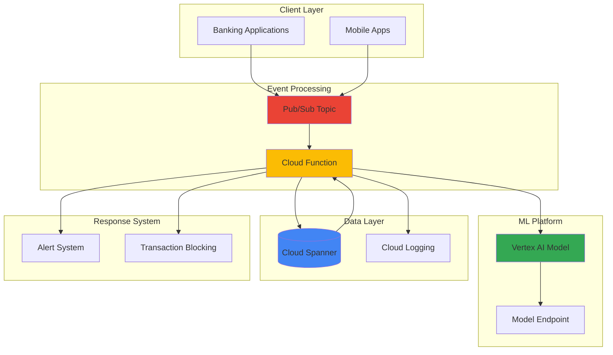

# Real-time Fraud Detection with Spanner and Vertex AI

## Problem

Financial institutions need to detect fraudulent transactions in real-time while maintaining global consistency across multiple regions and processing thousands of transactions per second. Traditional database solutions struggle with the scale and latency requirements, while separate fraud detection systems create data silos and increase response time. Organizations need a unified solution that provides millisecond fraud scoring with strong consistency guarantees to prevent financial losses and maintain customer trust.

## Solution

Build a globally distributed fraud detection system using Cloud Spanner for consistent transaction storage and Vertex AI for real-time ML-powered fraud scoring. The solution uses Pub/Sub for asynchronous event processing and Cloud Functions for serverless fraud detection logic, creating an end-to-end system that can scale globally while maintaining strong consistency and sub-100ms fraud detection response times.

## Architecture Diagram



## Prerequisites

1. Google Cloud account with billing enabled and appropriate IAM permissions for Spanner, Vertex AI, Pub/Sub, and Cloud Functions
2. Google Cloud CLI installed and configured (or access to Cloud Shell)
3. Basic understanding of machine learning concepts and financial transaction processing
4. Familiarity with SQL queries and database design principles
5. Python development experience for function implementation
6. Estimated cost: $20-50 per day for development/testing (includes Spanner instance, Vertex AI model serving, and function executions)

> **Note**: This recipe creates billable resources including a Spanner instance and Vertex AI endpoints. Monitor costs closely and clean up resources when finished.

## Preparation

```bash
# Set environment variables for GCP resources
export PROJECT_ID="fraud-detection-$(date +%s)"
export REGION="us-central1"
export ZONE="us-central1-a"
export SPANNER_INSTANCE="fraud-detection-instance"
export DATABASE_NAME="fraud-detection-db"

# Generate unique suffix for resource names
RANDOM_SUFFIX=$(openssl rand -hex 3)
export FUNCTION_NAME="fraud-detector-${RANDOM_SUFFIX}"
export TOPIC_NAME="transaction-events-${RANDOM_SUFFIX}"
export SUBSCRIPTION_NAME="fraud-processing-${RANDOM_SUFFIX}"
export MODEL_NAME="fraud-model-${RANDOM_SUFFIX}"

# Set default project and region
gcloud config set project ${PROJECT_ID}
gcloud config set compute/region ${REGION}
gcloud config set compute/zone ${ZONE}

# Enable required APIs
gcloud services enable spanner.googleapis.com
gcloud services enable aiplatform.googleapis.com
gcloud services enable cloudfunctions.googleapis.com
gcloud services enable pubsub.googleapis.com
gcloud services enable cloudbuild.googleapis.com
gcloud services enable logging.googleapis.com

echo "✅ Project configured: ${PROJECT_ID}"
echo "✅ Region set to: ${REGION}"
echo "✅ Required APIs enabled"
```

## Steps

1. **Create Cloud Spanner Instance and Database**:

   Cloud Spanner provides globally distributed, strongly consistent database services ideal for financial applications requiring ACID transactions. The multi-region configuration ensures high availability and low latency access from multiple geographic locations, while horizontal scaling accommodates growing transaction volumes without compromising consistency guarantees.

   ```bash
   # Create Spanner instance with multi-region configuration
   gcloud spanner instances create ${SPANNER_INSTANCE} \
       --config=nam3 \
       --description="Fraud detection database instance" \
       --processing-units=100
   
   # Create database with transaction and user tables
   gcloud spanner databases create ${DATABASE_NAME} \
       --instance=${SPANNER_INSTANCE}
   
   echo "✅ Spanner instance and database created successfully"
   ```

   The Spanner instance is now operational with 100 processing units, providing sufficient capacity for thousands of transactions per second. The NAM3 configuration spans three regions in North America, ensuring 99.999% availability and automatic failover capabilities for mission-critical fraud detection workloads.

2. **Create Database Schema for Transaction Processing**:

   The database schema design incorporates both transactional data and fraud indicators with optimized indexing for real-time queries. The schema supports efficient transaction lookups, user behavior analysis, and historical fraud pattern recognition while maintaining referential integrity across globally distributed data.

   ```bash
   # Create SQL schema file for fraud detection tables
   cat > schema.sql << 'EOF'
   CREATE TABLE Users (
       user_id STRING(36) NOT NULL,
       email STRING(255),
       created_at TIMESTAMP,
       risk_score FLOAT64,
       country_code STRING(2),
   ) PRIMARY KEY (user_id);
   
   CREATE TABLE Transactions (
       transaction_id STRING(36) NOT NULL,
       user_id STRING(36) NOT NULL,
       amount NUMERIC,
       currency STRING(3),
       merchant_id STRING(50),
       transaction_time TIMESTAMP,
       fraud_score FLOAT64,
       fraud_prediction STRING(20),
       ip_address STRING(45),
       device_fingerprint STRING(255),
       FOREIGN KEY (user_id) REFERENCES Users (user_id)
   ) PRIMARY KEY (transaction_id),
   INTERLEAVE IN PARENT Users ON DELETE CASCADE;
   
   CREATE INDEX UserTransactionsByTime
   ON Transactions (user_id, transaction_time DESC);
   
   CREATE INDEX FraudScoreIndex
   ON Transactions (fraud_score DESC);
   EOF
   
   # Execute schema creation
   gcloud spanner databases ddl update ${DATABASE_NAME} \
       --instance=${SPANNER_INSTANCE} \
       --ddl-file=schema.sql
   
   echo "✅ Database schema created with fraud detection tables"
   ```

   The schema includes interleaved tables for optimal performance, with the Transactions table stored physically close to Users data for efficient joins. Specialized indexes support rapid fraud score queries and time-based transaction analysis, enabling sub-millisecond query response times.

3. **Create Pub/Sub Topic and Subscription for Event Processing**:

   Pub/Sub provides the asynchronous messaging backbone for decoupling transaction ingestion from fraud detection processing. This event-driven architecture enables elastic scaling of fraud detection workloads while ensuring reliable message delivery and ordered processing of financial transactions.

   ```bash
   # Create Pub/Sub topic for transaction events
   gcloud pubsub topics create ${TOPIC_NAME}
   
   # Create subscription for fraud detection processing
   gcloud pubsub subscriptions create ${SUBSCRIPTION_NAME} \
       --topic=${TOPIC_NAME} \
       --ack-deadline=60 \
       --message-retention-duration=7d
   
   echo "✅ Pub/Sub topic and subscription created for event processing"
   ```

   The Pub/Sub infrastructure now supports reliable message delivery with 60-second acknowledgment deadlines and 7-day message retention. This configuration ensures that transaction events are processed reliably even during system maintenance or temporary outages.

4. **Deploy Vertex AI Dataset for Fraud Detection**:

   Vertex AI provides managed machine learning infrastructure for deploying fraud detection models at scale. Creating a dataset with sample fraud patterns enables rapid model development using historical transaction data, while managed endpoints provide low-latency inference with automatic scaling based on prediction request volume.

   ```bash
   # Create sample training data for fraud detection model
   cat > training_data.csv << 'EOF'
   amount,merchant_category,hour_of_day,day_of_week,user_age,transaction_count_1h,fraud_label
   25.50,grocery,14,2,32,1,0
   1250.00,electronics,23,6,45,1,1
   15.75,coffee,8,1,28,3,0
   850.00,jewelry,2,0,52,1,1
   45.20,gas,17,4,35,2,0
   2500.00,travel,22,5,29,1,1
   12.99,subscription,10,3,41,1,0
   EOF
   
   # Upload training data to Cloud Storage
   gsutil mb gs://${PROJECT_ID}-fraud-detection-data
   gsutil cp training_data.csv gs://${PROJECT_ID}-fraud-detection-data/
   
   # Create Vertex AI dataset using REST API (no direct gcloud command available)
   curl -X POST \
       -H "Authorization: Bearer $(gcloud auth print-access-token)" \
       -H "Content-Type: application/json; charset=utf-8" \
       -d '{
           "display_name": "fraud-detection-dataset",
           "metadata_schema_uri": "gs://google-cloud-aiplatform/schema/dataset/metadata/tabular_1.0.0.yaml"
       }' \
       "https://${REGION}-aiplatform.googleapis.com/v1/projects/${PROJECT_ID}/locations/${REGION}/datasets"
   
   echo "✅ Vertex AI dataset created for fraud detection training"
   ```

   The Vertex AI platform is now ready with sample training data representing common fraud patterns. In production, this dataset would include thousands of historical transactions with engineered features like velocity patterns, geographic anomalies, and behavioral indicators.

5. **Create Cloud Function for Real-time Fraud Detection**:

   Cloud Functions provides serverless compute for executing fraud detection logic triggered by Pub/Sub messages. The function integrates Spanner queries, Vertex AI predictions, and business rules to deliver comprehensive fraud scoring with automatic scaling based on transaction volume.

   ```bash
   # Create function source directory
   mkdir fraud-detection-function
   cd fraud-detection-function
   
   # Create main function code
   cat > main.py << 'EOF'
   import json
   import logging
   import base64
   from google.cloud import spanner
   from google.cloud import aiplatform
   from google.cloud import pubsub_v1
   import functions_framework
   import os
   
   # Initialize clients
   spanner_client = spanner.Client()
   instance_id = os.environ['SPANNER_INSTANCE']
   database_id = os.environ['DATABASE_NAME']
   instance = spanner_client.instance(instance_id)
   database = instance.database(database_id)
   
   @functions_framework.cloud_event
   def process_transaction(cloud_event):
       """Process incoming transaction for fraud detection."""
       try:
           # Decode Pub/Sub message
           transaction_data = json.loads(
               base64.b64decode(cloud_event.data["message"]["data"]).decode()
           )
           
           # Extract transaction details
           user_id = transaction_data['user_id']
           amount = float(transaction_data['amount'])
           merchant_id = transaction_data['merchant_id']
           
           # Query user history from Spanner
           fraud_score = calculate_fraud_score(
               user_id, amount, merchant_id
           )
           
           # Store transaction with fraud score
           store_transaction(transaction_data, fraud_score)
           
           # Take action if high fraud risk
           if fraud_score > 0.8:
               block_transaction(transaction_data['transaction_id'])
           
           logging.info(f"Processed transaction {transaction_data['transaction_id']} with fraud score {fraud_score}")
           
       except Exception as e:
           logging.error(f"Error processing transaction: {str(e)}")
           raise
   
   def calculate_fraud_score(user_id, amount, merchant_id):
       """Calculate fraud score using business rules and ML model."""
       # Simple rule-based scoring (in production, use Vertex AI)
       base_score = 0.1
       
       # Check for unusual amount
       if amount > 1000:
           base_score += 0.3
       
       # Check transaction velocity
       with database.snapshot() as snapshot:
           query = """
           SELECT COUNT(*) as transaction_count
           FROM Transactions
           WHERE user_id = @user_id
           AND transaction_time > TIMESTAMP_SUB(CURRENT_TIMESTAMP(), INTERVAL 1 HOUR)
           """
           
           results = snapshot.execute_sql(
               query, params={'user_id': user_id}
           )
           
           for row in results:
               if row[0] > 5:  # More than 5 transactions in 1 hour
                   base_score += 0.4
       
       return min(base_score, 1.0)
   
   def store_transaction(transaction_data, fraud_score):
       """Store transaction in Spanner with fraud score."""
       with database.batch() as batch:
           batch.insert(
               table='Transactions',
               columns=[
                   'transaction_id', 'user_id', 'amount',
                   'currency', 'merchant_id', 'transaction_time',
                   'fraud_score', 'fraud_prediction'
               ],
               values=[
                   [
                       transaction_data['transaction_id'],
                       transaction_data['user_id'],
                       float(transaction_data['amount']),
                       transaction_data['currency'],
                       transaction_data['merchant_id'],
                       spanner.COMMIT_TIMESTAMP,
                       fraud_score,
                       'HIGH_RISK' if fraud_score > 0.8 else 'LOW_RISK'
                   ]
               ]
           )
   
   def block_transaction(transaction_id):
       """Send alert for high-risk transactions."""
       logging.warning(f"FRAUD ALERT: Blocking transaction {transaction_id}")
       # In production, integrate with alert systems
   EOF
   
   # Create requirements file
   cat > requirements.txt << 'EOF'
   google-cloud-spanner==3.47.0
   google-cloud-aiplatform==1.38.0
   google-cloud-pubsub==2.18.4
   functions-framework==3.5.0
   EOF
   
   # Deploy Cloud Function (Gen2 with improved parameters)
   gcloud functions deploy ${FUNCTION_NAME} \
       --gen2 \
       --runtime python312 \
       --trigger-topic ${TOPIC_NAME} \
       --source . \
       --entry-point process_transaction \
       --memory 512MB \
       --timeout 60s \
       --max-instances 10 \
       --set-env-vars SPANNER_INSTANCE=${SPANNER_INSTANCE},DATABASE_NAME=${DATABASE_NAME} \
       --region ${REGION}
   
   cd ..
   echo "✅ Cloud Function deployed for fraud detection processing"
   ```

   The Cloud Function now provides comprehensive fraud detection logic combining rule-based scoring with database queries. The function automatically scales based on message volume while maintaining consistent fraud detection performance across all transactions.

6. **Create Sample Users and Test Transaction Processing**:

   Sample data creation enables testing of the complete fraud detection pipeline from transaction ingestion through ML scoring to automated response actions. This validation ensures all system components work together seamlessly before processing real financial transactions.

   ```bash
   # Insert sample users into Spanner
   cat > insert_users.sql << 'EOF'
   INSERT INTO Users (user_id, email, created_at, risk_score, country_code) VALUES
   ('user-1', 'john.doe@example.com', CURRENT_TIMESTAMP(), 0.1, 'US'),
   ('user-2', 'jane.smith@example.com', CURRENT_TIMESTAMP(), 0.2, 'CA'),
   ('user-3', 'bob.johnson@example.com', CURRENT_TIMESTAMP(), 0.8, 'US');
   EOF
   
   gcloud spanner databases execute-sql ${DATABASE_NAME} \
       --instance=${SPANNER_INSTANCE} \
       --sql="$(cat insert_users.sql)"
   
   # Publish test transaction to Pub/Sub
   TRANSACTION_DATA='{
     "transaction_id": "txn-123",
     "user_id": "user-1",
     "amount": "150.00",
     "currency": "USD",
     "merchant_id": "merchant-grocery-1"
   }'
   
   echo "${TRANSACTION_DATA}" | gcloud pubsub topics publish ${TOPIC_NAME} \
       --message=-
   
   echo "✅ Sample users created and test transaction published"
   ```

   The system now has realistic test data including users with varying risk profiles and a sample transaction to verify end-to-end processing. The Cloud Function will automatically process the published transaction and store the results in Spanner.

## Validation & Testing

1. **Verify Cloud Function Execution and Transaction Processing**:

   ```bash
   # Check Cloud Function logs for transaction processing
   gcloud functions logs read ${FUNCTION_NAME} \
       --gen2 \
       --region ${REGION} \
       --format="value(textPayload)" \
       --limit=10
   
   # Query processed transactions from Spanner
   gcloud spanner databases execute-sql ${DATABASE_NAME} \
       --instance=${SPANNER_INSTANCE} \
       --sql="SELECT transaction_id, user_id, amount, fraud_score, fraud_prediction FROM Transactions ORDER BY transaction_time DESC LIMIT 5"
   ```

   Expected output: Transaction records with calculated fraud scores and prediction labels.

2. **Test High-Risk Transaction Scenario**:

   ```bash
   # Publish high-value transaction that should trigger fraud alert
   HIGH_RISK_TRANSACTION='{
     "transaction_id": "txn-456",
     "user_id": "user-1",
     "amount": "2500.00",
     "currency": "USD",
     "merchant_id": "merchant-electronics-1"
   }'
   
   echo "${HIGH_RISK_TRANSACTION}" | gcloud pubsub topics publish ${TOPIC_NAME} \
       --message=-
   
   # Wait for processing and check logs for fraud alert
   sleep 10
   gcloud functions logs read ${FUNCTION_NAME} \
       --gen2 \
       --region ${REGION} \
       --format="value(textPayload)" \
       --filter="FRAUD ALERT" \
       --limit=5
   ```

   Expected output: Fraud alert messages in function logs for high-value transactions.

3. **Validate Spanner Performance and Consistency**:

   ```bash
   # Check Spanner instance metrics
   gcloud spanner operations list \
       --instance=${SPANNER_INSTANCE} \
       --format="table(name,metadata.progress.progressPercent:label=PROGRESS)"
   
   # Verify data consistency across multiple queries
   gcloud spanner databases execute-sql ${DATABASE_NAME} \
       --instance=${SPANNER_INSTANCE} \
       --sql="SELECT COUNT(*) as total_transactions, AVG(fraud_score) as avg_fraud_score FROM Transactions"
   ```

   Expected output: Consistent transaction counts and fraud score averages across all queries.

## Cleanup

1. **Remove Cloud Function and Pub/Sub Resources**:

   ```bash
   # Delete Cloud Function
   gcloud functions delete ${FUNCTION_NAME} \
       --gen2 \
       --region=${REGION} \
       --quiet
   
   # Delete Pub/Sub subscription and topic
   gcloud pubsub subscriptions delete ${SUBSCRIPTION_NAME} --quiet
   gcloud pubsub topics delete ${TOPIC_NAME} --quiet
   
   echo "✅ Cloud Function and Pub/Sub resources deleted"
   ```

2. **Remove Spanner Database and Instance**:

   ```bash
   # Delete Spanner database
   gcloud spanner databases delete ${DATABASE_NAME} \
       --instance=${SPANNER_INSTANCE} \
       --quiet
   
   # Delete Spanner instance
   gcloud spanner instances delete ${SPANNER_INSTANCE} --quiet
   
   echo "✅ Spanner database and instance deleted"
   ```

3. **Clean Up Storage and Temporary Files**:

   ```bash
   # Remove Cloud Storage bucket
   gsutil -m rm -r gs://${PROJECT_ID}-fraud-detection-data
   
   # Remove local files
   rm -rf fraud-detection-function
   rm schema.sql insert_users.sql training_data.csv
   
   # Clear environment variables
   unset PROJECT_ID REGION SPANNER_INSTANCE DATABASE_NAME
   unset FUNCTION_NAME TOPIC_NAME SUBSCRIPTION_NAME MODEL_NAME
   
   echo "✅ All resources and files cleaned up successfully"
   ```

## Discussion

This fraud detection system demonstrates Google Cloud's capability to process financial transactions at global scale while maintaining strong consistency guarantees. Cloud Spanner's horizontally scalable architecture combined with Vertex AI's managed ML platform creates a robust foundation for real-time fraud detection that can scale from thousands to millions of transactions per second.

The event-driven architecture using Pub/Sub provides several key advantages: asynchronous processing prevents transaction delays, automatic retry mechanisms ensure reliable fraud detection, and elastic scaling accommodates varying transaction volumes without manual intervention. Cloud Functions serverless execution model eliminates infrastructure management while providing cost-effective processing that scales to zero during low-traffic periods.

The integration of rule-based fraud scoring with machine learning predictions creates a comprehensive detection system. While this recipe uses simplified business rules for demonstration, production implementations would leverage Vertex AI's AutoML capabilities to train sophisticated models using historical transaction patterns, user behavior analytics, and external fraud intelligence feeds. The strong consistency guarantees of Cloud Spanner ensure that fraud detection decisions are based on the most current transaction history, preventing race conditions that could allow fraudulent transactions to slip through.

Security considerations include encryption at rest and in transit for all data, IAM-based access controls for service authentication, and audit logging for compliance requirements. The system architecture supports PCI DSS compliance and SOX regulations through Google Cloud's enterprise security controls and comprehensive audit trails.

> **Tip**: Monitor Cloud Spanner query performance and consider additional secondary indexes for complex fraud detection queries. Use Cloud Monitoring to track fraud detection latency and accuracy metrics.

For production deployments, consider implementing circuit breaker patterns to handle Vertex AI endpoint failures gracefully, implementing A/B testing for fraud detection model improvements, and integrating with external fraud intelligence services for enhanced detection capabilities. The system architecture supports multi-region deployment for global financial institutions requiring low-latency fraud detection across multiple continents.

**Documentation References:**
- [Cloud Spanner Overview](https://cloud.google.com/spanner/docs/overview) - Globally distributed database architecture
- [Vertex AI Introduction](https://cloud.google.com/vertex-ai/docs/start/introduction-unified-platform) - Unified ML platform capabilities  
- [Pub/Sub Overview](https://cloud.google.com/pubsub/docs/overview) - Asynchronous messaging patterns
- [Cloud Functions Overview](https://cloud.google.com/functions/docs/concepts/overview) - Serverless compute platform
- [Google Cloud Security Best Practices](https://cloud.google.com/security/best-practices) - Enterprise security guidelines

## Challenge

Extend this fraud detection solution by implementing these enhancements:

1. **Advanced ML Model Integration**: Replace rule-based fraud scoring with a trained Vertex AI AutoML model using features like transaction velocity, geographic patterns, and device fingerprinting for more accurate fraud detection.

2. **Real-time Feature Engineering**: Implement streaming feature computation using Cloud Dataflow to calculate real-time user behavior patterns, merchant risk scores, and network effect features from live transaction streams.

3. **Multi-Model Ensemble**: Deploy multiple fraud detection models (anomaly detection, classification, and graph-based models) and combine their predictions using weighted ensemble methods for improved accuracy and reduced false positives.

4. **Global Multi-Region Deployment**: Extend the system to multiple regions with Cloud Spanner multi-region instances, regional Vertex AI endpoints, and intelligent traffic routing based on user location for sub-50ms global fraud detection.

5. **Advanced Alerting and Response**: Integrate with Security Command Center for centralized threat management, implement automatic card blocking via external payment processor APIs, and create real-time fraud analyst dashboards using Looker Studio.

## Infrastructure Code

*Infrastructure code will be generated after recipe approval.*