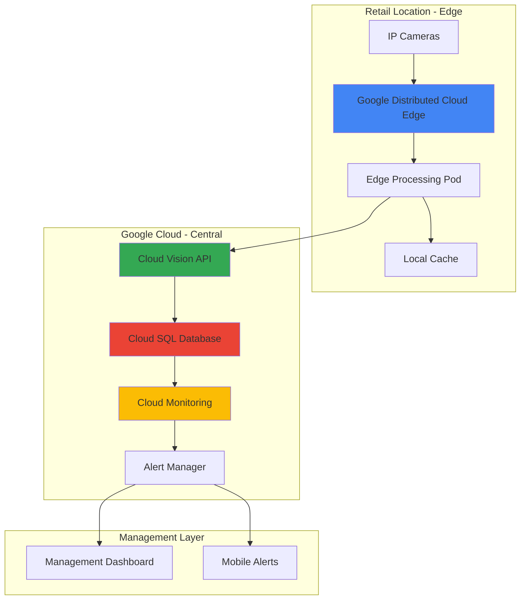

# Real-Time Inventory Intelligence with Google Distributed Cloud Edge and Cloud Vision

## Problem

Modern retail operations struggle with inventory visibility across multiple locations, leading to stockouts that cost the industry billions annually. Traditional manual inventory counting methods are time-consuming, error-prone, and provide only point-in-time snapshots rather than continuous monitoring. Retailers need an automated solution that can process visual data at the edge with minimal latency while maintaining centralized oversight of inventory levels across their entire network.

## Solution

This solution combines Google Distributed Cloud Edge with Cloud Vision API to create an intelligent inventory management system that processes camera feeds locally at each retail location. Edge computing ensures low-latency analysis of shelf images, while Cloud Vision API provides accurate product detection and counting. The system automatically identifies stockouts, tracks inventory levels in real-time, and sends alerts to supply chain teams for proactive restocking decisions.

## Architecture Diagram



## Prerequisites

1. Google Cloud account with billing enabled
2. Google Distributed Cloud Edge hardware deployment at retail location
3. Basic understanding of Kubernetes and container orchestration
4. IP cameras or image capture devices at retail locations
5. gcloud CLI installed and configured (version 400.0.0 or later)
6. Estimated cost: $150-300 per location per month for edge hardware and cloud services

> **Note**: Google Distributed Cloud Edge requires physical hardware deployment and may take 2-4 weeks for initial setup. Contact Google Cloud sales for hardware provisioning and installation coordination.

## Preparation

```bash
# Set environment variables for the project
export PROJECT_ID="inventory-intelligence-$(date +%s)"
export REGION="us-central1"
export ZONE="us-central1-a"
export CLUSTER_NAME="inventory-edge-cluster"

# Generate unique identifiers for resources
RANDOM_SUFFIX=$(openssl rand -hex 3)
export DB_INSTANCE_NAME="inventory-db-${RANDOM_SUFFIX}"
export BUCKET_NAME="inventory-images-${RANDOM_SUFFIX}"

# Set default project and region
gcloud config set project ${PROJECT_ID}
gcloud config set compute/region ${REGION}
gcloud config set compute/zone ${ZONE}

# Enable required APIs
gcloud services enable vision.googleapis.com
gcloud services enable sqladmin.googleapis.com
gcloud services enable monitoring.googleapis.com
gcloud services enable container.googleapis.com
gcloud services enable cloudbuild.googleapis.com

echo "✅ Project configured: ${PROJECT_ID}"
echo "✅ Required APIs enabled"
```

## Steps

1. **Create Cloud SQL Database for Inventory Data**:

   Cloud SQL provides a fully managed relational database service that serves as the central repository for inventory data across all retail locations. This managed service ensures high availability, automatic backups, and seamless scaling while maintaining ACID compliance for critical inventory transactions. The database will store product information, inventory counts, threshold settings, and historical tracking data.

   ```bash
   # Create Cloud SQL instance for inventory management
   gcloud sql instances create ${DB_INSTANCE_NAME} \
       --database-version=POSTGRES_14 \
       --tier=db-f1-micro \
       --region=${REGION} \
       --storage-type=SSD \
       --storage-size=20GB \
       --backup-start-time=03:00
   
   # Set root password
   gcloud sql users set-password postgres \
       --instance=${DB_INSTANCE_NAME} \
       --password="SecureInventoryPass123!"
   
   # Create inventory database
   gcloud sql databases create inventory_intelligence \
       --instance=${DB_INSTANCE_NAME}
   
   echo "✅ Cloud SQL database created and configured"
   ```

   The Cloud SQL instance is now ready with automated backups and monitoring enabled. This foundational database component will handle all inventory data transactions with Google's enterprise-grade reliability and security, ensuring that inventory intelligence remains available even during high-traffic periods or system maintenance windows.

2. **Set up Cloud Storage for Image Processing**:

   Cloud Storage provides the scalable, secure repository for storing camera images and processed results. This global storage service integrates seamlessly with Cloud Vision API and supports the high-throughput image processing requirements of multiple retail locations. The bucket configuration includes lifecycle policies for cost optimization and appropriate security settings for retail data protection.

   ```bash
   # Create storage bucket for images and processing results
   gsutil mb -p ${PROJECT_ID} \
       -c STANDARD \
       -l ${REGION} \
       gs://${BUCKET_NAME}
   
   # Configure bucket for Vision API access
   gsutil iam ch serviceAccount:service-${PROJECT_ID}@gcp-sa-vision.iam.gserviceaccount.com:objectViewer \
       gs://${BUCKET_NAME}
   
   # Set lifecycle policy for cost optimization
   cat > lifecycle.json << EOF
   {
     "rule": [
       {
         "action": {"type": "Delete"},
         "condition": {"age": 30}
       }
     ]
   }
   EOF
   
   gsutil lifecycle set lifecycle.json gs://${BUCKET_NAME}
   
   echo "✅ Cloud Storage bucket configured with lifecycle policy"
   ```

   The storage infrastructure is now configured with appropriate access controls and cost optimization policies. Images will be automatically deleted after 30 days to manage storage costs while maintaining sufficient historical data for trend analysis and model improvement.

3. **Create Service Account for Edge Processing**:

   Identity and Access Management (IAM) service accounts provide secure, least-privilege access for edge computing workloads to interact with Google Cloud services. This service account will enable the edge processing pods to authenticate with Cloud Vision API and Cloud SQL while maintaining security boundaries between different system components.

   ```bash
   # Create service account for edge processing
   gcloud iam service-accounts create inventory-edge-processor \
       --display-name="Inventory Edge Processor" \
       --description="Service account for edge inventory processing"
   
   export SERVICE_ACCOUNT_EMAIL="inventory-edge-processor@${PROJECT_ID}.iam.gserviceaccount.com"
   
   # Grant necessary permissions
   gcloud projects add-iam-policy-binding ${PROJECT_ID} \
       --member="serviceAccount:${SERVICE_ACCOUNT_EMAIL}" \
       --role="roles/ml.developer"
   
   gcloud projects add-iam-policy-binding ${PROJECT_ID} \
       --member="serviceAccount:${SERVICE_ACCOUNT_EMAIL}" \
       --role="roles/cloudsql.client"
   
   gcloud projects add-iam-policy-binding ${PROJECT_ID} \
       --member="serviceAccount:${SERVICE_ACCOUNT_EMAIL}" \
       --role="roles/storage.objectAdmin"
   
   # Create and download service account key
   gcloud iam service-accounts keys create inventory-edge-key.json \
       --iam-account=${SERVICE_ACCOUNT_EMAIL}
   
   echo "✅ Service account created with appropriate permissions"
   ```

   The service account is now configured with precise permissions following Google Cloud's principle of least privilege. This security foundation ensures that edge processing workloads can access only the specific cloud services required for inventory intelligence operations.

4. **Deploy Edge Processing Application**:

   Google Distributed Cloud Edge enables running containerized applications at retail locations with the same Kubernetes APIs as Google Cloud. This edge deployment reduces latency for image processing while maintaining connectivity to central cloud services for data persistence and monitoring. The application processes camera feeds locally and triggers Cloud Vision API calls for accurate product detection.

   ```bash
   # Create Kubernetes deployment manifest for edge processing
   cat > inventory-processor-deployment.yaml << EOF
   apiVersion: apps/v1
   kind: Deployment
   metadata:
     name: inventory-processor
     namespace: default
   spec:
     replicas: 2
     selector:
       matchLabels:
         app: inventory-processor
     template:
       metadata:
         labels:
           app: inventory-processor
       spec:
         serviceAccountName: inventory-edge-processor
         containers:
         - name: processor
           image: gcr.io/google-samples/vision-product-search:latest
           env:
           - name: PROJECT_ID
             value: "${PROJECT_ID}"
           - name: BUCKET_NAME
             value: "${BUCKET_NAME}"
           - name: DB_INSTANCE_CONNECTION
             value: "${PROJECT_ID}:${REGION}:${DB_INSTANCE_NAME}"
           resources:
             requests:
               memory: "256Mi"
               cpu: "250m"
             limits:
               memory: "512Mi"
               cpu: "500m"
           ports:
           - containerPort: 8080
         - name: cloud-sql-proxy
           image: gcr.io/cloud-sql-connectors/cloud-sql-proxy:2.18.0
           command:
           - "/cloud-sql-proxy"
           - "--address=0.0.0.0"
           - "--port=5432"
           - "${PROJECT_ID}:${REGION}:${DB_INSTANCE_NAME}"
           securityContext:
             runAsNonRoot: true
   EOF
   
   # Apply the deployment to edge cluster
   kubectl apply -f inventory-processor-deployment.yaml
   
   # Create service for internal communication
   kubectl expose deployment inventory-processor \
       --type=ClusterIP \
       --port=8080 \
       --target-port=8080
   
   echo "✅ Edge processing application deployed to Distributed Cloud Edge"
   ```

   The edge processing application is now running on Google Distributed Cloud Edge infrastructure, providing local compute capabilities with cloud connectivity. This hybrid architecture ensures minimal latency for real-time inventory monitoring while leveraging Google Cloud's AI and data services for intelligent analysis.

5. **Configure Cloud Vision API Integration**:

   Cloud Vision API provides state-of-the-art computer vision capabilities powered by Google's machine learning expertise. The Product Search feature specifically addresses retail inventory use cases by identifying products, reading labels, and counting items on shelves. This integration enables accurate, automated inventory tracking without manual intervention.

   ```bash
   # Create a Product Set for inventory items using beta API
   gcloud beta ml vision product-search product-sets create \
       --display-name="Retail Inventory Products" \
       --product-set-id="retail_inventory_set" \
       --location=${REGION}
   
   # Create sample product for demonstration
   gcloud beta ml vision product-search products create \
       --display-name="Sample Product" \
       --product-category="packagedgoods" \
       --product-id="sample_product_001" \
       --location=${REGION}
   
   # Add product to product set
   gcloud beta ml vision product-search product-sets add-product \
       --product-set-id="retail_inventory_set" \
       --product-id="sample_product_001" \
       --location=${REGION}
   
   # Create monitoring alert policy for inventory thresholds
   cat > inventory-alert-policy.yaml << EOF
   displayName: "Low Inventory Alert"
   documentation:
     content: "Alert when inventory levels fall below threshold"
   conditions:
   - displayName: "Inventory Count Low"
     conditionThreshold:
       filter: 'resource.type="global"'
       comparison: COMPARISON_LESS_THAN
       thresholdValue: 10
   notificationChannels: []
   EOF
   
   gcloud alpha monitoring policies create \
       --policy-from-file=inventory-alert-policy.yaml
   
   echo "✅ Cloud Vision API configured for product recognition"
   ```

   The Vision API integration is now configured with product sets and monitoring capabilities. This intelligent foundation enables the system to recognize specific products, track quantities, and trigger automated alerts when inventory levels require attention.

6. **Set up Real-time Monitoring Dashboard**:

   Cloud Monitoring provides comprehensive observability for the inventory intelligence system, tracking both technical metrics and business KPIs. Custom dashboards visualize inventory levels, processing latency, and system health across all retail locations, enabling proactive management of both infrastructure and inventory operations.

   ```bash
   # Create custom dashboard for inventory monitoring
   cat > inventory-dashboard.json << EOF
   {
     "displayName": "Inventory Intelligence Dashboard",
     "mosaicLayout": {
       "tiles": [
         {
           "width": 6,
           "height": 4,
           "widget": {
             "title": "Inventory Levels by Location",
             "scorecard": {
               "timeSeriesQuery": {
                 "timeSeriesFilter": {
                   "filter": "resource.type=\"global\"",
                   "aggregation": {
                     "alignmentPeriod": "60s",
                     "perSeriesAligner": "ALIGN_MEAN"
                   }
                 }
               }
             }
           }
         }
       ]
     }
   }
   EOF
   
   gcloud monitoring dashboards create \
       --config-from-file=inventory-dashboard.json
   
   # Set up notification channel for alerts
   gcloud alpha monitoring channels create \
       --display-name="Inventory Alerts" \
       --type=email \
       --channel-labels=email_address=inventory-alerts@yourcompany.com
   
   echo "✅ Monitoring dashboard and alerting configured"
   ```

   The monitoring infrastructure now provides real-time visibility into inventory operations with automated alerting capabilities. This observability foundation supports both operational excellence and business intelligence for supply chain optimization.

## Validation & Testing

1. **Verify Edge Cluster Connectivity**:

   ```bash
   # Check cluster status and pod health
   kubectl get nodes
   kubectl get pods -l app=inventory-processor
   
   # Verify service account permissions
   kubectl auth can-i list pods \
       --as=system:serviceaccount:default:inventory-edge-processor
   ```

   Expected output: All nodes should show "Ready" status and processor pods should be "Running"

2. **Test Vision API Integration**:

   ```bash
   # Upload test image and process with Vision API
   gsutil cp test-shelf-image.jpg gs://${BUCKET_NAME}/test/
   
   # Test product detection
   gcloud ml vision detect-objects gs://${BUCKET_NAME}/test/test-shelf-image.jpg
   
   # Verify product set configuration
   gcloud beta ml vision product-search product-sets list \
       --location=${REGION}
   ```

   Expected output: Vision API should return detected objects with confidence scores

3. **Validate Database Connectivity**:

   ```bash
   # Test Cloud SQL connection
   gcloud sql connect ${DB_INSTANCE_NAME} --user=postgres
   
   # Within psql, verify database setup
   \c inventory_intelligence
   \dt
   ```

   Expected output: Successfully connect to database and list tables

4. **Test Monitoring and Alerting**:

   ```bash
   # Verify monitoring metrics collection
   gcloud monitoring metrics list \
       --filter="metric.type:custom.googleapis.com/inventory"
   
   # Check alert policy status
   gcloud alpha monitoring policies list
   ```

   Expected output: Custom metrics should be visible and alert policies should be active

## Cleanup

1. **Remove Kubernetes deployments**:

   ```bash
   # Delete edge processing deployment
   kubectl delete deployment inventory-processor
   kubectl delete service inventory-processor
   
   # Clean up service account
   kubectl delete serviceaccount inventory-edge-processor
   
   echo "✅ Kubernetes resources cleaned up"
   ```

2. **Delete Cloud SQL instance**:

   ```bash
   # Remove database instance
   gcloud sql instances delete ${DB_INSTANCE_NAME} --quiet
   
   echo "✅ Cloud SQL instance deleted"
   ```

3. **Clean up Vision API resources**:

   ```bash
   # Remove product sets and products
   gcloud beta ml vision product-search product-sets remove-product \
       --product-set-id="retail_inventory_set" \
       --product-id="sample_product_001" \
       --location=${REGION}
   
   gcloud beta ml vision product-search products delete \
       --product-id="sample_product_001" \
       --location=${REGION}
   
   gcloud beta ml vision product-search product-sets delete \
       --product-set-id="retail_inventory_set" \
       --location=${REGION}
   
   echo "✅ Vision API resources cleaned up"
   ```

4. **Remove storage and monitoring resources**:

   ```bash
   # Delete storage bucket and contents
   gsutil -m rm -r gs://${BUCKET_NAME}
   
   # Remove monitoring dashboards and alerts
   gcloud monitoring dashboards list --format="value(name)" | \
       xargs -I {} gcloud monitoring dashboards delete {} --quiet
   
   # Delete IAL service account
   gcloud iam service-accounts delete ${SERVICE_ACCOUNT_EMAIL} --quiet
   
   # Clean up local files
   rm -f inventory-edge-key.json lifecycle.json \
       inventory-*.yaml inventory-*.json
   
   echo "✅ All resources cleaned up successfully"
   ```

## Discussion

This inventory intelligence solution demonstrates the power of combining edge computing with cloud-based AI services to solve real-world retail challenges. Google Distributed Cloud Edge provides the low-latency processing required for real-time inventory monitoring, while Cloud Vision API delivers the accuracy needed for reliable product detection and counting. This hybrid architecture ensures that inventory intelligence remains operational even during network disruptions, with local caching and processing capabilities maintaining core functionality.

The integration of Cloud SQL and Cloud Monitoring creates a comprehensive data foundation that supports both operational decision-making and strategic supply chain optimization. By processing visual data at the edge and aggregating insights in the cloud, retailers can achieve sub-second response times for inventory alerts while maintaining centralized visibility across their entire network. This approach significantly reduces stockout incidents and optimizes inventory turnover rates through data-driven restocking decisions.

The security model implemented through IAM service accounts and least-privilege access ensures that sensitive retail data remains protected while enabling the system integration required for intelligent automation. Cloud Vision API's product search capabilities can be trained on specific retail inventory to improve accuracy over time, while the monitoring infrastructure provides the observability needed to optimize both technical performance and business outcomes. For more information on Google Distributed Cloud Edge deployment patterns, see the [Google Distributed Cloud documentation](https://cloud.google.com/distributed-cloud/edge/latest/docs). Additional guidance on Cloud Vision API for retail applications is available in the [Vision API retail solutions guide](https://cloud.google.com/vision/docs/retail-product-search). For best practices on edge computing architectures, consult the [Google Cloud Architecture Framework](https://cloud.google.com/architecture/framework). Security considerations for retail applications are detailed in the [Google Cloud retail security guide](https://cloud.google.com/security/solutions/retail), and cost optimization strategies can be found in the [Cloud cost management documentation](https://cloud.google.com/cost-management/docs).

> **Tip**: Implement image preprocessing at the edge to reduce bandwidth usage and improve Vision API response times. Consider using TensorFlow Lite models for initial filtering before sending images to Cloud Vision API for detailed analysis.

## Challenge

Extend this solution by implementing these enhancements:

1. **Smart Restocking Predictions**: Integrate BigQuery and Vertex AI to analyze historical inventory patterns and predict optimal restocking schedules based on seasonal trends, local events, and customer behavior patterns.

2. **Multi-Store Inventory Optimization**: Implement Cloud Spanner for global consistency and develop algorithms to automatically redistribute inventory between locations based on demand forecasting and transportation costs.

3. **Customer Behavior Analytics**: Add Cloud Dataflow for real-time stream processing of customer movement patterns combined with inventory data to optimize product placement and store layout for maximum sales efficiency.

4. **Automated Supplier Integration**: Create Cloud Functions triggers that automatically generate purchase orders and communicate with supplier APIs when inventory thresholds are reached, including integration with procurement systems and approval workflows.

5. **Advanced Computer Vision Models**: Train custom AutoML Vision models specific to your product catalog for improved accuracy, including support for detecting product orientation, damaged goods, and expired items through expiration date recognition.

## Infrastructure Code

### Available Infrastructure as Code:

- [Infrastructure Code Overview](code/README.md) - Detailed description of all infrastructure components
- [Infrastructure Manager](code/infrastructure-manager/) - GCP Infrastructure Manager templates
- [Bash CLI Scripts](code/scripts/) - Example bash scripts using gcloud CLI commands to deploy infrastructure
- [Terraform](code/terraform/) - Terraform configuration files