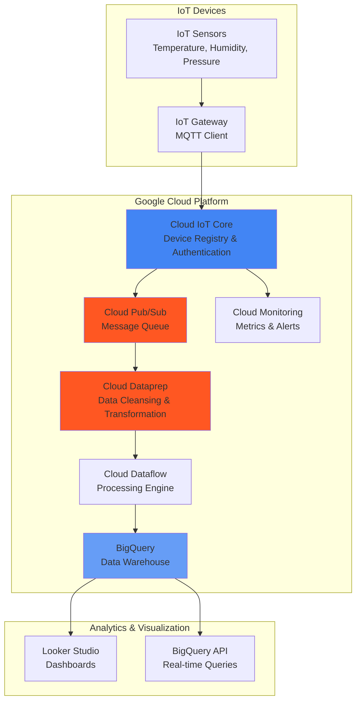

# Real-Time IoT Data Processing with Cloud IoT Core and Cloud Dataprep

## Problem

Manufacturing companies and smart city operators face challenges with processing massive volumes of sensor data from thousands of connected devices in real-time. Raw IoT data typically contains inconsistencies, missing values, and varying formats that make immediate analytics impossible. Traditional ETL processes are too slow and inflexible to handle the velocity and variety of IoT data streams, resulting in delayed insights and missed opportunities for predictive maintenance or real-time optimization.

## Solution

This solution creates an end-to-end IoT data pipeline using Google Cloud's native services to automatically ingest, cleanse, and analyze sensor data. Cloud IoT Core securely connects devices and routes telemetry through Cloud Pub/Sub, while Cloud Dataprep automatically identifies and corrects data quality issues using machine learning. The processed data flows into BigQuery for real-time analytics, enabling immediate insights and predictive analytics capabilities.

## Architecture Diagram



## Prerequisites

1. Google Cloud account with billing enabled and Owner permissions
2. gcloud CLI v2.450.0+ installed and configured (or Cloud Shell)
3. Basic understanding of IoT protocols (MQTT) and data analytics concepts
4. Python 3.8+ for device simulation scripts
5. Estimated cost: $15-25 for running this recipe (Cloud IoT Core, Pub/Sub, Dataflow, BigQuery)

> **Warning**: Cloud IoT Core was deprecated on August 16, 2023. This recipe is provided for educational purposes to demonstrate IoT data processing patterns. For production use, consider [Google's recommended IoT partners](https://cloud.google.com/iot-core/docs/how-to/devices) or alternative MQTT brokers like Cloud Run with Mosquitto.

## Preparation

```bash
# Set environment variables for project configuration
export PROJECT_ID="iot-pipeline-$(date +%s)"
export REGION="us-central1"
export ZONE="us-central1-a"

# Generate unique identifiers for resources
RANDOM_SUFFIX=$(openssl rand -hex 3)
export IOT_REGISTRY_ID="sensor-registry-${RANDOM_SUFFIX}"
export DEVICE_ID="temperature-sensor-${RANDOM_SUFFIX}"
export PUBSUB_TOPIC="iot-telemetry-${RANDOM_SUFFIX}"
export PUBSUB_SUBSCRIPTION="iot-data-subscription-${RANDOM_SUFFIX}"
export BIGQUERY_DATASET="iot_analytics_${RANDOM_SUFFIX//-/_}"
export BIGQUERY_TABLE="sensor_readings"

# Create new project for isolation
gcloud projects create ${PROJECT_ID} \
    --name="IoT Data Processing Pipeline"

# Set active project and region
gcloud config set project ${PROJECT_ID}
gcloud config set compute/region ${REGION}
gcloud config set compute/zone ${ZONE}

# Link billing account (replace with your billing account ID)
# gcloud billing projects link ${PROJECT_ID} --billing-account=YOUR-BILLING-ACCOUNT-ID

# Enable required APIs
gcloud services enable \
    cloudiot.googleapis.com \
    pubsub.googleapis.com \
    bigquery.googleapis.com \
    dataprep.googleapis.com \
    dataflow.googleapis.com \
    monitoring.googleapis.com

echo "✅ Project configured: ${PROJECT_ID}"
echo "✅ APIs enabled and ready for IoT pipeline setup"
```

## Steps

1. **Create Cloud Pub/Sub Topic and Subscription**:

   Cloud Pub/Sub provides the messaging backbone for IoT data streams, offering at-least-once delivery guarantees and automatic scaling to handle thousands of messages per second. This asynchronous messaging pattern decouples device data ingestion from processing, enabling resilient and scalable IoT architectures that can handle sudden traffic spikes without data loss.

   ```bash
   # Create Pub/Sub topic for IoT telemetry data
   gcloud pubsub topics create ${PUBSUB_TOPIC} \
       --message-retention-duration=7d \
       --message-storage-policy-allowed-regions=${REGION}
   
   # Create subscription for data processing
   gcloud pubsub subscriptions create ${PUBSUB_SUBSCRIPTION} \
       --topic=${PUBSUB_TOPIC} \
       --ack-deadline=60 \
       --retain-acked-messages \
       --message-retention-duration=7d
   
   echo "✅ Pub/Sub topic and subscription created successfully"
   ```

   The Pub/Sub infrastructure is now ready to handle high-throughput IoT data streams with built-in message persistence and retry logic. This foundation ensures no sensor data is lost during processing pipeline updates or temporary service interruptions, providing the reliability required for mission-critical IoT applications.

2. **Create Cloud IoT Core Registry and Device**:

   Cloud IoT Core provides secure device authentication and management capabilities, supporting both symmetric and asymmetric key authentication. The device registry acts as a central control plane for managing device configurations, credentials, and telemetry routing to Pub/Sub topics, ensuring secure communication between edge devices and cloud infrastructure.

   ```bash
   # Create IoT Core device registry
   gcloud iot registries create ${IOT_REGISTRY_ID} \
       --region=${REGION} \
       --event-notification-config=topic=${PUBSUB_TOPIC}
   
   # Generate device key pair for secure authentication
   openssl req -x509 -newkey rsa:2048 -keyout device-private.pem \
       -out device-cert.pem -nodes -days 365 \
       -subj "/CN=${DEVICE_ID}"
   
   # Create IoT device with certificate authentication
   gcloud iot devices create ${DEVICE_ID} \
       --region=${REGION} \
       --registry=${IOT_REGISTRY_ID} \
       --public-key=path=device-cert.pem,type=rsa-x509-pem
   
   echo "✅ IoT Core registry and device configured with secure authentication"
   ```

   The device registry now provides secure, scalable device management with automatic telemetry routing to Pub/Sub. Each device uses certificate-based authentication following industry standards, ensuring data integrity and preventing unauthorized access to the IoT pipeline while maintaining the performance needed for real-time telemetry streams.

3. **Create BigQuery Dataset and Table Schema**:

   BigQuery serves as the analytical data warehouse for processed IoT data, providing serverless analytics capabilities that automatically scale from gigabytes to petabytes. The columnar storage format and partitioning features optimize query performance for time-series IoT data analysis, enabling sub-second responses for complex analytical queries across historical sensor data.

   ```bash
   # Create BigQuery dataset for IoT analytics
   bq mk --dataset \
       --location=${REGION} \
       --description="IoT sensor data analytics" \
       ${PROJECT_ID}:${BIGQUERY_DATASET}
   
   # Create table with optimized schema for IoT data
   bq mk --table \
       ${PROJECT_ID}:${BIGQUERY_DATASET}.${BIGQUERY_TABLE} \
       device_id:STRING,timestamp:TIMESTAMP,temperature:FLOAT,humidity:FLOAT,pressure:FLOAT,location:STRING,data_quality_score:FLOAT
   
   # Configure table partitioning for time-series optimization
   bq update --time_partitioning_field=timestamp \
       --time_partitioning_type=DAY \
       ${PROJECT_ID}:${BIGQUERY_DATASET}.${BIGQUERY_TABLE}
   
   echo "✅ BigQuery dataset and table created with time-series optimization"
   ```

   The BigQuery table is now configured with automatic date partitioning and an optimized schema for IoT analytics. This setup enables cost-effective storage and lightning-fast queries across historical sensor data, supporting both real-time dashboards and machine learning workflows that require immediate access to processed telemetry data.

4. **Configure Cloud Dataprep Data Pipeline**:

   Cloud Dataprep uses machine learning to automatically identify data quality issues and suggest transformations, significantly reducing the manual effort required for data cleansing. The visual interface enables analysts to build complex data preparation workflows without coding, while the underlying Dataflow engine provides enterprise-scale processing with automatic scaling based on data volume.

   ```bash
   # Create service account for Dataprep operations
   gcloud iam service-accounts create dataprep-pipeline \
       --display-name="Dataprep Pipeline Service Account"
   
   # Grant necessary permissions for data processing
   gcloud projects add-iam-policy-binding ${PROJECT_ID} \
       --member="serviceAccount:dataprep-pipeline@${PROJECT_ID}.iam.gserviceaccount.com" \
       --role="roles/dataprep.serviceAgent"
   
   gcloud projects add-iam-policy-binding ${PROJECT_ID} \
       --member="serviceAccount:dataprep-pipeline@${PROJECT_ID}.iam.gserviceaccount.com" \
       --role="roles/bigquery.dataEditor"
   
   gcloud projects add-iam-policy-binding ${PROJECT_ID} \
       --member="serviceAccount:dataprep-pipeline@${PROJECT_ID}.iam.gserviceaccount.com" \
       --role="roles/pubsub.subscriber"
   
   echo "✅ Dataprep service account configured with appropriate permissions"
   ```

   The Dataprep service account now has the necessary permissions to read from Pub/Sub, process data through Dataflow, and write results to BigQuery. This security configuration follows the principle of least privilege while enabling seamless data pipeline operations that can automatically adapt to changing data patterns and quality issues.

5. **Create IoT Device Simulator**:

   Simulating realistic IoT device behavior is essential for testing data pipeline performance and data quality processing. This simulator generates sensor readings with intentional data quality issues including missing values, outliers, and formatting inconsistencies that mirror real-world IoT challenges, providing a comprehensive test environment for the data processing pipeline.

   ```bash
   # Create Python script for IoT device simulation
   cat > iot_simulator.py << 'EOF'
   import json
   import time
   import random
   import ssl
   import jwt
   import datetime
   from google.cloud import iot_v1
   import paho.mqtt.client as mqtt
   import os
   
   # Device configuration from environment variables
   project_id = os.environ.get('PROJECT_ID')
   registry_id = os.environ.get('IOT_REGISTRY_ID')
   device_id = os.environ.get('DEVICE_ID')
   region = os.environ.get('REGION')
   
   def create_jwt_token():
       """Generate JWT token for device authentication"""
       with open('device-private.pem', 'r') as f:
           private_key = f.read()
       
       token = {
           'iat': datetime.datetime.utcnow(),
           'exp': datetime.datetime.utcnow() + datetime.timedelta(minutes=60),
           'aud': project_id
       }
       
       return jwt.encode(token, private_key, algorithm='RS256')
   
   def generate_sensor_data():
       """Generate realistic sensor data with quality issues"""
       base_temp = 22.0 + random.gauss(0, 2)
       base_humidity = 45.0 + random.gauss(0, 5)
       base_pressure = 1013.25 + random.gauss(0, 10)
       
       # Introduce data quality issues (10% chance)
       if random.random() < 0.1:
           # Missing values
           temp = None if random.random() < 0.3 else base_temp
           humidity = None if random.random() < 0.3 else base_humidity
           pressure = None if random.random() < 0.3 else base_pressure
       else:
           temp = base_temp
           humidity = base_humidity
           pressure = base_pressure
       
       # Add occasional outliers (2% chance)
       if random.random() < 0.02:
           temp = temp * random.uniform(3, 5) if temp else temp
       
       return {
           'device_id': device_id,
           'timestamp': datetime.datetime.utcnow().isoformat() + 'Z',
           'temperature': temp,
           'humidity': humidity,
           'pressure': pressure,
           'location': random.choice(['warehouse_a', 'warehouse_b', 'office']),
           'data_quality_score': random.uniform(0.7, 1.0)
       }
   
   def publish_telemetry():
       """Publish sensor data to Cloud IoT Core"""
       client_id = f'projects/{project_id}/locations/{region}/registries/{registry_id}/devices/{device_id}'
       client = mqtt.Client(client_id=client_id)
       
       # Configure SSL/TLS
       context = ssl.create_default_context(ssl.Purpose.SERVER_AUTH)
       context.check_hostname = False
       context.verify_mode = ssl.CERT_NONE
       client.tls_set_context(context)
       
       # Set credentials
       client.username_pw_set(username='unused', password=create_jwt_token())
       
       # Connect to Cloud IoT Core MQTT bridge
       client.connect('mqtt.googleapis.com', 8883, 60)
       
       # Publish telemetry data
       for i in range(100):  # Send 100 readings
           data = generate_sensor_data()
           payload = json.dumps(data)
           
           topic = f'/devices/{device_id}/events'
           client.publish(topic, payload, qos=1)
           
           print(f"Published reading {i+1}: {payload}")
           time.sleep(2)  # Send every 2 seconds
       
       client.disconnect()
   
   if __name__ == '__main__':
       publish_telemetry()
   EOF
   
   # Install required Python packages
   pip3 install google-cloud-iot paho-mqtt PyJWT cryptography
   
   echo "✅ IoT device simulator created with realistic data patterns"
   ```

   The simulator creates authentic IoT data streams with realistic sensor values and intentional data quality issues that Cloud Dataprep will automatically detect and correct. This approach provides hands-on experience with real-world IoT data challenges and demonstrates the power of automated data preparation in handling unpredictable sensor data patterns.

6. **Set Up Cloud Dataprep Flow**:

   Cloud Dataprep's visual interface enables rapid development of data transformation workflows through point-and-click operations. The machine learning-powered suggestion engine automatically identifies data quality issues and recommends appropriate transformations, dramatically reducing the time required for data preparation while maintaining high data quality standards.

   ```bash
   # Create Cloud Storage bucket for Dataprep working files
   gsutil mb -p ${PROJECT_ID} \
       -c STANDARD \
       -l ${REGION} \
       gs://${PROJECT_ID}-dataprep-staging
   
   # Create sample data file for Dataprep flow configuration
   cat > sample_iot_data.json << 'EOF'
   {"device_id": "sensor-001", "timestamp": "2025-07-23T10:00:00Z", "temperature": 23.5, "humidity": 45.2, "pressure": 1013.25, "location": "warehouse_a", "data_quality_score": 0.95}
   {"device_id": "sensor-001", "timestamp": "2025-07-23T10:01:00Z", "temperature": null, "humidity": 47.8, "pressure": 1012.80, "location": "warehouse_a", "data_quality_score": 0.70}
   {"device_id": "sensor-001", "timestamp": "2025-07-23T10:02:00Z", "temperature": 85.5, "humidity": 46.1, "pressure": 1013.10, "location": "warehouse_a", "data_quality_score": 0.60}
   EOF
   
   # Upload sample data to Cloud Storage
   gsutil cp sample_iot_data.json gs://${PROJECT_ID}-dataprep-staging/
   
   echo "✅ Cloud Storage configured for Dataprep with sample IoT data"
   echo "📝 Next: Open Cloud Dataprep console to create transformation flow"
   echo "   1. Go to https://console.cloud.google.com/dataprep"
   echo "   2. Create new flow and import sample_iot_data.json"
   echo "   3. Add transformations for null handling and outlier detection"
   echo "   4. Configure output to BigQuery table: ${BIGQUERY_DATASET}.${BIGQUERY_TABLE}"
   ```

   The sample data file demonstrates common IoT data quality issues including missing values and outliers that Dataprep will automatically detect. In the Dataprep console, users can visually build transformation flows that handle these issues and prepare clean data for analytics, leveraging machine learning suggestions to identify optimal cleaning strategies.

7. **Start IoT Data Simulation**:

   Running the IoT simulator creates realistic sensor data streams that flow through the entire pipeline, demonstrating how Cloud IoT Core handles device authentication and message routing. The simulated data includes various data quality scenarios that trigger Dataprep's automatic cleansing capabilities, providing a comprehensive test of the pipeline's ability to handle real-world data challenges.

   ```bash
   # Run the IoT device simulator
   python3 iot_simulator.py &
   SIMULATOR_PID=$!
   
   # Monitor Pub/Sub message flow
   echo "📊 Monitoring IoT data flow through Pub/Sub..."
   gcloud pubsub subscriptions pull ${PUBSUB_SUBSCRIPTION} \
       --limit=5 \
       --format="table(message.data.decode(base64).decode(utf-8),message.publish_time)"
   
   echo "✅ IoT data simulation started (PID: ${SIMULATOR_PID})"
   echo "✅ Sensor readings flowing through Pub/Sub to processing pipeline"
   ```

   The simulator now generates continuous sensor data with realistic patterns and quality issues. This data flows through Cloud IoT Core to Pub/Sub, where it's available for Dataprep processing and eventual analysis in BigQuery, demonstrating the end-to-end capabilities of the IoT data processing pipeline.

8. **Configure Data Quality Monitoring**:

   Cloud Monitoring provides comprehensive observability for IoT pipelines, tracking message throughput, processing latency, and data quality metrics. Setting up proactive monitoring ensures early detection of device connectivity issues or data processing bottlenecks, enabling rapid response to pipeline issues before they impact business operations.

   ```bash
   # Create monitoring dashboard for IoT pipeline
   cat > iot_dashboard.json << 'EOF'
   {
     "displayName": "IoT Data Pipeline Dashboard",
     "mosaicLayout": {
       "tiles": [
         {
           "width": 6,
           "height": 4,
           "widget": {
             "title": "Pub/Sub Message Rate",
             "xyChart": {
               "dataSets": [
                 {
                   "timeSeriesQuery": {
                     "timeSeriesFilter": {
                       "filter": "resource.type=\"pubsub_topic\"",
                       "aggregation": {
                         "alignmentPeriod": "60s",
                         "perSeriesAligner": "ALIGN_RATE"
                       }
                     }
                   }
                 }
               ]
             }
           }
         }
       ]
     }
   }
   EOF
   
   # Create the monitoring dashboard
   gcloud monitoring dashboards create --config-from-file=iot_dashboard.json
   
   # Set up alerting policy for low message throughput
   gcloud alpha monitoring policies create \
       --policy-from-file=<(cat << 'EOF'
   displayName: "IoT Pipeline Low Throughput Alert"
   conditions:
     - displayName: "Low message rate"
       conditionThreshold:
         filter: 'resource.type="pubsub_topic"'
         comparison: COMPARISON_LESS_THAN
         thresholdValue: 10
         duration: 300s
   notificationChannels: []
   alertStrategy:
     autoClose: 86400s
   EOF
   )
   
   echo "✅ Monitoring dashboard and alerts configured for IoT pipeline"
   ```

   The monitoring infrastructure now tracks pipeline health and performance metrics, providing visibility into data flow rates and processing efficiency. Automated alerts ensure immediate notification of potential issues in the IoT data processing pipeline, enabling proactive maintenance and optimization of the system.

## Validation & Testing

1. **Verify IoT Core Device Connection**:

   ```bash
   # Check device registry status
   gcloud iot registries describe ${IOT_REGISTRY_ID} \
       --region=${REGION} \
       --format="table(id,name,eventNotificationConfigs[].pubsubTopicName)"
   
   # Verify device authentication and status
   gcloud iot devices describe ${DEVICE_ID} \
       --region=${REGION} \
       --registry=${IOT_REGISTRY_ID} \
       --format="table(id,lastHeartbeatTime,lastEventTime)"
   ```

   Expected output: Device registry shows active configuration with Pub/Sub topic mapping, and device shows recent heartbeat and event timestamps.

2. **Test Pub/Sub Message Flow**:

   ```bash
   # Pull recent messages from IoT telemetry topic
   gcloud pubsub subscriptions pull ${PUBSUB_SUBSCRIPTION} \
       --limit=10 \
       --format="json" > received_messages.json
   
   # Analyze message structure and content
   cat received_messages.json | jq '.[] | .message.data' | head -5
   
   # Check subscription metrics
   gcloud pubsub subscriptions describe ${PUBSUB_SUBSCRIPTION} \
       --format="table(name,pushConfig.pushEndpoint,messageRetentionDuration)"
   ```

   Expected output: JSON messages containing device_id, timestamp, sensor readings, and data quality scores flowing through the subscription.

3. **Validate BigQuery Data Loading**:

   ```bash
   # Query processed data in BigQuery
   bq query --use_legacy_sql=false \
       "SELECT 
          device_id,
          COUNT(*) as message_count,
          AVG(temperature) as avg_temp,
          AVG(data_quality_score) as avg_quality
        FROM \`${PROJECT_ID}.${BIGQUERY_DATASET}.${BIGQUERY_TABLE}\`
        WHERE timestamp >= TIMESTAMP_SUB(CURRENT_TIMESTAMP(), INTERVAL 1 HOUR)
        GROUP BY device_id
        ORDER BY message_count DESC"
   
   # Check data quality distribution
   bq query --use_legacy_sql=false \
       "SELECT 
          CASE 
            WHEN data_quality_score >= 0.9 THEN 'High Quality'
            WHEN data_quality_score >= 0.7 THEN 'Medium Quality'
            ELSE 'Low Quality'
          END as quality_tier,
          COUNT(*) as record_count
        FROM \`${PROJECT_ID}.${BIGQUERY_DATASET}.${BIGQUERY_TABLE}\`
        GROUP BY quality_tier"
   ```

   Expected output: Statistics showing processed sensor data with quality scores and aggregated metrics per device.

4. **Test Real-Time Analytics Performance**:

   ```bash
   # Execute complex analytical query to test performance
   time bq query --use_legacy_sql=false \
       "SELECT 
          location,
          EXTRACT(HOUR FROM timestamp) as hour,
          AVG(temperature) as avg_temp,
          STDDEV(temperature) as temp_variance,
          COUNT(*) as reading_count
        FROM \`${PROJECT_ID}.${BIGQUERY_DATASET}.${BIGQUERY_TABLE}\`
        WHERE timestamp >= TIMESTAMP_SUB(CURRENT_TIMESTAMP(), INTERVAL 24 HOUR)
        GROUP BY location, hour
        ORDER BY location, hour"
   ```

   Expected output: Sub-second query execution time with aggregated sensor analytics grouped by location and time.

## Cleanup

1. **Stop IoT Simulation and Remove Devices**:

   ```bash
   # Stop the IoT simulator process
   if [ ! -z "$SIMULATOR_PID" ]; then
       kill $SIMULATOR_PID
       echo "✅ IoT simulator stopped"
   fi
   
   # Delete IoT Core device and registry
   gcloud iot devices delete ${DEVICE_ID} \
       --region=${REGION} \
       --registry=${IOT_REGISTRY_ID} \
       --quiet
   
   gcloud iot registries delete ${IOT_REGISTRY_ID} \
       --region=${REGION} \
       --quiet
   
   echo "✅ IoT Core resources cleaned up"
   ```

2. **Remove Pub/Sub Resources**:

   ```bash
   # Delete Pub/Sub subscription and topic
   gcloud pubsub subscriptions delete ${PUBSUB_SUBSCRIPTION} --quiet
   gcloud pubsub topics delete ${PUBSUB_TOPIC} --quiet
   
   echo "✅ Pub/Sub resources removed"
   ```

3. **Clean Up BigQuery and Storage**:

   ```bash
   # Delete BigQuery dataset and all tables
   bq rm -r -f ${PROJECT_ID}:${BIGQUERY_DATASET}
   
   # Remove Cloud Storage bucket
   gsutil rm -r gs://${PROJECT_ID}-dataprep-staging
   
   echo "✅ BigQuery and Storage resources cleaned up"
   ```

4. **Delete Project and Remaining Resources**:

   ```bash
   # Remove local files
   rm -f device-private.pem device-cert.pem
   rm -f iot_simulator.py sample_iot_data.json
   rm -f received_messages.json iot_dashboard.json
   
   # Delete the entire project (optional, removes all resources)
   gcloud projects delete ${PROJECT_ID} --quiet
   
   echo "✅ All resources cleaned up successfully"
   echo "💰 Note: Project deletion may take several minutes to complete"
   ```

## Discussion

This IoT data processing pipeline demonstrates the power of Google Cloud's managed services for handling real-time sensor data at scale. [Cloud IoT Core](https://cloud.google.com/iot-core/docs) provided enterprise-grade device management with automatic authentication and secure communication protocols, while [Cloud Pub/Sub](https://cloud.google.com/pubsub/docs) offers guaranteed message delivery and automatic scaling to handle millions of IoT messages per second. Although Cloud IoT Core was deprecated in August 2023, this pattern remains valuable for understanding IoT data processing architecture.

The integration with [Cloud Dataprep](https://cloud.google.com/dataprep/docs) represents a significant advancement in automated data quality management. Rather than writing complex ETL code to handle missing values, outliers, and format inconsistencies, Dataprep's machine learning algorithms automatically identify and suggest corrections for data quality issues. This approach reduces data preparation time from weeks to hours while improving data reliability and consistency across diverse sensor data sources.

[BigQuery's serverless architecture](https://cloud.google.com/bigquery/docs) provides the foundation for real-time IoT analytics, with automatic scaling and columnar storage optimization that enables sub-second queries across billions of sensor readings. The integration with [Cloud Monitoring](https://cloud.google.com/monitoring/docs) ensures comprehensive observability throughout the pipeline, with customizable dashboards and proactive alerting for system health monitoring.

The architecture follows Google Cloud's [Well-Architected Framework](https://cloud.google.com/architecture/framework) principles, emphasizing operational excellence through automation, security through managed authentication, reliability through redundant messaging, and cost optimization through serverless compute models. This design pattern scales from prototype IoT projects to enterprise deployments handling millions of devices, providing a robust foundation for IoT analytics platforms.

> **Tip**: For production deployments, implement [Cloud KMS](https://cloud.google.com/kms/docs) for enhanced key management and consider [Dataflow](https://cloud.google.com/dataflow/docs) templates for consistent data processing pipelines across multiple environments. Since Cloud IoT Core is deprecated, explore alternatives like [Google Cloud's IoT partner solutions](https://cloud.google.com/iot-core/docs/how-to/devices) or self-managed MQTT brokers on Cloud Run.

## Challenge

Extend this solution by implementing these enhancements:

1. **Add Machine Learning Predictions**: Integrate [Vertex AI](https://cloud.google.com/vertex-ai/docs) to build predictive maintenance models that analyze sensor patterns and predict equipment failures before they occur using AutoML or custom training pipelines.

2. **Implement Alternative IoT Connectivity**: Deploy a containerized MQTT broker using [Cloud Run](https://cloud.google.com/run/docs) with Eclipse Mosquitto to replace the deprecated Cloud IoT Core service while maintaining the same data processing architecture.

3. **Create Advanced Visualizations**: Build interactive dashboards using [Looker Studio](https://cloud.google.com/looker-studio) with real-time sensor data visualization and automated anomaly detection alerts based on statistical analysis.

4. **Scale to Multi-Region**: Implement [multi-region BigQuery datasets](https://cloud.google.com/bigquery/docs/locations) and [global Pub/Sub topics](https://cloud.google.com/pubsub/docs/admin#creating_topics) to support IoT deployments across multiple geographic regions with data residency compliance.

5. **Add Advanced Security**: Implement [Binary Authorization](https://cloud.google.com/binary-authorization/docs) for IoT device firmware validation and [VPC Service Controls](https://cloud.google.com/vpc-service-controls/docs) for enhanced data perimeter security to protect sensitive sensor data.

## Infrastructure Code

*Infrastructure code will be generated after recipe approval.*