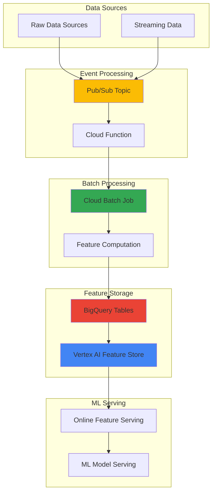

# Real-Time ML Feature Engineering Pipelines with Cloud Batch and Vertex AI Feature Store

## Problem

Organizations with machine learning workloads struggle to maintain consistent feature engineering across batch and real-time prediction scenarios. Teams often face challenges with feature drift, inconsistent transformations between training and serving, and the complexity of managing large-scale feature computations. Without a unified feature store and scalable batch processing infrastructure, ML models suffer from poor performance due to feature inconsistencies and delayed feature updates.

## Solution

Build a comprehensive feature engineering pipeline that leverages Cloud Batch for scalable feature computation, Vertex AI Feature Store for centralized feature management, and Pub/Sub for real-time event processing. This architecture ensures feature consistency across training and serving while providing low-latency access to fresh features for real-time predictions through BigQuery-backed feature storage.

## Architecture Diagram



## Prerequisites

1. Google Cloud account with Vertex AI, Cloud Batch, Pub/Sub, and BigQuery APIs enabled
2. gcloud CLI installed and configured with appropriate IAM permissions
3. Basic understanding of machine learning workflows and feature engineering
4. Python development environment for writing feature transformation code
5. Estimated cost: $50-100 for resources created (varies based on data volume and processing time)

> **Note**: This recipe requires project-level IAM permissions for Vertex AI and Cloud Batch service usage.

## Preparation

```bash
# Set environment variables for GCP resources
export PROJECT_ID="ml-features-$(date +%s)"
export REGION="us-central1"
export ZONE="us-central1-a"

# Generate unique suffix for resource names
RANDOM_SUFFIX=$(openssl rand -hex 3)

# Set resource names
export DATASET_NAME="feature_dataset_${RANDOM_SUFFIX}"
export FEATURE_TABLE="user_features"
export BATCH_JOB_NAME="feature-pipeline-${RANDOM_SUFFIX}"
export PUBSUB_TOPIC="feature-updates-${RANDOM_SUFFIX}"
export FEATURE_GROUP_NAME="user-feature-group-${RANDOM_SUFFIX}"
export BUCKET_NAME="ml-features-bucket-${RANDOM_SUFFIX}"

# Set default project and region
gcloud config set project ${PROJECT_ID}
gcloud config set compute/region ${REGION}
gcloud config set compute/zone ${ZONE}

# Enable required APIs
gcloud services enable aiplatform.googleapis.com
gcloud services enable batch.googleapis.com
gcloud services enable pubsub.googleapis.com
gcloud services enable bigquery.googleapis.com
gcloud services enable cloudfunctions.googleapis.com
gcloud services enable storage.googleapis.com

echo "✅ Project configured: ${PROJECT_ID}"
echo "✅ APIs enabled for ML feature pipeline"
```

## Steps

1. **Create BigQuery Dataset and Feature Tables**:

   BigQuery serves as the foundational data warehouse for our feature engineering pipeline, providing scalable storage and SQL-based feature transformations. The dataset will store both raw data and computed features, enabling historical analysis and point-in-time feature lookups essential for ML model training and serving.

   ```bash
   # Create BigQuery dataset for feature storage
   bq mk --dataset \
       --location=${REGION} \
       ${PROJECT_ID}:${DATASET_NAME}
   
   # Create feature table with schema for user features
   bq mk --table \
       ${PROJECT_ID}:${DATASET_NAME}.${FEATURE_TABLE} \
       user_id:STRING,feature_timestamp:TIMESTAMP,\
       avg_session_duration:FLOAT,total_purchases:INTEGER,\
       days_since_last_login:INTEGER,purchase_frequency:FLOAT,\
       preferred_category:STRING
   
   # Create source data table for demonstration
   bq mk --table \
       ${PROJECT_ID}:${DATASET_NAME}.raw_user_events \
       user_id:STRING,event_timestamp:TIMESTAMP,\
       event_type:STRING,session_duration:FLOAT,\
       purchase_amount:FLOAT,category:STRING
   
   # Insert sample data for testing
   bq query --use_legacy_sql=false \
       "INSERT INTO \`${PROJECT_ID}.${DATASET_NAME}.raw_user_events\`
        VALUES 
        ('user1', TIMESTAMP('2025-07-20 10:00:00'), 'login', 15.5, 0.0, 'electronics'),
        ('user1', TIMESTAMP('2025-07-20 10:30:00'), 'purchase', 0.0, 99.99, 'electronics'),
        ('user2', TIMESTAMP('2025-07-20 11:00:00'), 'login', 8.2, 0.0, 'books'),
        ('user2', TIMESTAMP('2025-07-20 11:15:00'), 'purchase', 0.0, 24.99, 'books')"
   
   echo "✅ BigQuery dataset and tables created with sample data"
   ```

   The feature table schema includes both numerical and categorical features with timestamps, enabling time-series analysis and feature versioning. This structure supports the Vertex AI Feature Store's requirements for entity IDs, feature values, and temporal consistency.

2. **Create Cloud Storage Bucket for Batch Processing**:

   Cloud Storage provides the staging area for batch processing scripts and intermediate data processing results. The bucket will store feature engineering code, job definitions, and processed feature data before loading into BigQuery.

   ```bash
   # Create storage bucket for batch job artifacts
   gsutil mb -p ${PROJECT_ID} \
       -c STANDARD \
       -l ${REGION} \
       gs://${BUCKET_NAME}
   
   # Enable versioning for code artifact management
   gsutil versioning set on gs://${BUCKET_NAME}
   
   echo "✅ Cloud Storage bucket created: gs://${BUCKET_NAME}"
   ```

3. **Create Feature Engineering Script**:

   The feature engineering script implements business logic for transforming raw events into ML-ready features. This Python script will be executed by Cloud Batch jobs and includes statistical aggregations, temporal features, and categorical encodings commonly used in ML pipelines.

   ```bash
   # Create feature engineering Python script
   cat > feature_engineering.py << 'EOF'
   import pandas as pd
   from google.cloud import bigquery
   import os
   from datetime import datetime, timedelta
   
   def compute_user_features():
       client = bigquery.Client()
       project_id = os.environ['PROJECT_ID']
       dataset_name = os.environ['DATASET_NAME']
       
       # SQL query for feature engineering
       query = f"""
       WITH user_stats AS (
         SELECT 
           user_id,
           AVG(session_duration) as avg_session_duration,
           COUNT(CASE WHEN event_type = 'purchase' THEN 1 END) as total_purchases,
           DATE_DIFF(CURRENT_DATE(), MAX(DATE(event_timestamp)), DAY) as days_since_last_login,
           CASE 
             WHEN DATE_DIFF(CURRENT_DATE(), MIN(DATE(event_timestamp)), DAY) > 0 
             THEN COUNT(*) / DATE_DIFF(CURRENT_DATE(), MIN(DATE(event_timestamp)), DAY)
             ELSE 0
           END as purchase_frequency,
           APPROX_TOP_COUNT(category, 1)[OFFSET(0)].value as preferred_category
         FROM `{project_id}.{dataset_name}.raw_user_events`
         WHERE event_timestamp >= TIMESTAMP_SUB(CURRENT_TIMESTAMP(), INTERVAL 30 DAY)
         GROUP BY user_id
       )
       SELECT 
         user_id,
         CURRENT_TIMESTAMP() as feature_timestamp,
         COALESCE(avg_session_duration, 0.0) as avg_session_duration,
         COALESCE(total_purchases, 0) as total_purchases,
         COALESCE(days_since_last_login, 999) as days_since_last_login,
         COALESCE(purchase_frequency, 0.0) as purchase_frequency,
         COALESCE(preferred_category, 'unknown') as preferred_category
       FROM user_stats
       """
       
       # Execute feature computation and load to BigQuery
       job_config = bigquery.QueryJobConfig(
           destination=f"{project_id}.{dataset_name}.{os.environ['FEATURE_TABLE']}",
           write_disposition="WRITE_TRUNCATE"
       )
       
       query_job = client.query(query, job_config=job_config)
       query_job.result()
       
       print(f"✅ Features computed and loaded to BigQuery")
   
   if __name__ == "__main__":
       compute_user_features()
   EOF
   
   # Upload script to Cloud Storage
   gsutil cp feature_engineering.py gs://${BUCKET_NAME}/scripts/
   
   echo "✅ Feature engineering script uploaded"
   ```

   This script demonstrates common feature engineering patterns including temporal aggregations, null handling, and categorical feature extraction. The SQL-based approach leverages BigQuery's distributed processing capabilities for scalable feature computation.

4. **Create Pub/Sub Topic for Event-Driven Processing**:

   Pub/Sub enables event-driven architecture for triggering feature pipeline updates when new data arrives. This asynchronous messaging system decouples data ingestion from feature processing, allowing for real-time responsiveness while maintaining system reliability through message durability and retry mechanisms.

   ```bash
   # Create Pub/Sub topic for feature pipeline triggers
   gcloud pubsub topics create ${PUBSUB_TOPIC}
   
   # Create subscription for batch job triggering
   gcloud pubsub subscriptions create feature-pipeline-sub \
       --topic=${PUBSUB_TOPIC}
   
   echo "✅ Pub/Sub topic and subscription created"
   ```

5. **Create Cloud Batch Job Definition**:

   Cloud Batch provides managed batch processing with automatic resource provisioning and scaling. The job definition specifies the container environment, resource requirements, and execution parameters for running feature engineering workloads at scale.

   ```bash
   # Create batch job configuration file
   cat > batch_job_config.json << EOF
   {
     "taskGroups": [
       {
         "taskSpec": {
           "runnables": [
             {
               "container": {
                 "imageUri": "gcr.io/google.com/cloudsdktool/cloud-sdk:latest",
                 "commands": [
                   "/bin/bash"
                 ],
                 "args": [
                   "-c",
                   "apt-get update && apt-get install -y python3-pip && pip3 install google-cloud-bigquery pandas && gsutil cp gs://${BUCKET_NAME}/scripts/feature_engineering.py . && python3 feature_engineering.py"
                 ]
               },
               "environment": {
                 "variables": {
                   "PROJECT_ID": "${PROJECT_ID}",
                   "DATASET_NAME": "${DATASET_NAME}",
                   "FEATURE_TABLE": "${FEATURE_TABLE}"
                 }
               }
             }
           ],
           "computeResource": {
             "cpuMilli": 2000,
             "memoryMib": 4096
           },
           "maxRetryCount": 3,
           "maxRunDuration": "3600s"
         },
         "taskCount": 1
       }
     ],
     "allocationPolicy": {
       "instances": [
         {
           "policy": {
             "machineType": "e2-standard-2"
           }
         }
       ]
     },
     "logsPolicy": {
       "destination": "CLOUD_LOGGING"
     }
   }
   EOF
   
   echo "✅ Batch job configuration created"
   ```

   The job configuration includes retry policies, resource allocation, and logging integration, ensuring reliable execution of feature engineering tasks with appropriate error handling and observability.

6. **Submit and Execute Cloud Batch Job**:

   Submitting the batch job initiates the feature engineering pipeline with automatic resource provisioning and monitoring. Cloud Batch handles the infrastructure complexity while providing detailed execution logs and status tracking through Cloud Logging integration.

   ```bash
   # Submit batch job for feature processing
   gcloud batch jobs submit ${BATCH_JOB_NAME} \
       --location=${REGION} \
       --config=batch_job_config.json
   
   # Wait for job completion (polling every 30 seconds)
   echo "Waiting for batch job to complete..."
   while true; do
     JOB_STATE=$(gcloud batch jobs describe ${BATCH_JOB_NAME} \
         --location=${REGION} \
         --format="value(status.state)")
     echo "Current job state: ${JOB_STATE}"
     if [[ "${JOB_STATE}" == "SUCCEEDED" || "${JOB_STATE}" == "FAILED" ]]; then
       break
     fi
     sleep 30
   done
   
   echo "✅ Batch job completed: ${BATCH_JOB_NAME}"
   ```

7. **Create Vertex AI Feature Store Resources**:

   Vertex AI Feature Store provides managed feature serving with low-latency access and automatic feature versioning. Creating feature groups and features enables centralized feature management with built-in monitoring and governance capabilities for production ML workflows.

   ```bash
   # Create feature group for user features using REST API approach
   # Note: The gcloud ai feature-groups commands may not be available in all regions
   
   # First, get an access token
   ACCESS_TOKEN=$(gcloud auth print-access-token)
   
   # Create feature group via REST API
   curl -X POST \
     -H "Authorization: Bearer ${ACCESS_TOKEN}" \
     -H "Content-Type: application/json" \
     "https://${REGION}-aiplatform.googleapis.com/v1/projects/${PROJECT_ID}/locations/${REGION}/featureGroups?featureGroupId=${FEATURE_GROUP_NAME}" \
     -d "{
       'bigQuery': {
         'bigQuerySource': {
           'inputUri': 'bq://${PROJECT_ID}.${DATASET_NAME}.${FEATURE_TABLE}'
         },
         'entityIdColumns': ['user_id']
       },
       'description': 'User behavior features for ML models'
     }"
   
   # Wait for feature group creation
   sleep 45
   
   echo "✅ Vertex AI Feature Group created via REST API"
   ```

   The feature group configuration links BigQuery as the source of truth while providing metadata management and serving infrastructure for real-time feature access.

8. **Set Up Online Feature Serving**:

   Online feature serving enables real-time feature access for ML model predictions with sub-second latency. The online store provides a managed infrastructure for serving features with automatic caching and scaling based on prediction workload demands.

   ```bash
   # Create online store instance for real-time serving
   curl -X POST \
     -H "Authorization: Bearer ${ACCESS_TOKEN}" \
     -H "Content-Type: application/json" \
     "https://${REGION}-aiplatform.googleapis.com/v1/projects/${PROJECT_ID}/locations/${REGION}/onlineStores?onlineStoreId=user-features-store-${RANDOM_SUFFIX}" \
     -d "{
       'description': 'Online store for user features',
       'dedicatedServingEndpoint': {
         'publicEndpointEnabled': true
       }
     }"
   
   # Wait for online store creation
   sleep 90
   
   # Create feature view for online serving
   curl -X POST \
     -H "Authorization: Bearer ${ACCESS_TOKEN}" \
     -H "Content-Type: application/json" \
     "https://${REGION}-aiplatform.googleapis.com/v1/projects/${PROJECT_ID}/locations/${REGION}/onlineStores/user-features-store-${RANDOM_SUFFIX}/featureViews?featureViewId=user-feature-view-${RANDOM_SUFFIX}" \
     -d "{
       'bigQuerySource': {
         'uri': 'bq://${PROJECT_ID}.${DATASET_NAME}.${FEATURE_TABLE}',
         'entityIdColumns': ['user_id']
       },
       'syncConfig': {
         'cron': '0 */6 * * *'
       }
     }"
   
   echo "✅ Online feature serving configured via REST API"
   ```

9. **Create Cloud Function for Event Processing**:

   The Cloud Function provides serverless event processing to trigger feature pipeline updates when new data arrives via Pub/Sub. This integration enables near real-time feature updates while maintaining cost efficiency through automatic scaling and pay-per-invocation pricing.

   ```bash
   # Create Cloud Function source code
   cat > main.py << 'EOF'
   import base64
   import json
   from google.cloud import batch_v1
   import os
   import functions_framework
   
   @functions_framework.cloud_event
   def trigger_feature_pipeline(cloud_event):
       # Decode Pub/Sub message
       message_data = base64.b64decode(cloud_event.data['message']['data']).decode('utf-8')
       print(f"Processing message: {message_data}")
       
       project_id = os.environ['PROJECT_ID']
       region = os.environ['REGION']
       
       # Log pipeline trigger (simplified for demo)
       print(f"Feature pipeline triggered by Pub/Sub event for project: {project_id}")
       print("In production, this would submit a new Cloud Batch job")
       
       return {"status": "success", "message": "Pipeline triggered"}
   EOF
   
   # Create requirements.txt
   cat > requirements.txt << 'EOF'
   functions-framework==3.8.1
   google-cloud-batch==0.17.26
   google-cloud-storage==2.16.0
   EOF
   
   # Deploy Cloud Function with Pub/Sub trigger
   gcloud functions deploy trigger-feature-pipeline \
       --gen2 \
       --runtime python312 \
       --trigger-topic ${PUBSUB_TOPIC} \
       --source . \
       --entry-point trigger_feature_pipeline \
       --memory 256MB \
       --timeout 60s \
       --set-env-vars PROJECT_ID=${PROJECT_ID},REGION=${REGION}
   
   echo "✅ Cloud Function deployed for event processing"
   ```

## Validation & Testing

1. Verify BigQuery feature table contains computed features:

   ```bash
   # Check feature table contents
   bq query --use_legacy_sql=false \
       "SELECT user_id, feature_timestamp, avg_session_duration, total_purchases 
        FROM \`${PROJECT_ID}.${DATASET_NAME}.${FEATURE_TABLE}\` 
        LIMIT 10"
   ```

   Expected output: Table with user features including session duration and purchase metrics

2. Test Vertex AI Feature Store feature serving:

   ```bash
   # List feature groups using REST API
   curl -X GET \
     -H "Authorization: Bearer $(gcloud auth print-access-token)" \
     "https://${REGION}-aiplatform.googleapis.com/v1/projects/${PROJECT_ID}/locations/${REGION}/featureGroups"
   
   # Check online stores
   curl -X GET \
     -H "Authorization: Bearer $(gcloud auth print-access-token)" \
     "https://${REGION}-aiplatform.googleapis.com/v1/projects/${PROJECT_ID}/locations/${REGION}/onlineStores"
   ```

3. Validate Cloud Batch job execution:

   ```bash
   # Check batch job status and logs
   gcloud batch jobs describe ${BATCH_JOB_NAME} \
       --location=${REGION} \
       --format="value(status.state,status.statusEvents)"
   
   # View job logs
   gcloud logging read "resource.type=batch_job AND resource.labels.job_id=${BATCH_JOB_NAME}" \
       --limit=50 \
       --format="value(textPayload)"
   ```

4. Test Pub/Sub event processing:

   ```bash
   # Send test message to trigger pipeline
   gcloud pubsub topics publish ${PUBSUB_TOPIC} \
       --message='{"event": "feature_update_request", "timestamp": "'$(date -u +%Y-%m-%dT%H:%M:%SZ)'"}'
   
   # Check Cloud Function logs
   gcloud functions logs read trigger-feature-pipeline \
       --gen2 \
       --limit=10
   ```

## Cleanup

1. Remove Vertex AI Feature Store resources:

   ```bash
   # Delete feature view
   curl -X DELETE \
     -H "Authorization: Bearer $(gcloud auth print-access-token)" \
     "https://${REGION}-aiplatform.googleapis.com/v1/projects/${PROJECT_ID}/locations/${REGION}/onlineStores/user-features-store-${RANDOM_SUFFIX}/featureViews/user-feature-view-${RANDOM_SUFFIX}"
   
   # Delete online store
   curl -X DELETE \
     -H "Authorization: Bearer $(gcloud auth print-access-token)" \
     "https://${REGION}-aiplatform.googleapis.com/v1/projects/${PROJECT_ID}/locations/${REGION}/onlineStores/user-features-store-${RANDOM_SUFFIX}"
   
   # Delete feature group
   curl -X DELETE \
     -H "Authorization: Bearer $(gcloud auth print-access-token)" \
     "https://${REGION}-aiplatform.googleapis.com/v1/projects/${PROJECT_ID}/locations/${REGION}/featureGroups/${FEATURE_GROUP_NAME}"
   
   echo "✅ Vertex AI Feature Store resources deleted"
   ```

2. Remove Cloud Batch job and related resources:

   ```bash
   # Delete batch job
   gcloud batch jobs delete ${BATCH_JOB_NAME} \
       --location=${REGION} \
       --quiet
   
   echo "✅ Cloud Batch job deleted"
   ```

3. Remove Cloud Function and Pub/Sub resources:

   ```bash
   # Delete Cloud Function
   gcloud functions delete trigger-feature-pipeline \
       --gen2 \
       --region=${REGION} \
       --quiet
   
   # Delete Pub/Sub subscription and topic
   gcloud pubsub subscriptions delete feature-pipeline-sub --quiet
   gcloud pubsub topics delete ${PUBSUB_TOPIC} --quiet
   
   echo "✅ Serverless resources deleted"
   ```

4. Remove BigQuery dataset and Cloud Storage bucket:

   ```bash
   # Delete BigQuery dataset and all tables
   bq rm -r -f ${PROJECT_ID}:${DATASET_NAME}
   
   # Remove Cloud Storage bucket and contents
   gsutil -m rm -r gs://${BUCKET_NAME}
   
   echo "✅ Storage resources deleted"
   ```

5. Delete project (optional):

   ```bash
   # Delete entire project if created specifically for this recipe
   gcloud projects delete ${PROJECT_ID} --quiet
   
   echo "✅ Project deleted: ${PROJECT_ID}"
   echo "Note: Project deletion may take several minutes to complete"
   ```

## Discussion

This implementation demonstrates a production-ready ML feature engineering pipeline that addresses common challenges in MLOps workflows. The architecture leverages Google Cloud's managed services to provide scalable, reliable feature processing with minimal operational overhead. Cloud Batch handles the heavy lifting of batch processing with automatic resource provisioning, while Vertex AI Feature Store ensures feature consistency across training and serving environments.

The integration of Pub/Sub enables event-driven architecture patterns, allowing the pipeline to respond to data changes in near real-time. This approach reduces feature staleness and improves model performance by ensuring predictions use the most current feature values. The BigQuery integration provides a unified data platform that supports both analytical workloads and ML feature serving, eliminating data silos and reducing complexity.

Key architectural decisions include using BigQuery as the single source of truth for feature data, which simplifies data governance and enables SQL-based feature engineering. The separation of batch processing (Cloud Batch) from online serving (Vertex AI Feature Store) allows independent scaling of each component based on workload requirements. This design pattern follows Google Cloud's best practices for building production ML systems that can scale from prototype to enterprise workloads.

> **Tip**: Monitor feature drift using Vertex AI Feature Store's built-in monitoring capabilities to ensure model performance remains stable over time. See [Vertex AI Feature Store monitoring documentation](https://cloud.google.com/vertex-ai/docs/featurestore/latest/monitor-features) for implementation guidance.

The pipeline's event-driven nature makes it suitable for real-time applications like recommendation systems, fraud detection, and personalization engines where feature freshness directly impacts business outcomes. The cost-effective design using serverless and managed services ensures you only pay for actual processing time and storage usage, making it viable for both development and production environments.

## Challenge

Extend this solution by implementing these enhancements:

1. **Add feature validation and quality monitoring** using Great Expectations or custom validation rules integrated with Cloud Functions to ensure feature quality before storing in the Feature Store
2. **Implement A/B testing for feature versions** by creating multiple feature views and using Vertex AI Experiments to compare model performance with different feature sets
3. **Build automated feature discovery** using Vertex AI AutoML Tables to identify the most predictive features from raw data and automatically generate feature engineering pipelines
4. **Create real-time streaming feature processing** using Dataflow to process streaming data from Pub/Sub and update features with sub-second latency for time-sensitive ML applications
5. **Implement feature lineage tracking** using Cloud Data Catalog to maintain visibility into feature dependencies and data flow for compliance and debugging purposes

## Infrastructure Code

*Infrastructure code will be generated after recipe approval.*