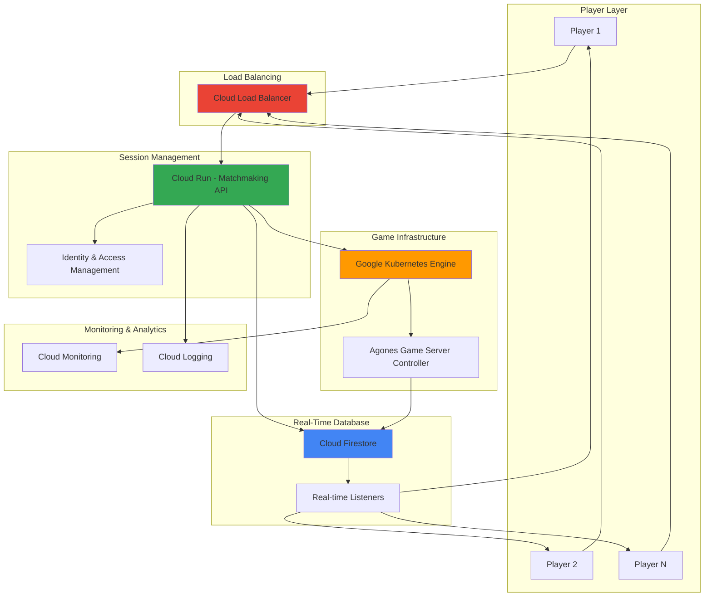

# Real-Time Multiplayer Gaming Infrastructure with Game Servers and Cloud Firestore

## Problem

Modern multiplayer games require real-time synchronization between hundreds or thousands of concurrent players while maintaining low latency and high availability. Traditional gaming infrastructure struggles with dynamic scaling, session management, and state synchronization across multiple game instances. Game studios face challenges in provisioning dedicated servers efficiently, managing player sessions across regions, and ensuring consistent game state updates without complex infrastructure management overhead.

## Solution

This solution leverages Google Cloud's managed gaming services to create a serverless, auto-scaling multiplayer infrastructure. Google Kubernetes Engine with Agones automatically provisions and manages dedicated game server instances, while Cloud Firestore provides real-time database synchronization for game state. Cloud Run handles matchmaking and player session management, with Cloud Load Balancing distributing traffic across regions for optimal player experience.

## Architecture Diagram



## Prerequisites

1. Google Cloud account with billing enabled and GKE API access
2. Google Cloud CLI installed and configured (or Cloud Shell)
3. Docker installed for containerizing game server applications
4. Basic knowledge of Kubernetes concepts and serverless architecture
5. Estimated cost: $50-100/month for development environment with moderate usage

> **Note**: Google recommends using GKE with Agones for game server hosting instead of the deprecated Game Servers API. Agones provides the same capabilities with better Kubernetes integration.

## Preparation

```bash
# Set environment variables for GCP resources
export PROJECT_ID="gaming-project-$(date +%s)"
export REGION="us-central1"
export ZONE="us-central1-a"
export CLUSTER_NAME="game-cluster"

# Generate unique suffix for resource names
RANDOM_SUFFIX=$(openssl rand -hex 3)
export GAME_SERVER_FLEET="game-fleet-${RANDOM_SUFFIX}"
export FIRESTORE_DATABASE="game-db-${RANDOM_SUFFIX}"
export CLOUD_RUN_SERVICE="matchmaking-api-${RANDOM_SUFFIX}"

# Set default project and region
gcloud config set project ${PROJECT_ID}
gcloud config set compute/region ${REGION}
gcloud config set compute/zone ${ZONE}

# Enable required APIs
gcloud services enable container.googleapis.com
gcloud services enable run.googleapis.com
gcloud services enable firestore.googleapis.com
gcloud services enable compute.googleapis.com
gcloud services enable cloudbuild.googleapis.com

echo "✅ Project configured: ${PROJECT_ID}"
echo "✅ Game infrastructure prefix: ${RANDOM_SUFFIX}"
```

## Steps

1. **Create GKE Cluster with Agones for Game Server Management**:

   Google Kubernetes Engine with Agones provides the foundation for managing dedicated game servers at scale. Agones is an open-source platform that extends Kubernetes to orchestrate game server fleets, handling allocation, scaling, and health management automatically. This configuration creates a robust, auto-scaling environment optimized for real-time multiplayer games.

   ```bash
   # Create GKE cluster optimized for gaming workloads
   gcloud container clusters create ${CLUSTER_NAME} \
       --zone=${ZONE} \
       --machine-type=e2-standard-4 \
       --num-nodes=3 \
       --enable-autoscaling \
       --min-nodes=1 \
       --max-nodes=10 \
       --enable-network-policy \
       --enable-ip-alias \
       --disk-size=50GB

   # Get cluster credentials
   gcloud container clusters get-credentials ${CLUSTER_NAME} \
       --zone=${ZONE}

   echo "✅ GKE cluster created with autoscaling enabled"
   ```

   The GKE cluster now provides a managed Kubernetes environment with horizontal pod autoscaling and network policies for security. This foundation supports dynamic game server provisioning while maintaining cost efficiency through automatic scaling based on player demand.

2. **Install Agones Game Server Controller**:

   Agones transforms Kubernetes into a game server orchestration platform, providing custom resource definitions for game servers, fleets, and allocations. The controller manages the entire lifecycle of game server instances, from creation through allocation to cleanup, enabling seamless multiplayer experiences.

   ```bash
   # Install Agones using Kubectl with official manifests
   kubectl create namespace agones-system
   
   # Install Agones with the latest stable version
   kubectl apply --server-side \
       -f https://raw.githubusercontent.com/googleforgames/agones/release-1.41.0/install/yaml/install.yaml
   
   # Wait for Agones to be ready
   kubectl wait --for=condition=available deployment \
       --all --namespace=agones-system --timeout=300s
   
   echo "✅ Agones controller installed and ready"
   ```

   Agones is now managing game server resources within the Kubernetes cluster, providing APIs for game server allocation, health checking, and automatic scaling. This enables the infrastructure to respond dynamically to player demand while maintaining optimal resource utilization.

3. **Create Cloud Firestore Database for Real-Time State Management**:

   Cloud Firestore provides a NoSQL document database with built-in real-time synchronization capabilities essential for multiplayer gaming. Its multi-region replication and strong consistency guarantees ensure that game state updates are immediately visible to all players, while offline support handles network interruptions gracefully.

   ```bash
   # Create Firestore database with proper syntax
   gcloud firestore databases create \
       --database=${FIRESTORE_DATABASE} \
       --location=${REGION} \
       --type=firestore-native
   
   # Create initial game collections structure
   cat > game-schema.json << EOF
   {
     "games": {
       "game-session-id": {
         "players": {},
         "gameState": {},
         "gameMode": "string",
         "maxPlayers": 4,
         "metadata": {
           "created": "timestamp",
           "lastUpdated": "timestamp",
           "status": "waiting|active|completed"
         }
       }
     },
     "players": {
       "player-id": {
         "currentGame": "game-session-id",
         "profile": {},
         "stats": {},
         "lastSeen": "timestamp"
       }
     }
   }
   EOF
   
   echo "✅ Firestore database created with gaming schema"
   ```

   The Firestore database now provides real-time synchronization capabilities with automatic scaling and global distribution. This foundation enables immediate game state updates across all connected players while maintaining consistency and handling network partitions gracefully.

4. **Deploy Game Server Fleet Configuration**:

   Creating a game server fleet establishes the template and scaling policies for dedicated game instances. This configuration defines the container image, resource requirements, and networking settings that Agones uses to automatically provision game servers based on player demand.

   ```bash
   # Create game server fleet manifest
   cat > gameserver-fleet.yaml << EOF
   apiVersion: "agones.dev/v1"
   kind: Fleet
   metadata:
     name: ${GAME_SERVER_FLEET}
   spec:
     replicas: 2
     template:
       spec:
         ports:
         - name: default
           containerPort: 7654
           protocol: UDP
         health:
           disabled: false
           initialDelaySeconds: 5
           periodSeconds: 5
           failureThreshold: 3
         template:
           spec:
             containers:
             - name: simple-game-server
               image: us-docker.pkg.dev/agones-images/examples/simple-server:0.17
               resources:
                 requests:
                   memory: "64Mi"
                   cpu: "20m"
                 limits:
                   memory: "128Mi"
                   cpu: "50m"
   EOF
   
   # Deploy the fleet
   kubectl apply -f gameserver-fleet.yaml
   
   # Wait for fleet to be ready
   kubectl wait --for=condition=ready fleet/${GAME_SERVER_FLEET} \
       --timeout=300s
   
   echo "✅ Game server fleet deployed and ready"
   ```

   The game server fleet is now running with automatic scaling capabilities, providing dedicated game instances that can be allocated to player sessions. Agones manages the entire lifecycle, from provisioning through health monitoring to cleanup, ensuring optimal resource utilization.

5. **Create Cloud Run Matchmaking Service**:

   The Cloud Run matchmaking service handles player session management, game server allocation, and real-time communication with Firestore. This serverless approach provides automatic scaling, pay-per-request pricing, and seamless integration with other Google Cloud services while maintaining low latency for player interactions.

   ```bash
   # Create matchmaking service directory
   mkdir -p matchmaking-service
   cd matchmaking-service
   
   # Create Node.js matchmaking service
   cat > package.json << EOF
   {
     "name": "matchmaking-service",
     "version": "1.0.0",
     "main": "index.js",
     "dependencies": {
       "express": "^4.19.0",
       "@google-cloud/firestore": "^7.10.0",
       "@kubernetes/client-node": "^0.21.0"
     }
   }
   EOF
   
   # Create matchmaking logic
   cat > index.js << 'EOF'
   const express = require('express');
   const { Firestore } = require('@google-cloud/firestore');
   const k8s = require('@kubernetes/client-node');
   
   const app = express();
   const port = process.env.PORT || 8080;
   const firestore = new Firestore({
     databaseId: process.env.FIRESTORE_DATABASE || 'default'
   });
   
   app.use(express.json());
   
   app.get('/health', (req, res) => {
     res.status(200).json({ status: 'healthy' });
   });
   
   app.post('/matchmake', async (req, res) => {
     try {
       const { playerId, gameMode } = req.body;
       
       if (!playerId || !gameMode) {
         return res.status(400).json({ 
           error: 'Missing required fields: playerId and gameMode' 
         });
       }
       
       // Find or create game session
       const gameSession = await findOrCreateGameSession(gameMode);
       
       // Add player to session
       await addPlayerToSession(gameSession, playerId);
       
       res.json({ 
         gameSessionId: gameSession.id,
         serverEndpoint: gameSession.serverEndpoint || 'pending',
         status: 'matched'
       });
     } catch (error) {
       console.error('Matchmaking error:', error);
       res.status(500).json({ error: error.message });
     }
   });
   
   async function findOrCreateGameSession(gameMode) {
     const gamesRef = firestore.collection('games');
     const availableGames = await gamesRef
       .where('status', '==', 'waiting')
       .where('gameMode', '==', gameMode)
       .where('playerCount', '<', 4)
       .limit(1)
       .get();
   
     if (!availableGames.empty) {
       const doc = availableGames.docs[0];
       return { id: doc.id, ...doc.data() };
     }
   
     // Create new game session
     const newGameRef = await gamesRef.add({
       gameMode,
       status: 'waiting',
       players: [],
       playerCount: 0,
       created: new Date(),
       maxPlayers: 4,
       lastUpdated: new Date()
     });
   
     return { id: newGameRef.id };
   }
   
   async function addPlayerToSession(gameSession, playerId) {
     const gameRef = firestore.collection('games').doc(gameSession.id);
     const playerRef = firestore.collection('players').doc(playerId);
     
     const batch = firestore.batch();
     
     batch.update(gameRef, {
       players: firestore.FieldValue.arrayUnion(playerId),
       playerCount: firestore.FieldValue.increment(1),
       lastUpdated: new Date()
     });
     
     batch.set(playerRef, {
       currentGame: gameSession.id,
       lastSeen: new Date()
     }, { merge: true });
     
     await batch.commit();
   }
   
   app.listen(port, () => {
     console.log(`Matchmaking service running on port ${port}`);
   });
   EOF
   
   # Create Dockerfile
   cat > Dockerfile << EOF
   FROM node:20-slim
   WORKDIR /app
   COPY package*.json ./
   RUN npm ci --only=production
   COPY . .
   EXPOSE 8080
   CMD ["node", "index.js"]
   EOF
   
   # Build and deploy to Cloud Run
   gcloud builds submit --tag gcr.io/${PROJECT_ID}/${CLOUD_RUN_SERVICE}
   
   gcloud run deploy ${CLOUD_RUN_SERVICE} \
       --image gcr.io/${PROJECT_ID}/${CLOUD_RUN_SERVICE} \
       --platform managed \
       --region ${REGION} \
       --allow-unauthenticated \
       --memory 512Mi \
       --cpu 1000m \
       --set-env-vars FIRESTORE_DATABASE=${FIRESTORE_DATABASE}
   
   # Get service URL
   export MATCHMAKING_URL=$(gcloud run services describe ${CLOUD_RUN_SERVICE} \
       --platform managed \
       --region ${REGION} \
       --format 'value(status.url)')
   
   cd ..
   echo "✅ Matchmaking service deployed at: ${MATCHMAKING_URL}"
   ```

   The Cloud Run matchmaking service is now handling player connections, game session management, and real-time communication with Firestore. This serverless architecture automatically scales with demand while maintaining low latency for critical matchmaking operations.

6. **Configure Cloud Load Balancing for Global Distribution**:

   Cloud Load Balancing distributes player traffic across multiple regions and provides SSL termination, health checking, and automatic failover. This configuration ensures low latency for players worldwide while maintaining high availability and performance during traffic spikes.

   ```bash
   # Create backend service for Cloud Run
   gcloud compute backend-services create game-backend \
       --global \
       --protocol=HTTP \
       --port-name=http \
       --timeout=30s \
       --enable-cdn
   
   # Create URL map for routing
   gcloud compute url-maps create game-loadbalancer \
       --default-service=game-backend
   
   # Create HTTP(S) proxy
   gcloud compute target-http-proxies create game-proxy \
       --url-map=game-loadbalancer
   
   # Create global forwarding rule
   gcloud compute forwarding-rules create game-forwarding-rule \
       --global \
       --target-http-proxy=game-proxy \
       --ports=80
   
   # Add Cloud Run service as backend
   gcloud compute backend-services add-backend game-backend \
       --global \
       --serverless-deployment-type=run \
       --serverless-service=${CLOUD_RUN_SERVICE} \
       --serverless-region=${REGION}
   
   # Get load balancer IP
   export LB_IP=$(gcloud compute forwarding-rules describe game-forwarding-rule \
       --global \
       --format='value(IPAddress)')
   
   echo "✅ Global load balancer configured at IP: ${LB_IP}"
   ```

   The global load balancer is now distributing traffic to the matchmaking service with automatic scaling and health monitoring. This provides consistent performance for players worldwide while enabling seamless regional failover and content delivery optimization.

7. **Implement Real-Time Game State Synchronization**:

   Setting up Firestore real-time listeners enables immediate synchronization of game state changes across all connected players. This configuration handles player actions, game events, and state updates with sub-second latency while maintaining data consistency and offline resilience.

   ```bash
   # Create real-time sync configuration
   cat > sync-config.js << 'EOF'
   const { Firestore } = require('@google-cloud/firestore');
   
   class GameStateSyncer {
     constructor(gameSessionId, databaseId = 'default') {
       this.firestore = new Firestore({
         databaseId: databaseId
       });
       this.gameSessionId = gameSessionId;
       this.gameRef = this.firestore.collection('games').doc(gameSessionId);
     }
   
     // Listen for real-time game state changes
     subscribeToGameUpdates(callback) {
       return this.gameRef.onSnapshot((doc) => {
         if (doc.exists) {
           callback(doc.data());
         }
       }, (error) => {
         console.error('Real-time sync error:', error);
       });
     }
   
     // Update game state with atomic operations
     async updateGameState(playerAction) {
       const batch = this.firestore.batch();
       
       // Update game state atomically
       batch.update(this.gameRef, {
         gameState: playerAction.newState,
         lastUpdated: new Date(),
         lastAction: {
           playerId: playerAction.playerId,
           action: playerAction.action,
           timestamp: new Date()
         }
       });
   
       // Update player stats
       const playerRef = this.firestore.collection('players').doc(playerAction.playerId);
       batch.update(playerRef, {
         lastAction: new Date(),
         actionsCount: this.firestore.FieldValue.increment(1)
       });
   
       await batch.commit();
     }
   
     // Handle player disconnection
     async handlePlayerDisconnect(playerId) {
       const batch = this.firestore.batch();
       
       batch.update(this.gameRef, {
         players: this.firestore.FieldValue.arrayRemove(playerId),
         playerCount: this.firestore.FieldValue.increment(-1),
         lastUpdated: new Date()
       });
       
       const playerRef = this.firestore.collection('players').doc(playerId);
       batch.update(playerRef, {
         currentGame: null,
         lastSeen: new Date()
       });
       
       await batch.commit();
     }
   }
   
   module.exports = GameStateSyncer;
   EOF
   
   # Create Firestore security rules
   cat > firestore.rules << 'EOF'
   rules_version = '2';
   service cloud.firestore {
     match /databases/{database}/documents {
       match /games/{gameId} {
         allow read, write: if request.auth != null && 
           resource.data.players.hasAny([request.auth.uid]);
       }
       match /players/{playerId} {
         allow read, write: if request.auth != null && 
           request.auth.uid == playerId;
       }
     }
   }
   EOF
   
   # Deploy security rules
   gcloud firestore rules deploy firestore.rules \
       --database=${FIRESTORE_DATABASE}
   
   echo "✅ Real-time synchronization configured with security rules"
   ```

   Real-time synchronization is now active with Firestore listeners providing immediate state updates to all connected players. The security rules ensure data integrity while atomic operations maintain consistency during concurrent player actions.

## Validation & Testing

1. **Verify Game Server Fleet Status**:

   ```bash
   # Check fleet status and ready game servers
   kubectl get fleet ${GAME_SERVER_FLEET} -o wide
   kubectl get gameservers -l "agones.dev/fleet=${GAME_SERVER_FLEET}"
   ```

   Expected output: Shows fleet with desired replicas and multiple game servers in "Ready" state.

2. **Test Matchmaking Service**:

   ```bash
   # Test matchmaking API endpoint
   curl -X POST ${MATCHMAKING_URL}/matchmake \
       -H "Content-Type: application/json" \
       -d '{"playerId": "player123", "gameMode": "battle-royale"}'
   
   # Test load balancer endpoint
   curl -X POST http://${LB_IP}/matchmake \
       -H "Content-Type: application/json" \
       -d '{"playerId": "player456", "gameMode": "battle-royale"}'
   
   # Test health endpoint
   curl ${MATCHMAKING_URL}/health
   ```

   Expected output: JSON response with game session ID and server endpoint information, plus healthy status.

3. **Verify Firestore Real-Time Synchronization**:

   ```bash
   # Check game sessions in Firestore
   gcloud firestore query --collection=games \
       --where="status==waiting" \
       --limit=5 \
       --database=${FIRESTORE_DATABASE}
   
   # Monitor recent game updates
   gcloud firestore query --collection=games \
       --order-by=lastUpdated \
       --limit=1 \
       --database=${FIRESTORE_DATABASE}
   ```

   Expected output: Shows active game sessions with recent timestamps and player arrays.

4. **Test Load Balancer Health and Performance**:

   ```bash
   # Check load balancer backend health
   gcloud compute backend-services get-health game-backend \
       --global
   
   # Test response times
   echo "Testing load balancer response time:"
   time curl -s http://${LB_IP}/health > /dev/null
   ```

   Expected output: All backends showing "HEALTHY" status with consistent response times.

## Cleanup

1. **Remove Load Balancer Resources**:

   ```bash
   # Delete forwarding rule and proxy
   gcloud compute forwarding-rules delete game-forwarding-rule \
       --global \
       --quiet
   
   gcloud compute target-http-proxies delete game-proxy \
       --quiet
   
   gcloud compute url-maps delete game-loadbalancer \
       --quiet
   
   gcloud compute backend-services delete game-backend \
       --global \
       --quiet
   
   echo "✅ Load balancer resources deleted"
   ```

2. **Remove Cloud Run Service**:

   ```bash
   # Delete Cloud Run service
   gcloud run services delete ${CLOUD_RUN_SERVICE} \
       --platform managed \
       --region ${REGION} \
       --quiet
   
   # Delete container image
   gcloud container images delete gcr.io/${PROJECT_ID}/${CLOUD_RUN_SERVICE} \
       --quiet
   
   echo "✅ Cloud Run service deleted"
   ```

3. **Remove Firestore Database**:

   ```bash
   # Delete Firestore database
   gcloud firestore databases delete ${FIRESTORE_DATABASE} \
       --quiet
   
   echo "✅ Firestore database deleted"
   ```

4. **Remove GKE Cluster and Game Resources**:

   ```bash
   # Delete Agones fleet
   kubectl delete fleet ${GAME_SERVER_FLEET}
   
   # Delete GKE cluster
   gcloud container clusters delete ${CLUSTER_NAME} \
       --zone=${ZONE} \
       --quiet
   
   echo "✅ GKE cluster and game resources deleted"
   ```

5. **Clean Up Environment Variables**:

   ```bash
   # Remove exported variables
   unset PROJECT_ID REGION ZONE CLUSTER_NAME RANDOM_SUFFIX
   unset GAME_SERVER_FLEET FIRESTORE_DATABASE CLOUD_RUN_SERVICE
   unset MATCHMAKING_URL LB_IP
   
   # Remove local files
   rm -rf matchmaking-service/
   rm -f gameserver-fleet.yaml sync-config.js firestore.rules game-schema.json
   
   echo "✅ Environment cleaned up"
   ```

## Discussion

This multiplayer gaming infrastructure leverages Google Cloud's specialized gaming services to create a comprehensive, scalable solution for real-time multiplayer experiences. The architecture combines Google Kubernetes Engine with Agones for dedicated game server management, providing automatic scaling, health monitoring, and efficient resource allocation. By using Agones instead of the deprecated Google Cloud Game Servers API, the infrastructure maintains better Kubernetes integration while providing the same game server orchestration capabilities.

Cloud Firestore serves as the backbone for real-time state synchronization, utilizing its native real-time listeners and strong consistency guarantees to ensure all players see game state updates immediately. The NoSQL document structure naturally maps to game entities and player data, while automatic multi-region replication provides global availability and disaster recovery capabilities. The serverless matchmaking service built on Cloud Run handles player connections and session management with automatic scaling, eliminating the need for infrastructure management while maintaining low latency for critical operations.

The global load balancing configuration ensures optimal player experience regardless of geographic location, with automatic failover and content delivery optimization. This approach follows [Google Cloud's gaming architecture best practices](https://cloud.google.com/solutions/gaming) and leverages the global infrastructure for consistent performance worldwide. The combination of managed services reduces operational overhead while providing enterprise-grade security, monitoring, and compliance capabilities essential for production gaming environments.

Security is integrated throughout the stack with IAM for service authentication, Firestore security rules for data access control, and VPC networking for secure communication between services. The infrastructure automatically handles common gaming challenges like player session management, server allocation, and state synchronization while providing detailed monitoring and logging for operational visibility. The use of [Agones](https://agones.dev/site/) provides industry-standard game server orchestration with active community support and regular updates.

> **Tip**: Monitor player latency and server allocation patterns using Cloud Monitoring to optimize resource placement and scaling policies for your specific game requirements and player demographics.

## Challenge

Extend this multiplayer gaming infrastructure with these advanced features:

1. **Implement Anti-Cheat System**: Add Cloud Functions to analyze player actions in real-time, detecting suspicious behavior patterns and automatically flagging or removing cheating players using Vertex AI machine learning models.

2. **Add Global Player Leaderboards**: Create a BigQuery-based analytics pipeline that processes game results from Firestore, maintaining real-time leaderboards with historical statistics and seasonal rankings across all game modes.

3. **Enhance with Voice Chat**: Integrate WebRTC signaling through Cloud Functions and Pub/Sub for real-time voice communication, with automatic channel management and audio quality optimization based on network conditions.

4. **Implement Dynamic Game Balancing**: Use Vertex AI to analyze player skill levels and match history, automatically adjusting game difficulty and matchmaking algorithms to maintain engagement and fair competition.

5. **Add Spectator Mode**: Create a streaming architecture using Cloud Run and WebSockets that allows real-time game spectating with minimal latency, including chat systems and multiple camera angles for esports broadcasting.

## Infrastructure Code

### Available Infrastructure as Code:

- [Infrastructure Code Overview](code/README.md) - Detailed description of all infrastructure components
- [Infrastructure Manager](code/infrastructure-manager/) - GCP Infrastructure Manager templates
- [Bash CLI Scripts](code/scripts/) - Example bash scripts using gcloud CLI commands to deploy infrastructure
- [Terraform](code/terraform/) - Terraform configuration files