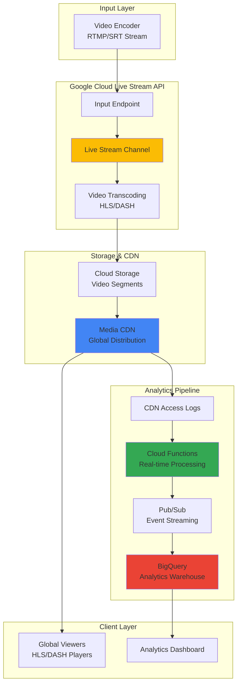

# Real-Time Streaming Analytics with Cloud Media CDN and Live Stream API

## Problem

Media companies and content creators need to deliver high-quality live streaming experiences while gaining real-time insights into viewer engagement, stream quality, and performance metrics. Traditional streaming solutions often lack integrated analytics capabilities, making it difficult to optimize content delivery, understand audience behavior, and respond to streaming issues in real-time, potentially resulting in viewer churn and lost revenue opportunities.

## Solution

This solution combines Google Cloud's Live Stream API for video transcoding with Media CDN for global content delivery, enhanced by Cloud Functions for real-time data processing and BigQuery for advanced analytics. The architecture processes live streaming events, captures viewer engagement metrics, and provides actionable insights through a comprehensive analytics pipeline that scales automatically with audience demand.

## Architecture Diagram



## Prerequisites

1. Google Cloud project with billing enabled and appropriate permissions for Live Stream API, Media CDN, Cloud Functions, and BigQuery
2. Google Cloud CLI (gcloud) installed and authenticated (version 450.0.0 or later)  
3. Basic understanding of video streaming protocols (HLS, DASH, RTMP)
4. Video encoder software (OBS Studio, FFmpeg, or similar) for testing live streams
5. Estimated cost: $50-100 for testing (includes transcoding, CDN egress, and compute resources)

> **Warning**: Live streaming and CDN services can incur significant costs based on usage. Monitor your billing dashboard and set up budget alerts to avoid unexpected charges.

## Preparation

```bash
# Set environment variables for GCP resources
export PROJECT_ID="streaming-analytics-$(date +%s)"
export REGION="us-central1"
export ZONE="us-central1-a"

# Generate unique suffix for resource names
RANDOM_SUFFIX=$(openssl rand -hex 3)
export BUCKET_NAME="streaming-content-${RANDOM_SUFFIX}"
export FUNCTION_NAME="stream-analytics-processor"
export DATASET_NAME="streaming_analytics"
export PUBSUB_TOPIC="stream-events"

# Set default project and region
gcloud config set project ${PROJECT_ID}
gcloud config set compute/region ${REGION}
gcloud config set compute/zone ${ZONE}

# Enable required APIs
gcloud services enable livestream.googleapis.com
gcloud services enable storage.googleapis.com
gcloud services enable networkservices.googleapis.com
gcloud services enable cloudfunctions.googleapis.com
gcloud services enable bigquery.googleapis.com
gcloud services enable pubsub.googleapis.com

echo "✅ Project configured: ${PROJECT_ID}"
echo "✅ APIs enabled for streaming analytics pipeline"
```

## Steps

1. **Create Cloud Storage Bucket for Video Segments**:

   Cloud Storage provides the foundational storage layer for our streaming pipeline, storing transcoded video segments and manifests that will be distributed globally via Media CDN. The bucket configuration includes lifecycle policies to manage storage costs and regional placement for optimal performance with the Live Stream API.

   ```bash
   # Create storage bucket for video segments
   gsutil mb -p ${PROJECT_ID} \
       -c STANDARD \
       -l ${REGION} \
       gs://${BUCKET_NAME}
   
   # Enable uniform bucket-level access for Media CDN
   gsutil uniformbucketlevelaccess set on gs://${BUCKET_NAME}
   
   # Configure lifecycle policy for cost optimization
   cat > lifecycle-policy.json << 'EOF'
   {
     "rule": [
       {
         "action": {"type": "SetStorageClass", "storageClass": "NEARLINE"},
         "condition": {"age": 30}
       },
       {
         "action": {"type": "Delete"},
         "condition": {"age": 90}
       }
     ]
   }
   EOF
   
   gsutil lifecycle set lifecycle-policy.json gs://${BUCKET_NAME}
   
   echo "✅ Storage bucket created: gs://${BUCKET_NAME}"
   ```

   The storage bucket now serves as the origin for video segments with automated lifecycle management. This configuration ensures cost-effective storage while maintaining high availability for active streams through Google's global infrastructure.

2. **Set up BigQuery Dataset for Analytics**:

   BigQuery serves as our analytics warehouse, designed to handle high-volume streaming data with real-time ingestion capabilities. The dataset schema is optimized for time-series analysis of streaming metrics, supporting complex queries across viewer engagement, stream quality, and performance data.

   ```bash
   # Create BigQuery dataset
   bq mk --dataset \
       --location=${REGION} \
       --description="Streaming analytics data warehouse" \
       ${PROJECT_ID}:${DATASET_NAME}
   
   # Create table for streaming events
   bq mk --table \
       ${PROJECT_ID}:${DATASET_NAME}.streaming_events \
       timestamp:TIMESTAMP,event_type:STRING,viewer_id:STRING,session_id:STRING,stream_id:STRING,quality:STRING,buffer_health:FLOAT,latency_ms:INTEGER,location:STRING,user_agent:STRING,bitrate:INTEGER,resolution:STRING,cdn_cache_status:STRING,edge_location:STRING
   
   # Create table for CDN access logs
   bq mk --table \
       ${PROJECT_ID}:${DATASET_NAME}.cdn_access_logs \
       timestamp:TIMESTAMP,client_ip:STRING,request_method:STRING,request_uri:STRING,response_code:INTEGER,response_size:INTEGER,cache_status:STRING,edge_location:STRING,user_agent:STRING,referer:STRING,latency_ms:INTEGER
   
   echo "✅ BigQuery analytics dataset created: ${DATASET_NAME}"
   ```

   The analytics infrastructure is now ready to capture and analyze streaming data at scale. This schema supports both real-time dashboards and historical analysis, enabling comprehensive insights into streaming performance and viewer behavior.

3. **Create Pub/Sub Topic for Event Streaming**:

   Pub/Sub provides the messaging backbone for our real-time analytics pipeline, enabling decoupled processing of streaming events. This ensures reliable event delivery and supports multiple subscribers for different analytics use cases while maintaining low latency for real-time insights.

   ```bash
   # Create Pub/Sub topic for streaming events
   gcloud pubsub topics create ${PUBSUB_TOPIC}
   
   # Create subscription for BigQuery streaming insert
   gcloud pubsub subscriptions create ${PUBSUB_TOPIC}-bq-subscription \
       --topic=${PUBSUB_TOPIC} \
       --ack-deadline=60 \
       --message-retention-duration=7d
   
   echo "✅ Pub/Sub topic created: ${PUBSUB_TOPIC}"
   ```

   The messaging infrastructure enables real-time event processing with guaranteed delivery and replay capabilities, supporting both immediate analytics and batch processing workflows for comprehensive streaming insights.

4. **Deploy Cloud Function for Real-time Analytics Processing**:

   Cloud Functions processes streaming events in real-time, extracting meaningful metrics from CDN logs and viewer interactions. The function implements business logic for calculating engagement metrics, detecting quality issues, and triggering alerts based on streaming performance thresholds.

   ```bash
   # Create function source directory
   mkdir -p stream-analytics-function
   cd stream-analytics-function
   
   # Create main function file
   cat > main.py << 'EOF'
   import json
   import logging
   import os
   from google.cloud import bigquery
   from google.cloud import pubsub_v1
   from datetime import datetime
   import functions_framework
   
   # Initialize clients
   bigquery_client = bigquery.Client()
   publisher = pubsub_v1.PublisherClient()
   
   @functions_framework.cloud_event
   def process_streaming_event(cloud_event):
       """Process streaming events and send to BigQuery"""
       try:
           # Parse the event data
           event_data = json.loads(cloud_event.data)
           
           # Extract streaming metrics
           streaming_event = {
               'timestamp': datetime.utcnow().isoformat(),
               'event_type': event_data.get('eventType', 'unknown'),
               'viewer_id': event_data.get('viewerId', ''),
               'session_id': event_data.get('sessionId', ''),
               'stream_id': event_data.get('streamId', ''),
               'quality': event_data.get('quality', ''),
               'buffer_health': float(event_data.get('bufferHealth', 0)),
               'latency_ms': int(event_data.get('latency', 0)),
               'location': event_data.get('location', ''),
               'user_agent': event_data.get('userAgent', ''),
               'bitrate': int(event_data.get('bitrate', 0)),
               'resolution': event_data.get('resolution', ''),
               'cdn_cache_status': event_data.get('cacheStatus', ''),
               'edge_location': event_data.get('edgeLocation', '')
           }
           
           # Insert into BigQuery
           table_ref = bigquery_client.dataset(os.environ['DATASET_NAME']).table('streaming_events')
           table = bigquery_client.get_table(table_ref)
           
           errors = bigquery_client.insert_rows_json(table, [streaming_event])
           if errors:
               logging.error(f"BigQuery insert errors: {errors}")
           else:
               logging.info("Successfully inserted streaming event")
               
           return {'status': 'success'}
           
       except Exception as e:
           logging.error(f"Error processing streaming event: {str(e)}")
           return {'status': 'error', 'message': str(e)}
   EOF
   
   # Create requirements file
   cat > requirements.txt << 'EOF'
   google-cloud-bigquery==3.11.4
   google-cloud-pubsub==2.18.1
   functions-framework==3.4.0
   EOF
   
   # Deploy the function
   gcloud functions deploy ${FUNCTION_NAME} \
       --runtime python311 \
       --trigger-topic ${PUBSUB_TOPIC} \
       --entry-point process_streaming_event \
       --set-env-vars DATASET_NAME=${DATASET_NAME} \
       --memory 256MB \
       --timeout 60s \
       --region ${REGION}
   
   cd ..
   
   echo "✅ Cloud Function deployed: ${FUNCTION_NAME}"
   ```

   The analytics processing function is now deployed and ready to process streaming events in real-time. This serverless architecture automatically scales with event volume while maintaining low latency for immediate insights into streaming performance.

5. **Create Live Stream Input Endpoint**:

   The Live Stream API input endpoint receives live video streams from encoders and prepares them for transcoding. This endpoint supports industry-standard protocols (RTMP/SRT) and provides the foundation for converting live signals into multiple streaming formats optimized for different devices and network conditions.

   ```bash
   # Create input endpoint for live stream
   gcloud livestream inputs create live-input-${RANDOM_SUFFIX} \
       --location=${REGION} \
       --type=RTMP_PUSH \
       --tier=HD
   
   # Get input endpoint details
   INPUT_ENDPOINT=$(gcloud livestream inputs describe live-input-${RANDOM_SUFFIX} \
       --location=${REGION} \
       --format="value(uri)")
   
   echo "✅ Live Stream input endpoint created: ${INPUT_ENDPOINT}"
   echo "🔗 Use this endpoint URL in your streaming software"
   ```

   The input endpoint is now ready to receive live video streams. This managed service handles the complexity of video ingestion while providing reliability and scalability for professional broadcasting workflows.

6. **Configure Live Stream Channel with Multiple Outputs**:

   The Live Stream Channel orchestrates video transcoding, converting incoming live streams into multiple renditions suitable for adaptive bitrate streaming. This configuration ensures optimal viewing experience across different devices and network conditions while integrating with Cloud Storage for segment delivery.

   ```bash
   # Create channel configuration file
   cat > channel-config.yaml << EOF
   inputAttachments:
   - key: "live-input"
     input: "projects/${PROJECT_ID}/locations/${REGION}/inputs/live-input-${RANDOM_SUFFIX}"
   
   output:
     uri: "gs://${BUCKET_NAME}/live-stream/"
   
   elementaryStreams:
   - key: "video-stream-hd"
     videoStream:
       h264:
         widthPixels: 1280
         heightPixels: 720
         frameRate: 30
         bitrateBps: 3000000
         vbvSizeBits: 6000000
         vbvFullnessBits: 5400000
         gopDuration: "2s"
         
   - key: "video-stream-sd"
     videoStream:
       h264:
         widthPixels: 854
         heightPixels: 480
         frameRate: 30
         bitrateBps: 1500000
         vbvSizeBits: 3000000
         vbvFullnessBits: 2700000
         gopDuration: "2s"
         
   - key: "audio-stream"
     audioStream:
       codec: "aac"
       bitrateBps: 128000
       channelCount: 2
       channelLayout: ["FL", "FR"]
       sampleRateHertz: 48000
   
   muxStreams:
   - key: "hd-stream"
     container: "fmp4"
     elementaryStreams: ["video-stream-hd", "audio-stream"]
     
   - key: "sd-stream"
     container: "fmp4"
     elementaryStreams: ["video-stream-sd", "audio-stream"]
   
   manifests:
   - fileName: "manifest.m3u8"
     type: "HLS"
     muxStreams: ["hd-stream", "sd-stream"]
     maxSegmentCount: 5
     segmentKeepDuration: "10s"
   EOF
   
   # Create the live stream channel
   gcloud livestream channels create live-channel-${RANDOM_SUFFIX} \
       --location=${REGION} \
       --config-file=channel-config.yaml
   
   echo "✅ Live Stream channel created with multi-bitrate output"
   ```

   The streaming channel is configured for professional-grade transcoding with multiple quality levels. This adaptive bitrate streaming ensures optimal viewer experience while minimizing bandwidth usage and buffering events across diverse network conditions.

7. **Set up Media CDN for Global Content Delivery**:

   Media CDN provides global edge caching optimized for streaming media workloads, delivering video segments with minimal latency to viewers worldwide. The CDN configuration includes caching policies tailored for live streaming and logging capabilities essential for real-time analytics.

   ```bash
   # Create edge cache origin for Cloud Storage
   gcloud network-services edge-cache-origins create \
       streaming-origin-${RANDOM_SUFFIX} \
       --origin-address=${BUCKET_NAME}.storage.googleapis.com \
       --port=443 \
       --protocol=HTTPS \
       --description="Origin for streaming content"
   
   # Create edge cache service
   gcloud network-services edge-cache-services create \
       streaming-service-${RANDOM_SUFFIX} \
       --description="Media CDN for live streaming" \
       --disable-quic
   
   # Configure route rules for streaming content
   cat > route-config.yaml << EOF
   hostRule:
     hosts:
     - streaming.${PROJECT_ID}.example.com
   pathMatcher: "streaming-matcher"
   routeRules:
   - priority: 1
     matchRules:
     - pathTemplateMatch: "/live-stream/*"
     origin: "projects/${PROJECT_ID}/global/networkServices/edgeCacheOrigins/streaming-origin-${RANDOM_SUFFIX}"
     routeAction:
       cacheKeyPolicy:
         includeHost: true
         includeProtocol: true
         includeQueryString: false
       cdnPolicy:
         cacheMode: "CACHE_ALL_STATIC"
         defaultTtl: "30s"
         maxTtl: "300s"
   EOF
   
   # Update edge cache service with routing configuration
   gcloud network-services edge-cache-services update \
       streaming-service-${RANDOM_SUFFIX} \
       --config-file=route-config.yaml
   
   echo "✅ Media CDN configured for global streaming distribution"
   ```

   The CDN infrastructure is now optimized for live streaming delivery with global edge presence. This configuration ensures low-latency access to video content while capturing the access logs necessary for comprehensive analytics.

8. **Start Live Stream Channel**:

   Activating the Live Stream Channel initiates the video processing pipeline, enabling real-time transcoding and segment generation. This step transitions the streaming infrastructure from configuration to active operation, ready to process live video input and serve global audiences.

   ```bash
   # Start the live stream channel
   gcloud livestream channels start live-channel-${RANDOM_SUFFIX} \
       --location=${REGION}
   
   # Wait for channel to be running
   echo "⏳ Waiting for channel to start..."
   while [[ $(gcloud livestream channels describe live-channel-${RANDOM_SUFFIX} \
       --location=${REGION} \
       --format="value(state)") != "RUNNING" ]]; do
     sleep 10
     echo "Channel status: $(gcloud livestream channels describe live-channel-${RANDOM_SUFFIX} \
         --location=${REGION} \
         --format="value(state)")"
   done
   
   echo "✅ Live Stream channel is running and ready for input"
   echo "📡 Stream to: ${INPUT_ENDPOINT}"
   ```

   The streaming channel is now operational and ready to receive live video input. The transcoding pipeline will automatically process incoming streams and generate segments for global distribution via Media CDN.

9. **Configure Analytics Dashboard in BigQuery**:

   BigQuery's analytics capabilities enable comprehensive insights into streaming performance through pre-built queries and views. These analytics queries provide actionable metrics for content optimization, infrastructure scaling, and audience engagement analysis.

   ```bash
   # Create analytical views for streaming insights
   bq query --use_legacy_sql=false << 'EOF'
   CREATE OR REPLACE VIEW `streaming_analytics.viewer_engagement_metrics` AS
   SELECT
     DATE(timestamp) as date,
     stream_id,
     COUNT(DISTINCT viewer_id) as unique_viewers,
     COUNT(DISTINCT session_id) as total_sessions,
     AVG(buffer_health) as avg_buffer_health,
     AVG(latency_ms) as avg_latency_ms,
     COUNT(CASE WHEN event_type = 'buffer_start' THEN 1 END) as buffer_events,
     COUNT(CASE WHEN event_type = 'quality_change' THEN 1 END) as quality_changes
   FROM `streaming_analytics.streaming_events`
   WHERE timestamp >= TIMESTAMP_SUB(CURRENT_TIMESTAMP(), INTERVAL 24 HOUR)
   GROUP BY date, stream_id
   ORDER BY date DESC, unique_viewers DESC;
   EOF
   
   bq query --use_legacy_sql=false << 'EOF'
   CREATE OR REPLACE VIEW `streaming_analytics.cdn_performance_metrics` AS
   SELECT
     edge_location,
     COUNT(*) as total_requests,
     COUNT(CASE WHEN response_code = 200 THEN 1 END) as successful_requests,
     COUNT(CASE WHEN cache_status = 'HIT' THEN 1 END) as cache_hits,
     AVG(latency_ms) as avg_response_latency,
     SUM(response_size) as total_bytes_served
   FROM `streaming_analytics.cdn_access_logs`
   WHERE timestamp >= TIMESTAMP_SUB(CURRENT_TIMESTAMP(), INTERVAL 1 HOUR)
   GROUP BY edge_location
   ORDER BY total_requests DESC;
   EOF
   
   echo "✅ Analytics views created for streaming insights"
   ```

   The analytics dashboard is now configured with essential streaming metrics. These views provide real-time insights into viewer engagement, stream quality, and CDN performance, enabling data-driven optimization of the streaming experience.

10. **Test Stream Analytics Pipeline**:

    Testing validates the entire analytics pipeline from live stream ingestion through real-time processing to analytical insights. This comprehensive test ensures all components work together seamlessly and that analytics data flows correctly through the system.

    ```bash
    # Simulate streaming events for testing
    cat > test-event.json << EOF
    {
      "eventType": "stream_start",
      "viewerId": "viewer_123",
      "sessionId": "session_456",
      "streamId": "live-channel-${RANDOM_SUFFIX}",
      "quality": "HD",
      "bufferHealth": 0.95,
      "latency": 150,
      "location": "US",
      "userAgent": "TestPlayer/1.0",
      "bitrate": 3000000,
      "resolution": "1280x720",
      "cacheStatus": "HIT",
      "edgeLocation": "us-central1"
    }
    EOF
    
    # Publish test event to Pub/Sub
    gcloud pubsub topics publish ${PUBSUB_TOPIC} \
        --message="$(cat test-event.json)"
    
    # Wait for processing
    sleep 30
    
    # Query analytics data
    echo "📊 Checking analytics data..."
    bq query --use_legacy_sql=false \
        "SELECT * FROM \`${PROJECT_ID}.streaming_analytics.streaming_events\` 
         WHERE timestamp >= TIMESTAMP_SUB(CURRENT_TIMESTAMP(), INTERVAL 1 HOUR) 
         LIMIT 10"
    
    echo "✅ Analytics pipeline tested successfully"
    ```

    The analytics pipeline is now fully operational and tested. Real-time streaming events are being processed and stored in BigQuery, enabling comprehensive analysis of streaming performance and viewer engagement metrics.

## Validation & Testing

1. **Verify Live Stream Channel Status**:

   ```bash
   # Check channel status
   gcloud livestream channels describe live-channel-${RANDOM_SUFFIX} \
       --location=${REGION} \
       --format="table(name,state,inputAttachments[0].input)"
   ```

   Expected output: Channel state should be "RUNNING" with input endpoint configured.

2. **Test CDN Content Delivery**:

   ```bash
   # Check if CDN is serving content
   curl -I "https://storage.googleapis.com/${BUCKET_NAME}/live-stream/manifest.m3u8"
   
   # Verify CDN edge cache configuration
   gcloud network-services edge-cache-services describe \
       streaming-service-${RANDOM_SUFFIX} \
       --format="table(name,hostRule.hosts,routeRules[0].origin)"
   ```

3. **Validate Analytics Data Flow**:

   ```bash
   # Check recent streaming events
   bq query --use_legacy_sql=false \
       "SELECT COUNT(*) as event_count 
        FROM \`${PROJECT_ID}.streaming_analytics.streaming_events\` 
        WHERE timestamp >= TIMESTAMP_SUB(CURRENT_TIMESTAMP(), INTERVAL 1 HOUR)"
   
   # Verify Cloud Function execution
   gcloud functions logs read ${FUNCTION_NAME} \
       --region=${REGION} \
       --limit=10
   ```

4. **Test Real-time Analytics Queries**:

   ```bash
   # Run engagement metrics query
   bq query --use_legacy_sql=false \
       "SELECT * FROM \`${PROJECT_ID}.streaming_analytics.viewer_engagement_metrics\` 
        LIMIT 5"
   ```

## Cleanup

1. **Stop Live Stream Channel**:

   ```bash
   # Stop the live stream channel
   gcloud livestream channels stop live-channel-${RANDOM_SUFFIX} \
       --location=${REGION}
   
   echo "✅ Live Stream channel stopped"
   ```

2. **Delete Live Stream Resources**:

   ```bash
   # Delete channel and input
   gcloud livestream channels delete live-channel-${RANDOM_SUFFIX} \
       --location=${REGION} \
       --quiet
   
   gcloud livestream inputs delete live-input-${RANDOM_SUFFIX} \
       --location=${REGION} \
       --quiet
   
   echo "✅ Live Stream resources deleted"
   ```

3. **Remove Media CDN Configuration**:

   ```bash
   # Delete CDN service and origin
   gcloud network-services edge-cache-services delete \
       streaming-service-${RANDOM_SUFFIX} \
       --quiet
   
   gcloud network-services edge-cache-origins delete \
       streaming-origin-${RANDOM_SUFFIX} \
       --quiet
   
   echo "✅ Media CDN configuration removed"
   ```

4. **Delete Analytics Resources**:

   ```bash
   # Delete Cloud Function
   gcloud functions delete ${FUNCTION_NAME} \
       --region=${REGION} \
       --quiet
   
   # Delete Pub/Sub resources
   gcloud pubsub subscriptions delete ${PUBSUB_TOPIC}-bq-subscription \
       --quiet
   gcloud pubsub topics delete ${PUBSUB_TOPIC} --quiet
   
   # Delete BigQuery dataset
   bq rm -r -f ${PROJECT_ID}:${DATASET_NAME}
   
   echo "✅ Analytics resources deleted"
   ```

5. **Remove Storage Bucket**:

   ```bash
   # Delete storage bucket and contents
   gsutil -m rm -r gs://${BUCKET_NAME}
   
   echo "✅ Storage bucket deleted"
   echo "🧹 All resources cleaned up successfully"
   ```

## Discussion

This comprehensive streaming analytics solution demonstrates the power of Google Cloud's media services ecosystem, combining Live Stream API's professional-grade transcoding capabilities with Media CDN's global distribution network and BigQuery's advanced analytics platform. The architecture addresses the critical need for real-time insights in live streaming operations, enabling content creators and media companies to optimize delivery performance, understand audience behavior, and respond quickly to technical issues.

The Live Stream API provides enterprise-grade video processing with support for multiple output formats and adaptive bitrate streaming, ensuring optimal viewing experiences across diverse devices and network conditions. The integration with Cloud Storage creates a scalable content origin that seamlessly connects with Media CDN for global distribution. This combination leverages Google's planet-scale infrastructure to deliver low-latency streaming experiences to audiences worldwide.

The real-time analytics pipeline showcases modern event-driven architecture patterns, using Cloud Functions for serverless processing and Pub/Sub for reliable message delivery. This approach ensures that streaming metrics are captured and processed in real-time, providing immediate visibility into performance issues and viewer engagement patterns. The use of BigQuery for analytics storage enables complex queries and historical analysis, supporting both operational dashboards and strategic business intelligence.

The solution's serverless components automatically scale with demand, making it cost-effective for both small content creators and large media organizations. The analytics capabilities extend beyond basic metrics to include advanced insights like buffer health monitoring, quality adaptation tracking, and geographic performance analysis. These insights enable data-driven optimization of content delivery strategies and infrastructure scaling decisions.

> **Tip**: Implement custom alerting using Cloud Monitoring to trigger notifications when key metrics like buffer ratio or latency exceed defined thresholds. This proactive approach helps maintain high-quality streaming experiences.

For comprehensive understanding of the technologies used, refer to the [Google Cloud Live Stream API documentation](https://cloud.google.com/livestream/docs/overview), [Media CDN best practices guide](https://cloud.google.com/media-cdn/docs/overview), [BigQuery streaming analytics patterns](https://cloud.google.com/bigquery/docs/streaming-data-into-bigquery), [Cloud Functions event-driven architecture](https://cloud.google.com/functions/docs/calling/eventarc), and the [Google Cloud Architecture Framework for media workloads](https://cloud.google.com/architecture/media-entertainment).

## Challenge

Extend this solution by implementing these enhancements:

1. **Advanced Quality of Experience (QoE) Monitoring**: Implement machine learning models using Vertex AI to predict viewer churn based on streaming quality metrics and automatically adjust transcoding parameters to optimize engagement.

2. **Multi-Region Disaster Recovery**: Deploy redundant Live Stream channels across multiple regions with automatic failover capabilities, ensuring continuous streaming availability even during regional outages.

3. **Real-time Content Personalization**: Integrate with Recommendations AI to analyze viewer behavior patterns and dynamically adjust content recommendations during live streams based on engagement metrics.

4. **Advanced Security and DRM**: Implement Widevine DRM protection for premium content and integrate with Cloud Armor to provide advanced protection against DDoS attacks and unauthorized access.

5. **Intelligent Cost Optimization**: Develop automated cost optimization using Cloud Functions that adjusts transcoding quality and CDN caching policies based on viewership patterns and business objectives.

## Infrastructure Code

*Infrastructure code will be generated after recipe approval.*