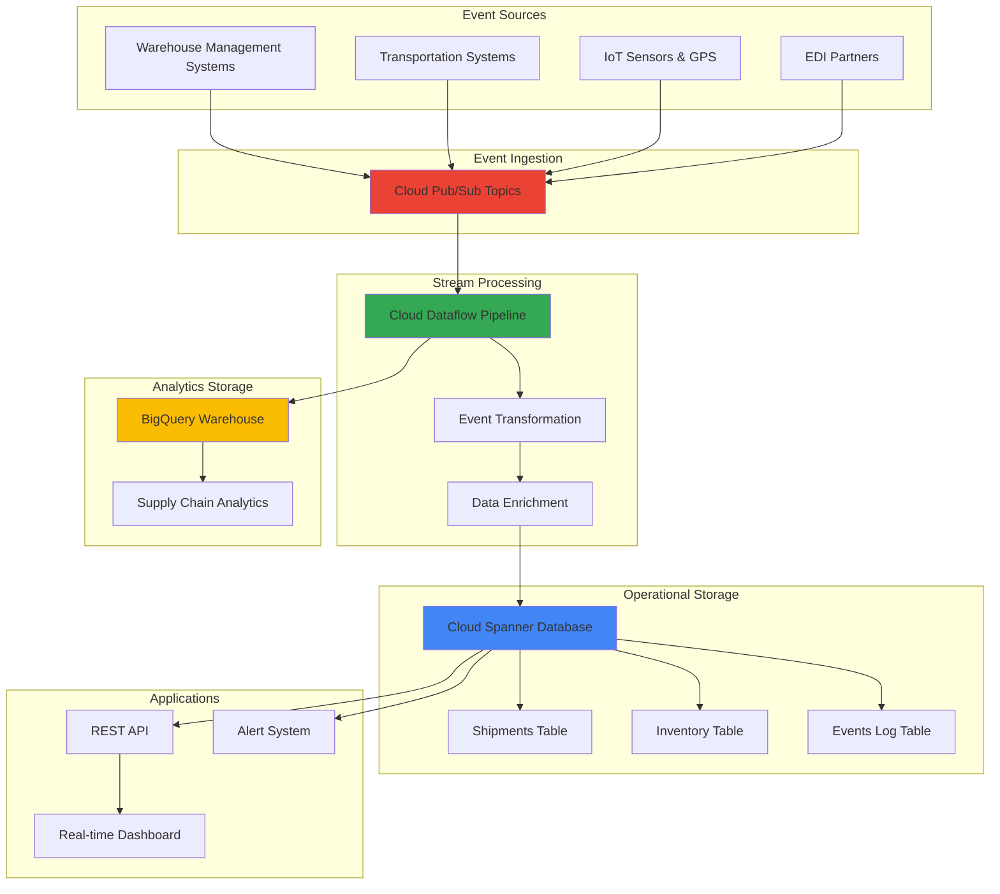

# Real-Time Supply Chain Visibility with Cloud Dataflow and Cloud Spanner

## Problem

Modern logistics companies struggle with fragmented supply chain visibility, processing millions of shipment events across multiple carriers, warehouses, and transportation modes without real-time insights. Traditional batch processing systems create 6-24 hour delays in critical shipment status updates, causing customer service issues, inventory misallocations, and missed delivery commitments that cost companies millions in lost revenue and customer satisfaction.

## Solution

Build a real-time supply chain visibility platform using Cloud Dataflow for streaming event processing, Cloud Spanner for globally consistent transaction data, Pub/Sub for scalable event ingestion, and BigQuery for analytical reporting. This architecture processes logistics events in near real-time, maintains strong consistency across global operations, and provides immediate visibility into shipment status, inventory levels, and operational performance metrics.

## Architecture Diagram



## Prerequisites

1. Google Cloud account with appropriate permissions for Dataflow, Spanner, Pub/Sub, and BigQuery
2. Google Cloud CLI installed and configured (or Cloud Shell)
3. Basic understanding of streaming data processing and supply chain concepts
4. Python development knowledge for custom Dataflow transforms
5. Estimated cost: $150-200 for running this recipe (includes Spanner, Dataflow, and BigQuery usage)

> **Note**: This recipe uses Spanner regional instances and moderate Dataflow resources. Monitor usage in Cloud Billing to control costs.

## Preparation

```bash
# Set environment variables for GCP resources
export PROJECT_ID="supply-chain-visibility-$(date +%s)"
export REGION="us-central1"
export ZONE="us-central1-a"

# Generate unique suffix for resource names
RANDOM_SUFFIX=$(openssl rand -hex 3)

# Set default project and region
gcloud config set project ${PROJECT_ID}
gcloud config set compute/region ${REGION}
gcloud config set compute/zone ${ZONE}

# Enable required APIs
gcloud services enable dataflow.googleapis.com
gcloud services enable spanner.googleapis.com
gcloud services enable pubsub.googleapis.com
gcloud services enable bigquery.googleapis.com
gcloud services enable storage.googleapis.com

echo "✅ Project configured: ${PROJECT_ID}"

# Set resource names
export SPANNER_INSTANCE="supply-chain-instance-${RANDOM_SUFFIX}"
export SPANNER_DATABASE="supply-chain-db"
export PUBSUB_TOPIC="logistics-events"
export PUBSUB_SUBSCRIPTION="logistics-events-sub"
export BIGQUERY_DATASET="supply_chain_analytics"
export DATAFLOW_JOB="supply-chain-streaming-${RANDOM_SUFFIX}"
export STORAGE_BUCKET="supply-chain-dataflow-${RANDOM_SUFFIX}"

# Create Cloud Storage bucket for Dataflow staging
gsutil mb -p ${PROJECT_ID} \
    -c STANDARD \
    -l ${REGION} \
    gs://${STORAGE_BUCKET}

echo "✅ Storage bucket created for Dataflow staging"
```

## Steps

1. **Create Cloud Spanner Instance and Database**:

   Cloud Spanner provides globally distributed, strongly consistent database capabilities essential for supply chain operations that span multiple regions and require ACID transactions. The multi-region configuration ensures high availability and low latency access to critical shipment and inventory data while maintaining data consistency across all operations.

   ```bash
   # Create Spanner instance with regional configuration
   gcloud spanner instances create ${SPANNER_INSTANCE} \
       --config=regional-${REGION} \
       --description="Supply Chain Visibility Database" \
       --nodes=1
   
   # Create database
   gcloud spanner databases create ${SPANNER_DATABASE} \
       --instance=${SPANNER_INSTANCE}
   
   echo "✅ Cloud Spanner instance and database created"
   ```

   The Spanner instance is now operational with single-node configuration suitable for development and moderate production workloads. This configuration provides 10,000 QPS capacity with automatic scaling capabilities as your supply chain data volume grows.

2. **Create Database Schema for Supply Chain Data**:

   The database schema captures essential supply chain entities including shipments, inventory, and event logs. This design supports real-time tracking with optimized queries for common supply chain visibility patterns while maintaining referential integrity across related data.

   ```bash
   # Create shipments table
   gcloud spanner databases ddl update ${SPANNER_DATABASE} \
       --instance=${SPANNER_INSTANCE} \
       --ddl='CREATE TABLE Shipments (
           ShipmentId STRING(50) NOT NULL,
           OrderId STRING(50) NOT NULL,
           CarrierId STRING(50),
           TrackingNumber STRING(100),
           Status STRING(20) NOT NULL,
           OriginLocation STRING(100),
           DestinationLocation STRING(100),
           EstimatedDelivery TIMESTAMP,
           ActualDelivery TIMESTAMP,
           LastUpdated TIMESTAMP NOT NULL OPTIONS (allow_commit_timestamp=true),
           CreatedAt TIMESTAMP NOT NULL OPTIONS (allow_commit_timestamp=true)
       ) PRIMARY KEY (ShipmentId)'
   
   # Create inventory table
   gcloud spanner databases ddl update ${SPANNER_DATABASE} \
       --instance=${SPANNER_INSTANCE} \
       --ddl='CREATE TABLE Inventory (
           ItemId STRING(50) NOT NULL,
           LocationId STRING(50) NOT NULL,
           Quantity INT64 NOT NULL,
           AvailableQuantity INT64 NOT NULL,
           ReservedQuantity INT64 NOT NULL,
           LastUpdated TIMESTAMP NOT NULL OPTIONS (allow_commit_timestamp=true)
       ) PRIMARY KEY (ItemId, LocationId)'
   
   # Create events log table
   gcloud spanner databases ddl update ${SPANNER_DATABASE} \
       --instance=${SPANNER_INSTANCE} \
       --ddl='CREATE TABLE Events (
           EventId STRING(50) NOT NULL,
           ShipmentId STRING(50),
           EventType STRING(50) NOT NULL,
           EventData JSON,
           Location STRING(100),
           Timestamp TIMESTAMP NOT NULL,
           ProcessedAt TIMESTAMP NOT NULL OPTIONS (allow_commit_timestamp=true)
       ) PRIMARY KEY (EventId)'
   
   echo "✅ Database schema created for supply chain data"
   ```

   The schema is now ready with optimized tables for shipment tracking, inventory management, and event logging. The use of commit timestamps ensures accurate tracking of data modifications for audit and synchronization purposes.

3. **Create Pub/Sub Topic and Subscription**:

   Pub/Sub provides the scalable event ingestion layer that can handle millions of logistics events from various sources including warehouse management systems, transportation partners, and IoT devices. The at-least-once delivery guarantee ensures no critical shipment events are lost during processing.

   ```bash
   # Create Pub/Sub topic for logistics events
   gcloud pubsub topics create ${PUBSUB_TOPIC}
   
   # Create subscription for Dataflow processing
   gcloud pubsub subscriptions create ${PUBSUB_SUBSCRIPTION} \
       --topic=${PUBSUB_TOPIC} \
       --ack-deadline=60
   
   echo "✅ Pub/Sub topic and subscription created"
   ```

   The Pub/Sub infrastructure is now configured to handle high-volume event streams with appropriate acknowledgment timeouts for stream processing workloads. This setup supports automatic scaling based on message backlog and processing requirements.

4. **Create BigQuery Dataset and Tables**:

   BigQuery provides the analytical data warehouse for supply chain intelligence, supporting complex queries across historical data for trend analysis, performance reporting, and predictive analytics. The partitioned table design optimizes query performance for time-based analytics common in supply chain reporting.

   ```bash
   # Create BigQuery dataset
   bq mk --location=${REGION} ${PROJECT_ID}:${BIGQUERY_DATASET}
   
   # Create shipment analytics table
   bq mk --table \
       ${PROJECT_ID}:${BIGQUERY_DATASET}.shipment_analytics \
       shipment_id:STRING,order_id:STRING,carrier_id:STRING,status:STRING,origin:STRING,destination:STRING,estimated_delivery:TIMESTAMP,actual_delivery:TIMESTAMP,transit_time_hours:FLOAT,created_date:DATE
   
   # Create event analytics table with partitioning
   bq mk --table \
       --time_partitioning_field=event_timestamp \
       --time_partitioning_type=DAY \
       ${PROJECT_ID}:${BIGQUERY_DATASET}.event_analytics \
       event_id:STRING,shipment_id:STRING,event_type:STRING,location:STRING,event_timestamp:TIMESTAMP,processing_delay_seconds:FLOAT
   
   echo "✅ BigQuery dataset and analytics tables created"
   ```

   The BigQuery infrastructure is configured with partitioned tables optimized for time-series analytics and efficient querying of supply chain metrics. This design supports fast aggregations across millions of events for real-time dashboards and reporting.

5. **Create Dataflow Pipeline Code**:

   The Dataflow pipeline implements the core stream processing logic for transforming raw logistics events into structured data updates. This serverless approach automatically scales processing capacity based on event volume while maintaining low latency for real-time visibility requirements.

   ```bash
   # Create directory for Dataflow pipeline code
   mkdir -p dataflow-pipeline
   cd dataflow-pipeline
   
   # Create requirements file with latest versions
   cat > requirements.txt << 'EOF'
apache-beam[gcp]==2.66.0
google-cloud-spanner==3.49.1
google-cloud-bigquery==3.25.0
EOF
   
   # Create main pipeline file
   cat > supply_chain_pipeline.py << 'EOF'
import apache_beam as beam
from apache_beam.options.pipeline_options import PipelineOptions
from apache_beam.transforms import window
import json
import logging
from datetime import datetime
from google.cloud import spanner
from google.cloud import bigquery
import os

class ParseLogisticsEvent(beam.DoFn):
    def process(self, element):
        try:
            # Parse JSON event from Pub/Sub
            event_data = json.loads(element.decode('utf-8'))
            
            # Extract and validate required fields
            event = {
                'event_id': event_data.get('event_id'),
                'shipment_id': event_data.get('shipment_id'),
                'event_type': event_data.get('event_type'),
                'location': event_data.get('location'),
                'timestamp': event_data.get('timestamp'),
                'event_data': event_data
            }
            
            # Validate required fields
            if all(event[field] for field in ['event_id', 'shipment_id', 'event_type']):
                yield event
            else:
                logging.warning(f"Incomplete event data: {event_data}")
                
        except json.JSONDecodeError as e:
            logging.error(f"Failed to parse JSON: {e}")
        except Exception as e:
            logging.error(f"Error processing event: {e}")

class UpdateSpannerData(beam.DoFn):
    def __init__(self, project_id, instance_id, database_id):
        self.project_id = project_id
        self.instance_id = instance_id
        self.database_id = database_id
        self.spanner_client = None
        
    def setup(self):
        self.spanner_client = spanner.Client(project=self.project_id)
        self.instance = self.spanner_client.instance(self.instance_id)
        self.database = self.instance.database(self.database_id)
    
    def process(self, element):
        try:
            with self.database.batch() as batch:
                # Insert event record
                batch.insert(
                    table='Events',
                    columns=['EventId', 'ShipmentId', 'EventType', 'EventData', 'Location', 'Timestamp', 'ProcessedAt'],
                    values=[(
                        element['event_id'],
                        element['shipment_id'],
                        element['event_type'],
                        json.dumps(element['event_data']),
                        element.get('location'),
                        element['timestamp'],
                        spanner.COMMIT_TIMESTAMP
                    )]
                )
                
                # Update shipment status based on event type
                if element['event_type'] in ['shipped', 'in_transit', 'delivered', 'exception']:
                    batch.update(
                        table='Shipments',
                        columns=['ShipmentId', 'Status', 'LastUpdated'],
                        values=[(
                            element['shipment_id'],
                            element['event_type'],
                            spanner.COMMIT_TIMESTAMP
                        )]
                    )
            
            yield element
            
        except Exception as e:
            logging.error(f"Failed to update Spanner: {e}")

class PrepareForBigQuery(beam.DoFn):
    def process(self, element):
        try:
            # Transform for BigQuery analytics table
            bq_record = {
                'event_id': element['event_id'],
                'shipment_id': element['shipment_id'],
                'event_type': element['event_type'],
                'location': element.get('location'),
                'event_timestamp': element['timestamp'],
                'processing_delay_seconds': (
                    datetime.utcnow() - datetime.fromisoformat(element['timestamp'].replace('Z', '+00:00'))
                ).total_seconds()
            }
            
            yield bq_record
            
        except Exception as e:
            logging.error(f"Failed to prepare BigQuery record: {e}")

def run_pipeline(argv=None):
    pipeline_options = PipelineOptions(argv)
    
    # Get environment variables
    project_id = os.environ.get('PROJECT_ID')
    pubsub_subscription = os.environ.get('PUBSUB_SUBSCRIPTION')
    spanner_instance = os.environ.get('SPANNER_INSTANCE')
    spanner_database = os.environ.get('SPANNER_DATABASE')
    bigquery_dataset = os.environ.get('BIGQUERY_DATASET')
    
    with beam.Pipeline(options=pipeline_options) as pipeline:
        # Read from Pub/Sub
        events = (pipeline
                 | 'Read from Pub/Sub' >> beam.io.ReadFromPubSub(subscription=f'projects/{project_id}/subscriptions/{pubsub_subscription}')
                 | 'Parse Events' >> beam.ParDo(ParseLogisticsEvent())
                 | 'Window Events' >> beam.WindowInto(window.FixedWindows(60)))  # 1-minute windows
        
        # Update Spanner database
        (events
         | 'Update Spanner' >> beam.ParDo(UpdateSpannerData(project_id, spanner_instance, spanner_database)))
        
        # Send to BigQuery for analytics
        (events
         | 'Prepare for BigQuery' >> beam.ParDo(PrepareForBigQuery())
         | 'Write to BigQuery' >> beam.io.WriteToBigQuery(
             table=f'{project_id}:{bigquery_dataset}.event_analytics',
             write_disposition=beam.io.BigQueryDisposition.WRITE_APPEND,
             create_disposition=beam.io.BigQueryDisposition.CREATE_NEVER))

if __name__ == '__main__':
    logging.getLogger().setLevel(logging.INFO)
    run_pipeline()
EOF
   
   echo "✅ Dataflow pipeline code created"
   ```

   The pipeline code implements a robust event processing workflow with error handling, data validation, and dual-path updates to both operational (Spanner) and analytical (BigQuery) storage systems. This design ensures data consistency while supporting both real-time operations and historical analytics.

6. **Deploy Dataflow Streaming Pipeline**:

   Deploying the Dataflow pipeline creates a managed streaming service that automatically scales based on event volume and processing requirements. The Dataflow Runner handles infrastructure provisioning, monitoring, and fault tolerance, allowing focus on business logic rather than operational concerns.

   ```bash
   # Set pipeline environment variables
   export PROJECT_ID=${PROJECT_ID}
   export PUBSUB_SUBSCRIPTION=${PUBSUB_SUBSCRIPTION}
   export SPANNER_INSTANCE=${SPANNER_INSTANCE}
   export SPANNER_DATABASE=${SPANNER_DATABASE}
   export BIGQUERY_DATASET=${BIGQUERY_DATASET}
   
   # Deploy streaming pipeline to Dataflow
   python supply_chain_pipeline.py \
       --project=${PROJECT_ID} \
       --region=${REGION} \
       --job_name=${DATAFLOW_JOB} \
       --temp_location=gs://${STORAGE_BUCKET}/temp \
       --staging_location=gs://${STORAGE_BUCKET}/staging \
       --runner=DataflowRunner \
       --streaming \
       --max_num_workers=5 \
       --num_workers=2 \
       --machine_type=n1-standard-2
   
   echo "✅ Dataflow streaming pipeline deployed"
   
   # Return to main directory
   cd ..
   ```

   The streaming pipeline is now running with autoscaling configuration that can handle varying event loads while maintaining cost efficiency. The pipeline processes events in near real-time with built-in checkpointing and exactly-once semantics for data consistency.

7. **Create Sample Event Generator**:

   A realistic event generator simulates the variety of logistics events typical in supply chain operations. This tool enables testing the complete pipeline with representative data patterns including shipment status changes, location updates, and exception handling scenarios.

   ```bash
   # Create event generator script
   cat > generate_sample_events.py << 'EOF'
import json
import random
import time
from datetime import datetime, timedelta
from google.cloud import pubsub_v1
import uuid

def generate_logistics_event():
    event_types = ['shipped', 'in_transit', 'out_for_delivery', 'delivered', 'exception', 'delayed']
    locations = ['New York, NY', 'Los Angeles, CA', 'Chicago, IL', 'Houston, TX', 'Phoenix, AZ', 'Philadelphia, PA']
    carriers = ['UPS', 'FedEx', 'DHL', 'USPS', 'Amazon Logistics']
    
    event = {
        'event_id': str(uuid.uuid4()),
        'shipment_id': f'SH{random.randint(100000, 999999)}',
        'order_id': f'ORD{random.randint(10000, 99999)}',
        'event_type': random.choice(event_types),
        'carrier_id': random.choice(carriers),
        'location': random.choice(locations),
        'timestamp': datetime.utcnow().isoformat() + 'Z',
        'tracking_number': f'1Z{random.randint(100000000000, 999999999999)}',
        'metadata': {
            'temperature': random.randint(-10, 40) if random.random() > 0.7 else None,
            'humidity': random.randint(30, 90) if random.random() > 0.8 else None,
            'weight_kg': round(random.uniform(0.1, 50.0), 2)
        }
    }
    
    return event

def publish_events(project_id, topic_name, num_events=100):
    publisher = pubsub_v1.PublisherClient()
    topic_path = publisher.topic_path(project_id, topic_name)
    
    print(f"Publishing {num_events} events to {topic_path}")
    
    for i in range(num_events):
        event = generate_logistics_event()
        message_data = json.dumps(event).encode('utf-8')
        
        future = publisher.publish(topic_path, message_data)
        print(f"Published event {i+1}: {event['event_id']} - {event['event_type']}")
        
        # Add small delay to simulate real-time flow
        time.sleep(random.uniform(0.1, 2.0))
    
    print(f"✅ Published {num_events} logistics events")

if __name__ == '__main__':
    import os
    project_id = os.environ['PROJECT_ID']
    topic_name = os.environ['PUBSUB_TOPIC']
    
    publish_events(project_id, topic_name, 50)
EOF
   
   echo "✅ Sample event generator created"
   ```

   The event generator creates realistic logistics events with proper data structures and randomized but plausible values. This tool supports comprehensive testing of the entire pipeline with various event types and data patterns typical in supply chain operations.

8. **Generate and Process Sample Events**:

   Testing the pipeline with realistic logistics events validates the complete data flow from ingestion through processing to storage. This step demonstrates the system's ability to handle real-time event streams and maintain data consistency across operational and analytical data stores.

   ```bash
   # Install required Python packages
   pip install google-cloud-pubsub
   
   # Generate sample logistics events
   python generate_sample_events.py
   
   # Wait for processing
   echo "Waiting 30 seconds for event processing..."
   sleep 30
   
   echo "✅ Sample events generated and processed"
   ```

   The sample events are now flowing through the complete pipeline, demonstrating real-time processing capabilities. The system handles event ingestion, transformation, and storage updates while maintaining consistency across both operational and analytical data stores.

## Validation & Testing

1. **Verify Spanner Data Updates**:

   ```bash
   # Check events table for processed logistics events
   gcloud spanner databases execute-sql ${SPANNER_DATABASE} \
       --instance=${SPANNER_INSTANCE} \
       --sql="SELECT EventType, COUNT(*) as EventCount FROM Events GROUP BY EventType ORDER BY EventCount DESC"
   
   # Check shipment status updates
   gcloud spanner databases execute-sql ${SPANNER_DATABASE} \
       --instance=${SPANNER_INSTANCE} \
       --sql="SELECT Status, COUNT(*) as ShipmentCount FROM Shipments GROUP BY Status"
   ```

   Expected output: Event counts by type and shipment status distribution

2. **Verify BigQuery Analytics Data**:

   ```bash
   # Query event analytics in BigQuery
   bq query --use_legacy_sql=false \
   "SELECT 
       event_type,
       COUNT(*) as event_count,
       AVG(processing_delay_seconds) as avg_processing_delay
    FROM \`${PROJECT_ID}.${BIGQUERY_DATASET}.event_analytics\` 
    GROUP BY event_type 
    ORDER BY event_count DESC"
   
   # Check data freshness
   bq query --use_legacy_sql=false \
   "SELECT 
       MAX(event_timestamp) as latest_event,
       COUNT(*) as total_events
    FROM \`${PROJECT_ID}.${BIGQUERY_DATASET}.event_analytics\`"
   ```

   Expected output: Analytics showing event distribution and processing performance metrics

3. **Monitor Dataflow Pipeline Performance**:

   ```bash
   # Check Dataflow job status
   gcloud dataflow jobs list --region=${REGION} --filter="name:${DATAFLOW_JOB}"
   
   # Get job metrics and details
   JOB_ID=$(gcloud dataflow jobs list --region=${REGION} \
       --filter="name:${DATAFLOW_JOB}" \
       --format="value(id)" | head -1)
   gcloud dataflow jobs show ${JOB_ID} --region=${REGION}
   ```

   Expected output: Running job status with throughput and processing metrics

## Cleanup

1. **Stop Dataflow Pipeline**:

   ```bash
   # Cancel the streaming Dataflow job
   JOB_ID=$(gcloud dataflow jobs list --region=${REGION} \
       --filter="name:${DATAFLOW_JOB}" \
       --format="value(id)" | head -1)
   gcloud dataflow jobs cancel ${JOB_ID} --region=${REGION}
   
   echo "✅ Dataflow pipeline stopped"
   ```

2. **Remove BigQuery Resources**:

   ```bash
   # Delete BigQuery dataset and tables
   bq rm -r -f ${PROJECT_ID}:${BIGQUERY_DATASET}
   
   echo "✅ BigQuery dataset deleted"
   ```

3. **Remove Spanner Resources**:

   ```bash
   # Delete Spanner database
   gcloud spanner databases delete ${SPANNER_DATABASE} \
       --instance=${SPANNER_INSTANCE} \
       --quiet
   
   # Delete Spanner instance
   gcloud spanner instances delete ${SPANNER_INSTANCE} --quiet
   
   echo "✅ Spanner resources deleted"
   ```

4. **Remove Pub/Sub and Storage Resources**:

   ```bash
   # Delete Pub/Sub subscription and topic
   gcloud pubsub subscriptions delete ${PUBSUB_SUBSCRIPTION}
   gcloud pubsub topics delete ${PUBSUB_TOPIC}
   
   # Remove Cloud Storage bucket
   gsutil -m rm -r gs://${STORAGE_BUCKET}
   
   echo "✅ Pub/Sub and storage resources cleaned up"
   ```

5. **Delete Project (Optional)**:

   ```bash
   # Delete the entire project (optional)
   gcloud projects delete ${PROJECT_ID} --quiet
   
   echo "✅ Project deleted (all resources removed)"
   echo "Note: Project deletion may take several minutes to complete"
   ```

## Discussion

This supply chain visibility platform demonstrates the power of Google Cloud's serverless and managed services for building real-time operational systems. Cloud Dataflow provides the streaming backbone that can scale from thousands to millions of events per second while maintaining exactly-once processing guarantees essential for financial and operational accuracy. The Apache Beam programming model abstracts infrastructure complexity while providing powerful windowing and aggregation capabilities for complex event processing scenarios.

Cloud Spanner serves as the operational data store, providing globally consistent transactions that ensure accurate inventory tracking and shipment status updates across multiple regions. Unlike traditional NoSQL databases, Spanner's ACID guarantees eliminate the complexity of eventual consistency patterns that can lead to inventory discrepancies or duplicate shipments in distributed supply chain operations. The automatic scaling and multi-region capabilities ensure low-latency access for global operations while maintaining strong consistency guarantees.

The dual-path architecture to both Spanner and BigQuery enables separation of operational and analytical workloads, a critical pattern for enterprise systems. Operational queries for customer service and real-time dashboards hit Spanner's optimized transactional storage, while complex analytics and reporting leverage BigQuery's columnar storage and SQL capabilities. This approach provides the best performance characteristics for each use case while maintaining data consistency through the streaming pipeline.

Integration with Pub/Sub provides the scalable event ingestion layer that can handle traffic spikes during peak shipping seasons or when integrating new logistics partners. The at-least-once delivery guarantees ensure no critical events are lost, while the Dataflow pipeline's idempotency handling prevents duplicate processing issues that could corrupt inventory counts or shipment statuses. The updated Apache Beam 2.66.0 SDK includes improved streaming performance and automatic streaming mode detection for Pub/Sub sources.

> **Tip**: Implement monitoring dashboards using Cloud Monitoring to track pipeline health, processing latencies, and business metrics like shipment status distribution and delivery performance across carriers and regions.

For more information, see the [Cloud Dataflow streaming concepts documentation](https://cloud.google.com/dataflow/docs/concepts/streaming-pipelines), [Cloud Spanner best practices guide](https://cloud.google.com/spanner/docs/best-practice-list), [Pub/Sub message ordering documentation](https://cloud.google.com/pubsub/docs/ordering), [BigQuery streaming inserts documentation](https://cloud.google.com/bigquery/docs/streaming-data-into-bigquery), and the [Google Cloud Architecture Framework for analytics](https://cloud.google.com/architecture/framework).

## Challenge

Extend this supply chain visibility platform by implementing these enhancements:

1. **Predictive Analytics Integration**: Add Vertex AI models to predict delivery delays based on historical patterns, weather data, and carrier performance metrics using BigQuery ML integration.

2. **Real-time Alert System**: Implement Cloud Functions triggered by Spanner database changes to send immediate notifications via SendGrid or Slack when shipments encounter exceptions or delays.

3. **Advanced Event Routing**: Enhance the Dataflow pipeline to route different event types to specialized processing branches, such as temperature-sensitive cargo monitoring or high-value shipment tracking.

4. **Multi-tenant Architecture**: Modify the schema and pipeline to support multiple customers with tenant isolation, using Spanner's row-level security and partitioned BigQuery tables.

5. **IoT Device Integration**: Integrate with IoT devices using Cloud IoT Core to capture real-time location, temperature, and shock data from shipping containers and trucks.

## Infrastructure Code

*Infrastructure code will be generated after recipe approval.*