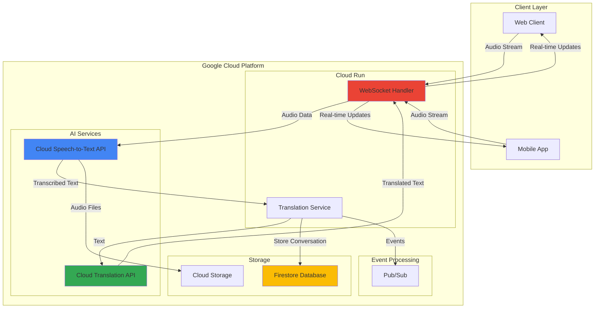

# Real-Time Translation Services with Cloud Speech-to-Text and Cloud Translation

## Problem

Global businesses increasingly need to support real-time multilingual communication for customer service centers, international meetings, and cross-cultural collaboration. Traditional translation solutions require manual copying and pasting of text between applications, creating delays and interrupting natural conversation flow. Companies struggle with expensive on-premises speech recognition infrastructure that lacks the accuracy and language coverage needed for professional multilingual interactions, while existing cloud solutions often fail to provide the low-latency performance required for natural conversations.

## Solution

Build a cloud-native real-time translation platform using Google Cloud Speech-to-Text for accurate audio transcription and Cloud Translation for instant multilingual conversion. The solution leverages Cloud Run for scalable WebSocket connections and Firestore for conversation persistence, creating a seamless pipeline that transcribes spoken audio, translates it to multiple target languages, and delivers results via real-time connections to support live conversation scenarios with sub-second latency.

## Architecture Diagram



## Prerequisites

1. Google Cloud account with billing enabled and project creation permissions
2. gcloud CLI v400.0+ installed and configured (or Google Cloud Shell)
3. Basic understanding of JavaScript/Node.js for WebSocket implementation
4. Knowledge of audio streaming concepts and WebSocket protocols
5. Estimated cost: $5-15 for testing resources (Speech-to-Text: $0.024/minute, Translation: $20/1M characters)

> **Note**: This recipe uses streaming Speech-to-Text which requires gRPC connections and has a 10MB limit per streaming request for optimal real-time performance. Audio should be captured at 16kHz or higher sampling rate for best accuracy.

## Preparation

```bash
# Set environment variables for Google Cloud resources
export PROJECT_ID="translation-platform-$(date +%s)"
export REGION="us-central1"
export ZONE="us-central1-a"

# Generate unique suffix for resource names
RANDOM_SUFFIX=$(openssl rand -hex 3)
export SERVICE_NAME="translation-service-${RANDOM_SUFFIX}"
export FIRESTORE_DATABASE="translation-db-${RANDOM_SUFFIX}"

# Set default project and region
gcloud config set project ${PROJECT_ID}
gcloud config set compute/region ${REGION}
gcloud config set compute/zone ${ZONE}

# Create the project
gcloud projects create ${PROJECT_ID} \
    --name="Real-time Translation Platform"

# Set billing account (replace with your billing account ID)
# gcloud billing projects link ${PROJECT_ID} \
#     --billing-account=YOUR_BILLING_ACCOUNT_ID

# Enable required APIs
gcloud services enable speech.googleapis.com \
    translate.googleapis.com \
    run.googleapis.com \
    firestore.googleapis.com \
    pubsub.googleapis.com \
    cloudbuild.googleapis.com

echo "✅ Project configured: ${PROJECT_ID}"
echo "✅ APIs enabled for real-time translation services"
```

## Steps

1. **Initialize Firestore Database for Conversation Storage**:

   Firestore provides real-time document synchronization and offline support, essential for maintaining conversation history and enabling users to access translation sessions across devices. The Native mode offers ACID transactions and complex queries needed for conversation management, while automatic scaling handles varying conversation loads without manual intervention.

   ```bash
   # Create Firestore database in Native mode
   gcloud firestore databases create \
       --location=${REGION} \
       --type=firestore-native
   
   # Create composite index for efficient conversation queries
   gcloud firestore indexes composite create \
       --collection-group=conversations \
       --field-config=field-path=userId,order=ascending \
       --field-config=field-path=timestamp,order=descending
   
   echo "✅ Firestore database created for conversation storage"
   ```

   The Firestore database now provides persistent storage for conversation sessions, user preferences, and translation history. This foundation enables features like conversation replay, user-specific language preferences, and analytics on translation usage patterns across your platform.

2. **Create Pub/Sub Topic for Translation Events**:

   Pub/Sub enables asynchronous event processing and decouples translation requests from response delivery, allowing the system to handle varying loads and provide reliable message delivery. This architecture supports future enhancements like translation quality feedback, usage analytics, and integration with external systems for compliance and auditing.

   ```bash
   # Create topic for translation events
   gcloud pubsub topics create translation-events
   
   # Create subscription for processing translation results
   gcloud pubsub subscriptions create translation-processor \
       --topic=translation-events \
       --message-retention-duration=7d
   
   # Create dead letter topic for failed processing
   gcloud pubsub topics create translation-dlq
   
   echo "✅ Pub/Sub messaging configured for event processing"
   ```

   The messaging infrastructure now supports reliable event processing with built-in retry logic and dead letter queuing. This ensures translation events are processed reliably even during system failures or high-load scenarios, maintaining conversation continuity for users.

3. **Create Service Account for Translation Services**:

   Service accounts provide secure, least-privilege access to Google Cloud APIs without exposing user credentials. The translation service requires specific permissions for Speech-to-Text transcription, Translation API access, and Firestore operations while maintaining security boundaries between different system components.

   ```bash
   # Create service account for translation services
   gcloud iam service-accounts create translation-service \
       --display-name="Real-time Translation Service" \
       --description="Service account for speech and translation APIs"
   
   # Grant necessary permissions with least privilege principle
   gcloud projects add-iam-policy-binding ${PROJECT_ID} \
       --member="serviceAccount:translation-service@${PROJECT_ID}.iam.gserviceaccount.com" \
       --role="roles/speech.client"
   
   gcloud projects add-iam-policy-binding ${PROJECT_ID} \
       --member="serviceAccount:translation-service@${PROJECT_ID}.iam.gserviceaccount.com" \
       --role="roles/translate.user"
   
   gcloud projects add-iam-policy-binding ${PROJECT_ID} \
       --member="serviceAccount:translation-service@${PROJECT_ID}.iam.gserviceaccount.com" \
       --role="roles/datastore.user"
   
   gcloud projects add-iam-policy-binding ${PROJECT_ID} \
       --member="serviceAccount:translation-service@${PROJECT_ID}.iam.gserviceaccount.com" \
       --role="roles/pubsub.publisher"
   
   echo "✅ Service account created with translation permissions"
   ```

   The service account now has precisely the permissions needed for AI service access and data storage operations. This security model ensures the translation service can perform its functions while maintaining Google Cloud's defense-in-depth security principles.

4. **Create Cloud Storage Bucket for Audio File Storage**:

   Cloud Storage provides durable, highly available storage for audio files with lifecycle management and access controls. Storing original audio files enables features like conversation replay, quality analysis, and compliance auditing, while Google's global infrastructure ensures low-latency access from anywhere in the world.

   ```bash
   # Create bucket for audio file storage with standard storage class
   gsutil mb -p ${PROJECT_ID} \
       -c STANDARD \
       -l ${REGION} \
       gs://${PROJECT_ID}-audio-files
   
   # Set lifecycle policy for automatic cleanup and cost optimization  
   cat > lifecycle.json << EOF
   {
     "lifecycle": {
       "rule": [
         {
           "action": {"type": "Delete"},
           "condition": {
             "age": 30,
             "matchesStorageClass": ["STANDARD"]
           }
         }
       ]
     }
   }
   EOF
   
   gsutil lifecycle set lifecycle.json \
       gs://${PROJECT_ID}-audio-files
   
   # Enable versioning for data protection
   gsutil versioning set on gs://${PROJECT_ID}-audio-files
   
   # Clean up temporary lifecycle file
   rm lifecycle.json
   
   echo "✅ Cloud Storage configured for audio file management"
   ```

   The storage bucket is now configured with automated lifecycle management to control costs while maintaining compliance requirements. Versioning protects against accidental deletions while the 30-day retention policy balances storage costs with operational needs.

5. **Create Translation Service Application**:

   The Cloud Run service handles WebSocket connections for real-time communication and integrates multiple Google Cloud AI services. This containerized approach provides automatic scaling, built-in load balancing, and seamless deployment capabilities while maintaining stateless architecture principles for reliability and performance.

   ```bash
   # Create application directory structure
   mkdir -p translation-app/src
   cd translation-app
   
   # Create package.json for Node.js application with latest dependencies
   cat > package.json << 'EOF'
   {
     "name": "real-time-translation-service",
     "version": "1.0.0",
     "description": "Real-time translation service with Speech-to-Text and Translation APIs",
     "main": "src/index.js",
     "scripts": {
       "start": "node src/index.js",
       "dev": "nodemon src/index.js"
     },
     "dependencies": {
       "@google-cloud/speech": "^6.0.0",
       "@google-cloud/translate": "^8.0.0",
       "@google-cloud/firestore": "^7.0.0",
       "@google-cloud/pubsub": "^4.0.0",
       "express": "^4.18.0",
       "ws": "^8.14.0",
       "uuid": "^9.0.0",
       "cors": "^2.8.5"
     },
     "engines": {
       "node": ">=18"
     }
   }
   EOF
   
   echo "✅ Application structure created with dependencies"
   ```

   The application foundation includes all necessary Google Cloud client libraries and WebSocket support for real-time communication. The dependency configuration ensures compatibility with Cloud Run's Node.js runtime while providing access to the latest AI service features.

6. **Implement Real-Time Translation Service Logic**:

   The service logic orchestrates speech recognition, translation, and real-time delivery through WebSocket connections. This implementation handles streaming audio data, manages translation sessions, and provides error handling for production reliability while maintaining low-latency communication essential for real-time conversations.

   ```bash
   # Create main service implementation with enhanced error handling
   cat > src/index.js << 'EOF'
   const express = require('express');
   const WebSocket = require('ws');
   const speech = require('@google-cloud/speech');
   const {Translate} = require('@google-cloud/translate').v2;
   const {Firestore} = require('@google-cloud/firestore');
   const {PubSub} = require('@google-cloud/pubsub');
   const {v4: uuidv4} = require('uuid');
   const cors = require('cors');
   
   // Initialize Google Cloud clients with error handling
   const speechClient = new speech.SpeechClient();
   const translateClient = new Translate();
   const firestore = new Firestore();
   const pubsub = new PubSub();
   
   const app = express();
   const PORT = process.env.PORT || 8080;
   
   // Configure CORS and middleware
   app.use(cors());
   app.use(express.json());
   
   // Health check endpoint for load balancer
   app.get('/health', (req, res) => {
     res.status(200).json({ 
       status: 'healthy', 
       timestamp: new Date().toISOString(),
       version: '1.0.0'
     });
   });
   
   // WebSocket server for real-time communication
   const server = require('http').createServer(app);
   const wss = new WebSocket.Server({ 
     server,
     perMessageDeflate: false // Disable compression for lower latency
   });
   
   // Active translation sessions
   const activeSessions = new Map();
   
   class TranslationSession {
     constructor(ws, sessionId, sourceLanguage, targetLanguages) {
       this.ws = ws;
       this.sessionId = sessionId;
       this.sourceLanguage = sourceLanguage;
       this.targetLanguages = targetLanguages;
       this.recognizeStream = null;
       this.conversationRef = firestore.collection('conversations').doc(sessionId);
       this.initializeConversation();
     }
   
     async initializeConversation() {
       try {
         await this.conversationRef.set({
           sessionId: this.sessionId,
           sourceLanguage: this.sourceLanguage,
           targetLanguages: this.targetLanguages,
           createdAt: new Date(),
           messages: []
         });
       } catch (error) {
         console.error('Failed to initialize conversation:', error);
         this.sendError('Failed to initialize conversation');
       }
     }
   
     startSpeechRecognition() {
       // Enhanced configuration based on Speech-to-Text best practices
       const request = {
         config: {
           encoding: 'WEBM_OPUS',
           sampleRateHertz: 48000,
           languageCode: this.sourceLanguage,
           enableAutomaticPunctuation: true,
           enableWordTimeOffsets: true,
           model: 'latest_long', // Optimized for longer utterances
           useEnhanced: true // Enable enhanced models when available
         },
         interimResults: true,
       };
   
       this.recognizeStream = speechClient
         .streamingRecognize(request)
         .on('data', async (data) => {
           if (data.results[0] && data.results[0].alternatives[0]) {
             const transcript = data.results[0].alternatives[0].transcript;
             const confidence = data.results[0].alternatives[0].confidence;
             const isFinal = data.results[0].isFinal;
             
             if (isFinal) {
               await this.handleTranscription(transcript, confidence);
             } else {
               // Send interim results for immediate feedback
               this.ws.send(JSON.stringify({
                 type: 'interim_transcript',
                 text: transcript,
                 confidence: confidence,
                 sessionId: this.sessionId
               }));
             }
           }
         })
         .on('error', (error) => {
           console.error('Speech recognition error:', error);
           this.sendError('Speech recognition failed', error.message);
         })
         .on('end', () => {
           console.log('Speech recognition stream ended');
         });
     }
   
     async handleTranscription(originalText, confidence) {
       try {
         const messageId = uuidv4();
         const translations = {};
         
         // Translate to all target languages with error handling
         for (const targetLang of this.targetLanguages) {
           try {
             const [translation] = await translateClient.translate(originalText, {
               from: this.sourceLanguage,
               to: targetLang,
             });
             translations[targetLang] = translation;
           } catch (translationError) {
             console.error(`Translation error for ${targetLang}:`, translationError);
             translations[targetLang] = `[Translation failed: ${translationError.message}]`;
           }
         }
   
         // Store in Firestore with enhanced metadata
         const messageData = {
           messageId,
           originalText,
           translations,
           confidence,
           timestamp: new Date(),
           sourceLanguage: this.sourceLanguage
         };
   
         await this.conversationRef.update({
           messages: firestore.FieldValue.arrayUnion(messageData)
         });
   
         // Publish to Pub/Sub for analytics
         await pubsub.topic('translation-events').publish(
           Buffer.from(JSON.stringify({
             sessionId: this.sessionId,
             messageId,
             sourceLanguage: this.sourceLanguage,
             targetLanguages: this.targetLanguages,
             characterCount: originalText.length,
             confidence,
             timestamp: new Date().toISOString()
           }))
         );
   
         // Send real-time results to client
         this.ws.send(JSON.stringify({
           type: 'translation_complete',
           messageId,
           originalText,
           translations,
           confidence,
           sessionId: this.sessionId
         }));
   
       } catch (error) {
         console.error('Translation error:', error);
         this.sendError('Translation failed', error.message);
       }
     }
   
     processAudioChunk(audioData) {
       if (this.recognizeStream && this.recognizeStream.writable) {
         this.recognizeStream.write(audioData);
       }
     }
   
     sendError(message, details = null) {
       this.ws.send(JSON.stringify({
         type: 'error',
         message,
         details,
         sessionId: this.sessionId
       }));
     }
   
     endSession() {
       if (this.recognizeStream) {
         this.recognizeStream.end();
       }
       activeSessions.delete(this.sessionId);
     }
   }
   
   // WebSocket connection handler with enhanced error handling
   wss.on('connection', (ws, req) => {
     console.log('New WebSocket connection established');
     
     ws.on('message', async (message) => {
       try {
         const data = JSON.parse(message);
         
         switch (data.type) {
           case 'start_session':
             const sessionId = uuidv4();
             const session = new TranslationSession(
               ws,
               sessionId,
               data.sourceLanguage || 'en-US',
               data.targetLanguages || ['es', 'fr', 'de']
             );
             
             activeSessions.set(sessionId, session);
             session.startSpeechRecognition();
             
             ws.send(JSON.stringify({
               type: 'session_started',
               sessionId,
               sourceLanguage: session.sourceLanguage,
               targetLanguages: session.targetLanguages
             }));
             break;
             
           case 'audio_data':
             const activeSession = activeSessions.get(data.sessionId);
             if (activeSession && data.audio) {
               const audioBuffer = Buffer.from(data.audio, 'base64');
               activeSession.processAudioChunk(audioBuffer);
             }
             break;
             
           case 'end_session':
             const endSession = activeSessions.get(data.sessionId);
             if (endSession) {
               endSession.endSession();
               ws.send(JSON.stringify({
                 type: 'session_ended',
                 sessionId: data.sessionId
               }));
             }
             break;
         }
       } catch (error) {
         console.error('WebSocket message error:', error);
         ws.send(JSON.stringify({
           type: 'error',
           message: 'Invalid message format',
           error: error.message
         }));
       }
     });
   
     ws.on('close', () => {
       // Clean up any active sessions for this connection
       for (const [sessionId, session] of activeSessions) {
         if (session.ws === ws) {
           session.endSession();
         }
       }
       console.log('WebSocket connection closed');
     });
     
     ws.on('error', (error) => {
       console.error('WebSocket error:', error);
     });
   });
   
   // Graceful shutdown handling
   process.on('SIGTERM', () => {
     console.log('SIGTERM received, shutting down gracefully');
     server.close(() => {
       console.log('Process terminated');
     });
   });
   
   // Start server
   server.listen(PORT, () => {
     console.log(`Real-time translation service running on port ${PORT}`);
   });
   EOF
   
   echo "✅ Translation service implementation completed"
   ```

   The translation service now provides comprehensive real-time functionality including streaming speech recognition with enhanced error handling, multi-language translation, conversation persistence, and WebSocket communication. This architecture supports scalable, low-latency translation for multiple concurrent users while maintaining conversation context and providing reliable error handling.

7. **Create Dockerfile for Container Deployment**:

   Containerization enables consistent deployment across environments and leverages Cloud Run's automatic scaling capabilities. The Docker configuration optimizes for production use with proper security practices, efficient layer caching, and minimal attack surface while ensuring the application has access to all required dependencies.

   ```bash
   # Create optimized Dockerfile for Cloud Run deployment
   cat > Dockerfile << 'EOF'
   # Use official Node.js runtime as base image
   FROM node:18-slim
   
   # Install curl for health checks
   RUN apt-get update && apt-get install -y curl && rm -rf /var/lib/apt/lists/*
   
   # Create app directory
   WORKDIR /usr/src/app
   
   # Copy package files first for better layer caching
   COPY package*.json ./
   
   # Install dependencies with production optimizations
   RUN npm ci --only=production && npm cache clean --force
   
   # Copy application source
   COPY src/ ./src/
   
   # Create non-root user for security
   RUN groupadd -r appuser && useradd -r -g appuser appuser
   RUN chown -R appuser:appuser /usr/src/app
   USER appuser
   
   # Expose port
   EXPOSE 8080
   
   # Health check for container orchestration
   HEALTHCHECK --interval=30s --timeout=3s --start-period=5s --retries=3 \
     CMD curl -f http://localhost:8080/health || exit 1
   
   # Start application
   CMD ["npm", "start"]
   EOF
   
   # Create .dockerignore for efficient builds
   cat > .dockerignore << 'EOF'
   node_modules
   npm-debug.log
   .git
   .gitignore
   README.md
   .env
   .nyc_output
   coverage
   *.log
   .DS_Store
   EOF
   
   echo "✅ Container configuration created for Cloud Run"
   ```

   The containerization setup follows security best practices with non-root execution, health checks, and optimized layer structure. This configuration ensures efficient builds and deployments while maintaining the security posture required for production translation services.

8. **Deploy Translation Service to Cloud Run**:

   Cloud Run provides serverless container deployment with automatic scaling, built-in load balancing, and pay-per-use pricing. The deployment configuration ensures the translation service can handle varying loads while maintaining cost efficiency and providing the reliability needed for real-time communication applications.

   ```bash
   # Build and deploy to Cloud Run with production configuration
   gcloud run deploy ${SERVICE_NAME} \
       --source . \
       --platform managed \
       --region ${REGION} \
       --allow-unauthenticated \
       --service-account=translation-service@${PROJECT_ID}.iam.gserviceaccount.com \
       --memory=2Gi \
       --cpu=2 \
       --concurrency=1000 \
       --max-instances=10 \
       --timeout=300 \
       --execution-environment=gen2 \
       --set-env-vars="PROJECT_ID=${PROJECT_ID}"
   
   # Get service URL for testing
   export SERVICE_URL=$(gcloud run services describe ${SERVICE_NAME} \
       --region ${REGION} \
       --format="value(status.url)")
   
   echo "✅ Translation service deployed to: ${SERVICE_URL}"
   ```

   The Cloud Run service is now deployed with production-ready configuration including appropriate memory allocation for AI workloads, concurrency settings for WebSocket connections, and auto-scaling parameters that balance performance with cost efficiency.

9. **Create Client-Side WebSocket Test Implementation**:

   A test client demonstrates the real-time translation workflow and validates the complete system functionality. This implementation shows how frontend applications can integrate with the translation service using WebSocket connections, audio streaming, and real-time result processing.

   ```bash
   # Create test client directory
   mkdir -p ../client-test
   cd ../client-test
   
   # Create HTML test client with enhanced UI
   cat > index.html << EOF
   <!DOCTYPE html>
   <html lang="en">
   <head>
       <meta charset="UTF-8">
       <meta name="viewport" content="width=device-width, initial-scale=1.0">
       <title>Real-Time Translation Test</title>
       <style>
           body { 
               font-family: 'Segoe UI', Tahoma, Geneva, Verdana, sans-serif; 
               margin: 20px; 
               background-color: #f5f5f5; 
           }
           .container { 
               max-width: 900px; 
               margin: 0 auto; 
               background: white; 
               padding: 20px; 
               border-radius: 10px; 
               box-shadow: 0 2px 10px rgba(0,0,0,0.1); 
           }
           .status { 
               padding: 12px; 
               border-radius: 6px; 
               margin: 10px 0; 
               font-weight: 500; 
           }
           .success { background-color: #d4edda; color: #155724; border: 1px solid #c3e6cb; }
           .error { background-color: #f8d7da; color: #721c24; border: 1px solid #f5c6cb; }
           .transcript { 
               margin: 20px 0; 
               padding: 15px; 
               background: #f8f9fa; 
               border-radius: 8px; 
               border-left: 4px solid #007bff; 
           }
           .translation { 
               margin: 10px 0; 
               padding: 12px; 
               background: #e9ecef; 
               border-radius: 6px; 
               border-left: 3px solid #28a745; 
           }
           button { 
               padding: 12px 24px; 
               margin: 8px; 
               cursor: pointer; 
               border: none; 
               border-radius: 6px; 
               font-size: 16px; 
               font-weight: 500; 
               transition: all 0.3s; 
           }
           .start-btn { background-color: #28a745; color: white; }
           .start-btn:hover { background-color: #218838; }
           .recording { background-color: #dc3545; color: white; animation: pulse 1.5s infinite; }
           .stop-btn { background-color: #6c757d; color: white; }
           .stop-btn:hover { background-color: #5a6268; }
           @keyframes pulse { 0% { opacity: 1; } 50% { opacity: 0.7; } 100% { opacity: 1; } }
           .config-section { 
               background: #f8f9fa; 
               padding: 15px; 
               border-radius: 8px; 
               margin: 15px 0; 
           }
           .config-row { margin: 10px 0; }
           label { font-weight: 500; margin-right: 10px; }
           select, input[type="checkbox"] { margin: 5px; }
           .confidence { font-size: 0.9em; color: #6c757d; }
       </style>
   </head>
   <body>
       <div class="container">
           <h1>🌐 Real-Time Translation Service Test</h1>
           
           <div class="config-section">
               <h3>Configuration</h3>
               <div class="config-row">
                   <label for="sourceLanguage">Source Language:</label>
                   <select id="sourceLanguage">
                       <option value="en-US">English (US)</option>
                       <option value="es-ES">Spanish (Spain)</option>
                       <option value="fr-FR">French (France)</option>
                       <option value="de-DE">German (Germany)</option>
                       <option value="ja-JP">Japanese (Japan)</option>
                       <option value="zh-CN">Chinese (Simplified)</option>
                   </select>
               </div>
               
               <div class="config-row">
                   <label>Target Languages:</label><br>
                   <input type="checkbox" id="es" value="es" checked> Spanish
                   <input type="checkbox" id="fr" value="fr" checked> French
                   <input type="checkbox" id="de" value="de" checked> German
                   <input type="checkbox" id="ja" value="ja"> Japanese
                   <input type="checkbox" id="zh" value="zh"> Chinese
               </div>
           </div>
           
           <div>
               <button id="startBtn" class="start-btn">🎤 Start Recording</button>
               <button id="stopBtn" class="stop-btn" disabled>⏹️ Stop Recording</button>
           </div>
           
           <div id="status" class="status"></div>
           <div id="transcripts"></div>
           
           <script>
               const SERVICE_URL = '${SERVICE_URL}'.replace('https://', 'wss://');
               let ws = null;
               let mediaRecorder = null;
               let sessionId = null;
               
               document.getElementById('startBtn').addEventListener('click', startRecording);
               document.getElementById('stopBtn').addEventListener('click', stopRecording);
               
               function updateStatus(message, isError = false) {
                   const statusDiv = document.getElementById('status');
                   statusDiv.textContent = message;
                   statusDiv.className = 'status ' + (isError ? 'error' : 'success');
               }
               
               async function startRecording() {
                   try {
                       // Get selected languages
                       const sourceLanguage = document.getElementById('sourceLanguage').value;
                       const targetLanguages = Array.from(document.querySelectorAll('input[type="checkbox"]:checked'))
                           .map(cb => cb.value);
                       
                       if (targetLanguages.length === 0) {
                           updateStatus('Please select at least one target language', true);
                           return;
                       }
                       
                       // Connect to WebSocket
                       ws = new WebSocket(SERVICE_URL);
                       
                       ws.onopen = () => {
                           updateStatus('🔗 Connected to translation service');
                           
                           // Start translation session
                           ws.send(JSON.stringify({
                               type: 'start_session',
                               sourceLanguage: sourceLanguage,
                               targetLanguages: targetLanguages
                           }));
                       };
                       
                       ws.onmessage = (event) => {
                           const data = JSON.parse(event.data);
                           handleWebSocketMessage(data);
                       };
                       
                       ws.onerror = (error) => {
                           updateStatus('❌ WebSocket error: ' + error.message, true);
                       };
                       
                       // Get microphone access with enhanced constraints
                       const stream = await navigator.mediaDevices.getUserMedia({ 
                           audio: {
                               sampleRate: 48000,
                               channelCount: 1,
                               echoCancellation: true,
                               noiseSuppression: true,
                               autoGainControl: false
                           }
                       });
                       
                       mediaRecorder = new MediaRecorder(stream, {
                           mimeType: 'audio/webm;codecs=opus'
                       });
                       
                       mediaRecorder.ondataavailable = (event) => {
                           if (event.data.size > 0 && ws && ws.readyState === WebSocket.OPEN) {
                               const reader = new FileReader();
                               reader.onload = () => {
                                   const audioData = reader.result.split(',')[1];
                                   ws.send(JSON.stringify({
                                       type: 'audio_data',
                                       sessionId: sessionId,
                                       audio: audioData
                                   }));
                               };
                               reader.readAsDataURL(event.data);
                           }
                       };
                       
                       mediaRecorder.start(100); // Send data every 100ms for optimal latency
                       
                       document.getElementById('startBtn').disabled = true;
                       document.getElementById('stopBtn').disabled = false;
                       document.getElementById('startBtn').textContent = '🎤 Recording...';
                       document.getElementById('startBtn').className = 'recording';
                       
                   } catch (error) {
                       updateStatus('❌ Error starting recording: ' + error.message, true);
                   }
               }
               
               function stopRecording() {
                   if (mediaRecorder && mediaRecorder.state !== 'inactive') {
                       mediaRecorder.stop();
                       mediaRecorder.stream.getTracks().forEach(track => track.stop());
                   }
                   
                   if (ws && sessionId) {
                       ws.send(JSON.stringify({
                           type: 'end_session',
                           sessionId: sessionId
                       }));
                   }
                   
                   if (ws) {
                       ws.close();
                   }
                   
                   document.getElementById('startBtn').disabled = false;
                   document.getElementById('stopBtn').disabled = true;
                   document.getElementById('startBtn').textContent = '🎤 Start Recording';
                   document.getElementById('startBtn').className = 'start-btn';
                   
                   updateStatus('⏹️ Recording stopped');
               }
               
               function handleWebSocketMessage(data) {
                   const transcriptsDiv = document.getElementById('transcripts');
                   
                   switch (data.type) {
                       case 'session_started':
                           sessionId = data.sessionId;
                           updateStatus('✅ Translation session started');
                           break;
                           
                       case 'interim_transcript':
                           updateStatus('👂 Listening: ' + data.text + 
                               (data.confidence ? \` (confidence: \${(data.confidence * 100).toFixed(1)}%)\` : ''));
                           break;
                           
                       case 'translation_complete':
                           const transcriptDiv = document.createElement('div');
                           transcriptDiv.className = 'transcript';
                           transcriptDiv.innerHTML = '<strong>🗣️ Original:</strong> ' + data.originalText;
                           
                           if (data.confidence) {
                               const confidenceSpan = document.createElement('span');
                               confidenceSpan.className = 'confidence';
                               confidenceSpan.innerHTML = \` (Confidence: \${(data.confidence * 100).toFixed(1)}%)\`;
                               transcriptDiv.appendChild(confidenceSpan);
                           }
                           
                           Object.entries(data.translations).forEach(([lang, translation]) => {
                               const translationDiv = document.createElement('div');
                               translationDiv.className = 'translation';
                               translationDiv.innerHTML = '<strong>🌍 ' + lang.toUpperCase() + ':</strong> ' + translation;
                               transcriptDiv.appendChild(translationDiv);
                           });
                           
                           transcriptsDiv.insertBefore(transcriptDiv, transcriptsDiv.firstChild);
                           updateStatus('✅ Translation completed');
                           break;
                           
                       case 'session_ended':
                           updateStatus('🔚 Session ended');
                           break;
                           
                       case 'error':
                           updateStatus('❌ Error: ' + data.message + 
                               (data.details ? \` (\${data.details})\` : ''), true);
                           break;
                   }
               }
           </script>
       </div>
   </body>
   </html>
   EOF
   
   # Update the SERVICE_URL in the HTML file
   sed -i "s|\${SERVICE_URL}|${SERVICE_URL}|g" index.html
   
   echo "✅ Test client created at: $(pwd)/index.html"
   echo "📖 Open this file in a web browser to test the translation service"
   ```

   The test client provides a complete demonstration of real-time translation functionality including microphone access, WebSocket communication, and real-time result display. This implementation serves as a reference for integrating the translation service into production applications with enhanced UI and improved audio configuration.

## Validation & Testing

1. **Verify Cloud Run Service Deployment**:

   ```bash
   # Check service status and configuration
   gcloud run services describe ${SERVICE_NAME} \
       --region ${REGION} \
       --format="table(metadata.name,status.url,status.conditions[0].type,spec.template.spec.serviceAccountName)"
   
   # Test health endpoint
   curl -f "${SERVICE_URL}/health"
   ```

   Expected output: JSON response with status "healthy", current timestamp, and version information

2. **Test WebSocket Connection and Translation Flow**:

   ```bash
   # Install wscat for WebSocket testing if not available
   npm install -g wscat
   
   # Test WebSocket connection
   WS_URL=$(echo ${SERVICE_URL} | sed 's/https:/wss:/')
   echo "Testing WebSocket connection to: ${WS_URL}"
   
   # This will open an interactive WebSocket session
   # Send: {"type":"start_session","sourceLanguage":"en-US","targetLanguages":["es","fr"]}
   wscat -c ${WS_URL}
   ```

   Expected output: Connection established with session_started message containing sessionId and language configuration

3. **Verify Firestore Data Storage**:

   ```bash
   # List conversations in Firestore
   gcloud firestore collections list
   
   # Query conversation documents with detailed formatting
   gcloud alpha firestore documents list \
       --collection-id=conversations \
       --limit=5 \
       --format="table(name,createTime,updateTime)"
   ```

   Expected output: List of conversation documents with creation and update timestamps

4. **Test Pub/Sub Message Processing**:

   ```bash
   # Check Pub/Sub topic and subscription status
   gcloud pubsub topics describe translation-events
   gcloud pubsub subscriptions describe translation-processor
   
   # Pull messages from subscription to verify event publishing
   gcloud pubsub subscriptions pull translation-processor \
       --limit=5 \
       --auto-ack \
       --format="table(message.data.decode('utf-8'),message.publishTime)"
   ```

   Expected output: Translation event messages with session metadata, character counts, and timestamps

## Cleanup

1. **Delete Cloud Run Service**:

   ```bash
   # Delete the translation service
   gcloud run services delete ${SERVICE_NAME} \
       --region ${REGION} \
       --quiet
   
   echo "✅ Cloud Run service deleted"
   ```

2. **Remove Storage Resources**:

   ```bash
   # Delete Cloud Storage bucket and contents
   gsutil -m rm -r gs://${PROJECT_ID}-audio-files
   
   # Delete Firestore database (note: this deletes all data)
   gcloud firestore databases delete \
       --database='(default)' \
       --quiet
   
   echo "✅ Storage resources removed"
   ```

3. **Clean Up Pub/Sub Resources**:

   ```bash
   # Delete Pub/Sub subscription and topics
   gcloud pubsub subscriptions delete translation-processor --quiet
   gcloud pubsub topics delete translation-events --quiet
   gcloud pubsub topics delete translation-dlq --quiet
   
   echo "✅ Pub/Sub resources deleted"
   ```

4. **Remove Service Account and Project**:

   ```bash
   # Delete service account
   gcloud iam service-accounts delete \
       translation-service@${PROJECT_ID}.iam.gserviceaccount.com \
       --quiet
   
   # Delete the entire project (optional - removes all resources)
   gcloud projects delete ${PROJECT_ID} --quiet
   
   echo "✅ Project and service account removed"
   echo "Note: Project deletion may take several minutes to complete"
   ```

## Discussion

Real-time translation services represent a critical component of modern global communication infrastructure, enabling seamless cross-language interactions in business, education, and social contexts. This implementation demonstrates how Google Cloud's AI services can be orchestrated to create enterprise-grade translation platforms that handle the complexities of streaming audio, real-time processing, and multi-language output delivery with sub-second latency requirements.

The architecture leverages Google Cloud Speech-to-Text's streaming recognition capabilities, which use advanced neural networks trained on diverse audio data to provide accurate transcription even in challenging acoustic environments. The streaming API's enhanced configuration includes automatic punctuation, word timestamps, and confidence scoring to improve user experience. Integration with Cloud Translation provides access to Google's neural machine translation models, supporting over 100 language pairs with contextual accuracy that surpasses traditional phrase-based translation systems. The use of enhanced models and proper audio configuration (16kHz+ sampling rate, lossless encoding) ensures optimal recognition quality.

Cloud Run's serverless container platform provides the ideal hosting environment for this type of workload, automatically scaling from zero to handle varying conversation loads while maintaining WebSocket connections for real-time communication. The pay-per-use pricing model ensures cost efficiency during low-usage periods, while the managed infrastructure eliminates the operational overhead of maintaining WebSocket servers and load balancers. Firestore's real-time synchronization capabilities enable conversation persistence and cross-device access, while Pub/Sub ensures reliable event processing for analytics and compliance workflows with built-in retry mechanisms and dead letter queues.

The solution addresses key enterprise requirements including conversation auditing, multi-tenant isolation, and integration extensibility. Organizations can enhance this foundation with features like speaker identification, custom vocabulary adaptation, and integration with existing communication platforms. The implementation follows Google Cloud security best practices with service accounts, least-privilege access, and proper error handling. For detailed implementation guidance, refer to the [Google Cloud Speech-to-Text documentation](https://cloud.google.com/speech-to-text/docs), [Cloud Translation best practices](https://cloud.google.com/translate/docs/best-practices), [Cloud Run WebSocket patterns](https://cloud.google.com/run/docs/tutorials/websockets), [Firestore real-time listeners](https://cloud.google.com/firestore/docs/listen), and the [Google Cloud Architecture Framework](https://cloud.google.com/architecture/framework) for scalable application design.

> **Tip**: Implement conversation caching using Cloud Memorystore to reduce translation costs for repeated phrases and improve response times for frequently used expressions in customer service scenarios. Consider using phrase hints in Speech-to-Text for domain-specific terminology.

## Challenge

Extend this solution by implementing these enhancements:

1. **Speaker Diarization and Multi-Party Conversations**: Integrate Cloud Speech-to-Text's speaker diarization feature to identify and separate multiple speakers in conference calls, creating distinct translation streams for each participant and maintaining conversation context across speaker changes with individual confidence tracking.

2. **Custom Translation Models and Domain Adaptation**: Implement AutoML Translation to create industry-specific translation models for technical, medical, or legal terminology, improving accuracy for specialized vocabulary and maintaining consistency with organizational glossaries and style guides.

3. **Real-Time Sentiment Analysis and Content Moderation**: Add Cloud Natural Language API integration to analyze sentiment and detect inappropriate content in real-time, providing conversation quality metrics and automatic content filtering for professional communication environments with customizable sensitivity levels.

4. **Voice Synthesis and Audio Response Generation**: Integrate Cloud Text-to-Speech to convert translated text back to speech, creating a complete voice-to-voice translation pipeline that maintains speaker characteristics and emotional tone across languages for natural conversation flow with SSML markup support.

5. **Advanced Analytics and Machine Learning Insights**: Implement BigQuery integration with real-time streaming to analyze conversation patterns, translation accuracy metrics, and usage analytics, providing business intelligence for improving translation quality and understanding global communication trends with automated reporting dashboards.

## Infrastructure Code

*Infrastructure code will be generated after recipe approval.*