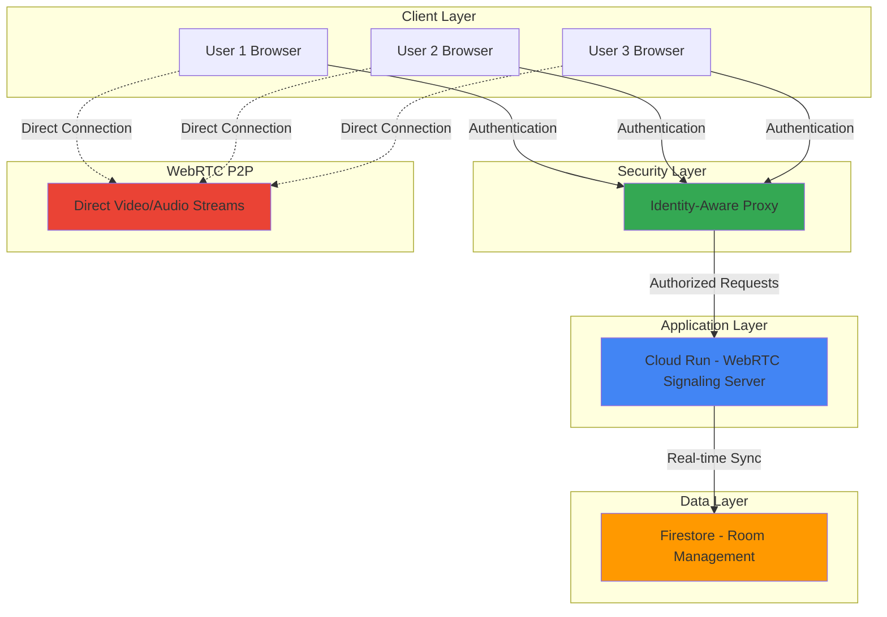

# Real-time Video Collaboration with WebRTC and Cloud Run

## Problem

Remote teams need secure, high-quality video collaboration tools that can handle multiple participants without requiring complex infrastructure management. Traditional video conferencing solutions often suffer from vendor lock-in, limited customization options, and high costs for enterprise features. Organizations need a solution that provides peer-to-peer video communication with centralized signaling and authentication while maintaining security and scalability.

## Solution

Build a custom video collaboration platform using WebRTC for peer-to-peer communication, Cloud Run for hosting the signaling server, Firestore for real-time data synchronization, and Identity-Aware Proxy for secure authentication. This serverless approach eliminates infrastructure management while providing enterprise-grade security and the ability to customize features based on specific business requirements.

## Architecture Diagram



## Prerequisites

1. Google Cloud account with billing enabled and Project Editor permissions
2. Google Cloud CLI (gcloud) installed and configured
3. Basic knowledge of JavaScript, Node.js, and WebRTC concepts
4. Docker installed for local container development
5. Estimated cost: $5-15 per month for development usage (Cloud Run, Firestore, IAP)
6. OAuth 2.0 client credentials (will be created during setup)

> **Note**: WebRTC enables direct peer-to-peer communication between browsers, reducing server bandwidth requirements and improving video quality through direct connections.

## Preparation

```bash
# Set environment variables for GCP resources
export PROJECT_ID="video-collab-$(date +%s)"
export REGION="us-central1"
export SERVICE_NAME="webrtc-signaling"
export USER_EMAIL="your-email@domain.com"  # Replace with your email

# Generate unique suffix for resource names
RANDOM_SUFFIX=$(openssl rand -hex 3)
export FIRESTORE_DATABASE="video-rooms-${RANDOM_SUFFIX}"

# Create new project and set as default
gcloud projects create ${PROJECT_ID} --name="Video Collaboration Platform"
gcloud config set project ${PROJECT_ID}
gcloud config set compute/region ${REGION}

# Enable required APIs
gcloud services enable run.googleapis.com
gcloud services enable firestore.googleapis.com
gcloud services enable iap.googleapis.com
gcloud services enable cloudbuild.googleapis.com

echo "✅ Project configured: ${PROJECT_ID}"
echo "✅ Required APIs enabled"
```

## Steps

1. **Create Firestore Database for Room Management**:

   Firestore provides real-time database capabilities essential for WebRTC signaling and room management. The real-time listeners enable instant synchronization of room state, participant lists, and signaling messages across all connected clients. This NoSQL approach allows flexible schema design for different room types and participant metadata.

   ```bash
   # Create Firestore database in Native mode
   gcloud firestore databases create \
       --database=${FIRESTORE_DATABASE} \
       --location=${REGION} \
       --type=firestore-native
   
   # Set as default database
   gcloud config set firestore/database ${FIRESTORE_DATABASE}
   
   echo "✅ Firestore database created: ${FIRESTORE_DATABASE}"
   ```

   The Firestore database now provides real-time synchronization capabilities for room management, participant tracking, and WebRTC signaling message exchange between peers.

2. **Create WebRTC Signaling Server Application**:

   The signaling server facilitates the initial connection establishment between WebRTC peers by exchanging Session Description Protocol (SDP) offers and answers, as well as ICE (Interactive Connectivity Establishment) candidates. Cloud Run's containerized deployment model provides automatic scaling and cost efficiency for signaling workloads.

   ```bash
   # Create application directory structure
   mkdir -p webrtc-signaling/src
   cd webrtc-signaling
   
   # Create package.json for Node.js dependencies
   cat > package.json << 'EOF'
   {
     "name": "webrtc-signaling-server",
     "version": "1.0.0",
     "description": "WebRTC signaling server for video collaboration",
     "main": "src/server.js",
     "scripts": {
       "start": "node src/server.js"
     },
     "dependencies": {
       "express": "^4.18.2",
       "socket.io": "^4.7.2",
       "@google-cloud/firestore": "^7.1.0",
       "cors": "^2.8.5"
     }
   }
   EOF
   
   echo "✅ Node.js application structure created"
   ```

   This package configuration includes Express for HTTP handling, Socket.IO for real-time WebSocket communication, and Firestore client library for database operations.

3. **Implement Signaling Server Logic**:

   The signaling server handles room creation, participant management, and WebRTC signaling message relay. Socket.IO provides the real-time communication layer necessary for exchanging SDP offers/answers and ICE candidates between participants attempting to establish peer-to-peer connections.

   ```bash
   # Create main server file
   cat > src/server.js << 'EOF'
   const express = require('express');
   const http = require('http');
   const socketIo = require('socket.io');
   const { Firestore } = require('@google-cloud/firestore');
   const cors = require('cors');
   
   const app = express();
   const server = http.createServer(app);
   const io = socketIo(server, {
     cors: {
       origin: "*",
       methods: ["GET", "POST"]
     }
   });
   
   app.use(cors());
   app.use(express.json());
   app.use(express.static('public'));
   
   const firestore = new Firestore();
   const PORT = process.env.PORT || 8080;
   
   // Room management and signaling logic
   io.on('connection', (socket) => {
     console.log('User connected:', socket.id);
   
     socket.on('join-room', async (roomId) => {
       socket.join(roomId);
       
       // Update room participants in Firestore
       const roomRef = firestore.collection('rooms').doc(roomId);
       await roomRef.set({
         participants: Firestore.FieldValue.arrayUnion(socket.id),
         lastActivity: new Date()
       }, { merge: true });
       
       socket.to(roomId).emit('user-joined', socket.id);
     });
   
     socket.on('webrtc-offer', (data) => {
       socket.to(data.target).emit('webrtc-offer', {
         offer: data.offer,
         sender: socket.id
       });
     });
   
     socket.on('webrtc-answer', (data) => {
       socket.to(data.target).emit('webrtc-answer', {
         answer: data.answer,
         sender: socket.id
       });
     });
   
     socket.on('ice-candidate', (data) => {
       socket.to(data.target).emit('ice-candidate', {
         candidate: data.candidate,
         sender: socket.id
       });
     });
   
     socket.on('disconnect', async () => {
       console.log('User disconnected:', socket.id);
       // Remove from all rooms in Firestore
       const roomsQuery = await firestore.collection('rooms')
         .where('participants', 'array-contains', socket.id)
         .get();
       
       roomsQuery.forEach(async (doc) => {
         await doc.ref.update({
           participants: Firestore.FieldValue.arrayRemove(socket.id)
         });
       });
     });
   });
   
   app.get('/health', (req, res) => {
     res.status(200).json({ status: 'healthy' });
   });
   
   server.listen(PORT, () => {
     console.log(`Signaling server running on port ${PORT}`);
   });
   EOF
   
   echo "✅ Signaling server implementation completed"
   ```

   This implementation provides the core WebRTC signaling functionality including room management, offer/answer exchange, and ICE candidate relay through Socket.IO WebSocket connections.

4. **Create Client-Side Video Interface**:

   The client interface handles WebRTC peer connections, media stream acquisition, and user interface for video collaboration. This browser-based implementation demonstrates the complete WebRTC workflow from getUserMedia to established peer connections.

   ```bash
   # Create public directory for client files
   mkdir -p public
   
   # Create main HTML interface
   cat > public/index.html << 'EOF'
   <!DOCTYPE html>
   <html lang="en">
   <head>
       <meta charset="UTF-8">
       <meta name="viewport" content="width=device-width, initial-scale=1.0">
       <title>Video Collaboration Platform</title>
       <style>
           body { font-family: Arial, sans-serif; margin: 20px; }
           .video-container { display: flex; flex-wrap: wrap; gap: 20px; }
           video { width: 300px; height: 200px; border: 1px solid #ccc; }
           .controls { margin: 20px 0; }
           button { padding: 10px 20px; margin: 5px; }
       </style>
   </head>
   <body>
       <h1>Video Collaboration Platform</h1>
       <div class="controls">
           <input type="text" id="roomId" placeholder="Enter Room ID" value="room-123">
           <button id="joinRoom">Join Room</button>
           <button id="leaveRoom">Leave Room</button>
           <button id="toggleVideo">Toggle Video</button>
           <button id="toggleAudio">Toggle Audio</button>
       </div>
       <div class="video-container">
           <video id="localVideo" autoplay muted></video>
           <div id="remoteVideos"></div>
       </div>
       <script src="/socket.io/socket.io.js"></script>
       <script src="app.js"></script>
   </body>
   </html>
   EOF
   
   echo "✅ Client HTML interface created"
   ```

   The interface provides room management controls and video display containers for both local and remote participants.

5. **Implement WebRTC Client Logic**:

   The client-side JavaScript handles the complete WebRTC workflow including media acquisition, peer connection establishment, and signaling message handling. This implementation manages multiple peer connections for multi-participant video calls.

   ```bash
   # Create client-side JavaScript
   cat > public/app.js << 'EOF'
   const socket = io();
   const localVideo = document.getElementById('localVideo');
   const remoteVideos = document.getElementById('remoteVideos');
   const joinRoomBtn = document.getElementById('joinRoom');
   const leaveRoomBtn = document.getElementById('leaveRoom');
   const toggleVideoBtn = document.getElementById('toggleVideo');
   const toggleAudioBtn = document.getElementById('toggleAudio');
   const roomIdInput = document.getElementById('roomId');
   
   let localStream;
   let peerConnections = {};
   let currentRoom = null;
   
   const configuration = {
     iceServers: [
       { urls: 'stun:stun.l.google.com:19302' },
       { urls: 'stun:stun1.l.google.com:19302' }
     ]
   };
   
   // Get local media stream
   async function getLocalStream() {
     try {
       localStream = await navigator.mediaDevices.getUserMedia({
         video: true,
         audio: true
       });
       localVideo.srcObject = localStream;
       return true;
     } catch (error) {
       console.error('Error accessing media devices:', error);
       return false;
     }
   }
   
   // Create peer connection
   function createPeerConnection(userId) {
     const peerConnection = new RTCPeerConnection(configuration);
     
     // Add local stream tracks
     localStream.getTracks().forEach(track => {
       peerConnection.addTrack(track, localStream);
     });
   
     // Handle remote stream
     peerConnection.ontrack = (event) => {
       const remoteStream = event.streams[0];
       let remoteVideo = document.getElementById(`remote-${userId}`);
       
       if (!remoteVideo) {
         remoteVideo = document.createElement('video');
         remoteVideo.id = `remote-${userId}`;
         remoteVideo.autoplay = true;
         remoteVideos.appendChild(remoteVideo);
       }
       
       remoteVideo.srcObject = remoteStream;
     };
   
     // Handle ICE candidates
     peerConnection.onicecandidate = (event) => {
       if (event.candidate) {
         socket.emit('ice-candidate', {
           target: userId,
           candidate: event.candidate
         });
       }
     };
   
     return peerConnection;
   }
   
   // Join room
   joinRoomBtn.addEventListener('click', async () => {
     const roomId = roomIdInput.value.trim();
     if (!roomId) return;
   
     const hasMedia = await getLocalStream();
     if (!hasMedia) return;
   
     currentRoom = roomId;
     socket.emit('join-room', roomId);
     joinRoomBtn.disabled = true;
     leaveRoomBtn.disabled = false;
   });
   
   // Socket event handlers
   socket.on('user-joined', async (userId) => {
     const peerConnection = createPeerConnection(userId);
     peerConnections[userId] = peerConnection;
   
     const offer = await peerConnection.createOffer();
     await peerConnection.setLocalDescription(offer);
   
     socket.emit('webrtc-offer', {
       target: userId,
       offer: offer
     });
   });
   
   socket.on('webrtc-offer', async (data) => {
     const peerConnection = createPeerConnection(data.sender);
     peerConnections[data.sender] = peerConnection;
   
     await peerConnection.setRemoteDescription(data.offer);
     const answer = await peerConnection.createAnswer();
     await peerConnection.setLocalDescription(answer);
   
     socket.emit('webrtc-answer', {
       target: data.sender,
       answer: answer
     });
   });
   
   socket.on('webrtc-answer', async (data) => {
     const peerConnection = peerConnections[data.sender];
     if (peerConnection) {
       await peerConnection.setRemoteDescription(data.answer);
     }
   });
   
   socket.on('ice-candidate', async (data) => {
     const peerConnection = peerConnections[data.sender];
     if (peerConnection) {
       await peerConnection.addIceCandidate(data.candidate);
     }
   });
   
   // Toggle video/audio controls
   toggleVideoBtn.addEventListener('click', () => {
     if (localStream) {
       const videoTrack = localStream.getVideoTracks()[0];
       if (videoTrack) {
         videoTrack.enabled = !videoTrack.enabled;
         toggleVideoBtn.textContent = videoTrack.enabled ? 'Turn Off Video' : 'Turn On Video';
       }
     }
   });
   
   toggleAudioBtn.addEventListener('click', () => {
     if (localStream) {
       const audioTrack = localStream.getAudioTracks()[0];
       if (audioTrack) {
         audioTrack.enabled = !audioTrack.enabled;
         toggleAudioBtn.textContent = audioTrack.enabled ? 'Mute Audio' : 'Unmute Audio';
       }
     }
   });
   
   // Leave room functionality
   leaveRoomBtn.addEventListener('click', () => {
     if (currentRoom) {
       // Close all peer connections
       Object.values(peerConnections).forEach(pc => pc.close());
       peerConnections = {};
       
       // Stop local stream
       if (localStream) {
         localStream.getTracks().forEach(track => track.stop());
         localVideo.srcObject = null;
       }
       
       // Remove remote videos
       remoteVideos.innerHTML = '';
       
       socket.disconnect();
       currentRoom = null;
       joinRoomBtn.disabled = false;
       leaveRoomBtn.disabled = true;
     }
   });
   EOF
   
   echo "✅ WebRTC client logic implemented"
   ```

   This comprehensive client implementation handles the complete WebRTC signaling flow and media management for multi-participant video collaboration.

6. **Create Dockerfile for Cloud Run Deployment**:

   Cloud Run requires containerized applications for deployment. This Dockerfile creates an optimized Node.js container with proper security configurations and multi-stage builds for efficient image size and startup performance.

   ```bash
   # Create Dockerfile for Cloud Run
   cat > Dockerfile << 'EOF'
   # Use official Node.js runtime as base image
   FROM node:18-alpine
   
   # Set working directory
   WORKDIR /app
   
   # Copy package files
   COPY package*.json ./
   
   # Install dependencies
   RUN npm ci --only=production
   
   # Copy application code
   COPY . .
   
   # Create non-root user for security
   RUN addgroup -g 1001 -S nodejs
   RUN adduser -S nodejs -u 1001
   
   # Change ownership of the working directory
   RUN chown -R nodejs:nodejs /app
   USER nodejs
   
   # Expose port
   EXPOSE 8080
   
   # Install curl for health checks
   RUN apk add --no-cache curl
   
   # Health check
   HEALTHCHECK --interval=30s --timeout=10s --start-period=5s --retries=3 \
     CMD curl -f http://localhost:8080/health || exit 1
   
   # Start application
   CMD ["npm", "start"]
   EOF
   
   echo "✅ Dockerfile created for Cloud Run deployment"
   ```

   This production-ready Dockerfile follows security best practices with non-root user execution and health checks for reliable container orchestration.

7. **Deploy Signaling Server to Cloud Run**:

   Cloud Run provides serverless container deployment with automatic scaling based on incoming requests. The platform handles infrastructure management while providing high availability and cost-effective scaling for WebRTC signaling workloads.

   ```bash
   # Build and deploy to Cloud Run
   gcloud run deploy ${SERVICE_NAME} \
       --source . \
       --platform managed \
       --region ${REGION} \
       --allow-unauthenticated \
       --memory 512Mi \
       --cpu 1 \
       --min-instances 0 \
       --max-instances 10 \
       --port 8080 \
       --set-env-vars "FIRESTORE_DATABASE=${FIRESTORE_DATABASE}"
   
   # Get service URL
   export SERVICE_URL=$(gcloud run services describe ${SERVICE_NAME} \
       --region ${REGION} \
       --format 'value(status.url)')
   
   echo "✅ Signaling server deployed to Cloud Run"
   echo "Service URL: ${SERVICE_URL}"
   ```

   The Cloud Run service now provides scalable WebRTC signaling capabilities with automatic HTTPS termination and global edge caching for optimal performance.

8. **Configure Identity-Aware Proxy for Authentication**:

   Identity-Aware Proxy provides zero-trust security for Cloud Run services by authenticating users before allowing access to the application. This approach eliminates the need for VPN connections while providing granular access control based on user identity and context.

   ```bash
   # Configure OAuth consent screen and IAP
   echo "Configuring IAP authentication..."
   
   # Create OAuth consent screen (manual step required)
   echo "Manual step: Configure OAuth consent screen at:"
   echo "https://console.cloud.google.com/apis/credentials/consent"
   echo "Set Application name, User support email, and Developer contact"
   
   # Create OAuth 2.0 client credentials
   gcloud auth application-default print-access-token > /tmp/token
   
   # For production use, create OAuth client through console:
   echo "Manual step: Create OAuth 2.0 client at:"
   echo "https://console.cloud.google.com/apis/credentials"
   echo "Application type: Web application"
   echo "Authorized redirect URIs: https://iap.googleapis.com/v1/oauth/clientIds/CLIENT_ID:handleRedirect"
   
   # Add IAP users (replace with actual email addresses)
   gcloud projects add-iam-policy-binding ${PROJECT_ID} \
       --member="user:${USER_EMAIL:-your-email@domain.com}" \
       --role="roles/iap.httpsResourceAccessor"
   
   echo "✅ IAP permissions configured"
   echo "Note: Complete OAuth setup manually in console, then enable IAP"
   echo "Enable IAP at: https://console.cloud.google.com/security/iap"
   ```

   IAP configuration requires manual OAuth consent screen setup and client creation through the Google Cloud Console for security compliance. The automated authentication provides enterprise-grade access control once properly configured.

## Validation & Testing

1. **Verify Cloud Run Service Deployment**:

   ```bash
   # Check service status and configuration
   gcloud run services describe ${SERVICE_NAME} \
       --region ${REGION} \
       --format "table(metadata.name,status.url,spec.template.spec.containers[0].image)"
   
   # Test health endpoint
   curl -f "${SERVICE_URL}/health"
   ```

   Expected output: `{"status":"healthy"}` indicating successful deployment and service availability.

2. **Test Firestore Database Connectivity**:

   ```bash
   # Verify Firestore database access
   gcloud firestore databases describe ${FIRESTORE_DATABASE} \
       --format "table(name,type,locationId)"
   
   # Check collection creation capability
   gcloud firestore documents create-auto-id \
       --collection=test-collection \
       --data='{"test": "connection", "timestamp": "'$(date)'"}' \
       --database=${FIRESTORE_DATABASE}
   ```

   Expected output: Database details showing Native mode and successful document creation.

3. **Validate WebRTC Signaling Flow**:

   ```bash
   # Test Socket.IO connection
   curl -I "${SERVICE_URL}/socket.io/?EIO=4&transport=polling"
   
   # Verify static file serving
   curl -I "${SERVICE_URL}/"
   ```

   Expected output: HTTP 200 responses indicating Socket.IO endpoint availability and static file serving.

4. **Test Multi-User Video Session**:

   Open multiple browser windows to `${SERVICE_URL}`, join the same room ID, and verify:
   - Local video stream appears in each window
   - Remote participant videos appear when others join
   - Audio/video controls function properly
   - Real-time synchronization through Firestore

## Cleanup

1. **Remove Cloud Run Service**:

   ```bash
   # Delete Cloud Run service
   gcloud run services delete ${SERVICE_NAME} \
       --region ${REGION} \
       --quiet
   
   echo "✅ Cloud Run service deleted"
   ```

2. **Remove Firestore Database**:

   ```bash
   # Delete Firestore database
   gcloud firestore databases delete ${FIRESTORE_DATABASE} \
       --quiet
   
   echo "✅ Firestore database deleted"
   ```

3. **Remove IAP Configuration**:

   ```bash
   # Disable IAP (if configured manually in console)
   echo "Manual step: Disable IAP at https://console.cloud.google.com/security/iap"
   
   # Remove IAM policy bindings
   gcloud projects remove-iam-policy-binding ${PROJECT_ID} \
       --member="user:${USER_EMAIL}" \
       --role="roles/iap.httpsResourceAccessor" \
       --quiet
   
   echo "✅ IAP permissions removed"
   ```

4. **Delete Project Resources**:

   ```bash
   # Remove project (if created specifically for this recipe)
   gcloud projects delete ${PROJECT_ID} \
       --quiet
   
   # Clean up local files
   cd ..
   rm -rf webrtc-signaling
   
   echo "✅ All resources cleaned up"
   echo "Note: Project deletion may take several minutes to complete"
   ```

## Discussion

This video collaboration platform demonstrates the power of combining WebRTC's peer-to-peer capabilities with Google Cloud's serverless infrastructure. **WebRTC enables direct browser-to-browser communication**, reducing server bandwidth requirements and providing low-latency, high-quality video streams. The signaling server running on Cloud Run handles the initial connection establishment through SDP offer/answer exchange and ICE candidate negotiation, while Firestore provides real-time room management and participant synchronization.

**Cloud Run's serverless architecture perfectly complements WebRTC signaling requirements** by automatically scaling based on the number of concurrent rooms and participants. Unlike traditional video conferencing solutions that require always-on media servers, this approach only consumes resources during active signaling operations, significantly reducing operational costs. The container-based deployment model ensures consistent environments across development and production while enabling rapid iteration and deployment cycles.

**Identity-Aware Proxy adds enterprise-grade security** without requiring complex VPN configurations or network modifications. By integrating with Google Identity and external identity providers, IAP ensures that only authenticated and authorized users can access the video collaboration platform. This zero-trust approach evaluates every request in real-time, considering user identity, device security, and contextual signals like location, providing security that traditional perimeter-based approaches cannot match.

The architecture scales horizontally through Cloud Run's automatic scaling and WebRTC's peer-to-peer model. **As more participants join rooms, the server load remains minimal** since video and audio streams flow directly between browsers after initial connection establishment. This design supports hundreds of concurrent rooms with minimal infrastructure overhead, making it cost-effective for organizations of any size.

> **Note**: For production deployments, consider implementing TURN servers for NAT traversal in restrictive network environments. Google Cloud offers managed TURN services through partner solutions.

**Official Documentation References:**
- [Cloud Run Architecture and Best Practices](https://cloud.google.com/run/docs/architecture)
- [Firestore Real-time Updates](https://cloud.google.com/firestore/docs/listen)
- [Identity-Aware Proxy Concepts](https://cloud.google.com/iap/docs/concepts-overview)
- [Securing Cloud Run with IAP](https://cloud.google.com/iap/docs/enabling-cloud-run)
- [WebRTC Standards and Implementation](https://webrtc.org/getting-started/overview)
- [Cloud Run Security Best Practices](https://cloud.google.com/run/docs/securing/services)
- [Firestore Database Management](https://cloud.google.com/firestore/docs/manage-databases)

## Challenge

Extend this video collaboration platform by implementing these enhancements:

1. **Add Screen Sharing Capability**: Implement getDisplayMedia() API for screen sharing alongside video streams, with UI controls for switching between camera and screen content.

2. **Implement Recording Functionality**: Use MediaRecorder API to capture and store meeting recordings in Cloud Storage, with automatic transcription using Speech-to-Text API.

3. **Create Advanced Room Management**: Add features like room passwords, participant limits, moderator controls, and integration with Calendar API for scheduled meetings.

4. **Build Chat Integration**: Implement real-time text chat using Firestore subcollections with message persistence, emoji reactions, and file sharing capabilities.

5. **Add Video Quality Adaptation**: Implement bandwidth monitoring and automatic video quality adjustment based on network conditions using WebRTC statistics API and adaptive bitrate streaming.

## Infrastructure Code

### Available Infrastructure as Code:

- [Infrastructure Code Overview](code/README.md) - Detailed description of all infrastructure components
- [Infrastructure Manager](code/infrastructure-manager/) - GCP Infrastructure Manager templates
- [Bash CLI Scripts](code/scripts/) - Example bash scripts using gcloud CLI commands to deploy infrastructure
- [Terraform](code/terraform/) - Terraform configuration files