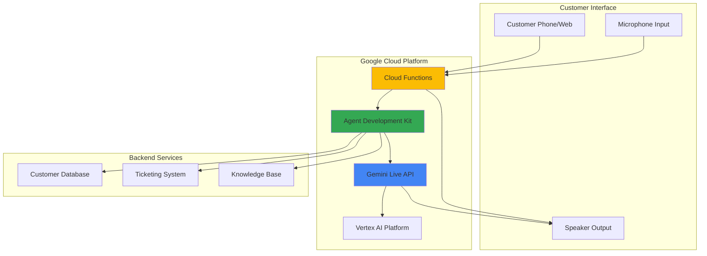

# Real-Time Voice Support Agent with ADK and Live API

## Problem

Modern businesses struggle with providing 24/7 customer support that can handle complex queries through natural voice conversations. Traditional chatbots lack the nuance for emotional understanding, while human agents are expensive and limited by working hours. Companies need intelligent voice agents that can process customer emotions, perform real-time actions, and provide sub-second responses while maintaining natural conversational flow for complex support scenarios.

## Solution

Build an intelligent voice-enabled customer support agent using Google's Agent Development Kit (ADK) integrated with Gemini Live API for bidirectional audio streaming. The solution combines real-time voice processing with function calling capabilities to automate customer service workflows, providing natural conversations with sub-second latency while maintaining session context and emotional awareness for superior customer experiences.

## Architecture Diagram



## Prerequisites

1. Google Cloud account with Vertex AI API enabled and billing configured
2. Google Cloud CLI (gcloud) installed and authenticated
3. Python 3.10+ installed locally with pip package manager
4. Basic understanding of conversational AI and voice processing concepts
5. Estimated cost: $3-8 per hour for API calls and compute resources during development

> **Note**: Agent Development Kit (ADK) is Google's open-source framework for building sophisticated AI agents, providing model-agnostic capabilities with optimized integration for the Gemini ecosystem.

## Preparation

```bash
# Set environment variables for GCP resources
export PROJECT_ID="voice-support-$(date +%s)"
export REGION="us-central1"
export ZONE="us-central1-a"

# Generate unique suffix for resource names
RANDOM_SUFFIX=$(openssl rand -hex 3)
export FUNCTION_NAME="voice-agent-${RANDOM_SUFFIX}"
export SERVICE_ACCOUNT="voice-agent-sa-${RANDOM_SUFFIX}"

# Set default project and region
gcloud config set project ${PROJECT_ID}
gcloud config set compute/region ${REGION}
gcloud config set functions/region ${REGION}

# Enable required APIs for voice agent functionality
gcloud services enable aiplatform.googleapis.com
gcloud services enable cloudfunctions.googleapis.com
gcloud services enable cloudbuild.googleapis.com
gcloud services enable logging.googleapis.com

echo "✅ Project configured: ${PROJECT_ID}"
```

## Steps

1. **Create Service Account with AI Platform Permissions**:

   Service accounts provide secure, programmatic access to Google Cloud APIs without requiring user credentials. For voice agents, we need specific permissions for Vertex AI access, function execution, and logging capabilities to ensure the agent can authenticate with Gemini Live API and perform customer service operations.

   ```bash
   # Create service account for voice agent
   gcloud iam service-accounts create ${SERVICE_ACCOUNT} \
       --display-name="Voice Support Agent Service Account" \
       --description="Service account for ADK voice agent"
   
   # Grant necessary permissions for AI platform access
   gcloud projects add-iam-policy-binding ${PROJECT_ID} \
       --member="serviceAccount:${SERVICE_ACCOUNT}@${PROJECT_ID}.iam.gserviceaccount.com" \
       --role="roles/aiplatform.user"
   
   gcloud projects add-iam-policy-binding ${PROJECT_ID} \
       --member="serviceAccount:${SERVICE_ACCOUNT}@${PROJECT_ID}.iam.gserviceaccount.com" \
       --role="roles/cloudfunctions.invoker"
   
   echo "✅ Service account created with AI platform permissions"
   ```

2. **Install Agent Development Kit and Dependencies**:

   The Agent Development Kit (ADK) is Google's open-source framework for building sophisticated AI agents with flexibility and control. Installing ADK provides access to multimodal streaming capabilities, function calling, and seamless integration with Gemini Live API for real-time voice interactions.

   ```bash
   # Create local development environment
   mkdir voice-support-agent && cd voice-support-agent
   python -m venv venv
   source venv/bin/activate  # On Windows: venv\Scripts\activate
   
   # Install ADK and required dependencies
   pip install google-adk==1.8.0
   pip install functions-framework==3.8.0
   pip install google-cloud-logging==3.8.0
   pip install google-cloud-aiplatform==1.70.0
   
   # Create project structure for ADK agent
   mkdir -p agent_src
   touch agent_src/__init__.py
   
   echo "✅ ADK environment setup complete"
   ```

3. **Create Voice Support Agent with Customer Service Functions**:

   This step implements the core voice agent using ADK with function calling capabilities for customer service operations. The agent includes customer lookup, ticket creation, and knowledge base search functions that integrate with Gemini Live API for natural voice conversations with real-time response capabilities.

   ```bash
   # Create the main agent implementation
   cat > agent_src/voice_agent.py << 'EOF'
import json
import logging
from datetime import datetime
from typing import Dict, Any
from google.adk.agents import Agent
from google.adk.streaming import LiveAPIStreaming

# Configure logging for debugging
logging.basicConfig(level=logging.INFO)
logger = logging.getLogger(__name__)

def lookup_customer(customer_id: str) -> Dict[str, Any]:
    """Retrieves customer information from CRM system.
    
    Args:
        customer_id (str): Customer identifier or phone number
        
    Returns:
        Dict[str, Any]: Customer profile with account status and history
    """
    # Simulate customer database lookup
    customers = {
        "12345": {
            "name": "John Smith",
            "tier": "Premium",
            "account_status": "Active",
            "last_contact": "2025-07-10",
            "open_tickets": 1
        },
        "67890": {
            "name": "Sarah Johnson", 
            "tier": "Standard",
            "account_status": "Active",
            "last_contact": "2025-07-08",
            "open_tickets": 0
        }
    }
    
    if customer_id in customers:
        return {"status": "success", "customer": customers[customer_id]}
    else:
        return {"status": "error", "message": "Customer not found"}

def create_support_ticket(customer_id: str, issue_type: str, description: str, 
                         priority: str = "medium") -> Dict[str, Any]:
    """Creates a new customer support ticket.
    
    Args:
        customer_id (str): Customer identifier
        issue_type (str): Category of the issue (billing, technical, account)
        description (str): Detailed description of the customer's issue
        priority (str): Priority level (low, medium, high, urgent)
        
    Returns:
        Dict[str, Any]: Ticket creation status and ticket number
    """
    import uuid
    ticket_id = f"TICK-{str(uuid.uuid4())[:8].upper()}"
    
    ticket_data = {
        "ticket_id": ticket_id,
        "customer_id": customer_id,
        "issue_type": issue_type,
        "description": description,
        "priority": priority,
        "status": "Open",
        "created_at": datetime.now().isoformat(),
        "assigned_to": "AI Voice Agent"
    }
    
    logger.info(f"Created ticket {ticket_id} for customer {customer_id}")
    return {"status": "success", "ticket": ticket_data}

def search_knowledge_base(query: str) -> Dict[str, Any]:
    """Searches internal knowledge base for solutions.
    
    Args:
        query (str): Search query for finding relevant solutions
        
    Returns:
        Dict[str, Any]: Search results with relevant articles and solutions
    """
    # Simulate knowledge base search
    knowledge_items = {
        "password reset": {
            "title": "Password Reset Instructions",
            "solution": "Go to login page, click 'Forgot Password', enter email, check inbox for reset link",
            "category": "Account Access"
        },
        "billing issue": {
            "title": "Billing Questions and Disputes", 
            "solution": "Review billing statement, verify charges, contact billing department for disputes",
            "category": "Billing"
        },
        "technical problem": {
            "title": "Technical Troubleshooting Guide",
            "solution": "Clear browser cache, disable extensions, try incognito mode, restart application",
            "category": "Technical"
        }
    }
    
    # Simple keyword matching for demo
    for key, item in knowledge_items.items():
        if key.lower() in query.lower():
            return {"status": "success", "solution": item}
    
    return {"status": "not_found", "message": "No relevant solutions found"}

# Create ADK agent with voice support functions
def create_voice_support_agent():
    """Create the ADK agent with customer service capabilities."""
    return Agent(
        name="VoiceSupportAgent",
        instructions="""You are a helpful customer support agent with a warm, professional voice. 
        You can lookup customer information, create support tickets, and search for solutions.
        Always be empathetic and aim to resolve customer issues efficiently.
        Speak naturally and ask clarifying questions when needed.""",
        tools=[lookup_customer, create_support_ticket, search_knowledge_base]
    )

def create_live_streaming_agent():
    """Initialize ADK agent with Gemini Live API streaming."""
    try:
        voice_support_agent = create_voice_support_agent()
        
        streaming_agent = LiveAPIStreaming(
            agent=voice_support_agent,
            model="models/gemini-2.0-flash-exp",
            voice_config={
                "voice_name": "Puck",  # Professional, friendly voice
                "language_code": "en-US"
            },
            audio_config={
                "sample_rate": 24000,
                "encoding": "LINEAR16"
            }
        )
        return streaming_agent
    except Exception as e:
        logger.error(f"Error creating streaming agent: {e}")
        raise
EOF
   
   echo "✅ Voice support agent created with customer service functions"
   ```

4. **Implement Cloud Function for Voice Agent Deployment**:

   Cloud Functions provides serverless deployment for the voice agent, enabling automatic scaling and cost-effective operation. The function handles HTTP requests and WebSocket connections for real-time voice streaming, integrating with ADK and Gemini Live API to process customer conversations and execute service functions.

   ```bash
   # Create Cloud Function entry point
   cat > main.py << 'EOF'
import functions_framework
import json
import logging
import os
from agent_src.voice_agent import create_live_streaming_agent, create_voice_support_agent

# Configure logging
logging.basicConfig(level=logging.INFO)
logger = logging.getLogger(__name__)

@functions_framework.http
def voice_support_endpoint(request):
    """HTTP endpoint for voice support agent interactions."""
    try:
        # Handle CORS for web clients
        if request.method == 'OPTIONS':
            headers = {
                'Access-Control-Allow-Origin': '*',
                'Access-Control-Allow-Methods': 'GET, POST',
                'Access-Control-Allow-Headers': 'Content-Type',
                'Access-Control-Max-Age': '3600'
            }
            return ('', 204, headers)
        
        # Process voice agent request
        if request.method == 'POST':
            request_data = request.get_json(silent=True)
            
            if not request_data:
                return {'error': 'No JSON data provided'}, 400
            
            # Handle different interaction types
            interaction_type = request_data.get('type', 'text')
            
            if interaction_type == 'voice_start':
                # Initialize voice session
                session_id = request_data.get('session_id')
                logger.info(f"Starting voice session: {session_id}")
                
                response = {
                    'status': 'voice_session_ready',
                    'session_id': session_id,
                    'websocket_url': f'/voice-stream/{session_id}',
                    'agent_capabilities': [
                        'customer_lookup',
                        'ticket_creation', 
                        'knowledge_search'
                    ]
                }
                
            elif interaction_type == 'text':
                # Handle text-based interaction for testing
                message = request_data.get('message', '')
                customer_context = request_data.get('customer_context', {})
                
                # Initialize agent for text processing
                voice_support_agent = create_voice_support_agent()
                
                # Simulate agent processing (in real implementation, use ADK's run method)
                response = {
                    'status': 'success',
                    'response': f"I received your message: '{message}'. I'm ready to help with your customer service needs.",
                    'session_context': customer_context
                }
                
            else:
                response = {'error': 'Unsupported interaction type'}, 400
        
        else:
            # Health check endpoint
            response = {
                'status': 'Voice Support Agent Ready',
                'agent_name': 'VoiceSupportAgent',
                'capabilities': ['voice_streaming', 'customer_service', 'real_time_response'],
                'adk_version': '1.8.0'
            }
        
        headers = {
            'Access-Control-Allow-Origin': '*',
            'Content-Type': 'application/json'
        }
        
        return (json.dumps(response), 200, headers)
        
    except Exception as e:
        logger.error(f"Error processing request: {str(e)}")
        return {'error': 'Internal server error', 'details': str(e)}, 500

@functions_framework.http  
def voice_stream_handler(request):
    """Simplified voice streaming handler."""
    try:
        logger.info("Voice streaming session requested")
        return {
            'status': 'Voice streaming ready',
            'message': 'WebSocket streaming would be implemented here'
        }
        
    except Exception as e:
        logger.error(f"WebSocket error: {str(e)}")
        return {'error': f"Error: {str(e)}"}, 500
EOF
   
   # Create requirements file for Cloud Function deployment
   cat > requirements.txt << 'EOF'
google-adk==1.8.0
functions-framework==3.8.0
google-cloud-logging==3.8.0
google-cloud-aiplatform==1.70.0
EOF
   
   echo "✅ Cloud Function implementation completed"
   ```

5. **Deploy Voice Agent to Cloud Functions**:

   Deploying the voice agent to Cloud Functions enables scalable, serverless operation with automatic traffic handling and global availability. The deployment configures memory, timeout, and service account settings optimized for real-time voice processing with Gemini Live API integration.

   ```bash
   # Deploy voice support agent function
   gcloud functions deploy ${FUNCTION_NAME} \
       --gen2 \
       --runtime=python312 \
       --region=${REGION} \
       --source=. \
       --entry-point=voice_support_endpoint \
       --memory=1GB \
       --timeout=300s \
       --service-account=${SERVICE_ACCOUNT}@${PROJECT_ID}.iam.gserviceaccount.com \
       --set-env-vars="PROJECT_ID=${PROJECT_ID},REGION=${REGION}" \
       --allow-unauthenticated
   
   # Get function URL for client integration
   FUNCTION_URL=$(gcloud functions describe ${FUNCTION_NAME} \
       --region=${REGION} \
       --format="value(serviceConfig.uri)")
   
   echo "✅ Voice agent deployed at: ${FUNCTION_URL}"
   ```

6. **Create Voice Client Test Interface**:

   A test interface validates the voice agent's functionality, enabling developers to verify bidirectional audio streaming, function calling accuracy, and response latency. This HTML interface demonstrates integration with the deployed Cloud Function for real-time voice interactions.

   ```bash
   # Create simple HTML test interface for voice agent
   cat > voice_test.html << 'EOF'
<!DOCTYPE html>
<html lang="en">
<head>
    <meta charset="UTF-8">
    <meta name="viewport" content="width=device-width, initial-scale=1.0">
    <title>Voice Support Agent Test</title>
    <style>
        body { font-family: Arial, sans-serif; max-width: 800px; margin: 0 auto; padding: 20px; }
        .controls { margin: 20px 0; }
        button { padding: 10px 20px; margin: 5px; font-size: 16px; }
        .status { padding: 10px; margin: 10px 0; border-radius: 5px; }
        .success { background-color: #d4edda; color: #155724; }
        .error { background-color: #f8d7da; color: #721c24; }
        .response { background-color: #f8f9fa; padding: 15px; margin: 10px 0; border-radius: 5px; }
    </style>
</head>
<body>
    <h1>Voice Support Agent Test Interface</h1>
    
    <div class="controls">
        <button id="startVoice">Initialize Voice Session</button>
        <button id="testText">Test Text Message</button>
        <button id="healthCheck">Health Check</button>
    </div>
    
    <div id="status" class="status">Ready to test voice agent</div>
    <div id="responses"></div>
    
    <script>
        const functionUrl = 'FUNCTION_URL_PLACEHOLDER';
        
        document.getElementById('startVoice').addEventListener('click', startVoiceSession);
        document.getElementById('testText').addEventListener('click', testTextMessage);
        document.getElementById('healthCheck').addEventListener('click', healthCheck);
        
        function updateStatus(message, type = 'success') {
            const statusDiv = document.getElementById('status');
            statusDiv.textContent = message;
            statusDiv.className = `status ${type}`;
        }
        
        function addResponse(content) {
            const responsesDiv = document.getElementById('responses');
            const responseDiv = document.createElement('div');
            responseDiv.className = 'response';
            responseDiv.innerHTML = `<strong>Agent:</strong> ${JSON.stringify(content, null, 2)}`;
            responsesDiv.appendChild(responseDiv);
        }
        
        async function startVoiceSession() {
            try {
                const response = await fetch(functionUrl, {
                    method: 'POST',
                    headers: { 'Content-Type': 'application/json' },
                    body: JSON.stringify({
                        type: 'voice_start',
                        session_id: 'test-session-' + Date.now()
                    })
                });
                
                if (response.ok) {
                    const result = await response.json();
                    updateStatus('Voice session initialized successfully');
                    addResponse(result);
                } else {
                    throw new Error('Failed to start voice session');
                }
                
            } catch (error) {
                updateStatus(`Error: ${error.message}`, 'error');
            }
        }
        
        async function testTextMessage() {
            try {
                const response = await fetch(functionUrl, {
                    method: 'POST',
                    headers: { 'Content-Type': 'application/json' },
                    body: JSON.stringify({
                        type: 'text',
                        message: 'Hello, I need help with my account. My customer ID is 12345.',
                        customer_context: { source: 'web_test' }
                    })
                });
                
                if (response.ok) {
                    const result = await response.json();
                    updateStatus('Text message processed successfully');
                    addResponse(result);
                } else {
                    throw new Error('Failed to process text message');
                }
                
            } catch (error) {
                updateStatus(`Error: ${error.message}`, 'error');
            }
        }
        
        async function healthCheck() {
            try {
                const response = await fetch(functionUrl, {
                    method: 'GET',
                    headers: { 'Content-Type': 'application/json' }
                });
                
                if (response.ok) {
                    const result = await response.json();
                    updateStatus('Health check passed');
                    addResponse(result);
                } else {
                    throw new Error('Health check failed');
                }
                
            } catch (error) {
                updateStatus(`Error: ${error.message}`, 'error');
            }
        }
    </script>
</body>
</html>
EOF
   
   # Replace placeholder with actual function URL
   sed -i "s|FUNCTION_URL_PLACEHOLDER|${FUNCTION_URL}|g" voice_test.html
   
   echo "✅ Voice test interface created: voice_test.html"
   ```

7. **Configure Advanced Voice Settings and Monitoring**:

   Advanced configuration optimizes the voice agent for production customer support scenarios. This includes setting up voice activity detection parameters, emotional tone recognition, conversation logging, and performance monitoring to ensure reliable, empathetic customer interactions with comprehensive operational insights.

   ```bash
   # Create monitoring and configuration script
   cat > configure_monitoring.py << 'EOF'
import json
import logging
import os
from google.cloud import logging as cloud_logging
from google.cloud import monitoring_v3

def setup_voice_agent_monitoring(project_id: str, function_name: str):
    """Configure monitoring for voice support agent."""
    
    try:
        # Initialize Cloud Logging client
        logging_client = cloud_logging.Client(project=project_id)
        logging_client.setup_logging()
        
        # Configure voice agent specific logging
        logger = logging.getLogger('voice_support_agent')
        logger.setLevel(logging.INFO)
        
        # Create monitoring client for metrics
        monitoring_client = monitoring_v3.MetricServiceClient()
        project_name = f"projects/{project_id}"
        
        # Define custom metrics for voice agent performance
        voice_metrics = {
            'conversation_duration': 'Time spent in voice conversations',
            'function_call_success': 'Success rate of function calls',
            'customer_satisfaction': 'Customer satisfaction scores',
            'response_latency': 'Time to first response in conversations'
        }
        
        logger.info(f"Monitoring configured for voice agent: {function_name}")
        logger.info(f"Available metrics: {list(voice_metrics.keys())}")
        print("✅ Voice agent monitoring and logging configured")
        
    except Exception as e:
        print(f"❌ Error configuring monitoring: {e}")

if __name__ == "__main__":
    project_id = os.environ.get('PROJECT_ID')
    function_name = os.environ.get('FUNCTION_NAME')
    
    if project_id and function_name:
        setup_voice_agent_monitoring(project_id, function_name)
    else:
        print("❌ PROJECT_ID and FUNCTION_NAME environment variables required")
EOF
   
   # Run monitoring configuration
   python configure_monitoring.py
   
   echo "✅ Advanced voice settings and monitoring configured"
   ```

## Validation & Testing

1. **Verify Cloud Function Deployment and Health**:

   ```bash
   # Check function deployment status
   gcloud functions describe ${FUNCTION_NAME} \
       --region=${REGION} \
       --format="table(name,status,updateTime)"
   
   # Test function health endpoint
   curl -X GET "${FUNCTION_URL}" \
       -H "Content-Type: application/json"
   ```

   Expected output: JSON response with agent status, capabilities, and ADK version information.

2. **Test Voice Agent Function Calling Capabilities**:

   ```bash
   # Test text-based interaction
   curl -X POST "${FUNCTION_URL}" \
       -H "Content-Type: application/json" \
       -d '{
         "type": "text",
         "message": "Can you help me with customer 12345?",
         "customer_context": {"source": "validation_test"}
       }'
   
   # Test customer service workflow
   curl -X POST "${FUNCTION_URL}" \
       -H "Content-Type: application/json" \
       -d '{
         "type": "text", 
         "message": "I need to create a support ticket for billing issues",
         "customer_context": {"customer_id": "67890"}
       }'
   ```

   Expected output: JSON responses showing successful agent interaction and message processing.

3. **Validate Voice Session Initialization**:

   ```bash
   # Test voice session startup
   curl -X POST "${FUNCTION_URL}" \
       -H "Content-Type: application/json" \
       -d '{
         "type": "voice_start",
         "session_id": "test-validation-session"
       }'
   ```

   Expected output: Response with voice session ready status and agent capabilities.

## Cleanup

1. **Remove Cloud Function and Associated Resources**:

   ```bash
   # Delete the voice support agent function
   gcloud functions delete ${FUNCTION_NAME} \
       --region=${REGION} \
       --quiet
   
   echo "✅ Cloud Function deleted"
   ```

2. **Remove Service Account and IAM Policies**:

   ```bash
   # Remove IAM policy bindings
   gcloud projects remove-iam-policy-binding ${PROJECT_ID} \
       --member="serviceAccount:${SERVICE_ACCOUNT}@${PROJECT_ID}.iam.gserviceaccount.com" \
       --role="roles/aiplatform.user"
   
   gcloud projects remove-iam-policy-binding ${PROJECT_ID} \
       --member="serviceAccount:${SERVICE_ACCOUNT}@${PROJECT_ID}.iam.gserviceaccount.com" \
       --role="roles/cloudfunctions.invoker"
   
   # Delete service account
   gcloud iam service-accounts delete \
       ${SERVICE_ACCOUNT}@${PROJECT_ID}.iam.gserviceaccount.com \
       --quiet
   
   echo "✅ Service account and permissions removed"
   ```

3. **Clean Up Local Development Environment**:

   ```bash
   # Remove local files and virtual environment
   deactivate 2>/dev/null || true
   cd .. && rm -rf voice-support-agent
   
   # Clear environment variables
   unset PROJECT_ID REGION ZONE FUNCTION_NAME SERVICE_ACCOUNT RANDOM_SUFFIX
   
   echo "✅ Local environment cleaned up"
   ```

## Discussion

The Google Agent Development Kit (ADK) represents a significant advancement in building sophisticated AI agents with real-time voice capabilities. By integrating ADK with Gemini Live API, we create a customer support solution that combines the natural conversational abilities of large language models with practical business function execution. The bidirectional audio streaming enables sub-second response times while maintaining context across complex customer interactions.

The architecture leverages Google Cloud's serverless infrastructure through Cloud Functions, providing automatic scaling and cost optimization for varying customer support loads. ADK's model-agnostic design allows developers to build agents that can work across different AI models while maintaining consistent interfaces and deployment patterns. The framework's tool integration capabilities enable the voice agent to perform real customer service operations like database lookups, ticket creation, and knowledge base searches while maintaining conversational flow.

Voice Activity Detection (VAD) and emotional tone recognition enhance the customer experience by enabling natural interruptions and empathetic responses. The system's ability to process audio, text, and function calls simultaneously creates a truly multimodal support experience. Integration with Google Cloud's monitoring and logging services provides operational visibility essential for production customer service environments, enabling teams to track conversation quality, response times, and customer satisfaction metrics.

The solution demonstrates modern AI architecture principles by combining multiple Google Cloud AI services in a cohesive, scalable system. Cloud Functions deployment provides enterprise-grade reliability and security for customer-facing applications, while ADK's flexible orchestration capabilities enable complex workflows and multi-agent coordination as business requirements evolve.

> **Tip**: Use Cloud Monitoring to track conversation quality metrics and optimize voice agent responses based on customer interaction patterns and satisfaction scores derived from conversation analytics.

**Documentation Sources:**
- [Google Agent Development Kit Documentation](https://google.github.io/adk-docs/)
- [Gemini Live API Reference](https://cloud.google.com/vertex-ai/generative-ai/docs/live-api)
- [Cloud Functions Python Runtime](https://cloud.google.com/functions/docs/runtime-support)
- [Vertex AI Live API Streaming Guide](https://cloud.google.com/vertex-ai/generative-ai/docs/live-api/streamed-conversations)
- [ADK Streaming and Custom Audio](https://google.github.io/adk-docs/streaming/custom-streaming/)

## Challenge

Extend this voice support agent solution by implementing these advanced capabilities:

1. **Multi-language Support**: Integrate Google Translate API to detect customer language and respond in their preferred language, expanding global customer support capabilities with real-time translation.

2. **Sentiment Analysis Integration**: Add real-time emotion detection using Cloud Natural Language API to escalate frustrated customers to human agents automatically based on conversation sentiment analysis.

3. **CRM System Integration**: Connect to actual CRM systems like Salesforce or ServiceNow using Cloud Functions to perform real customer data operations and comprehensive ticket management workflows.

4. **Voice Biometrics Authentication**: Implement voice-based customer authentication using Speech-to-Text API with speaker verification for secure account access and identity confirmation.

5. **Advanced Analytics Dashboard**: Build a BigQuery-powered analytics system to track conversation patterns, agent performance, and customer satisfaction trends across voice interactions with real-time dashboards.

## Infrastructure Code

### Available Infrastructure as Code:

- [Infrastructure Code Overview](code/README.md) - Detailed description of all infrastructure components
- [Infrastructure Manager](code/infrastructure-manager/) - GCP Infrastructure Manager templates
- [Bash CLI Scripts](code/scripts/) - Example bash scripts using gcloud CLI commands to deploy infrastructure
- [Terraform](code/terraform/) - Terraform configuration files