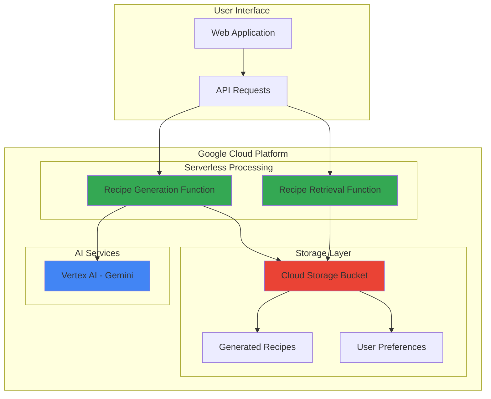

# Recipe Generation and Meal Planning with Gemini and Storage

## Problem

Meal planning and recipe discovery remains a daily challenge for millions of people who struggle to create varied, personalized meals from available ingredients. Traditional recipe websites and cookbooks provide static content that doesn't adapt to individual dietary preferences, available ingredients, or cooking skill levels. This leads to food waste, repetitive meals, and difficulty maintaining healthy eating habits, ultimately impacting both personal wellness and household budgets.

## Solution

Build an AI-powered recipe generation system using Google's Gemini multimodal AI through Vertex AI to create personalized recipes from ingredient lists. Cloud Functions provides serverless API endpoints for recipe generation and retrieval, while Cloud Storage manages generated recipes and user preferences. This intelligent system adapts to dietary restrictions, cooking skill levels, and available ingredients to generate creative, personalized meal suggestions that reduce food waste and enhance culinary creativity.

## Architecture Diagram



## Prerequisites

1. Google Cloud account with billing enabled and project creation permissions
2. Google Cloud CLI (`gcloud`) installed and configured (version 400.0.0 or later)
3. Basic knowledge of Python programming and serverless functions
4. Understanding of REST API concepts and JSON data structures
5. Estimated cost: $5-15 per month for moderate usage (Vertex AI charges per request, Cloud Functions per invocation, Storage per GB)

> **Note**: Vertex AI Gemini usage charges apply per request. Monitor your usage in the Google Cloud Console to avoid unexpected costs.

## Preparation

```bash
# Set environment variables for GCP resources
export PROJECT_ID="recipe-ai-$(date +%s)"
export REGION="us-central1"
export ZONE="us-central1-a"

# Generate unique suffix for resource names
RANDOM_SUFFIX=$(openssl rand -hex 3)

# Set resource names with unique suffix
export BUCKET_NAME="recipe-storage-${RANDOM_SUFFIX}"
export FUNCTION_NAME_GEN="recipe-generator"
export FUNCTION_NAME_GET="recipe-retriever"

# Create the project
gcloud projects create ${PROJECT_ID} --name="Recipe AI Platform"

# Set default project and region
gcloud config set project ${PROJECT_ID}
gcloud config set compute/region ${REGION}
gcloud config set compute/zone ${ZONE}

# Link billing account (replace with your billing account ID)
echo "Please link a billing account to project ${PROJECT_ID} in the Cloud Console"
echo "Visit: https://console.cloud.google.com/billing/linkedaccount?project=${PROJECT_ID}"

# Enable required APIs
gcloud services enable aiplatform.googleapis.com
gcloud services enable cloudfunctions.googleapis.com
gcloud services enable storage.googleapis.com
gcloud services enable cloudbuild.googleapis.com

echo "✅ Project configured: ${PROJECT_ID}"
echo "✅ Required APIs enabled"
```

## Steps

1. **Create Cloud Storage Bucket for Recipe Data**:

   Cloud Storage provides the persistent data layer for our AI-powered recipe system, storing generated recipes, user preferences, and ingredient databases. The bucket configuration includes versioning for data protection and appropriate access controls for secure recipe management.

   ```bash
   # Create Cloud Storage bucket with Standard storage class
   gsutil mb -p ${PROJECT_ID} \
       -c STANDARD \
       -l ${REGION} \
       gs://${BUCKET_NAME}
   
   # Enable versioning for data protection
   gsutil versioning set on gs://${BUCKET_NAME}
   
   # Create folder structure for organized storage
   echo '{"recipes": [], "preferences": {}}' | \
       gsutil cp - gs://${BUCKET_NAME}/data/recipes.json
   echo '{"users": {}}' | \
       gsutil cp - gs://${BUCKET_NAME}/data/preferences.json
   
   echo "✅ Cloud Storage bucket created: gs://${BUCKET_NAME}"
   ```

   The storage bucket now provides a scalable foundation for recipe data with automatic redundancy and global accessibility. This enables the AI system to quickly store and retrieve recipe data while maintaining data integrity through versioning.

2. **Create Recipe Generation Function**:

   The recipe generation function integrates with Vertex AI's Gemini model to transform ingredient lists into creative, personalized recipes. This serverless function handles the AI interaction, prompt engineering, and result formatting while automatically scaling based on demand.

   ```bash
   # Create function directory and files
   mkdir -p recipe-functions/generator
   cd recipe-functions/generator
   
   # Create requirements.txt for Python dependencies
   cat > requirements.txt << 'EOF'
   google-cloud-aiplatform>=1.38.0
   google-cloud-storage>=2.10.0
   functions-framework>=3.4.0
   EOF
   
   # Create the recipe generation function
   cat > main.py << 'EOF'
   import json
   import os
   from google.cloud import aiplatform
   from google.cloud import storage
   import functions_framework
   from datetime import datetime
   
   # Initialize Vertex AI with project from environment
   aiplatform.init(project=os.environ.get('GCP_PROJECT'))
   
   @functions_framework.http
   def generate_recipe(request):
       """Generate personalized recipes using Gemini AI"""
       try:
           # Parse request data
           request_json = request.get_json(silent=True)
           if not request_json:
               return {'error': 'Invalid JSON'}, 400
           
           ingredients = request_json.get('ingredients', [])
           dietary_restrictions = request_json.get('dietary_restrictions', [])
           skill_level = request_json.get('skill_level', 'beginner')
           cuisine_type = request_json.get('cuisine_type', 'any')
           
           if not ingredients:
               return {'error': 'Ingredients list required'}, 400
           
           # Create comprehensive Gemini prompt for recipe generation
           prompt = f"""
           Create a detailed recipe using these ingredients: {', '.join(ingredients)}
           
           Requirements:
           - Dietary restrictions: {', '.join(dietary_restrictions) if dietary_restrictions else 'None'}
           - Cooking skill level: {skill_level}
           - Cuisine preference: {cuisine_type}
           
           Please provide:
           1. Recipe title
           2. Preparation time and cooking time
           3. Ingredient list with quantities
           4. Step-by-step instructions
           5. Nutritional highlights
           6. Serving suggestions
           
           Format as JSON with fields: title, prep_time, cook_time, ingredients_with_quantities, instructions, nutrition_info, serving_suggestions
           """
           
           # Generate content using Gemini 1.5 Flash model
           model = aiplatform.generative_models.GenerativeModel('gemini-1.5-flash')
           response = model.generate_content(prompt)
           
           # Parse and store recipe with metadata
           recipe_data = {
               'id': f"recipe-{datetime.now().strftime('%Y%m%d%H%M%S')}",
               'generated_at': datetime.now().isoformat(),
               'input_ingredients': ingredients,
               'dietary_restrictions': dietary_restrictions,
               'skill_level': skill_level,
               'cuisine_type': cuisine_type,
               'ai_response': response.text
           }
           
           # Store in Cloud Storage with structured path
           storage_client = storage.Client()
           bucket = storage_client.bucket(os.environ.get('BUCKET_NAME'))
           blob = bucket.blob(f"recipes/{recipe_data['id']}.json")
           blob.upload_from_string(json.dumps(recipe_data, indent=2))
           
           return {
               'success': True,
               'recipe_id': recipe_data['id'],
               'recipe': recipe_data
           }
           
       except Exception as e:
           return {'error': str(e)}, 500
   EOF
   
   echo "✅ Recipe generation function created"
   ```

   This function leverages Gemini's advanced language understanding to create contextual, personalized recipes. The prompt engineering approach ensures consistent output format while allowing for creative recipe generation based on dietary needs and skill levels.

3. **Deploy Recipe Generation Function**:

   Deploy the serverless function with appropriate memory allocation and timeout settings to handle AI processing efficiently. The deployment includes environment variables for seamless integration with other Google Cloud services.

   ```bash
   # Deploy the recipe generation function with optimized settings
   gcloud functions deploy ${FUNCTION_NAME_GEN} \
       --runtime python311 \
       --trigger-http \
       --allow-unauthenticated \
       --source . \
       --entry-point generate_recipe \
       --memory 512MB \
       --timeout 60s \
       --set-env-vars BUCKET_NAME=${BUCKET_NAME},GCP_PROJECT=${PROJECT_ID}
   
   # Get the function URL for testing
   GENERATOR_URL=$(gcloud functions describe ${FUNCTION_NAME_GEN} \
       --format="value(httpsTrigger.url)")
   
   echo "✅ Recipe generation function deployed"
   echo "Function URL: ${GENERATOR_URL}"
   ```

   The function now provides a scalable HTTP endpoint for recipe generation, automatically handling traffic spikes and scaling to zero when not in use. This serverless approach optimizes both performance and cost efficiency while ensuring high availability across Google Cloud regions.

4. **Create Recipe Retrieval Function**:

   The retrieval function provides fast access to previously generated recipes with search and filtering capabilities. This function demonstrates Cloud Storage integration patterns for efficient data access and query operations.

   ```bash
   # Navigate to create retrieval function
   cd ../
   mkdir retriever
   cd retriever
   
   # Create requirements.txt for minimal dependencies
   cat > requirements.txt << 'EOF'
   google-cloud-storage>=2.10.0
   functions-framework>=3.4.0
   EOF
   
   # Create the recipe retrieval function with enhanced filtering
   cat > main.py << 'EOF'
   import json
   import os
   from google.cloud import storage
   import functions_framework
   
   @functions_framework.http
   def retrieve_recipes(request):
       """Retrieve and search stored recipes with filtering capabilities"""
       try:
           # Parse query parameters for flexible search
           args = request.args
           recipe_id = args.get('recipe_id')
           ingredient_filter = args.get('ingredient')
           cuisine_filter = args.get('cuisine')
           limit = int(args.get('limit', 10))
           
           storage_client = storage.Client()
           bucket = storage_client.bucket(os.environ.get('BUCKET_NAME'))
           
           # If specific recipe requested, return it directly
           if recipe_id:
               blob = bucket.blob(f"recipes/{recipe_id}.json")
               if blob.exists():
                   recipe_data = json.loads(blob.download_as_text())
                   return {'recipe': recipe_data}
               else:
                   return {'error': 'Recipe not found'}, 404
           
           # List all recipes with filtering capabilities
           recipes = []
           blobs = bucket.list_blobs(prefix="recipes/")
           
           for blob in blobs:
               if blob.name.endswith('.json'):
                   try:
                       recipe_data = json.loads(blob.download_as_text())
                       
                       # Apply filters based on request parameters
                       include_recipe = True
                       
                       if ingredient_filter:
                           ingredients_text = ' '.join(recipe_data.get('input_ingredients', []))
                           if ingredient_filter.lower() not in ingredients_text.lower():
                               include_recipe = False
                       
                       if cuisine_filter:
                           if cuisine_filter.lower() != recipe_data.get('cuisine_type', '').lower():
                               include_recipe = False
                       
                       if include_recipe:
                           recipes.append({
                               'id': recipe_data.get('id'),
                               'generated_at': recipe_data.get('generated_at'),
                               'ingredients': recipe_data.get('input_ingredients'),
                               'cuisine_type': recipe_data.get('cuisine_type'),
                               'skill_level': recipe_data.get('skill_level')
                           })
                           
                           if len(recipes) >= limit:
                               break
                   
                   except Exception as e:
                       continue  # Skip malformed recipes gracefully
           
           return {
               'recipes': recipes,
               'total_found': len(recipes)
           }
           
       except Exception as e:
           return {'error': str(e)}, 500
   EOF
   
   echo "✅ Recipe retrieval function created"
   ```

   This function enables efficient recipe discovery and filtering, providing a complete data access layer for the recipe management system. The filtering approach supports multiple query patterns and pagination for scalable recipe browsing.

5. **Deploy Recipe Retrieval Function**:

   Deploy the second serverless function to complete the API ecosystem. This function complements the generation service by providing comprehensive data access capabilities.

   ```bash
   # Deploy the recipe retrieval function with appropriate settings
   gcloud functions deploy ${FUNCTION_NAME_GET} \
       --runtime python311 \
       --trigger-http \
       --allow-unauthenticated \
       --source . \
       --entry-point retrieve_recipes \
       --memory 256MB \
       --timeout 30s \
       --set-env-vars BUCKET_NAME=${BUCKET_NAME}
   
   # Get the function URL for API access
   RETRIEVER_URL=$(gcloud functions describe ${FUNCTION_NAME_GET} \
       --format="value(httpsTrigger.url)")
   
   echo "✅ Recipe retrieval function deployed"
   echo "Retrieval URL: ${RETRIEVER_URL}"
   ```

   Both functions now provide a complete serverless API for recipe generation and management, with automatic scaling and integrated monitoring through Google Cloud's operational suite.

6. **Set Up IAM Permissions for Vertex AI**:

   Configure proper Identity and Access Management permissions to enable secure communication between Cloud Functions and Vertex AI services. This follows Google Cloud security best practices for service-to-service authentication.

   ```bash
   # Get the default Cloud Functions service account
   PROJECT_NUMBER=$(gcloud projects describe ${PROJECT_ID} \
       --format="value(projectNumber)")
   FUNCTIONS_SA="${PROJECT_ID}@appspot.gserviceaccount.com"
   
   # Grant Vertex AI User role to Cloud Functions service account
   gcloud projects add-iam-policy-binding ${PROJECT_ID} \
       --member="serviceAccount:${FUNCTIONS_SA}" \
       --role="roles/aiplatform.user"
   
   # Grant Storage Object Admin for recipe storage
   gcloud projects add-iam-policy-binding ${PROJECT_ID} \
       --member="serviceAccount:${FUNCTIONS_SA}" \
       --role="roles/storage.objectAdmin"
   
   echo "✅ IAM permissions configured for Vertex AI and Storage access"
   ```

   The security configuration now enables secure, least-privilege access between services while maintaining the principle of defense in depth through Google Cloud's identity and access management framework.

## Validation & Testing

1. **Test Recipe Generation API**:

   ```bash
   # Test recipe generation with sample ingredients
   curl -X POST ${GENERATOR_URL} \
       -H "Content-Type: application/json" \
       -d '{
           "ingredients": ["chicken breast", "broccoli", "garlic", "olive oil"],
           "dietary_restrictions": ["gluten-free"],
           "skill_level": "intermediate",
           "cuisine_type": "Mediterranean"
       }'
   ```

   Expected output: JSON response with generated recipe including recipe ID, preparation steps, and cooking instructions.

2. **Verify Cloud Storage Integration**:

   ```bash
   # List generated recipes in storage
   gsutil ls gs://${BUCKET_NAME}/recipes/
   
   # Check a specific recipe file
   gsutil cat gs://${BUCKET_NAME}/recipes/recipe-*.json | head -20
   ```

   Expected output: List of recipe JSON files and sample recipe content showing proper storage integration.

3. **Test Recipe Retrieval API**:

   ```bash
   # Test recipe retrieval with filters
   curl "${RETRIEVER_URL}?ingredient=chicken&limit=5"
   
   # Test specific recipe retrieval (use ID from generation test)
   curl "${RETRIEVER_URL}?recipe_id=recipe-20250712123000"
   ```

   Expected output: Filtered recipe list and specific recipe details demonstrating search functionality.

4. **Monitor Function Performance**:

   ```bash
   # Check function logs for any errors
   gcloud functions logs read ${FUNCTION_NAME_GEN} --limit 10
   gcloud functions logs read ${FUNCTION_NAME_GET} --limit 10
   ```

   Expected output: Clean function execution logs without errors, showing successful AI integration and storage operations.

## Cleanup

1. **Delete Cloud Functions**:

   ```bash
   # Delete both Cloud Functions
   gcloud functions delete ${FUNCTION_NAME_GEN} --quiet
   gcloud functions delete ${FUNCTION_NAME_GET} --quiet
   
   echo "✅ Cloud Functions deleted"
   ```

2. **Remove Cloud Storage Bucket**:

   ```bash
   # Delete all objects and the bucket
   gsutil -m rm -r gs://${BUCKET_NAME}
   
   echo "✅ Cloud Storage bucket deleted"
   ```

3. **Clean Up Project Resources**:

   ```bash
   # Remove function source code directories
   cd ../../
   rm -rf recipe-functions/
   
   # Delete the entire project (if created specifically for this recipe)
   gcloud projects delete ${PROJECT_ID} --quiet
   
   echo "✅ Project and all resources deleted"
   echo "Note: Project deletion may take several minutes to complete"
   ```

## Discussion

This recipe demonstrates the power of combining Google Cloud's serverless computing platform with advanced AI capabilities to solve real-world problems. The Vertex AI Gemini integration showcases how modern language models can understand context, dietary restrictions, and cooking preferences to generate personalized content that goes beyond simple template-based responses. Gemini's multimodal capabilities enable future enhancements like image analysis of available ingredients or visual recipe presentation.

The serverless architecture using Cloud Functions provides several key advantages: automatic scaling based on demand, pay-per-use pricing that eliminates idle resource costs, and built-in high availability across Google Cloud regions. By separating recipe generation and retrieval into distinct functions, the system follows microservices best practices that enable independent scaling, deployment, and maintenance of each component. This separation also allows for different resource allocations optimized for each function's specific workload.

Cloud Storage integration demonstrates efficient data management patterns for AI-generated content. The JSON-based storage approach enables flexible querying and filtering while maintaining data structure integrity. The versioning capability provides data protection and audit trails, essential for production applications handling user-generated content and preferences. This approach scales from individual users to enterprise-level recipe management systems.

The security implementation follows Google Cloud's recommended practices for service-to-service authentication using Identity and Access Management (IAM) roles. This approach eliminates the need for managing API keys or credentials while providing fine-grained access control that adheres to the principle of least privilege. The use of the default App Engine service account for Cloud Functions ensures proper security isolation while maintaining operational simplicity.

> **Tip**: Monitor Vertex AI usage costs closely, as AI model invocations can accumulate charges quickly. Consider implementing caching strategies and request rate limiting for production deployments.

**Documentation Sources:**
- [Vertex AI Gemini API Reference](https://cloud.google.com/vertex-ai/generative-ai/docs/model-reference/gemini)
- [Cloud Functions Python Runtime](https://cloud.google.com/functions/docs/concepts/python-runtime)
- [Cloud Storage JSON API](https://cloud.google.com/storage/docs/json_api)
- [IAM Best Practices](https://cloud.google.com/iam/docs/using-iam-securely)
- [Google Cloud Architecture Framework](https://cloud.google.com/architecture/framework)
- [Cloud Functions Service Identity](https://cloud.google.com/functions/docs/securing/function-identity)

## Challenge

Extend this recipe generation system by implementing these enhancements:

1. **Nutritional Analysis Integration**: Connect with nutrition APIs to provide detailed caloric and nutritional information for generated recipes, including macro and micronutrient breakdowns.

2. **Image Generation for Recipes**: Integrate with Vertex AI's image generation models to create visual representations of the finished dishes, enhancing user experience and engagement.

3. **Real-time Recipe Suggestions**: Implement Pub/Sub messaging to provide real-time recipe suggestions based on seasonal ingredients, local grocery store promotions, or trending cuisine types.

4. **Social Recipe Sharing**: Add BigQuery for analytics and Firestore for user profiles to enable recipe sharing, rating systems, and personalized recommendation engines based on user preferences and cooking history.

5. **Voice-Activated Cooking Assistant**: Integrate with Speech-to-Text and Text-to-Speech APIs to create a hands-free cooking assistant that can read instructions aloud and accept voice commands during cooking.

## Infrastructure Code

### Available Infrastructure as Code:

- [Infrastructure Code Overview](code/README.md) - Detailed description of all infrastructure components
- [Infrastructure Manager](code/infrastructure-manager/) - GCP Infrastructure Manager templates
- [Bash CLI Scripts](code/scripts/) - Example bash scripts using gcloud CLI commands to deploy infrastructure
- [Terraform](code/terraform/) - Terraform configuration files