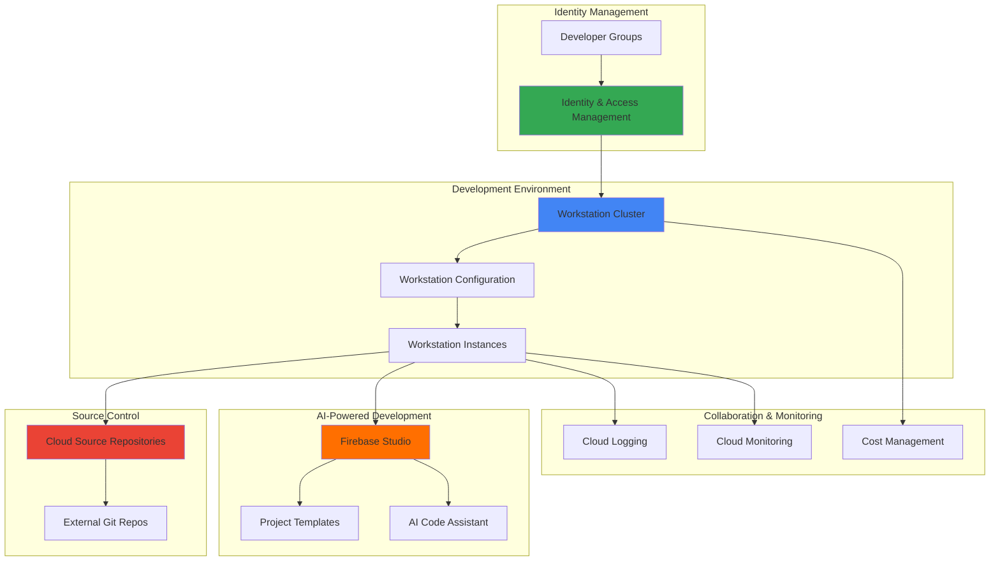

# Remote Developer Onboarding with Cloud Workstations and Firebase Studio

## Problem

Remote engineering teams struggle with lengthy developer onboarding processes that can take weeks to complete, requiring new hires to configure local development environments, install various tools, and gain access to team repositories and collaboration platforms. This manual setup process leads to inconsistent development environments, delayed productivity, and significant time investment from senior developers who must guide new team members through complex environment configurations and troubleshooting.

## Solution

Create an automated developer onboarding system using Google Cloud Workstations to provision secure, standardized cloud-based development environments and Firebase Studio for rapid application prototyping and collaboration. This solution combines pre-configured development toolchains, integrated source code repositories, and streamlined access controls to enable new developers to become productive within hours rather than weeks, while ensuring consistent environments across the entire distributed team.

## Architecture Diagram



## Prerequisites

1. Google Cloud Project with billing enabled and sufficient quota for Compute Engine and Cloud Workstations
2. Google Cloud CLI (gcloud) installed and authenticated with project owner permissions
3. Firebase project created and linked to your Google Cloud project
4. Basic understanding of cloud development environments and Git workflows
5. Estimated cost: $50-100 per month for 5-10 active workstations during business hours

> **Note**: Cloud Workstations charges are based on compute usage and persistent disk storage. Configure auto-shutdown policies to minimize costs during off-hours.

## Preparation

```bash
# Set environment variables for the project
export PROJECT_ID="dev-onboarding-$(date +%s)"
export REGION="us-central1"
export ZONE="us-central1-a"
export CLUSTER_NAME="developer-workstations"

# Generate unique suffix for resource names
RANDOM_SUFFIX=$(openssl rand -hex 3)
export CONFIG_NAME="fullstack-dev-${RANDOM_SUFFIX}"
export REPO_NAME="team-templates-${RANDOM_SUFFIX}"

# Set default project and region for gcloud
gcloud config set project ${PROJECT_ID}
gcloud config set compute/region ${REGION}
gcloud config set compute/zone ${ZONE}

# Enable required Google Cloud APIs
gcloud services enable workstations.googleapis.com \
    sourcerepo.googleapis.com \
    compute.googleapis.com \
    iam.googleapis.com \
    cloudbuild.googleapis.com \
    firebase.googleapis.com

echo "✅ Project configured: ${PROJECT_ID}"
echo "✅ APIs enabled for workstations and source repositories"
```

## Steps

1. **Create Cloud Source Repository for Team Templates**:

   Cloud Source Repositories provide fully managed Git repositories that integrate seamlessly with Google Cloud services, offering enhanced security and access controls. Creating a centralized template repository enables standardized project structures and promotes consistency across development teams while maintaining version control and collaboration features.

   ```bash
   # Create source repository for team project templates
   gcloud source repos create ${REPO_NAME} \
       --project=${PROJECT_ID}
   
   # Clone the repository locally to add initial templates
   gcloud source repos clone ${REPO_NAME} \
       --project=${PROJECT_ID}
   
   echo "✅ Source repository created: ${REPO_NAME}"
   ```

   The source repository is now available and ready to store team project templates, coding standards, and shared configurations. This centralized approach ensures all team members start with the same foundation while enabling collaborative development through integrated Git workflows.

2. **Create IAM Groups and Permissions for Developer Access**:

   Google Cloud Identity and Access Management provides granular access controls that support the principle of least privilege. Creating specific developer groups and roles ensures secure access to development resources while simplifying permission management as team membership changes.

   ```bash
   # Create custom IAM role for workstation users
   cat > workstation-developer-role.yaml << 'EOF'
   title: "Workstation Developer"
   description: "Access to workstations and development resources"
   stage: "GA"
   includedPermissions:
   - workstations.workstations.use
   - workstations.workstations.create
   - workstations.workstations.list
   - source.repos.get
   - source.repos.list
   - logging.logEntries.create
   EOF
   
   gcloud iam roles create workstationDeveloper \
       --project=${PROJECT_ID} \
       --file=workstation-developer-role.yaml
   
   echo "✅ Custom IAM role created for workstation access"
   echo "✅ Configure Cloud Identity groups separately in the Admin Console"
   ```

   The IAM configuration establishes secure, role-based access controls that can scale with your team. This foundation supports automated user provisioning and ensures developers receive appropriate permissions without manual intervention from administrators.

3. **Create and Configure Workstation Cluster**:

   Cloud Workstations clusters provide the underlying infrastructure for managed development environments, offering scalable compute resources with built-in security and networking. Configuring a cluster with appropriate machine types and networking ensures optimal performance while maintaining cost efficiency through auto-scaling capabilities.

   ```bash
   # Create workstation cluster with network configuration
   gcloud workstations clusters create ${CLUSTER_NAME} \
       --region=${REGION} \
       --network="projects/${PROJECT_ID}/global/networks/default" \
       --subnetwork="projects/${PROJECT_ID}/regions/${REGION}/subnetworks/default" \
       --enable-private-endpoint \
       --labels=environment=development,team=engineering
   
   # Wait for cluster creation to complete
   gcloud workstations clusters describe ${CLUSTER_NAME} \
       --region=${REGION} \
       --format="value(state)"
   
   echo "✅ Workstation cluster created: ${CLUSTER_NAME}"
   ```

   The workstation cluster provides a secure, scalable foundation for development environments with private networking and proper resource isolation. This infrastructure supports multiple development teams while maintaining security boundaries and cost controls.

4. **Create Workstation Configuration with Pre-installed Tools**:

   Workstation configurations define the standard development environment template, including base operating system, pre-installed tools, and resource specifications. Creating a comprehensive configuration ensures all developers start with identical, fully-equipped environments that include necessary IDEs, runtimes, and development tools.

   ```bash
   # Create comprehensive workstation configuration
   gcloud workstations configs create ${CONFIG_NAME} \
       --cluster=${CLUSTER_NAME} \
       --region=${REGION} \
       --machine-type=e2-standard-4 \
       --pd-disk-size=100GB \
       --pd-disk-type=pd-standard \
       --container-image="us-central1-docker.pkg.dev/cloud-workstations-images/predefined/code-oss:latest" \
       --idle-timeout=7200s \
       --enable-audit-agent \
       --labels=environment=development,type=fullstack
   
   echo "✅ Workstation configuration created with development tools"
   ```

   The workstation configuration establishes a standardized development environment with sufficient compute resources, persistent storage, and an integrated development environment. This template ensures consistency across all developer workstations while providing the flexibility to accommodate various development workflows.

5. **Set Up Firebase Studio Integration**:

   Firebase Studio provides an AI-powered development environment that accelerates application development through intelligent code generation and project templates powered by Gemini 2.5. Integrating Firebase Studio with your workstation environment enables rapid prototyping and collaborative development with built-in access to Google Cloud services.

   ```bash
   # Initialize Firebase project connection
   gcloud firebase projects list --format="table(projectId,displayName)"
   
   # Enable Firebase APIs and services
   gcloud services enable firebase.googleapis.com \
       firebasehosting.googleapis.com \
       firestore.googleapis.com \
       firebasedatabase.googleapis.com
   
   # Create Firebase Studio workspace template metadata
   cat > firebase-studio-template.json << 'EOF'
   {
     "name": "Team Development Template",
     "description": "Standard full-stack application template for team development",
     "framework": "Next.js",
     "features": [
       "authentication",
       "database",
       "hosting",
       "cloud-functions"
     ],
     "integrations": {
       "source_repository": true,
       "cloud_workstations": true,
       "monitoring": true
     }
   }
   EOF
   
   echo "✅ Firebase Studio integration configured"
   echo "✅ Project template metadata created for rapid development"
   ```

   Firebase Studio integration provides developers with AI-assisted development capabilities and pre-configured project templates. This accelerates the development process by automating routine tasks and providing intelligent suggestions for application architecture and implementation through Gemini's advanced AI capabilities.

6. **Create Developer Onboarding Automation Script**:

   Automation scripts streamline the new developer setup process by programmatically creating workstation instances, configuring access permissions, and provisioning development resources. This systematic approach reduces manual overhead and ensures consistent onboarding experiences across the organization.

   ```bash
   # Create onboarding automation script
   cat > onboard-developer.sh << 'EOF'
   #!/bin/bash
   
   DEVELOPER_EMAIL=$1
   WORKSTATION_ID="${DEVELOPER_EMAIL%@*}-workstation"
   
   if [ -z "$DEVELOPER_EMAIL" ]; then
       echo "Usage: $0 <developer-email>"
       exit 1
   fi
   
   echo "🚀 Onboarding developer: $DEVELOPER_EMAIL"
   
   # Create workstation instance for the developer
   gcloud workstations create $WORKSTATION_ID \
       --cluster=${CLUSTER_NAME} \
       --config=${CONFIG_NAME} \
       --region=${REGION} \
       --labels=owner=${DEVELOPER_EMAIL%@*},team=engineering
   
   # Grant workstation access to the developer
   gcloud workstations add-iam-policy-binding $WORKSTATION_ID \
       --cluster=${CLUSTER_NAME} \
       --config=${CONFIG_NAME} \
       --region=${REGION} \
       --member="user:$DEVELOPER_EMAIL" \
       --role="roles/workstations.user"
   
   # Grant source repository access
   gcloud projects add-iam-policy-binding ${PROJECT_ID} \
       --member="user:$DEVELOPER_EMAIL" \
       --role="roles/source.reader"
   
   echo "✅ Workstation created: $WORKSTATION_ID"
   echo "✅ Access permissions configured for $DEVELOPER_EMAIL"
   echo "📧 Send login instructions to the developer"
   EOF
   
   chmod +x onboard-developer.sh
   echo "✅ Developer onboarding automation script created"
   ```

   The automation script provides a repeatable, standardized process for onboarding new team members. This systematic approach reduces the time required for new developer setup from days to minutes while ensuring consistent access controls and resource provisioning.

7. **Configure Team Collaboration Features**:

   Team collaboration features enable distributed development teams to work effectively together through shared development environments, integrated communication tools, and collaborative debugging capabilities. These features enhance productivity by reducing context switching and facilitating knowledge sharing.

   ```bash
   # Set up shared team repository with project templates
   cd ${REPO_NAME}
   
   # Create standard project structure and templates
   mkdir -p templates/{web-app,mobile-app,api-service}
   mkdir -p docs/{onboarding,best-practices,architecture}
   mkdir -p scripts/{development,deployment,testing}
   
   # Create team development guidelines
   cat > docs/onboarding/README.md << 'EOF'
   # Developer Onboarding Guide
   
   ## Welcome to the Team!
   
   This repository contains everything you need to get started with development on our team.
   
   ### Quick Start
   1. Access your Cloud Workstation through the Google Cloud Console
   2. Clone this repository to get team templates and tools
   3. Follow the project-specific setup instructions in each template
   4. Join our team channels for collaboration and support
   
   ### Available Templates
   - Web Application (Next.js + Firebase)
   - Mobile Application (Flutter + Firebase)
   - API Service (Node.js + Cloud Run)
   
   ### Development Workflow
   1. Create feature branch from main
   2. Develop using your Cloud Workstation
   3. Test using Firebase Studio preview features
   4. Submit pull request for team review
   5. Deploy using automated CI/CD pipeline
   EOF
   
   # Commit initial team resources
   git add .
   git commit -m "Initial team development resources and templates"
   git push origin main
   
   echo "✅ Team collaboration resources configured"
   echo "✅ Project templates and documentation created"
   ```

   The collaboration infrastructure provides new developers with immediate access to team knowledge, coding standards, and project templates. This shared foundation accelerates productivity and promotes consistency across all development projects.

8. **Implement Monitoring and Cost Controls**:

   Monitoring and cost management ensure the development infrastructure operates efficiently while providing visibility into resource utilization and team productivity. Implementing these controls helps maintain budget compliance and identifies optimization opportunities.

   ```bash
   # Set up budget alerts for workstation costs
   BILLING_ACCOUNT=$(gcloud beta billing accounts list \
       --format="value(name)" | head -1)
   
   if [ ! -z "$BILLING_ACCOUNT" ]; then
       gcloud billing budgets create \
           --billing-account=$BILLING_ACCOUNT \
           --display-name="Developer Workstations Budget" \
           --budget-amount=1000 \
           --threshold-rule=percent=75,spend-basis=current-spend \
           --threshold-rule=percent=90,spend-basis=current-spend \
           --threshold-rule=percent=100,spend-basis=current-spend \
           --credit-types-treatment=exclude-all-credits
       
       echo "✅ Budget alerts set up for cost management"
   else
       echo "⚠️ No billing account found. Set up budget alerts manually in the console"
   fi
   
   # Create monitoring policy for workstation usage
   gcloud alpha monitoring policies create \
       --policy-from-file=<(cat << 'EOF'
   displayName: "Workstation High Usage Alert"
   conditions:
   - displayName: "High workstation CPU usage"
     conditionThreshold:
       filter: 'resource.type="workstation"'
       comparison: COMPARISON_GREATER_THAN
       thresholdValue: 0.8
       duration: 300s
   notificationChannels: []
   alertStrategy:
     autoClose: 1800s
   EOF
   )
   
   echo "✅ Monitoring policies configured for workstation metrics"
   ```

   Monitoring and cost controls provide essential visibility into development infrastructure usage and expenses. These insights enable data-driven decisions about resource allocation and help maintain sustainable development operations.

## Validation & Testing

1. **Verify workstation cluster and configuration**:

   ```bash
   # Check cluster status
   gcloud workstations clusters describe ${CLUSTER_NAME} \
       --region=${REGION} \
       --format="table(name,state,createTime)"
   
   # Verify configuration details
   gcloud workstations configs describe ${CONFIG_NAME} \
       --cluster=${CLUSTER_NAME} \
       --region=${REGION} \
       --format="table(name,host.gceInstance.machineType,container.image)"
   ```

   Expected output: Cluster should show "ACTIVE" state and configuration should display correct machine type and container image.

2. **Test developer onboarding process**:

   ```bash
   # Test onboarding script with a test user
   ./onboard-developer.sh test-developer@example.com
   
   # Verify workstation creation
   gcloud workstations list \
       --cluster=${CLUSTER_NAME} \
       --config=${CONFIG_NAME} \
       --region=${REGION} \
       --format="table(name,state,displayName)"
   ```

   Expected output: New workstation should be created and show "STATE_STARTING" or "STATE_RUNNING" state with correct name assignment.

3. **Validate Firebase Studio integration**:

   ```bash
   # Verify Firebase project connection
   firebase projects:list
   
   # Check enabled APIs
   gcloud services list --enabled \
       --filter="name:firebase OR name:workstations" \
       --format="table(name,title)"
   ```

   Expected output: Firebase project should be connected and all required APIs should be enabled.

## Cleanup

1. **Remove workstation instances and configurations**:

   ```bash
   # Delete all workstation instances
   gcloud workstations list \
       --cluster=${CLUSTER_NAME} \
       --config=${CONFIG_NAME} \
       --region=${REGION} \
       --format="value(name)" | \
   xargs -I {} gcloud workstations delete {} \
       --cluster=${CLUSTER_NAME} \
       --config=${CONFIG_NAME} \
       --region=${REGION} \
       --quiet
   
   echo "✅ Workstation instances deleted"
   ```

2. **Remove workstation configuration and cluster**:

   ```bash
   # Delete workstation configuration
   gcloud workstations configs delete ${CONFIG_NAME} \
       --cluster=${CLUSTER_NAME} \
       --region=${REGION} \
       --quiet
   
   # Delete workstation cluster
   gcloud workstations clusters delete ${CLUSTER_NAME} \
       --region=${REGION} \
       --quiet
   
   echo "✅ Workstation infrastructure removed"
   ```

3. **Clean up source repositories and IAM resources**:

   ```bash
   # Delete source repository
   gcloud source repos delete ${REPO_NAME} \
       --project=${PROJECT_ID} \
       --quiet
   
   # Remove custom IAM role
   gcloud iam roles delete workstationDeveloper \
       --project=${PROJECT_ID} \
       --quiet
   
   # Clean up local files
   rm -rf ${REPO_NAME} onboard-developer.sh \
          firebase-studio-template.json \
          workstation-developer-role.yaml
   
   echo "✅ All resources and local files cleaned up"
   ```

## Discussion

This solution addresses the critical challenge of remote developer onboarding by leveraging Google Cloud's managed services to create standardized, secure development environments. Cloud Workstations provides the foundation with browser-based access to fully configured development environments, eliminating the complexity of local setup while ensuring consistency across team members. The integration with Firebase Studio accelerates application development through AI-powered assistance and pre-built templates, enabling new developers to begin contributing meaningful work immediately.

The architecture emphasizes security through Identity and Access Management integration, providing granular control over resource access while supporting enterprise-scale team management. Cloud Source Repositories serve as the central hub for team knowledge and project templates, ensuring new developers have immediate access to coding standards and architectural patterns. The automated onboarding process reduces manual overhead from senior developers while maintaining consistent security practices and resource allocation.

From a cost optimization perspective, the solution includes automatic idle timeout configurations and budget monitoring to prevent runaway expenses. Cloud Workstations' pay-per-use model aligns costs with actual development activity, while persistent disk storage ensures developers don't lose work between sessions. The monitoring dashboard provides visibility into usage patterns, enabling data-driven decisions about resource scaling and optimization.

The collaborative features built into this system support distributed team productivity through shared development environments and integrated toolchains. According to [Google Cloud's remote development best practices](https://cloud.google.com/workstations/docs/overview), this approach can reduce onboarding time from weeks to hours while improving code quality through standardized environments. For additional implementation guidance, see the [Cloud Workstations configuration guide](https://cloud.google.com/workstations/docs/create-configuration) and [Firebase Studio documentation](https://firebase.google.com/docs/studio) for current features and capabilities.

> **Tip**: Configure workstation idle timeouts based on your team's work patterns to optimize costs. Most teams benefit from 2-4 hour timeouts during business hours and shorter timeouts for after-hours development.

## Challenge

Extend this developer onboarding solution with these advanced capabilities:

1. **Multi-region deployment**: Configure workstation clusters across multiple regions to support global development teams with low-latency access to development environments.

2. **Custom container images**: Build specialized development environment images with team-specific tools, configurations, and pre-installed dependencies using Cloud Build and Artifact Registry.

3. **Integration with external systems**: Connect the onboarding system with HR platforms, Slack/Teams notifications, and project management tools for fully automated new hire workflows.

4. **Advanced monitoring and analytics**: Implement detailed usage analytics using BigQuery and Looker to track developer productivity metrics, resource utilization patterns, and onboarding success rates.

5. **Disaster recovery and backup**: Design automated backup strategies for workstation data and rapid recovery procedures to ensure business continuity during outages or infrastructure failures.

## Infrastructure Code

### Available Infrastructure as Code:

- [Infrastructure Code Overview](code/README.md) - Detailed description of all infrastructure components
- [Infrastructure Manager](code/infrastructure-manager/) - GCP Infrastructure Manager templates
- [Bash CLI Scripts](code/scripts/) - Example bash scripts using gcloud CLI commands to deploy infrastructure
- [Terraform](code/terraform/) - Terraform configuration files