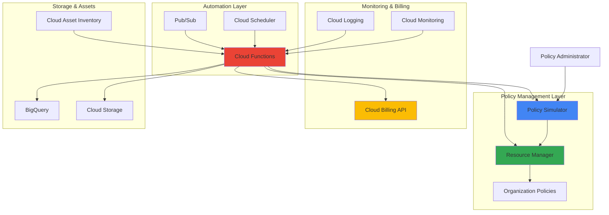

# Resource Governance with Policy Simulator and Resource Manager

## Problem

Enterprise organizations struggle to maintain consistent governance across rapidly expanding Google Cloud environments, leading to uncontrolled resource sprawl, unexpected costs, and security compliance violations. Traditional manual policy enforcement creates bottlenecks for development teams while reactive governance approaches often discover issues too late, resulting in significant financial and security impact.

## Solution

Build an automated governance system that proactively simulates IAM policy changes using Policy Simulator before enforcement, implements organizational constraints through Resource Manager, and maintains cost control with intelligent resource tagging and billing alerts. This solution combines predictive policy analysis with automated remediation to ensure compliance without hindering development velocity.

## Architecture Diagram



## Prerequisites

1. Google Cloud project with Organization Policy, Policy Intelligence, and Cloud Functions APIs enabled
2. `gcloud` CLI v2 installed and configured (or Cloud Shell)
3. Organization-level IAM permissions for policy management and resource governance
4. Basic understanding of IAM, organization policies, and serverless functions
5. Estimated cost: $20-50/month for automated governance system resources

> **Note**: This recipe requires organization-level permissions to implement comprehensive governance. Ensure you have the necessary access rights before proceeding.

## Preparation

```bash
# Set environment variables for the governance system
export PROJECT_ID="governance-automation-$(date +%s)"
export REGION="us-central1"
export ORGANIZATION_ID=$(gcloud organizations list \
    --filter="displayName:example.com" \
    --format="value(name)" | cut -d'/' -f2)

# Generate unique identifiers for resources
RANDOM_SUFFIX=$(openssl rand -hex 3)
export FUNCTION_NAME="governance-automation-${RANDOM_SUFFIX}"
export BUCKET_NAME="governance-reports-${RANDOM_SUFFIX}"
export TOPIC_NAME="governance-events-${RANDOM_SUFFIX}"

# Set default project and region
gcloud config set project ${PROJECT_ID}
gcloud config set compute/region ${REGION}

# Enable required APIs for comprehensive governance
gcloud services enable policysimulator.googleapis.com
gcloud services enable cloudresourcemanager.googleapis.com
gcloud services enable cloudbilling.googleapis.com
gcloud services enable cloudfunctions.googleapis.com
gcloud services enable pubsub.googleapis.com
gcloud services enable cloudasset.googleapis.com
gcloud services enable bigquery.googleapis.com
gcloud services enable cloudscheduler.googleapis.com

echo "✅ Project configured for automated governance: ${PROJECT_ID}"
```

## Steps

1. **Create Organization Policy Constraints for Resource Governance**:

   Organization Policy Service provides centralized control over your cloud resources through constraints that define allowed configurations and behaviors. Creating custom constraints enables fine-grained governance that automatically prevents non-compliant resource configurations while allowing legitimate business activities to proceed without manual approval.

   ```bash
   # Create custom constraint for compute instance locations
   cat > location-constraint.yaml << EOF
name: organizations/${ORGANIZATION_ID}/customConstraints/custom.restrictComputeLocations
resourceTypes:
- compute.googleapis.com/Instance
methodTypes:
- CREATE
condition: "resource.zone in ['us-central1-a', 'us-central1-b', 'us-east1-a', 'us-west1-a']"
actionType: ALLOW
displayName: "Restrict Compute Instance Locations"
description: "Only allow compute instances in approved US regions and zones"
EOF
   
   # Deploy the custom constraint
   gcloud org-policies set-custom-constraint location-constraint.yaml
   
   echo "✅ Custom location constraint created and deployed"
   ```

   The custom constraint is now active at the organization level, providing a foundation for location-based compliance. This constraint automatically evaluates resource creation requests and prevents deployment outside approved regions, ensuring geographic compliance requirements are met consistently across all projects.

2. **Implement Policy Simulation Service for Proactive Analysis**:

   Policy Simulator enables testing of IAM policy changes before implementation, preventing access disruptions and security gaps. This step creates a comprehensive simulation framework that analyzes the impact of proposed policy changes across your entire resource hierarchy, providing confidence in governance decisions.

   ```bash
   # Create service account for policy simulation operations
   gcloud iam service-accounts create policy-simulator-sa \
       --display-name="Policy Simulator Service Account" \
       --description="Service account for automated policy simulation"
   
   # Grant necessary permissions for policy simulation
   gcloud organizations add-iam-policy-binding ${ORGANIZATION_ID} \
       --member="serviceAccount:policy-simulator-sa@${PROJECT_ID}.iam.gserviceaccount.com" \
       --role="roles/policysimulator.admin"
   
   gcloud organizations add-iam-policy-binding ${ORGANIZATION_ID} \
       --member="serviceAccount:policy-simulator-sa@${PROJECT_ID}.iam.gserviceaccount.com" \
       --role="roles/iam.securityReviewer"
   
   # Grant Cloud Asset Inventory permissions for resource analysis
   gcloud organizations add-iam-policy-binding ${ORGANIZATION_ID} \
       --member="serviceAccount:policy-simulator-sa@${PROJECT_ID}.iam.gserviceaccount.com" \
       --role="roles/cloudasset.viewer"
   
   echo "✅ Policy simulation service account configured with appropriate permissions"
   ```

   The policy simulation infrastructure is now ready to analyze proposed changes across your organization. This service account has the necessary permissions to read existing policies, simulate changes, and provide detailed impact analysis without affecting production systems.

3. **Deploy Cloud Function for Automated Policy Management**:

   Cloud Functions provides the serverless compute platform for our governance automation, responding to events and executing policy operations without infrastructure management overhead. This function orchestrates policy simulation, enforcement, and reporting workflows while integrating with other Google Cloud services for comprehensive governance.

   ```bash
   # Create storage bucket for function source and reports
   gsutil mb -p ${PROJECT_ID} -c STANDARD -l ${REGION} \
       gs://${BUCKET_NAME}
   
   # Create Pub/Sub topic for governance events
   gcloud pubsub topics create ${TOPIC_NAME}
   
   # Create the governance automation function source
   mkdir -p governance-function
   cd governance-function
   
   cat > main.py << 'EOF'
import json
import logging
from google.cloud import asset_v1
from google.cloud import billing_v1
from google.cloud import functions_v1
from google.cloud import policysimulator_v1
from google.cloud import resourcemanager_v3
import base64
import os

def governance_automation(cloud_event):
    """Main function for automated governance operations."""
    
    # Configure logging
    logging.basicConfig(level=logging.INFO)
    
    # Initialize clients for Google Cloud services
    asset_client = asset_v1.AssetServiceClient()
    billing_client = billing_v1.CloudBillingClient()
    policy_client = policysimulator_v1.SimulatorClient()
    
    # Parse incoming event data
    try:
        event_data = json.loads(base64.b64decode(cloud_event.data).decode())
    except Exception as e:
        logging.error(f"Failed to parse event data: {str(e)}")
        return
    
    try:
        # Perform resource governance checks
        check_resource_compliance(asset_client, event_data)
        
        # Analyze billing for cost optimization
        analyze_billing_patterns(billing_client, event_data)
        
        # Simulate policy changes if requested
        if event_data.get('simulate_policy', False):
            simulate_policy_changes(policy_client, event_data)
            
        logging.info("Governance automation completed successfully")
        
    except Exception as e:
        logging.error(f"Governance automation failed: {str(e)}")
        raise

def check_resource_compliance(client, event_data):
    """Check resource compliance against organization policies."""
    project_id = event_data.get('project_id', os.environ.get('PROJECT_ID'))
    
    if not project_id:
        logging.warning("No project ID provided for compliance check")
        return []
    
    # Query asset inventory for compliance analysis
    parent = f"projects/{project_id}"
    asset_types = ["compute.googleapis.com/Instance", "storage.googleapis.com/Bucket"]
    
    request = asset_v1.ListAssetsRequest(
        parent=parent,
        asset_types=asset_types
    )
    
    try:
        assets = client.list_assets(request=request)
        compliance_issues = []
        
        for asset in assets:
            # Check location compliance for compute instances
            if "compute.googleapis.com/Instance" in asset.asset_type:
                zone = getattr(asset.resource.data, 'zone', '').split('/')[-1]
                approved_zones = ['us-central1-a', 'us-central1-b', 'us-east1-a', 'us-west1-a']
                
                if zone and zone not in approved_zones:
                    compliance_issues.append({
                        'resource': asset.name,
                        'issue': 'Non-compliant zone',
                        'zone': zone
                    })
            
            # Check resource labels for cost allocation
            labels = getattr(asset.resource.data, 'labels', {})
            required_labels = ['environment', 'team', 'cost-center']
            
            missing_labels = [label for label in required_labels if label not in labels]
            if missing_labels:
                compliance_issues.append({
                    'resource': asset.name,
                    'issue': f'Missing required labels: {", ".join(missing_labels)}'
                })
        
        if compliance_issues:
            logging.warning(f"Found {len(compliance_issues)} compliance issues")
            for issue in compliance_issues:
                logging.warning(f"Compliance issue: {issue}")
        else:
            logging.info("No compliance issues found")
        
        return compliance_issues
        
    except Exception as e:
        logging.error(f"Failed to check resource compliance: {str(e)}")
        return []

def analyze_billing_patterns(client, event_data):
    """Analyze billing patterns for cost optimization opportunities."""
    billing_account = event_data.get('billing_account')
    
    if not billing_account:
        logging.info("No billing account specified for analysis")
        return
    
    try:
        # List projects associated with billing account
        request = billing_v1.ListProjectBillingInfoRequest(
            name=f"billingAccounts/{billing_account}"
        )
        
        projects = client.list_project_billing_info(request=request)
        
        for project in projects:
            if project.billing_enabled:
                logging.info(f"Analyzing billing for project: {project.project_id}")
                # Here you would implement detailed cost analysis logic
                # For example, checking for unused resources, right-sizing opportunities, etc.
                
    except Exception as e:
        logging.error(f"Failed to analyze billing patterns: {str(e)}")

def simulate_policy_changes(client, event_data):
    """Simulate IAM policy changes before implementation."""
    project_id = event_data.get('project_id', os.environ.get('PROJECT_ID'))
    proposed_policy = event_data.get('proposed_policy')
    
    if not project_id or not proposed_policy:
        logging.info("Project ID or proposed policy not provided for simulation")
        return
    
    try:
        # Create simulation request
        parent = f"projects/{project_id}"
        
        # Note: Actual policy simulation would require more complex setup
        # This is a simplified example showing the structure
        logging.info(f"Simulating policy changes for project: {project_id}")
        
        # In a real implementation, you would:
        # 1. Create a simulation request with the proposed policy
        # 2. Run the simulation using the Policy Simulator API
        # 3. Analyze the results for potential access violations
        # 4. Return actionable recommendations
        
        return {"simulation_status": "completed", "violations": []}
        
    except Exception as e:
        logging.error(f"Failed to simulate policy changes: {str(e)}")
        return {"simulation_status": "failed", "error": str(e)}

EOF

   cat > requirements.txt << 'EOF'
google-cloud-asset==3.30.1
google-cloud-billing==1.16.3
google-cloud-functions==1.16.0
google-cloud-policy-simulator==1.1.0
google-cloud-resource-manager==1.12.0
functions-framework==3.5.0
EOF

   # Deploy the governance automation function
   gcloud functions deploy ${FUNCTION_NAME} \
       --gen2 \
       --runtime=python311 \
       --region=${REGION} \
       --source=. \
       --entry-point=governance_automation \
       --trigger-topic=${TOPIC_NAME} \
       --service-account=policy-simulator-sa@${PROJECT_ID}.iam.gserviceaccount.com \
       --set-env-vars="PROJECT_ID=${PROJECT_ID},ORGANIZATION_ID=${ORGANIZATION_ID}" \
       --timeout=540s \
       --memory=512MB

   cd ..
   echo "✅ Governance automation function deployed successfully"
   ```

   The Cloud Function is now deployed and ready to respond to governance events. This serverless function automatically analyzes resource compliance, performs cost optimization checks, and simulates policy changes, providing the automation layer for comprehensive governance management.

4. **Configure Billing API Integration for Cost Management**:

   Cloud Billing API integration enables automated cost monitoring and budget enforcement, providing real-time visibility into spending patterns and proactive cost control. This configuration establishes the foundation for intelligent cost optimization that prevents budget overruns while maintaining operational efficiency.

   ```bash
   # Create service account for billing operations
   gcloud iam service-accounts create billing-governance-sa \
       --display-name="Billing Governance Service Account" \
       --description="Service account for billing and cost governance"
   
   # Grant billing viewer permissions
   gcloud organizations add-iam-policy-binding ${ORGANIZATION_ID} \
       --member="serviceAccount:billing-governance-sa@${PROJECT_ID}.iam.gserviceaccount.com" \
       --role="roles/billing.viewer"
   
   # Get the billing account ID for budget creation
   BILLING_ACCOUNT_ID=$(gcloud billing accounts list \
       --format="value(name)" \
       --limit=1 | cut -d'/' -f2)
   
   # Create billing budget for governance monitoring using gcloud CLI
   gcloud billing budgets create \
       --billing-account=${BILLING_ACCOUNT_ID} \
       --display-name="Governance Budget Alert" \
       --budget-amount=100USD \
       --threshold-rule=percent=80,basis=current-spend \
       --threshold-rule=percent=100,basis=current-spend \
       --filter-projects=${PROJECT_ID} \
       --notifications-rule-pubsub-topic=projects/${PROJECT_ID}/topics/${TOPIC_NAME}
   
   echo "✅ Billing governance service account created and budget alert configured"
   ```

   The billing integration infrastructure is now configured to monitor costs and send alerts through Pub/Sub when spending thresholds are reached. This enables proactive cost management and automated responses to budget violations.

5. **Implement Resource Tagging Policy for Cost Allocation**:

   Resource tagging policies ensure consistent cost allocation and resource organization across your Google Cloud environment. Implementing automated tagging requirements enables granular cost tracking, departmental chargebacks, and efficient resource management at scale.

   ```bash
   # Create custom constraint for label validation
   cat > label-constraint.yaml << EOF
name: organizations/${ORGANIZATION_ID}/customConstraints/custom.validateResourceLabels
resourceTypes:
- compute.googleapis.com/Instance
- storage.googleapis.com/Bucket
- container.googleapis.com/Cluster
methodTypes:
- CREATE
- UPDATE
condition: |
  has(resource.labels.environment) && 
  has(resource.labels.team) && 
  has(resource.labels['cost-center']) &&
  resource.labels.environment in ['dev', 'staging', 'prod']
actionType: ALLOW
displayName: "Validate Required Resource Labels"
description: "Ensure all resources have required labels for cost allocation"
EOF

   # Deploy the label validation constraint
   gcloud org-policies set-custom-constraint label-constraint.yaml
   
   # Create and apply organization policy to enforce the constraint
   cat > enforce-labels-policy.yaml << EOF
name: organizations/${ORGANIZATION_ID}/policies/custom.validateResourceLabels
spec:
  rules:
  - enforce: true
EOF

   gcloud org-policies set-policy enforce-labels-policy.yaml
   
   echo "✅ Resource tagging policies implemented for cost allocation"
   ```

   The resource tagging framework is now enforced organization-wide, ensuring all new resources include required labels for cost allocation and resource management. This enables accurate departmental cost tracking and facilitates automated resource lifecycle management.

6. **Deploy Scheduled Governance Audits**:

   Cloud Scheduler enables regular governance audits that proactively identify compliance issues and optimization opportunities. This automated auditing system ensures continuous governance monitoring without manual intervention, maintaining security and cost compliance across your entire Google Cloud organization.

   ```bash
   # Create Cloud Scheduler job for regular governance audits
   gcloud scheduler jobs create pubsub governance-audit-job \
       --schedule="0 9 * * 1" \
       --topic=${TOPIC_NAME} \
       --message-body='{"audit_type":"full","project_scope":"organization"}' \
       --time-zone="America/New_York" \
       --description="Weekly governance audit across organization"
   
   # Create additional scheduler for daily cost monitoring
   gcloud scheduler jobs create pubsub cost-monitoring-job \
       --schedule="0 8 * * *" \
       --topic=${TOPIC_NAME} \
       --message-body='{"audit_type":"billing","check_budgets":true}' \
       --time-zone="America/New_York" \
       --description="Daily cost and budget monitoring"
   
   # Test the scheduler jobs with manual runs
   gcloud scheduler jobs run governance-audit-job
   gcloud scheduler jobs run cost-monitoring-job
   
   echo "✅ Scheduled governance audits configured and activated"
   ```

   The scheduled governance system is now active, automatically performing weekly comprehensive audits and daily cost monitoring. These automated checks ensure continuous compliance monitoring and proactive identification of governance issues before they impact operations.

## Validation & Testing

1. **Verify Organization Policy Enforcement**:

   ```bash
   # Test location constraint by attempting to create instance in restricted region
   gcloud compute instances create test-compliance-vm \
       --zone=asia-east1-a \
       --machine-type=e2-micro \
       --image-family=debian-11 \
       --image-project=debian-cloud \
       --labels=environment=test,team=governance,cost-center=engineering
   ```

   Expected output: Policy violation error preventing instance creation in non-approved region.

2. **Test Policy Simulation Functionality**:

   ```bash
   # Trigger policy simulation through Pub/Sub
   gcloud pubsub topics publish ${TOPIC_NAME} \
       --message='{"simulate_policy":true,"project_id":"'${PROJECT_ID}'","audit_type":"policy_simulation"}'
   
   # Check function logs for simulation results
   gcloud logging read "resource.type=cloud_function AND resource.labels.function_name=${FUNCTION_NAME}" \
       --limit=10 \
       --format="value(textPayload)"
   ```

3. **Validate Billing Integration**:

   ```bash
   # Check billing account association
   gcloud billing projects describe ${PROJECT_ID} \
       --format="value(billingAccountName,billingEnabled)"
   
   # Verify budget alert configuration
   gcloud billing budgets list \
       --billing-account=$(gcloud billing projects describe ${PROJECT_ID} --format="value(billingAccountName)" | cut -d'/' -f2)
   ```

4. **Test Resource Tagging Enforcement**:

   ```bash
   # Attempt to create resource without required labels (should fail)
   gcloud compute instances create test-tagging-fail \
       --zone=us-central1-a \
       --machine-type=e2-micro \
       --image-family=debian-11 \
       --image-project=debian-cloud
   
   # Create resource with proper labels (should succeed)
   gcloud compute instances create test-tagging-success \
       --zone=us-central1-a \
       --machine-type=e2-micro \
       --image-family=debian-11 \
       --image-project=debian-cloud \
       --labels=environment=dev,team=engineering,cost-center=rd,project-code=gov-test
   ```

## Cleanup

1. **Remove test resources and cleanup governance infrastructure**:

   ```bash
   # Delete test compute instances
   gcloud compute instances delete test-tagging-success \
       --zone=us-central1-a \
       --quiet
   
   echo "✅ Test resources removed"
   ```

2. **Remove scheduled jobs and function**:

   ```bash
   # Delete Cloud Scheduler jobs
   gcloud scheduler jobs delete governance-audit-job --quiet
   gcloud scheduler jobs delete cost-monitoring-job --quiet
   
   # Delete Cloud Function
   gcloud functions delete ${FUNCTION_NAME} \
       --region=${REGION} \
       --quiet
   
   echo "✅ Automation infrastructure removed"
   ```

3. **Clean up policies and constraints**:

   ```bash
   # Remove organization policies
   gcloud org-policies delete custom.validateResourceLabels \
       --organization=${ORGANIZATION_ID}
   
   gcloud org-policies delete-custom-constraint custom.validateResourceLabels \
       --organization=${ORGANIZATION_ID}
   
   gcloud org-policies delete-custom-constraint custom.restrictComputeLocations \
       --organization=${ORGANIZATION_ID}
   
   echo "✅ Organization policies and constraints removed"
   ```

4. **Remove service accounts and storage**:

   ```bash
   # Delete service accounts
   gcloud iam service-accounts delete \
       policy-simulator-sa@${PROJECT_ID}.iam.gserviceaccount.com \
       --quiet
   
   gcloud iam service-accounts delete \
       billing-governance-sa@${PROJECT_ID}.iam.gserviceaccount.com \
       --quiet
   
   # Remove storage bucket
   gsutil -m rm -r gs://${BUCKET_NAME}
   
   # Delete Pub/Sub topic
   gcloud pubsub topics delete ${TOPIC_NAME}
   
   echo "✅ All governance resources cleaned up successfully"
   ```

## Discussion

This automated governance solution demonstrates the power of combining Google Cloud's Policy Simulator, Resource Manager, and serverless automation to create a comprehensive governance framework. Policy Simulator provides predictive analysis capabilities that prevent access disruptions by testing IAM policy changes before implementation, while Resource Manager enforces organizational constraints that automatically maintain compliance across your entire cloud environment.

The serverless architecture using Cloud Functions ensures the governance system scales automatically with your organization's growth while minimizing operational overhead. By leveraging Pub/Sub for event-driven automation and Cloud Scheduler for regular audits, the solution provides both reactive and proactive governance capabilities. The integration with Cloud Billing API enables intelligent cost management that prevents budget overruns while maintaining development velocity.

Resource tagging policies implemented through Organization Policy Service ensure consistent cost allocation and enable granular financial tracking across departments and projects. This approach transforms governance from a reactive, manual process into a proactive, automated system that supports business agility while maintaining security and compliance requirements. The solution follows Google Cloud's Well-Architected Framework principles for operational excellence and cost optimization.

The policy simulation capabilities are particularly valuable for large organizations where manual policy testing would be impractical and risky. By automating the simulation process, teams can implement governance changes with confidence, knowing the impact has been thoroughly analyzed. This approach significantly reduces the risk of access disruptions that can impact business operations and development productivity.

> **Tip**: Implement governance policies gradually across your organization, starting with non-production environments to validate automation behavior before applying to critical production systems. Use the policy simulation results to fine-tune constraint configurations.

For more information on Google Cloud governance best practices, see the following official documentation:

- [Organization Policy Service Documentation](https://cloud.google.com/resource-manager/docs/organization-policy/overview)
- [Policy Intelligence and Policy Simulator](https://cloud.google.com/policy-intelligence/docs)
- [Google Cloud Cost Management Best Practices](https://cloud.google.com/billing/docs/best-practices)
- [Google Cloud Architecture Framework - Governance](https://cloud.google.com/architecture/framework/governance)
- [Cloud Asset Inventory for Compliance Monitoring](https://cloud.google.com/asset-inventory/docs)

## Challenge

Extend this governance solution by implementing these advanced capabilities:

1. **Multi-Cloud Governance Integration**: Expand the solution to include governance policies for AWS and Azure resources, creating a unified governance framework that works across cloud providers and enables consistent policy enforcement regardless of infrastructure location.

2. **Machine Learning-Powered Cost Optimization**: Integrate Vertex AI to analyze historical billing and usage patterns, automatically identifying cost optimization opportunities and predicting future resource needs based on application usage trends and seasonal patterns.

3. **Advanced Compliance Reporting**: Build automated compliance reporting that generates detailed governance reports for SOC 2, ISO 27001, and other compliance frameworks, including evidence collection and audit trail generation for regulatory requirements.

4. **Self-Healing Resource Management**: Implement automated remediation capabilities that detect and automatically fix governance violations, such as moving non-compliant resources to approved regions or applying missing security configurations without manual intervention.

5. **Developer Self-Service Governance Portal**: Create a web-based portal using App Engine that allows developers to request policy exceptions, view governance status, and simulate policy changes before requesting implementation, improving developer experience while maintaining security standards.

## Infrastructure Code

### Available Infrastructure as Code:

- [Infrastructure Code Overview](code/README.md) - Detailed description of all infrastructure components
- [Infrastructure Manager](code/infrastructure-manager/) - GCP Infrastructure Manager templates
- [Bash CLI Scripts](code/scripts/) - Example bash scripts using gcloud CLI commands to deploy infrastructure
- [Terraform](code/terraform/) - Terraform configuration files