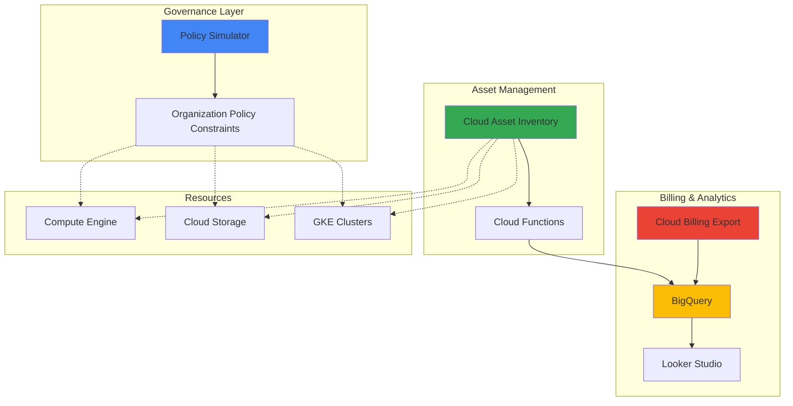

# Resource Tagging and Cost Allocation with Policy Simulator and Cloud Asset Inventory

## Problem

Enterprise organizations struggle with accurately tracking cloud spending across teams, projects, and business units due to inconsistent resource tagging practices and lack of automated governance. Without proper cost allocation mechanisms, finance teams cannot implement effective chargeback models, leading to budget overruns and difficulty identifying cost optimization opportunities across the organization.

## Solution

Build an automated system that enforces consistent resource tagging policies using Google Cloud's Policy Simulator and Cloud Asset Inventory services. This solution automatically tracks resource usage, validates tagging compliance, and generates detailed cost allocation reports through Cloud Billing integration, enabling accurate financial accountability and cost transparency across teams.

## Architecture Diagram



## Prerequisites

1. Google Cloud project with Billing enabled and appropriate IAM permissions
2. Organization-level access for creating organization policies
3. gcloud CLI v2 installed and configured (or Google Cloud Shell)
4. Basic understanding of Google Cloud resource hierarchy and IAM
5. Estimated cost: $5-15 per month for BigQuery storage and Cloud Functions execution

> **Note**: This recipe requires organization-level permissions to create and manage organization policies. Ensure you have the necessary admin privileges before proceeding.

## Preparation

```bash
# Set environment variables for project configuration
export PROJECT_ID=$(gcloud config get-value project)
export ORGANIZATION_ID=$(gcloud organizations list \
    --format="value(name)" --limit=1)
export REGION="us-central1"
export ZONE="us-central1-a"

# Generate unique identifiers for resources
RANDOM_SUFFIX=$(openssl rand -hex 3)
export DATASET_NAME="cost_allocation_${RANDOM_SUFFIX}"
export FUNCTION_NAME="tag-compliance-${RANDOM_SUFFIX}"
export BUCKET_NAME="${PROJECT_ID}-billing-export-${RANDOM_SUFFIX}"

# Set default project and region
gcloud config set project ${PROJECT_ID}
gcloud config set compute/region ${REGION}
gcloud config set compute/zone ${ZONE}

# Enable required APIs
gcloud services enable cloudasset.googleapis.com \
    policysimulator.googleapis.com \
    cloudfunctions.googleapis.com \
    cloudbuild.googleapis.com \
    bigquery.googleapis.com \
    cloudbilling.googleapis.com \
    orgpolicy.googleapis.com

echo "✅ Project configured: ${PROJECT_ID}"
echo "✅ Organization ID: ${ORGANIZATION_ID}"
```

## Steps

1. **Create Organization Policy Constraints for Mandatory Tagging**:

   Organization policies provide the foundation for enforcing consistent resource tagging across your Google Cloud environment. By creating custom constraints, we establish mandatory tag requirements that prevent resource creation without proper cost allocation metadata. This proactive approach ensures all resources include essential business context for accurate financial tracking.

   ```bash
   # Create custom constraint YAML for mandatory tags
   cat > mandatory-tags-constraint.yaml <<EOF
   name: organizations/${ORGANIZATION_ID}/customConstraints/custom.mandatoryResourceTags
   resourceTypes:
   - compute.googleapis.com/Instance
   - storage.googleapis.com/Bucket
   - container.googleapis.com/Cluster
   methodTypes:
   - CREATE
   - UPDATE
   condition: |
     has(resource.labels.department) &&
     has(resource.labels.cost_center) &&
     has(resource.labels.environment) &&
     has(resource.labels.project_code)
   actionType: ALLOW
   displayName: "Mandatory Resource Tags"
   description: "Requires department, cost_center, environment, and project_code labels on all resources"
   EOF
   
   # Deploy the custom constraint
   gcloud org-policies set-custom-constraint \
       mandatory-tags-constraint.yaml
   
   echo "✅ Custom constraint created for mandatory tagging"
   ```

   The constraint is now active and will block resource creation that doesn't include all four required labels. This establishes the foundation for consistent cost allocation tracking across your organization's cloud infrastructure.

2. **Configure Policy Simulator for Tag Validation**:

   Policy Simulator enables you to test and validate IAM and organization policy changes before applying them to production resources. This critical capability prevents accidental lockouts while ensuring your tagging policies work as intended across different resource types and deployment scenarios.

   ```bash
   # Test the mandatory tagging policy simulation
   cat > policy-test.json <<EOF
   {
     "policy": {
       "bindings": [
         {
           "role": "roles/compute.instanceAdmin.v1",
           "members": ["user:test@example.com"]
         }
       ]
     },
     "fullResourceName": "//compute.googleapis.com/projects/${PROJECT_ID}/zones/${ZONE}/instances/test-instance"
   }
   EOF
   
   # Simulate policy enforcement
   gcloud alpha policy-intelligence simulate-iam-policy \
       --policy-file=policy-test.json \
       --access-tuple="member=user:test@example.com,permission=compute.instances.create"
   
   echo "✅ Policy simulation configured"
   ```

   Policy Simulator confirms that your tagging constraints will function correctly without disrupting legitimate resource operations, providing confidence in your governance implementation.

3. **Set up Cloud Asset Inventory for Resource Tracking**:

   Cloud Asset Inventory provides comprehensive visibility into all Google Cloud resources, their metadata, and policy configurations. By configuring asset feeds, we establish real-time monitoring of resource changes and tag compliance across your entire cloud infrastructure.

   ```bash
   # Create Cloud Asset Inventory feed for resource monitoring
   cat > asset-feed-config.json <<EOF
   {
     "name": "projects/${PROJECT_ID}/feeds/resource-compliance-feed",
     "assetTypes": [
       "compute.googleapis.com/Instance",
       "storage.googleapis.com/Bucket",
       "container.googleapis.com/Cluster"
     ],
     "contentType": "RESOURCE",
     "feedOutputConfig": {
       "pubsubDestination": {
         "topic": "projects/${PROJECT_ID}/topics/asset-changes"
       }
     }
   }
   EOF
   
   # Create Pub/Sub topic for asset changes
   gcloud pubsub topics create asset-changes
   
   # Create the asset feed
   gcloud asset feeds create resource-compliance-feed \
       --organization=${ORGANIZATION_ID} \
       --asset-types=compute.googleapis.com/Instance,storage.googleapis.com/Bucket,container.googleapis.com/Cluster \
       --content-type=resource \
       --pubsub-topic=projects/${PROJECT_ID}/topics/asset-changes
   
   echo "✅ Asset inventory feed configured"
   ```

   The asset feed now monitors all specified resource types and publishes change notifications to Pub/Sub, enabling real-time compliance tracking and automated remediation workflows.

4. **Create BigQuery Dataset for Cost Analytics**:

   BigQuery serves as the central data warehouse for cost allocation analytics, combining billing data with resource metadata to provide comprehensive financial insights. This unified approach enables sophisticated cost analysis and automated reporting for finance teams.

   ```bash
   # Create BigQuery dataset for cost allocation
   bq mk --dataset \
       --description="Cost allocation and tagging analytics" \
       --location=${REGION} \
       ${PROJECT_ID}:${DATASET_NAME}
   
   # Create table for tag compliance tracking
   bq mk --table \
       ${PROJECT_ID}:${DATASET_NAME}.tag_compliance \
       resource_name:STRING,resource_type:STRING,labels:JSON,compliant:BOOLEAN,timestamp:TIMESTAMP,cost_center:STRING,department:STRING,environment:STRING,project_code:STRING
   
   # Create table for cost allocation
   bq mk --table \
       ${PROJECT_ID}:${DATASET_NAME}.cost_allocation \
       billing_date:DATE,project_id:STRING,service:STRING,sku:STRING,cost:FLOAT,currency:STRING,department:STRING,cost_center:STRING,environment:STRING,project_code:STRING
   
   echo "✅ BigQuery dataset and tables created"
   ```

   The BigQuery infrastructure is ready to store and analyze cost allocation data, providing the foundation for detailed financial reporting and cost optimization insights.

5. **Deploy Cloud Function for Tag Compliance Monitoring**:

   Cloud Functions provide serverless automation for processing asset change notifications and enforcing tag compliance. This function validates resource tags against organization policies and updates compliance tracking in real-time, ensuring continuous governance oversight.

   ```bash
   # Create Cloud Function source code
   mkdir -p cloud-function
   cat > cloud-function/main.py <<EOF
   import json
   import base64
   from google.cloud import bigquery
   from google.cloud import asset_v1
   import functions_framework
   
   client = bigquery.Client()
   
   @functions_framework.cloud_event
   def process_asset_change(cloud_event):
       """Process asset change notifications for tag compliance."""
       
       # Decode Pub/Sub message
       message_data = base64.b64decode(cloud_event.data["message"]["data"])
       asset_data = json.loads(message_data)
       
       # Extract resource information
       resource_name = asset_data.get("name", "")
       resource_type = asset_data.get("assetType", "")
       labels = asset_data.get("resource", {}).get("data", {}).get("labels", {})
       
       # Check tag compliance
       required_tags = ["department", "cost_center", "environment", "project_code"]
       compliant = all(tag in labels for tag in required_tags)
       
       # Insert compliance record
       table_id = "${PROJECT_ID}.${DATASET_NAME}.tag_compliance"
       row = {
           "resource_name": resource_name,
           "resource_type": resource_type,
           "labels": json.dumps(labels),
           "compliant": compliant,
           "timestamp": "CURRENT_TIMESTAMP()",
           "cost_center": labels.get("cost_center", ""),
           "department": labels.get("department", ""),
           "environment": labels.get("environment", ""),
           "project_code": labels.get("project_code", "")
       }
       
       table = client.get_table(table_id)
       client.insert_rows_json(table, [row])
       
       print(f"Processed asset: {resource_name}, Compliant: {compliant}")
   EOF
   
   # Create requirements.txt
   cat > cloud-function/requirements.txt <<EOF
   google-cloud-bigquery>=3.0.0
   google-cloud-asset>=3.0.0
   functions-framework>=3.0.0
   EOF
   
   # Deploy the Cloud Function
   gcloud functions deploy ${FUNCTION_NAME} \
       --gen2 \
       --runtime=python311 \
       --region=${REGION} \
       --source=cloud-function \
       --entry-point=process_asset_change \
       --trigger-topic=asset-changes \
       --memory=256MB \
       --timeout=60s
   
   echo "✅ Cloud Function deployed for tag compliance monitoring"
   ```

   The Cloud Function is now actively monitoring resource changes and maintaining real-time compliance tracking in BigQuery, providing immediate visibility into tagging policy adherence.

6. **Configure Cloud Billing Export to BigQuery**:

   Cloud Billing export integration enables detailed cost analysis by combining billing data with resource metadata. This connection provides the essential link between cloud spending and business attribution through your tagging strategy.

   ```bash
   # Create Cloud Storage bucket for billing export
   gsutil mb -p ${PROJECT_ID} \
       -c STANDARD \
       -l ${REGION} \
       gs://${BUCKET_NAME}
   
   # Get billing account ID
   BILLING_ACCOUNT=$(gcloud billing accounts list \
       --format="value(name)" --limit=1)
   
   # Configure billing export (Note: This typically requires billing admin permissions)
   echo "Configure billing export in the Cloud Console:"
   echo "1. Go to Cloud Billing > Billing export"
   echo "2. Enable BigQuery export to dataset: ${DATASET_NAME}"
   echo "3. Enable detailed usage cost data export"
   echo "Billing Account: ${BILLING_ACCOUNT}"
   echo "Dataset: ${PROJECT_ID}:${DATASET_NAME}"
   
   echo "✅ Billing export configuration prepared"
   ```

   With billing export configured, cost data will flow into BigQuery where it can be joined with resource metadata to provide comprehensive cost allocation insights.

7. **Create Cost Allocation Analysis Queries**:

   BigQuery SQL queries transform raw billing and resource data into actionable cost allocation insights. These queries provide the analytical foundation for chargeback reporting, budget tracking, and cost optimization recommendations across business units.

   ```bash
   # Create cost allocation analysis view
   cat > cost-analysis.sql <<EOF
   CREATE OR REPLACE VIEW \`${PROJECT_ID}.${DATASET_NAME}.cost_allocation_summary\` AS
   SELECT
     DATE(usage_start_time) as billing_date,
     project.id as project_id,
     service.description as service_name,
     sku.description as sku_description,
     SUM(cost) as total_cost,
     currency,
     labels.value as department,
     tags.value as cost_center,
     location.location as region,
     COUNT(*) as resource_count
   FROM \`${PROJECT_ID}.${DATASET_NAME}.gcp_billing_export_v1_*\`
   WHERE
     DATE(usage_start_time) >= DATE_SUB(CURRENT_DATE(), INTERVAL 30 DAY)
     AND labels.key = 'department'
     AND tags.key = 'cost_center'
   GROUP BY
     billing_date, project_id, service_name, sku_description,
     currency, department, cost_center, region
   ORDER BY
     billing_date DESC, total_cost DESC;
   EOF
   
   # Execute the cost allocation view creation
   bq query --use_legacy_sql=false < cost-analysis.sql
   
   # Create compliance summary query
   cat > compliance-summary.sql <<EOF
   CREATE OR REPLACE VIEW \`${PROJECT_ID}.${DATASET_NAME}.compliance_summary\` AS
   SELECT
     DATE(timestamp) as compliance_date,
     resource_type,
     department,
     cost_center,
     environment,
     COUNT(*) as total_resources,
     SUM(CASE WHEN compliant THEN 1 ELSE 0 END) as compliant_resources,
     ROUND(100.0 * SUM(CASE WHEN compliant THEN 1 ELSE 0 END) / COUNT(*), 2) as compliance_percentage
   FROM \`${PROJECT_ID}.${DATASET_NAME}.tag_compliance\`
   WHERE
     DATE(timestamp) >= DATE_SUB(CURRENT_DATE(), INTERVAL 7 DAY)
   GROUP BY
     compliance_date, resource_type, department, cost_center, environment
   ORDER BY
     compliance_date DESC, compliance_percentage ASC;
   EOF
   
   # Execute the compliance summary view creation
   bq query --use_legacy_sql=false < compliance-summary.sql
   
   echo "✅ Cost allocation analysis queries created"
   ```

   The analytical views are now available for generating cost allocation reports and compliance dashboards, providing finance teams with the insights needed for effective cost management.

8. **Set up Automated Cost Allocation Reporting**:

   Automated reporting ensures stakeholders receive regular updates on cost allocation and tagging compliance without manual intervention. This Cloud Function generates scheduled reports and sends them to relevant business stakeholders based on their department and cost center assignments.

   ```bash
   # Create automated reporting function
   mkdir -p reporting-function
   cat > reporting-function/main.py <<EOF
   import json
   from google.cloud import bigquery
   from google.cloud import storage
   import pandas as pd
   from datetime import datetime, timedelta
   import functions_framework
   
   @functions_framework.http
   def generate_cost_report(request):
       """Generate weekly cost allocation report."""
       
       client = bigquery.Client()
       
       # Query cost allocation data
       query = f"""
       SELECT *
       FROM \`${PROJECT_ID}.${DATASET_NAME}.cost_allocation_summary\`
       WHERE billing_date >= DATE_SUB(CURRENT_DATE(), INTERVAL 7 DAY)
       ORDER BY total_cost DESC
       """
       
       df = client.query(query).to_dataframe()
       
       # Generate report summary
       total_cost = df['total_cost'].sum()
       top_departments = df.groupby('department')['total_cost'].sum().head(5)
       
       report = {
           'report_date': datetime.now().isoformat(),
           'total_weekly_cost': float(total_cost),
           'currency': df['currency'].iloc[0] if not df.empty else 'USD',
           'top_departments': top_departments.to_dict(),
           'resource_count': len(df),
           'compliance_summary': 'See compliance dashboard for details'
       }
       
       # Store report in Cloud Storage
       storage_client = storage.Client()
       bucket = storage_client.bucket('${BUCKET_NAME}')
       blob = bucket.blob(f"reports/cost-allocation-{datetime.now().strftime('%Y-%m-%d')}.json")
       blob.upload_from_string(json.dumps(report, indent=2))
       
       return json.dumps(report, indent=2)
   EOF
   
   # Create requirements.txt for reporting function
   cat > reporting-function/requirements.txt <<EOF
   google-cloud-bigquery>=3.0.0
   google-cloud-storage>=2.0.0
   pandas>=1.5.0
   functions-framework>=3.0.0
   EOF
   
   # Deploy reporting function
   gcloud functions deploy cost-allocation-reporter \
       --gen2 \
       --runtime=python311 \
       --region=${REGION} \
       --source=reporting-function \
       --entry-point=generate_cost_report \
       --trigger-http \
       --allow-unauthenticated \
       --memory=512MB \
       --timeout=300s
   
   echo "✅ Automated cost reporting function deployed"
   ```

   The reporting function is now ready to generate weekly cost allocation summaries, providing stakeholders with regular insights into spending patterns and cost attribution accuracy.

## Validation & Testing

1. **Verify Organization Policy Enforcement**:

   ```bash
   # Test mandatory tagging policy by attempting to create non-compliant resource
   gcloud compute instances create test-instance-noncompliant \
       --zone=${ZONE} \
       --machine-type=e2-micro \
       --image-family=debian-11 \
       --image-project=debian-cloud \
       || echo "✅ Policy correctly blocked non-compliant resource creation"
   ```

   Expected output: Error message indicating the resource creation was blocked due to missing required labels.

2. **Test Compliant Resource Creation**:

   ```bash
   # Create compliant resource with all required tags
   gcloud compute instances create test-instance-compliant \
       --zone=${ZONE} \
       --machine-type=e2-micro \
       --image-family=debian-11 \
       --image-project=debian-cloud \
       --labels=department=engineering,cost_center=cc-001,environment=test,project_code=proj-123
   
   echo "✅ Compliant resource created successfully"
   ```

3. **Verify Asset Inventory Feed**:

   ```bash
   # Check asset feed status
   gcloud asset feeds list --organization=${ORGANIZATION_ID}
   
   # Verify Pub/Sub topic received messages
   gcloud pubsub subscriptions create test-subscription \
       --topic=asset-changes
   
   gcloud pubsub subscriptions pull test-subscription \
       --limit=5 \
       --auto-ack
   ```

4. **Test Cost Allocation Queries**:

   ```bash
   # Query compliance summary
   bq query --use_legacy_sql=false \
       "SELECT * FROM \`${PROJECT_ID}.${DATASET_NAME}.compliance_summary\` LIMIT 10"
   
   # Test automated reporting function
   curl -X GET \
       "https://${REGION}-${PROJECT_ID}.cloudfunctions.net/cost-allocation-reporter"
   ```

## Cleanup

1. **Remove test resources**:

   ```bash
   # Delete test compute instance
   gcloud compute instances delete test-instance-compliant \
       --zone=${ZONE} \
       --quiet
   
   echo "✅ Test compute instance deleted"
   ```

2. **Clean up Cloud Functions**:

   ```bash
   # Delete Cloud Functions
   gcloud functions delete ${FUNCTION_NAME} \
       --region=${REGION} \
       --quiet
   
   gcloud functions delete cost-allocation-reporter \
       --region=${REGION} \
       --quiet
   
   echo "✅ Cloud Functions deleted"
   ```

3. **Remove BigQuery resources**:

   ```bash
   # Delete BigQuery dataset and tables
   bq rm -r -f ${PROJECT_ID}:${DATASET_NAME}
   
   echo "✅ BigQuery dataset deleted"
   ```

4. **Clean up Pub/Sub and Storage**:

   ```bash
   # Delete Pub/Sub resources
   gcloud pubsub subscriptions delete test-subscription --quiet
   gcloud pubsub topics delete asset-changes --quiet
   
   # Delete Cloud Storage bucket
   gsutil rm -r gs://${BUCKET_NAME}
   
   # Remove asset feed
   gcloud asset feeds delete resource-compliance-feed \
       --organization=${ORGANIZATION_ID} \
       --quiet
   
   echo "✅ Pub/Sub and Storage resources cleaned up"
   ```

5. **Remove organization policy (optional)**:

   ```bash
   # Remove custom constraint (use with caution in production)
   gcloud org-policies delete-custom-constraint \
       organizations/${ORGANIZATION_ID}/customConstraints/custom.mandatoryResourceTags
   
   echo "✅ Organization policy constraint removed"
   ```

## Discussion

This intelligent resource tagging and cost allocation system addresses one of the most challenging aspects of cloud financial management: accurately attributing costs to business units and projects. By combining Google Cloud's governance tools with automated analytics, organizations gain unprecedented visibility into their cloud spending patterns while ensuring consistent tagging practices across all resources.

The solution leverages [Policy Simulator](https://cloud.google.com/policy-intelligence/docs/iam-simulator-overview) to validate governance policies before implementation, preventing accidental resource lockouts. [Cloud Asset Inventory](https://cloud.google.com/asset-inventory/docs/overview) provides comprehensive resource tracking with real-time change notifications, enabling immediate compliance monitoring. The integration with [Cloud Billing export](https://cloud.google.com/billing/docs/how-to/export-data-bigquery-tables/standard-usage) creates a unified view of costs and resource metadata in BigQuery.

The automated reporting system transforms raw data into actionable insights for finance teams. By correlating billing data with resource tags, organizations can implement accurate chargeback models and identify cost optimization opportunities. The [organization policy constraints](https://cloud.google.com/resource-manager/docs/tags/tags-overview) ensure consistent tagging from resource creation, eliminating the common problem of retroactive tag application.

Performance considerations include BigQuery query optimization for large datasets and Cloud Functions memory allocation for processing high-volume asset changes. Cost optimization opportunities emerge through identifying untagged or mistagged resources, enabling targeted remediation efforts. The system scales automatically with Google Cloud's serverless architecture, handling organizations of any size without manual infrastructure management.

> **Tip**: Implement gradual rollout of organization policies by starting with warning mode before enforcing blocking constraints. Use [Cloud Asset Inventory's search capabilities](https://cloud.google.com/asset-inventory/docs/search-resources) to identify existing resources that need tag remediation before policy enforcement.

## Challenge

Extend this solution by implementing these enhancements:

1. **Real-time Cost Alerts**: Create Cloud Functions that monitor cost thresholds per department and send automated alerts when budgets are exceeded, using Cloud Monitoring and Pub/Sub for real-time notifications.

2. **Predictive Cost Analytics**: Implement machine learning models using Vertex AI to predict future costs based on historical tagging patterns and resource usage trends, enabling proactive budget planning.

3. **Multi-Cloud Cost Allocation**: Extend the system to include AWS and Azure resources using Cloud Asset Inventory's multi-cloud capabilities and third-party cost management APIs for unified cost visibility.

4. **Dynamic Tagging Recommendations**: Build an AI-powered system that analyzes resource usage patterns and automatically suggests optimal tag values for cost optimization and better resource organization.

5. **Compliance Automation**: Develop automated remediation workflows that apply missing tags based on resource metadata, deployment patterns, and organizational rules using Cloud Workflows and IAM policy intelligence.

## Infrastructure Code

*Infrastructure code will be generated after recipe approval.*