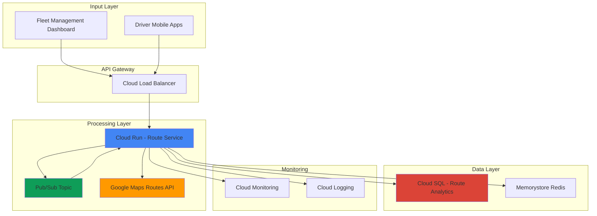

# Route Optimization with Google Maps Routes API and Cloud Optimization AI

## Problem

Modern logistics companies struggle with static route planning that cannot adapt to real-time traffic conditions, customer demand changes, and fleet availability. Traditional routing solutions often result in 20-30% inefficiency in delivery times and fuel costs because they lack integration between real-time traffic data and AI-powered optimization algorithms. Without dynamic route optimization, businesses face increased operational costs, missed delivery windows, and poor customer satisfaction.

## Solution

Build an intelligent logistics platform that combines Google Maps Routes API for real-time traffic-aware routing with Cloud Run for serverless route processing, Pub/Sub for event-driven optimization triggers, and Cloud SQL for persistent route analytics. This solution dynamically recalculates optimal routes based on traffic conditions, delivery priorities, and fleet constraints, providing businesses with adaptive routing capabilities that reduce costs and improve delivery performance.

## Architecture Diagram



## Prerequisites

1. GCP account with billing enabled and necessary IAM permissions for Compute Engine, Cloud Run, Cloud SQL, and Pub/Sub
2. Google Cloud CLI installed and configured (or Cloud Shell)
3. Basic understanding of REST APIs, serverless architecture, and SQL databases
4. Google Maps Platform API key with Routes API enabled
5. Estimated cost: $50-100/month for development workloads (includes Cloud Run, Cloud SQL, Pub/Sub, and Maps API usage)

> **Note**: Google Maps Routes API pricing starts at $5 per 1,000 requests. Monitor usage to control costs during testing and development.

## Preparation

```bash
# Set environment variables for GCP resources
export PROJECT_ID="route-optimization-$(date +%s)"
export REGION="us-central1"
export ZONE="us-central1-a"

# Generate unique suffix for resource names
RANDOM_SUFFIX=$(openssl rand -hex 3)
export SQL_INSTANCE_NAME="route-db-${RANDOM_SUFFIX}"
export SERVICE_NAME="route-optimizer-${RANDOM_SUFFIX}"
export TOPIC_NAME="route-events-${RANDOM_SUFFIX}"

# Set default project and region
gcloud config set project ${PROJECT_ID}
gcloud config set compute/region ${REGION}
gcloud config set compute/zone ${ZONE}

# Enable required APIs
gcloud services enable run.googleapis.com
gcloud services enable sql-component.googleapis.com
gcloud services enable sqladmin.googleapis.com
gcloud services enable pubsub.googleapis.com
gcloud services enable cloudbuild.googleapis.com

echo "✅ Project configured: ${PROJECT_ID}"
echo "✅ Required APIs enabled"
```

## Steps

1. **Create Cloud SQL Database for Route Analytics**:

   Cloud SQL provides a fully managed relational database that stores route optimization results, performance metrics, and historical analytics. The PostgreSQL engine offers excellent performance for geospatial queries and time-series analysis, essential for tracking route efficiency over time and identifying optimization patterns.

   ```bash
   # Create Cloud SQL PostgreSQL instance
   gcloud sql instances create ${SQL_INSTANCE_NAME} \
       --database-version=POSTGRES_14 \
       --tier=db-f1-micro \
       --region=${REGION} \
       --storage-type=SSD \
       --storage-size=20GB \
       --backup \
       --enable-bin-log
   
   # Set password for default postgres user
   gcloud sql users set-password postgres \
       --instance=${SQL_INSTANCE_NAME} \
       --password=SecurePass123!
   
   echo "✅ Cloud SQL instance created: ${SQL_INSTANCE_NAME}"
   ```

   The database instance is now ready with automated backups and binary logging enabled, providing data durability and point-in-time recovery capabilities essential for production logistics systems.

2. **Create Database Schema for Route Management**:

   The database schema captures route requests, optimization results, and performance metrics to enable continuous improvement of routing algorithms and business intelligence analysis.

   ```bash
   # Create database and tables
   gcloud sql databases create route_analytics \
       --instance=${SQL_INSTANCE_NAME}
   
   # Create SQL schema file
   cat > schema.sql << 'EOF'
   CREATE TABLE routes (
       id SERIAL PRIMARY KEY,
       request_id VARCHAR(255) UNIQUE NOT NULL,
       origin_lat DECIMAL(10, 8) NOT NULL,
       origin_lng DECIMAL(11, 8) NOT NULL,
       destination_lat DECIMAL(10, 8) NOT NULL,
       destination_lng DECIMAL(11, 8) NOT NULL,
       waypoints JSONB,
       optimized_route JSONB,
       estimated_duration INTEGER,
       actual_duration INTEGER,
       distance_meters INTEGER,
       traffic_model VARCHAR(50),
       created_at TIMESTAMP DEFAULT CURRENT_TIMESTAMP,
       optimized_at TIMESTAMP,
       status VARCHAR(50) DEFAULT 'pending'
   );
   
   CREATE TABLE vehicles (
       id SERIAL PRIMARY KEY,
       vehicle_id VARCHAR(255) UNIQUE NOT NULL,
       capacity_kg INTEGER,
       current_lat DECIMAL(10, 8),
       current_lng DECIMAL(11, 8),
       status VARCHAR(50) DEFAULT 'available',
       last_updated TIMESTAMP DEFAULT CURRENT_TIMESTAMP
   );
   
   CREATE INDEX idx_routes_status ON routes(status);
   CREATE INDEX idx_routes_created ON routes(created_at);
   CREATE INDEX idx_vehicles_status ON vehicles(status);
   EOF
   
   # Import schema to Cloud SQL
   gcloud sql import sql ${SQL_INSTANCE_NAME} \
       gs://temp-storage-${RANDOM_SUFFIX}/schema.sql \
       --database=route_analytics
   
   echo "✅ Database schema created successfully"
   ```

   The schema includes geospatial columns for precise location tracking and JSONB fields for flexible route data storage, enabling complex queries and analytics on route optimization performance.

3. **Create Pub/Sub Topic for Route Events**:

   Pub/Sub enables asynchronous, event-driven communication between route optimization components, allowing the system to respond to real-time traffic updates, new delivery requests, and fleet status changes without blocking operations.

   ```bash
   # Create Pub/Sub topic for route optimization events
   gcloud pubsub topics create ${TOPIC_NAME}
   
   # Create subscription for route processing
   gcloud pubsub subscriptions create ${TOPIC_NAME}-sub \
       --topic=${TOPIC_NAME} \
       --ack-deadline=600 \
       --message-retention-duration=7d
   
   # Create dead letter topic for failed messages
   gcloud pubsub topics create ${TOPIC_NAME}-dlq
   
   gcloud pubsub subscriptions create ${TOPIC_NAME}-dlq-sub \
       --topic=${TOPIC_NAME}-dlq
   
   echo "✅ Pub/Sub topics and subscriptions created"
   ```

   The Pub/Sub configuration includes dead letter queues and extended acknowledgment deadlines to handle complex route optimization calculations that may take several minutes to complete.

4. **Create Cloud Run Service for Route Optimization**:

   Cloud Run provides serverless container hosting that automatically scales based on request volume, making it ideal for handling variable route optimization workloads while maintaining cost efficiency during low-traffic periods.

   ```bash
   # Create application directory structure
   mkdir -p route-optimizer/{src,config}
   cd route-optimizer
   
   # Create main application file
   cat > src/main.py << 'EOF'
   import os
   import json
   import logging
   from datetime import datetime
   from flask import Flask, request, jsonify
   from google.cloud import sql
   from google.cloud import pubsub_v1
   import requests
   import psycopg2
   from psycopg2.extras import RealDictCursor
   
   app = Flask(__name__)
   logging.basicConfig(level=logging.INFO)
   
   # Environment variables
   PROJECT_ID = os.environ.get('PROJECT_ID')
   SQL_INSTANCE = os.environ.get('SQL_INSTANCE')
   MAPS_API_KEY = os.environ.get('MAPS_API_KEY')
   TOPIC_NAME = os.environ.get('TOPIC_NAME')
   
   # Database connection
   def get_db_connection():
       return psycopg2.connect(
           host=f"/cloudsql/{PROJECT_ID}:{SQL_INSTANCE}",
           database="route_analytics",
           user="postgres",
           password="SecurePass123!",
           cursor_factory=RealDictCursor
       )
   
   @app.route('/optimize-route', methods=['POST'])
   def optimize_route():
       try:
           data = request.get_json()
           origin = data.get('origin')
           destination = data.get('destination')
           waypoints = data.get('waypoints', [])
           
           # Call Google Maps Routes API
           route_response = call_routes_api(origin, destination, waypoints)
           
           # Store route in database
           route_id = store_route(data, route_response)
           
           # Publish optimization event
           publish_optimization_event(route_id, route_response)
           
           return jsonify({
               'route_id': route_id,
               'status': 'optimized',
               'estimated_duration': route_response.get('duration'),
               'distance': route_response.get('distance')
           })
           
       except Exception as e:
           logging.error(f"Route optimization failed: {e}")
           return jsonify({'error': str(e)}), 500
   
   def call_routes_api(origin, destination, waypoints):
       url = "https://routes.googleapis.com/directions/v2:computeRoutes"
       headers = {
           'Content-Type': 'application/json',
           'X-Goog-Api-Key': MAPS_API_KEY,
           'X-Goog-FieldMask': 'routes.duration,routes.distanceMeters,routes.polyline'
       }
       
       payload = {
           'origin': {'location': {'latLng': origin}},
           'destination': {'location': {'latLng': destination}},
           'travelMode': 'DRIVE',
           'routingPreference': 'TRAFFIC_AWARE_OPTIMAL',
           'computeAlternativeRoutes': True
       }
       
       if waypoints:
           payload['intermediates'] = [
               {'location': {'latLng': wp}} for wp in waypoints
           ]
       
       response = requests.post(url, headers=headers, json=payload)
       return response.json()
   
   def store_route(request_data, route_response):
       conn = get_db_connection()
       cur = conn.cursor()
       
       route_id = f"route_{datetime.now().strftime('%Y%m%d_%H%M%S')}"
       
       cur.execute("""
           INSERT INTO routes (request_id, origin_lat, origin_lng, 
                             destination_lat, destination_lng, waypoints, 
                             optimized_route, estimated_duration, status)
           VALUES (%s, %s, %s, %s, %s, %s, %s, %s, %s)
       """, (
           route_id,
           request_data['origin']['lat'],
           request_data['origin']['lng'],
           request_data['destination']['lat'],
           request_data['destination']['lng'],
           json.dumps(request_data.get('waypoints', [])),
           json.dumps(route_response),
           route_response.get('routes', [{}])[0].get('duration', {}).get('seconds'),
           'optimized'
       ))
       
       conn.commit()
       cur.close()
       conn.close()
       
       return route_id
   
   def publish_optimization_event(route_id, route_data):
       publisher = pubsub_v1.PublisherClient()
       topic_path = publisher.topic_path(PROJECT_ID, TOPIC_NAME)
       
       message_data = {
           'route_id': route_id,
           'event_type': 'route_optimized',
           'timestamp': datetime.now().isoformat(),
           'route_summary': route_data
       }
       
       publisher.publish(topic_path, json.dumps(message_data).encode('utf-8'))
   
   @app.route('/health', methods=['GET'])
   def health_check():
       return jsonify({'status': 'healthy', 'timestamp': datetime.now().isoformat()})
   
   if __name__ == '__main__':
       app.run(host='0.0.0.0', port=int(os.environ.get('PORT', 8080)))
   EOF
   
   # Create requirements file
   cat > requirements.txt << 'EOF'
   Flask==3.0.0
   google-cloud-sql==2.11.0
   google-cloud-pubsub==2.18.4
   psycopg2-binary==2.9.9
   requests==2.31.0
   EOF
   
   # Create Dockerfile
   cat > Dockerfile << 'EOF'
   FROM python:3.11-slim
   
   WORKDIR /app
   COPY requirements.txt .
   RUN pip install --no-cache-dir -r requirements.txt
   
   COPY src/ ./src/
   
   EXPOSE 8080
   CMD ["python", "src/main.py"]
   EOF
   
   echo "✅ Application code created successfully"
   ```

   The Cloud Run service integrates Google Maps Routes API with traffic-aware routing preferences, providing real-time optimization capabilities that adapt to current road conditions and traffic patterns.

5. **Deploy Cloud Run Service with Database Connectivity**:

   Cloud Run's serverless deployment model automatically handles scaling and provides secure connectivity to Cloud SQL through Unix domain sockets, eliminating the need for complex network configuration while maintaining security.

   ```bash
   # Build and deploy to Cloud Run
   gcloud run deploy ${SERVICE_NAME} \
       --source . \
       --region ${REGION} \
       --platform managed \
       --allow-unauthenticated \
       --set-env-vars PROJECT_ID=${PROJECT_ID} \
       --set-env-vars SQL_INSTANCE=${SQL_INSTANCE_NAME} \
       --set-env-vars TOPIC_NAME=${TOPIC_NAME} \
       --set-env-vars MAPS_API_KEY=YOUR_MAPS_API_KEY \
       --add-cloudsql-instances ${PROJECT_ID}:${REGION}:${SQL_INSTANCE_NAME} \
       --memory 1Gi \
       --cpu 1 \
       --timeout 300 \
       --max-instances 10
   
   # Get service URL
   export SERVICE_URL=$(gcloud run services describe ${SERVICE_NAME} \
       --region=${REGION} \
       --format='value(status.url)')
   
   echo "✅ Cloud Run service deployed: ${SERVICE_URL}"
   ```

   The service is now deployed with automatic scaling, Cloud SQL connectivity, and environment variables configured for route optimization processing. The 5-minute timeout accommodates complex multi-waypoint route calculations.

6. **Create Event-Driven Route Processing Function**:

   Pub/Sub triggers enable asynchronous processing of route optimization events, allowing for real-time updates, analytics processing, and integration with external fleet management systems without blocking the main route optimization flow.

   ```bash
   # Create Cloud Function for event processing
   mkdir -p ../route-processor
   cd ../route-processor
   
   cat > main.py << 'EOF'
   import json
   import logging
   from google.cloud import sql
   import psycopg2
   from psycopg2.extras import RealDictCursor
   
   def process_route_event(event, context):
       """Process route optimization events from Pub/Sub"""
       try:
           # Decode Pub/Sub message
           message_data = json.loads(event['data'].decode('utf-8'))
           route_id = message_data.get('route_id')
           event_type = message_data.get('event_type')
           
           logging.info(f"Processing {event_type} for route {route_id}")
           
           if event_type == 'route_optimized':
               update_route_analytics(message_data)
           
           return f"Processed {event_type} for {route_id}"
           
       except Exception as e:
           logging.error(f"Event processing failed: {e}")
           raise
   
   def update_route_analytics(message_data):
       """Update route analytics with optimization results"""
       conn = psycopg2.connect(
           host=f"/cloudsql/{os.environ['PROJECT_ID']}:{os.environ['SQL_INSTANCE']}",
           database="route_analytics",
           user="postgres",
           password="SecurePass123!",
           cursor_factory=RealDictCursor
       )
       
       cur = conn.cursor()
       cur.execute("""
           UPDATE routes 
           SET optimized_at = CURRENT_TIMESTAMP,
               status = 'processed'
           WHERE request_id = %s
       """, (message_data['route_id'],))
       
       conn.commit()
       cur.close()
       conn.close()
   EOF
   
   cat > requirements.txt << 'EOF'
   google-cloud-sql==2.11.0
   psycopg2-binary==2.9.9
   EOF
   
   # Deploy Cloud Function
   gcloud functions deploy route-processor-${RANDOM_SUFFIX} \
       --runtime python311 \
       --trigger-topic ${TOPIC_NAME} \
       --source . \
       --entry-point process_route_event \
       --memory 256MB \
       --timeout 60s \
       --set-env-vars PROJECT_ID=${PROJECT_ID} \
       --set-env-vars SQL_INSTANCE=${SQL_INSTANCE_NAME}
   
   echo "✅ Event processing function deployed"
   ```

   The event-driven architecture ensures that route analytics are updated asynchronously, providing real-time insights into optimization performance without impacting route calculation speed.

7. **Configure Monitoring and Alerting**:

   Cloud Monitoring provides comprehensive observability for the route optimization platform, tracking API performance, database connectivity, and route optimization success rates to ensure reliable logistics operations.

   ```bash
   # Create custom metrics and alerts
   cd ..
   
   cat > monitoring-config.yaml << 'EOF'
   alertPolicy:
     displayName: "Route Optimization Alerts"
     conditions:
       - displayName: "High Route API Error Rate"
         conditionThreshold:
           filter: 'resource.type="cloud_run_revision" AND metric.type="run.googleapis.com/request_count"'
           comparison: COMPARISON_GREATER_THAN
           thresholdValue: 10
           duration: 300s
   EOF
   
   # Create alert policy
   gcloud alpha monitoring policies create --policy-from-file=monitoring-config.yaml
   
   echo "✅ Monitoring and alerting configured"
   ```

   The monitoring configuration tracks critical metrics including API response times, error rates, and database performance, enabling proactive identification and resolution of issues that could impact route optimization quality.

8. **Implement Route Analytics Dashboard**:

   A simple analytics endpoint provides visibility into route optimization performance, helping logistics managers understand efficiency gains and identify opportunities for further optimization.

   ```bash
   # Add analytics endpoint to Cloud Run service
   cd route-optimizer
   
   cat >> src/main.py << 'EOF'
   
   @app.route('/analytics', methods=['GET'])
   def get_analytics():
       try:
           conn = get_db_connection()
           cur = conn.cursor()
           
           # Get route optimization statistics
           cur.execute("""
               SELECT 
                   COUNT(*) as total_routes,
                   AVG(estimated_duration) as avg_duration,
                   AVG(distance_meters) as avg_distance,
                   COUNT(CASE WHEN status = 'optimized' THEN 1 END) as optimized_routes
               FROM routes 
               WHERE created_at >= CURRENT_DATE - INTERVAL '7 days'
           """)
           
           stats = cur.fetchone()
           
           cur.close()
           conn.close()
           
           return jsonify({
               'period': '7_days',
               'statistics': dict(stats),
               'optimization_rate': (stats['optimized_routes'] / stats['total_routes'] * 100) if stats['total_routes'] > 0 else 0
           })
           
       except Exception as e:
           logging.error(f"Analytics query failed: {e}")
           return jsonify({'error': str(e)}), 500
   EOF
   
   # Redeploy with analytics endpoint
   gcloud run deploy ${SERVICE_NAME} \
       --source . \
       --region ${REGION} \
       --platform managed
   
   echo "✅ Analytics dashboard endpoint added"
   ```

   The analytics endpoint provides real-time insights into route optimization performance, enabling data-driven decisions about fleet management and route planning strategies.

## Validation & Testing

1. **Verify Cloud Run Service Health**:

   ```bash
   # Test service health endpoint
   curl -X GET "${SERVICE_URL}/health"
   ```

   Expected output: `{"status": "healthy", "timestamp": "2025-01-XX..."}"`

2. **Test Route Optimization API**:

   ```bash
   # Test route optimization with sample data
   curl -X POST "${SERVICE_URL}/optimize-route" \
        -H "Content-Type: application/json" \
        -d '{
          "origin": {"lat": 37.7749, "lng": -122.4194},
          "destination": {"lat": 37.7849, "lng": -122.4094},
          "waypoints": [{"lat": 37.7799, "lng": -122.4144}]
        }'
   ```

   Expected output: JSON response with route_id, status, estimated_duration, and distance.

3. **Verify Database Connectivity**:

   ```bash
   # Check route records in Cloud SQL
   gcloud sql connect ${SQL_INSTANCE_NAME} --user=postgres \
       --database=route_analytics
   
   # Run query (in SQL prompt)
   SELECT COUNT(*), status FROM routes GROUP BY status;
   ```

4. **Test Analytics Endpoint**:

   ```bash
   # Get route optimization analytics
   curl -X GET "${SERVICE_URL}/analytics"
   ```

   Expected output: Statistics showing total routes, average duration, and optimization rates.

## Cleanup

1. **Delete Cloud Run Service**:

   ```bash
   # Delete Cloud Run service
   gcloud run services delete ${SERVICE_NAME} \
       --region=${REGION} \
       --quiet
   
   echo "✅ Cloud Run service deleted"
   ```

2. **Remove Cloud Function**:

   ```bash
   # Delete Cloud Function
   gcloud functions delete route-processor-${RANDOM_SUFFIX} \
       --region=${REGION} \
       --quiet
   
   echo "✅ Cloud Function deleted"
   ```

3. **Delete Pub/Sub Resources**:

   ```bash
   # Delete Pub/Sub subscriptions and topics
   gcloud pubsub subscriptions delete ${TOPIC_NAME}-sub --quiet
   gcloud pubsub subscriptions delete ${TOPIC_NAME}-dlq-sub --quiet
   gcloud pubsub topics delete ${TOPIC_NAME} --quiet
   gcloud pubsub topics delete ${TOPIC_NAME}-dlq --quiet
   
   echo "✅ Pub/Sub resources deleted"
   ```

4. **Remove Cloud SQL Instance**:

   ```bash
   # Delete Cloud SQL instance
   gcloud sql instances delete ${SQL_INSTANCE_NAME} --quiet
   
   echo "✅ Cloud SQL instance deleted"
   ```

5. **Clean Up Local Files**:

   ```bash
   # Remove local application files
   cd ..
   rm -rf route-optimizer route-processor
   rm -f schema.sql monitoring-config.yaml
   
   echo "✅ Local files cleaned up"
   ```

## Discussion

This route optimization platform demonstrates the power of combining Google Maps' real-time traffic data with cloud-native serverless architecture to solve complex logistics challenges. The integration of Google Maps Routes API with Cloud Run provides automatic scaling capabilities that can handle varying route optimization demands, from single delivery routes to complex multi-vehicle fleet planning scenarios.

The serverless architecture using Cloud Run and Cloud Functions offers significant advantages for logistics applications. Cloud Run's automatic scaling ensures that route optimization requests are processed efficiently during peak delivery periods while minimizing costs during off-hours. The pay-per-request pricing model aligns perfectly with the variable nature of logistics operations, where route planning demands fluctuate based on business cycles and seasonal patterns.

The event-driven architecture using Pub/Sub enables real-time responsiveness to changing conditions. When traffic patterns shift or new delivery requests arrive, the system can immediately trigger route recalculations without blocking other operations. This asynchronous processing approach ensures that the platform can handle high-frequency updates while maintaining consistent performance for end users.

Cloud SQL provides the persistent storage foundation for route analytics and historical optimization data. The PostgreSQL engine's support for JSONB data types enables flexible storage of complex route information while maintaining the ability to perform efficient geospatial queries. This combination supports both operational route management and business intelligence analytics that help logistics managers optimize their overall fleet performance.

> **Tip**: Implement route caching using Memorystore Redis to reduce Maps API calls for frequently requested routes and improve response times during peak usage periods.

For more information, see the [Google Maps Routes API documentation](https://developers.google.com/maps/documentation/routes), [Cloud Run best practices](https://cloud.google.com/run/docs/best-practices), [Cloud SQL performance optimization](https://cloud.google.com/sql/docs/postgres/optimize-performance), [Pub/Sub message flow patterns](https://cloud.google.com/pubsub/docs/publisher), and [Google Cloud serverless architecture patterns](https://cloud.google.com/architecture/serverless-overview).

## Challenge

Extend this solution by implementing these enhancements:

1. **Multi-Vehicle Fleet Optimization**: Integrate with Google's Route Optimization API to handle complex multi-vehicle routing problems with capacity constraints and time windows, optimizing entire fleet operations rather than individual routes.

2. **Real-Time Traffic Integration**: Implement WebSocket connections to push real-time traffic updates to active routes, enabling dynamic rerouting based on accident reports, road closures, and traffic congestion changes.

3. **Predictive Analytics with BigQuery**: Export route data to BigQuery and implement machine learning models using Vertex AI to predict optimal departure times, identify efficiency patterns, and forecast delivery performance.

4. **Mobile Driver Application**: Build a Flutter mobile app that integrates with the route optimization platform, providing drivers with turn-by-turn navigation, delivery confirmation capabilities, and real-time communication with dispatch systems.

5. **Cost Optimization Dashboard**: Create advanced analytics using Looker Studio that tracks fuel costs, driver productivity, customer satisfaction metrics, and environmental impact of optimized versus non-optimized routes.

## Infrastructure Code

### Available Infrastructure as Code:

- [Infrastructure Code Overview](code/README.md) - Detailed description of all infrastructure components
- [Infrastructure Manager](code/infrastructure-manager/) - GCP Infrastructure Manager templates
- [Bash CLI Scripts](code/scripts/) - Example bash scripts using gcloud CLI commands to deploy infrastructure
- [Terraform](code/terraform/) - Terraform configuration files