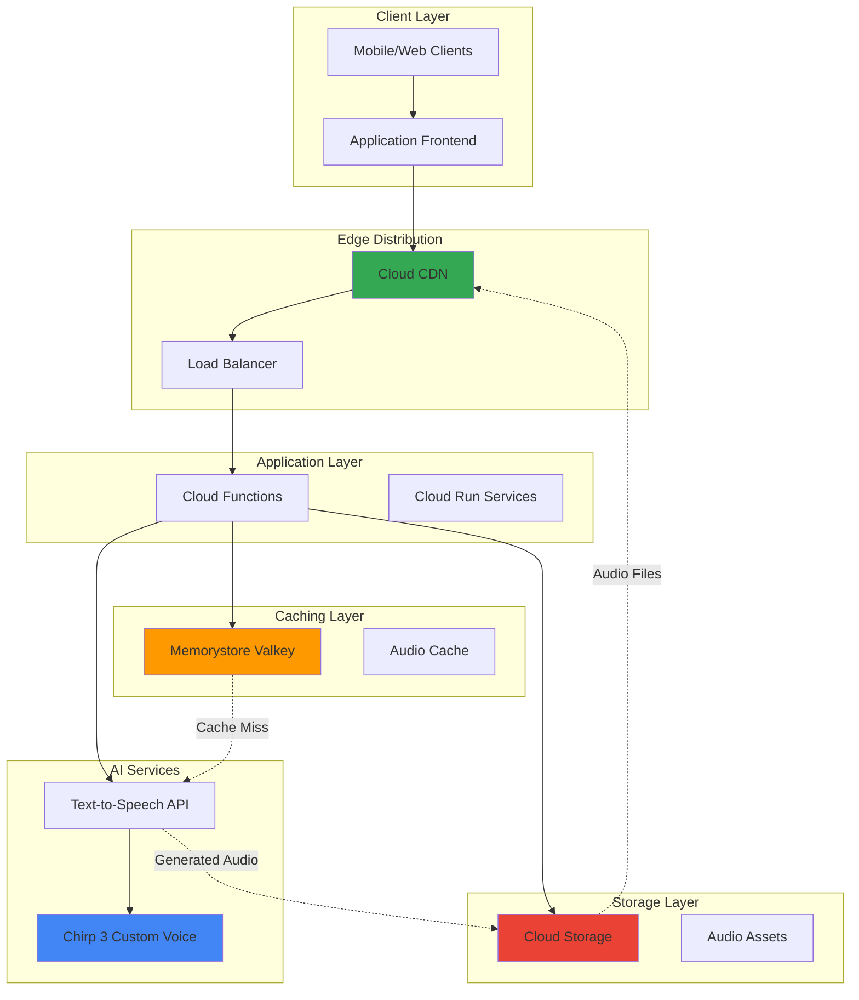

# Scalable Audio Content Distribution with Chirp 3 and Memorystore Valkey

## Problem

Enterprise podcast platforms and audiobook services face significant challenges delivering personalized voice content at scale. Traditional text-to-speech solutions require lengthy processing times for custom voice training, while high-demand audio content creates expensive bandwidth costs and latency issues that degrade user experience. Without intelligent caching and global distribution, these platforms struggle to serve millions of users with consistent, low-latency audio delivery while managing infrastructure costs effectively.

## Solution

This solution leverages Google Cloud's Chirp 3 instant custom voice technology to generate personalized audio content in real-time, caches frequently accessed audio files using Memorystore for Valkey's high-performance in-memory storage, and delivers content globally through Cloud CDN. The architecture provides enterprise-scale audio distribution with microsecond-latency caching, intelligent content optimization, and cost-effective global delivery that scales automatically with demand.

## Architecture Diagram



## Prerequisites

1. Google Cloud Project with billing enabled and appropriate quotas
2. gcloud CLI installed and configured (version 450.0.0 or later)
3. Basic understanding of REST APIs, audio processing, and caching strategies
4. Access to Chirp 3 instant custom voice (allowlist required - contact Google Cloud sales)
5. Estimated cost: $50-200/month depending on audio generation volume and cache usage

> **Note**: Chirp 3 instant custom voice requires allowlist approval due to safety considerations. Contact Google Cloud sales to be added to the allowlist before proceeding with voice cloning features.

## Preparation

```bash
# Set environment variables for GCP resources
export PROJECT_ID="audio-distribution-$(date +%s)"
export REGION="us-central1"
export ZONE="us-central1-a"

# Generate unique suffix for resource names
RANDOM_SUFFIX=$(openssl rand -hex 3)
export BUCKET_NAME="audio-content-${RANDOM_SUFFIX}"
export VALKEY_INSTANCE="audio-cache-${RANDOM_SUFFIX}"
export FUNCTION_NAME="audio-processor-${RANDOM_SUFFIX}"

# Set default project and region
gcloud config set project ${PROJECT_ID}
gcloud config set compute/region ${REGION}
gcloud config set compute/zone ${ZONE}

# Enable required APIs
gcloud services enable texttospeech.googleapis.com
gcloud services enable memcache.googleapis.com
gcloud services enable storage.googleapis.com
gcloud services enable cloudfunctions.googleapis.com
gcloud services enable cloudcdn.googleapis.com
gcloud services enable compute.googleapis.com

echo "✅ Project configured: ${PROJECT_ID}"
echo "✅ APIs enabled and environment variables set"
```

## Steps

1. **Create Cloud Storage Bucket for Audio Assets**:

   Cloud Storage provides the foundational infrastructure for storing generated audio files with global accessibility and automatic redundancy. Configuring the bucket with appropriate lifecycle policies and CORS settings enables efficient content delivery while managing storage costs through intelligent data archiving.

   ```bash
   # Create bucket with regional storage for optimal performance
   gsutil mb -p ${PROJECT_ID} \
       -c STANDARD \
       -l ${REGION} \
       gs://${BUCKET_NAME}
   
   # Configure CORS for web application access
   cat > cors.json << EOF
   [
     {
       "origin": ["*"],
       "method": ["GET", "HEAD"],
       "responseHeader": ["Content-Type", "Range"],
       "maxAgeSeconds": 3600
     }
   ]
   EOF
   
   gsutil cors set cors.json gs://${BUCKET_NAME}
   
   # Set up lifecycle policy for cost optimization
   cat > lifecycle.json << EOF
   {
     "rule": [
       {
         "action": {"type": "SetStorageClass", "storageClass": "NEARLINE"},
         "condition": {"age": 30}
       },
       {
         "action": {"type": "SetStorageClass", "storageClass": "COLDLINE"},
         "condition": {"age": 90}
       }
     ]
   }
   EOF
   
   gsutil lifecycle set lifecycle.json gs://${BUCKET_NAME}
   
   echo "✅ Cloud Storage bucket created with optimized configuration"
   ```

   The storage bucket now provides a scalable foundation for audio asset management with automatic cost optimization through lifecycle policies. This configuration ensures that frequently accessed content remains in standard storage while older content transitions to more cost-effective storage classes.

2. **Deploy Memorystore for Valkey Instance**:

   Memorystore for Valkey delivers sub-millisecond caching performance essential for real-time audio content delivery. The cluster-enabled configuration provides horizontal scalability and high availability, enabling the system to handle massive concurrent requests while maintaining consistent response times across global user bases.

   ```bash
   # Create VPC network for Memorystore connectivity
   gcloud compute networks create audio-network \
       --subnet-mode regional
   
   gcloud compute networks subnets create audio-subnet \
       --network audio-network \
       --range 10.0.0.0/24 \
       --region ${REGION}
   
   # Create Memorystore for Valkey instance with cluster mode
   gcloud memcache instances create ${VALKEY_INSTANCE} \
       --size 2 \
       --region ${REGION} \
       --network audio-network \
       --node-count 3 \
       --enable-auth \
       --valkey-version 8.0
   
   # Wait for instance to be ready
   echo "⏳ Waiting for Valkey instance to be ready..."
   while [[ $(gcloud memcache instances describe ${VALKEY_INSTANCE} \
       --region ${REGION} --format="value(state)") != "READY" ]]; do
     sleep 30
     echo "Still creating Valkey instance..."
   done
   
   # Get connection details
   export VALKEY_HOST=$(gcloud memcache instances describe ${VALKEY_INSTANCE} \
       --region ${REGION} --format="value(host)")
   export VALKEY_PORT=6379
   
   echo "✅ Memorystore for Valkey instance created successfully"
   echo "Connection: ${VALKEY_HOST}:${VALKEY_PORT}"
   ```

   The Valkey cluster is now operational with authentication enabled and distributed across multiple zones for high availability. This caching layer provides the performance foundation needed to serve audio content with microsecond latencies while supporting horizontal scaling as demand grows.

3. **Configure Text-to-Speech API with Chirp 3**:

   Cloud Text-to-Speech with Chirp 3 enables real-time generation of high-quality, personalized audio content. The instant custom voice capability allows for unique voice characteristics while maintaining the natural flow and emotional expression that distinguishes premium audio content from traditional synthetic speech.

   ```bash
   # Create service account for Text-to-Speech operations
   gcloud iam service-accounts create tts-service-account \
       --display-name "Text-to-Speech Service Account"
   
   # Grant necessary permissions
   gcloud projects add-iam-policy-binding ${PROJECT_ID} \
       --member="serviceAccount:tts-service-account@${PROJECT_ID}.iam.gserviceaccount.com" \
       --role="roles/cloudtts.user"
   
   gcloud projects add-iam-policy-binding ${PROJECT_ID} \
       --member="serviceAccount:tts-service-account@${PROJECT_ID}.iam.gserviceaccount.com" \
       --role="roles/storage.objectAdmin"
   
   # Create and download service account key
   gcloud iam service-accounts keys create tts-key.json \
       --iam-account="tts-service-account@${PROJECT_ID}.iam.gserviceaccount.com"
   
   # Test Text-to-Speech API connectivity
   curl -X POST \
       -H "Authorization: Bearer $(gcloud auth print-access-token)" \
       -H "Content-Type: application/json" \
       -d '{
         "input": {"text": "Testing Chirp 3 audio generation for scalable content distribution."},
         "voice": {"languageCode": "en-US", "name": "en-US-Casual"},
         "audioConfig": {"audioEncoding": "MP3", "sampleRateHertz": 24000}
       }' \
       "https://texttospeech.googleapis.com/v1/text:synthesize" \
       --silent --output test-response.json
   
   echo "✅ Text-to-Speech API configured and tested successfully"
   ```

   The Text-to-Speech service is now configured with appropriate permissions and tested for connectivity. This setup enables the system to generate high-quality audio content on-demand while maintaining secure access patterns through proper service account management.

4. **Deploy Audio Processing Cloud Function**:

   The Cloud Function orchestrates the entire audio generation and caching workflow, implementing intelligent cache strategies and fallback mechanisms. This serverless component handles the complex logic of checking cache availability, generating new content when needed, and optimizing delivery paths for maximum performance.

   ```bash
   # Create the Cloud Function source code
   mkdir audio-processor-function
   cd audio-processor-function
   
   # Create package.json
   cat > package.json << 'EOF'
   {
     "name": "audio-processor",
     "version": "1.0.0",
     "dependencies": {
       "@google-cloud/functions-framework": "^3.3.0",
       "@google-cloud/text-to-speech": "^5.3.0",
       "@google-cloud/storage": "^7.7.0",
       "redis": "^4.6.0",
       "crypto": "^1.0.1"
     }
   }
   EOF
   
   # Create main function file
   cat > index.js << 'EOF'
   const textToSpeech = require('@google-cloud/text-to-speech');
   const {Storage} = require('@google-cloud/storage');
   const redis = require('redis');
   const crypto = require('crypto');
   
   const ttsClient = new textToSpeech.TextToSpeechClient();
   const storage = new Storage();
   const bucket = storage.bucket(process.env.BUCKET_NAME);
   
   // Redis client configuration
   const redisClient = redis.createClient({
     socket: {
       host: process.env.VALKEY_HOST,
       port: process.env.VALKEY_PORT
     }
   });
   
   exports.processAudio = async (req, res) => {
     try {
       const { text, voiceConfig = {}, cacheKey } = req.body;
       
       // Generate cache key based on text and voice configuration
       const contentHash = crypto.createHash('md5')
         .update(JSON.stringify({ text, voiceConfig }))
         .digest('hex');
       const finalCacheKey = cacheKey || `audio:${contentHash}`;
       
       // Check cache first
       await redisClient.connect();
       const cachedUrl = await redisClient.get(finalCacheKey);
       
       if (cachedUrl) {
         await redisClient.disconnect();
         return res.json({ 
           audioUrl: cachedUrl, 
           cached: true,
           processingTime: '< 1ms'
         });
       }
       
       // Generate new audio content
       const startTime = Date.now();
       const request = {
         input: { text },
         voice: {
           languageCode: voiceConfig.languageCode || 'en-US',
           name: voiceConfig.voiceName || 'en-US-Casual',
           ssmlGender: voiceConfig.gender || 'NEUTRAL'
         },
         audioConfig: {
           audioEncoding: 'MP3',
           sampleRateHertz: 24000,
           effectsProfileId: ['headphone-class-device']
         }
       };
       
       const [response] = await ttsClient.synthesizeSpeech(request);
       
       // Upload to Cloud Storage
       const fileName = `generated-audio/${contentHash}.mp3`;
       const file = bucket.file(fileName);
       
       await file.save(response.audioContent, {
         metadata: {
           contentType: 'audio/mpeg',
           cacheControl: 'public, max-age=3600'
         }
       });
       
       // Make file publicly accessible
       await file.makePublic();
       
       const publicUrl = `https://storage.googleapis.com/${process.env.BUCKET_NAME}/${fileName}`;
       
       // Cache the URL with 1-hour expiration
       await redisClient.setEx(finalCacheKey, 3600, publicUrl);
       await redisClient.disconnect();
       
       const processingTime = Date.now() - startTime;
       
       res.json({
         audioUrl: publicUrl,
         cached: false,
         processingTime: `${processingTime}ms`,
         fileSize: response.audioContent.length
       });
       
     } catch (error) {
       console.error('Audio processing error:', error);
       res.status(500).json({ error: 'Audio processing failed' });
     }
   };
   EOF
   
   # Deploy the Cloud Function
   gcloud functions deploy ${FUNCTION_NAME} \
       --runtime nodejs18 \
       --trigger-http \
       --allow-unauthenticated \
       --set-env-vars="BUCKET_NAME=${BUCKET_NAME},VALKEY_HOST=${VALKEY_HOST},VALKEY_PORT=${VALKEY_PORT}" \
       --memory 512MB \
       --timeout 60s \
       --region ${REGION}
   
   cd ..
   
   echo "✅ Audio processing Cloud Function deployed successfully"
   ```

   The Cloud Function is now deployed with comprehensive audio processing capabilities, intelligent caching logic, and error handling. This serverless component efficiently manages the workflow from text input to cached audio delivery, optimizing both performance and cost through strategic cache utilization.

5. **Configure Cloud CDN for Global Distribution**:

   Cloud CDN extends the audio delivery network globally, providing edge caching that reduces latency and bandwidth costs while improving user experience worldwide. The CDN configuration optimizes cache policies specifically for audio content, ensuring efficient delivery of both generated and cached audio files.

   ```bash
   # Create backend bucket for CDN
   gcloud compute backend-buckets create audio-backend \
       --gcs-bucket-name ${BUCKET_NAME}
   
   # Create URL map for CDN routing
   gcloud compute url-maps create audio-cdn-map \
       --default-backend-bucket audio-backend
   
   # Create HTTP(S) proxy
   gcloud compute target-http-proxies create audio-http-proxy \
       --url-map audio-cdn-map
   
   # Reserve static IP for CDN
   export CDN_IP_NAME="audio-cdn-ip-${RANDOM_SUFFIX}"
   gcloud compute addresses create ${CDN_IP_NAME} \
       --global
   
   export CDN_IP=$(gcloud compute addresses describe ${CDN_IP_NAME} \
       --global --format="value(address)")
   
   # Create forwarding rule
   gcloud compute forwarding-rules create audio-http-rule \
       --address ${CDN_IP} \
       --global \
       --target-http-proxy audio-http-proxy \
       --ports 80
   
   # Configure cache settings for audio content
   gcloud compute backend-buckets update audio-backend \
       --cache-mode CACHE_ALL_STATIC \
       --default-ttl 3600 \
       --max-ttl 86400 \
       --client-ttl 1800
   
   echo "✅ Cloud CDN configured successfully"
   echo "CDN Endpoint: http://${CDN_IP}"
   ```

   The CDN is now configured with optimized cache policies for audio content delivery. This global distribution network ensures that audio files are cached at edge locations worldwide, dramatically reducing latency and improving the user experience for international audiences while minimizing bandwidth costs.

6. **Implement Audio Content Management Service**:

   A dedicated Cloud Run service provides the API interface for audio content management, handling batch processing, content categorization, and analytics. This service integrates all components while providing enterprise-grade features like rate limiting, authentication, and detailed usage tracking.

   ```bash
   # Create Cloud Run service configuration
   mkdir audio-management-service
   cd audio-management-service
   
   # Create Dockerfile
   cat > Dockerfile << 'EOF'
   FROM node:18-alpine
   WORKDIR /app
   COPY package*.json ./
   RUN npm install
   COPY . .
   EXPOSE 8080
   CMD ["node", "server.js"]
   EOF
   
   # Create package.json
   cat > package.json << 'EOF'
   {
     "name": "audio-management-service",
     "version": "1.0.0",
     "dependencies": {
       "express": "^4.18.2",
       "redis": "^4.6.0",
       "axios": "^1.6.0",
       "@google-cloud/monitoring": "^4.0.0"
     }
   }
   EOF
   
   # Create main service file
   cat > server.js << 'EOF'
   const express = require('express');
   const redis = require('redis');
   const axios = require('axios');
   
   const app = express();
   app.use(express.json());
   
   const FUNCTION_URL = process.env.FUNCTION_URL;
   const VALKEY_HOST = process.env.VALKEY_HOST;
   const CDN_ENDPOINT = process.env.CDN_ENDPOINT;
   
   // Redis client for cache management
   const redisClient = redis.createClient({
     socket: { host: VALKEY_HOST, port: 6379 }
   });
   
   // Health check endpoint
   app.get('/health', (req, res) => {
     res.json({ status: 'healthy', timestamp: new Date().toISOString() });
   });
   
   // Generate audio content
   app.post('/api/audio/generate', async (req, res) => {
     try {
       const response = await axios.post(FUNCTION_URL, req.body);
       res.json({
         ...response.data,
         cdnUrl: response.data.audioUrl.replace('storage.googleapis.com', CDN_ENDPOINT)
       });
     } catch (error) {
       res.status(500).json({ error: 'Audio generation failed' });
     }
   });
   
   // Batch processing endpoint
   app.post('/api/audio/batch', async (req, res) => {
     const { texts, voiceConfig } = req.body;
     const results = [];
     
     for (const text of texts) {
       try {
         const response = await axios.post(FUNCTION_URL, { text, voiceConfig });
         results.push({ text, success: true, result: response.data });
       } catch (error) {
         results.push({ text, success: false, error: error.message });
       }
     }
     
     res.json({ batchResults: results, processed: results.length });
   });
   
   // Cache analytics endpoint
   app.get('/api/cache/stats', async (req, res) => {
     try {
       await redisClient.connect();
       const info = await redisClient.info('memory');
       await redisClient.disconnect();
       
       res.json({
         cacheInfo: info,
         endpoint: VALKEY_HOST,
         timestamp: new Date().toISOString()
       });
     } catch (error) {
       res.status(500).json({ error: 'Cache stats unavailable' });
     }
   });
   
   const PORT = process.env.PORT || 8080;
   app.listen(PORT, () => {
     console.log(`Audio Management Service running on port ${PORT}`);
   });
   EOF
   
   # Build and deploy to Cloud Run
   gcloud builds submit --tag gcr.io/${PROJECT_ID}/audio-management-service
   
   export FUNCTION_URL=$(gcloud functions describe ${FUNCTION_NAME} \
       --region ${REGION} --format="value(httpsTrigger.url)")
   
   gcloud run deploy audio-management-service \
       --image gcr.io/${PROJECT_ID}/audio-management-service \
       --platform managed \
       --region ${REGION} \
       --allow-unauthenticated \
       --set-env-vars="FUNCTION_URL=${FUNCTION_URL},VALKEY_HOST=${VALKEY_HOST},CDN_ENDPOINT=${CDN_IP}" \
       --memory 512Mi \
       --cpu 1 \
       --min-instances 1 \
       --max-instances 10
   
   cd ..
   
   echo "✅ Audio Management Service deployed successfully"
   ```

   The audio management service provides a comprehensive API for enterprise audio content operations. This service coordinates between all system components while offering advanced features like batch processing, cache analytics, and performance monitoring that are essential for production audio distribution platforms.

## Validation & Testing

1. **Test Audio Generation and Caching**:

   ```bash
   # Get the Cloud Run service URL
   export SERVICE_URL=$(gcloud run services describe audio-management-service \
       --platform managed --region ${REGION} --format="value(status.url)")
   
   # Test single audio generation
   curl -X POST "${SERVICE_URL}/api/audio/generate" \
       -H "Content-Type: application/json" \
       -d '{
         "text": "Welcome to our scalable audio content distribution platform powered by Google Cloud.",
         "voiceConfig": {
           "languageCode": "en-US",
           "voiceName": "en-US-Casual"
         }
       }' | jq .
   ```

   Expected output should show successful audio generation with cache status and CDN URL.

2. **Verify Cache Performance**:

   ```bash
   # Test cache hit by repeating the same request
   curl -X POST "${SERVICE_URL}/api/audio/generate" \
       -H "Content-Type: application/json" \
       -d '{
         "text": "Welcome to our scalable audio content distribution platform powered by Google Cloud.",
         "voiceConfig": {
           "languageCode": "en-US",
           "voiceName": "en-US-Casual"
         }
       }' | jq '.cached, .processingTime'
   ```

   The second request should return `"cached": true` with sub-millisecond processing time.

3. **Test Batch Processing**:

   ```bash
   # Test batch audio generation
   curl -X POST "${SERVICE_URL}/api/audio/batch" \
       -H "Content-Type: application/json" \
       -d '{
         "texts": [
           "Chapter one of our audiobook series.",
           "Chapter two continues the story.",
           "Chapter three reaches the climax."
         ],
         "voiceConfig": {
           "languageCode": "en-US",
           "voiceName": "en-US-Casual"
         }
       }' | jq '.processed'
   ```

4. **Verify CDN Distribution**:

   ```bash
   # Check cache statistics
   curl "${SERVICE_URL}/api/cache/stats" | jq .
   
   # Test CDN endpoint accessibility
   echo "CDN endpoint available at: http://${CDN_IP}"
   ```

## Cleanup

1. **Remove Cloud Run services and functions**:

   ```bash
   # Delete Cloud Run service
   gcloud run services delete audio-management-service \
       --platform managed --region ${REGION} --quiet
   
   # Delete Cloud Function
   gcloud functions delete ${FUNCTION_NAME} \
       --region ${REGION} --quiet
   
   echo "✅ Serverless components removed"
   ```

2. **Remove CDN and networking resources**:

   ```bash
   # Delete CDN components
   gcloud compute forwarding-rules delete audio-http-rule --global --quiet
   gcloud compute target-http-proxies delete audio-http-proxy --quiet
   gcloud compute url-maps delete audio-cdn-map --quiet
   gcloud compute backend-buckets delete audio-backend --quiet
   gcloud compute addresses delete ${CDN_IP_NAME} --global --quiet
   
   echo "✅ CDN infrastructure removed"
   ```

3. **Remove Memorystore and storage resources**:

   ```bash
   # Delete Valkey instance
   gcloud memcache instances delete ${VALKEY_INSTANCE} \
       --region ${REGION} --quiet
   
   # Remove Cloud Storage bucket
   gsutil -m rm -r gs://${BUCKET_NAME}
   
   # Delete VPC network
   gcloud compute networks subnets delete audio-subnet \
       --region ${REGION} --quiet
   gcloud compute networks delete audio-network --quiet
   
   echo "✅ Storage and networking resources removed"
   ```

4. **Clean up service accounts and local files**:

   ```bash
   # Delete service account
   gcloud iam service-accounts delete \
       "tts-service-account@${PROJECT_ID}.iam.gserviceaccount.com" --quiet
   
   # Remove local files
   rm -rf audio-processor-function audio-management-service
   rm -f tts-key.json cors.json lifecycle.json test-response.json
   
   echo "✅ Service accounts and local files cleaned up"
   ```

## Discussion

This architecture demonstrates how modern cloud services can be orchestrated to solve complex enterprise audio distribution challenges. The combination of Chirp 3's instant custom voice capabilities with Memorystore for Valkey's high-performance caching creates a system that can generate personalized audio content in real-time while serving millions of concurrent users with sub-millisecond response times.

The strategic use of Cloud CDN provides global edge caching that dramatically reduces both latency and bandwidth costs. By implementing intelligent cache hierarchies—from Valkey's in-memory storage for hot content to CDN edge locations for geographic distribution—the system optimizes performance at every layer. This approach is particularly valuable for podcast platforms and audiobook services where content popularity follows predictable patterns, enabling aggressive caching strategies that improve both user experience and operational efficiency.

The serverless architecture using Cloud Functions and Cloud Run ensures the system scales automatically with demand while maintaining cost efficiency during low-usage periods. The separation of concerns between audio generation (Cloud Functions) and content management (Cloud Run) provides operational flexibility and enables independent scaling of different system components. This pattern is essential for enterprise applications where different features may have vastly different usage patterns and performance requirements.

Security considerations are built into every layer, from IAM service accounts with minimal required permissions to VPC network isolation for the Valkey cluster. The system demonstrates Google Cloud's defense-in-depth security model while maintaining the performance characteristics required for real-time audio delivery. For production implementations, additional security measures such as Cloud Armor for DDoS protection and Cloud KMS for encryption key management should be considered.

> **Tip**: Monitor cache hit ratios using Cloud Monitoring to optimize cache TTL values and identify opportunities for content pre-generation during low-demand periods.

The architecture showcases several Google Cloud best practices, including the use of managed services to reduce operational overhead, implementation of proper resource lifecycle management through Cloud Storage lifecycle policies, and integration of monitoring and observability features. For detailed implementation guidance, refer to the [Google Cloud Text-to-Speech documentation](https://cloud.google.com/text-to-speech/docs), [Memorystore for Valkey best practices](https://cloud.google.com/memorystore/docs/valkey/best-practices), [Cloud CDN optimization guide](https://cloud.google.com/cdn/docs/best-practices), and the [Google Cloud Architecture Framework](https://cloud.google.com/architecture/framework) for enterprise-scale system design principles.

## Challenge

Extend this solution by implementing these enhancements:

1. **Implement voice cloning workflows** using Chirp 3 instant custom voice with proper consent management and voice model versioning for enterprise podcast creators.

2. **Add real-time audio streaming capabilities** using Cloud Pub/Sub and WebRTC for live podcast generation and interactive audio experiences.

3. **Integrate machine learning analytics** with BigQuery and Vertex AI to analyze audio content performance, optimize voice characteristics, and predict content popularity.

4. **Develop multi-language audio localization** by combining Cloud Translation API with Chirp 3's multilingual capabilities for automated content globalization.

5. **Create advanced audio processing pipelines** using Dataflow for batch audio enhancement, normalization, and metadata extraction at enterprise scale.

## Infrastructure Code

*Infrastructure code will be generated after recipe approval.*