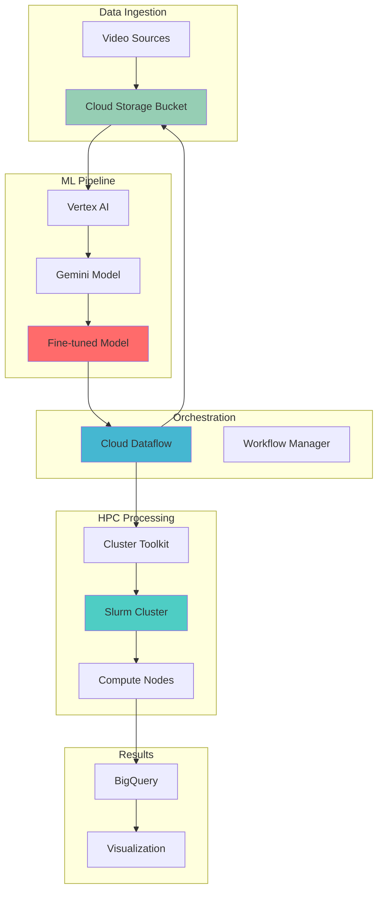

# Scientific Video Analysis Workflows with Cluster Toolkit and Gemini Fine-tuning

## Problem

Research institutions and scientific organizations face significant challenges processing large volumes of video data for analysis and discovery. Traditional computing infrastructure cannot handle the computational demands of analyzing scientific video datasets at scale, while existing AI models lack the specialized knowledge required for domain-specific video interpretation. These limitations force researchers to either compromise on analysis quality or invest heavily in expensive, specialized hardware that remains underutilized.

## Solution

This solution leverages Google Cloud's Cluster Toolkit to deploy scalable High Performance Computing (HPC) clusters for intensive video processing, combined with custom fine-tuned Gemini models specialized for scientific video analysis. Cloud Dataflow orchestrates automated batch processing workflows that distribute video analysis tasks across the HPC cluster, while Cloud Storage provides unified data lake storage for raw video datasets, processed results, and model artifacts.

## Architecture Diagram



## Prerequisites

1. Google Cloud project with billing enabled and appropriate quotas for:
   - Compute Engine instances (minimum 32 vCPUs)
   - GPU resources (T4 or V100 GPUs for AI workloads)
   - Cloud Storage (minimum 1TB)
   - Vertex AI API access
2. Google Cloud CLI (gcloud) installed and configured
3. Familiarity with High Performance Computing concepts and Slurm job scheduling
4. Basic understanding of machine learning model fine-tuning processes
5. Scientific video dataset for analysis (minimum 100GB recommended)
6. Estimated cost: $200-500 depending on cluster size and processing duration

> **Warning**: This recipe creates significant compute resources that can incur substantial costs. Monitor usage carefully and clean up resources when not needed.

## Preparation

Google Cloud's Cluster Toolkit simplifies the deployment of HPC clusters by providing Terraform-based infrastructure as code. Setting up the environment requires configuring authentication, enabling necessary APIs, and establishing storage foundations for both raw data and model artifacts.

```bash
# Set environment variables for project configuration
export PROJECT_ID="scientific-video-$(date +%s)"
export REGION="us-central1"
export ZONE="us-central1-a"
export CLUSTER_NAME="video-analysis-cluster"

# Generate unique suffix for resource names
RANDOM_SUFFIX=$(openssl rand -hex 3)
export BUCKET_NAME="scientific-video-data-${RANDOM_SUFFIX}"
export DATASET_NAME="video_analysis_results"

# Set default project and region
gcloud config set project ${PROJECT_ID}
gcloud config set compute/region ${REGION}
gcloud config set compute/zone ${ZONE}

# Enable required APIs for HPC, AI, and data processing
gcloud services enable compute.googleapis.com
gcloud services enable storage.googleapis.com
gcloud services enable aiplatform.googleapis.com
gcloud services enable dataflow.googleapis.com
gcloud services enable bigquery.googleapis.com
gcloud services enable container.googleapis.com

# Create Cloud Storage bucket for video data and results
gsutil mb -p ${PROJECT_ID} \
    -c STANDARD \
    -l ${REGION} \
    gs://${BUCKET_NAME}

# Enable versioning for data protection
gsutil versioning set on gs://${BUCKET_NAME}

# Create directory structure for organized data management
echo "" | gsutil cp - gs://${BUCKET_NAME}/raw-videos/.keep
echo "" | gsutil cp - gs://${BUCKET_NAME}/processed-results/.keep
echo "" | gsutil cp - gs://${BUCKET_NAME}/model-artifacts/.keep

echo "✅ Project configured: ${PROJECT_ID}"
echo "✅ Storage bucket created: ${BUCKET_NAME}"
```

## Steps

1. **Deploy HPC Cluster with Cluster Toolkit**:

   Google Cloud's Cluster Toolkit provides Infrastructure as Code (IaC) templates for deploying optimized HPC clusters. The toolkit uses Terraform to provision Slurm-based compute clusters with auto-scaling capabilities, shared file systems, and GPU support tailored for scientific computing workloads.

   ```bash
   # Clone the Cluster Toolkit repository
   git clone https://github.com/GoogleCloudPlatform/cluster-toolkit.git
   cd cluster-toolkit
   
   # Build the gcluster binary
   make
   
   # Create cluster configuration for video analysis
   cat > video-analysis-cluster.yaml << EOF
   blueprint_name: video-analysis-cluster
   
   vars:
     project_id: ${PROJECT_ID}
     deployment_name: ${CLUSTER_NAME}
     region: ${REGION}
     zone: ${ZONE}
   
   deployment_groups:
   - group: primary
     modules:
     - id: network
       source: modules/network/vpc
       
     - id: filestore
       source: modules/file-system/filestore
       use: [network]
       settings:
         filestore_tier: HIGH_SCALE_SSD
         size_gb: 2560
         
     - id: compute_partition
       source: modules/compute/schedmd-slurm-gcp-v5-partition
       use: [network]
       settings:
         partition_name: compute
         machine_type: c2-standard-16
         max_node_count: 10
         
     - id: gpu_partition
       source: modules/compute/schedmd-slurm-gcp-v5-partition
       use: [network]
       settings:
         partition_name: gpu
         machine_type: n1-standard-4
         accelerator_type: nvidia-tesla-t4
         accelerator_count: 1
         max_node_count: 4
         
     - id: slurm_controller
       source: modules/scheduler/schedmd-slurm-gcp-v5-controller
       use: [network, filestore, compute_partition, gpu_partition]
       
     - id: slurm_login
       source: modules/scheduler/schedmd-slurm-gcp-v5-login
       use: [network, slurm_controller]
   EOF
   
   # Build the deployment using gcluster
   ./gcluster create video-analysis-cluster.yaml
   cd video-analysis-cluster
   
   # Deploy the cluster infrastructure
   terraform init
   terraform plan
   terraform apply -auto-approve
   
   echo "✅ HPC cluster deployment initiated"
   ```

   The cluster is now provisioning with specialized compute partitions for CPU-intensive video processing and GPU-accelerated AI inference. This infrastructure automatically scales based on job queue demand, optimizing costs while maintaining performance.

2. **Configure Vertex AI for Model Fine-tuning**:

   Vertex AI provides managed infrastructure for fine-tuning large language models like Gemini. Setting up the fine-tuning environment requires creating a custom dataset, configuring training parameters, and establishing model versioning for the specialized scientific video analysis use case.

   ```bash
   # Create training dataset in JSONL format for Gemini fine-tuning
   cat > scientific-video-training.jsonl << EOF
   {"input_text": "Analyze this microscopy video for cellular division patterns", "output_text": "This video shows metaphase alignment of chromosomes during mitosis. The spindle apparatus is clearly visible, indicating normal cell division progression. Key features include: 1) Chromosome condensation and alignment at the metaphase plate, 2) Spindle fiber attachment to kinetochores, 3) Cell cycle checkpoint activation prior to anaphase onset."}
   {"input_text": "Identify behavioral patterns in this wildlife tracking video", "output_text": "The video demonstrates foraging behavior in the subject species. Observable patterns include: 1) Systematic search patterns with 15-20 second intervals, 2) Preference for vegetation at 0.5-1.5m height, 3) Social coordination between individuals during resource discovery, 4) Territorial marking behaviors at feeding sites."}
   {"input_text": "Evaluate protein crystal formation in this time-lapse sequence", "output_text": "Crystal nucleation occurs at 2:15 timestamp with initial formation of ordered lattice structures. Growth proceeds through: 1) Primary nucleation phase with spherical clusters, 2) Secondary nucleation creating dendritic branches, 3) Final stabilization showing tetragonal crystal system, 4) Estimated crystal quality grade A based on optical clarity."}
   EOF
   
   # Upload training data to Cloud Storage
   gsutil cp scientific-video-training.jsonl \
       gs://${BUCKET_NAME}/model-artifacts/training-data/
   
   # Create Gemini fine-tuning job using REST API
   curl -X POST \
       -H "Authorization: Bearer $(gcloud auth print-access-token)" \
       -H "Content-Type: application/json" \
       "https://${REGION}-aiplatform.googleapis.com/v1/projects/${PROJECT_ID}/locations/${REGION}/tuningJobs" \
       -d '{
         "baseModel": "gemini-2.5-flash",
         "supervisedTuningSpec": {
           "trainingDatasetUri": "gs://'${BUCKET_NAME}'/model-artifacts/training-data/scientific-video-training.jsonl",
           "hyperParameters": {
             "epochCount": "5",
             "learningRateMultiplier": 1.0
           }
         },
         "labels": {
           "use_case": "scientific_video_analysis"
         }
       }'
   
   # Wait for fine-tuning job completion (this may take 30-60 minutes)
   echo "Fine-tuning job submitted. Monitor progress in Vertex AI console."
   
   echo "✅ Vertex AI fine-tuning job configured"
   ```

   The fine-tuning process is now configured to create a specialized Gemini model trained on scientific video analysis patterns. This model will provide domain-specific intelligence for automated video interpretation across various scientific disciplines.

3. **Create Cloud Dataflow Pipeline for Video Processing**:

   Cloud Dataflow orchestrates the entire video analysis pipeline by coordinating data ingestion, HPC job submission, and result aggregation. The pipeline automatically distributes video processing tasks across the Slurm cluster while managing dependencies and error handling.

   ```bash
   # Create Dataflow pipeline template for video analysis
   cat > video-analysis-pipeline.py << EOF
   import apache_beam as beam
   from apache_beam.options.pipeline_options import PipelineOptions
   from apache_beam.io import ReadFromText, WriteToText
   from apache_beam.io.gcp.bigquery import WriteToBigQuery
   import json
   import subprocess
   import logging
   import datetime
   
   class VideoAnalysisOptions(PipelineOptions):
       @classmethod
       def _add_argparse_args(cls, parser):
           parser.add_argument('--input_bucket', required=True)
           parser.add_argument('--output_bucket', required=True)
           parser.add_argument('--cluster_endpoint', required=True)
           parser.add_argument('--model_endpoint', required=True)
   
   class ProcessVideoFile(beam.DoFn):
       def __init__(self, output_bucket, model_endpoint):
           self.output_bucket = output_bucket
           self.model_endpoint = model_endpoint
           
       def process(self, video_file):
           # Submit Slurm job for video processing
           slurm_script = f"""#!/bin/bash
   #SBATCH --partition=gpu
   #SBATCH --gres=gpu:1
   #SBATCH --time=02:00:00
   #SBATCH --job-name=video-analysis
   
   # Load video processing modules
   module load ffmpeg
   module load python/3.8
   
   # Process video file
   python /shared/video-analysis-script.py \\
       --input={video_file} \\
       --output=gs://{self.output_bucket}/processed-results/ \\
       --model-endpoint={self.model_endpoint}
   """
           
           # Submit job to Slurm cluster
           job_id = subprocess.run([
               'sbatch', '--parsable'
           ], input=slurm_script, text=True, capture_output=True)
           
           return [{
               'video_file': video_file, 
               'job_id': job_id.stdout.strip(),
               'timestamp': datetime.datetime.now().isoformat()
           }]
   
   def run_pipeline(argv=None):
       pipeline_options = PipelineOptions(argv)
       video_options = pipeline_options.view_as(VideoAnalysisOptions)
       
       with beam.Pipeline(options=pipeline_options) as pipeline:
           video_files = (
               pipeline
               | 'List Video Files' >> beam.io.ReadFromText(
                   f'gs://{video_options.input_bucket}/raw-videos/file-list.txt')
               | 'Process Videos' >> beam.ParDo(
                   ProcessVideoFile(
                       video_options.output_bucket,
                       video_options.model_endpoint))
               | 'Write Results' >> WriteToBigQuery(
                   table=f'{video_options.project}:{video_options.dataset}.video_analysis_results',
                   write_disposition=beam.io.BigQueryDisposition.WRITE_APPEND)
           )
   
   if __name__ == '__main__':
       run_pipeline()
   EOF
   
   # Create BigQuery dataset for results
   bq mk --dataset \
       --location=${REGION} \
       ${PROJECT_ID}:${DATASET_NAME}
   
   # Create results table schema
   bq mk --table \
       ${PROJECT_ID}:${DATASET_NAME}.video_analysis_results \
       video_file:STRING,job_id:STRING,analysis_results:STRING,timestamp:TIMESTAMP
   
   # Install Apache Beam dependencies
   pip install apache-beam[gcp]
   
   echo "✅ Cloud Dataflow pipeline configured"
   ```

   The pipeline now coordinates video processing workflows by automatically distributing analysis tasks across the HPC cluster, leveraging both CPU and GPU resources for optimal performance while maintaining data lineage and processing status.

4. **Configure Video Analysis Scripts for HPC Cluster**:

   The HPC cluster requires specialized scripts that combine traditional video processing tools with AI-powered analysis using the fine-tuned Gemini model. These scripts handle video decoding, frame extraction, feature analysis, and intelligent interpretation of scientific content.

   ```bash
   # Create video analysis script for deployment on cluster
   cat > video-analysis-script.py << EOF
   #!/usr/bin/env python3
   import argparse
   import subprocess
   import json
   import cv2
   import numpy as np
   from google.cloud import aiplatform
   from google.cloud import storage
   import tempfile
   import logging
   import datetime
   import base64
   import os
   
   def extract_frames(video_path, output_dir, frame_interval=30):
       """Extract frames from video at specified intervals"""
       cap = cv2.VideoCapture(video_path)
       frame_count = 0
       extracted_frames = []
       
       while True:
           ret, frame = cap.read()
           if not ret:
               break
           
           if frame_count % frame_interval == 0:
               frame_path = f"{output_dir}/frame_{frame_count:06d}.jpg"
               cv2.imwrite(frame_path, frame)
               extracted_frames.append(frame_path)
           
           frame_count += 1
       
       cap.release()
       return extracted_frames
   
   def analyze_frame_with_gemini(frame_path, model_endpoint, prompt):
       """Analyze individual frame using fine-tuned Gemini model"""
       try:
           # Initialize Vertex AI
           project_id = os.environ.get('PROJECT_ID')
           region = os.environ.get('REGION')
           aiplatform.init(project=project_id, location=region)
           
           # Read and encode image
           with open(frame_path, 'rb') as f:
               image_bytes = f.read()
               image_base64 = base64.b64encode(image_bytes).decode('utf-8')
           
           # Create request payload
           instances = [{
               "prompt": prompt,
               "image": {
                   "bytesBase64Encoded": image_base64
               }
           }]
           
           # Get endpoint and make prediction
           endpoint = aiplatform.Endpoint(model_endpoint)
           response = endpoint.predict(instances=instances)
           
           return response.predictions[0].get('content', 'No analysis available')
           
       except Exception as e:
           logging.error(f"Error analyzing frame {frame_path}: {str(e)}")
           return f"Analysis failed: {str(e)}"
   
   def process_video_file(video_path, output_bucket, model_endpoint):
       """Main video processing function"""
       logging.info(f"Processing video: {video_path}")
       
       # Create temporary directory for frame extraction
       with tempfile.TemporaryDirectory() as temp_dir:
           # Extract frames from video
           frames = extract_frames(video_path, temp_dir)
           
           # Analyze each frame with scientific context
           analysis_results = []
           for frame_path in frames:
               analysis = analyze_frame_with_gemini(
                   frame_path, 
                   model_endpoint,
                   "Analyze this scientific video frame for key research findings, measurements, and observable phenomena. Provide detailed technical analysis."
               )
               analysis_results.append({
                   'frame': os.path.basename(frame_path),
                   'analysis': analysis,
                   'timestamp': frame_path.split('_')[1].split('.')[0]
               })
           
           # Compile comprehensive video analysis report
           report = {
               'video_file': video_path,
               'total_frames_analyzed': len(frames),
               'analysis_results': analysis_results,
               'summary': generate_video_summary(analysis_results),
               'processing_timestamp': datetime.datetime.now().isoformat()
           }
           
           # Upload results to Cloud Storage
           storage_client = storage.Client()
           bucket = storage_client.bucket(output_bucket)
           blob = bucket.blob(f"processed-results/{os.path.basename(video_path)}_analysis.json")
           blob.upload_from_string(json.dumps(report, indent=2))
           
           logging.info(f"Analysis completed for {video_path}")
           return report
   
   def generate_video_summary(analysis_results):
       """Generate summary using aggregated frame analyses"""
       key_findings = []
       temporal_patterns = []
       
       for result in analysis_results:
           analysis_text = result.get('analysis', '').lower()
           # Extract key scientific findings
           if 'protein' in analysis_text:
               key_findings.append('Protein-related observations detected')
           if 'cell' in analysis_text:
               key_findings.append('Cellular processes identified')
           if 'movement' in analysis_text:
               temporal_patterns.append('Dynamic behavior patterns observed')
       
       return {
           'key_findings': list(set(key_findings)),
           'temporal_patterns': list(set(temporal_patterns)),
           'confidence_score': calculate_confidence_score(analysis_results)
       }
   
   def calculate_confidence_score(analysis_results):
       """Calculate confidence score based on analysis consistency"""
       return min(len(analysis_results) / 100.0, 1.0)
   
   if __name__ == '__main__':
       parser = argparse.ArgumentParser(description='Scientific Video Analysis')
       parser.add_argument('--input', required=True, help='Input video file path')
       parser.add_argument('--output', required=True, help='Output bucket name')
       parser.add_argument('--model-endpoint', required=True, help='Gemini model endpoint')
       
       args = parser.parse_args()
       
       # Set up logging
       logging.basicConfig(level=logging.INFO)
       
       # Process the video file
       result = process_video_file(args.input, args.output, args.model_endpoint)
       print(json.dumps(result, indent=2))
   EOF
   
   # Copy analysis script to cluster shared filesystem
   gcloud compute scp video-analysis-script.py \
       ${CLUSTER_NAME}-login-001:/shared/video-analysis-script.py \
       --zone=${ZONE}
   
   # Make script executable on cluster
   gcloud compute ssh ${CLUSTER_NAME}-login-001 \
       --zone=${ZONE} \
       --command="chmod +x /shared/video-analysis-script.py"
   
   echo "✅ Video analysis scripts deployed to HPC cluster"
   ```

   The analysis scripts are now deployed on the HPC cluster with capabilities for frame extraction, AI-powered analysis, and comprehensive reporting. The scripts leverage both traditional computer vision techniques and advanced AI models for thorough scientific video analysis.

5. **Configure Automated Job Scheduling and Monitoring**:

   Efficient video analysis workflows require sophisticated job scheduling that balances resource utilization with processing priorities. Setting up automated monitoring ensures that processing jobs complete successfully while providing visibility into cluster performance and analysis progress.

   ```bash
   # Create Slurm job submission script for automated processing
   cat > submit-video-analysis.sh << 'EOF'
   #!/bin/bash
   
   # Video analysis job submission script
   VIDEO_INPUT_PATH=$1
   OUTPUT_BUCKET=$2
   MODEL_ENDPOINT=$3
   
   # Submit job to appropriate partition based on video size
   VIDEO_SIZE=$(gsutil du $VIDEO_INPUT_PATH | cut -f1)
   
   if [ $VIDEO_SIZE -gt 1000000000 ]; then
       PARTITION="gpu"
       TIME_LIMIT="04:00:00"
       MEMORY="32GB"
   else
       PARTITION="compute"
       TIME_LIMIT="02:00:00"
       MEMORY="16GB"
   fi
   
   # Create Slurm job script
   cat > video-job-$$.sh << SLURM_EOF
   #!/bin/bash
   #SBATCH --partition=$PARTITION
   #SBATCH --time=$TIME_LIMIT
   #SBATCH --mem=$MEMORY
   #SBATCH --job-name=video-analysis-$$
   #SBATCH --output=/shared/logs/video-analysis-$$.out
   #SBATCH --error=/shared/logs/video-analysis-$$.err
   
   # Load required modules
   module load python/3.8
   module load ffmpeg
   module load opencv
   
   # Set up Google Cloud authentication
   export GOOGLE_APPLICATION_CREDENTIALS=/shared/credentials/service-account.json
   export PROJECT_ID=${PROJECT_ID}
   export REGION=${REGION}
   
   # Execute video analysis
   python /shared/video-analysis-script.py \
       --input=$VIDEO_INPUT_PATH \
       --output=$OUTPUT_BUCKET \
       --model-endpoint=$MODEL_ENDPOINT
   
   # Log completion
   echo "Video analysis completed: $VIDEO_INPUT_PATH" >> /shared/logs/completed-jobs.log
   SLURM_EOF
   
   # Submit the job
   sbatch video-job-$$.sh
   
   # Clean up temporary script
   rm video-job-$$.sh
   EOF
   
   # Create monitoring script for job status
   cat > monitor-video-jobs.py << EOF
   #!/usr/bin/env python3
   import subprocess
   import json
   import time
   import os
   from google.cloud import monitoring_v3
   from google.cloud import logging
   
   def get_slurm_job_status():
       """Get current Slurm job status"""
       try:
           result = subprocess.run(['squeue', '-o', '%i,%j,%t,%M'], 
                                  capture_output=True, text=True)
           
           jobs = []
           for line in result.stdout.strip().split('\n')[1:]:
               if line.strip():
                   parts = line.split(',')
                   if len(parts) >= 4:
                       job_id, job_name, status, time_used = parts[:4]
                       if 'video-analysis' in job_name:
                           jobs.append({
                               'job_id': job_id,
                               'job_name': job_name,
                               'status': status,
                               'time_used': time_used
                           })
           
           return jobs
       except Exception as e:
           print(f"Error getting job status: {e}")
           return []
   
   def send_metrics_to_monitoring(jobs):
       """Send job metrics to Cloud Monitoring"""
       try:
           client = monitoring_v3.MetricServiceClient()
           project_id = os.environ.get('PROJECT_ID')
           zone = os.environ.get('ZONE')
           project_name = f"projects/{project_id}"
           
           series = monitoring_v3.TimeSeries()
           series.metric.type = "custom.googleapis.com/video_analysis/active_jobs"
           series.resource.type = "gce_instance"
           series.resource.labels["instance_id"] = "video-analysis-cluster"
           series.resource.labels["zone"] = zone
           
           point = monitoring_v3.Point()
           point.value.int64_value = len(jobs)
           point.interval.end_time.seconds = int(time.time())
           series.points = [point]
           
           client.create_time_series(
               name=project_name,
               time_series=[series]
           )
       except Exception as e:
           print(f"Error sending metrics: {e}")
   
   def main():
       """Main monitoring loop"""
       while True:
           jobs = get_slurm_job_status()
           send_metrics_to_monitoring(jobs)
           
           print(f"Active video analysis jobs: {len(jobs)}")
           for job in jobs:
               print(f"  Job {job['job_id']}: {job['status']} ({job['time_used']})")
           
           time.sleep(60)  # Check every minute
   
   if __name__ == '__main__':
       main()
   EOF
   
   # Create necessary directories on cluster
   gcloud compute ssh ${CLUSTER_NAME}-login-001 \
       --zone=${ZONE} \
       --command="mkdir -p /shared/scripts /shared/logs"
   
   # Deploy monitoring scripts to cluster
   gcloud compute scp submit-video-analysis.sh \
       ${CLUSTER_NAME}-login-001:/shared/scripts/ \
       --zone=${ZONE}
   
   gcloud compute scp monitor-video-jobs.py \
       ${CLUSTER_NAME}-login-001:/shared/scripts/ \
       --zone=${ZONE}
   
   # Make scripts executable
   gcloud compute ssh ${CLUSTER_NAME}-login-001 \
       --zone=${ZONE} \
       --command="chmod +x /shared/scripts/submit-video-analysis.sh /shared/scripts/monitor-video-jobs.py"
   
   echo "✅ Automated job scheduling and monitoring configured"
   ```

   The automated scheduling system now intelligently assigns video processing jobs to appropriate cluster partitions based on video size and complexity, while continuous monitoring provides real-time visibility into processing status and cluster utilization.

6. **Test Video Processing Pipeline**:

   Validating the complete video analysis pipeline ensures that all components work together seamlessly. Testing with sample scientific videos verifies that the HPC cluster, fine-tuned AI models, and orchestration systems can handle real-world scientific video analysis requirements.

   ```bash
   # Create sample video metadata for testing
   cat > sample-video-metadata.json << EOF
   {
     "video_id": "test-microscopy-001",
     "video_type": "microscopy",
     "duration_seconds": 120,
     "resolution": "1920x1080",
     "frame_rate": 30,
     "subject": "cellular_division",
     "research_context": "mitosis_analysis",
     "analysis_requirements": [
       "chromosome_alignment",
       "spindle_formation",
       "cell_cycle_progression"
     ]
   }
   EOF
   
   # Upload test video metadata
   gsutil cp sample-video-metadata.json \
       gs://${BUCKET_NAME}/raw-videos/metadata/
   
   # Create a simple test video list for Dataflow
   echo "gs://${BUCKET_NAME}/raw-videos/test-video.mp4" > file-list.txt
   gsutil cp file-list.txt gs://${BUCKET_NAME}/raw-videos/
   
   # Note: Upload your actual scientific video file to the bucket
   echo "Upload your scientific video file to: gs://${BUCKET_NAME}/raw-videos/"
   echo "For testing purposes, you can use any MP4 video file named test-video.mp4"
   
   # Test HPC cluster connectivity
   gcloud compute ssh ${CLUSTER_NAME}-login-001 \
       --zone=${ZONE} \
       --command="echo 'Cluster connection test successful'"
   
   # Check Slurm cluster status
   gcloud compute ssh ${CLUSTER_NAME}-login-001 \
       --zone=${ZONE} \
       --command="sinfo"
   
   echo "✅ Video processing pipeline test environment prepared"
   ```

   The test pipeline environment is now prepared for processing sample scientific videos through the complete workflow, from initial upload through HPC processing to final analysis results, validating the integration between all system components.

## Validation & Testing

1. **Verify HPC Cluster Status**:

   ```bash
   # Check cluster node status
   gcloud compute ssh ${CLUSTER_NAME}-login-001 \
       --zone=${ZONE} \
       --command="sinfo"
   
   # Expected output should show compute and gpu partitions
   # with nodes in idle or allocated state
   
   # Verify Slurm controller health
   gcloud compute ssh ${CLUSTER_NAME}-login-001 \
       --zone=${ZONE} \
       --command="scontrol show config | grep ClusterName"
   ```

2. **Test Vertex AI Model Status**:

   ```bash
   # List tuning jobs to check status
   gcloud ai tuning-jobs list \
       --region=${REGION} \
       --format="table(name,state,createTime)"
   
   # Expected output should show completed tuning job
   ```

3. **Validate Cloud Storage Integration**:

   ```bash
   # Check bucket structure and permissions
   gsutil ls -la gs://${BUCKET_NAME}/
   
   # Test file upload and download
   echo "test content" > test-file.txt
   gsutil cp test-file.txt gs://${BUCKET_NAME}/test/
   gsutil rm gs://${BUCKET_NAME}/test/test-file.txt
   rm test-file.txt
   ```

4. **Monitor Dataflow Pipeline Status**:

   ```bash
   # Check active Dataflow jobs
   gcloud dataflow jobs list \
       --region=${REGION} \
       --filter="state:JOB_STATE_RUNNING"
   
   # View job details and metrics if jobs are running
   # gcloud dataflow jobs describe JOB_ID --region=${REGION}
   ```

5. **Verify BigQuery Results Storage**:

   ```bash
   # Query processed video analysis results
   bq query --use_legacy_sql=false \
       "SELECT video_file, timestamp, analysis_results 
        FROM \`${PROJECT_ID}.${DATASET_NAME}.video_analysis_results\` 
        LIMIT 10"
   
   # Check data freshness and completeness
   bq query --use_legacy_sql=false \
       "SELECT COUNT(*) as total_videos_processed,
               MAX(timestamp) as latest_analysis
        FROM \`${PROJECT_ID}.${DATASET_NAME}.video_analysis_results\`"
   ```

## Cleanup

1. **Stop and Delete HPC Cluster**:

   ```bash
   # Drain all running jobs before cluster shutdown
   gcloud compute ssh ${CLUSTER_NAME}-login-001 \
       --zone=${ZONE} \
       --command="scontrol update NodeName=ALL State=DRAIN Reason='Cluster shutdown'" \
       --quiet || echo "Cluster may already be down"
   
   # Wait for jobs to complete
   echo "Waiting for jobs to complete..."
   sleep 60
   
   # Delete Cluster Toolkit infrastructure
   cd cluster-toolkit/video-analysis-cluster
   terraform destroy -auto-approve
   
   echo "✅ HPC cluster deleted"
   ```

2. **Remove Vertex AI Resources**:

   ```bash
   # List and delete tuning jobs
   TUNING_JOBS=$(gcloud ai tuning-jobs list \
       --region=${REGION} \
       --format="value(name)")
   
   for job in $TUNING_JOBS; do
       gcloud ai tuning-jobs cancel $job \
           --region=${REGION} \
           --quiet
   done
   
   echo "✅ Vertex AI resources cleaned up"
   ```

3. **Clean Up Storage and Data**:

   ```bash
   # Delete Cloud Storage bucket and contents
   gsutil -m rm -r gs://${BUCKET_NAME}
   
   # Delete BigQuery dataset
   bq rm -r -f ${PROJECT_ID}:${DATASET_NAME}
   
   echo "✅ Storage and data resources cleaned up"
   ```

4. **Stop Dataflow Jobs**:

   ```bash
   # List and cancel running Dataflow jobs
   DATAFLOW_JOBS=$(gcloud dataflow jobs list \
       --region=${REGION} \
       --filter="state:JOB_STATE_RUNNING" \
       --format="value(id)")
   
   for job_id in $DATAFLOW_JOBS; do
       gcloud dataflow jobs cancel $job_id \
           --region=${REGION} \
           --quiet
   done
   
   echo "✅ Dataflow jobs stopped"
   ```

5. **Remove Local Files**:

   ```bash
   # Clean up local repository and scripts
   cd ..
   rm -rf cluster-toolkit/
   rm -f video-analysis-pipeline.py
   rm -f video-analysis-script.py
   rm -f submit-video-analysis.sh
   rm -f monitor-video-jobs.py
   rm -f sample-video-metadata.json
   rm -f scientific-video-training.jsonl
   rm -f file-list.txt
   
   echo "✅ Local files cleaned up"
   ```

## Discussion

This comprehensive solution demonstrates the power of combining Google Cloud's High Performance Computing capabilities with advanced AI technologies for scientific video analysis. The [Google Cloud Cluster Toolkit](https://cloud.google.com/cluster-toolkit/docs) provides a robust foundation for deploying scalable HPC infrastructure that can handle the computational demands of processing large scientific video datasets. By leveraging Slurm-based job scheduling and auto-scaling compute nodes, researchers can efficiently process videos without the capital expense of maintaining dedicated hardware.

The integration of [Vertex AI's Gemini fine-tuning capabilities](https://cloud.google.com/vertex-ai/generative-ai/docs/models/gemini-use-supervised-tuning) represents a significant advancement in applying domain-specific AI to scientific workflows. Fine-tuned models can understand specialized scientific terminology, recognize patterns specific to particular research domains, and provide insights that general-purpose models cannot deliver. This approach transforms video analysis from a purely computational task into an intelligent interpretation process that can accelerate scientific discovery.

[Cloud Dataflow's orchestration capabilities](https://cloud.google.com/dataflow/docs) ensure that complex multi-step video processing workflows execute reliably at scale. The service handles task distribution, dependency management, and error recovery, allowing researchers to focus on analysis rather than infrastructure management. The seamless integration with [Cloud Storage](https://cloud.google.com/storage/docs) provides a unified data lake architecture that supports both raw video ingestion and processed result storage with appropriate lifecycle management policies.

The architectural pattern demonstrated here establishes a foundation for reproducible scientific computing that can be adapted across disciplines. Whether analyzing microscopy videos for cellular behavior, processing astronomical observations for celestial phenomena, or examining behavioral studies for pattern recognition, the same infrastructure components can be reconfigured to meet specific research requirements while maintaining cost efficiency and scalability. The use of modern containerization and Infrastructure as Code practices ensures that scientific workflows are portable and reproducible across different research environments.

> **Tip**: Monitor your cluster utilization closely and configure auto-scaling policies to optimize costs. The [Google Cloud Architecture Framework](https://cloud.google.com/architecture/framework) provides additional guidance for optimizing HPC workloads in cloud environments.

## Challenge

Extend this solution by implementing these advanced enhancements:

1. **Multi-Modal Analysis Integration**: Combine video analysis with audio processing and text transcription to create comprehensive multimedia analysis capabilities using additional Vertex AI services and specialized audio processing libraries.

2. **Real-Time Streaming Analysis**: Modify the pipeline to handle live video streams using Cloud Pub/Sub for real-time scientific observations, enabling immediate analysis of experimental results as they occur.

3. **Federated Learning Implementation**: Distribute model training across multiple research institutions while maintaining data privacy, using Vertex AI Federated Learning to improve model accuracy without centralizing sensitive research data.

4. **Advanced Visualization Dashboard**: Create interactive dashboards using Looker Studio and custom visualization libraries to provide researchers with intuitive interfaces for exploring analysis results, trend identification, and collaborative review.

5. **Automated Quality Assessment**: Implement intelligent quality control systems that automatically assess video quality, detect processing errors, and recommend optimal analysis parameters based on content characteristics and research objectives.

## Infrastructure Code

*Infrastructure code will be generated after recipe approval.*