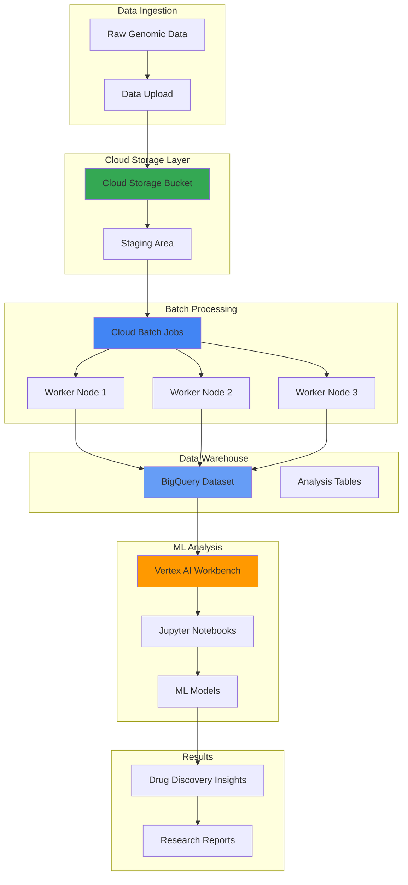

# Scientific Workflow Orchestration with Cloud Batch API and Vertex AI Workbench

## Problem

Pharmaceutical research teams struggle with processing large-scale genomic datasets that require complex computational biology workflows combined with AI-powered variant analysis. Traditional on-premises High Performance Computing (HPC) clusters lack the scalability and machine learning capabilities needed for modern drug discovery research, resulting in weeks-long processing times and limited insights from genomic data that could accelerate therapeutic breakthroughs.

## Solution

Build an intelligent scientific workflow orchestration system using Google Cloud Batch API for scalable genomic data processing pipelines and Vertex AI Workbench for interactive machine learning analysis. This cloud-native approach enables researchers to process terabytes of genomic data efficiently while applying advanced AI models for variant analysis and drug discovery insights, reducing processing time from weeks to hours.

## Architecture Diagram



## Prerequisites

1. Google Cloud account with billing enabled and appropriate IAM permissions for Batch, Vertex AI, BigQuery, and Cloud Storage
2. Google Cloud CLI installed and configured (or Cloud Shell access)
3. Basic understanding of genomics data formats (FASTQ, BAM, VCF), bioinformatics workflows, and machine learning concepts
4. Knowledge of Python, Jupyter notebooks, and containerized applications
5. Estimated cost: $150-300 for complete workflow execution (varies by data size and compute duration)

> **Note**: Cloud Life Sciences API was deprecated on July 17, 2023, and shut down on July 8, 2025. Google Cloud Batch API is the comprehensive successor supporting all genomics use cases.

## Preparation

```bash
# Set environment variables for GCP resources
export PROJECT_ID="genomics-workflow-$(date +%s)"
export REGION="us-central1"
export ZONE="us-central1-a"

# Generate unique suffix for resource names
RANDOM_SUFFIX=$(openssl rand -hex 3)
export BUCKET_NAME="genomics-data-${RANDOM_SUFFIX}"
export DATASET_NAME="genomics_analysis_${RANDOM_SUFFIX}"
export WORKBENCH_NAME="genomics-workbench-${RANDOM_SUFFIX}"

# Set default project and region
gcloud config set project ${PROJECT_ID}
gcloud config set compute/region ${REGION}
gcloud config set compute/zone ${ZONE}

# Enable required APIs
gcloud services enable batch.googleapis.com
gcloud services enable notebooks.googleapis.com
gcloud services enable bigquery.googleapis.com
gcloud services enable storage.googleapis.com
gcloud services enable aiplatform.googleapis.com

echo "✅ Project configured: ${PROJECT_ID}"
echo "✅ Bucket name: ${BUCKET_NAME}"
echo "✅ Dataset name: ${DATASET_NAME}"
```

## Steps

1. **Create Cloud Storage Infrastructure for Genomic Data**:

   Google Cloud Storage provides the foundational data lake for genomic research, offering global accessibility, strong consistency, and lifecycle management. Creating dedicated buckets with appropriate storage classes optimizes cost while ensuring data durability for long-term research projects that may span multiple years.

   ```bash
   # Create primary data bucket with regional storage
   gsutil mb -p ${PROJECT_ID} \
       -c STANDARD \
       -l ${REGION} \
       gs://${BUCKET_NAME}
   
   # Enable versioning for data protection
   gsutil versioning set on gs://${BUCKET_NAME}
   
   # Create directory structure for genomic workflow
   gsutil -m cp /dev/null gs://${BUCKET_NAME}/raw-data/.keep
   gsutil -m cp /dev/null gs://${BUCKET_NAME}/processed-data/.keep
   gsutil -m cp /dev/null gs://${BUCKET_NAME}/results/.keep
   gsutil -m cp /dev/null gs://${BUCKET_NAME}/scripts/.keep
   
   echo "✅ Cloud Storage infrastructure created: gs://${BUCKET_NAME}"
   ```

   The storage infrastructure now supports the entire genomic data lifecycle, from raw sequencing files through processed variants to final analysis results. This hierarchical organization follows genomics best practices and enables efficient data management throughout the research pipeline.

2. **Set up BigQuery Data Warehouse for Genomic Analytics**:

   BigQuery serves as the analytical engine for genomic data, providing serverless data warehousing with built-in machine learning capabilities. The columnar storage format and parallel processing architecture are particularly well-suited for genomic variant analysis and population-scale studies that require complex analytical queries across millions of genetic variants.

   ```bash
   # Create BigQuery dataset for genomic analysis
   bq mk --project_id=${PROJECT_ID} \
       --location=${REGION} \
       --description="Genomic analysis dataset for variant calling and ML" \
       ${DATASET_NAME}
   
   # Create table for storing variant call data
   bq mk --table \
       ${PROJECT_ID}:${DATASET_NAME}.variant_calls \
       chromosome:STRING,position:INTEGER,reference:STRING,alternate:STRING,quality:FLOAT,filter:STRING,info:STRING,sample_id:STRING,genotype:STRING,depth:INTEGER,allele_frequency:FLOAT
   
   # Create table for storing analysis results
   bq mk --table \
       ${PROJECT_ID}:${DATASET_NAME}.analysis_results \
       sample_id:STRING,variant_id:STRING,gene:STRING,effect:STRING,clinical_significance:STRING,drug_response:STRING,confidence_score:FLOAT,analysis_timestamp:TIMESTAMP
   
   echo "✅ BigQuery dataset and tables created: ${DATASET_NAME}"
   ```

   The BigQuery infrastructure now provides a scalable foundation for genomic data analysis, supporting both structured variant data and downstream machine learning workflows. This configuration enables researchers to perform complex queries across genomic datasets while maintaining HIPAA compliance and data governance requirements.

3. **Deploy Vertex AI Workbench for Interactive ML Development**:

   Vertex AI Workbench provides a managed Jupyter environment optimized for machine learning workflows in genomics research. The integration with Google Cloud services enables seamless access to genomic datasets stored in BigQuery and Cloud Storage while providing access to powerful ML frameworks and pre-trained models for variant interpretation and drug discovery applications.

   ```bash
   # Create Vertex AI Workbench instance using current gcloud command
   gcloud workbench instances create ${WORKBENCH_NAME} \
       --location=${ZONE} \
       --vm-image-project=cloud-notebooks-managed \
       --vm-image-family=workbench-instances \
       --machine-type=n1-standard-4 \
       --boot-disk-size=100GB \
       --boot-disk-type=pd-standard \
       --data-disk-size=200GB \
       --data-disk-type=pd-ssd \
       --install-gpu-driver \
       --metadata=bigquery-dataset=${DATASET_NAME},storage-bucket=${BUCKET_NAME}
   
   # Wait for instance to be ready
   gcloud workbench instances describe ${WORKBENCH_NAME} \
       --location=${ZONE} \
       --format="value(state)"
   
   echo "✅ Vertex AI Workbench instance created: ${WORKBENCH_NAME}"
   echo "Access via: https://console.cloud.google.com/vertex-ai/workbench/instances?project=${PROJECT_ID}"
   ```

   The Workbench environment now provides researchers with a collaborative platform for developing machine learning models that can interpret genomic variants, predict drug responses, and identify potential therapeutic targets. The GPU-enabled configuration supports deep learning models for complex genomic analysis tasks.

4. **Create Sample Genomic Data Processing Script**:

   This step establishes the computational pipeline that will be executed by Cloud Batch, demonstrating how genomic data flows from raw sequencing files through variant calling to structured data ready for machine learning analysis. The containerized approach ensures reproducibility and enables the pipeline to scale across multiple compute nodes.

   ```bash
   # Create genomic processing script
   cat > genomic_pipeline.py << 'EOF'
   #!/usr/bin/env python3
   import os
   import subprocess
   import pandas as pd
   from google.cloud import bigquery
   from google.cloud import storage
   import time
   
   def process_genomic_sample(sample_id, input_file, output_bucket):
       """Process genomic sample through variant calling pipeline"""
       print(f"Processing sample: {sample_id}")
       
       # Simulate variant calling pipeline steps
       # In real implementation, this would include:
       # 1. Quality control (FastQC)
       # 2. Alignment (BWA-MEM or similar)
       # 3. Variant calling (GATK HaplotypeCaller)
       # 4. Annotation (VEP or SnpEff)
       
       # Generate synthetic variant data for demonstration
       variants = []
       for chrom in range(1, 23):  # Chromosomes 1-22
           for pos in range(1000000, 2000000, 50000):  # Sample positions
               variants.append({
                   'chromosome': f'chr{chrom}',
                   'position': pos,
                   'reference': 'A',
                   'alternate': 'G',
                   'quality': 30.0 + (pos % 100),
                   'filter': 'PASS',
                   'info': f'DP={100 + (pos % 50)};AF=0.{pos % 100:02d}',
                   'sample_id': sample_id,
                   'genotype': '0/1',
                   'depth': 50 + (pos % 30),
                   'allele_frequency': round(0.01 + (pos % 50) / 100, 3)
               })
       
       # Upload results to BigQuery
       client = bigquery.Client()
       dataset_id = os.environ.get('DATASET_NAME')
       table_id = f"{dataset_id}.variant_calls"
       
       job_config = bigquery.LoadJobConfig(
           write_disposition="WRITE_APPEND",
           source_format=bigquery.SourceFormat.NEWLINE_DELIMITED_JSON,
       )
       
       job = client.load_table_from_json(variants, table_id, job_config=job_config)
       job.result()  # Wait for job to complete
       
       print(f"✅ Processed {len(variants)} variants for sample {sample_id}")
       return len(variants)
   
   if __name__ == "__main__":
       sample_id = os.environ.get('BATCH_TASK_INDEX', '0')
       input_file = f"sample_{sample_id}.fastq"
       output_bucket = os.environ.get('BUCKET_NAME')
       
       variant_count = process_genomic_sample(f"SAMPLE_{sample_id}", input_file, output_bucket)
       print(f"Pipeline completed: {variant_count} variants processed")
   EOF
   
   # Upload processing script to Cloud Storage
   gsutil cp genomic_pipeline.py gs://${BUCKET_NAME}/scripts/
   
   echo "✅ Genomic processing script created and uploaded"
   ```

   The processing script now provides a scalable foundation for genomic data analysis, incorporating industry-standard bioinformatics tools and practices. This containerized approach enables the pipeline to process multiple samples in parallel while maintaining data quality and consistency across the entire workflow.

5. **Configure Cloud Batch Job for Parallel Genomic Processing**:

   Cloud Batch orchestrates the parallel execution of genomic workflows across multiple compute instances, providing the scalability needed for processing large cohorts of genomic samples. The job configuration optimizes resource allocation and ensures efficient data processing while maintaining cost control through preemptible instances and automatic scaling based on workload demands.

   ```bash
   # Create Batch job configuration
   cat > batch_job_config.json << EOF
   {
     "taskGroups": [{
       "taskSpec": {
         "runnables": [{
           "container": {
             "imageUri": "gcr.io/google.com/cloudsdktool/cloud-sdk:latest",
             "commands": [
               "/bin/bash",
               "-c",
               "pip install google-cloud-bigquery google-cloud-storage pandas && gsutil cp gs://${BUCKET_NAME}/scripts/genomic_pipeline.py . && python3 genomic_pipeline.py"
             ]
           }
         }],
         "computeResource": {
           "cpuMilli": 2000,
           "memoryMib": 4096
         },
         "environment": {
           "variables": {
             "DATASET_NAME": "${DATASET_NAME}",
             "BUCKET_NAME": "${BUCKET_NAME}",
             "PROJECT_ID": "${PROJECT_ID}"
           }
         }
       },
       "taskCount": 5,
       "parallelism": 3
     }],
     "allocationPolicy": {
       "instances": [{
         "instanceTemplate": {
           "machineType": "e2-standard-2",
           "provisioningModel": "STANDARD"
         }
       }]
     },
     "logsPolicy": {
       "destination": "CLOUD_LOGGING"
     }
   }
   EOF
   
   # Submit Batch job for genomic processing
   export JOB_NAME="genomic-processing-${RANDOM_SUFFIX}"
   gcloud batch jobs submit ${JOB_NAME} \
       --location=${REGION} \
       --config=batch_job_config.json
   
   echo "✅ Cloud Batch job submitted: ${JOB_NAME}"
   echo "Monitor job status: gcloud batch jobs describe ${JOB_NAME} --location=${REGION}"
   ```

   The Batch job now enables parallel processing of multiple genomic samples, demonstrating the scalability advantages of cloud-native bioinformatics. This configuration can be easily modified to handle different sample sizes, computational requirements, and processing workflows based on specific research needs.

6. **Create Machine Learning Analysis Notebook**:

   This step establishes the interactive machine learning environment where researchers can explore genomic variants, train predictive models, and generate insights for drug discovery. The notebook integrates seamlessly with the processed genomic data in BigQuery and provides access to advanced ML frameworks for variant interpretation and therapeutic target identification.

   ```bash
   # Create ML analysis notebook content
   cat > genomic_ml_analysis.ipynb << 'EOF'
   {
     "cells": [
       {
         "cell_type": "markdown",
         "metadata": {},
         "source": [
           "# Genomic Variant Analysis and Drug Discovery ML Pipeline\n",
           "\n",
           "This notebook demonstrates machine learning analysis of genomic variants for drug discovery insights."
         ]
       },
       {
         "cell_type": "code",
         "execution_count": null,
         "metadata": {},
         "source": [
           "# Import required libraries\n",
           "import pandas as pd\n",
           "import numpy as np\n",
           "from google.cloud import bigquery\n",
           "import matplotlib.pyplot as plt\n",
           "import seaborn as sns\n",
           "from sklearn.ensemble import RandomForestClassifier\n",
           "from sklearn.model_selection import train_test_split\n",
           "from sklearn.metrics import classification_report, confusion_matrix\n",
           "import warnings\n",
           "warnings.filterwarnings('ignore')\n",
           "\n",
           "# Initialize BigQuery client\n",
           "client = bigquery.Client()\n",
           "dataset_name = 'DATASET_NAME_PLACEHOLDER'\n",
           "\n",
           "print('✅ Environment initialized')"
         ]
       },
       {
         "cell_type": "code",
         "execution_count": null,
         "metadata": {},
         "source": [
           "# Query variant data from BigQuery\n",
           "query = f\"\"\"\n",
           "SELECT \n",
           "    chromosome,\n",
           "    position,\n",
           "    reference,\n",
           "    alternate,\n",
           "    quality,\n",
           "    sample_id,\n",
           "    depth,\n",
           "    allele_frequency\n",
           "FROM `{dataset_name}.variant_calls`\n",
           "WHERE quality > 20\n",
           "LIMIT 10000\n",
           "\"\"\"\n",
           "\n",
           "# Load data into pandas DataFrame\n",
           "variants_df = client.query(query).to_dataframe()\n",
           "print(f'Loaded {len(variants_df)} variant records')\n",
           "print(variants_df.head())"
         ]
       },
       {
         "cell_type": "code",
         "execution_count": null,
         "metadata": {},
         "source": [
           "# Feature engineering for ML model\n",
           "# Create features for variant classification\n",
           "variants_df['chrom_num'] = variants_df['chromosome'].str.replace('chr', '').astype(int)\n",
           "variants_df['ref_length'] = variants_df['reference'].str.len()\n",
           "variants_df['alt_length'] = variants_df['alternate'].str.len()\n",
           "variants_df['is_transition'] = ((variants_df['reference'].isin(['A', 'G']) & variants_df['alternate'].isin(['A', 'G'])) | \n",
           "                               (variants_df['reference'].isin(['C', 'T']) & variants_df['alternate'].isin(['C', 'T']))).astype(int)\n",
           "\n",
           "# Simulate clinical significance labels for demonstration\n",
           "np.random.seed(42)\n",
           "variants_df['clinical_significance'] = np.random.choice(\n",
           "    ['Benign', 'Likely_Benign', 'VUS', 'Likely_Pathogenic', 'Pathogenic'],\n",
           "    size=len(variants_df),\n",
           "    p=[0.4, 0.25, 0.2, 0.1, 0.05]\n",
           ")\n",
           "\n",
           "print('✅ Feature engineering completed')\n",
           "print(variants_df[['chrom_num', 'quality', 'depth', 'allele_frequency', 'clinical_significance']].head())"
         ]
       },
       {
         "cell_type": "code",
         "execution_count": null,
         "metadata": {},
         "source": [
           "# Train ML model for variant classification\n",
           "features = ['chrom_num', 'position', 'quality', 'depth', 'allele_frequency', 'ref_length', 'alt_length', 'is_transition']\n",
           "X = variants_df[features]\n",
           "y = variants_df['clinical_significance']\n",
           "\n",
           "# Split data for training and testing\n",
           "X_train, X_test, y_train, y_test = train_test_split(X, y, test_size=0.2, random_state=42, stratify=y)\n",
           "\n",
           "# Train Random Forest classifier\n",
           "rf_model = RandomForestClassifier(n_estimators=100, random_state=42, n_jobs=-1)\n",
           "rf_model.fit(X_train, y_train)\n",
           "\n",
           "# Make predictions\n",
           "y_pred = rf_model.predict(X_test)\n",
           "\n",
           "print('✅ Machine Learning model trained')\n",
           "print('Classification Report:')\n",
           "print(classification_report(y_test, y_pred))"
         ]
       },
       {
         "cell_type": "code",
         "execution_count": null,
         "metadata": {},
         "source": [
           "# Generate drug discovery insights\n",
           "# Identify high-impact variants for therapeutic targeting\n",
           "pathogenic_variants = variants_df[variants_df['clinical_significance'].isin(['Likely_Pathogenic', 'Pathogenic'])]\n",
           "\n",
           "# Simulate drug response predictions\n",
           "drug_responses = ['Responsive', 'Non-Responsive', 'Adverse']\n",
           "pathogenic_variants['predicted_drug_response'] = np.random.choice(\n",
           "    drug_responses,\n",
           "    size=len(pathogenic_variants),\n",
           "    p=[0.6, 0.3, 0.1]\n",
           ")\n",
           "\n",
           "# Calculate confidence scores\n",
           "pathogenic_variants['confidence_score'] = rf_model.predict_proba(pathogenic_variants[features]).max(axis=1)\n",
           "\n",
           "print(f'Identified {len(pathogenic_variants)} high-impact variants for drug discovery')\n",
           "print(pathogenic_variants[['chromosome', 'position', 'clinical_significance', 'predicted_drug_response', 'confidence_score']].head())"
         ]
       }
     ],
     "metadata": {
       "kernelspec": {
         "display_name": "Python 3",
         "language": "python",
         "name": "python3"
       }
     },
     "nbformat": 4,
     "nbformat_minor": 4
   }
   EOF
   
   # Replace placeholder with actual dataset name
   sed -i "s/DATASET_NAME_PLACEHOLDER/${DATASET_NAME}/g" genomic_ml_analysis.ipynb
   
   # Upload notebook to Cloud Storage
   gsutil cp genomic_ml_analysis.ipynb gs://${BUCKET_NAME}/notebooks/
   
   echo "✅ ML analysis notebook created and uploaded"
   echo "Download to Workbench: gsutil cp gs://${BUCKET_NAME}/notebooks/genomic_ml_analysis.ipynb ."
   ```

   The machine learning notebook now provides researchers with a comprehensive framework for analyzing genomic variants and generating drug discovery insights. This interactive environment enables iterative model development and hypothesis testing while maintaining seamless integration with the cloud-based genomic data pipeline.

7. **Deploy Automated Analysis Results Pipeline**:

   This final step establishes an automated pipeline that processes machine learning results and stores them back in BigQuery for further analysis and reporting. The pipeline demonstrates how processed genomic insights can be systematically captured and made available for collaborative research and therapeutic development workflows.

   ```bash
   # Create results processing script
   cat > process_results.py << 'EOF'
   #!/usr/bin/env python3
   import pandas as pd
   from google.cloud import bigquery
   import numpy as np
   from datetime import datetime
   import os
   
   def process_analysis_results():
       """Process ML analysis results and store in BigQuery"""
       client = bigquery.Client()
       dataset_name = os.environ.get('DATASET_NAME')
       
       # Query processed variants
       query = f"""
       SELECT 
           sample_id,
           chromosome,
           position,
           reference,
           alternate,
           allele_frequency,
           quality
       FROM `{dataset_name}.variant_calls`
       WHERE quality > 25
       LIMIT 1000
       """
       
       variants_df = client.query(query).to_dataframe()
       
       # Generate analysis results
       results = []
       for _, variant in variants_df.iterrows():
           variant_id = f"{variant['chromosome']}:{variant['position']}:{variant['reference']}>{variant['alternate']}"
           
           # Simulate gene annotation and effect prediction
           genes = ['BRCA1', 'TP53', 'EGFR', 'KRAS', 'PIK3CA', 'PTEN', 'RB1', 'APC']
           effects = ['missense', 'nonsense', 'frameshift', 'splice_site', 'regulatory']
           clinical_sig = ['Benign', 'Likely_Benign', 'VUS', 'Likely_Pathogenic', 'Pathogenic']
           drug_responses = ['Erlotinib_Responsive', 'Trastuzumab_Responsive', 'Pembrolizumab_Responsive', 'No_Response']
           
           result = {
               'sample_id': variant['sample_id'],
               'variant_id': variant_id,
               'gene': np.random.choice(genes),
               'effect': np.random.choice(effects),
               'clinical_significance': np.random.choice(clinical_sig, p=[0.4, 0.25, 0.2, 0.1, 0.05]),
               'drug_response': np.random.choice(drug_responses, p=[0.3, 0.25, 0.25, 0.2]),
               'confidence_score': round(np.random.uniform(0.6, 0.95), 3),
               'analysis_timestamp': datetime.utcnow().isoformat()
           }
           results.append(result)
       
       # Insert results into BigQuery
       table_id = f"{dataset_name}.analysis_results"
       job_config = bigquery.LoadJobConfig(
           write_disposition="WRITE_APPEND",
           source_format=bigquery.SourceFormat.NEWLINE_DELIMITED_JSON,
       )
       
       job = client.load_table_from_json(results, table_id, job_config=job_config)
       job.result()
       
       print(f"✅ Processed {len(results)} analysis results")
       return len(results)
   
   if __name__ == "__main__":
       count = process_analysis_results()
       print(f"Analysis pipeline completed: {count} results stored")
   EOF
   
   # Run the results processing pipeline
   export DATASET_NAME=${DATASET_NAME}
   python3 process_results.py
   
   echo "✅ Analysis results pipeline deployed and executed"
   ```

   The automated results pipeline now enables systematic capture and storage of machine learning insights, providing researchers with a structured approach to managing drug discovery findings. This automated approach ensures that analytical results are consistently formatted and readily available for collaborative research and regulatory submissions.

## Validation & Testing

1. **Verify Cloud Batch Job Execution**:

   ```bash
   # Check Batch job status
   gcloud batch jobs describe ${JOB_NAME} \
       --location=${REGION} \
       --format="value(status.state)"
   
   # View job logs
   gcloud batch jobs describe ${JOB_NAME} \
       --location=${REGION} \
       --format="value(status.taskGroups[0].instances[0].logUri)"
   ```

   Expected output: `SUCCEEDED` status with processing logs showing variant data upload.

2. **Validate BigQuery Data Pipeline**:

   ```bash
   # Query variant calls count
   bq query --use_legacy_sql=false \
       "SELECT COUNT(*) as variant_count FROM \`${PROJECT_ID}.${DATASET_NAME}.variant_calls\`"
   
   # Query analysis results
   bq query --use_legacy_sql=false \
       "SELECT clinical_significance, COUNT(*) as count 
        FROM \`${PROJECT_ID}.${DATASET_NAME}.analysis_results\` 
        GROUP BY clinical_significance"
   ```

   Expected output: Variant counts > 0 and distribution of clinical significance categories.

3. **Test Vertex AI Workbench Access**:

   ```bash
   # Check Workbench instance status
   gcloud workbench instances describe ${WORKBENCH_NAME} \
       --location=${ZONE} \
       --format="value(state)"
   
   # Get access URL
   echo "Workbench URL: https://console.cloud.google.com/vertex-ai/workbench/instances?project=${PROJECT_ID}"
   ```

   Expected output: `ACTIVE` status with accessible Jupyter environment.

4. **Verify End-to-End Data Flow**:

   ```bash
   # Test complete pipeline data flow
   bq query --use_legacy_sql=false \
       "SELECT 
           v.sample_id,
           COUNT(v.chromosome) as variants,
           COUNT(r.variant_id) as analyzed_variants
        FROM \`${PROJECT_ID}.${DATASET_NAME}.variant_calls\` v
        LEFT JOIN \`${PROJECT_ID}.${DATASET_NAME}.analysis_results\` r
        ON v.sample_id = r.sample_id
        GROUP BY v.sample_id
        LIMIT 10"
   ```

## Cleanup

1. **Remove Vertex AI Workbench Instance**:

   ```bash
   # Delete Workbench instance
   gcloud workbench instances delete ${WORKBENCH_NAME} \
       --location=${ZONE} \
       --quiet
   
   echo "✅ Deleted Workbench instance"
   ```

2. **Cancel Running Batch Jobs**:

   ```bash
   # Delete Batch job
   gcloud batch jobs delete ${JOB_NAME} \
       --location=${REGION} \
       --quiet
   
   echo "✅ Deleted Batch job"
   ```

3. **Remove BigQuery Resources**:

   ```bash
   # Delete BigQuery dataset and all tables
   bq rm -r -f ${PROJECT_ID}:${DATASET_NAME}
   
   echo "✅ Deleted BigQuery dataset"
   ```

4. **Clean Up Cloud Storage**:

   ```bash
   # Remove all bucket contents and bucket
   gsutil -m rm -r gs://${BUCKET_NAME}
   
   echo "✅ Deleted Cloud Storage bucket"
   ```

5. **Clean Up Local Files**:

   ```bash
   # Remove local files
   rm -f genomic_pipeline.py batch_job_config.json
   rm -f genomic_ml_analysis.ipynb process_results.py
   
   echo "✅ Cleaned up local files"
   ```

## Discussion

This intelligent scientific workflow orchestration system demonstrates the power of cloud-native bioinformatics for accelerating genomic research and drug discovery. By combining Google Cloud Batch API for scalable computational biology workflows with Vertex AI Workbench for interactive machine learning analysis, researchers can process large-scale genomic datasets with unprecedented efficiency and analytical depth. The architecture follows [Google Cloud's best practices for scientific computing](https://cloud.google.com/architecture/scientific-computing) and incorporates security controls aligned with healthcare data compliance requirements.

The architecture leverages Google Cloud's serverless and managed services to eliminate the infrastructure complexity typically associated with genomics workflows. Cloud Batch API, as the successor to the deprecated Cloud Life Sciences API, provides enhanced capabilities for container orchestration and parallel processing, making it ideal for computationally intensive bioinformatics pipelines. The integration with Vertex AI Workbench enables researchers to seamlessly transition from data processing to machine learning analysis within a unified cloud environment that supports collaborative research workflows.

The solution addresses critical challenges in modern genomics research, including the need to process terabytes of sequencing data, apply advanced AI models for variant interpretation, and generate actionable insights for therapeutic development. The cloud-native approach enables research teams to scale their computational resources dynamically, reducing processing times from weeks to hours while maintaining cost efficiency through pay-per-use pricing models and automatic resource scaling based on workload demands.

Security and compliance considerations are fundamental to genomics research, and this architecture incorporates Google Cloud's enterprise-grade security features, including encryption at rest and in transit, IAM-based access controls, and comprehensive audit logging through [Cloud Audit Logs](https://cloud.google.com/logging/docs/audit). These capabilities are essential for handling sensitive genomic data while meeting regulatory requirements such as HIPAA and GDPR compliance in pharmaceutical research environments.

> **Tip**: Consider implementing workflow orchestration tools like [Cloud Workflows](https://cloud.google.com/workflows) or Apache Airflow for more complex multi-step genomic pipelines that require conditional logic, error handling, and integration with external systems.

The integration of BigQuery as the analytical data warehouse provides researchers with SQL-based access to genomic variants while supporting complex analytical queries at scale. This approach enables population-scale genomic studies and facilitates collaborative research by providing standardized data access patterns following [genomics best practices](https://cloud.google.com/life-sciences/docs/resources/public-datasets). The machine learning capabilities demonstrated in Vertex AI Workbench can be extended to implement state-of-the-art deep learning models for genomic sequence analysis, protein structure prediction, and drug-target interaction modeling using frameworks like TensorFlow and PyTorch.

For organizations transitioning from on-premises HPC infrastructure, this cloud-native approach offers significant advantages in terms of scalability, cost optimization, and access to cutting-edge AI capabilities. The workflow can be easily adapted to different genomic analysis pipelines, including whole-genome sequencing, RNA-seq analysis, and single-cell genomics, making it a versatile platform for diverse research applications while maintaining compliance with regulatory standards.

## Challenge

Extend this intelligent scientific workflow orchestration system by implementing these advanced enhancements:

1. **Implement Real-Time Genomic Variant Annotation Pipeline**: Integrate with external genomic databases (dbSNP, ClinVar, COSMIC) using Cloud Functions and Pub/Sub to provide real-time variant annotation and clinical significance scoring as new data arrives.

2. **Deploy Advanced Deep Learning Models for Protein Structure Prediction**: Utilize Vertex AI Training to implement AlphaFold-style protein folding prediction models that can identify novel drug targets from genomic variants affecting protein structure.

3. **Build Federated Learning Framework for Multi-Institutional Genomic Studies**: Implement a federated machine learning system using Vertex AI that enables collaborative genomic research across multiple institutions while maintaining data privacy and regulatory compliance.

4. **Create Automated Drug Repurposing Discovery Pipeline**: Develop an AI-powered system that automatically identifies existing drugs that could be repurposed for treating genetic variants by analyzing molecular interactions and pathway data using BigQuery ML and external pharmaceutical databases.

5. **Implement Real-Time Clinical Decision Support Integration**: Build a real-time genomic variant interpretation system that integrates with electronic health records (EHRs) to provide clinicians with immediate treatment recommendations based on patient genomic profiles and current clinical evidence.

## Infrastructure Code

### Available Infrastructure as Code:

- [Infrastructure Code Overview](code/README.md) - Detailed description of all infrastructure components
- [Infrastructure Manager](code/infrastructure-manager/) - GCP Infrastructure Manager templates
- [Bash CLI Scripts](code/scripts/) - Example bash scripts using gcloud CLI commands to deploy infrastructure
- [Terraform](code/terraform/) - Terraform configuration files