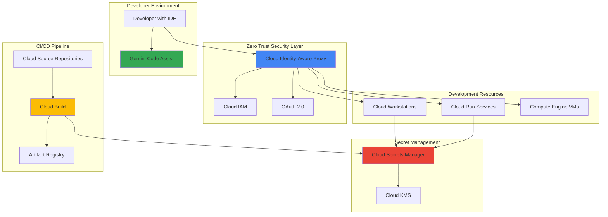

# Secure AI-Enhanced Development Workflows with Cloud Identity-Aware Proxy and Gemini Code Assist

## Problem

Development teams struggle to balance security requirements with productivity when building applications that require access to sensitive resources and AI-powered coding assistance. Traditional VPN-based approaches create security vulnerabilities, while unrestricted AI coding tools can expose proprietary code and credentials. Organizations need a zero-trust development environment that protects sensitive resources while enabling AI-enhanced productivity without compromising intellectual property or introducing security risks.

## Solution

Build a comprehensive zero-trust development environment that combines Google Cloud Identity-Aware Proxy (IAP) for secure resource access with Gemini Code Assist for AI-powered development assistance. This solution uses Cloud Secrets Manager to protect sensitive credentials and Cloud Build for secure, automated deployments, creating a development workflow that maintains security while maximizing developer productivity through intelligent AI assistance.

## Architecture Diagram



## Prerequisites

1. Google Cloud account with billing enabled and Organization Admin permissions
2. Google Cloud CLI v450.0.0 or later installed and configured
3. VS Code or JetBrains IDE with Gemini Code Assist extension installed
4. Basic understanding of Google Cloud IAM, zero-trust security principles, and containerized applications
5. Estimated cost: $50-75 for resources created during this recipe (cleanup instructions provided)

> **Note**: This recipe requires Organization-level permissions to configure Cloud IAP. Ensure you have the necessary access before proceeding with the setup.

## Preparation

```bash
# Set environment variables for Google Cloud resources
export PROJECT_ID="secure-dev-$(date +%s)"
export REGION="us-central1"
export ZONE="us-central1-a"
export ORG_ID=$(gcloud organizations list --format="value(name)" --limit=1)

# Generate unique suffix for resource names
RANDOM_SUFFIX=$(openssl rand -hex 3)
export APP_NAME="secure-dev-app-${RANDOM_SUFFIX}"
export WORKSTATION_NAME="secure-workstation-${RANDOM_SUFFIX}"
export SECRET_NAME="app-secrets-${RANDOM_SUFFIX}"

# Set default project and region
gcloud config set project ${PROJECT_ID}
gcloud config set compute/region ${REGION}
gcloud config set compute/zone ${ZONE}

# Create the project
gcloud projects create ${PROJECT_ID} --organization=${ORG_ID}
gcloud config set project ${PROJECT_ID}

# Link billing account (replace with your billing account ID)
BILLING_ACCOUNT=$(gcloud billing accounts list --format="value(name)" --limit=1)
gcloud billing projects link ${PROJECT_ID} --billing-account=${BILLING_ACCOUNT}

# Enable required APIs
gcloud services enable iap.googleapis.com \
    compute.googleapis.com \
    cloudbuild.googleapis.com \
    secretmanager.googleapis.com \
    cloudkms.googleapis.com \
    workstations.googleapis.com \
    run.googleapis.com \
    artifactregistry.googleapis.com \
    sourcerepo.googleapis.com

echo "✅ Project configured: ${PROJECT_ID}"
echo "✅ APIs enabled successfully"
```

## Steps

1. **Configure Cloud KMS for Encryption**:

   Google Cloud Key Management Service (KMS) provides centralized cryptographic key management with hardware security modules (HSMs) and automatic key rotation. This managed service ensures that encryption keys are protected according to FIPS 140-2 Level 3 standards, meeting the highest compliance requirements while integrating seamlessly with other Google Cloud services for comprehensive data protection.

   ```bash
   # Create KMS keyring for secret encryption
   gcloud kms keyrings create secure-dev-keyring \
       --location=${REGION}
   
   # Create encryption key for secrets
   gcloud kms keys create secret-encryption-key \
       --location=${REGION} \
       --keyring=secure-dev-keyring \
       --purpose=encryption
   
   # Verify key creation
   gcloud kms keys list \
       --location=${REGION} \
       --keyring=secure-dev-keyring
   
   echo "✅ KMS encryption infrastructure established"
   ```

   The encryption key is now available for protecting sensitive data across your Google Cloud resources. This cryptographic foundation enables data-at-rest encryption, application-level encryption, and secure key rotation, providing enterprise-grade security that scales with your infrastructure needs.

2. **Set Up Cloud Secrets Manager with Encryption**:

   Cloud Secrets Manager provides a secure and convenient method for storing and accessing sensitive information like API keys, passwords, and certificates. By integrating with Cloud KMS, it ensures that secrets are encrypted both at rest and in transit, while providing fine-grained access controls through Cloud IAM for compliance with zero-trust security principles.

   ```bash
   # Create secrets for development environment
   echo "database-connection-string" | \
       gcloud secrets create ${SECRET_NAME}-db \
       --replication-policy="automatic" \
       --data-file=-
   
   echo "api-key-for-external-service" | \
       gcloud secrets create ${SECRET_NAME}-api \
       --replication-policy="automatic" \
       --data-file=-
   
   # Create service account for application access
   gcloud iam service-accounts create secure-app-sa \
       --display-name="Secure Application Service Account" \
       --description="Service account for secure development application"
   
   # Grant secret access permissions
   gcloud secrets add-iam-policy-binding ${SECRET_NAME}-db \
       --member="serviceAccount:secure-app-sa@${PROJECT_ID}.iam.gserviceaccount.com" \
       --role="roles/secretmanager.secretAccessor"
   
   gcloud secrets add-iam-policy-binding ${SECRET_NAME}-api \
       --member="serviceAccount:secure-app-sa@${PROJECT_ID}.iam.gserviceaccount.com" \
       --role="roles/secretmanager.secretAccessor"
   
   echo "✅ Secrets configured with proper access controls"
   ```

   The secrets infrastructure is now operational with service account-based access controls. This configuration ensures that sensitive credentials are never exposed in code or configuration files, supporting secure development practices and enabling seamless integration with both Cloud Run services and Cloud Workstations.

3. **Create Secure Cloud Workstation Configuration**:

   Cloud Workstations provides fully managed, cloud-based development environments that integrate seamlessly with Google Cloud security services. By configuring workstations with Cloud IAP protection and Gemini Code Assist integration, developers gain access to powerful, secure development environments that maintain zero-trust principles while providing AI-enhanced productivity.

   ```bash
   # Create workstation cluster
   gcloud workstations clusters create secure-dev-cluster \
       --region=${REGION} \
       --network="projects/${PROJECT_ID}/global/networks/default" \
       --subnetwork="projects/${PROJECT_ID}/regions/${REGION}/subnetworks/default"
   
   # Wait for cluster creation
   echo "Waiting for workstation cluster creation..."
   sleep 120
   
   # Create workstation configuration with Gemini Code Assist
   gcloud workstations configs create secure-dev-config \
       --cluster=secure-dev-cluster \
       --region=${REGION} \
       --machine-type=e2-standard-4 \
       --pd-disk-type=pd-standard \
       --pd-disk-size=100GB \
       --container-image=us-central1-docker.pkg.dev/cloud-workstations-images/predefined/code-oss:latest \
       --service-account=secure-app-sa@${PROJECT_ID}.iam.gserviceaccount.com \
       --enable-ip-alias
   
   # Create the actual workstation instance
   gcloud workstations create ${WORKSTATION_NAME} \
       --cluster=secure-dev-cluster \
       --config=secure-dev-config \
       --region=${REGION}
   
   echo "✅ Secure Cloud Workstation created and configured"
   ```

   The workstation environment is now ready with integrated security controls and AI assistance. This setup provides developers with a consistent, secure development environment that includes pre-configured access to Google Cloud services, integrated secret management, and Gemini Code Assist for enhanced productivity.

4. **Deploy Sample Application to Cloud Run**:

   Cloud Run provides a serverless platform for containerized applications with built-in security features and seamless integration with Google Cloud services. This deployment demonstrates how applications can securely access secrets while being protected by Cloud IAP, creating a complete zero-trust application architecture.

   ```bash
   # Create sample application code
   mkdir -p secure-app/src
   
   cat > secure-app/src/main.py << 'EOF'
import os
from google.cloud import secretmanager
from flask import Flask, jsonify
import logging

app = Flask(__name__)
logging.basicConfig(level=logging.INFO)

def get_secret(secret_name):
    """Retrieve secret from Google Cloud Secret Manager"""
    try:
        client = secretmanager.SecretManagerServiceClient()
        project_id = os.environ.get('GOOGLE_CLOUD_PROJECT')
        name = f"projects/{project_id}/secrets/{secret_name}/versions/latest"
        response = client.access_secret_version(request={"name": name})
        return response.payload.data.decode('UTF-8')
    except Exception as e:
        logging.error(f"Error accessing secret {secret_name}: {e}")
        return None

@app.route('/health')
def health_check():
    """Health check endpoint"""
    return jsonify({"status": "healthy", "service": "secure-dev-app"}), 200

@app.route('/api/config')
def get_config():
    """API endpoint that demonstrates secure secret access"""
    # This would typically be used for database connections, API keys, etc.
    db_secret = get_secret(os.environ.get('DB_SECRET_NAME'))
    api_secret = get_secret(os.environ.get('API_SECRET_NAME'))
    
    return jsonify({
        "message": "Configuration loaded securely",
        "db_connected": bool(db_secret),
        "api_configured": bool(api_secret),
        "environment": "secure"
    }), 200

if __name__ == '__main__':
    app.run(host='0.0.0.0', port=int(os.environ.get('PORT', 8080)))
EOF

   # Create Dockerfile
   cat > secure-app/Dockerfile << 'EOF'
FROM python:3.11-slim

WORKDIR /app

# Install dependencies
COPY requirements.txt .
RUN pip install --no-cache-dir -r requirements.txt

# Copy application code
COPY src/ .

# Run as non-root user for security
RUN adduser --disabled-password --gecos '' appuser
USER appuser

# Health check
HEALTHCHECK --interval=30s --timeout=10s --start-period=5s --retries=3 \
    CMD curl -f http://localhost:8080/health || exit 1

EXPOSE 8080

CMD ["python", "main.py"]
EOF

   # Create requirements.txt
   cat > secure-app/requirements.txt << 'EOF'
Flask==2.3.2
google-cloud-secret-manager==2.16.2
gunicorn==21.2.0
EOF

   # Deploy to Cloud Run with IAP integration
   cd secure-app
   gcloud run deploy ${APP_NAME} \
       --source . \
       --region=${REGION} \
       --service-account=secure-app-sa@${PROJECT_ID}.iam.gserviceaccount.com \
       --set-env-vars="DB_SECRET_NAME=${SECRET_NAME}-db,API_SECRET_NAME=${SECRET_NAME}-api" \
       --no-allow-unauthenticated \
       --max-instances=10 \
       --memory=512Mi \
       --cpu=1 \
       --port=8080
   
   cd ..
   
   echo "✅ Secure application deployed to Cloud Run"
   ```

   The application is now deployed with secure secret access and authentication requirements. This demonstrates how Cloud Run services can securely retrieve sensitive configuration data without exposing credentials in code or environment variables, while requiring authentication for all requests.

5. **Configure Cloud Identity-Aware Proxy (IAP)**:

   Cloud IAP establishes a central authorization layer that enables zero-trust access control for applications and resources. By implementing OAuth 2.0-based authentication and fine-grained IAM policies, IAP ensures that only authorized users can access protected resources while eliminating the need for traditional VPN connections and network-level security controls.

   ```bash
   # Get the Cloud Run service URL
   SERVICE_URL=$(gcloud run services describe ${APP_NAME} \
       --region=${REGION} \
       --format="value(status.url)")
   
   # Create OAuth consent screen (if not already configured)
   gcloud iap oauth-brands create \
       --application_title="Secure Development Environment" \
       --support_email=$(gcloud config get-value account) || echo "OAuth brand may already exist"
   
   # Enable IAP for Cloud Run service
   gcloud run services update ${APP_NAME} \
       --region=${REGION} \
       --add-env-vars="IAP_ENABLED=true"
   
   # Configure IAP access policy
   gcloud projects add-iam-policy-binding ${PROJECT_ID} \
       --member="user:$(gcloud config get-value account)" \
       --role="roles/iap.httpsResourceAccessor"
   
   # Add developer team members (replace with actual email addresses)
   # gcloud projects add-iam-policy-binding ${PROJECT_ID} \
   #     --member="user:developer@company.com" \
   #     --role="roles/iap.httpsResourceAccessor"
   
   echo "✅ Cloud Identity-Aware Proxy configured"
   echo "Service URL: ${SERVICE_URL}"
   ```

   Cloud IAP is now protecting your application with zero-trust access controls. Users must authenticate through Google OAuth 2.0 and be granted explicit IAM permissions before accessing the application, ensuring that every request is verified regardless of network location or device used.

6. **Set Up Cloud Build for Secure CI/CD**:

   Cloud Build provides a fully managed continuous integration and continuous deployment platform that integrates seamlessly with Google Cloud security services. By configuring Cloud Build with proper IAM controls and secret management, development teams can maintain secure, automated deployment pipelines that follow zero-trust principles.

   ```bash
   # Create Cloud Source Repository
   gcloud source repos create secure-dev-repo
   
   # Create Artifact Registry for container images
   gcloud artifacts repositories create secure-dev-images \
       --repository-format=docker \
       --location=${REGION} \
       --description="Secure development container images"
   
   # Create Cloud Build configuration
   cat > cloudbuild.yaml << 'EOF'
steps:
  # Build the container image
  - name: 'gcr.io/cloud-builders/docker'
    args: ['build', '-t', '${_LOCATION}-docker.pkg.dev/${PROJECT_ID}/${_REPOSITORY}/${_IMAGE}:${SHORT_SHA}', '.']
    dir: 'secure-app'
  
  # Push the container image to Artifact Registry
  - name: 'gcr.io/cloud-builders/docker'
    args: ['push', '${_LOCATION}-docker.pkg.dev/${PROJECT_ID}/${_REPOSITORY}/${_IMAGE}:${SHORT_SHA}']
  
  # Deploy to Cloud Run
  - name: 'gcr.io/cloud-builders/gcloud'
    args:
    - 'run'
    - 'deploy'
    - '${_SERVICE_NAME}'
    - '--image=${_LOCATION}-docker.pkg.dev/${PROJECT_ID}/${_REPOSITORY}/${_IMAGE}:${SHORT_SHA}'
    - '--region=${_REGION}'
    - '--service-account=${_SERVICE_ACCOUNT}'
    - '--no-allow-unauthenticated'

substitutions:
  _LOCATION: us-central1
  _REPOSITORY: secure-dev-images
  _IMAGE: secure-dev-app
  _SERVICE_NAME: secure-dev-app
  _REGION: us-central1
  _SERVICE_ACCOUNT: secure-app-sa@${PROJECT_ID}.iam.gserviceaccount.com

options:
  logging: CLOUD_LOGGING_ONLY
  substitution_option: 'ALLOW_LOOSE'
EOF

   # Grant Cloud Build necessary permissions
   PROJECT_NUMBER=$(gcloud projects describe ${PROJECT_ID} --format="value(projectNumber)")
   
   gcloud projects add-iam-policy-binding ${PROJECT_ID} \
       --member="serviceAccount:${PROJECT_NUMBER}@cloudbuild.gserviceaccount.com" \
       --role="roles/run.developer"
   
   gcloud projects add-iam-policy-binding ${PROJECT_ID} \
       --member="serviceAccount:${PROJECT_NUMBER}@cloudbuild.gserviceaccount.com" \
       --role="roles/artifactregistry.writer"
   
   echo "✅ Cloud Build CI/CD pipeline configured"
   ```

   The CI/CD pipeline is now established with proper security controls and automated deployment capabilities. This configuration enables developers to commit code changes that trigger secure, automated builds and deployments while maintaining access control and audit trails throughout the entire process.

7. **Configure Gemini Code Assist Integration**:

   Gemini Code Assist provides AI-powered coding assistance that understands your codebase context while maintaining enterprise-grade security and privacy controls. By integrating Gemini Code Assist with your secure development environment, developers gain intelligent code completion, bug detection, and optimization suggestions without compromising intellectual property or security requirements.

   ```bash
   # Enable Gemini Code Assist API
   gcloud services enable aiplatform.googleapis.com
   
   # Create service account for Gemini Code Assist
   gcloud iam service-accounts create gemini-code-assist-sa \
       --display-name="Gemini Code Assist Service Account" \
       --description="Service account for AI-powered development assistance"
   
   # Grant necessary permissions for Gemini Code Assist
   gcloud projects add-iam-policy-binding ${PROJECT_ID} \
       --member="serviceAccount:gemini-code-assist-sa@${PROJECT_ID}.iam.gserviceaccount.com" \
       --role="roles/aiplatform.user"
   
   # Configure Cloud Workstation for Gemini integration
   gcloud workstations configs update secure-dev-config \
       --cluster=secure-dev-cluster \
       --region=${REGION} \
       --container-env="GEMINI_CODE_ASSIST_ENABLED=true,GOOGLE_CLOUD_PROJECT=${PROJECT_ID}"
   
   # Restart workstation to apply changes
   gcloud workstations stop ${WORKSTATION_NAME} \
       --cluster=secure-dev-cluster \
       --config=secure-dev-config \
       --region=${REGION}
   
   sleep 30
   
   gcloud workstations start ${WORKSTATION_NAME} \
       --cluster=secure-dev-cluster \
       --config=secure-dev-config \
       --region=${REGION}
   
   echo "✅ Gemini Code Assist integration configured"
   echo "Access your workstation at: https://workstations.googleusercontent.com/"
   ```

   Gemini Code Assist is now integrated with your secure development environment, providing AI-powered assistance while maintaining data governance and security controls. Developers can access intelligent code suggestions, automated testing recommendations, and security best practices directly within their development workflow.

## Validation & Testing

1. **Verify IAP Protection**:

   ```bash
   # Test unauthenticated access (should fail)
   SERVICE_URL=$(gcloud run services describe ${APP_NAME} \
       --region=${REGION} \
       --format="value(status.url)")
   
   echo "Testing unauthenticated access..."
   curl -s -o /dev/null -w "%{http_code}" ${SERVICE_URL}/health
   ```

   Expected output: `403` (Forbidden) indicating IAP is properly protecting the service.

2. **Test Secret Manager Integration**:

   ```bash
   # Verify secrets are accessible by the application
   echo "Testing secret access..."
   gcloud secrets versions access latest --secret=${SECRET_NAME}-db
   gcloud secrets versions access latest --secret=${SECRET_NAME}-api
   ```

   Expected output: The secret values you created earlier should be displayed.

3. **Validate Cloud Build Pipeline**:

   ```bash
   # Test the build pipeline
   gcloud builds submit --config=cloudbuild.yaml \
       --substitutions="_SERVICE_NAME=${APP_NAME}"
   ```

   Expected output: Successful build and deployment logs showing container creation and Cloud Run deployment.

4. **Verify Workstation Access**:

   ```bash
   # Check workstation status
   gcloud workstations describe ${WORKSTATION_NAME} \
       --cluster=secure-dev-cluster \
       --config=secure-dev-config \
       --region=${REGION} \
       --format="value(state)"
   ```

   Expected output: `STATE_RUNNING` indicating the workstation is operational.

5. **Test End-to-End Security**:

   ```bash
   # Generate IAP-authenticated request token
   IAP_TOKEN=$(gcloud auth print-identity-token)
   
   # Test authenticated access to the application
   curl -H "Authorization: Bearer ${IAP_TOKEN}" \
        ${SERVICE_URL}/api/config
   ```

   Expected output: JSON response showing successful secret access and configuration loading.

## Cleanup

1. **Remove Cloud Run services and configurations**:

   ```bash
   # Delete Cloud Run service
   gcloud run services delete ${APP_NAME} \
       --region=${REGION} \
       --quiet
   
   echo "✅ Cloud Run service deleted"
   ```

2. **Clean up Cloud Workstations**:

   ```bash
   # Delete workstation instance
   gcloud workstations delete ${WORKSTATION_NAME} \
       --cluster=secure-dev-cluster \
       --config=secure-dev-config \
       --region=${REGION} \
       --quiet
   
   # Delete workstation configuration
   gcloud workstations configs delete secure-dev-config \
       --cluster=secure-dev-cluster \
       --region=${REGION} \
       --quiet
   
   # Delete workstation cluster
   gcloud workstations clusters delete secure-dev-cluster \
       --region=${REGION} \
       --quiet
   
   echo "✅ Cloud Workstations cleaned up"
   ```

3. **Remove Artifact Registry and Source Repositories**:

   ```bash
   # Delete Artifact Registry repository
   gcloud artifacts repositories delete secure-dev-images \
       --location=${REGION} \
       --quiet
   
   # Delete Source Repository
   gcloud source repos delete secure-dev-repo --quiet
   
   echo "✅ Repository resources deleted"
   ```

4. **Clean up secrets and encryption keys**:

   ```bash
   # Delete secrets
   gcloud secrets delete ${SECRET_NAME}-db --quiet
   gcloud secrets delete ${SECRET_NAME}-api --quiet
   
   # Delete KMS key (note: keys are soft-deleted and recoverable)
   gcloud kms keys destroy secret-encryption-key \
       --location=${REGION} \
       --keyring=secure-dev-keyring \
       --quiet
   
   echo "✅ Secrets and encryption keys removed"
   ```

5. **Remove service accounts and IAM bindings**:

   ```bash
   # Delete service accounts
   gcloud iam service-accounts delete \
       secure-app-sa@${PROJECT_ID}.iam.gserviceaccount.com --quiet
   
   gcloud iam service-accounts delete \
       gemini-code-assist-sa@${PROJECT_ID}.iam.gserviceaccount.com --quiet
   
   echo "✅ Service accounts deleted"
   ```

6. **Delete the entire project** (recommended for complete cleanup):

   ```bash
   # Delete the project (removes all resources)
   gcloud projects delete ${PROJECT_ID} --quiet
   
   echo "✅ Project and all resources deleted"
   echo "Note: Project deletion may take several minutes to complete"
   ```

## Discussion

This recipe demonstrates how to implement a comprehensive zero-trust development environment that combines security best practices with AI-enhanced productivity. The solution addresses the growing need for secure development workflows that protect sensitive resources while enabling modern development practices. By leveraging Cloud Identity-Aware Proxy, organizations can eliminate traditional VPN-based access controls and implement fine-grained, context-aware authentication that verifies every request regardless of network location.

The integration of Gemini Code Assist with secure development environments represents a significant advancement in balancing security with developer productivity. Unlike traditional AI coding assistants that may expose proprietary code to external services, Gemini Code Assist Enterprise provides AI assistance while maintaining data governance controls and enterprise-grade security. This approach enables developers to benefit from intelligent code suggestions, automated testing recommendations, and security best practices without compromising intellectual property or introducing compliance risks. The AI assistance operates within the secure boundary established by Cloud IAP and integrates seamlessly with Google Cloud's security model.

Cloud Secrets Manager plays a crucial role in this architecture by ensuring that sensitive credentials never appear in code repositories or configuration files. The integration with Cloud KMS provides an additional layer of encryption that meets compliance requirements for highly regulated industries. This approach supports the principle of least privilege by granting applications access only to the specific secrets they require, while maintaining detailed audit logs of all secret access patterns. The combination with Cloud Build creates secure CI/CD pipelines that can access secrets during deployment without exposing them to developers or storing them in build artifacts.

The architectural pattern established in this recipe scales effectively across enterprise development teams and can be extended to support multiple environments, applications, and deployment targets. Organizations can adapt this approach to implement consistent security controls across their entire development lifecycle, from initial code creation through production deployment. The zero-trust principles demonstrated here align with modern security frameworks and regulatory compliance requirements, making this solution suitable for organizations in financial services, healthcare, and other highly regulated sectors. For comprehensive guidance on implementing zero-trust architectures, refer to the [Google Cloud Zero Trust Security Model](https://cloud.google.com/security/zero-trust) documentation.

> **Tip**: Consider implementing Cloud Security Command Center to gain centralized visibility into security findings across your development environment, enabling proactive threat detection and compliance monitoring.

## Challenge

Extend this solution by implementing these enhancements:

1. **Multi-Environment Deployment Pipeline**: Create separate development, staging, and production environments with environment-specific secret management and automated promotion pipelines using Cloud Deploy and Terraform for infrastructure as code.

2. **Advanced Monitoring and Alerting**: Integrate Cloud Monitoring, Cloud Logging, and Cloud Security Command Center to create comprehensive observability dashboards that track developer activity, AI assistance usage patterns, and security policy violations.

3. **Dynamic Access Controls**: Implement time-based access controls and just-in-time (JIT) access for production resources using Cloud IAM Conditions and Cloud Workflows to automate approval processes based on business hours and project requirements.

4. **Custom Gemini Code Assist Training**: Configure Gemini Code Assist Enterprise with your organization's private code repositories and coding standards to provide contextually relevant suggestions that align with internal best practices and architectural patterns.

5. **Compliance Automation**: Extend the solution with Cloud Asset Inventory, Cloud Data Loss Prevention (DLP), and custom organization policies to automatically detect and remediate compliance violations while maintaining detailed audit trails for regulatory reporting.

## Infrastructure Code

*Infrastructure code will be generated after recipe approval.*