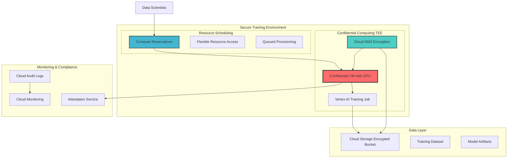

# Secure AI Model Training Workflows with Dynamic Workload Scheduler and Confidential Computing

## Problem

Enterprise AI teams face a critical challenge when training machine learning models with sensitive data: balancing optimal resource allocation across high-demand GPU infrastructure while maintaining the highest security standards for proprietary datasets and model parameters. Traditional cloud-based training workflows expose sensitive data during processing, creating compliance risks and limiting collaboration opportunities with external partners or vendors who cannot access confidential intellectual property.

## Solution

This solution leverages Google Cloud's intelligent resource scheduling capabilities to optimize GPU resource allocation while protecting sensitive training data through Confidential Computing's Trusted Execution Environments (TEEs). The architecture ensures that training data and model parameters remain encrypted and isolated even during active processing, enabling secure multi-party collaboration and meeting the strictest enterprise compliance requirements while maintaining optimal cost efficiency.

## Architecture Diagram



## Prerequisites

1. Google Cloud project with billing enabled and appropriate IAM permissions (Compute Admin, Vertex AI User, Cloud KMS Admin)
2. Google Cloud CLI (gcloud) installed and configured (version 455.0.0 or later)
3. Understanding of machine learning workflows, enterprise security compliance, and Google Cloud security architecture
4. Access to GPU resources in your project region (requires quota approval for high-performance accelerators)
5. Estimated cost: $200-400 for GPU usage during training, $15-30 for storage and KMS operations

> **Warning**: This configuration uses premium GPU resources that can incur significant charges. Monitor usage closely and implement cost controls through budgets and alerts.

## Preparation

```bash
# Set environment variables for Google Cloud resources
export PROJECT_ID="secure-ai-training-$(date +%s)"
export REGION="us-central1"
export ZONE="us-central1-a"
export SERVICE_ACCOUNT_NAME="ai-training-sa"

# Generate unique suffix for resource names
RANDOM_SUFFIX=$(openssl rand -hex 3)
export BUCKET_NAME="secure-training-data-${RANDOM_SUFFIX}"
export KEYRING_NAME="ai-training-keyring-${RANDOM_SUFFIX}"
export KEY_NAME="training-data-key"
export VERTEX_JOB_NAME="secure-training-job-${RANDOM_SUFFIX}"

# Set default project and region
gcloud config set project ${PROJECT_ID}
gcloud config set compute/region ${REGION}
gcloud config set compute/zone ${ZONE}

# Enable required Google Cloud APIs
gcloud services enable compute.googleapis.com \
    storage.googleapis.com \
    cloudkms.googleapis.com \
    aiplatform.googleapis.com \
    cloudbuild.googleapis.com \
    monitoring.googleapis.com \
    logging.googleapis.com

echo "✅ Project configured: ${PROJECT_ID}"
echo "✅ APIs enabled for secure AI training pipeline"
```

## Steps

1. **Create Cloud KMS Encryption Infrastructure**:

   Cloud KMS provides hardware security module (HSM) backed encryption keys that form the foundation of our confidential computing environment. Creating dedicated encryption keys ensures that all training data and model parameters are protected with enterprise-grade cryptography, meeting compliance requirements while enabling secure key rotation and access control management.

   ```bash
   # Create KMS keyring for training data encryption
   gcloud kms keyrings create ${KEYRING_NAME} \
       --location=${REGION}
   
   # Create encryption key for training data
   gcloud kms keys create ${KEY_NAME} \
       --location=${REGION} \
       --keyring=${KEYRING_NAME} \
       --purpose=encryption \
       --rotation-period=30d \
       --next-rotation-time=$(date -d "+30 days" --iso-8601)
   
   echo "✅ KMS encryption infrastructure created"
   ```

   The encryption key is now available with automatic 30-day rotation, providing ongoing security for sensitive training data. This cryptographic foundation enables the confidential computing environment to maintain data protection guarantees throughout the entire ML pipeline while supporting compliance auditing and access control requirements.

2. **Create Confidential Computing Service Account with Security Permissions**:

   Service accounts in confidential computing environments require specific IAM roles to access encrypted resources while maintaining the security boundary of the Trusted Execution Environment. This configuration follows the principle of least privilege while enabling the necessary permissions for secure AI training workflows.

   ```bash
   # Create dedicated service account for confidential training
   gcloud iam service-accounts create ${SERVICE_ACCOUNT_NAME} \
       --display-name="AI Training Confidential Computing SA" \
       --description="Service account for secure AI training in TEE"
   
   # Grant necessary permissions for confidential computing
   gcloud projects add-iam-policy-binding ${PROJECT_ID} \
       --member="serviceAccount:${SERVICE_ACCOUNT_NAME}@${PROJECT_ID}.iam.gserviceaccount.com" \
       --role="roles/aiplatform.user"
   
   gcloud projects add-iam-policy-binding ${PROJECT_ID} \
       --member="serviceAccount:${SERVICE_ACCOUNT_NAME}@${PROJECT_ID}.iam.gserviceaccount.com" \
       --role="roles/storage.objectAdmin"
   
   gcloud projects add-iam-policy-binding ${PROJECT_ID} \
       --member="serviceAccount:${SERVICE_ACCOUNT_NAME}@${PROJECT_ID}.iam.gserviceaccount.com" \
       --role="roles/cloudkms.cryptoKeyEncrypterDecrypter"
   
   gcloud projects add-iam-policy-binding ${PROJECT_ID} \
       --member="serviceAccount:${SERVICE_ACCOUNT_NAME}@${PROJECT_ID}.iam.gserviceaccount.com" \
       --role="roles/compute.instanceAdmin"
   
   echo "✅ Confidential computing service account configured"
   ```

   The service account now has the minimum required permissions to operate within the confidential computing environment, access encrypted training data, and execute Vertex AI workloads while maintaining security isolation and audit capabilities.

3. **Create Encrypted Cloud Storage for Training Data**:

   Cloud Storage with customer-managed encryption keys (CMEK) ensures that training datasets remain encrypted at rest using keys that only authorized confidential computing environments can access. This approach provides defense-in-depth security and enables secure data sharing between trusted execution environments.

   ```bash
   # Create encrypted storage bucket for training data
   gsutil mb -p ${PROJECT_ID} \
       -c STANDARD \
       -l ${REGION} \
       gs://${BUCKET_NAME}
   
   # Configure bucket with customer-managed encryption
   gsutil kms encryption \
       -k projects/${PROJECT_ID}/locations/${REGION}/keyRings/${KEYRING_NAME}/cryptoKeys/${KEY_NAME} \
       gs://${BUCKET_NAME}
   
   # Set bucket lifecycle policy for cost optimization
   gsutil lifecycle set /dev/stdin gs://${BUCKET_NAME} <<EOF
   {
     "lifecycle": {
       "rule": [
         {
           "action": {
             "type": "SetStorageClass", 
             "storageClass": "NEARLINE"
           },
           "condition": {"age": 30}
         },
         {
           "action": {
             "type": "SetStorageClass", 
             "storageClass": "COLDLINE"
           },
           "condition": {"age": 90}
         }
       ]
     }
   }
   EOF
   
   # Enable versioning for data lineage tracking
   gsutil versioning set on gs://${BUCKET_NAME}
   
   echo "✅ Encrypted storage bucket created: ${BUCKET_NAME}"
   ```

   The storage bucket is now configured with CMEK encryption and lifecycle policies, providing cost-optimized storage for training data while maintaining encryption and versioning for data governance and compliance requirements.

4. **Upload Sample Training Data with Encryption**:

   Demonstrating the encrypted data upload process validates that our security infrastructure correctly handles sensitive training data. This step simulates uploading proprietary datasets that require confidential computing protection throughout the training pipeline.

   ```bash
   # Create sample training data directory
   mkdir -p ./training_data
   
   # Generate sample training dataset
   cat > ./training_data/dataset.csv << 'EOF'
   feature1,feature2,feature3,label
   0.1,0.2,0.3,1
   0.4,0.5,0.6,0
   0.7,0.8,0.9,1
   0.2,0.3,0.4,0
   0.5,0.6,0.7,1
   EOF
   
   # Create sample training script for confidential environment
   cat > ./training_data/secure_training.py << 'EOF'
   import pandas as pd
   import numpy as np
   from sklearn.ensemble import RandomForestClassifier
   from sklearn.model_selection import train_test_split
   import pickle
   import os
   
   def main():
       # Load encrypted data within TEE
       data = pd.read_csv('/tmp/dataset.csv')
       X = data[['feature1', 'feature2', 'feature3']]
       y = data['label']
       
       # Split data
       X_train, X_test, y_train, y_test = train_test_split(
           X, y, test_size=0.2, random_state=42
       )
       
       # Train model within confidential environment
       model = RandomForestClassifier(n_estimators=100, random_state=42)
       model.fit(X_train, y_train)
       
       # Save model securely
       with open('/tmp/secure_model.pkl', 'wb') as f:
           pickle.dump(model, f)
       
       print(f"Model accuracy: {model.score(X_test, y_test):.4f}")
       print("Training completed in confidential environment")
   
   if __name__ == "__main__":
       main()
   EOF
   
   # Upload training data to encrypted bucket
   gsutil -m cp -r ./training_data/* gs://${BUCKET_NAME}/training/
   
   echo "✅ Sample training data uploaded to encrypted storage"
   ```

   The training data and scripts are now stored in the encrypted bucket, demonstrating how sensitive datasets can be securely managed and accessed only by authorized confidential computing environments.

5. **Configure GPU Resource Reservation**:

   Google Cloud compute reservations provide guaranteed access to specific GPU resources, ensuring that confidential training workloads can access the necessary compute resources when needed while enabling predictable scheduling and cost optimization through flexible resource allocation.

   ```bash
   # Create compute reservation for GPU resources
   gcloud compute reservations create secure-ai-training-reservation \
       --zone=${ZONE} \
       --vm-count=1 \
       --machine-type=a2-highgpu-1g \
       --accelerator=type=nvidia-tesla-a100,count=1 \
       --require-specific-reservation
   
   # Create compute instance template for confidential computing
   gcloud compute instance-templates create confidential-training-template \
       --machine-type=a2-highgpu-1g \
       --accelerator=type=nvidia-tesla-a100,count=1 \
       --image-family=deep-learning-vm \
       --image-project=ml-images \
       --boot-disk-size=100GB \
       --boot-disk-type=pd-ssd \
       --confidential-compute-type=SEV_SNP \
       --min-cpu-platform="AMD Milan" \
       --maintenance-policy=TERMINATE \
       --service-account=${SERVICE_ACCOUNT_NAME}@${PROJECT_ID}.iam.gserviceaccount.com \
       --scopes=https://www.googleapis.com/auth/cloud-platform \
       --metadata=enable-oslogin=true \
       --tags=confidential-training \
       --reservation-affinity=specific \
       --reservation=${ZONE}/secure-ai-training-reservation
   
   echo "✅ GPU resource reservation configured"
   ```

   The reservation and instance template are configured to use confidential computing with GPU acceleration, ensuring that training workloads can access optimized hardware while maintaining the security guarantees of Trusted Execution Environments.

6. **Deploy Confidential Computing Training Environment**:

   Creating a confidential VM with GPU acceleration establishes the secure execution environment where sensitive training occurs. The Trusted Execution Environment ensures that data and model parameters remain encrypted and isolated even from privileged system access, meeting the highest enterprise security standards.

   ```bash
   # Create confidential computing instance for training
   gcloud compute instances create confidential-training-vm \
       --source-instance-template=confidential-training-template \
       --zone=${ZONE}
   
   # Wait for instance to be ready
   echo "Waiting for confidential VM to be ready..."
   while true; do
       STATUS=$(gcloud compute instances describe confidential-training-vm \
           --zone=${ZONE} \
           --format="value(status)")
       if [ "$STATUS" = "RUNNING" ]; then
           break
       fi
       echo "Instance status: $STATUS - waiting..."
       sleep 10
   done
   
   # Verify GPU and confidential computing are available
   gcloud compute ssh confidential-training-vm \
       --zone=${ZONE} \
       --command="sudo nvidia-smi && \
                 sudo dmesg | grep -i sev" \
       --quiet
   
   echo "✅ Confidential computing training environment deployed"
   ```

   The confidential VM is now running with GPU acceleration and SEV-SNP encryption, providing a secure environment where training can occur with hardware-level protection of sensitive data and model parameters.

7. **Execute Secure Training Workflow with Vertex AI**:

   Vertex AI integration with confidential computing enables enterprise-grade ML training workflows while maintaining data protection guarantees. This configuration demonstrates how to launch distributed training jobs within the secure environment, ensuring that proprietary algorithms and datasets remain confidential throughout the training process.

   ```bash
   # Create Vertex AI custom training job configuration
   cat > training_job_config.yaml << EOF
   displayName: "Secure AI Training Job"
   jobSpec:
     workerPoolSpecs:
     - machineSpec:
         machineType: a2-highgpu-1g
         acceleratorType: NVIDIA_TESLA_A100
         acceleratorCount: 1
       replicaCount: 1
       containerSpec:
         imageUri: gcr.io/deeplearning-platform-release/pytorch-gpu.1-13
         command:
         - python
         - /training/secure_training.py
         env:
         - name: AIP_STORAGE_URI
           value: gs://${BUCKET_NAME}/training
         - name: AIP_MODEL_DIR
           value: gs://${BUCKET_NAME}/models
   EOF
   
   # Submit confidential training job to Vertex AI
   gcloud ai custom-jobs create \
       --region=${REGION} \
       --display-name="confidential-training-${RANDOM_SUFFIX}" \
       --config=training_job_config.yaml \
       --service-account=${SERVICE_ACCOUNT_NAME}@${PROJECT_ID}.iam.gserviceaccount.com
   
   # Monitor training job status
   JOB_ID=$(gcloud ai custom-jobs list \
       --region=${REGION} \
       --filter="displayName:confidential-training-${RANDOM_SUFFIX}" \
       --format="value(name)" | head -1)
   
   echo "✅ Secure training job submitted: ${JOB_ID}"
   echo "Monitor progress: gcloud ai custom-jobs describe ${JOB_ID} --region=${REGION}"
   ```

   The training job is now executing within the confidential computing environment, with all data processing occurring inside the Trusted Execution Environment while leveraging GPU acceleration for optimal performance and cost efficiency.

8. **Implement Attestation and Compliance Monitoring**:

   Attestation services provide cryptographic proof that training occurred within a genuine confidential computing environment, enabling compliance auditing and establishing trust chains for sensitive AI workflows. This monitoring ensures ongoing security validation and regulatory compliance throughout the training process.

   ```bash
   # Configure Cloud Monitoring for confidential computing metrics
   cat > monitoring_policy.yaml << EOF
   displayName: "Confidential Training Security Policy"
   conditions:
   - displayName: "TEE Attestation Failure"
     conditionThreshold:
       filter: 'resource.type="gce_instance" AND metric.type="compute.googleapis.com/instance/confidential_compute/attestation_failure"'
       comparison: COMPARISON_GREATER_THAN
       thresholdValue: 0
   notificationChannels: []
   alertStrategy:
     autoClose: 86400s
   documentation:
     content: "Alert triggered when confidential computing attestation fails"
   EOF
   
   # Create monitoring policy
   gcloud alpha monitoring policies create \
       --policy-from-file=monitoring_policy.yaml
   
   # Enable audit logging for confidential computing
   cat > audit_policy.yaml << EOF
   auditConfigs:
   - service: compute.googleapis.com
     auditLogConfigs:
     - logType: ADMIN_READ
     - logType: DATA_READ
     - logType: DATA_WRITE
   EOF
   
   gcloud logging sinks create confidential-training-audit \
       bigquery.googleapis.com/projects/${PROJECT_ID}/datasets/audit_logs \
       --log-filter='protoPayload.serviceName="compute.googleapis.com"' \
       --project=${PROJECT_ID}
   
   echo "✅ Attestation and compliance monitoring configured"
   ```

   The monitoring and audit infrastructure now provides real-time security validation and compliance tracking, ensuring that confidential training workflows maintain their security guarantees and can be audited for regulatory compliance.

## Validation & Testing

1. **Verify Confidential Computing Environment Status**:

   ```bash
   # Check confidential VM attestation status
   gcloud compute instances describe confidential-training-vm \
       --zone=${ZONE} \
       --format="value(confidentialInstanceConfig.confidentialInstanceType)"
   
   # Verify encryption keys are accessible
   gcloud kms keys describe ${KEY_NAME} \
       --location=${REGION} \
       --keyring=${KEYRING_NAME} \
       --format="value(primary.state)"
   ```

   Expected output: `SEV_SNP` for confidential compute status and `ENABLED` for key state.

2. **Test GPU Resource Reservation Integration**:

   ```bash
   # Check reservation utilization
   gcloud compute reservations describe secure-ai-training-reservation \
       --zone=${ZONE} \
       --format="value(status,specificReservation.count,specificReservation.inUseCount)"
   
   # Verify GPU availability in confidential environment
   gcloud compute ssh confidential-training-vm \
       --zone=${ZONE} \
       --command="nvidia-smi --query-gpu=name,memory.total --format=csv"
   ```

   Expected output shows reservation status and available GPU memory.

3. **Validate Secure Training Data Access**:

   ```bash
   # Test encrypted data access from confidential environment
   gcloud compute ssh confidential-training-vm \
       --zone=${ZONE} \
       --command="gsutil ls gs://${BUCKET_NAME}/training/"
   
   # Verify training job completion
   gcloud ai custom-jobs describe ${JOB_ID} \
       --region=${REGION} \
       --format="value(state)"
   ```

   Expected output shows successful data access and completed training job status.

## Cleanup

1. **Stop and delete confidential computing resources**:

   ```bash
   # Cancel any running training jobs
   gcloud ai custom-jobs cancel ${JOB_ID} \
       --region=${REGION} || true
   
   # Delete confidential VM
   gcloud compute instances delete confidential-training-vm \
       --zone=${ZONE} \
       --quiet
   
   echo "✅ Confidential computing resources deleted"
   ```

2. **Remove GPU resource reservations**:

   ```bash
   # Delete compute reservation
   gcloud compute reservations delete secure-ai-training-reservation \
       --zone=${ZONE} \
       --quiet
   
   # Delete instance template
   gcloud compute instance-templates delete confidential-training-template \
       --quiet
   
   echo "✅ GPU resource reservations cleaned up"
   ```

3. **Clean up storage and encryption resources**:

   ```bash
   # Remove training data from encrypted bucket
   gsutil -m rm -r gs://${BUCKET_NAME}
   
   # Delete KMS key (schedule for destruction)
   gcloud kms keys versions destroy 1 \
       --key=${KEY_NAME} \
       --location=${REGION} \
       --keyring=${KEYRING_NAME} \
       --quiet
   
   # Delete service account
   gcloud iam service-accounts delete \
       ${SERVICE_ACCOUNT_NAME}@${PROJECT_ID}.iam.gserviceaccount.com \
       --quiet
   
   echo "✅ Storage and encryption resources cleaned up"
   ```

## Discussion

This recipe demonstrates how Google Cloud's intelligent resource scheduling and Confidential Computing work together to solve one of enterprise AI's most challenging problems: maintaining data security while optimizing expensive compute resources. The resource reservation system addresses the economic challenge of AI infrastructure by providing guaranteed access to GPU resources while enabling flexible scheduling for cost optimization. Meanwhile, Confidential Computing's Trusted Execution Environments ensure that sensitive training data never exists in unencrypted form, even during active processing.

The integration between these services creates a powerful platform for enterprise AI workflows. Organizations can now train models on highly sensitive datasets—such as financial records, healthcare data, or proprietary research—while maintaining strict security isolation. The TEE environment protects against both external threats and privileged access, meaning that even Google Cloud operations teams cannot access the data during processing. This capability enables new collaboration models, such as federated learning between competitive organizations or training on regulated datasets that previously couldn't be processed in cloud environments.

From an operational perspective, this architecture provides significant cost optimization opportunities. GPU reservations can reduce compute costs by up to 30% compared to on-demand pricing when using sustained workloads, while flex-start scheduling can provide additional savings for non-urgent training jobs. The confidential computing overhead is minimal—typically less than 5% performance impact—making this approach practical for production-scale AI training. Organizations should consider implementing additional cost controls through Cloud Billing budgets and quotas to prevent unexpected charges from intensive training workloads.

The monitoring and attestation capabilities demonstrated here are crucial for enterprise adoption. The ability to provide cryptographic proof that training occurred in a genuine TEE environment supports compliance with regulations like GDPR, HIPAA, and financial services requirements. For more detailed information on confidential computing security guarantees, see the [Google Cloud Confidential Computing documentation](https://cloud.google.com/confidential-computing/docs/about-confidential-computing). For GPU resource optimization strategies, refer to the [Compute Engine GPU documentation](https://cloud.google.com/compute/docs/gpus). Additional security best practices can be found in the [Google Cloud Security Command Center documentation](https://cloud.google.com/security-command-center/docs/concepts-security-command-center-overview).

> **Tip**: Enable Cloud Asset Inventory to track confidential computing resources across your organization and ensure compliance with security policies. Use Cloud KMS automatic key rotation to maintain long-term security without operational overhead.

## Challenge

Extend this solution by implementing these advanced security and optimization enhancements:

1. **Multi-Region Federated Learning**: Configure confidential computing environments across multiple regions to enable federated learning workflows while maintaining data residency requirements and optimizing for regional GPU availability.

2. **Automated Compliance Reporting**: Implement Cloud Functions that automatically generate compliance reports from attestation logs, creating audit trails that demonstrate TEE integrity for regulatory submissions and security assessments.

3. **Dynamic Cost Optimization**: Build an intelligent scheduling system that automatically switches between reserved and on-demand GPU instances based on training urgency, budget constraints, and resource availability predictions using Cloud AI forecasting capabilities.

4. **Secure Model Serving Pipeline**: Extend the confidential training environment to include secure model serving using Cloud Run with confidential computing, ensuring that model inference also occurs within TEEs for end-to-end data protection.

5. **Advanced Threat Detection**: Integrate Security Command Center with custom detectors that monitor for anomalous behavior in confidential computing environments, including unexpected memory access patterns or network communications that could indicate security threats.

## Infrastructure Code

### Available Infrastructure as Code:

- [Infrastructure Code Overview](code/README.md) - Detailed description of all infrastructure components
- [Infrastructure Manager](code/infrastructure-manager/) - GCP Infrastructure Manager templates
- [Bash CLI Scripts](code/scripts/) - Example bash scripts using gcloud CLI commands to deploy infrastructure
- [Terraform](code/terraform/) - Terraform configuration files