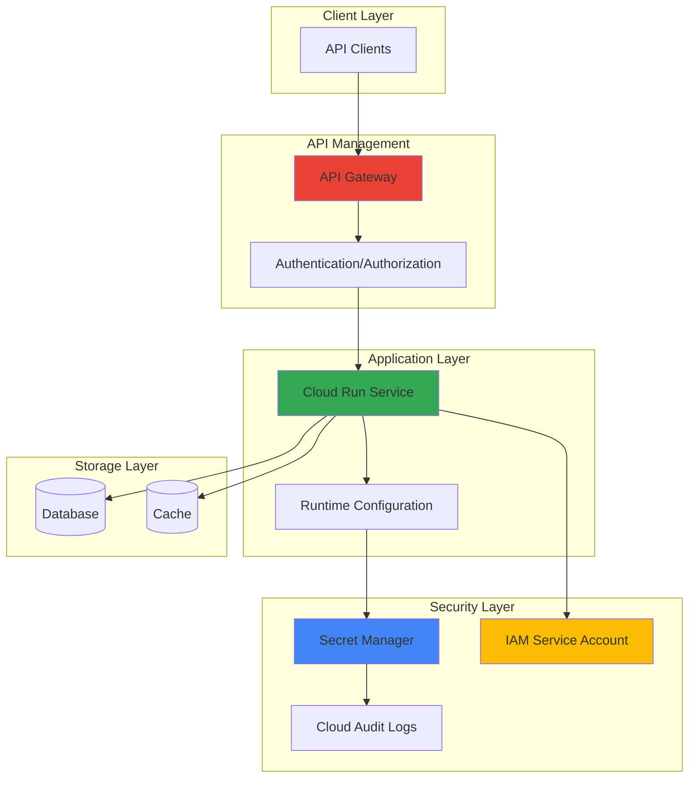

# Secure API Configuration Management with Secret Manager and Cloud Run

## Problem

Modern API deployments require secure management of sensitive configuration data like database credentials, API keys, and encryption certificates, but storing these secrets in container images or environment variables creates significant security vulnerabilities and operational complexity. Organizations struggle with secret rotation, access control, and maintaining separation between application code and sensitive configuration data, leading to potential data breaches and compliance violations when secrets are hardcoded or improperly managed.

## Solution

Build a secure API deployment pipeline that leverages Google Cloud Secret Manager for centralized secret storage, Cloud Run for containerized API hosting with secure secret access patterns, and API Gateway for managed API authentication and authorization. This approach provides automatic secret rotation capabilities, runtime configuration updates without redeployment, and comprehensive audit logging while maintaining the principle of least privilege access control.

## Architecture Diagram



## Prerequisites

1. Google Cloud account with billing enabled and project creation permissions
2. gcloud CLI installed and configured (or use Cloud Shell)
3. Understanding of containerization concepts and REST API security principles
4. Basic knowledge of IAM roles and service accounts in Google Cloud
5. Estimated cost: $10-20 for resources created during this recipe (excluding free tier usage)

> **Note**: This recipe follows Google Cloud security best practices and the Well-Architected Framework. Resources created will be minimal cost but should be cleaned up after completion.

## Preparation

```bash
# Set environment variables for GCP resources
export PROJECT_ID="secure-api-$(date +%s)"
export REGION="us-central1"
export ZONE="us-central1-a"

# Generate unique suffix for resource names
RANDOM_SUFFIX=$(openssl rand -hex 3)
export SERVICE_NAME="secure-api-${RANDOM_SUFFIX}"
export SECRET_NAME="api-config-${RANDOM_SUFFIX}"
export SA_NAME="secure-api-sa-${RANDOM_SUFFIX}"
export GATEWAY_NAME="api-gateway-${RANDOM_SUFFIX}"

# Create new project for this recipe
gcloud projects create ${PROJECT_ID} --name="Secure API Configuration"

# Set default project and region
gcloud config set project ${PROJECT_ID}
gcloud config set compute/region ${REGION}
gcloud config set compute/zone ${ZONE}

# Enable required APIs
gcloud services enable secretmanager.googleapis.com
gcloud services enable run.googleapis.com
gcloud services enable apigateway.googleapis.com
gcloud services enable servicecontrol.googleapis.com
gcloud services enable servicemanagement.googleapis.com
gcloud services enable cloudbuild.googleapis.com

echo "✅ Project configured: ${PROJECT_ID}"
echo "✅ Service name: ${SERVICE_NAME}"
echo "✅ Secret name: ${SECRET_NAME}"
```

## Steps

1. **Create Secret Manager Secrets for API Configuration**:

   Secret Manager provides secure, centralized storage for sensitive configuration data with built-in versioning, access control, and audit logging. Creating secrets before application deployment ensures that sensitive data never appears in container images or deployment manifests, following security best practices for secrets management.

   ```bash
   # Create database connection secret
   echo '{"host":"db.example.com","port":5432,"username":"api_user","password":"secure_db_password_123"}' | \
       gcloud secrets create ${SECRET_NAME}-db \
       --data-file=-
   
   # Create API keys secret
   echo '{"external_api_key":"sk-1234567890abcdef","jwt_secret":"jwt_signing_key_xyz789","encryption_key":"aes256_encryption_key_abc123"}' | \
       gcloud secrets create ${SECRET_NAME}-keys \
       --data-file=-
   
   # Create application configuration secret
   echo '{"debug_mode":false,"rate_limit":1000,"cache_ttl":3600,"log_level":"INFO"}' | \
       gcloud secrets create ${SECRET_NAME}-config \
       --data-file=-
   
   echo "✅ Secrets created successfully"
   ```

   The secrets are now stored with automatic encryption at rest and versioning enabled. Each secret can be independently managed and rotated without affecting the running application, providing operational flexibility and enhanced security posture.

2. **Create Service Account with Least Privilege Access**:

   Following the principle of least privilege, create a dedicated service account that has only the minimal permissions required to access specific secrets. This approach limits the blast radius of potential security incidents and provides granular audit logging for secret access operations.

   ```bash
   # Create service account for Cloud Run service
   gcloud iam service-accounts create ${SA_NAME} \
       --display-name="Secure API Service Account" \
       --description="Service account for secure API with Secret Manager access"
   
   # Grant Secret Manager accessor role for specific secrets only
   gcloud secrets add-iam-policy-binding ${SECRET_NAME}-db \
       --member="serviceAccount:${SA_NAME}@${PROJECT_ID}.iam.gserviceaccount.com" \
       --role="roles/secretmanager.secretAccessor"
   
   gcloud secrets add-iam-policy-binding ${SECRET_NAME}-keys \
       --member="serviceAccount:${SA_NAME}@${PROJECT_ID}.iam.gserviceaccount.com" \
       --role="roles/secretmanager.secretAccessor"
   
   gcloud secrets add-iam-policy-binding ${SECRET_NAME}-config \
       --member="serviceAccount:${SA_NAME}@${PROJECT_ID}.iam.gserviceaccount.com" \
       --role="roles/secretmanager.secretAccessor"
   
   echo "✅ Service account created with least privilege access"
   ```

   The service account now has access only to the specific secrets needed by the application, with all access logged through Cloud Audit Logs for security monitoring and compliance requirements.

3. **Create Sample API Application with Secret Integration**:

   Build a containerized API application that demonstrates secure secret retrieval patterns using the Google Cloud Secret Manager client library. This approach eliminates the need to expose secrets through environment variables or configuration files, providing runtime secret access with built-in retry logic and caching.

   ```bash
   # Create application directory
   mkdir -p ~/secure-api-app
   cd ~/secure-api-app
   
   # Create main application file
   cat > main.py << 'EOF'
   import json
   import os
   from flask import Flask, jsonify, request
   from google.cloud import secretmanager
   import logging
   
   app = Flask(__name__)
   logging.basicConfig(level=logging.INFO)
   
   # Initialize Secret Manager client
   client = secretmanager.SecretManagerServiceClient()
   project_id = os.environ.get('GOOGLE_CLOUD_PROJECT')
   
   def get_secret(secret_name):
       """Retrieve secret from Secret Manager with error handling"""
       try:
           name = f"projects/{project_id}/secrets/{secret_name}/versions/latest"
           response = client.access_secret_version(request={"name": name})
           return json.loads(response.payload.data.decode("UTF-8"))
       except Exception as e:
           logging.error(f"Failed to retrieve secret {secret_name}: {e}")
           return None
   
   @app.route('/health')
   def health_check():
       return jsonify({"status": "healthy", "service": "secure-api"})
   
   @app.route('/config')
   def get_configuration():
       """Return non-sensitive configuration"""
       config = get_secret(os.environ.get('CONFIG_SECRET_NAME'))
       if config:
           # Remove sensitive data before returning
           safe_config = {
               "debug_mode": config.get("debug_mode"),
               "rate_limit": config.get("rate_limit"),
               "cache_ttl": config.get("cache_ttl"),
               "log_level": config.get("log_level")
           }
           return jsonify(safe_config)
       return jsonify({"error": "Configuration unavailable"}), 500
   
   @app.route('/database/status')
   def database_status():
       """Check database connectivity using secrets"""
       db_config = get_secret(os.environ.get('DB_SECRET_NAME'))
       if db_config:
           return jsonify({
               "database": "connected",
               "host": db_config.get("host"),
               "port": db_config.get("port")
           })
       return jsonify({"error": "Database configuration unavailable"}), 500
   
   @app.route('/api/data')
   def get_data():
       """Sample API endpoint with authentication"""
       api_keys = get_secret(os.environ.get('KEYS_SECRET_NAME'))
       if not api_keys:
           return jsonify({"error": "API keys unavailable"}), 500
       
       # Simulate API key validation
       auth_header = request.headers.get('Authorization')
       if not auth_header or auth_header != f"Bearer {api_keys.get('external_api_key')}":
           return jsonify({"error": "Unauthorized"}), 401
       
       return jsonify({
           "data": "sensitive_api_data",
           "timestamp": "2025-07-12T10:00:00Z",
           "source": "secure-api"
       })
   
   if __name__ == '__main__':
       app.run(host='0.0.0.0', port=int(os.environ.get('PORT', 8080)))
   EOF
   
   # Create requirements file
   cat > requirements.txt << 'EOF'
   Flask==2.3.3
   google-cloud-secret-manager==2.18.1
   gunicorn==21.2.0
   EOF
   
   # Create Dockerfile with security best practices
   cat > Dockerfile << 'EOF'
   FROM python:3.11-slim
   
   # Create non-root user for security
   RUN groupadd -r appuser && useradd -r -g appuser appuser
   
   # Set working directory
   WORKDIR /app
   
   # Copy and install dependencies
   COPY requirements.txt .
   RUN pip install --no-cache-dir -r requirements.txt
   
   # Copy application code
   COPY main.py .
   
   # Switch to non-root user
   USER appuser
   
   # Expose port
   EXPOSE 8080
   
   # Run application
   CMD ["gunicorn", "--bind", "0.0.0.0:8080", "--workers", "2", "main:app"]
   EOF
   
   echo "✅ API application created with secure secret integration"
   ```

   The application now implements secure secret retrieval patterns with proper error handling, logging, and non-root container execution following container security best practices.

4. **Build and Deploy Secure Cloud Run Service**:

   Deploy the containerized API to Cloud Run with the custom service account and environment variables that reference secret names rather than secret values. This approach ensures secrets are retrieved at runtime and never stored in the container registry or deployment configuration.

   ```bash
   # Build container image using Cloud Build
   gcloud builds submit --tag gcr.io/${PROJECT_ID}/${SERVICE_NAME}
   
   # Deploy to Cloud Run with secret configuration
   gcloud run deploy ${SERVICE_NAME} \
       --image gcr.io/${PROJECT_ID}/${SERVICE_NAME} \
       --service-account ${SA_NAME}@${PROJECT_ID}.iam.gserviceaccount.com \
       --set-env-vars="DB_SECRET_NAME=${SECRET_NAME}-db,KEYS_SECRET_NAME=${SECRET_NAME}-keys,CONFIG_SECRET_NAME=${SECRET_NAME}-config" \
       --platform managed \
       --region ${REGION} \
       --allow-unauthenticated \
       --memory 512Mi \
       --cpu 1 \
       --max-instances 10 \
       --port 8080
   
   # Get service URL for testing
   export SERVICE_URL=$(gcloud run services describe ${SERVICE_NAME} \
       --region=${REGION} \
       --format='value(status.url)')
   
   echo "✅ Cloud Run service deployed successfully"
   echo "Service URL: ${SERVICE_URL}"
   ```

   The Cloud Run service is now running with secure secret access, automatic scaling, and the ability to retrieve updated secret values without redeployment, providing both security and operational flexibility.

5. **Create OpenAPI Specification for API Gateway**:

   Define a comprehensive OpenAPI specification that includes authentication requirements, rate limiting, and request validation. API Gateway uses this specification to enforce security policies and provide managed API access with built-in monitoring and analytics.

   ```bash
   # Create OpenAPI specification with security definitions
   cat > api-spec.yaml << EOF
   swagger: '2.0'
   info:
     title: Secure API Gateway
     description: API Gateway for secure configuration management
     version: 1.0.0
   schemes:
     - https
   produces:
     - application/json
   securityDefinitions:
     api_key:
       type: apiKey
       name: key
       in: query
   paths:
     /health:
       get:
         summary: Health check endpoint
         operationId: healthCheck
         responses:
           200:
             description: Service is healthy
         x-google-backend:
           address: ${SERVICE_URL}
     /config:
       get:
         summary: Get application configuration
         operationId: getConfig
         security:
           - api_key: []
         responses:
           200:
             description: Configuration retrieved successfully
           500:
             description: Configuration unavailable
         x-google-backend:
           address: ${SERVICE_URL}
     /database/status:
       get:
         summary: Check database connectivity
         operationId: databaseStatus
         security:
           - api_key: []
         responses:
           200:
             description: Database status retrieved
           500:
             description: Database configuration unavailable
         x-google-backend:
           address: ${SERVICE_URL}
     /api/data:
       get:
         summary: Get secure API data
         operationId: getSecureData
         security:
           - api_key: []
         parameters:
           - name: Authorization
             in: header
             type: string
             required: true
         responses:
           200:
             description: Data retrieved successfully
           401:
             description: Unauthorized access
           500:
             description: API keys unavailable
         x-google-backend:
           address: ${SERVICE_URL}
   EOF
   
   echo "✅ OpenAPI specification created"
   ```

   The API specification now defines secure endpoints with authentication requirements and proper backend routing to the Cloud Run service.

6. **Deploy API Gateway with Security Configuration**:

   Create and deploy an API Gateway configuration that enforces authentication, implements rate limiting, and provides centralized API management. This adds an additional security layer between clients and the backend service while enabling API versioning and monitoring capabilities.

   ```bash
   # Create API configuration
   gcloud api-gateway api-configs create ${GATEWAY_NAME}-config \
       --api=${GATEWAY_NAME} \
       --openapi-spec=api-spec.yaml \
       --project=${PROJECT_ID}
   
   # Create API Gateway
   gcloud api-gateway gateways create ${GATEWAY_NAME} \
       --api=${GATEWAY_NAME} \
       --api-config=${GATEWAY_NAME}-config \
       --location=${REGION} \
       --project=${PROJECT_ID}
   
   # Wait for gateway deployment
   echo "Waiting for API Gateway deployment..."
   sleep 60
   
   # Get gateway URL
   export GATEWAY_URL=$(gcloud api-gateway gateways describe ${GATEWAY_NAME} \
       --location=${REGION} \
       --format='value(defaultHostname)')
   
   echo "✅ API Gateway deployed successfully"
   echo "Gateway URL: https://${GATEWAY_URL}"
   ```

   The API Gateway is now active and providing managed access to the backend Cloud Run service with security policies enforced at the gateway level.

7. **Create API Key for Gateway Authentication**:

   Generate an API key for authenticating requests to the API Gateway. This provides a simple but effective authentication mechanism that can be easily managed and rotated through the Google Cloud console or CLI.

   ```bash
   # Create API key for gateway access
   gcloud alpha services api-keys create \
       --display-name="Secure API Gateway Key" \
       --api-target-service=apigateway.googleapis.com
   
   # List API keys to get the key value
   export API_KEY=$(gcloud alpha services api-keys list \
       --filter="displayName:Secure API Gateway Key" \
       --format='value(name)' | head -1)
   
   # Get the actual key string
   export API_KEY_STRING=$(gcloud alpha services api-keys get-key-string $API_KEY)
   
   echo "✅ API key created successfully"
   echo "API Key: ${API_KEY_STRING}"
   ```

   The API key provides controlled access to the API Gateway while maintaining audit trails for all API requests and enabling fine-grained access control policies.

8. **Configure Secret Rotation and Monitoring**:

   Implement automated secret rotation policies and comprehensive monitoring to ensure ongoing security and operational visibility. This includes setting up Cloud Monitoring alerts for secret access patterns and failed authentication attempts.

   ```bash
   # Create new version of a secret (demonstrating rotation)
   echo '{"host":"db.example.com","port":5432,"username":"api_user","password":"rotated_password_456"}' | \
       gcloud secrets versions add ${SECRET_NAME}-db \
       --data-file=-
   
   # Create monitoring policy for secret access
   gcloud alpha monitoring policies create \
       --policy-from-file=<(cat << 'EOF'
   {
     "displayName": "Secret Manager Access Monitoring",
     "conditions": [
       {
         "displayName": "High secret access rate",
         "conditionThreshold": {
           "filter": "resource.type=\"secret_manager_secret\"",
           "comparison": "COMPARISON_GREATER_THAN",
           "thresholdValue": 100,
           "duration": "300s"
         }
       }
     ],
     "alertStrategy": {
       "autoClose": "1800s"
     }
   }
   EOF
   )
   
   # Enable audit logs for Secret Manager
   gcloud logging sinks create secret-manager-audit \
       cloudstorage.googleapis.com/projects/${PROJECT_ID}/buckets/${PROJECT_ID}-audit-logs \
       --log-filter='protoPayload.serviceName="secretmanager.googleapis.com"'
   
   echo "✅ Secret rotation and monitoring configured"
   ```

   Monitoring and rotation capabilities are now in place to ensure ongoing security and compliance with automated alerting for unusual access patterns.

## Validation & Testing

1. **Verify Cloud Run Service Health and Secret Access**:

   ```bash
   # Test health endpoint
   curl -s "${SERVICE_URL}/health" | jq '.'
   ```

   Expected output:
   ```json
   {
     "status": "healthy",
     "service": "secure-api"
   }
   ```

2. **Test API Gateway with Authentication**:

   ```bash
   # Test authenticated endpoint through API Gateway
   curl -s "https://${GATEWAY_URL}/config?key=${API_KEY_STRING}" | jq '.'
   ```

   Expected output:
   ```json
   {
     "debug_mode": false,
     "rate_limit": 1000,
     "cache_ttl": 3600,
     "log_level": "INFO"
   }
   ```

3. **Validate Secret Manager Integration**:

   ```bash
   # Test database status endpoint
   curl -s "https://${GATEWAY_URL}/database/status?key=${API_KEY_STRING}" | jq '.'
   
   # Test secure data endpoint with Bearer token
   curl -s -H "Authorization: Bearer sk-1234567890abcdef" \
       "https://${GATEWAY_URL}/api/data?key=${API_KEY_STRING}" | jq '.'
   ```

4. **Verify Security and Access Controls**:

   ```bash
   # Test unauthorized access (should fail)
   curl -s "https://${GATEWAY_URL}/config" | jq '.'
   
   # Verify secret access logs
   gcloud logging read 'protoPayload.serviceName="secretmanager.googleapis.com"' \
       --limit=5 --format=json
   ```

## Cleanup

1. **Remove API Gateway and Configuration**:

   ```bash
   # Delete API Gateway
   gcloud api-gateway gateways delete ${GATEWAY_NAME} \
       --location=${REGION} \
       --quiet
   
   # Delete API configuration
   gcloud api-gateway api-configs delete ${GATEWAY_NAME}-config \
       --api=${GATEWAY_NAME} \
       --quiet
   
   # Delete API
   gcloud api-gateway apis delete ${GATEWAY_NAME} \
       --quiet
   
   echo "✅ API Gateway resources deleted"
   ```

2. **Remove Cloud Run Service and Container Image**:

   ```bash
   # Delete Cloud Run service
   gcloud run services delete ${SERVICE_NAME} \
       --region=${REGION} \
       --quiet
   
   # Delete container image
   gcloud container images delete gcr.io/${PROJECT_ID}/${SERVICE_NAME} \
       --quiet
   
   echo "✅ Cloud Run service and image deleted"
   ```

3. **Remove Service Account and IAM Bindings**:

   ```bash
   # Delete service account
   gcloud iam service-accounts delete ${SA_NAME}@${PROJECT_ID}.iam.gserviceaccount.com \
       --quiet
   
   echo "✅ Service account deleted"
   ```

4. **Remove Secret Manager Secrets**:

   ```bash
   # Delete all secrets
   gcloud secrets delete ${SECRET_NAME}-db --quiet
   gcloud secrets delete ${SECRET_NAME}-keys --quiet
   gcloud secrets delete ${SECRET_NAME}-config --quiet
   
   echo "✅ Secrets deleted"
   ```

5. **Delete Project and All Resources**:

   ```bash
   # Delete the entire project
   gcloud projects delete ${PROJECT_ID} --quiet
   
   echo "✅ Project and all resources deleted"
   echo "Note: Project deletion may take several minutes to complete"
   ```

## Discussion

This recipe demonstrates a comprehensive approach to secure API configuration management using Google Cloud's managed services. The architecture separates concerns between secret storage (Secret Manager), application hosting (Cloud Run), and API management (API Gateway), creating multiple layers of security and operational flexibility. Secret Manager provides enterprise-grade secret storage with automatic encryption, versioning, and audit logging, while Cloud Run offers serverless container hosting with built-in security features and automatic scaling.

The implementation follows Google Cloud security best practices by utilizing IAM service accounts with least privilege access, avoiding secret exposure in container images or environment variables, and implementing secure secret retrieval patterns at runtime. The API Gateway adds an additional security layer with authentication, rate limiting, and centralized API management capabilities. This approach enables secret rotation without application redeployment, comprehensive audit logging for compliance requirements, and scalable API access patterns that can handle production workloads.

The solution addresses common security challenges in API deployment including secret sprawl, configuration drift, and access control complexity. By centralizing secret management and implementing secure access patterns, organizations can maintain security while enabling developer productivity and operational efficiency. The architecture supports advanced features like automatic secret rotation, fine-grained access controls, and integration with existing CI/CD pipelines for automated deployment workflows.

> **Tip**: Consider implementing secret caching in your applications to reduce Secret Manager API calls and improve performance, while ensuring cache invalidation strategies for security-sensitive secrets. The Google Cloud Secret Manager client libraries provide built-in caching capabilities that can be tuned for your specific use case.

For additional guidance on Google Cloud security best practices, refer to the [Google Cloud Security Command Center documentation](https://cloud.google.com/security-command-center/docs), [Secret Manager best practices guide](https://cloud.google.com/secret-manager/docs/best-practices), [Cloud Run security documentation](https://cloud.google.com/run/docs/securing), [API Gateway authentication methods](https://cloud.google.com/api-gateway/docs/authentication-method), and the [Google Cloud Architecture Framework](https://cloud.google.com/architecture/framework).

## Challenge

Extend this solution by implementing these enhancements:

1. **Implement Automatic Secret Rotation**: Set up Cloud Scheduler and Cloud Functions to automatically rotate database passwords and API keys on a schedule, updating Secret Manager versions and notifying dependent services.

2. **Add Multi-Environment Support**: Create separate projects for development, staging, and production environments with environment-specific secrets and API Gateway configurations, implementing promotion workflows between environments.

3. **Integrate with External Identity Providers**: Replace API key authentication with OAuth 2.0 or JWT tokens from external identity providers like Auth0 or Firebase Authentication, implementing fine-grained authorization policies.

4. **Implement Advanced Monitoring and Alerting**: Set up comprehensive monitoring using Cloud Monitoring and Cloud Logging to track secret access patterns, API performance metrics, and security anomalies with automated incident response workflows.

5. **Add Blue/Green Deployment Capabilities**: Implement blue/green deployment strategies for the Cloud Run service with traffic splitting capabilities, allowing for zero-downtime updates and rollback procedures while maintaining secret consistency across deployments.

## Infrastructure Code

*Infrastructure code will be generated after recipe approval.*