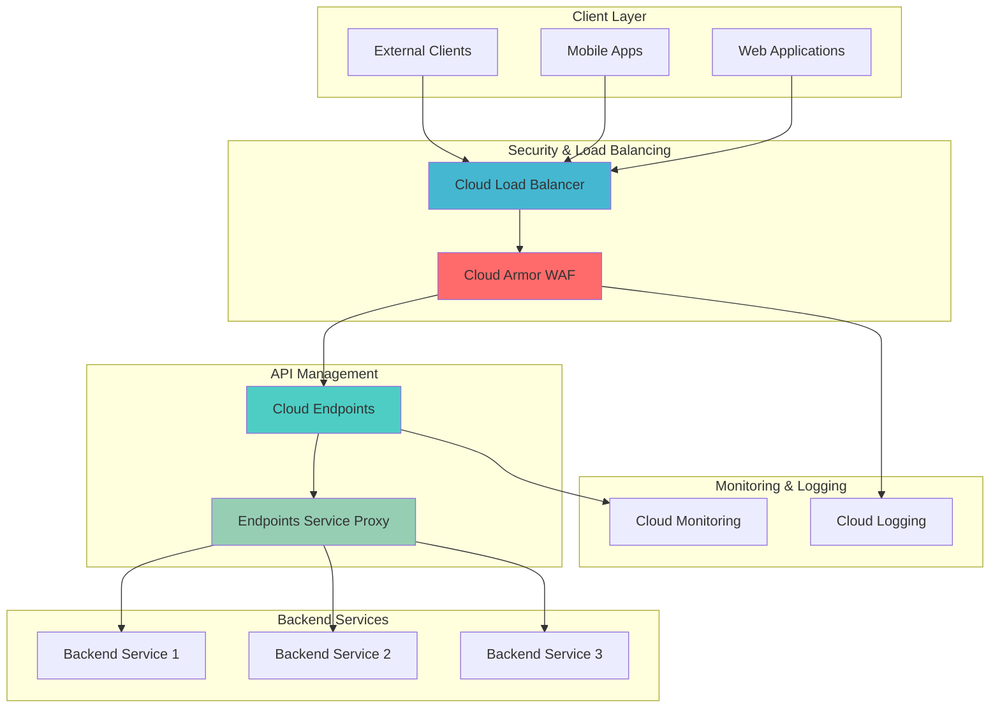

# Secure API Gateway Architecture with Cloud Endpoints and Cloud Armor

## Problem

Enterprise applications require robust API gateways that can handle high-volume traffic while protecting against DDoS attacks, malicious requests, and unauthorized access. Many organizations struggle with implementing comprehensive security policies, rate limiting, and monitoring across their API infrastructure without compromising performance or increasing operational complexity.

## Solution

Build a production-ready API gateway using Cloud Endpoints for API management and authentication, Cloud Armor for DDoS protection and Web Application Firewall (WAF) capabilities, and Cloud Load Balancing for high availability. This architecture provides enterprise-grade security, automated threat protection, and comprehensive monitoring while maintaining optimal performance and scalability.

## Architecture Diagram



## Prerequisites

1. Google Cloud account with billing enabled and appropriate IAM permissions (Project Editor or custom roles for Compute Engine, Cloud Endpoints, Cloud Armor, and Load Balancing)
2. Google Cloud CLI (gcloud) installed and configured (version 400.0.0 or later)
3. Basic understanding of REST APIs, HTTP load balancing, and security concepts
4. Knowledge of OpenAPI specifications and container deployment concepts
5. Estimated cost: $50-100/month for production workloads (varies based on traffic volume and attack mitigation usage)

> **Note**: Cloud Armor charges are based on the number of rules and requests processed. Review [Cloud Armor pricing](https://cloud.google.com/armor/pricing) for detailed cost calculations based on your expected traffic patterns.

## Preparation

```bash
# Set environment variables for GCP resources
export PROJECT_ID="secure-api-gateway-$(date +%s | tail -c 6)"
export REGION="us-central1"
export ZONE="us-central1-a"

# Generate unique suffix for resource names
RANDOM_SUFFIX=$(openssl rand -hex 3)
export API_NAME="secure-api-${RANDOM_SUFFIX}"
export BACKEND_SERVICE_NAME="api-backend-${RANDOM_SUFFIX}"
export SECURITY_POLICY_NAME="api-security-policy-${RANDOM_SUFFIX}"

# Create and set default project
gcloud projects create ${PROJECT_ID} --name="Secure API Gateway Demo"
gcloud config set project ${PROJECT_ID}
gcloud config set compute/region ${REGION}
gcloud config set compute/zone ${ZONE}

# Enable required APIs
gcloud services enable compute.googleapis.com
gcloud services enable servicemanagement.googleapis.com
gcloud services enable servicecontrol.googleapis.com
gcloud services enable endpoints.googleapis.com
gcloud services enable logging.googleapis.com
gcloud services enable monitoring.googleapis.com

echo "✅ Project configured: ${PROJECT_ID}"
echo "✅ APIs enabled and environment ready"
```

## Steps

1. **Create Backend Service Infrastructure**:

   Google Cloud Endpoints requires backend services to proxy API requests to your actual application infrastructure. We'll create a simple backend service running on Compute Engine that demonstrates API functionality while serving as the foundation for our secure gateway architecture.

   ```bash
   # Create a VM instance for backend service
   gcloud compute instances create ${BACKEND_SERVICE_NAME} \
       --zone=${ZONE} \
       --machine-type=e2-medium \
       --network-tier=PREMIUM \
       --maintenance-policy=MIGRATE \
       --image-family=debian-11 \
       --image-project=debian-cloud \
       --boot-disk-size=20GB \
       --boot-disk-type=pd-standard \
       --tags=backend-service,http-server \
       --metadata=startup-script='#!/bin/bash
   apt-get update
   apt-get install -y python3 python3-pip
   pip3 install flask
   cat > /opt/api-server.py << EOF
   from flask import Flask, jsonify, request
   import datetime
   
   app = Flask(__name__)
   
   @app.route("/health", methods=["GET"])
   def health():
       return jsonify({"status": "healthy", "timestamp": datetime.datetime.now().isoformat()})
   
   @app.route("/api/v1/users", methods=["GET"])
   def get_users():
       return jsonify({"users": [{"id": 1, "name": "Alice"}, {"id": 2, "name": "Bob"}]})
   
   @app.route("/api/v1/data", methods=["POST"])
   def create_data():
       data = request.get_json()
       return jsonify({"message": "Data received", "data": data, "id": 12345})
   
   if __name__ == "__main__":
       app.run(host="0.0.0.0", port=8080)
   EOF
   
   # Start the API server
   nohup python3 /opt/api-server.py > /var/log/api-server.log 2>&1 &'
   
   echo "✅ Backend service VM created and starting"
   ```

   The backend service is now deployed with a simple Flask API that provides health checks and basic CRUD operations. This service will receive traffic through our secure API gateway architecture, demonstrating how Cloud Endpoints and Cloud Armor protect and manage API access.

2. **Create OpenAPI Specification for Cloud Endpoints**:

   Cloud Endpoints uses OpenAPI specifications to understand your API structure, authentication requirements, and routing rules. This specification serves as the contract between external clients and your backend services, enabling automatic request validation and documentation generation.

   ```bash
   # Create OpenAPI specification file
   cat > openapi-spec.yaml << EOF
   swagger: "2.0"
   info:
     title: "Secure API Gateway Demo"
     description: "Production-ready API with Cloud Endpoints and Cloud Armor"
     version: "1.0.0"
   host: "${API_NAME}.endpoints.${PROJECT_ID}.cloud.goog"
   schemes:
     - "https"
   produces:
     - "application/json"
   paths:
     "/health":
       get:
         summary: "Health check endpoint"
         operationId: "healthCheck"
         responses:
           200:
             description: "Service is healthy"
     "/api/v1/users":
       get:
         summary: "Get users list"
         operationId: "getUsers"
         security:
           - api_key: []
         responses:
           200:
             description: "Users retrieved successfully"
     "/api/v1/data":
       post:
         summary: "Create new data"
         operationId: "createData"
         security:
           - api_key: []
         parameters:
           - in: "body"
             name: "body"
             required: true
             schema:
               type: "object"
         responses:
           200:
             description: "Data created successfully"
   securityDefinitions:
     api_key:
       type: "apiKey"
       name: "key"
       in: "query"
   x-google-backend:
     address: "http://${BACKEND_SERVICE_NAME}.${ZONE}.c.${PROJECT_ID}.internal:8080"
     protocol: "http"
   EOF
   
   echo "✅ OpenAPI specification created with security definitions"
   ```

   The OpenAPI specification defines API endpoints, authentication requirements, and backend routing. The `x-google-backend` extension tells Cloud Endpoints how to route requests to your backend services, while security definitions ensure only authenticated requests reach your APIs.

3. **Deploy API Configuration to Cloud Endpoints**:

   Cloud Endpoints requires deploying your API configuration before it can begin managing traffic. This deployment process validates your OpenAPI specification, configures routing rules, and prepares the managed service infrastructure.

   ```bash
   # Deploy the API configuration to Cloud Endpoints
   gcloud endpoints services deploy openapi-spec.yaml
   
   # Wait for service deployment to complete
   sleep 30
   
   # Get the service configuration ID
   export CONFIG_ID=$(gcloud endpoints configs list \
       --service=${API_NAME}.endpoints.${PROJECT_ID}.cloud.goog \
       --format="value(id)" \
       --limit=1)
   
   # Create API key for authentication
   export API_KEY=$(gcloud services api-keys create \
       --display-name="Secure API Gateway Key" \
       --api-target=service=${API_NAME}.endpoints.${PROJECT_ID}.cloud.goog \
       --format="value(keyString)")
   
   echo "✅ API configuration deployed with ID: ${CONFIG_ID}"
   echo "✅ API key created: ${API_KEY}"
   ```

   Cloud Endpoints has successfully deployed your API configuration and generated a managed service endpoint. The API key provides authentication for client applications, while the configuration ID tracks your deployment version for rollback capabilities and change management.

4. **Create and Configure Cloud Armor Security Policy**:

   Cloud Armor provides Web Application Firewall (WAF) capabilities and DDoS protection for your API gateway. We'll create a comprehensive security policy that includes rate limiting, IP-based access controls, and protection against common web attacks like SQL injection and cross-site scripting.

   ```bash
   # Create Cloud Armor security policy
   gcloud compute security-policies create ${SECURITY_POLICY_NAME} \
       --description="Security policy for API gateway with rate limiting and threat protection"
   
   # Add rate limiting rule (100 requests per minute per IP)
   gcloud compute security-policies rules create 1000 \
       --security-policy=${SECURITY_POLICY_NAME} \
       --src-ip-ranges="*" \
       --action=rate-based-ban \
       --rate-limit-threshold-count=100 \
       --rate-limit-threshold-interval-sec=60 \
       --ban-duration-sec=300 \
       --conform-action=allow \
       --exceed-action=deny-429 \
       --enforce-on-key=IP
   
   # Add OWASP XSS protection rule
   gcloud compute security-policies rules create 2000 \
       --security-policy=${SECURITY_POLICY_NAME} \
       --expression="evaluatePreconfiguredExpr('xss-v33-stable')" \
       --action=deny-403
   
   # Add SQL injection protection
   gcloud compute security-policies rules create 3000 \
       --security-policy=${SECURITY_POLICY_NAME} \
       --expression="evaluatePreconfiguredExpr('sqli-v33-stable')" \
       --action=deny-403
   
   # Add geo-restriction (example: block traffic from specific countries)
   gcloud compute security-policies rules create 4000 \
       --security-policy=${SECURITY_POLICY_NAME} \
       --expression="origin.region_code == 'CN' || origin.region_code == 'RU'" \
       --action=deny-403
   
   echo "✅ Cloud Armor security policy created with comprehensive rules"
   ```

   Cloud Armor security policy is now active with multiple layers of protection including rate limiting, OWASP Top 10 threat detection, and geographic restrictions. These rules automatically protect your API against volumetric attacks, application-layer threats, and suspicious traffic patterns while maintaining legitimate user access.

5. **Deploy Endpoints Service Proxy (ESPv2)**:

   The Endpoints Service Proxy version 2 (ESPv2) acts as the gateway between Cloud Endpoints and your backend services. ESPv2 handles authentication, authorization, monitoring, and request transformation while providing the bridge between Google's managed API infrastructure and your application code.

   ```bash
   # Get the backend service internal IP
   export BACKEND_IP=$(gcloud compute instances describe ${BACKEND_SERVICE_NAME} \
       --zone=${ZONE} \
       --format="value(networkInterfaces[0].networkIP)")
   
   # Create ESPv2 container instance
   gcloud compute instances create-with-container esp-proxy-${RANDOM_SUFFIX} \
       --zone=${ZONE} \
       --machine-type=e2-medium \
       --network-tier=PREMIUM \
       --tags=esp-proxy,http-server,https-server \
       --container-image=gcr.io/endpoints-release/endpoints-runtime:2 \
       --container-env=ESPv2_ARGS="--service=${API_NAME}.endpoints.${PROJECT_ID}.cloud.goog --rollout_strategy=managed --backend=http://${BACKEND_IP}:8080" \
       --boot-disk-size=20GB \
       --boot-disk-type=pd-standard
   
   # Create firewall rules for ESPv2 proxy
   gcloud compute firewall-rules create allow-esp-proxy \
       --allow=tcp:8080 \
       --source-ranges=0.0.0.0/0 \
       --target-tags=esp-proxy \
       --description="Allow traffic to ESPv2 proxy"
   
   # Wait for ESPv2 to start
   sleep 60
   
   echo "✅ ESPv2 proxy deployed and configured"
   ```

   The Endpoints Service Proxy is now running and configured to handle API requests. ESPv2 automatically validates API keys, enforces rate limits defined in your OpenAPI specification, and forwards legitimate requests to your backend services while providing detailed logging and monitoring capabilities.

6. **Create Load Balancer with Cloud Armor Integration**:

   Google Cloud Load Balancing provides global distribution and high availability for your API gateway while integrating seamlessly with Cloud Armor for advanced security. This configuration ensures your APIs can handle traffic spikes while maintaining consistent security policies across all entry points.

   ```bash
   # Create instance group for ESPv2 proxy
   gcloud compute instance-groups unmanaged create esp-proxy-group \
       --zone=${ZONE} \
       --description="Instance group for ESPv2 proxy instances"
   
   gcloud compute instance-groups unmanaged add-instances esp-proxy-group \
       --zone=${ZONE} \
       --instances=esp-proxy-${RANDOM_SUFFIX}
   
   # Create health check
   gcloud compute health-checks create http esp-health-check \
       --port=8080 \
       --request-path=/health \
       --check-interval=30s \
       --timeout=10s \
       --healthy-threshold=2 \
       --unhealthy-threshold=3
   
   # Create backend service with Cloud Armor policy
   gcloud compute backend-services create esp-backend-service \
       --protocol=HTTP \
       --health-checks=esp-health-check \
       --global \
       --load-balancing-scheme=EXTERNAL \
       --security-policy=${SECURITY_POLICY_NAME}
   
   # Add instance group to backend service
   gcloud compute backend-services add-backend esp-backend-service \
       --instance-group=esp-proxy-group \
       --instance-group-zone=${ZONE} \
       --global
   
   echo "✅ Backend service created with Cloud Armor integration"
   ```

   The load balancer backend service is configured with health checks and Cloud Armor security policies. This ensures only healthy ESPv2 proxy instances receive traffic while all requests are processed through your comprehensive security rules for threat detection and mitigation.

7. **Configure URL Maps and Frontend Services**:

   URL maps define how incoming requests are routed to your backend services, while frontend services configure the external IP addresses and ports that clients use to access your API gateway. This final configuration step makes your secure API gateway accessible to external clients.

   ```bash
   # Create URL map
   gcloud compute url-maps create esp-url-map \
       --default-service=esp-backend-service \
       --global
   
   # Reserve static IP address
   gcloud compute addresses create esp-gateway-ip \
       --global
   
   export GATEWAY_IP=$(gcloud compute addresses describe esp-gateway-ip \
       --global --format="value(address)")
   
   # Create HTTP target proxy
   gcloud compute target-http-proxies create esp-http-proxy \
       --url-map=esp-url-map \
       --global
   
   # Create forwarding rule
   gcloud compute forwarding-rules create esp-forwarding-rule \
       --address=esp-gateway-ip \
       --global \
       --target-http-proxy=esp-http-proxy \
       --ports=80
   
   echo "✅ Load balancer configured with static IP: ${GATEWAY_IP}"
   echo "✅ API Gateway accessible at: http://${GATEWAY_IP}"
   ```

   Your secure API gateway is now fully operational with a static IP address and global load balancing. All incoming requests flow through Cloud Armor security policies, Cloud Endpoints authentication, and are proxied to your backend services through the ESPv2, providing enterprise-grade security and performance.

## Validation & Testing

1. **Verify Cloud Armor Security Policy**:

   ```bash
   # Check security policy status
   gcloud compute security-policies describe ${SECURITY_POLICY_NAME} \
       --format="table(name,description,rules[].priority,rules[].action)"
   
   # Verify backend service has security policy attached
   gcloud compute backend-services describe esp-backend-service \
       --global --format="value(securityPolicy)"
   ```

   Expected output: Security policy name should match your configuration, and rules should show priorities 1000-4000 with respective actions.

2. **Test API Authentication and Rate Limiting**:

   ```bash
   # Test unauthenticated request (should be denied)
   curl -w "%{http_code}\n" -o /dev/null -s \
       http://${GATEWAY_IP}/api/v1/users
   
   # Test authenticated request
   curl -w "%{http_code}\n" -s \
       "http://${GATEWAY_IP}/api/v1/users?key=${API_KEY}"
   
   # Test rate limiting (send 110 requests quickly)
   for i in {1..110}; do
       curl -s -o /dev/null -w "%{http_code} " \
           "http://${GATEWAY_IP}/health?key=${API_KEY}"
   done
   echo ""
   ```

   Expected output: Unauthenticated requests should return 401 or 403, authenticated requests should return 200, and rate limiting should trigger 429 responses after 100 requests.

3. **Verify Security Rule Enforcement**:

   ```bash
   # Test XSS protection (should be blocked)
   curl -w "%{http_code}\n" -o /dev/null -s \
       "http://${GATEWAY_IP}/api/v1/users?key=${API_KEY}&test=<script>alert('xss')</script>"
   
   # Test SQL injection protection (should be blocked)
   curl -w "%{http_code}\n" -o /dev/null -s \
       "http://${GATEWAY_IP}/api/v1/users?key=${API_KEY}&id=1' OR '1'='1"
   ```

   Expected output: Both malicious requests should return 403 status codes, indicating Cloud Armor successfully blocked the attacks.

## Cleanup

1. **Remove Load Balancer and Networking Resources**:

   ```bash
   # Delete forwarding rule and target proxy
   gcloud compute forwarding-rules delete esp-forwarding-rule \
       --global --quiet
   
   gcloud compute target-http-proxies delete esp-http-proxy \
       --global --quiet
   
   # Delete URL map and backend service
   gcloud compute url-maps delete esp-url-map \
       --global --quiet
   
   gcloud compute backend-services delete esp-backend-service \
       --global --quiet
   
   echo "✅ Load balancer resources deleted"
   ```

2. **Remove Security and Compute Resources**:

   ```bash
   # Delete Cloud Armor security policy
   gcloud compute security-policies delete ${SECURITY_POLICY_NAME} --quiet
   
   # Delete health check and instance group
   gcloud compute health-checks delete esp-health-check --quiet
   gcloud compute instance-groups unmanaged delete esp-proxy-group \
       --zone=${ZONE} --quiet
   
   # Delete compute instances
   gcloud compute instances delete esp-proxy-${RANDOM_SUFFIX} \
       --zone=${ZONE} --quiet
   gcloud compute instances delete ${BACKEND_SERVICE_NAME} \
       --zone=${ZONE} --quiet
   
   echo "✅ Compute and security resources deleted"
   ```

3. **Clean Up API Configuration and Project**:

   ```bash
   # Delete API key
   gcloud services api-keys delete \
       $(gcloud services api-keys list \
       --filter="displayName:'Secure API Gateway Key'" \
       --format="value(name)") --quiet
   
   # Delete static IP address
   gcloud compute addresses delete esp-gateway-ip --global --quiet
   
   # Delete firewall rules
   gcloud compute firewall-rules delete allow-esp-proxy --quiet
   
   # Delete project (optional - removes all resources)
   gcloud projects delete ${PROJECT_ID} --quiet
   
   echo "✅ All resources cleaned up successfully"
   echo "Note: Project deletion may take several minutes to complete"
   ```

## Discussion

This secure API gateway architecture demonstrates how Google Cloud's managed services work together to provide enterprise-grade API security and performance. Cloud Endpoints handles the API management layer, providing authentication, monitoring, and developer-friendly features like automatic documentation generation and SDK creation. The service integrates seamlessly with OpenAPI specifications, making it easy to define and enforce API contracts while maintaining compatibility with existing development workflows.

Cloud Armor adds a crucial security layer by providing Web Application Firewall capabilities and DDoS protection at Google's network edge. The security policies we implemented protect against OWASP Top 10 vulnerabilities, implement geographic restrictions, and provide rate limiting to prevent abuse. This edge-based protection ensures malicious traffic is blocked before it reaches your application infrastructure, reducing costs and improving performance for legitimate users. The updated security rule expressions use the latest stable rulesets (`xss-v33-stable` and `sqli-v33-stable`) which provide enhanced threat detection capabilities.

The integration of Cloud Load Balancing provides global distribution and high availability while serving as the integration point between Cloud Armor and your backend services. This architecture can automatically scale to handle traffic spikes while maintaining consistent security policies across all regions. For production deployments, consider implementing SSL/TLS termination, custom domains, and advanced monitoring with Cloud Operations to provide complete observability into your API performance and security posture.

The Endpoints Service Proxy version 2 (ESPv2) serves as the critical bridge between Google's managed API infrastructure and your application code. ESPv2 handles the complex tasks of request validation, authentication enforcement, and metrics collection while providing seamless integration with Google Cloud's monitoring and logging systems. This proxy architecture allows your backend services to focus on business logic while ESPv2 manages the operational concerns of API gateway functionality.

> **Tip**: For production environments, implement multiple ESPv2 proxy instances across different zones and configure autoscaling based on CPU utilization and request volume. This ensures high availability and optimal performance during traffic spikes.

Key documentation references for this implementation include the [Cloud Endpoints documentation](https://cloud.google.com/endpoints/docs) for API management patterns, [Cloud Armor security policies](https://cloud.google.com/armor/docs/security-policy-overview) for threat protection configuration, [Load Balancing best practices](https://cloud.google.com/load-balancing/docs/best-practices) for performance optimization, the [Google Cloud Architecture Framework](https://cloud.google.com/architecture/framework) for enterprise design patterns, and [Cloud Operations monitoring](https://cloud.google.com/monitoring/docs) for comprehensive observability setup.

## Challenge

Extend this solution by implementing these enhancements:

1. **SSL/TLS Termination and Custom Domains**: Configure Google-managed SSL certificates and custom domain names for production-ready HTTPS endpoints with proper certificate management and automatic renewal using Cloud Load Balancing SSL certificates.

2. **Advanced Rate Limiting and Quota Management**: Implement per-user quotas using Cloud Endpoints quotas feature, configure different rate limits for different API endpoints, and add request size limitations to prevent resource exhaustion attacks.

3. **Multi-Region Deployment with Failover**: Deploy the API gateway architecture across multiple regions with Cross-Region Load Balancing for global high availability and automatic failover capabilities using Google Cloud's Anycast IP addresses.

4. **Integration with Cloud IAM and Identity-Aware Proxy**: Replace API key authentication with Google Cloud IAM and implement Identity-Aware Proxy for enterprise SSO integration and fine-grained access controls based on user context.

5. **Advanced Monitoring and Alerting**: Set up comprehensive monitoring dashboards using Cloud Monitoring, implement SLI/SLO tracking for API performance, and configure alerting for security events and performance degradation using Cloud Operations suite.

## Infrastructure Code

### Available Infrastructure as Code:

- [Infrastructure Code Overview](code/README.md) - Detailed description of all infrastructure components
- [Infrastructure Manager](code/infrastructure-manager/) - GCP Infrastructure Manager templates
- [Bash CLI Scripts](code/scripts/) - Example bash scripts using gcloud CLI commands to deploy infrastructure
- [Terraform](code/terraform/) - Terraform configuration files