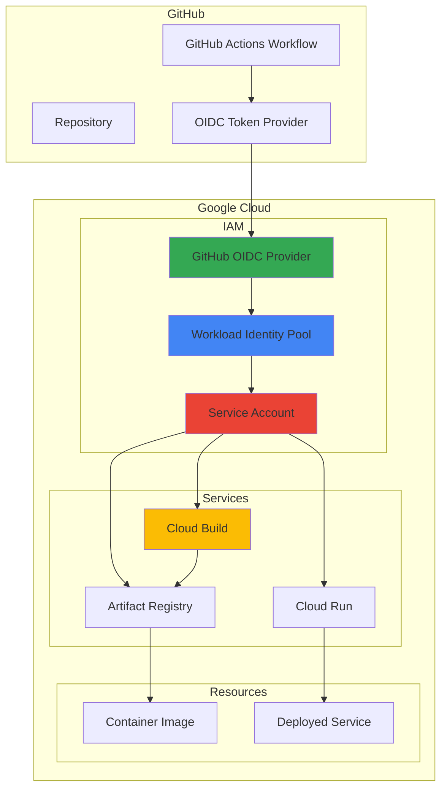

# Secure CI/CD Authentication with Workload Identity Federation and GitHub Actions

## Problem

Organizations struggle with securely authenticating CI/CD pipelines to Google Cloud while managing the security risks associated with long-lived service account keys. Traditional approaches require storing and rotating service account JSON keys as secrets, creating potential attack vectors and operational overhead. Development teams need a keyless authentication solution that maintains security while enabling seamless automation workflows for containerized application deployments.

## Solution

This recipe implements Workload Identity Federation (WIF) to establish keyless authentication between GitHub Actions and Google Cloud using OpenID Connect (OIDC) tokens. The solution eliminates service account keys by creating a trust relationship between GitHub's identity provider and Google Cloud IAM, allowing workflows to authenticate directly using short-lived tokens that are automatically validated and exchanged for Google Cloud credentials.

## Architecture Diagram



## Prerequisites

1. Google Cloud account with project owner permissions for IAM configuration
2. GitHub repository with Actions enabled and admin access
3. Google Cloud CLI (gcloud) installed and configured locally
4. Docker installed for local container testing (optional)
5. Estimated cost: $5-10 for Cloud Build, Artifact Registry, and Cloud Run during testing

> **Note**: Workload Identity Federation has no additional charges beyond the Google Cloud services used. This solution significantly reduces security overhead compared to managing service account keys.

## Preparation

```bash
# Set environment variables for the project
export PROJECT_ID="wif-demo-$(date +%s)"
export REGION="us-central1"
export ZONE="us-central1-a"

# GitHub-specific variables (replace with your values)
export GITHUB_REPO_OWNER="your-github-username"
export GITHUB_REPO_NAME="your-repo-name"
export GITHUB_REPO_FULL="${GITHUB_REPO_OWNER}/${GITHUB_REPO_NAME}"

# Generate unique identifiers for resources
RANDOM_SUFFIX=$(openssl rand -hex 3)
export WIF_POOL_ID="github-pool-${RANDOM_SUFFIX}"
export WIF_PROVIDER_ID="github-provider-${RANDOM_SUFFIX}"
export SERVICE_ACCOUNT_ID="github-actions-sa-${RANDOM_SUFFIX}"
export ARTIFACT_REPO_NAME="apps-${RANDOM_SUFFIX}"
export CLOUD_RUN_SERVICE="demo-app-${RANDOM_SUFFIX}"

# Create the Google Cloud project
gcloud projects create ${PROJECT_ID} --name="WIF Demo Project"
gcloud config set project ${PROJECT_ID}

# Enable required APIs
gcloud services enable iam.googleapis.com \
    cloudbuild.googleapis.com \
    artifactregistry.googleapis.com \
    run.googleapis.com \
    sts.googleapis.com \
    iamcredentials.googleapis.com

echo "✅ Project ${PROJECT_ID} created and configured"
echo "✅ Required APIs enabled"
```

## Steps

1. **Create Workload Identity Pool**:

   Workload Identity Federation requires a workload identity pool to manage external identities. This pool acts as a namespace for organizing and managing federated identities from external identity providers. The pool configuration establishes the security boundary and access controls for external workloads seeking to authenticate with Google Cloud resources.

   ```bash
   # Create the workload identity pool
   gcloud iam workload-identity-pools create ${WIF_POOL_ID} \
       --project=${PROJECT_ID} \
       --location="global" \
       --display-name="GitHub Actions Pool" \
       --description="Pool for GitHub Actions workflows"
   
   # Get the full pool resource name
   export WIF_POOL_NAME=$(gcloud iam workload-identity-pools \
       describe ${WIF_POOL_ID} \
       --project=${PROJECT_ID} \
       --location="global" \
       --format="value(name)")
   
   echo "✅ Workload Identity Pool created: ${WIF_POOL_NAME}"
   ```

   The workload identity pool is now established and ready to accept external identity providers. This foundational component enables secure, keyless authentication by providing a trusted environment for validating external credentials and mapping them to Google Cloud identities.

2. **Configure GitHub OIDC Provider**:

   GitHub provides OpenID Connect tokens that contain claims about the workflow, repository, and triggering context. Configuring GitHub as an OIDC provider in the workload identity pool establishes the trust relationship and defines how GitHub's identity tokens will be validated and mapped to Google Cloud principals.

   ```bash
   # Create the GitHub OIDC provider
   gcloud iam workload-identity-pools providers create-oidc \
       ${WIF_PROVIDER_ID} \
       --project=${PROJECT_ID} \
       --location="global" \
       --workload-identity-pool=${WIF_POOL_ID} \
       --display-name="GitHub OIDC Provider" \
       --attribute-mapping="google.subject=assertion.sub,attribute.actor=assertion.actor,attribute.repository=assertion.repository,attribute.repository_owner=assertion.repository_owner" \
       --attribute-condition="assertion.repository_owner=='${GITHUB_REPO_OWNER}'" \
       --issuer-uri="https://token.actions.githubusercontent.com"
   
   echo "✅ GitHub OIDC provider configured with repository restriction"
   ```

   The provider is configured with attribute mapping that extracts key information from GitHub's OIDC tokens, including the subject, actor (user), repository, and repository owner. The attribute condition ensures that only workflows from your specific GitHub organization can authenticate, providing an additional security layer.

3. **Create Service Account with Least Privilege**:

   Service accounts provide the actual Google Cloud permissions for authenticated workloads. Creating a dedicated service account with minimal required permissions follows the principle of least privilege, ensuring that GitHub Actions workflows can only access the specific Google Cloud resources needed for the CI/CD pipeline.

   ```bash
   # Create service account for GitHub Actions
   gcloud iam service-accounts create ${SERVICE_ACCOUNT_ID} \
       --project=${PROJECT_ID} \
       --display-name="GitHub Actions Service Account" \
       --description="Service account for GitHub Actions CI/CD workflows"
   
   # Get the service account email
   export SERVICE_ACCOUNT_EMAIL=$(gcloud iam service-accounts list \
       --project=${PROJECT_ID} \
       --filter="displayName:'GitHub Actions Service Account'" \
       --format="value(email)")
   
   # Grant necessary IAM roles for CI/CD operations
   gcloud projects add-iam-policy-binding ${PROJECT_ID} \
       --member="serviceAccount:${SERVICE_ACCOUNT_EMAIL}" \
       --role="roles/cloudbuild.builds.builder"
   
   gcloud projects add-iam-policy-binding ${PROJECT_ID} \
       --member="serviceAccount:${SERVICE_ACCOUNT_EMAIL}" \
       --role="roles/artifactregistry.writer"
   
   gcloud projects add-iam-policy-binding ${PROJECT_ID} \
       --member="serviceAccount:${SERVICE_ACCOUNT_EMAIL}" \
       --role="roles/run.developer"
   
   echo "✅ Service account created with CI/CD permissions: ${SERVICE_ACCOUNT_EMAIL}"
   ```

   The service account is now configured with specific roles for Cloud Build operations, Artifact Registry publishing, and Cloud Run deployment. This role assignment provides the minimum necessary permissions for a complete CI/CD workflow while maintaining security boundaries.

4. **Configure Workload Identity Federation Binding**:

   The final step in establishing the trust relationship involves granting the Workload Identity User role to the external identity. This binding allows GitHub Actions workflows to impersonate the service account and obtain Google Cloud credentials through the federation process.

   ```bash
   # Allow the GitHub repository to impersonate the service account
   gcloud iam service-accounts add-iam-policy-binding \
       ${SERVICE_ACCOUNT_EMAIL} \
       --project=${PROJECT_ID} \
       --role="roles/iam.workloadIdentityUser" \
       --member="principalSet://iam.googleapis.com/${WIF_POOL_NAME}/attribute.repository/${GITHUB_REPO_FULL}"
   
   # Get the provider resource name for GitHub Actions configuration
   export WIF_PROVIDER_NAME=$(gcloud iam workload-identity-pools providers \
       describe ${WIF_PROVIDER_ID} \
       --project=${PROJECT_ID} \
       --location="global" \
       --workload-identity-pool=${WIF_POOL_ID} \
       --format="value(name)")
   
   echo "✅ Workload Identity Federation binding configured"
   echo "Provider name: ${WIF_PROVIDER_NAME}"
   echo "Service account: ${SERVICE_ACCOUNT_EMAIL}"
   ```

   The federation binding is now active, creating a secure authentication path from GitHub Actions to Google Cloud. The principalSet configuration ensures that only workflows from the specified repository can assume the service account identity.

5. **Create Artifact Registry Repository**:

   Artifact Registry provides secure, private container image storage with fine-grained access controls and vulnerability scanning. Creating a dedicated repository for CI/CD artifacts ensures proper isolation and enables comprehensive image management throughout the software development lifecycle.

   ```bash
   # Create Artifact Registry repository for container images
   gcloud artifacts repositories create ${ARTIFACT_REPO_NAME} \
       --project=${PROJECT_ID} \
       --repository-format=docker \
       --location=${REGION} \
       --description="Repository for CI/CD container images"
   
   # Configure Docker authentication for the repository
   gcloud auth configure-docker ${REGION}-docker.pkg.dev --quiet
   
   echo "✅ Artifact Registry repository created: ${REGION}-docker.pkg.dev/${PROJECT_ID}/${ARTIFACT_REPO_NAME}"
   ```

   The Artifact Registry repository is configured and ready to receive container images from the CI/CD pipeline. This managed service provides enterprise-grade features including vulnerability scanning, access controls, and integration with Google Cloud's security and compliance tools.

6. **Create Sample Application and Dockerfile**:

   A simple containerized application demonstrates the complete CI/CD workflow from source code to deployed service. This sample application provides a realistic example while keeping the complexity focused on the authentication and deployment mechanisms rather than application logic.

   ```bash
   # Create application directory structure
   mkdir -p sample-app
   cd sample-app
   
   # Create a simple web application
   cat > app.py << 'EOF'
from flask import Flask, jsonify
import os
import datetime

app = Flask(__name__)

@app.route('/')
def hello():
    return jsonify({
        "message": "Hello from Cloud Run!",
        "timestamp": datetime.datetime.now().isoformat(),
        "version": os.getenv('APP_VERSION', '1.0.0'),
        "environment": os.getenv('ENVIRONMENT', 'production')
    })

@app.route('/health')
def health():
    return jsonify({"status": "healthy"})

if __name__ == '__main__':
    app.run(host='0.0.0.0', port=int(os.getenv('PORT', 8080)))
EOF
   
   # Create requirements file
   cat > requirements.txt << 'EOF'
Flask==2.3.3
gunicorn==21.2.0
EOF
   
   # Create Dockerfile
   cat > Dockerfile << 'EOF'
FROM python:3.11-slim

WORKDIR /app

COPY requirements.txt .
RUN pip install --no-cache-dir -r requirements.txt

COPY app.py .

EXPOSE 8080

CMD ["gunicorn", "--bind", "0.0.0.0:8080", "--workers", "2", "app:app"]
EOF
   
   cd ..
   echo "✅ Sample application created with containerization"
   ```

   The sample application includes health check endpoints, environment variable support, and production-ready configuration with Gunicorn. This setup demonstrates best practices for containerized applications while providing a simple foundation for testing the CI/CD pipeline.

7. **Generate GitHub Actions Workflow Configuration**:

   The GitHub Actions workflow configuration demonstrates keyless authentication using the Workload Identity Federation setup. This workflow template shows how to authenticate, build, and deploy applications without managing service account keys.

   ```bash
   # Create GitHub Actions workflow directory
   mkdir -p .github/workflows
   
   # Create the CI/CD workflow file
   cat > .github/workflows/deploy.yml << EOF
name: Build and Deploy to Cloud Run

on:
  push:
    branches: [ main ]
  pull_request:
    branches: [ main ]

env:
  PROJECT_ID: ${PROJECT_ID}
  REGION: ${REGION}
  ARTIFACT_REPO: ${ARTIFACT_REPO_NAME}
  SERVICE_NAME: ${CLOUD_RUN_SERVICE}

jobs:
  deploy:
    runs-on: ubuntu-latest
    
    permissions:
      contents: read
      id-token: write
    
    steps:
    - name: Checkout code
      uses: actions/checkout@v4
    
    - name: Authenticate to Google Cloud
      uses: google-github-actions/auth@v2
      with:
        workload_identity_provider: '${WIF_PROVIDER_NAME}'
        service_account: '${SERVICE_ACCOUNT_EMAIL}'
    
    - name: Set up Cloud SDK
      uses: google-github-actions/setup-gcloud@v2
    
    - name: Configure Docker for Artifact Registry
      run: gcloud auth configure-docker ${REGION}-docker.pkg.dev
    
    - name: Build and push Docker image
      run: |
        IMAGE_NAME="${REGION}-docker.pkg.dev/${PROJECT_ID}/${ARTIFACT_REPO}/demo-app"
        IMAGE_TAG="\${IMAGE_NAME}:\${GITHUB_SHA}"
        
        docker build -t \${IMAGE_TAG} ./sample-app
        docker push \${IMAGE_TAG}
        
        echo "IMAGE_TAG=\${IMAGE_TAG}" >> \$GITHUB_ENV
    
    - name: Deploy to Cloud Run
      run: |
        gcloud run deploy \${SERVICE_NAME} \\
          --image \${IMAGE_TAG} \\
          --region \${REGION} \\
          --platform managed \\
          --allow-unauthenticated \\
          --port 8080 \\
          --memory 512Mi \\
          --cpu 1 \\
          --min-instances 0 \\
          --max-instances 10 \\
          --set-env-vars="APP_VERSION=\${GITHUB_SHA:0:8},ENVIRONMENT=production"
    
    - name: Get service URL
      run: |
        SERVICE_URL=\$(gcloud run services describe \${SERVICE_NAME} \\
          --region=\${REGION} \\
          --format='value(status.url)')
        echo "Service deployed at: \${SERVICE_URL}"
EOF
   
   echo "✅ GitHub Actions workflow created"
   echo "Copy the workflow file to your GitHub repository:"
   echo "  .github/workflows/deploy.yml"
   ```

   The workflow demonstrates complete keyless authentication using the `google-github-actions/auth` action with Workload Identity Federation. The configuration includes proper permissions, secure image building, and Cloud Run deployment with environment-specific settings.

## Validation & Testing

1. **Verify Workload Identity Federation Configuration**:

   ```bash
   # Check workload identity pool status
   gcloud iam workload-identity-pools describe ${WIF_POOL_ID} \
       --project=${PROJECT_ID} \
       --location="global" \
       --format="yaml"
   
   # Verify provider configuration
   gcloud iam workload-identity-pools providers describe ${WIF_PROVIDER_ID} \
       --project=${PROJECT_ID} \
       --location="global" \
       --workload-identity-pool=${WIF_POOL_ID} \
       --format="yaml"
   ```

   Expected output: Pool and provider should show "STATE: ACTIVE" and proper attribute mappings.

2. **Test Service Account Permissions**:

   ```bash
   # Verify service account exists and has proper roles
   gcloud iam service-accounts describe ${SERVICE_ACCOUNT_EMAIL} \
       --project=${PROJECT_ID}
   
   # Check IAM policy bindings
   gcloud projects get-iam-policy ${PROJECT_ID} \
       --flatten="bindings[].members" \
       --filter="bindings.members:serviceAccount:${SERVICE_ACCOUNT_EMAIL}" \
       --format="table(bindings.role)"
   ```

   Expected output: Service account should have Cloud Build, Artifact Registry, and Cloud Run roles assigned.

3. **Validate Artifact Registry Repository**:

   ```bash
   # Check repository creation and access
   gcloud artifacts repositories describe ${ARTIFACT_REPO_NAME} \
       --project=${PROJECT_ID} \
       --location=${REGION}
   
   # Test Docker authentication (should complete without errors)
   echo "Testing Docker authentication..."
   gcloud auth configure-docker ${REGION}-docker.pkg.dev --quiet
   echo "✅ Docker authentication configured successfully"
   ```

4. **Test GitHub Actions Workflow** (after pushing to repository):

   ```bash
   # Display configuration summary for GitHub setup
   echo "=== GitHub Actions Configuration Summary ==="
   echo "Workload Identity Provider: ${WIF_PROVIDER_NAME}"
   echo "Service Account: ${SERVICE_ACCOUNT_EMAIL}"
   echo "Project ID: ${PROJECT_ID}"
   echo "Artifact Repository: ${REGION}-docker.pkg.dev/${PROJECT_ID}/${ARTIFACT_REPO_NAME}"
   echo ""
   echo "Add these as GitHub repository secrets if using manual configuration:"
   echo "  WIF_PROVIDER: ${WIF_PROVIDER_NAME}"
   echo "  WIF_SERVICE_ACCOUNT: ${SERVICE_ACCOUNT_EMAIL}"
   echo "  PROJECT_ID: ${PROJECT_ID}"
   ```

## Cleanup

1. **Remove Cloud Run service**:

   ```bash
   # Delete Cloud Run service if deployed
   gcloud run services delete ${CLOUD_RUN_SERVICE} \
       --region=${REGION} \
       --project=${PROJECT_ID} \
       --quiet
   
   echo "✅ Cloud Run service removed"
   ```

2. **Delete Artifact Registry repository and images**:

   ```bash
   # Delete Artifact Registry repository
   gcloud artifacts repositories delete ${ARTIFACT_REPO_NAME} \
       --location=${REGION} \
       --project=${PROJECT_ID} \
       --quiet
   
   echo "✅ Artifact Registry repository deleted"
   ```

3. **Remove Workload Identity Federation components**:

   ```bash
   # Remove IAM policy binding
   gcloud iam service-accounts remove-iam-policy-binding \
       ${SERVICE_ACCOUNT_EMAIL} \
       --project=${PROJECT_ID} \
       --role="roles/iam.workloadIdentityUser" \
       --member="principalSet://iam.googleapis.com/${WIF_POOL_NAME}/attribute.repository/${GITHUB_REPO_FULL}" \
       --quiet
   
   # Delete service account
   gcloud iam service-accounts delete ${SERVICE_ACCOUNT_EMAIL} \
       --project=${PROJECT_ID} \
       --quiet
   
   # Delete workload identity provider
   gcloud iam workload-identity-pools providers delete ${WIF_PROVIDER_ID} \
       --project=${PROJECT_ID} \
       --location="global" \
       --workload-identity-pool=${WIF_POOL_ID} \
       --quiet
   
   # Delete workload identity pool
   gcloud iam workload-identity-pools delete ${WIF_POOL_ID} \
       --project=${PROJECT_ID} \
       --location="global" \
       --quiet
   
   echo "✅ Workload Identity Federation components removed"
   ```

4. **Delete the entire project**:

   ```bash
   # Delete the project and all resources
   gcloud projects delete ${PROJECT_ID} --quiet
   
   echo "✅ Project ${PROJECT_ID} deleted"
   echo "Note: Project deletion may take several minutes to complete"
   ```

## Discussion

Workload Identity Federation represents a significant advancement in cloud security architecture, eliminating the traditional security risks associated with long-lived service account keys. By leveraging OpenID Connect (OIDC) standards, this approach creates a trust relationship between external identity providers and Google Cloud, enabling keyless authentication that scales with modern DevOps practices.

The implementation demonstrates several key security principles: the principle of least privilege through targeted IAM role assignments, defense in depth through attribute conditions and repository restrictions, and zero-trust networking through identity-based access controls. The attribute mapping configuration allows fine-grained control over which external identities can access specific Google Cloud resources, while the conditional access ensures that only authorized repositories and workflows can authenticate.

From an operational perspective, Workload Identity Federation significantly reduces the operational overhead associated with credential management. Traditional approaches require secure storage, regular rotation, and careful distribution of service account keys across development teams and environments. With WIF, these credentials are automatically managed by Google Cloud's Security Token Service, providing short-lived tokens that are exchanged on-demand based on the external identity's claims.

The architecture also supports advanced security scenarios such as environment-specific access controls, branch-based permissions, and integration with enterprise identity providers. Organizations can extend this pattern to support multiple CI/CD platforms, different deployment environments, and complex organizational structures while maintaining centralized security policies and audit trails.

> **Tip**: Use Google Cloud's IAM Recommender to continuously optimize service account permissions and identify unused or excessive privileges in your Workload Identity Federation setup.

For more detailed information, refer to the official [Google Cloud Workload Identity Federation documentation](https://cloud.google.com/iam/docs/workload-identity-federation), [GitHub OIDC integration guide](https://docs.github.com/en/actions/deployment/security-hardening-your-deployments/about-security-hardening-with-openid-connect), and [Google Cloud security best practices](https://cloud.google.com/security/best-practices). The [IAM Conditions documentation](https://cloud.google.com/iam/docs/conditions-overview) provides additional guidance on implementing fine-grained access controls, while the [Cloud Build security guide](https://cloud.google.com/build/docs/securing-builds/overview) offers comprehensive security recommendations for CI/CD pipelines.

## Challenge

Extend this solution by implementing these enhancements:

1. **Multi-Environment Deployment**: Configure separate Workload Identity Federation providers for development, staging, and production environments with environment-specific attribute conditions and service accounts.

2. **Advanced Security Controls**: Implement IAM Conditions to restrict access based on time of day, source IP ranges, or specific Git branches, and integrate with Google Cloud Security Command Center for comprehensive monitoring.

3. **Cross-Cloud Integration**: Extend the federation to support multiple cloud providers by configuring additional identity providers for Azure DevOps or AWS CodeBuild workflows accessing the same Google Cloud resources.

4. **Automated Policy Management**: Create Infrastructure as Code using Terraform or Google Cloud Deployment Manager to version control and automate the Workload Identity Federation configuration across multiple projects and organizations.

5. **Enterprise Integration**: Integrate with enterprise identity providers like Active Directory Federation Services (ADFS) or Okta to enable federated access for internal development tools and custom CI/CD platforms.

## Infrastructure Code

*Infrastructure code will be generated after recipe approval.*