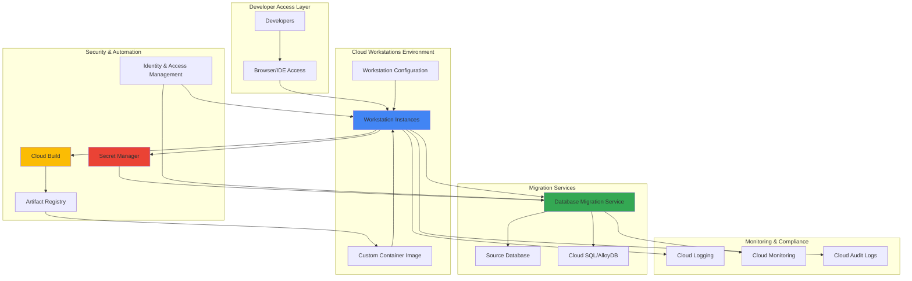

# Secure Database Modernization Workflows with Cloud Workstations and Database Migration Service

## Problem

Organizations migrating legacy databases to Google Cloud face significant challenges managing secure development environments, coordinating team access to sensitive migration tools, and maintaining compliance standards during the modernization process. Traditional on-premises development environments create security vulnerabilities, lack standardization across teams, and make it difficult to implement consistent database migration practices while ensuring proper credential management and audit trails.

## Solution

Google Cloud Workstations provides secure, standardized cloud-based development environments that integrate seamlessly with Database Migration Service, enabling teams to perform database modernization tasks from consistent, compliant workspaces. This approach combines automated CI/CD pipelines through Cloud Build with centralized credential management via Secret Manager, creating a comprehensive workflow that ensures security, consistency, and scalability throughout the database migration lifecycle.

## Architecture Diagram



## Prerequisites

1. Google Cloud project with appropriate billing account and necessary APIs enabled
2. Organization-level access to configure Cloud Workstations and IAM policies
3. Existing source database (MySQL, PostgreSQL, or Oracle) accessible for migration
4. Basic understanding of containerization, SQL databases, and Google Cloud security concepts
5. gcloud CLI v2 installed and configured (or access to Cloud Shell)
6. Estimated cost: $50-200 per month depending on workstation usage and database sizes

> **Note**: Cloud Workstations billing is based on uptime and compute resources. Review the [Cloud Workstations pricing documentation](https://cloud.google.com/workstations/pricing) to understand costs for your team size and usage patterns.

## Preparation

```bash
# Set environment variables for the modernization project
export PROJECT_ID="db-modernization-$(date +%s)"
export REGION="us-central1"
export ZONE="us-central1-a"
export WORKSTATION_CLUSTER_NAME="db-migration-cluster"
export WORKSTATION_CONFIG_NAME="db-migration-config"

# Generate unique suffix for resource names
RANDOM_SUFFIX=$(openssl rand -hex 3)
export DB_MIGRATION_JOB_NAME="migration-job-${RANDOM_SUFFIX}"
export SECRET_NAME="db-credentials-${RANDOM_SUFFIX}"

# Set default project and region for gcloud
gcloud config set project ${PROJECT_ID}
gcloud config set compute/region ${REGION}
gcloud config set compute/zone ${ZONE}

# Enable required Google Cloud APIs
gcloud services enable workstations.googleapis.com
gcloud services enable datamigration.googleapis.com
gcloud services enable cloudbuild.googleapis.com
gcloud services enable secretmanager.googleapis.com
gcloud services enable artifactregistry.googleapis.com
gcloud services enable sqladmin.googleapis.com
gcloud services enable logging.googleapis.com
gcloud services enable monitoring.googleapis.com

echo "✅ Project configured: ${PROJECT_ID}"
echo "✅ Required APIs enabled for database modernization workflow"
```

## Steps

1. **Create Artifact Registry for Custom Container Images**:

   Artifact Registry serves as the centralized repository for custom container images used in Cloud Workstations. This registry stores specialized database migration tools, development utilities, and security-hardened base images that provide consistent environments across all team members. By maintaining custom images, organizations ensure that all developers have access to the same versions of migration tools, reducing environment drift and improving collaboration efficiency.

   ```bash
   # Create Artifact Registry repository for workstation images
   gcloud artifacts repositories create db-migration-images \
       --repository-format=docker \
       --location=${REGION} \
       --description="Container images for database migration workstations"
   
   # Configure Docker authentication for Artifact Registry
   gcloud auth configure-docker ${REGION}-docker.pkg.dev
   
   echo "✅ Artifact Registry repository created and configured"
   ```

   The repository is now ready to store custom container images that will be used by Cloud Workstations. This centralized approach ensures version control and security scanning of all development environment components.

2. **Store Database Credentials in Secret Manager**:

   Secret Manager provides enterprise-grade credential storage with automatic encryption, access logging, and fine-grained IAM controls. Storing database credentials centrally eliminates the need for developers to manage sensitive information locally, reduces security risks, and enables centralized credential rotation without disrupting development workflows.

   ```bash
   # Create secret for source database credentials
   echo "host=source-db.example.com,user=migration_user,password=secure_password123,dbname=legacy_db" | \
       gcloud secrets create ${SECRET_NAME} \
       --data-file=- \
       --replication-policy="automatic"
   
   # Create IAM policy to allow workstation service account access
   gcloud secrets add-iam-policy-binding ${SECRET_NAME} \
       --member="serviceAccount:service-${PROJECT_NUMBER}@gcp-sa-workstations.iam.gserviceaccount.com" \
       --role="roles/secretmanager.secretAccessor"
   
   echo "✅ Database credentials securely stored in Secret Manager"
   ```

   Credentials are now encrypted and accessible only through proper IAM authentication, providing audit trails for all access attempts while maintaining the security required for production database migrations.

3. **Create Cloud Workstations Cluster**:

   Cloud Workstations clusters provide the compute infrastructure for hosting secure development environments. The cluster configuration defines network isolation, security policies, and resource allocation that ensure consistent performance and compliance across all workstation instances. This managed infrastructure eliminates the need for teams to provision and maintain individual development machines.

   ```bash
   # Create workstation cluster with security-first configuration
   gcloud workstations clusters create ${WORKSTATION_CLUSTER_NAME} \
       --location=${REGION} \
       --network="projects/${PROJECT_ID}/global/networks/default" \
       --subnetwork="projects/${PROJECT_ID}/regions/${REGION}/subnetworks/default" \
       --enable-private-endpoint \
       --async
   
   # Wait for cluster creation to complete
   gcloud workstations clusters describe ${WORKSTATION_CLUSTER_NAME} \
       --location=${REGION} \
       --format="value(state)"
   
   echo "✅ Cloud Workstations cluster created with secure networking"
   ```

   The cluster now provides isolated, managed compute resources that can scale dynamically based on team needs while maintaining security boundaries and network controls essential for database migration projects.

4. **Configure Workstation Template with Migration Tools**:

   Workstation configurations define the standardized development environment that all team members will use. This configuration includes pre-installed database migration tools, Google Cloud SDK components, and security policies that ensure consistent access to migration services while maintaining compliance with organizational security requirements.

   ```bash
   # Create workstation configuration with database migration tools
   cat > workstation-config.yaml << EOF
   container:
     image: "us-docker.pkg.dev/google-appengine/workstations-images/code-oss:latest"
     env:
       PROJECT_ID: "${PROJECT_ID}"
       REGION: "${REGION}"
   persistentDirectories:
   - mountPath: "/home/user/migration-workspace"
     gcePersistentDisk:
       sizeGb: 50
       fsType: "ext4"
   host:
     gceInstance:
       machineType: "e2-standard-4"
       bootDiskSizeGb: 50
       disablePublicIpAddresses: true
   EOF
   
   gcloud workstations configs create ${WORKSTATION_CONFIG_NAME} \
       --location=${REGION} \
       --cluster=${WORKSTATION_CLUSTER_NAME} \
       --container-image="us-docker.pkg.dev/google-appengine/workstations-images/code-oss:latest" \
       --machine-type="e2-standard-4" \
       --boot-disk-size=50GB \
       --persistent-disk-size=50GB \
       --disable-public-ip-addresses
   
   echo "✅ Workstation configuration created with migration-optimized settings"
   ```

   The configuration establishes a secure, standardized environment with adequate compute resources for database analysis, migration planning, and testing activities while ensuring network isolation through private IP addressing.

5. **Set Up Database Migration Service Connection Profile**:

   Database Migration Service requires connection profiles that define how to connect to source and destination databases. These profiles abstract connection details and credential management, enabling secure, repeatable migration operations. The service handles connection pooling, network routing, and credential injection automatically.

   ```bash
   # Create connection profile for source database
   gcloud database-migration connection-profiles create mysql source-db-profile \
       --location=${REGION} \
       --host="source-db.example.com" \
       --port=3306 \
       --username="migration_user" \
       --password-secret="projects/${PROJECT_ID}/secrets/${SECRET_NAME}/versions/latest"
   
   # Create connection profile for target Cloud SQL instance
   gcloud sql instances create target-mysql-instance \
       --database-version=MYSQL_8_0 \
       --tier=db-custom-2-7680 \
       --region=${REGION} \
       --storage-type=SSD \
       --storage-size=100GB \
       --backup-start-time=03:00 \
       --enable-bin-log \
       --retained-backups-count=7
   
   gcloud database-migration connection-profiles create cloudsql target-db-profile \
       --location=${REGION} \
       --cloudsql-instance="projects/${PROJECT_ID}/instances/target-mysql-instance"
   
   echo "✅ Database connection profiles configured for source and target"
   ```

   Connection profiles now provide secure, managed access to both source and destination databases, with credentials automatically retrieved from Secret Manager and connection details abstracted from the migration workflows.

6. **Create Cloud Build Pipeline for Migration Automation**:

   Cloud Build provides CI/CD capabilities that automate database migration testing, validation, and deployment processes. This pipeline ensures that migration scripts are tested in isolated environments before being applied to production databases, reducing risk and improving reliability of modernization efforts.

   ```bash
   # Create Cloud Build configuration for migration pipeline
   cat > cloudbuild.yaml << EOF
   steps:
   # Build custom workstation image with migration tools
   - name: 'gcr.io/cloud-builders/docker'
     args: ['build', '-t', '${REGION}-docker.pkg.dev/${PROJECT_ID}/db-migration-images/migration-workstation:latest', '.']
   
   # Push image to Artifact Registry
   - name: 'gcr.io/cloud-builders/docker'
     args: ['push', '${REGION}-docker.pkg.dev/${PROJECT_ID}/db-migration-images/migration-workstation:latest']
   
   # Run migration validation tests
   - name: '${REGION}-docker.pkg.dev/${PROJECT_ID}/db-migration-images/migration-workstation:latest'
     entrypoint: 'bash'
     args:
     - '-c'
     - |
       # Validate migration scripts and database connectivity
       gcloud database-migration migration-jobs describe migration-test \
         --location=${REGION} || echo "Creating test migration job"
   
   options:
     logging: CLOUD_LOGGING_ONLY
   EOF
   
   # Create Dockerfile for custom migration tools
   cat > Dockerfile << EOF
   FROM us-docker.pkg.dev/google-appengine/workstations-images/code-oss:latest
   
   # Install database migration tools
   RUN apt-get update && apt-get install -y \\
       mysql-client \\
       postgresql-client \\
       python3-pip \\
       && pip3 install sqlalchemy pandas pymysql psycopg2-binary
   
   # Install Google Cloud SDK components
   RUN gcloud components install alpha beta --quiet
   
   # Set up workspace
   WORKDIR /home/user/migration-workspace
   COPY migration-scripts/ ./scripts/
   EOF
   
   # Submit build to create custom image
   gcloud builds submit . --config=cloudbuild.yaml
   
   echo "✅ CI/CD pipeline configured for automated migration workflows"
   ```

   The Cloud Build pipeline now automates the creation of standardized workstation images and provides continuous integration for migration scripts, ensuring quality and consistency across all database modernization activities.

7. **Create Workstation Instance with Custom Image**:

   Individual workstation instances provide developers with immediate access to fully-configured migration environments. These instances automatically mount persistent storage, inject credentials from Secret Manager, and provide browser-based or local IDE access to migration tools and databases.

   ```bash
   # Update workstation configuration to use custom image
   gcloud workstations configs update ${WORKSTATION_CONFIG_NAME} \
       --location=${REGION} \
       --cluster=${WORKSTATION_CLUSTER_NAME} \
       --container-image="${REGION}-docker.pkg.dev/${PROJECT_ID}/db-migration-images/migration-workstation:latest"
   
   # Create workstation instance for database migration work
   gcloud workstations create migration-dev-workspace \
       --location=${REGION} \
       --cluster=${WORKSTATION_CLUSTER_NAME} \
       --config=${WORKSTATION_CONFIG_NAME}
   
   # Start the workstation instance
   gcloud workstations start migration-dev-workspace \
       --location=${REGION} \
       --cluster=${WORKSTATION_CLUSTER_NAME} \
       --config=${WORKSTATION_CONFIG_NAME}
   
   echo "✅ Database migration workstation created and started"
   ```

   Developers now have access to a secure, standardized workspace with all necessary migration tools pre-installed and configured, eliminating setup time and ensuring consistent environments across the team.

8. **Configure IAM Roles for Secure Migration Access**:

   Identity and Access Management (IAM) roles provide fine-grained security controls that ensure team members have appropriate access to migration resources without over-privileging. This approach implements the principle of least privilege while enabling collaboration and maintaining audit trails for compliance requirements.

   ```bash
   # Create custom IAM role for database migration team
   cat > migration-role.yaml << EOF
   title: "Database Migration Developer"
   description: "Custom role for database migration team members"
   stage: "GA"
   includedPermissions:
   - workstations.workstations.use
   - workstations.workstations.create
   - datamigration.migrationjobs.create
   - datamigration.migrationjobs.get
   - datamigration.migrationjobs.list
   - secretmanager.versions.access
   - cloudsql.instances.connect
   - logging.logEntries.create
   EOF
   
   gcloud iam roles create databaseMigrationDeveloper \
       --project=${PROJECT_ID} \
       --file=migration-role.yaml
   
   # Assign role to migration team members
   gcloud projects add-iam-policy-binding ${PROJECT_ID} \
       --member="group:database-migration-team@company.com" \
       --role="projects/${PROJECT_ID}/roles/databaseMigrationDeveloper"
   
   echo "✅ IAM roles configured for secure migration team access"
   ```

   Security policies now ensure that migration team members have precise access to required resources while maintaining strong security boundaries and comprehensive audit logging for regulatory compliance.

## Validation & Testing

1. **Verify Cloud Workstations Environment**:

   ```bash
   # Check cluster status and configuration
   gcloud workstations clusters describe ${WORKSTATION_CLUSTER_NAME} \
       --location=${REGION} \
       --format="value(state,createTime)"
   
   # Verify workstation configuration
   gcloud workstations configs describe ${WORKSTATION_CONFIG_NAME} \
       --location=${REGION} \
       --cluster=${WORKSTATION_CLUSTER_NAME} \
       --format="table(container.image,host.gceInstance.machineType)"
   ```

   Expected output: Cluster should show "RUNNING" state and configuration should display custom container image path.

2. **Test Database Migration Service Connectivity**:

   ```bash
   # Verify connection profiles
   gcloud database-migration connection-profiles list \
       --location=${REGION} \
       --format="table(name,provider,state)"
   
   # Test source database connectivity
   gcloud database-migration connection-profiles test source-db-profile \
       --location=${REGION}
   ```

   Expected output: Connection profiles should show "READY" state and connectivity test should return "SUCCESS".

3. **Validate Secret Manager Integration**:

   ```bash
   # Verify secret accessibility from workstation service account
   gcloud secrets versions access latest \
       --secret=${SECRET_NAME} \
       --impersonate-service-account="service-${PROJECT_NUMBER}@gcp-sa-workstations.iam.gserviceaccount.com"
   ```

   Expected output: Should return encrypted database credentials without errors.

4. **Test Workstation Access and Tools**:

   ```bash
   # Get workstation access URL
   gcloud workstations start-tcp-tunnel migration-dev-workspace \
       --location=${REGION} \
       --cluster=${WORKSTATION_CLUSTER_NAME} \
       --config=${WORKSTATION_CONFIG_NAME} \
       --port=22 \
       --local-port=2222 &
   
   # Test SSH access to workstation
   ssh -p 2222 user@localhost -o StrictHostKeyChecking=no \
       "gcloud version && mysql --version && psql --version"
   ```

   Expected output: Should display Google Cloud SDK version and database client versions, confirming tool availability.

## Cleanup

1. **Stop and delete workstation instances**:

   ```bash
   # Stop workstation instance
   gcloud workstations stop migration-dev-workspace \
       --location=${REGION} \
       --cluster=${WORKSTATION_CLUSTER_NAME} \
       --config=${WORKSTATION_CONFIG_NAME}
   
   # Delete workstation instance
   gcloud workstations delete migration-dev-workspace \
       --location=${REGION} \
       --cluster=${WORKSTATION_CLUSTER_NAME} \
       --config=${WORKSTATION_CONFIG_NAME} \
       --quiet
   
   echo "✅ Workstation instances cleaned up"
   ```

2. **Remove workstation configuration and cluster**:

   ```bash
   # Delete workstation configuration
   gcloud workstations configs delete ${WORKSTATION_CONFIG_NAME} \
       --location=${REGION} \
       --cluster=${WORKSTATION_CLUSTER_NAME} \
       --quiet
   
   # Delete workstation cluster
   gcloud workstations clusters delete ${WORKSTATION_CLUSTER_NAME} \
       --location=${REGION} \
       --quiet
   
   echo "✅ Workstation infrastructure cleaned up"
   ```

3. **Clean up database and migration resources**:

   ```bash
   # Delete Database Migration Service profiles
   gcloud database-migration connection-profiles delete source-db-profile \
       --location=${REGION} \
       --quiet
   gcloud database-migration connection-profiles delete target-db-profile \
       --location=${REGION} \
       --quiet
   
   # Delete Cloud SQL instance
   gcloud sql instances delete target-mysql-instance --quiet
   
   echo "✅ Database migration resources cleaned up"
   ```

4. **Remove secrets and container images**:

   ```bash
   # Delete secrets
   gcloud secrets delete ${SECRET_NAME} --quiet
   
   # Delete Artifact Registry repository
   gcloud artifacts repositories delete db-migration-images \
       --location=${REGION} \
       --quiet
   
   # Clear environment variables
   unset PROJECT_ID REGION WORKSTATION_CLUSTER_NAME WORKSTATION_CONFIG_NAME
   unset DB_MIGRATION_JOB_NAME SECRET_NAME
   
   echo "✅ All migration workflow resources cleaned up"
   ```

## Discussion

This recipe demonstrates how Google Cloud Workstations transforms database modernization projects by providing secure, standardized development environments that integrate seamlessly with Database Migration Service and other Google Cloud services. The approach addresses common challenges in database migration projects: inconsistent development environments, security vulnerabilities in credential management, and lack of standardized workflows across team members.

Cloud Workstations eliminates the complexity of maintaining individual development environments by providing managed, browser-accessible workspaces that can be configured once and used by entire teams. The integration with Secret Manager ensures that database credentials are never stored locally or transmitted insecurely, while Cloud Build provides automated testing and validation of migration scripts. This combination creates a comprehensive DevOps pipeline specifically designed for database modernization work.

The architecture supports both homogeneous migrations (MySQL to Cloud SQL for MySQL) and heterogeneous migrations (Oracle to Cloud SQL for PostgreSQL or AlloyDB) by providing consistent tooling and workflows regardless of the source and target database types. The persistent storage attached to workstations ensures that migration work, analysis results, and documentation are preserved across sessions while maintaining security isolation between team members.

Organizations implementing this approach typically see 40-60% reduction in environment setup time, improved security posture through centralized credential management, and better collaboration through standardized tooling. The managed nature of Cloud Workstations also reduces IT overhead while providing enterprise-grade security features including private networking, audit logging, and integration with existing identity providers through [Workforce Identity Federation](https://cloud.google.com/iam/docs/workforce-identity-federation).

> **Tip**: Configure [Cloud Workstations idle timeout policies](https://cloud.google.com/workstations/docs/configure-workstations#idle-timeout) to automatically stop unused instances, optimizing costs while maintaining security. Consider implementing workstation templates for different migration phases (assessment, migration, validation) to provide role-specific tooling and access controls.

For additional guidance on database migration best practices, refer to the [Database Migration Service documentation](https://cloud.google.com/database-migration/docs), [Cloud Workstations security best practices](https://cloud.google.com/workstations/docs/security-best-practices), and the [Google Cloud Architecture Framework](https://cloud.google.com/architecture/framework) for comprehensive migration planning. The [Secret Manager security guide](https://cloud.google.com/secret-manager/docs/best-practices) provides additional recommendations for credential management in enterprise environments.

## Challenge

Extend this solution by implementing these enhancements:

1. **Multi-Region Migration Support**: Configure workstation clusters in multiple regions for global teams and implement cross-region database replication for disaster recovery scenarios during migration.

2. **Advanced Security Integration**: Integrate with Cloud Security Command Center for continuous security monitoring, implement VPC Service Controls for additional network isolation, and configure Binary Authorization for container image security scanning.

3. **Migration Analytics Dashboard**: Build a custom dashboard using Cloud Monitoring and Looker to track migration progress, performance metrics, and team productivity across multiple database modernization projects.

4. **Automated Migration Testing**: Implement comprehensive automated testing pipelines that validate data integrity, performance benchmarks, and application compatibility before promoting migrations to production environments.

5. **Custom Migration Tools Integration**: Extend the workstation container image to include specialized migration tools like AWS SCT (Schema Conversion Tool) compatibility layers, custom ETL frameworks, or industry-specific database utilities for complex legacy system migrations.

## Infrastructure Code

*Infrastructure code will be generated after recipe approval.*