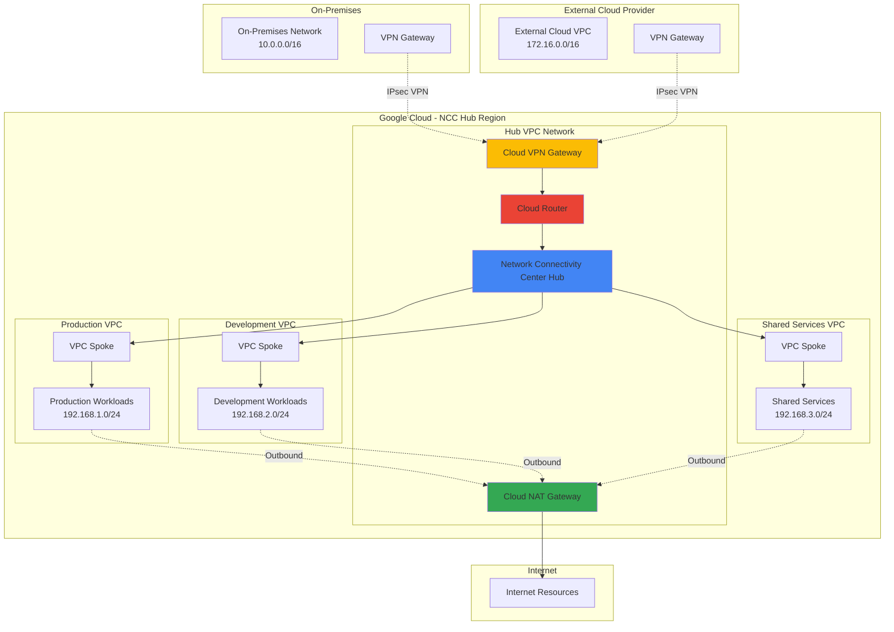

# Secure Multi-Cloud Connectivity with Cloud NAT and Network Connectivity Center

## Problem

Organizations operating in multi-cloud environments face significant challenges in establishing secure, consistent, and manageable network connectivity between on-premises infrastructure, Google Cloud VPC networks, and external cloud providers. Traditional point-to-point connectivity solutions create complex, hard-to-maintain network topologies that lack centralized management, proper security controls, and efficient routing capabilities, leading to increased operational overhead, security vulnerabilities, and limited scalability for growing enterprise workloads.

## Solution

This solution implements a centralized hub-and-spoke networking architecture using Google Cloud Network Connectivity Center as the orchestration framework, combined with Cloud NAT for secure outbound internet access. The architecture provides seamless connectivity between multiple VPC networks, on-premises environments, and external cloud providers through Cloud VPN tunnels and Cloud Router, enabling centralized network management, consistent security policies, and scalable multi-cloud operations while maintaining high availability and performance.

## Architecture Diagram



## Prerequisites

1. Google Cloud project with billing enabled and appropriate IAM permissions
2. Google Cloud CLI (gcloud) installed and configured
3. Existing on-premises network infrastructure with VPN capabilities
4. Access to external cloud provider for VPN setup (AWS, Azure, etc.)
5. Network administrator access for configuring routing and firewall rules
6. Estimated cost: $150-300 per month for VPN gateways, NAT gateway, and data transfer

> **Note**: This recipe requires Compute Network Admin and Network Connectivity Admin IAM roles. Review the [Google Cloud IAM documentation](https://cloud.google.com/iam/docs/understanding-roles) for detailed permission requirements.

## Preparation

```bash
# Set environment variables for GCP resources
export PROJECT_ID=$(gcloud config get-value project)
export REGION="us-central1"
export ZONE="us-central1-a"
export HUB_NAME="multi-cloud-hub"

# Generate unique suffix for resource names
RANDOM_SUFFIX=$(openssl rand -hex 3)
export VPC_HUB_NAME="hub-vpc-${RANDOM_SUFFIX}"
export VPC_PROD_NAME="prod-vpc-${RANDOM_SUFFIX}"
export VPC_DEV_NAME="dev-vpc-${RANDOM_SUFFIX}"
export VPC_SHARED_NAME="shared-vpc-${RANDOM_SUFFIX}"

# Set default project and region
gcloud config set project ${PROJECT_ID}
gcloud config set compute/region ${REGION}
gcloud config set compute/zone ${ZONE}

# Enable required APIs
gcloud services enable compute.googleapis.com
gcloud services enable networkconnectivity.googleapis.com
gcloud services enable cloudresourcemanager.googleapis.com

echo "✅ Project configured: ${PROJECT_ID}"
echo "✅ Random suffix: ${RANDOM_SUFFIX}"
```

## Steps

1. **Create VPC Networks and Subnets**:

   Google Cloud VPC networks provide the foundational networking layer for multi-cloud connectivity. Creating separate VPC networks for different environments (production, development, shared services) enables network segmentation and security isolation while maintaining centralized connectivity through Network Connectivity Center. This architecture follows Google Cloud's recommended practices for enterprise network design and supports scalable growth patterns.

   ```bash
   # Create hub VPC network for central connectivity
   gcloud compute networks create ${VPC_HUB_NAME} \
       --subnet-mode custom \
       --description "Hub VPC for Network Connectivity Center"
   
   # Create hub subnet
   gcloud compute networks subnets create hub-subnet \
       --network ${VPC_HUB_NAME} \
       --range 10.1.0.0/24 \
       --region ${REGION}
   
   # Create production VPC network
   gcloud compute networks create ${VPC_PROD_NAME} \
       --subnet-mode custom \
       --description "Production workloads VPC"
   
   # Create production subnet
   gcloud compute networks subnets create prod-subnet \
       --network ${VPC_PROD_NAME} \
       --range 192.168.1.0/24 \
       --region ${REGION}
   
   # Create development VPC network
   gcloud compute networks create ${VPC_DEV_NAME} \
       --subnet-mode custom \
       --description "Development workloads VPC"
   
   # Create development subnet
   gcloud compute networks subnets create dev-subnet \
       --network ${VPC_DEV_NAME} \
       --range 192.168.2.0/24 \
       --region ${REGION}
   
   # Create shared services VPC network
   gcloud compute networks create ${VPC_SHARED_NAME} \
       --subnet-mode custom \
       --description "Shared services VPC"
   
   # Create shared services subnet
   gcloud compute networks subnets create shared-subnet \
       --network ${VPC_SHARED_NAME} \
       --range 192.168.3.0/24 \
       --region ${REGION}
   
   echo "✅ VPC networks and subnets created successfully"
   ```

   The VPC networks are now established with custom subnet modes, providing flexible IP address management and enabling fine-grained control over network routing. Each network serves a specific purpose in the multi-cloud architecture, supporting workload isolation while enabling centralized connectivity management through the hub network.

2. **Create Network Connectivity Center Hub**:

   Network Connectivity Center serves as the central orchestration point for managing connectivity between multiple network resources. The hub enables seamless routing and connectivity management across VPC networks, on-premises networks, and external cloud providers using a hub-and-spoke model that simplifies network operations and provides centralized visibility into network traffic flows.

   ```bash
   # Create Network Connectivity Center hub
   gcloud network-connectivity hubs create ${HUB_NAME} \
       --description "Multi-cloud connectivity hub for enterprise workloads" \
       --global
   
   # Verify hub creation
   gcloud network-connectivity hubs describe ${HUB_NAME} \
       --global
   
   echo "✅ Network Connectivity Center hub created: ${HUB_NAME}"
   ```

   The NCC hub is now active and ready to orchestrate connectivity between multiple spoke resources. This centralized management approach enables consistent routing policies, simplified troubleshooting, and scalable network architecture that can accommodate additional VPC networks and hybrid connections as the organization grows.

3. **Create VPC Spokes for Network Connectivity Center**:

   VPC spokes connect individual VPC networks to the Network Connectivity Center hub, enabling route exchange and communication between previously isolated networks. This spoke attachment model provides granular control over inter-VPC connectivity while maintaining security boundaries and enabling centralized network policy enforcement across the multi-cloud environment.

   ```bash
   # Create VPC spoke for production network
   gcloud network-connectivity spokes linked-vpc-network create prod-spoke \
       --hub ${HUB_NAME} \
       --description "Production VPC spoke" \
       --vpc-network projects/${PROJECT_ID}/global/networks/${VPC_PROD_NAME} \
       --global
   
   # Create VPC spoke for development network
   gcloud network-connectivity spokes linked-vpc-network create dev-spoke \
       --hub ${HUB_NAME} \
       --description "Development VPC spoke" \
       --vpc-network projects/${PROJECT_ID}/global/networks/${VPC_DEV_NAME} \
       --global
   
   # Create VPC spoke for shared services network
   gcloud network-connectivity spokes linked-vpc-network create shared-spoke \
       --hub ${HUB_NAME} \
       --description "Shared services VPC spoke" \
       --vpc-network projects/${PROJECT_ID}/global/networks/${VPC_SHARED_NAME} \
       --global
   
   # List all spokes attached to the hub
   gcloud network-connectivity spokes list \
       --hub ${HUB_NAME} \
       --global
   
   echo "✅ VPC spokes created and attached to hub"
   ```

   The VPC spokes are now connected to the NCC hub, establishing the foundation for inter-VPC communication. This configuration enables automatic route propagation between spoke networks while maintaining network security through Google Cloud's default VPC firewall rules and IAM-based access controls.

4. **Create Cloud Router for BGP Management**:

   Cloud Router provides dynamic Border Gateway Protocol (BGP) routing capabilities essential for establishing and maintaining VPN connections to on-premises and external cloud networks. The router automatically manages route advertisements and withdrawals, ensuring optimal traffic flow and high availability for hybrid connectivity scenarios while supporting advanced routing features like route filtering and custom route priorities.

   ```bash
   # Create Cloud Router in hub VPC
   gcloud compute routers create hub-router \
       --network ${VPC_HUB_NAME} \
       --region ${REGION} \
       --description "BGP router for hybrid connectivity" \
       --asn 64512
   
   # Verify router creation
   gcloud compute routers describe hub-router \
       --region ${REGION}
   
   echo "✅ Cloud Router created with ASN 64512"
   ```

   The Cloud Router is now configured and ready to establish BGP sessions with external networks. This managed routing service automatically handles route propagation, failover scenarios, and load balancing across multiple VPN tunnels, providing enterprise-grade routing capabilities without requiring dedicated routing hardware or complex manual configuration.

5. **Create Cloud VPN Gateway for Hybrid Connectivity**:

   Cloud VPN Gateway provides secure IPsec connectivity between Google Cloud and external networks, including on-premises data centers and other cloud providers. The high-availability VPN gateway configuration ensures redundant connectivity paths and automatic failover capabilities, meeting enterprise requirements for reliable multi-cloud connectivity with strong encryption and authentication.

   ```bash
   # Create HA VPN gateway
   gcloud compute vpn-gateways create hub-vpn-gateway \
       --network ${VPC_HUB_NAME} \
       --region ${REGION} \
       --description "HA VPN gateway for multi-cloud connectivity"
   
   # Get VPN gateway details for external configuration
   gcloud compute vpn-gateways describe hub-vpn-gateway \
       --region ${REGION} \
       --format="value(vpnInterfaces[0].ipAddress,vpnInterfaces[1].ipAddress)"
   
   # Store VPN gateway IPs for external configuration
   VPN_GW_IP1=$(gcloud compute vpn-gateways describe hub-vpn-gateway \
       --region ${REGION} \
       --format="value(vpnInterfaces[0].ipAddress)")
   VPN_GW_IP2=$(gcloud compute vpn-gateways describe hub-vpn-gateway \
       --region ${REGION} \
       --format="value(vpnInterfaces[1].ipAddress)")
   
   echo "✅ HA VPN Gateway created"
   echo "VPN Gateway IP 1: ${VPN_GW_IP1}"
   echo "VPN Gateway IP 2: ${VPN_GW_IP2}"
   ```

   The HA VPN gateway is now deployed with redundant interfaces, providing enterprise-grade connectivity resilience. Use the displayed IP addresses to configure the corresponding VPN gateways in your on-premises environment and external cloud providers, ensuring proper IPsec tunnel establishment and BGP session configuration for dynamic routing.

6. **Configure Cloud NAT for Secure Outbound Internet Access**:

   Cloud NAT provides managed network address translation for resources without external IP addresses, enabling secure outbound internet connectivity while maintaining strict inbound access controls. This managed service eliminates the need for NAT instances while providing high availability, automatic scaling, and comprehensive logging capabilities essential for enterprise security and compliance requirements.

   ```bash
   # Create Cloud NAT gateway for hub VPC
   gcloud compute routers nats create hub-nat-gateway \
       --router hub-router \
       --region ${REGION} \
       --nat-all-subnet-ip-ranges \
       --auto-allocate-nat-external-ips \
       --enable-logging \
       --log-filter ALL
   
   # Configure NAT for production VPC
   gcloud compute routers create prod-router \
       --network ${VPC_PROD_NAME} \
       --region ${REGION} \
       --asn 64513
   
   gcloud compute routers nats create prod-nat-gateway \
       --router prod-router \
       --region ${REGION} \
       --nat-all-subnet-ip-ranges \
       --auto-allocate-nat-external-ips \
       --enable-logging \
       --log-filter ALL
   
   # Configure NAT for development VPC
   gcloud compute routers create dev-router \
       --network ${VPC_DEV_NAME} \
       --region ${REGION} \
       --asn 64514
   
   gcloud compute routers nats create dev-nat-gateway \
       --router dev-router \
       --region ${REGION} \
       --nat-all-subnet-ip-ranges \
       --auto-allocate-nat-external-ips \
       --enable-logging \
       --log-filter ALL
   
   # Configure NAT for shared services VPC
   gcloud compute routers create shared-router \
       --network ${VPC_SHARED_NAME} \
       --region ${REGION} \
       --asn 64515
   
   gcloud compute routers nats create shared-nat-gateway \
       --router shared-router \
       --region ${REGION} \
       --nat-all-subnet-ip-ranges \
       --auto-allocate-nat-external-ips \
       --enable-logging \
       --log-filter ALL
   
   echo "✅ Cloud NAT gateways configured for all VPC networks"
   ```

   Cloud NAT gateways are now active across all VPC networks, providing secure and scalable outbound internet connectivity. The comprehensive logging configuration enables security monitoring and compliance reporting while the auto-allocation of external IP addresses ensures optimal resource utilization and cost management for dynamic workloads.

7. **Create Firewall Rules for Inter-VPC Communication**:

   Firewall rules control network traffic flow between VPC networks and external connections, implementing security policies that balance connectivity requirements with enterprise security standards. These rules enable necessary communication patterns while maintaining the principle of least privilege and supporting compliance with organizational security frameworks.

   ```bash
   # Create firewall rules for hub VPC (VPN and management traffic)
   gcloud compute firewall-rules create hub-allow-vpn \
       --network ${VPC_HUB_NAME} \
       --allow tcp:22,tcp:179,udp:500,udp:4500,esp \
       --source-ranges 10.0.0.0/8,172.16.0.0/12 \
       --description "Allow VPN and BGP traffic"
   
   # Create firewall rules for production VPC
   gcloud compute firewall-rules create prod-allow-internal \
       --network ${VPC_PROD_NAME} \
       --allow tcp:22,tcp:80,tcp:443,icmp \
       --source-ranges 192.168.0.0/16,10.1.0.0/24 \
       --description "Allow internal communication and management"
   
   # Create firewall rules for development VPC
   gcloud compute firewall-rules create dev-allow-internal \
       --network ${VPC_DEV_NAME} \
       --allow tcp:22,tcp:80,tcp:443,tcp:8080,icmp \
       --source-ranges 192.168.0.0/16,10.1.0.0/24 \
       --description "Allow internal communication and development traffic"
   
   # Create firewall rules for shared services VPC
   gcloud compute firewall-rules create shared-allow-internal \
       --network ${VPC_SHARED_NAME} \
       --allow tcp:22,tcp:53,tcp:80,tcp:443,udp:53,icmp \
       --source-ranges 192.168.0.0/16,10.1.0.0/24,10.0.0.0/16 \
       --description "Allow shared services access"
   
   # Create explicit egress rules for internet access
   gcloud compute firewall-rules create prod-allow-egress \
       --network ${VPC_PROD_NAME} \
       --direction EGRESS \
       --action ALLOW \
       --rules tcp:80,tcp:443,tcp:53,udp:53 \
       --destination-ranges 0.0.0.0/0 \
       --description "Allow outbound internet access for production"
   
   echo "✅ Firewall rules configured for secure communication"
   ```

   The firewall rules now provide granular security controls while enabling necessary communication patterns across the multi-cloud architecture. These rules implement defense-in-depth security principles and can be further customized to meet specific organizational security policies and compliance requirements.

8. **Configure Hybrid Spoke for External Cloud Connectivity**:

   Hybrid spokes connect external networks to the Network Connectivity Center hub through VPN tunnels, extending the centralized connectivity model to include on-premises data centers and other cloud providers. This configuration demonstrates the creation of a VPN tunnel that would connect to an external cloud provider, showcasing the multi-cloud connectivity capabilities.

   ```bash
   # Create external VPN gateway representation (for external cloud provider)
   gcloud compute external-vpn-gateways create external-cloud-gateway \
       --interfaces 0=172.16.1.1 \
       --description "External cloud provider VPN gateway"
   
   # Create VPN tunnel to external cloud provider
   gcloud compute vpn-tunnels create tunnel-to-external-cloud \
       --peer-external-gateway external-cloud-gateway \
       --peer-external-gateway-interface 0 \
       --vpn-gateway hub-vpn-gateway \
       --vpn-gateway-interface 0 \
       --ike-version 2 \
       --shared-secret "your-shared-secret-here" \
       --router hub-router \
       --region ${REGION} \
       --description "VPN tunnel to external cloud provider"
   
   # Add BGP peer for external cloud provider
   gcloud compute routers add-bgp-peer hub-router \
       --peer-name external-cloud-peer \
       --interface tunnel-to-external-cloud \
       --peer-ip-address 169.254.1.2 \
       --peer-asn 65001 \
       --region ${REGION}
   
   # Create hybrid spoke for external connectivity
   gcloud network-connectivity spokes linked-vpn-tunnels create external-cloud-spoke \
       --hub ${HUB_NAME} \
       --description "Hybrid spoke for external cloud connectivity" \
       --vpn-tunnel projects/${PROJECT_ID}/regions/${REGION}/vpnTunnels/tunnel-to-external-cloud \
       --global
   
   echo "✅ Hybrid spoke configured for external cloud connectivity"
   ```

   The hybrid spoke configuration establishes the framework for connecting external cloud providers to the NCC hub. This setup enables centralized route management and consistent connectivity policies across all network resources, whether they reside in Google Cloud, on-premises, or external cloud environments.

## Validation & Testing

1. **Verify Network Connectivity Center Hub and Spokes**:

   ```bash
   # Check hub status and configuration
   gcloud network-connectivity hubs describe ${HUB_NAME} \
       --global \
       --format="table(name,state,createTime)"
   
   # List all spokes attached to the hub
   gcloud network-connectivity spokes list \
       --hub ${HUB_NAME} \
       --global \
       --format="table(name,state,linkedVpnTunnels.uris,linkedVpcNetwork.uri)"
   ```

   Expected output: Hub should show "ACTIVE" state with all spokes listed and connected.

2. **Test VPC Network Connectivity**:

   ```bash
   # Check VPC networks status
   gcloud compute networks list \
       --filter="name:(${VPC_HUB_NAME} OR ${VPC_PROD_NAME} OR ${VPC_DEV_NAME} OR ${VPC_SHARED_NAME})" \
       --format="table(name,subnet_mode,bgp_routing_mode)"
   
   # Verify subnets configuration
   gcloud compute networks subnets list \
       --filter="region:${REGION}" \
       --format="table(name,network.basename(),ipCidrRange,region)"
   ```

   Expected output: All VPC networks should be listed with CUSTOM subnet mode and subnets showing correct IP ranges.

3. **Validate Cloud NAT Gateway Configuration**:

   ```bash
   # Check NAT gateway status across all routers
   gcloud compute routers get-nat-mapping-info hub-router \
       --region ${REGION} \
       --nat hub-nat-gateway
   
   gcloud compute routers get-nat-mapping-info prod-router \
       --region ${REGION} \
       --nat prod-nat-gateway
   
   # Verify NAT gateway configuration
   gcloud compute routers nats list \
       --router hub-router \
       --region ${REGION} \
       --format="table(name,natIpAllocateOption,sourceSubnetworkIpRangesToNat)"
   ```

   Expected output: NAT gateways should show active mappings and proper IP allocation configurations.

4. **Test VPN Gateway and Router Configuration**:

   ```bash
   # Verify VPN gateway status
   gcloud compute vpn-gateways describe hub-vpn-gateway \
       --region ${REGION} \
       --format="table(name,network,vpnInterfaces[].ipAddress)"
   
   # Check Cloud Router BGP sessions
   gcloud compute routers get-status hub-router \
       --region ${REGION} \
       --format="table(result.bgpPeerStatus[].name,result.bgpPeerStatus[].state)"
   ```

   Expected output: VPN gateway should show two interface IP addresses and router should display BGP peer status.

5. **Validate Firewall Rules**:

   ```bash
   # List firewall rules for all networks
   gcloud compute firewall-rules list \
       --filter="network:(${VPC_HUB_NAME} OR ${VPC_PROD_NAME} OR ${VPC_DEV_NAME} OR ${VPC_SHARED_NAME})" \
       --format="table(name,network.basename(),direction,sourceRanges.list():label=SRC_RANGES,allowed[].map().firewall_rule().list():label=ALLOW)"
   ```

   Expected output: All firewall rules should be listed with appropriate source ranges and allowed protocols.

## Cleanup

1. **Remove Network Connectivity Center Spokes**:

   ```bash
   # Delete VPC spokes
   gcloud network-connectivity spokes delete prod-spoke \
       --hub ${HUB_NAME} \
       --global \
       --quiet
   
   gcloud network-connectivity spokes delete dev-spoke \
       --hub ${HUB_NAME} \
       --global \
       --quiet
   
   gcloud network-connectivity spokes delete shared-spoke \
       --hub ${HUB_NAME} \
       --global \
       --quiet
   
   gcloud network-connectivity spokes delete external-cloud-spoke \
       --hub ${HUB_NAME} \
       --global \
       --quiet
   
   echo "✅ Network Connectivity Center spokes deleted"
   ```

2. **Remove Network Connectivity Center Hub**:

   ```bash
   # Delete the NCC hub
   gcloud network-connectivity hubs delete ${HUB_NAME} \
       --global \
       --quiet
   
   echo "✅ Network Connectivity Center hub deleted"
   ```

3. **Remove VPN Infrastructure**:

   ```bash
   # Delete VPN tunnels
   gcloud compute vpn-tunnels delete tunnel-to-external-cloud \
       --region ${REGION} \
       --quiet
   
   # Delete VPN gateways
   gcloud compute vpn-gateways delete hub-vpn-gateway \
       --region ${REGION} \
       --quiet
   
   # Delete external VPN gateway
   gcloud compute external-vpn-gateways delete external-cloud-gateway \
       --quiet
   
   echo "✅ VPN infrastructure deleted"
   ```

4. **Remove Cloud NAT Gateways and Routers**:

   ```bash
   # Delete NAT gateways
   gcloud compute routers nats delete hub-nat-gateway \
       --router hub-router \
       --region ${REGION} \
       --quiet
   
   gcloud compute routers nats delete prod-nat-gateway \
       --router prod-router \
       --region ${REGION} \
       --quiet
   
   gcloud compute routers nats delete dev-nat-gateway \
       --router dev-router \
       --region ${REGION} \
       --quiet
   
   gcloud compute routers nats delete shared-nat-gateway \
       --router shared-router \
       --region ${REGION} \
       --quiet
   
   # Delete Cloud Routers
   gcloud compute routers delete hub-router \
       --region ${REGION} \
       --quiet
   
   gcloud compute routers delete prod-router \
       --region ${REGION} \
       --quiet
   
   gcloud compute routers delete dev-router \
       --region ${REGION} \
       --quiet
   
   gcloud compute routers delete shared-router \
       --region ${REGION} \
       --quiet
   
   echo "✅ Cloud NAT gateways and routers deleted"
   ```

5. **Remove Firewall Rules**:

   ```bash
   # Delete firewall rules
   gcloud compute firewall-rules delete hub-allow-vpn \
       --quiet
   
   gcloud compute firewall-rules delete prod-allow-internal \
       --quiet
   
   gcloud compute firewall-rules delete dev-allow-internal \
       --quiet
   
   gcloud compute firewall-rules delete shared-allow-internal \
       --quiet
   
   gcloud compute firewall-rules delete prod-allow-egress \
       --quiet
   
   echo "✅ Firewall rules deleted"
   ```

6. **Remove VPC Networks and Subnets**:

   ```bash
   # Delete VPC networks (this automatically deletes associated subnets)
   gcloud compute networks delete ${VPC_HUB_NAME} \
       --quiet
   
   gcloud compute networks delete ${VPC_PROD_NAME} \
       --quiet
   
   gcloud compute networks delete ${VPC_DEV_NAME} \
       --quiet
   
   gcloud compute networks delete ${VPC_SHARED_NAME} \
       --quiet
   
   echo "✅ VPC networks and subnets deleted"
   echo "All resources have been successfully cleaned up"
   ```

## Discussion

This multi-cloud networking architecture demonstrates Google Cloud's advanced networking capabilities for enterprise environments requiring secure, scalable connectivity across multiple cloud providers and on-premises infrastructure. Network Connectivity Center serves as the central orchestration platform, simplifying network management through a hub-and-spoke model that provides consistent routing policies and centralized visibility across all connected networks.

The solution leverages Cloud NAT to provide secure outbound internet connectivity without exposing internal resources to inbound threats. This managed NAT service automatically handles scaling, high availability, and IP address management while providing comprehensive logging for security monitoring and compliance reporting. The combination of Cloud VPN and Cloud Router enables dynamic BGP routing with automatic failover capabilities, ensuring reliable connectivity even during network disruptions or maintenance events.

Security is implemented through multiple layers including VPC network isolation, granular firewall rules, and encrypted VPN tunnels for external connectivity. The architecture follows Google Cloud's security best practices by implementing the principle of least privilege through targeted firewall rules and maintaining network segmentation between different environments while enabling necessary communication patterns for business operations.

The scalable design accommodates organizational growth by supporting additional VPC networks, on-premises sites, and external cloud connections through simple spoke attachments to the existing NCC hub. This approach reduces operational complexity compared to traditional mesh networking topologies while providing enterprise-grade features like route filtering, traffic engineering, and centralized policy management. For additional architectural guidance, refer to the [Google Cloud Architecture Framework](https://cloud.google.com/architecture/framework) and [Network Connectivity Center best practices](https://cloud.google.com/network-connectivity/docs/network-connectivity-center/concepts/best-practices).

> **Tip**: Monitor network performance and costs using [Cloud Monitoring](https://cloud.google.com/monitoring/docs) and implement automated alerting for VPN tunnel status, NAT gateway utilization, and cross-region data transfer costs to optimize the multi-cloud networking investment.

## Challenge

Extend this solution by implementing these enhancements:

1. **Configure Private Google Access and Private Service Connect** to enable secure access to Google Cloud APIs and third-party services without internet routing, enhancing security and reducing latency for application workloads.

2. **Implement Network Intelligence Center integration** with [Network Topology](https://cloud.google.com/network-intelligence-center/docs/network-topology/concepts/overview) and [Connectivity Tests](https://cloud.google.com/network-intelligence-center/docs/connectivity-tests/concepts/overview) to provide comprehensive network visibility, automated troubleshooting, and performance optimization recommendations.

3. **Deploy Cloud Armor security policies** with WAF rules and DDoS protection for applications exposed through load balancers, implementing advanced threat detection and geographic access controls based on organizational security requirements.

4. **Configure multi-region deployment** with Global Load Balancer and regional NCC hubs to provide disaster recovery capabilities, improved performance through geographic distribution, and automatic failover for critical applications across multiple Google Cloud regions.

5. **Implement advanced BGP routing policies** with route filtering, path prepending, and custom route priorities to optimize traffic flow between cloud providers, implement cost-effective routing strategies, and maintain compliance with data sovereignty requirements.

## Infrastructure Code

### Available Infrastructure as Code:

- [Infrastructure Code Overview](code/README.md) - Detailed description of all infrastructure components
- [Infrastructure Manager](code/infrastructure-manager/) - GCP Infrastructure Manager templates
- [Bash CLI Scripts](code/scripts/) - Example bash scripts using gcloud CLI commands to deploy infrastructure
- [Terraform](code/terraform/) - Terraform configuration files