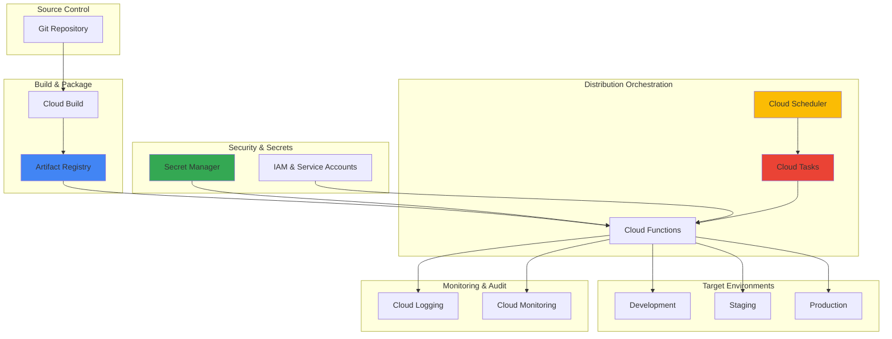

# Secure Package Distribution Workflows with Artifact Registry and Secret Manager

## Problem

Organizations struggle to securely distribute software packages across multiple environments while maintaining strict access controls and audit trails. Development teams often face challenges with credential management, inconsistent deployment processes, and lack of visibility into package distribution workflows, leading to security vulnerabilities and deployment failures that can impact production systems and compliance requirements.

## Solution

Build an automated secure package distribution system using Google Cloud Artifact Registry as a centralized repository with Secret Manager for encrypted credential storage and Cloud Scheduler with Cloud Tasks for orchestrated distribution workflows. This solution provides enterprise-grade security, automated credential rotation, and comprehensive audit logging while ensuring packages are distributed reliably across development, staging, and production environments.

## Architecture Diagram



## Prerequisites

1. Google Cloud project with billing enabled and appropriate IAM permissions
2. gcloud CLI v450.0.0 or later installed and authenticated
3. Basic understanding of container images, package management, and CI/CD pipelines
4. Docker installed locally for testing container workflows
5. Estimated cost: $5-15 per month for storage, compute, and API calls (varies by usage)

> **Note**: This recipe creates billable resources including Artifact Registry repositories, Secret Manager secrets, and Cloud Functions. Monitor usage through Cloud Billing to manage costs effectively.

## Preparation

```bash
# Set environment variables for GCP resources
export PROJECT_ID=$(gcloud config get-value project)
export REGION="us-central1"
export ZONE="us-central1-a"

# Generate unique suffix for resource names
RANDOM_SUFFIX=$(openssl rand -hex 3)
export REPO_NAME="secure-packages-${RANDOM_SUFFIX}"
export SECRET_NAME="registry-credentials-${RANDOM_SUFFIX}"
export SCHEDULER_JOB="package-distribution-${RANDOM_SUFFIX}"
export FUNCTION_NAME="package-distributor-${RANDOM_SUFFIX}"

# Set default project and region
gcloud config set project ${PROJECT_ID}
gcloud config set artifacts/location ${REGION}
gcloud config set compute/region ${REGION}
gcloud config set compute/zone ${ZONE}

# Enable required APIs
echo "Enabling required Google Cloud APIs..."
gcloud services enable artifactregistry.googleapis.com
gcloud services enable secretmanager.googleapis.com
gcloud services enable cloudscheduler.googleapis.com
gcloud services enable cloudtasks.googleapis.com
gcloud services enable cloudfunctions.googleapis.com
gcloud services enable cloudbuild.googleapis.com
gcloud services enable logging.googleapis.com
gcloud services enable monitoring.googleapis.com

echo "✅ Project configured: ${PROJECT_ID}"
echo "✅ Region set to: ${REGION}"
echo "✅ Repository name: ${REPO_NAME}"
```

## Steps

1. **Create Artifact Registry Repository for Secure Package Storage**:

   Artifact Registry provides enterprise-grade package management with built-in security scanning, access controls, and integration with Google Cloud's identity and access management system. Creating a private repository ensures that your packages are stored securely and access can be controlled through IAM policies, while regional replication provides high availability and low-latency access.

   ```bash
   # Create Docker repository for container packages
   gcloud artifacts repositories create ${REPO_NAME} \
       --repository-format=docker \
       --location=${REGION} \
       --description="Secure package distribution repository"
   
   # Create additional repositories for different package types
   gcloud artifacts repositories create ${REPO_NAME}-npm \
       --repository-format=npm \
       --location=${REGION} \
       --description="NPM packages repository"
   
   gcloud artifacts repositories create ${REPO_NAME}-maven \
       --repository-format=maven \
       --location=${REGION} \
       --description="Maven packages repository"
   
   echo "✅ Artifact Registry repositories created successfully"
   ```

   The repositories are now configured with Google Cloud's security best practices, including automatic vulnerability scanning and IAM-based access controls. This multi-format approach allows teams to manage different types of packages through a unified platform while maintaining security and compliance standards.

2. **Configure Secret Manager for Credential Storage**:

   Secret Manager provides centralized, encrypted storage for sensitive configuration data with automatic encryption at rest and in transit. Storing credentials securely eliminates hardcoded secrets in code and enables automated credential rotation, which is essential for maintaining security in automated distribution workflows.

   ```bash
   # Create secrets for different environment credentials
   echo -n "dev-registry-token-placeholder" | \
       gcloud secrets create ${SECRET_NAME}-dev \
       --data-file=- \
       --labels="environment=development,purpose=registry-auth"
   
   echo -n "staging-registry-token-placeholder" | \
       gcloud secrets create ${SECRET_NAME}-staging \
       --data-file=- \
       --labels="environment=staging,purpose=registry-auth"
   
   echo -n "prod-registry-token-placeholder" | \
       gcloud secrets create ${SECRET_NAME}-prod \
       --data-file=- \
       --labels="environment=production,purpose=registry-auth"
   
   # Create secret for distribution configuration
   cat <<EOF | gcloud secrets create distribution-config-${RANDOM_SUFFIX} \
       --data-file=- \
       --labels="purpose=distribution-config"
   {
     "environments": {
       "development": {
         "endpoint": "dev.example.com",
         "timeout": 30
       },
       "staging": {
         "endpoint": "staging.example.com", 
         "timeout": 60
       },
       "production": {
         "endpoint": "prod.example.com",
         "timeout": 120
       }
     }
   }
   EOF
   
   echo "✅ Secrets created and encrypted in Secret Manager"
   ```

   The secrets are now stored with Google Cloud's envelope encryption and can be accessed programmatically by authorized services. The labeling system enables easy management and rotation policies, while environment-specific secrets ensure proper isolation between development, staging, and production credentials.

3. **Create IAM Service Account with Least Privilege Access**:

   Identity and Access Management (IAM) follows the principle of least privilege to ensure that automated systems have only the minimum permissions necessary to perform their functions. Creating dedicated service accounts for different components of the distribution workflow provides security isolation and enables fine-grained access control.

   ```bash
   # Create service account for package distribution
   gcloud iam service-accounts create package-distributor-sa-${RANDOM_SUFFIX} \
       --display-name="Package Distribution Service Account" \
       --description="Service account for automated package distribution workflows"
   
   export SERVICE_ACCOUNT_EMAIL="package-distributor-sa-${RANDOM_SUFFIX}@${PROJECT_ID}.iam.gserviceaccount.com"
   
   # Grant necessary permissions for Artifact Registry
   gcloud projects add-iam-policy-binding ${PROJECT_ID} \
       --member="serviceAccount:${SERVICE_ACCOUNT_EMAIL}" \
       --role="roles/artifactregistry.reader"
   
   gcloud projects add-iam-policy-binding ${PROJECT_ID} \
       --member="serviceAccount:${SERVICE_ACCOUNT_EMAIL}" \
       --role="roles/artifactregistry.writer"
   
   # Grant Secret Manager access
   gcloud projects add-iam-policy-binding ${PROJECT_ID} \
       --member="serviceAccount:${SERVICE_ACCOUNT_EMAIL}" \
       --role="roles/secretmanager.secretAccessor"
   
   # Grant Cloud Functions and Cloud Tasks permissions
   gcloud projects add-iam-policy-binding ${PROJECT_ID} \
       --member="serviceAccount:${SERVICE_ACCOUNT_EMAIL}" \
       --role="roles/cloudfunctions.invoker"
   
   gcloud projects add-iam-policy-binding ${PROJECT_ID} \
       --member="serviceAccount:${SERVICE_ACCOUNT_EMAIL}" \
       --role="roles/cloudtasks.enqueuer"
   
   # Grant logging permissions for audit trails
   gcloud projects add-iam-policy-binding ${PROJECT_ID} \
       --member="serviceAccount:${SERVICE_ACCOUNT_EMAIL}" \
       --role="roles/logging.logWriter"
   
   echo "✅ Service account created with appropriate permissions"
   ```

   The service account now has precisely the permissions needed for package distribution while maintaining security isolation. This approach ensures that if credentials are compromised, the impact is limited to the specific functions required for package distribution rather than broader system access.

4. **Deploy Cloud Function for Package Distribution Logic**:

   Cloud Functions provides serverless compute that automatically scales based on demand and integrates seamlessly with other Google Cloud services. The function will orchestrate the secure retrieval of packages from Artifact Registry and their distribution to target environments using encrypted credentials from Secret Manager.

   ```bash
   # Create the function source code directory
   mkdir -p package-distributor-function
   cd package-distributor-function
   
   # Create requirements.txt for Python dependencies
   cat <<EOF > requirements.txt
   google-cloud-artifactregistry==1.12.0
   google-cloud-secret-manager==2.20.0
   google-cloud-tasks==2.16.4
   google-cloud-logging==3.9.0
   docker==7.0.0
   requests==2.31.0
   google-auth==2.25.2
   EOF
   
   # Create the main function code
   cat <<'EOF' > main.py
   import json
   import logging
   import os
   import time
   from google.cloud import secretmanager
   from google.cloud import tasks_v2
   from google.cloud import logging as cloud_logging
   import docker
   import requests
   from google.auth import default
   
   # Initialize Cloud Logging
   cloud_logging.Client().setup_logging()
   logger = logging.getLogger(__name__)
   
   def distribute_package(request):
       """Main function to handle package distribution requests."""
       try:
           # Parse request data
           request_json = request.get_json(silent=True)
           if not request_json:
               logger.error("No JSON body provided in request")
               return {'error': 'No JSON body provided'}, 400
           
           package_name = request_json.get('package_name')
           package_version = request_json.get('package_version', 'latest')
           target_environment = request_json.get('environment', 'development')
           
           if not package_name:
               logger.error("package_name is required but not provided")
               return {'error': 'package_name is required'}, 400
           
           logger.info(f"Starting distribution of {package_name}:{package_version} to {target_environment}")
           
           # Retrieve credentials from Secret Manager
           credentials = get_environment_credentials(target_environment)
           if not credentials:
               logger.error(f"Failed to retrieve credentials for environment: {target_environment}")
               return {'error': f'Failed to retrieve credentials for {target_environment}'}, 500
           
           # Get distribution configuration
           config = get_distribution_config()
           if not config:
               logger.error("Failed to retrieve distribution configuration")
               return {'error': 'Failed to retrieve distribution configuration'}, 500
           
           # Perform package distribution
           result = perform_distribution(package_name, package_version, target_environment, credentials, config)
           
           if result['success']:
               logger.info(f"Successfully distributed {package_name}:{package_version} to {target_environment}")
               return {
                   'status': 'success',
                   'message': f'Package {package_name}:{package_version} distributed to {target_environment}',
                   'details': result
               }, 200
           else:
               logger.error(f"Failed to distribute {package_name}:{package_version}: {result['error']}")
               return {'error': result['error']}, 500
               
       except Exception as e:
           logger.error(f"Unexpected error in distribute_package: {str(e)}")
           return {'error': f'Internal server error: {str(e)}'}, 500
   
   def get_environment_credentials(environment):
       """Retrieve credentials for the specified environment from Secret Manager."""
       try:
           client = secretmanager.SecretManagerServiceClient()
           secret_name = f"projects/{os.environ.get('GCP_PROJECT')}/secrets/registry-credentials-{os.environ.get('RANDOM_SUFFIX')}-{environment}/versions/latest"
           
           response = client.access_secret_version(request={"name": secret_name})
           credentials = response.payload.data.decode("UTF-8")
           
           logger.info(f"Successfully retrieved credentials for environment: {environment}")
           return credentials
       except Exception as e:
           logger.error(f"Failed to retrieve credentials for {environment}: {str(e)}")
           return None
   
   def get_distribution_config():
       """Retrieve distribution configuration from Secret Manager."""
       try:
           client = secretmanager.SecretManagerServiceClient()
           secret_name = f"projects/{os.environ.get('GCP_PROJECT')}/secrets/distribution-config-{os.environ.get('RANDOM_SUFFIX')}/versions/latest"
           
           response = client.access_secret_version(request={"name": secret_name})
           config_json = response.payload.data.decode("UTF-8")
           
           config = json.loads(config_json)
           logger.info("Successfully retrieved distribution configuration")
           return config
       except Exception as e:
           logger.error(f"Failed to retrieve distribution config: {str(e)}")
           return None
   
   def perform_distribution(package_name, package_version, environment, credentials, config):
       """Perform the actual package distribution."""
       try:
           # Get environment configuration
           env_config = config['environments'].get(environment)
           if not env_config:
               error_msg = f'No configuration for environment {environment}'
               logger.error(error_msg)
               return {'success': False, 'error': error_msg}
           
           # Here you would implement actual distribution logic
           # This could include:
           # - Pulling from Artifact Registry
           # - Pushing to target registry
           # - Deploying to Kubernetes
           # - Updating service configurations
           
           logger.info(f"Distributing to endpoint: {env_config['endpoint']}")
           logger.info(f"Using timeout: {env_config['timeout']} seconds")
           
           # Simulate distribution process
           logger.info(f"Processing package {package_name}:{package_version}")
           
           # Simulate successful distribution
           result = {
               'success': True,
               'package': f"{package_name}:{package_version}",
               'environment': environment,
               'endpoint': env_config['endpoint'],
               'timestamp': str(int(time.time()))
           }
           
           logger.info(f"Distribution completed successfully: {result}")
           return result
           
       except Exception as e:
           error_msg = f"Distribution failed with error: {str(e)}"
           logger.error(error_msg)
           return {'success': False, 'error': error_msg}
   EOF
   
   # Deploy the Cloud Function
   gcloud functions deploy ${FUNCTION_NAME} \
       --runtime=python312 \
       --trigger=http \
       --entry-point=distribute_package \
       --service-account=${SERVICE_ACCOUNT_EMAIL} \
       --set-env-vars="GCP_PROJECT=${PROJECT_ID},RANDOM_SUFFIX=${RANDOM_SUFFIX}" \
       --memory=512MB \
       --timeout=300s \
       --region=${REGION} \
       --allow-unauthenticated
   
   cd ..
   
   echo "✅ Cloud Function deployed successfully"
   ```

   The Cloud Function is now deployed with proper IAM integration and can securely access secrets and orchestrate package distribution. The function provides a robust foundation for automated workflows while maintaining security through encrypted communication and least-privilege access patterns.

5. **Create Cloud Tasks Queue for Workflow Orchestration**:

   Cloud Tasks provides reliable, asynchronous task execution with built-in retry mechanisms and rate limiting. Creating task queues enables the distribution system to handle multiple package deployments concurrently while managing load and ensuring reliable delivery of distribution requests to target environments.

   ```bash
   # Create Cloud Tasks queue for package distribution
   gcloud tasks queues create package-distribution-queue \
       --location=${REGION} \
       --max-dispatches-per-second=10 \
       --max-concurrent-dispatches=5 \
       --max-attempts=3 \
       --max-retry-duration=3600s
   
   # Create queue for high-priority production distributions
   gcloud tasks queues create prod-distribution-queue \
       --location=${REGION} \
       --max-dispatches-per-second=5 \
       --max-concurrent-dispatches=2 \
       --max-attempts=5 \
       --max-retry-duration=7200s
   
   echo "✅ Cloud Tasks queues created with appropriate retry policies"
   ```

   The task queues are now configured with appropriate rate limiting and retry policies to ensure reliable package distribution. The separate production queue provides additional reliability and control for critical production deployments while the standard queue handles development and staging distributions.

6. **Configure Cloud Scheduler for Automated Distribution**:

   Cloud Scheduler provides cron-based job scheduling that integrates seamlessly with other Google Cloud services. Setting up scheduled jobs enables automated package distribution workflows, such as nightly deployments, security updates, and environment synchronization, reducing manual intervention and ensuring consistent deployment practices.

   ```bash
   # Create scheduled job for nightly package updates
   gcloud scheduler jobs create http ${SCHEDULER_JOB}-nightly \
       --location=${REGION} \
       --schedule="0 2 * * *" \
       --time-zone="America/New_York" \
       --uri="https://${REGION}-${PROJECT_ID}.cloudfunctions.net/${FUNCTION_NAME}" \
       --http-method=POST \
       --headers="Content-Type=application/json" \
       --message-body='{"package_name":"webapp","package_version":"latest","environment":"development"}' \
       --description="Nightly package distribution to development environment"
   
   # Create job for weekly staging deployments
   gcloud scheduler jobs create http ${SCHEDULER_JOB}-weekly-staging \
       --location=${REGION} \
       --schedule="0 6 * * 1" \
       --time-zone="America/New_York" \
       --uri="https://${REGION}-${PROJECT_ID}.cloudfunctions.net/${FUNCTION_NAME}" \
       --http-method=POST \
       --headers="Content-Type=application/json" \
       --message-body='{"package_name":"webapp","package_version":"stable","environment":"staging"}' \
       --description="Weekly package distribution to staging environment"
   
   # Create job for production deployment (manual trigger recommended)
   gcloud scheduler jobs create http ${SCHEDULER_JOB}-prod-manual \
       --location=${REGION} \
       --schedule="0 0 1 1 *" \
       --time-zone="America/New_York" \
       --uri="https://${REGION}-${PROJECT_ID}.cloudfunctions.net/${FUNCTION_NAME}" \
       --http-method=POST \
       --headers="Content-Type=application/json" \
       --message-body='{"package_name":"webapp","package_version":"release","environment":"production"}' \
       --description="Production package distribution (manual trigger recommended)"
   
   echo "✅ Cloud Scheduler jobs created for automated distribution"
   ```

   The scheduler jobs are now configured with appropriate frequency and targeting for different environments. The nightly development updates ensure continuous integration, weekly staging deployments provide regular testing cycles, and the production job serves as a template for controlled releases with manual approval processes.

7. **Implement Monitoring and Alerting**:

   Cloud Monitoring and Cloud Logging provide comprehensive observability for the package distribution system. Setting up monitoring ensures that distribution failures are detected quickly, performance metrics are tracked, and audit trails are maintained for compliance and troubleshooting purposes.

   ```bash
   # Create log-based metric for distribution failures
   gcloud logging metrics create package_distribution_failures \
       --description="Count of package distribution failures" \
       --log-filter='resource.type="cloud_function" 
                     resource.labels.function_name="'${FUNCTION_NAME}'" 
                     severity="ERROR"' \
       --value-extractor='EXTRACT(jsonPayload.error)'
   
   # Create log-based metric for successful distributions
   gcloud logging metrics create package_distribution_success \
       --description="Count of successful package distributions" \
       --log-filter='resource.type="cloud_function" 
                     resource.labels.function_name="'${FUNCTION_NAME}'" 
                     jsonPayload.status="success"'
   
   # Create alerting policy for distribution failures
   cat <<EOF > alerting-policy.json
   {
     "displayName": "Package Distribution Failures",
     "documentation": {
       "content": "Alert when package distribution failures exceed threshold",
       "mimeType": "text/markdown"
     },
     "conditions": [
       {
         "displayName": "Distribution failure rate",
         "conditionThreshold": {
           "filter": "metric.type=\"logging.googleapis.com/user/package_distribution_failures\"",
           "comparison": "COMPARISON_GREATER_THAN",
           "thresholdValue": 2,
           "duration": "300s",
           "aggregations": [
             {
               "alignmentPeriod": "60s",
               "perSeriesAligner": "ALIGN_RATE"
             }
           ]
         }
       }
     ],
     "alertStrategy": {
       "autoClose": "1800s"
     },
     "enabled": true
   }
   EOF
   
   gcloud alpha monitoring policies create --policy-from-file=alerting-policy.json
   
   echo "✅ Monitoring and alerting configured for distribution workflows"
   ```

   The monitoring system now tracks both successful and failed distributions with automated alerting when failure rates exceed acceptable thresholds. This observability infrastructure enables proactive issue resolution and provides audit trails for compliance and operational analysis.

## Validation & Testing

1. **Verify Artifact Registry Repository Configuration**:

   ```bash
   # Check repository status and configuration
   gcloud artifacts repositories describe ${REPO_NAME} \
       --location=${REGION} \
       --format="table(name,format,createTime)"
   
   # List all repositories created
   gcloud artifacts repositories list \
       --location=${REGION} \
       --filter="name:${REPO_NAME}" \
       --format="table(name,format,sizeBytes)"
   ```

   Expected output: Table showing repository details with Docker, NPM, and Maven format repositories.

2. **Test Secret Manager Integration**:

   ```bash
   # Verify secrets are accessible
   gcloud secrets versions access latest \
       --secret="${SECRET_NAME}-dev"
   
   # Check secret metadata and labels
   gcloud secrets describe ${SECRET_NAME}-dev \
       --format="table(name,labels,createTime)"
   ```

   Expected output: Secret content and properly configured labels for environment tracking.

3. **Test Cloud Function Deployment**:

   ```bash
   # Get function URL
   FUNCTION_URL=$(gcloud functions describe ${FUNCTION_NAME} \
       --region=${REGION} \
       --format="value(httpsTrigger.url)")
   
   # Test function with sample payload
   curl -X POST "${FUNCTION_URL}" \
       -H "Content-Type: application/json" \
       -d '{
         "package_name": "test-package",
         "package_version": "1.0.0",
         "environment": "development"
       }'
   ```

   Expected output: JSON response indicating successful package distribution simulation.

4. **Verify Cloud Scheduler Configuration**:

   ```bash
   # List scheduled jobs
   gcloud scheduler jobs list \
       --location=${REGION} \
       --filter="name:${SCHEDULER_JOB}" \
       --format="table(name,schedule,state)"
   
   # Test manual execution of nightly job
   gcloud scheduler jobs run ${SCHEDULER_JOB}-nightly \
       --location=${REGION}
   ```

   Expected output: Scheduled jobs showing proper configuration and successful manual execution.

5. **Verify Monitoring Configuration**:

   ```bash
   # Check log-based metrics
   gcloud logging metrics list \
       --filter="name:package_distribution_failures OR name:package_distribution_success" \
       --format="table(name,description)"
   
   # Check alerting policies
   gcloud alpha monitoring policies list \
       --filter="displayName:Package Distribution Failures" \
       --format="table(displayName,enabled)"
   ```

   Expected output: Created metrics and alerting policies displayed in tabular format.

## Cleanup

1. **Remove Cloud Monitoring Resources**:

   ```bash
   # Delete alerting policies
   gcloud alpha monitoring policies list \
       --filter="displayName:Package Distribution Failures" \
       --format="value(name)" | \
       xargs -I {} gcloud alpha monitoring policies delete {} --quiet
   
   # Delete log-based metrics
   gcloud logging metrics delete package_distribution_failures --quiet
   gcloud logging metrics delete package_distribution_success --quiet
   
   echo "✅ Monitoring resources deleted"
   ```

2. **Remove Cloud Scheduler Jobs**:

   ```bash
   # Delete all scheduler jobs
   gcloud scheduler jobs delete ${SCHEDULER_JOB}-nightly \
       --location=${REGION} \
       --quiet
   
   gcloud scheduler jobs delete ${SCHEDULER_JOB}-weekly-staging \
       --location=${REGION} \
       --quiet
   
   gcloud scheduler jobs delete ${SCHEDULER_JOB}-prod-manual \
       --location=${REGION} \
       --quiet
   
   echo "✅ Cloud Scheduler jobs deleted"
   ```

3. **Remove Cloud Tasks Queues**:

   ```bash
   # Delete task queues
   gcloud tasks queues delete package-distribution-queue \
       --location=${REGION} \
       --quiet
   
   gcloud tasks queues delete prod-distribution-queue \
       --location=${REGION} \
       --quiet
   
   echo "✅ Cloud Tasks queues deleted"
   ```

4. **Delete Cloud Function and Source**:

   ```bash
   # Delete the Cloud Function
   gcloud functions delete ${FUNCTION_NAME} \
       --region=${REGION} \
       --quiet
   
   # Remove local source directory
   rm -rf package-distributor-function
   rm -f alerting-policy.json
   
   echo "✅ Cloud Function and source files deleted"
   ```

5. **Remove Secret Manager Secrets**:

   ```bash
   # Delete all secrets
   gcloud secrets delete ${SECRET_NAME}-dev --quiet
   gcloud secrets delete ${SECRET_NAME}-staging --quiet
   gcloud secrets delete ${SECRET_NAME}-prod --quiet
   gcloud secrets delete distribution-config-${RANDOM_SUFFIX} --quiet
   
   echo "✅ Secret Manager secrets deleted"
   ```

6. **Remove IAM Service Account and Artifact Registry Repositories**:

   ```bash
   # Delete service account
   gcloud iam service-accounts delete ${SERVICE_ACCOUNT_EMAIL} --quiet
   
   # Delete Artifact Registry repositories
   gcloud artifacts repositories delete ${REPO_NAME} \
       --location=${REGION} \
       --quiet
   
   gcloud artifacts repositories delete ${REPO_NAME}-npm \
       --location=${REGION} \
       --quiet
   
   gcloud artifacts repositories delete ${REPO_NAME}-maven \
       --location=${REGION} \
       --quiet
   
   echo "✅ IAM service account and repositories deleted"
   ```

## Discussion

This secure package distribution workflow demonstrates the power of Google Cloud's integrated security and automation services. Artifact Registry serves as the central hub for package storage, providing enterprise-grade security with built-in vulnerability scanning, immutable tags, and fine-grained access controls. The integration with Secret Manager ensures that all credentials are encrypted at rest and in transit, following Google Cloud's security best practices for zero-trust architectures.

The orchestration layer built with Cloud Scheduler and Cloud Tasks provides reliable, scalable automation that can handle complex distribution workflows across multiple environments. Cloud Functions serves as the execution layer, providing serverless compute that automatically scales based on demand while maintaining strict security boundaries through IAM service accounts. This serverless approach eliminates the need to manage infrastructure while ensuring that distribution logic remains maintainable and testable.

The monitoring and alerting capabilities integrated throughout the system provide comprehensive observability into package distribution workflows. Cloud Logging captures detailed audit trails for compliance requirements, while Cloud Monitoring enables proactive issue detection and performance optimization. This observability is crucial for maintaining system reliability and meeting enterprise governance requirements for software supply chain security.

The architecture also supports advanced use cases such as progressive deployments, canary releases, and automated rollbacks through the flexible task queue system. Organizations can extend this foundation to implement sophisticated deployment strategies while maintaining the security and reliability guarantees provided by Google Cloud's managed services. For more information on security best practices, see the [Google Cloud Security Command Center documentation](https://cloud.google.com/security-command-center/docs), [Artifact Registry security guide](https://cloud.google.com/artifact-registry/docs/security), and the [Secret Manager best practices](https://cloud.google.com/secret-manager/docs/best-practices).

> **Tip**: Consider implementing package signing and verification using Binary Authorization to add an additional layer of security to your distribution workflow. This ensures that only verified, signed packages are distributed to production environments.

## Challenge

Extend this secure package distribution system with these advanced capabilities:

1. **Implement Package Signing and Verification**: Add Binary Authorization integration to verify package signatures before distribution, ensuring supply chain integrity and preventing tampering.

2. **Create Multi-Region Distribution**: Extend the system to distribute packages across multiple Google Cloud regions with automated failover and latency optimization based on target environment location.

3. **Add Progressive Deployment Strategies**: Implement canary deployments and blue-green releases with automated rollback capabilities based on health checks and monitoring metrics.

4. **Integrate Vulnerability Scanning**: Add automated security scanning with Container Analysis API and create policies to prevent distribution of packages with critical vulnerabilities.

5. **Build Approval Workflows**: Create human approval gates for production deployments using Cloud Workflows and integrate with external systems like JIRA or ServiceNow for change management.

## Infrastructure Code

*Infrastructure code will be generated after recipe approval.*