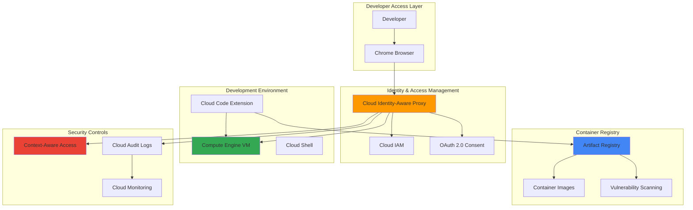

# Secure Remote Development Access with Cloud Identity-Aware Proxy and Cloud Code

## Problem

Modern development teams require secure access to cloud resources for development, testing, and debugging without exposing public IP addresses or managing complex VPN configurations. Traditional security models rely on network perimeters and static credentials, creating security vulnerabilities and operational overhead. Organizations struggle to balance developer productivity with security requirements, often compromising on either accessibility or security controls when establishing remote development environments.

## Solution

Build a zero-trust development environment using Cloud Identity-Aware Proxy (IAP) for identity-based authentication and Cloud Code for secure remote development workflows. This solution leverages Google Cloud's identity verification and contextual access controls to enable developers to securely access development resources through their browsers without traditional VPN setup. Artifact Registry provides secure container image storage with vulnerability scanning, creating a comprehensive secure development pipeline that maintains both productivity and security compliance.

## Architecture Diagram



## Prerequisites

1. Google Cloud account with Owner or Project Admin permissions for IAP configuration
2. Google Cloud CLI installed and configured (or access to Cloud Shell)
3. VS Code installed locally with internet connectivity for Cloud Code extension
4. Basic understanding of containerization and Google Cloud security concepts
5. Estimated cost: $15-25 for development VM and storage during recipe execution

> **Note**: This recipe implements zero-trust security principles and follows Google Cloud's identity-centric access model. Review [Google Cloud Security Best Practices](https://cloud.google.com/security/best-practices) for comprehensive security guidance.

## Preparation

```bash
# Set environment variables for GCP resources
export PROJECT_ID="secure-dev-$(date +%s)"
export REGION="us-central1"
export ZONE="us-central1-a"

# Generate unique suffix for resource names
RANDOM_SUFFIX=$(openssl rand -hex 3)

# Set default project and region
gcloud config set project ${PROJECT_ID}
gcloud config set compute/region ${REGION}
gcloud config set compute/zone ${ZONE}

# Enable required APIs for IAP, Compute, and Artifact Registry
gcloud services enable iap.googleapis.com \
    compute.googleapis.com \
    artifactregistry.googleapis.com \
    cloudbuild.googleapis.com \
    cloudresourcemanager.googleapis.com

# Create Artifact Registry repository for container images
export REPO_NAME="secure-dev-repo-${RANDOM_SUFFIX}"
gcloud artifacts repositories create ${REPO_NAME} \
    --repository-format=docker \
    --location=${REGION} \
    --description="Secure development container registry"

# Configure Docker for Artifact Registry authentication
gcloud auth configure-docker ${REGION}-docker.pkg.dev

echo "✅ Project configured: ${PROJECT_ID}"
echo "✅ Artifact Registry repository created: ${REPO_NAME}"
```

## Steps

1. **Create Development Virtual Machine with IAP Configuration**:

   Cloud Identity-Aware Proxy provides application-level access control that verifies user identity and enforces authorization policies without requiring traditional network-level VPN connections. Creating a development VM with IAP enables secure, browser-based access to development resources while maintaining granular access controls and audit logging for compliance requirements.

   ```bash
   # Create development VM without external IP for security
   export VM_NAME="dev-vm-${RANDOM_SUFFIX}"
   gcloud compute instances create ${VM_NAME} \
       --zone=${ZONE} \
       --machine-type=e2-standard-4 \
       --image-family=ubuntu-2004-lts \
       --image-project=ubuntu-os-cloud \
       --boot-disk-size=50GB \
       --boot-disk-type=pd-standard \
       --no-address \
       --metadata=enable-oslogin=TRUE \
       --scopes=cloud-platform \
       --tags=iap-access,dev-environment
   
   # Create firewall rule allowing IAP access to SSH
   gcloud compute firewall-rules create allow-iap-ssh \
       --direction=INGRESS \
       --priority=1000 \
       --network=default \
       --action=ALLOW \
       --rules=tcp:22 \
       --source-ranges=35.235.240.0/20 \
       --target-tags=iap-access
   
   echo "✅ Development VM created without external IP"
   echo "✅ IAP SSH access firewall rule configured"
   ```

   The development VM is now accessible through IAP's secure tunnel, eliminating the need for external IP addresses or VPN connections. This configuration ensures all access is authenticated and logged through Google Cloud's identity infrastructure.

2. **Configure OAuth Consent Screen for IAP**:

   Identity-Aware Proxy requires OAuth 2.0 consent configuration to authenticate users and enforce access policies. The OAuth consent screen provides user authentication flow and defines the application identity that users will authorize when accessing protected resources through IAP.

   ```bash
   # Set OAuth consent screen (must be done through Console initially)
   echo "⚠️  OAuth consent screen configuration required"
   echo "Navigate to: https://console.cloud.google.com/apis/credentials/consent"
   echo "Set User Type: Internal (for organization) or External"
   echo "Application name: Secure Development Environment"
   echo "User support email: your-email@domain.com"
   echo "Developer contact: your-email@domain.com"
   
   # Create OAuth 2.0 client ID for IAP
   gcloud iap oauth-brands create \
       --application_title="Secure Development Environment" \
       --support_email="$(gcloud config get-value account)"
   
   # Get the OAuth brand name for client creation
   BRAND_NAME=$(gcloud iap oauth-brands list \
       --format="value(name)")
   
   echo "✅ OAuth brand created: ${BRAND_NAME}"
   echo "Note: Complete OAuth consent screen setup in Cloud Console"
   ```

   The OAuth consent screen establishes the authentication framework for IAP, ensuring users understand what application they're authorizing and providing audit trails for access decisions.

3. **Enable IAP for Compute Engine SSH Access**:

   Enabling IAP for SSH access creates secure, authenticated tunnels to Compute Engine instances without requiring public IP addresses or traditional SSH key management. This approach provides identity-based access control with comprehensive audit logging and integration with organizational identity providers.

   ```bash
   # Enable IAP for SSH access to the development VM
   gcloud compute instances add-iam-policy-binding ${VM_NAME} \
       --zone=${ZONE} \
       --member="user:$(gcloud config get-value account)" \
       --role="roles/iap.tunnelResourceAccessor"
   
   # Grant necessary IAM roles for development access
   gcloud projects add-iam-policy-binding ${PROJECT_ID} \
       --member="user:$(gcloud config get-value account)" \
       --role="roles/compute.instanceAdmin"
   
   gcloud projects add-iam-policy-binding ${PROJECT_ID} \
       --member="user:$(gcloud config get-value account)" \
       --role="roles/artifactregistry.writer"
   
   # Test IAP SSH connection to development VM
   gcloud compute ssh ${VM_NAME} \
       --zone=${ZONE} \
       --tunnel-through-iap \
       --command="echo 'IAP SSH connection successful'"
   
   echo "✅ IAP SSH access configured and tested"
   ```

   IAP SSH access is now enabled with proper IAM permissions, providing secure, identity-based access to the development environment with full audit capabilities and no exposed network attack surface.

4. **Install Development Tools on Remote VM**:

   Setting up a comprehensive development environment on the remote VM enables secure, cloud-based development with access to Google Cloud services and container development capabilities. This configuration supports modern development workflows while maintaining security boundaries through IAP access controls.

   ```bash
   # Connect to VM and install development tools
   gcloud compute ssh ${VM_NAME} \
       --zone=${ZONE} \
       --tunnel-through-iap \
       --command="
   # Update system packages
   sudo apt-get update && sudo apt-get upgrade -y
   
   # Install Docker for container development
   curl -fsSL https://get.docker.com -o get-docker.sh
   sudo sh get-docker.sh
   sudo usermod -aG docker \$USER
   
   # Install Google Cloud CLI
   curl https://sdk.cloud.google.com | bash
   
   # Install development tools
   sudo apt-get install -y git vim curl wget unzip \
       python3 python3-pip nodejs npm
   
   # Configure Git (replace with your details)
   git config --global user.name 'Developer Name'
   git config --global user.email 'developer@company.com'
   
   echo '✅ Development environment setup complete'
   "
   
   echo "✅ Development tools installed on remote VM"
   ```

   The remote development environment now includes Docker, Google Cloud CLI, and essential development tools, providing a complete cloud-based development platform accessible through secure IAP connections.

5. **Configure Artifact Registry Authentication and Container Security**:

   Artifact Registry provides secure, private container image storage with integrated vulnerability scanning and access controls. Configuring proper authentication and security policies ensures container images are scanned for vulnerabilities and access is controlled through IAM policies aligned with organizational security requirements.

   ```bash
   # Configure Artifact Registry authentication on the VM
   gcloud compute ssh ${VM_NAME} \
       --zone=${ZONE} \
       --tunnel-through-iap \
       --command="
   # Authenticate gcloud CLI on remote VM
   gcloud auth login --brief
   gcloud config set project ${PROJECT_ID}
   
   # Configure Docker for Artifact Registry
   gcloud auth configure-docker ${REGION}-docker.pkg.dev
   
   # Create sample application with Dockerfile
   mkdir -p ~/secure-app && cd ~/secure-app
   
   cat > Dockerfile << 'EOF'
FROM python:3.9-slim
WORKDIR /app
RUN pip install flask
COPY . .
EXPOSE 8080
CMD ['python', 'app.py']
EOF
   
   cat > app.py << 'EOF'
from flask import Flask
app = Flask(__name__)

@app.route('/')
def hello():
    return 'Secure Development Environment - IAP Protected'

if __name__ == '__main__':
    app.run(host='0.0.0.0', port=8080)
EOF
   
   echo '✅ Sample application created'
   "
   
   # Build and push container image to Artifact Registry
   export IMAGE_URI="${REGION}-docker.pkg.dev/${PROJECT_ID}/${REPO_NAME}/secure-app:v1.0"
   
   gcloud compute ssh ${VM_NAME} \
       --zone=${ZONE} \
       --tunnel-through-iap \
       --command="
   cd ~/secure-app
   docker build -t ${IMAGE_URI} .
   docker push ${IMAGE_URI}
   echo '✅ Container image pushed to Artifact Registry'
   "
   
   echo "✅ Container image built and stored securely"
   ```

   The sample application is now containerized and stored in Artifact Registry with automatic vulnerability scanning enabled, demonstrating secure container development workflows through IAP-protected environments.

6. **Configure Context-Aware Access Policies**:

   Context-aware access policies enhance security by evaluating additional signals like device security status, location, and time-based restrictions. These policies provide dynamic access control that adapts to risk levels and organizational security requirements beyond basic identity verification.

   ```bash
   # Create access level for development environment access
   gcloud access-context-manager policies create \
       --title="Secure Development Policy" \
       --organization="$(gcloud organizations list --format='value(name)' --limit=1)"
   
   # Get policy ID for access level creation
   POLICY_ID=$(gcloud access-context-manager policies list \
       --format="value(name)" | head -n1)
   
   # Create basic access level (requires valid organization)
   if [ ! -z "${POLICY_ID}" ]; then
       gcloud access-context-manager levels create dev-access \
           --policy=${POLICY_ID} \
           --title="Development Environment Access" \
           --basic-level-spec='device_policy: {require_screen_lock: true}'
   else
       echo "⚠️  Organization-level Access Context Manager not available"
       echo "Consider implementing additional security controls:"
       echo "- Time-based access restrictions"
       echo "- Device certificate requirements"
       echo "- Location-based access policies"
   fi
   
   # Configure IAP access policy for the VM
   gcloud compute instances set-iam-policy ${VM_NAME} /dev/stdin <<EOF
bindings:
- members:
  - user:$(gcloud config get-value account)
  role: roles/iap.tunnelResourceAccessor
- members:
  - user:$(gcloud config get-value account)
  role: roles/compute.osLogin
etag: ""
version: 1
EOF
   
   echo "✅ IAP access policies configured"
   ```

   Context-aware access policies are configured to enhance security through additional verification signals, providing adaptive access control based on device security and other contextual factors.

7. **Set Up Cloud Code for Remote Development**:

   Cloud Code integrates with VS Code to provide seamless remote development capabilities with Google Cloud services. This configuration enables developers to work with cloud resources, deploy applications, and manage containers directly from their local development environment while maintaining secure access through IAP.

   ```bash
   # Create Cloud Code configuration for the project
   mkdir -p .vscode && cat > .vscode/settings.json << EOF
{
    "cloudcode.gcp.project": "${PROJECT_ID}",
    "cloudcode.gcp.region": "${REGION}",
    "cloudcode.kubernetes.defaultNamespace": "default",
    "cloudcode.artifactRegistry.repository": "${REGION}-docker.pkg.dev/${PROJECT_ID}/${REPO_NAME}"
}
EOF
   
   # Create development workspace configuration
   cat > .vscode/launch.json << EOF
{
    "version": "0.2.0",
    "configurations": [
        {
            "name": "Cloud Run: Debug",
            "type": "cloudcode.cloudrun",
            "request": "launch",
            "build": {
                "docker": {
                    "path": "Dockerfile"
                }
            },
            "deploy": {
                "cloudrun": {
                    "region": "${REGION}",
                    "service": "secure-dev-app"
                }
            }
        }
    ]
}
EOF
   
   echo "✅ Cloud Code configuration created"
   echo "Install Cloud Code extension: code --install-extension GoogleCloudTools.cloudcode"
   echo "Open VS Code and connect to remote development environment"
   ```

   Cloud Code configuration is established to enable seamless integration between local VS Code and the secure remote development environment, providing a complete cloud-native development workflow.

8. **Enable Audit Logging and Monitoring**:

   Comprehensive audit logging and monitoring provide visibility into access patterns, security events, and operational activities within the secure development environment. This observability framework enables security teams to monitor access compliance and detect potential security threats or policy violations.

   ```bash
   # Enable audit logs for IAP and Compute Engine
   cat > audit-policy.yaml << EOF
auditConfigs:
- service: iap.googleapis.com
  auditLogConfigs:
  - logType: ADMIN_READ
  - logType: DATA_READ
  - logType: DATA_WRITE
- service: compute.googleapis.com
  auditLogConfigs:
  - logType: ADMIN_READ
  - logType: DATA_WRITE
    exemptedMembers:
    - serviceAccount:service-account@example.com
EOF
   
   # Apply audit configuration
   gcloud logging sinks create iap-audit-sink \
       bigquery.googleapis.com/projects/${PROJECT_ID}/datasets/security_audit \
       --log-filter='protoPayload.serviceName="iap.googleapis.com" OR protoPayload.serviceName="compute.googleapis.com"'
   
   # Create monitoring dashboard for IAP access
   gcloud monitoring dashboards create \
       --config-from-file=<(cat << EOF
{
  "displayName": "IAP Security Dashboard",
  "gridLayout": {
    "widgets": [
      {
        "title": "IAP Access Attempts",
        "xyChart": {
          "dataSets": [
            {
              "timeSeriesQuery": {
                "timeSeriesFilter": {
                  "filter": "resource.type=\"iap_tunnel\"",
                  "aggregation": {
                    "alignmentPeriod": "300s",
                    "perSeriesAligner": "ALIGN_RATE"
                  }
                }
              }
            }
          ]
        }
      }
    ]
  }
}
EOF
)
   
   echo "✅ Audit logging and monitoring configured"
   ```

   Comprehensive audit logging and monitoring dashboards are configured to provide security visibility and compliance reporting for the secure development environment.

## Validation & Testing

1. **Verify IAP SSH Access and Security Controls**:

   ```bash
   # Test IAP SSH connection without external IP
   gcloud compute ssh ${VM_NAME} \
       --zone=${ZONE} \
       --tunnel-through-iap \
       --command="curl -H 'Metadata-Flavor: Google' \
       http://metadata.google.internal/computeMetadata/v1/instance/network-interfaces/0/external-ip"
   ```

   Expected output: No external IP address returned, confirming secure access

2. **Validate Artifact Registry Security and Container Scanning**:

   ```bash
   # Check container vulnerability scan results
   gcloud artifacts docker images scan ${IMAGE_URI} \
       --location=${REGION}
   
   # List scan results
   gcloud artifacts docker images list-vulnerabilities ${IMAGE_URI} \
       --location=${REGION} \
       --format="table(vulnerability.cvssScore,vulnerability.severity)"
   ```

   Expected output: Vulnerability scan results with severity ratings

3. **Test Context-Aware Access Controls**:

   ```bash
   # Verify IAM policy enforcement
   gcloud compute instances get-iam-policy ${VM_NAME} \
       --zone=${ZONE} \
       --format="table(bindings.members,bindings.role)"
   ```

   Expected output: IAM bindings showing IAP tunnel access roles

4. **Validate Audit Logging Configuration**:

   ```bash
   # Check recent audit logs for IAP access
   gcloud logging read 'protoPayload.serviceName="iap.googleapis.com"' \
       --limit=5 \
       --format="table(timestamp,protoPayload.authenticationInfo.principalEmail)"
   ```

   Expected output: Recent IAP access events with user principals

## Cleanup

1. **Remove Compute Engine Resources**:

   ```bash
   # Delete development VM
   gcloud compute instances delete ${VM_NAME} \
       --zone=${ZONE} \
       --quiet
   
   # Remove firewall rules
   gcloud compute firewall-rules delete allow-iap-ssh \
       --quiet
   
   echo "✅ Compute Engine resources deleted"
   ```

2. **Clean Up Artifact Registry**:

   ```bash
   # Delete container images
   gcloud artifacts docker images delete ${IMAGE_URI} \
       --location=${REGION} \
       --quiet
   
   # Delete repository
   gcloud artifacts repositories delete ${REPO_NAME} \
       --location=${REGION} \
       --quiet
   
   echo "✅ Artifact Registry resources deleted"
   ```

3. **Remove IAM Bindings and Policies**:

   ```bash
   # Remove project-level IAM bindings
   gcloud projects remove-iam-policy-binding ${PROJECT_ID} \
       --member="user:$(gcloud config get-value account)" \
       --role="roles/compute.instanceAdmin"
   
   gcloud projects remove-iam-policy-binding ${PROJECT_ID} \
       --member="user:$(gcloud config get-value account)" \
       --role="roles/artifactregistry.writer"
   
   echo "✅ IAM policies cleaned up"
   ```

4. **Disable APIs and Remove Project Resources**:

   ```bash
   # Disable APIs to prevent charges
   gcloud services disable iap.googleapis.com \
       compute.googleapis.com \
       artifactregistry.googleapis.com \
       cloudbuild.googleapis.com
   
   # Delete project (if created specifically for recipe)
   gcloud projects delete ${PROJECT_ID} --quiet
   
   echo "✅ Project resources cleaned up successfully"
   echo "Note: Project deletion may take several minutes to complete"
   ```

## Discussion

This recipe demonstrates implementing a zero-trust security model for remote development environments using Google Cloud's Identity-Aware Proxy and Cloud Code integration. The solution eliminates traditional VPN complexity while providing enterprise-grade security through identity-based access controls, contextual access policies, and comprehensive audit logging. IAP's application-level access control ensures every request is authenticated and authorized in real-time, removing the need for broad network access or perimeter-based security models.

The integration between Cloud Code and Artifact Registry creates a secure development pipeline where container images are automatically scanned for vulnerabilities and stored in private registries with granular access controls. This approach supports modern DevSecOps practices by embedding security controls directly into the development workflow rather than treating security as a separate concern. Developers maintain productivity through seamless VS Code integration while security teams gain visibility through comprehensive audit trails and monitoring dashboards.

Context-aware access policies provide additional security layers by evaluating device security status, location, and other contextual signals before granting access. This dynamic approach to access control adapts to changing risk levels and supports compliance requirements for regulated industries. The solution scales from individual developers to large development teams while maintaining consistent security controls and operational visibility across all access patterns.

The architecture supports hybrid and multi-cloud development scenarios where developers need secure access to cloud resources from various locations and devices. By leveraging Google Cloud's global infrastructure and identity services, organizations can provide consistent security controls regardless of developer location while maintaining compliance with data residency and privacy requirements.

> **Tip**: Implement regular access reviews and automated policy compliance checks using Cloud Asset Inventory and Security Command Center to maintain security posture over time. Consider integrating with organizational identity providers through Cloud Identity or third-party SAML providers for centralized identity management.

## Challenge

Extend this solution by implementing these enhancements:

1. **Implement Advanced Threat Detection**: Integrate Security Command Center and Cloud DLP to monitor development environment access patterns and detect potential security threats or data exfiltration attempts
2. **Add Multi-Environment Promotion**: Create separate development, staging, and production environments with automated promotion pipelines using Cloud Build and Binary Authorization for container signing
3. **Enable Collaborative Development**: Implement shared development environments with Cloud Workstations and integrate with Cloud Source Repositories for secure, collaborative coding with automated code quality checks
4. **Deploy Zero-Trust Networking**: Extend the solution with VPC Service Controls to create secure perimeters around sensitive data and implement private service connectivity for enhanced data protection
5. **Integrate Compliance Automation**: Add automated compliance checking using Policy Intelligence and Forseti Security to ensure development practices meet regulatory requirements and organizational security policies

## Infrastructure Code

*Infrastructure code will be generated after recipe approval.*