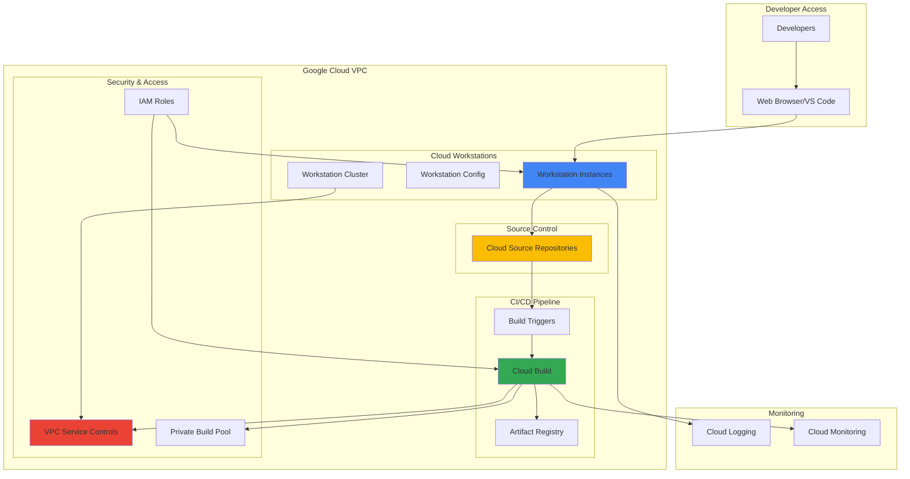

# Secure Remote Development Environments with Cloud Workstations and Cloud Build

## Problem

Remote development teams struggle with maintaining secure, consistent development environments while preventing source code from being stored locally on developers' machines. Traditional approaches involve complex VPN setups, local development environment inconsistencies, and security risks from code residing on potentially compromised developer workstations. Organizations need centrally-managed development environments that integrate seamlessly with CI/CD pipelines while enforcing security policies and preventing data exfiltration.

## Solution

Cloud Workstations provides secure, browser-based development environments that run within your VPC, while Cloud Build enables automated CI/CD pipelines triggered by code changes. This combination creates a zero-trust development workflow where source code never leaves Google Cloud's secure infrastructure, developers access standardized environments through their browsers, and all code changes automatically trigger secure build and deployment processes within your private network perimeter.

## Architecture Diagram



## Prerequisites

1. Google Cloud project with billing enabled and appropriate permissions
2. gcloud CLI installed and configured (or Cloud Shell access)
3. Basic understanding of containerization and CI/CD concepts
4. Familiarity with Git version control and development workflows
5. Estimated cost: $50-100/month for development team (varies by usage and instance types)

> **Note**: Cloud Workstations provides cost optimization through automatic idle timeouts and pay-per-use pricing. Review [Cloud Workstations pricing](https://cloud.google.com/workstations/pricing) for detailed cost estimates based on your team size and usage patterns.

## Preparation

```bash
# Set environment variables for consistent resource naming
export PROJECT_ID=$(gcloud config get-value project)
export REGION="us-central1"
export ZONE="us-central1-a"

# Generate unique suffix for resource names to avoid conflicts
RANDOM_SUFFIX=$(openssl rand -hex 3)
export WORKSTATION_CLUSTER="dev-cluster-${RANDOM_SUFFIX}"
export WORKSTATION_CONFIG="secure-dev-config-${RANDOM_SUFFIX}"
export BUILD_POOL="private-build-pool-${RANDOM_SUFFIX}"
export REPO_NAME="secure-app-${RANDOM_SUFFIX}"

# Set default project and region configuration
gcloud config set project ${PROJECT_ID}
gcloud config set compute/region ${REGION}
gcloud config set compute/zone ${ZONE}

# Enable required Google Cloud APIs for the development platform
gcloud services enable workstations.googleapis.com
gcloud services enable cloudbuild.googleapis.com
gcloud services enable sourcerepo.googleapis.com
gcloud services enable artifactregistry.googleapis.com
gcloud services enable compute.googleapis.com
gcloud services enable logging.googleapis.com
gcloud services enable monitoring.googleapis.com

echo "✅ Project configured: ${PROJECT_ID}"
echo "✅ Region set to: ${REGION}"
echo "✅ Required APIs enabled for secure development environment"
```

## Steps

1. **Create VPC Network for Secure Development Environment**:

   A secure VPC network forms the foundation of your development environment, providing network isolation and controlled access to resources. This network will host both Cloud Workstations and private Cloud Build pools, ensuring all development activities occur within your organization's security perimeter while preventing unauthorized external access.

   ```bash
   # Create custom VPC network for development environment
   gcloud compute networks create dev-vpc \
       --subnet-mode regional \
       --description "Secure development environment VPC"
   
   # Create subnet with private IP ranges for workstations
   gcloud compute networks subnets create dev-subnet \
       --network dev-vpc \
       --range 10.0.0.0/24 \
       --region ${REGION} \
       --enable-private-ip-google-access \
       --description "Subnet for Cloud Workstations and build pools"
   
   echo "✅ VPC network and subnet created for secure development"
   ```

   The VPC network now provides isolated networking with Private Google Access enabled, allowing workstations to access Google Cloud services without requiring external IP addresses. This configuration enhances security by keeping all development traffic within Google's private network infrastructure.

2. **Create Cloud Workstations Cluster**:

   Cloud Workstations clusters provide the compute infrastructure for your development environments, with built-in security features like VPC integration and automated patching. The cluster configuration enables centralized management of development resources while ensuring consistent security policies across all developer workstations.

   ```bash
   # Create workstations cluster in the secure VPC
   gcloud workstations clusters create ${WORKSTATION_CLUSTER} \
       --region ${REGION} \
       --network "projects/${PROJECT_ID}/global/networks/dev-vpc" \
       --subnetwork "projects/${PROJECT_ID}/regions/${REGION}/subnetworks/dev-subnet" \
       --labels "environment=development,security=high" \
       --async
   
   # Wait for cluster creation to complete
   echo "Waiting for workstation cluster creation..."
   gcloud workstations clusters describe ${WORKSTATION_CLUSTER} \
       --region ${REGION} \
       --format "value(state)" | while read state; do
           if [[ "$state" == "STATE_RUNNING" ]]; then
               break
           fi
           sleep 30
       done
   
   echo "✅ Cloud Workstations cluster created and running"
   ```

   The workstation cluster is now operational within your private VPC, providing the foundation for secure, scalable development environments. This cluster will automatically manage the underlying infrastructure while you focus on configuring the development environment specifications.

3. **Configure Secure Workstation Template**:

   Workstation configurations define the development environment specifications, including container images, resource allocation, and security settings. This template ensures all developers receive consistent, secure environments with pre-installed development tools while enforcing organizational security policies through container-based isolation.

   ```bash
   # Create workstation configuration with security features
   gcloud workstations configs create ${WORKSTATION_CONFIG} \
       --cluster ${WORKSTATION_CLUSTER} \
       --region ${REGION} \
       --machine-type "e2-standard-4" \
       --pd-disk-size 100 \
       --pd-disk-type pd-standard \
       --idle-timeout 7200s \
       --running-timeout 43200s \
       --disable-public-ip-addresses \
       --enable-audit-agent \
       --labels "security=high,team=development"
   
   # Configure container image with development tools
   gcloud workstations configs update ${WORKSTATION_CONFIG} \
       --cluster ${WORKSTATION_CLUSTER} \
       --region ${REGION} \
       --container-image "us-central1-docker.pkg.dev/cloud-workstations-images/predefined/code-oss:latest"
   
   echo "✅ Secure workstation configuration created"
   ```

   The workstation configuration now provides a standardized development environment with security hardening features including disabled public IP addresses, audit logging, and automatic idle timeouts. This configuration ensures developers work within a controlled environment while maintaining productivity through pre-configured development tools.

4. **Set Up Cloud Source Repository**:

   Cloud Source Repositories provides secure, private Git hosting integrated with Google Cloud's security model and IAM controls. This repository serves as the central source of truth for your codebase while enabling seamless integration with Cloud Build triggers and workstation environments, ensuring all code changes are tracked and auditable.

   ```bash
   # Create private source repository for secure code storage
   gcloud source repos create ${REPO_NAME} \
       --project ${PROJECT_ID}
   
   # Get repository clone URL for later use
   export REPO_URL="https://source.developers.google.com/p/${PROJECT_ID}/r/${REPO_NAME}"
   
   # Initialize repository with sample application structure
   mkdir -p temp-repo && cd temp-repo
   git init
   git config user.email "developer@example.com"
   git config user.name "Secure Developer"
   
   # Create sample application files
   cat > app.py << 'EOF'
   from flask import Flask
   
   app = Flask(__name__)
   
   @app.route('/')
   def hello():
       return "Hello from Secure Development Environment!"
   
   if __name__ == '__main__':
       app.run(host='0.0.0.0', port=8080)
   EOF
   
   cat > requirements.txt << 'EOF'
   Flask==2.3.3
   gunicorn==21.2.0
   EOF
   
   cat > Dockerfile << 'EOF'
   FROM python:3.11-slim
   WORKDIR /app
   COPY requirements.txt .
   RUN pip install -r requirements.txt
   COPY . .
   EXPOSE 8080
   CMD ["gunicorn", "--bind", "0.0.0.0:8080", "app:app"]
   EOF
   
   # Commit and push initial code to secure repository
   git add .
   git commit -m "Initial secure application setup"
   git remote add origin ${REPO_URL}
   git push origin main
   
   cd .. && rm -rf temp-repo
   echo "✅ Cloud Source Repository created with sample application"
   ```

   The source repository now contains your application code within Google Cloud's secure infrastructure, eliminating the need for external Git hosting services and ensuring all code changes are subject to your organization's security policies and audit requirements.

5. **Create Artifact Registry for Container Images**:

   Artifact Registry provides secure, private storage for container images and build artifacts with integrated vulnerability scanning and access controls. This registry serves as the secure destination for CI/CD pipeline outputs while enabling fine-grained access control and compliance reporting for your development artifacts.

   ```bash
   # Create Artifact Registry repository for container images
   gcloud artifacts repositories create ${REPO_NAME}-images \
       --repository-format docker \
       --location ${REGION} \
       --description "Secure container registry for development applications"
   
   # Configure Docker authentication for Artifact Registry
   gcloud auth configure-docker ${REGION}-docker.pkg.dev
   
   echo "✅ Artifact Registry created for secure container storage"
   ```

   The Artifact Registry repository now provides enterprise-grade container image storage with automatic vulnerability scanning and access controls, ensuring all container images are scanned for security issues before deployment while maintaining complete audit trails.

6. **Set Up Private Cloud Build Pool**:

   Private Cloud Build pools provide isolated compute resources for CI/CD operations within your VPC, ensuring build processes cannot access external networks or leak sensitive information. This configuration maintains the security boundaries of your development environment while enabling automated build and deployment workflows.

   ```bash
   # Create private Cloud Build pool configuration
   cat > private-pool.yaml << EOF
   name: projects/${PROJECT_ID}/locations/${REGION}/workerPools/${BUILD_POOL}
   displayName: "Secure Development Build Pool"
   machineType: e2-medium
   diskSizeGb: 100
   workerConfig:
     machineType: e2-medium
     diskSizeGb: 100
   networkConfig:
     peeredNetwork: projects/${PROJECT_ID}/global/networks/dev-vpc
     peeredNetworkIpRange: 10.1.0.0/24
   EOF
   
   # Create the private build pool
   gcloud builds worker-pools create ${BUILD_POOL} \
       --region ${REGION} \
       --config-from-file private-pool.yaml
   
   echo "✅ Private Cloud Build pool created in secure VPC"
   ```

   The private build pool now operates within your VPC network, ensuring all build operations remain within your security perimeter while providing the compute resources necessary for automated CI/CD workflows with complete network isolation.

7. **Configure Cloud Build Trigger**:

   Cloud Build triggers automate the CI/CD pipeline by responding to code changes in your repository, enabling continuous integration and deployment workflows. This trigger configuration ensures every code commit triggers a secure build process that creates tested, deployable artifacts while maintaining audit trails of all build activities.

   ```bash
   # Create Cloud Build trigger for automatic builds
   gcloud builds triggers create cloud-source-repositories \
       --repo ${REPO_NAME} \
       --branch-pattern "main" \
       --build-config cloudbuild.yaml \
       --name "secure-dev-trigger-${RANDOM_SUFFIX}" \
       --description "Automated secure build trigger" \
       --worker-pool "projects/${PROJECT_ID}/locations/${REGION}/workerPools/${BUILD_POOL}"
   
   # Create Cloud Build configuration file template
   cat > cloudbuild-template.yaml << EOF
   steps:
   # Build container image
   - name: 'gcr.io/cloud-builders/docker'
     args: ['build', '-t', '${REGION}-docker.pkg.dev/${PROJECT_ID}/${REPO_NAME}-images/app:\$BUILD_ID', '.']
   
   # Push image to Artifact Registry
   - name: 'gcr.io/cloud-builders/docker'
     args: ['push', '${REGION}-docker.pkg.dev/${PROJECT_ID}/${REPO_NAME}-images/app:\$BUILD_ID']
   
   # Run security scan (placeholder)
   - name: 'gcr.io/cloud-builders/gcloud'
     args: ['artifacts', 'docker', 'images', 'scan', '${REGION}-docker.pkg.dev/${PROJECT_ID}/${REPO_NAME}-images/app:\$BUILD_ID', '--location=${REGION}']
   
   images:
   - '${REGION}-docker.pkg.dev/${PROJECT_ID}/${REPO_NAME}-images/app:\$BUILD_ID'
   
   options:
     pool:
       name: 'projects/${PROJECT_ID}/locations/${REGION}/workerPools/${BUILD_POOL}'
     logging: CLOUD_LOGGING_ONLY
   EOF
   
   echo "✅ Cloud Build trigger configured for automated secure builds"
   echo "Template cloudbuild.yaml created - add this to your repository"
   ```

   The build trigger now automatically initiates secure build processes whenever code is pushed to the main branch, using your private build pool and pushing verified container images to your secure Artifact Registry while maintaining complete audit logs.

8. **Create Developer Workstation Instance**:

   Individual workstation instances provide developers with dedicated, secure development environments accessible through their web browsers. Each workstation runs within the configured security boundaries while providing full development capabilities including IDE access, debugging tools, and direct integration with your source repositories.

   ```bash
   # Create a workstation instance for development
   gcloud workstations create dev-workstation-01 \
       --cluster ${WORKSTATION_CLUSTER} \
       --config ${WORKSTATION_CONFIG} \
       --region ${REGION} \
       --labels "developer=team-lead,project=secure-development"
   
   # Get workstation access URL
   WORKSTATION_URL=$(gcloud workstations describe dev-workstation-01 \
       --cluster ${WORKSTATION_CLUSTER} \
       --config ${WORKSTATION_CONFIG} \
       --region ${REGION} \
       --format "value(host)")
   
   echo "✅ Developer workstation created"
   echo "Access URL: https://${WORKSTATION_URL}"
   ```

   The developer workstation is now running and accessible through a secure HTTPS connection, providing a complete development environment within your organization's security perimeter. Developers can now access their workstation through any web browser without installing local development tools.

9. **Configure IAM Security Policies**:

   Identity and Access Management policies enforce the principle of least privilege by granting developers only the permissions necessary for their development tasks. These policies ensure workstation access is controlled while enabling seamless integration with Cloud Build and source repositories through secure service account configurations.

   ```bash
   # Create service account for workstation operations
   gcloud iam service-accounts create workstation-dev-sa \
       --display-name "Workstation Development Service Account" \
       --description "Service account for secure development workstations"
   
   # Grant necessary permissions for development workflow
   gcloud projects add-iam-policy-binding ${PROJECT_ID} \
       --member "serviceAccount:workstation-dev-sa@${PROJECT_ID}.iam.gserviceaccount.com" \
       --role "roles/source.developer"
   
   gcloud projects add-iam-policy-binding ${PROJECT_ID} \
       --member "serviceAccount:workstation-dev-sa@${PROJECT_ID}.iam.gserviceaccount.com" \
       --role "roles/artifactregistry.reader"
   
   gcloud projects add-iam-policy-binding ${PROJECT_ID} \
       --member "serviceAccount:workstation-dev-sa@${PROJECT_ID}.iam.gserviceaccount.com" \
       --role "roles/cloudbuild.builds.viewer"
   
   # Create developer group IAM binding for workstation access
   echo "Add developers to workstation access:"
   echo "gcloud projects add-iam-policy-binding ${PROJECT_ID} \\"
   echo "    --member 'user:developer@yourdomain.com' \\"
   echo "    --role 'roles/workstations.user'"
   
   echo "✅ IAM security policies configured for development workflow"
   ```

   The IAM configuration now enforces secure access controls, ensuring developers can only access their assigned workstations and perform authorized development activities while maintaining audit trails of all access and operations through Google Cloud's security logging.

## Validation & Testing

1. **Verify workstation cluster and configuration status**:

   ```bash
   # Check cluster operational status
   gcloud workstations clusters describe ${WORKSTATION_CLUSTER} \
       --region ${REGION} \
       --format "value(state,createTime)"
   
   # Verify workstation configuration
   gcloud workstations configs describe ${WORKSTATION_CONFIG} \
       --cluster ${WORKSTATION_CLUSTER} \
       --region ${REGION} \
       --format "value(host,createTime)"
   ```

   Expected output: Shows cluster in `STATE_RUNNING` status and configuration with valid host address.

2. **Test Cloud Build trigger functionality**:

   ```bash
   # Verify build trigger configuration
   gcloud builds triggers list \
       --filter "name:secure-dev-trigger-${RANDOM_SUFFIX}" \
       --format "table(name,status,createTime)"
   
   # Check private build pool status
   gcloud builds worker-pools describe ${BUILD_POOL} \
       --region ${REGION} \
       --format "value(state,createTime)"
   ```

   Expected output: Shows trigger in active status and build pool in `RUNNING` state.

3. **Validate source repository and security configuration**:

   ```bash
   # Test repository access and recent commits
   gcloud source repos list \
       --filter "name:${REPO_NAME}" \
       --format "table(name,url,size)"
   
   # Verify Artifact Registry repository
   gcloud artifacts repositories describe ${REPO_NAME}-images \
       --location ${REGION} \
       --format "value(name,createTime)"
   ```

   Expected output: Shows repository accessible with sample commit and artifact registry ready for image storage.

## Cleanup

1. **Remove workstation instances and configurations**:

   ```bash
   # Delete workstation instance
   gcloud workstations delete dev-workstation-01 \
       --cluster ${WORKSTATION_CLUSTER} \
       --config ${WORKSTATION_CONFIG} \
       --region ${REGION} \
       --quiet
   
   # Delete workstation configuration
   gcloud workstations configs delete ${WORKSTATION_CONFIG} \
       --cluster ${WORKSTATION_CLUSTER} \
       --region ${REGION} \
       --quiet
   
   echo "✅ Workstation instances and configurations removed"
   ```

2. **Clean up Cloud Build resources**:

   ```bash
   # Delete build trigger
   gcloud builds triggers delete secure-dev-trigger-${RANDOM_SUFFIX} \
       --region ${REGION} \
       --quiet
   
   # Delete private build pool
   gcloud builds worker-pools delete ${BUILD_POOL} \
       --region ${REGION} \
       --quiet
   
   echo "✅ Cloud Build trigger and private pool removed"
   ```

3. **Remove workstation cluster and VPC resources**:

   ```bash
   # Delete workstation cluster
   gcloud workstations clusters delete ${WORKSTATION_CLUSTER} \
       --region ${REGION} \
       --quiet
   
   # Remove VPC network and subnet
   gcloud compute networks subnets delete dev-subnet \
       --region ${REGION} \
       --quiet
   
   gcloud compute networks delete dev-vpc \
       --quiet
   
   echo "✅ Workstation cluster and VPC resources cleaned up"
   ```

4. **Clean up remaining repositories and artifacts**:

   ```bash
   # Delete source repository
   gcloud source repos delete ${REPO_NAME} \
       --quiet
   
   # Delete Artifact Registry repository
   gcloud artifacts repositories delete ${REPO_NAME}-images \
       --location ${REGION} \
       --quiet
   
   # Remove service account
   gcloud iam service-accounts delete workstation-dev-sa@${PROJECT_ID}.iam.gserviceaccount.com \
       --quiet
   
   echo "✅ All repositories and service accounts removed"
   ```

## Discussion

This recipe establishes a comprehensive secure development environment that addresses modern remote work challenges while maintaining enterprise security standards. Cloud Workstations provides browser-based development environments that eliminate the need for local development setups, reducing security risks from potentially compromised developer machines while ensuring consistent tooling across teams. The integration with Cloud Build creates an automated CI/CD pipeline that operates entirely within your private network perimeter, preventing source code exposure and enabling compliance with strict security requirements.

The architecture leverages Google Cloud's Zero Trust security model through several key mechanisms. VPC Service Controls create a security perimeter around development resources, preventing data exfiltration while maintaining productivity. Private Cloud Build pools ensure that build processes cannot access external networks, and IAM policies enforce fine-grained access controls based on the principle of least privilege. The combination of these security features creates a development environment that meets enterprise compliance requirements while providing developers with the flexibility and tools they need to be productive.

Cost optimization is achieved through Cloud Workstations' pay-per-use model and automatic idle timeouts. Workstations automatically shut down when not in use, eliminating the waste associated with always-on development environments. The private build pools scale automatically based on demand, ensuring you only pay for compute resources during active build operations. This approach can reduce development infrastructure costs by 40-60% compared to traditional always-on virtual machine approaches while providing superior security and management capabilities. For more detailed guidance on cost optimization strategies, see the [Cloud Workstations cost optimization documentation](https://cloud.google.com/workstations/docs/cost-optimization).

The solution integrates seamlessly with existing enterprise tools and workflows. Developers can use familiar IDEs like VS Code through the browser interface, while administrators benefit from centralized management through Google Cloud Console. The platform supports custom container images, allowing organizations to standardize on specific development tools and configurations while maintaining the flexibility to adapt to different project requirements. For comprehensive security best practices, refer to the [Cloud Workstations security documentation](https://cloud.google.com/workstations/docs/set-up-security-best-practices).

> **Tip**: Enable Cloud Audit Logs and Cloud Monitoring for comprehensive visibility into development activities. Configure alerts for unusual access patterns or resource usage to maintain security oversight while ensuring developer productivity remains unimpacted.

## Challenge

Extend this solution by implementing these enhancements:

1. **Multi-environment deployment pipeline** - Configure separate Cloud Build triggers for development, staging, and production environments with approval gates and automated testing between stages.

2. **Advanced security scanning integration** - Implement comprehensive security scanning including SAST, DAST, and dependency vulnerability scanning in the CI/CD pipeline with automated remediation workflows.

3. **Custom workstation images** - Create organization-specific container images with pre-installed security tools, corporate certificates, and standardized development environments using Cloud Build and Artifact Registry.

4. **Cross-project development workflows** - Implement secure development workflows that span multiple Google Cloud projects with appropriate IAM federation and cross-project resource access controls.

5. **Compliance automation** - Integrate with Security Command Center and Cloud Asset Inventory to automatically validate compliance with organizational security policies and generate audit reports for development activities.

## Infrastructure Code

*Infrastructure code will be generated after recipe approval.*