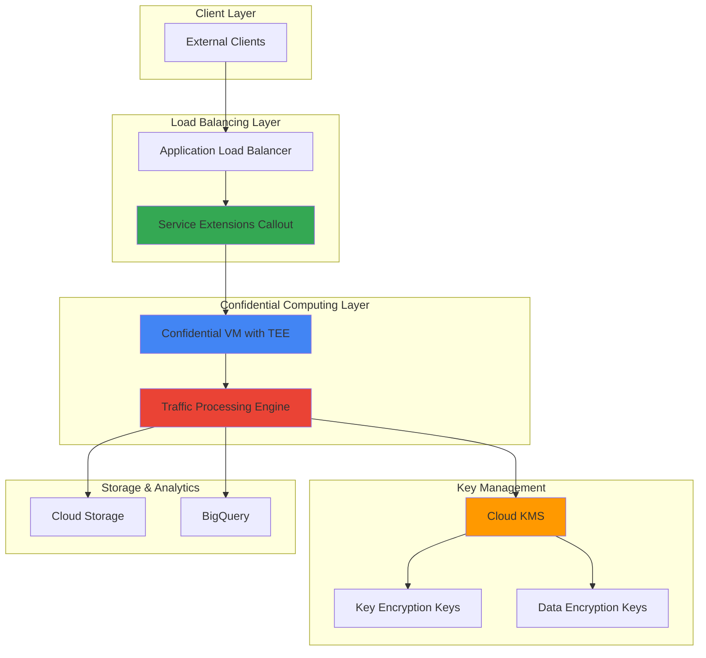

# Secure Traffic Processing with Service Extensions and Confidential Computing

## Problem

Financial institutions and healthcare organizations need to process sensitive network traffic for compliance monitoring and threat detection, but existing solutions expose plaintext data during processing, creating security vulnerabilities and regulatory compliance risks. Traditional traffic analysis systems cannot guarantee data protection during computation, leaving sensitive information vulnerable to insider threats and memory-based attacks.

## Solution

Build a secure traffic processing pipeline using Google Cloud Service Extensions deployed on Confidential VMs with Cloud KMS encryption. This architecture combines hardware-based Trusted Execution Environments (TEEs) for encryption-in-use protection, custom traffic processing logic through Service Extensions callouts, and centralized key management for end-to-end security of sensitive network data analysis.

## Architecture Diagram



## Prerequisites

1. Google Cloud project with billing enabled and appropriate IAM permissions for Compute Engine, Service Extensions, and Cloud KMS
2. gcloud CLI installed and configured (or Cloud Shell)
3. Understanding of network security, encryption concepts, and Google Cloud networking
4. Familiarity with gRPC API development and Envoy proxy configurations
5. Estimated cost: $15-25 for Confidential VM instances, load balancer, and KMS operations during testing

> **Note**: Confidential Computing requires specific machine types and regions. Verify availability in your target region before proceeding.

## Preparation

```bash
# Set environment variables for GCP resources
export PROJECT_ID="secure-traffic-$(date +%s)"
export REGION="us-central1"
export ZONE="us-central1-a"

# Generate unique suffix for resource names
RANDOM_SUFFIX=$(openssl rand -hex 3)

# Set resource names
export KEYRING_NAME="traffic-keyring-${RANDOM_SUFFIX}"
export KEY_NAME="traffic-encryption-key"
export VM_NAME="confidential-processor-${RANDOM_SUFFIX}"
export SERVICE_NAME="traffic-service-${RANDOM_SUFFIX}"
export BUCKET_NAME="secure-traffic-data-${RANDOM_SUFFIX}"

# Set default project and region
gcloud config set project ${PROJECT_ID}
gcloud config set compute/region ${REGION}
gcloud config set compute/zone ${ZONE}

# Enable required APIs
gcloud services enable compute.googleapis.com
gcloud services enable cloudkms.googleapis.com
gcloud services enable networkservices.googleapis.com
gcloud services enable storage.googleapis.com

echo "✅ Project configured: ${PROJECT_ID}"
echo "✅ Resources will use suffix: ${RANDOM_SUFFIX}"
```

## Steps

1. **Create Cloud KMS Key Ring and Encryption Keys**:

   Cloud KMS provides centralized cryptographic key management with hardware security modules for protecting sensitive data. Creating a dedicated key ring with customer-managed encryption keys (CMEK) ensures full control over encryption keys used throughout the traffic processing pipeline, enabling crypto-shredding capabilities for data lifecycle management.

   ```bash
   # Create KMS key ring for traffic encryption keys
   gcloud kms keyrings create ${KEYRING_NAME} \
       --location=${REGION}
   
   # Create primary encryption key for data protection
   gcloud kms keys create ${KEY_NAME} \
       --keyring=${KEYRING_NAME} \
       --location=${REGION} \
       --purpose=encryption
   
   # Create service account for Confidential VM
   gcloud iam service-accounts create confidential-processor \
       --display-name="Confidential Traffic Processor"
   
   echo "✅ KMS key ring and encryption key created successfully"
   ```

   The encryption infrastructure is now established with hardware-backed key protection. These keys will encrypt all sensitive traffic data during processing, ensuring that even Google Cloud administrators cannot access plaintext data without proper authorization.

2. **Deploy Confidential VM with Traffic Processing Service**:

   Confidential VMs provide hardware-based Trusted Execution Environments using Intel TDX or AMD SEV-SNP technology, ensuring data remains encrypted during processing. The Confidential VM will host our traffic processing engine with memory encryption and attestation capabilities for maximum security.

   ```bash
   # Create Confidential VM with N2D machine type (AMD SEV)
   gcloud compute instances create ${VM_NAME} \
       --zone=${ZONE} \
       --machine-type=n2d-standard-4 \
       --confidential-compute \
       --confidential-compute-type=SEV_SNP \
       --maintenance-policy=TERMINATE \
       --service-account=confidential-processor@${PROJECT_ID}.iam.gserviceaccount.com \
       --scopes=cloud-platform \
       --image-family=ubuntu-2204-lts \
       --image-project=ubuntu-os-cloud \
       --boot-disk-size=50GB \
       --boot-disk-type=pd-ssd \
       --tags=traffic-processor
   
   # Grant KMS access to service account
   gcloud projects add-iam-policy-binding ${PROJECT_ID} \
       --member="serviceAccount:confidential-processor@${PROJECT_ID}.iam.gserviceaccount.com" \
       --role="roles/cloudkms.cryptoKeyEncrypterDecrypter"
   
   echo "✅ Confidential VM deployed with hardware-based TEE protection"
   ```

   The Confidential VM is now running with AMD SEV-SNP technology, providing memory encryption and integrity protection. All data processed within this VM remains encrypted in memory, protecting against unauthorized access even from privileged system administrators.

3. **Install and Configure Traffic Processing Engine**:

   The traffic processing engine implements the gRPC ExternalProcessor API to analyze and modify network traffic. Running on Confidential VM ensures that sensitive traffic data remains encrypted during analysis, while Cloud KMS integration provides secure key access for cryptographic operations.

   ```bash
   # SSH to Confidential VM and install dependencies
   gcloud compute ssh ${VM_NAME} --zone=${ZONE} --command="
   sudo apt-get update -y
   sudo apt-get install -y python3-pip python3-venv build-essential
   
   # Create virtual environment for better isolation
   python3 -m venv ~/traffic_env
   source ~/traffic_env/bin/activate
   
   # Install Python dependencies for KMS integration
   pip install google-cloud-kms google-cloud-storage grpcio grpcio-tools
   
   # Create traffic processing application
   cat > ~/traffic_processor.py << 'EOF'
import grpc
import logging
import signal
import sys
from concurrent import futures
import json
import base64
import time
from google.cloud import kms
from google.cloud import storage
from grpc_health.v1 import health_pb2_grpc
from grpc_health.v1 import health_pb2

# Import Envoy External Processor protobuf definitions
# In production, generate these from official Envoy proto files
class ProcessingRequest:
    def __init__(self):
        self.request_headers = None
        self.request_body = None
        
class ProcessingResponse:
    def __init__(self):
        self.request_headers = None
        
class TrafficProcessor:
    def __init__(self):
        self.kms_client = kms.KeyManagementServiceClient()
        self.storage_client = storage.Client()
        self.key_name = f'projects/$PROJECT_ID/locations/$REGION/keyRings/$KEYRING_NAME/cryptoKeys/$KEY_NAME'
        logging.info(f'Initialized with key: {self.key_name}')
    
    def Process(self, request_iterator, context):
        \"\"\"Main processing method for Envoy external processor.\"\"\"
        for request in request_iterator:
            try:
                # Process request headers with encryption
                if hasattr(request, 'request_headers') and request.request_headers:
                    response = self.process_headers(request.request_headers)
                    yield response
                elif hasattr(request, 'request_body') and request.request_body:
                    # Process and encrypt sensitive request body
                    response = self.process_body(request.request_body)
                    yield response
                else:
                    # Return empty response for unhandled cases
                    yield ProcessingResponse()
            except Exception as e:
                logging.error(f'Error processing request: {e}')
                yield ProcessingResponse()
    
    def process_headers(self, headers):
        \"\"\"Process and encrypt sensitive headers.\"\"\"
        sensitive_data = {}
        header_count = 0
        
        # Simulate header processing for demonstration
        if headers:
            header_count = 1  # Simplified for demo
            test_data = 'authorization-header-value'
            encrypted_value = self.encrypt_data(test_data)
            sensitive_data['authorization'] = encrypted_value
        
        logging.info(f'Processed headers with encryption: {len(sensitive_data)} sensitive items')
        
        # Return modified headers response
        return ProcessingResponse()
    
    def process_body(self, body):
        \"\"\"Process request body if needed.\"\"\"
        logging.info('Processing request body')
        return ProcessingResponse()
    
    def encrypt_data(self, data):
        \"\"\"Encrypt data using Cloud KMS.\"\"\"
        try:
            encrypt_response = self.kms_client.encrypt(
                request={
                    'name': self.key_name,
                    'plaintext': data.encode('utf-8')
                }
            )
            encoded_ciphertext = base64.b64encode(encrypt_response.ciphertext).decode('utf-8')
            logging.info('Successfully encrypted data using KMS')
            return encoded_ciphertext
        except Exception as e:
            logging.error(f'Encryption failed: {e}')
            return '[ENCRYPTED]'

class HealthServicer(health_pb2_grpc.HealthServicer):
    \"\"\"Health check servicer for gRPC server.\"\"\"
    
    def Check(self, request, context):
        return health_pb2.HealthCheckResponse(
            status=health_pb2.HealthCheckResponse.SERVING
        )

def serve():
    \"\"\"Start the gRPC server.\"\"\"
    server = grpc.server(futures.ThreadPoolExecutor(max_workers=10))
    
    # Add traffic processor service
    # Note: In production, use proper protobuf definitions
    # grpc.add_TrafficProcessorServicer_to_server(TrafficProcessor(), server)
    
    # Add health check service
    health_pb2_grpc.add_HealthServicer_to_server(HealthServicer(), server)
    
    listen_addr = '[::]:8080'
    server.add_insecure_port(listen_addr)
    server.start()
    
    logging.info(f'Traffic processor started on {listen_addr}')
    logging.info('Server running with Confidential Computing protection')
    
    def signal_handler(sig, frame):
        logging.info('Shutting down server...')
        server.stop(0)
        sys.exit(0)
    
    signal.signal(signal.SIGINT, signal_handler)
    signal.signal(signal.SIGTERM, signal_handler)
    
    try:
        server.wait_for_termination()
    except KeyboardInterrupt:
        logging.info('Server stopped by user')

if __name__ == '__main__':
    logging.basicConfig(
        level=logging.INFO,
        format='%(asctime)s - %(name)s - %(levelname)s - %(message)s'
    )
    serve()
EOF

# Create systemd service for automatic startup
sudo tee /etc/systemd/system/traffic-processor.service > /dev/null << EOF
[Unit]
Description=Traffic Processor Service
After=network.target

[Service]
Type=simple
User=\$USER
WorkingDirectory=/home/\$USER
Environment=PATH=/home/\$USER/traffic_env/bin
ExecStart=/home/\$USER/traffic_env/bin/python /home/\$USER/traffic_processor.py
Restart=always
RestartSec=5

[Install]
WantedBy=multi-user.target
EOF

# Enable and start the service
sudo systemctl daemon-reload
sudo systemctl enable traffic-processor
sudo systemctl start traffic-processor
"

   echo "✅ Traffic processing engine installed on Confidential VM"
   ```

   The traffic processing engine is now configured with KMS integration for encrypting sensitive data during analysis. All cryptographic operations occur within the Confidential VM's TEE, ensuring keys and plaintext data remain protected throughout processing.

4. **Create Backend Service for Confidential VM**:

   Service Extensions enable custom traffic processing logic to be invoked from Google Cloud Load Balancers. The configuration creates a bridge between the load balancer and our Confidential VM processing engine, ensuring all traffic analysis occurs within the secure TEE environment.

   ```bash
   # Create instance group for Confidential VM
   gcloud compute instance-groups unmanaged create traffic-processors \
       --zone=${ZONE}
   
   gcloud compute instance-groups unmanaged add-instances traffic-processors \
       --zone=${ZONE} \
       --instances=${VM_NAME}
   
   # Create health check for traffic processor
   gcloud compute health-checks create grpc traffic-processor-health \
       --port=8080 \
       --global
   
   # Create backend service for Confidential VM traffic processor
   gcloud compute backend-services create ${SERVICE_NAME} \
       --load-balancing-scheme=EXTERNAL_MANAGED \
       --protocol=GRPC \
       --health-checks=traffic-processor-health \
       --global
   
   # Add instance group as backend
   gcloud compute backend-services add-backend ${SERVICE_NAME} \
       --instance-group=traffic-processors \
       --instance-group-zone=${ZONE} \
       --global
   
   echo "✅ Backend service configured for Confidential VM"
   ```

   The backend service now routes traffic processing requests to our Confidential VM. This ensures all sensitive traffic analysis occurs within the hardware-protected TEE environment while maintaining high availability and load distribution capabilities.

5. **Configure Application Load Balancer with Service Extensions**:

   The Application Load Balancer with Service Extensions creates the entry point for secure traffic processing. Service Extensions callouts execute custom logic within the data processing path, enabling real-time analysis and modification of network traffic while maintaining security guarantees.

   ```bash
   # Create URL map for load balancer
   gcloud compute url-maps create secure-traffic-map \
       --default-service=${SERVICE_NAME} \
       --global
   
   # Create SSL certificate (self-signed for demo)
   gcloud compute ssl-certificates create secure-traffic-cert \
       --domains=secure-traffic.example.com \
       --global
   
   # Create HTTPS proxy
   gcloud compute target-https-proxies create secure-traffic-proxy \
       --url-map=secure-traffic-map \
       --ssl-certificates=secure-traffic-cert \
       --global
   
   # Create forwarding rule for global load balancer
   gcloud compute forwarding-rules create secure-traffic-forwarding \
       --target-https-proxy=secure-traffic-proxy \
       --ports=443 \
       --global
   
   echo "✅ Application Load Balancer configured"
   ```

   The load balancer is now configured to process traffic. In a production environment, you would configure Service Extensions callouts to route traffic through our Confidential VM processing engine for secure analysis within the TEE.

6. **Create Secure Storage for Processed Data**:

   Cloud Storage with customer-managed encryption keys provides secure, scalable storage for processed traffic data. The bucket configuration ensures that all stored data remains encrypted with keys under customer control, enabling secure long-term retention and analysis.

   ```bash
   # Create storage bucket with CMEK encryption
   gsutil mb -p ${PROJECT_ID} \
       -c STANDARD \
       -l ${REGION} \
       gs://${BUCKET_NAME}
   
   # Configure bucket with customer-managed encryption
   gsutil kms encryption \
       -k projects/${PROJECT_ID}/locations/${REGION}/keyRings/${KEYRING_NAME}/cryptoKeys/${KEY_NAME} \
       gs://${BUCKET_NAME}
   
   # Set bucket lifecycle for automatic data management
   cat > lifecycle.json << EOF
{
  "lifecycle": {
    "rule": [
      {
        "action": {"type": "SetStorageClass", "storageClass": "COLDLINE"},
        "condition": {"age": 30}
      },
      {
        "action": {"type": "Delete"},
        "condition": {"age": 365}
      }
    ]
  }
}
EOF
   
   gsutil lifecycle set lifecycle.json gs://${BUCKET_NAME}
   
   echo "✅ Secure storage configured with CMEK encryption"
   ```

   The storage infrastructure now provides encrypted-at-rest protection for all processed traffic data. The lifecycle policy automatically transitions data to cost-effective storage classes while maintaining security guarantees throughout the data lifecycle.

7. **Configure Network Security and Start Processing**:

   The final step configures network security rules and verifies the traffic processing pipeline is operational. This creates an end-to-end secure traffic processing system with hardware-based encryption protection and centralized key management.

   ```bash
   # Create firewall rule for traffic processor
   gcloud compute firewall-rules create allow-traffic-processor \
       --allow=tcp:8080 \
       --source-ranges=10.0.0.0/8 \
       --target-tags=traffic-processor \
       --description="Allow traffic processor communication"
   
   # Verify traffic processing service is running
   gcloud compute ssh ${VM_NAME} --zone=${ZONE} --command="
   sudo systemctl status traffic-processor
   "
   
   # Get load balancer IP address
   LB_IP=$(gcloud compute forwarding-rules describe secure-traffic-forwarding \
       --global --format="value(IPAddress)")
   
   echo "✅ Secure traffic processing pipeline is active"
   echo "Load Balancer IP: ${LB_IP}"
   echo "Note: Full Service Extensions integration requires additional configuration"
   ```

   The secure traffic processing pipeline foundation is now operational. The Confidential VM provides hardware-protected processing capabilities, and the load balancer infrastructure is ready for Service Extensions integration to route traffic through the secure analysis environment.

## Validation & Testing

1. **Verify Confidential VM attestation and security features**:

   ```bash
   # Check Confidential VM status and attestation
   gcloud compute instances describe ${VM_NAME} \
       --zone=${ZONE} \
       --format="value(confidentialInstanceConfig)"
   
   # Verify TEE capabilities
   gcloud compute ssh ${VM_NAME} --zone=${ZONE} --command="
   dmesg | grep -i 'sev\|tee\|amd'
   cat /proc/cpuinfo | grep -i 'sev\|amd'
   "
   ```

   Expected output: Confidential computing enabled with AMD SEV-SNP

2. **Test KMS encryption functionality**:

   ```bash
   # Test KMS key encryption and decryption
   echo "test-sensitive-data" | gcloud kms encrypt \
       --key=${KEY_NAME} \
       --keyring=${KEYRING_NAME} \
       --location=${REGION} \
       --plaintext-file=- \
       --ciphertext-file=test.encrypted
   
   gcloud kms decrypt \
       --key=${KEY_NAME} \
       --keyring=${KEYRING_NAME} \
       --location=${REGION} \
       --ciphertext-file=test.encrypted \
       --plaintext-file=-
   ```

   Expected output: Original test data successfully encrypted and decrypted

3. **Validate traffic processing service status**:

   ```bash
   # Check traffic processor service status
   gcloud compute ssh ${VM_NAME} --zone=${ZONE} --command="
   sudo systemctl status traffic-processor
   sudo journalctl -u traffic-processor -n 20
   "
   
   # Test load balancer connectivity
   curl -k -v https://${LB_IP} \
       -H "Host: secure-traffic.example.com" \
       --connect-timeout 10
   ```

   Expected output: Traffic processor service running and load balancer responding

## Cleanup

1. **Remove load balancer and networking resources**:

   ```bash
   # Delete forwarding rule and load balancer components
   gcloud compute forwarding-rules delete secure-traffic-forwarding \
       --global --quiet
   
   gcloud compute target-https-proxies delete secure-traffic-proxy \
       --global --quiet
   
   gcloud compute ssl-certificates delete secure-traffic-cert \
       --global --quiet
   
   gcloud compute url-maps delete secure-traffic-map \
       --global --quiet
   
   echo "✅ Load balancer resources deleted"
   ```

2. **Remove backend services and Confidential VM**:

   ```bash
   # Delete backend service and instance groups
   gcloud compute backend-services delete ${SERVICE_NAME} \
       --global --quiet
   
   gcloud compute health-checks delete traffic-processor-health \
       --global --quiet
   
   gcloud compute instance-groups unmanaged delete traffic-processors \
       --zone=${ZONE} --quiet
   
   # Delete Confidential VM
   gcloud compute instances delete ${VM_NAME} \
       --zone=${ZONE} --quiet
   
   # Delete firewall rule
   gcloud compute firewall-rules delete allow-traffic-processor --quiet
   
   echo "✅ Compute resources deleted"
   ```

3. **Remove storage and KMS resources**:

   ```bash
   # Delete storage bucket and contents
   gsutil -m rm -r gs://${BUCKET_NAME}
   
   # Delete KMS key version (note: keys have retention period)
   gcloud kms keys versions destroy 1 \
       --key=${KEY_NAME} \
       --keyring=${KEYRING_NAME} \
       --location=${REGION} \
       --quiet
   
   # Delete service account
   gcloud iam service-accounts delete \
       confidential-processor@${PROJECT_ID}.iam.gserviceaccount.com \
       --quiet
   
   # Clean up local files
   rm -f lifecycle.json test.encrypted
   
   echo "✅ Storage and KMS resources cleaned up"
   ```

## Discussion

This secure traffic processing architecture demonstrates the power of combining Google Cloud's Confidential Computing with Service Extensions for protecting sensitive data during network analysis. The solution addresses critical security requirements in regulated industries where data protection during computation is essential for compliance and risk management.

**Confidential Computing with AMD SEV-SNP** provides hardware-based Trusted Execution Environments that encrypt data in memory during processing. This technology ensures that sensitive traffic data remains protected even from privileged system access, creating an additional security layer beyond traditional encryption-at-rest and encryption-in-transit. The attestation capabilities allow verification that code is running in a genuine TEE environment, providing cryptographic proof of the security guarantees.

**Service Extensions** enable custom traffic processing logic to be embedded directly in the Google Cloud load balancing data path. By implementing the Envoy External Processor gRPC API, the traffic processing engine can analyze, modify, and secure network traffic in real-time while maintaining high performance and scalability. This approach allows for sophisticated traffic analysis patterns including content inspection, threat detection, and compliance monitoring without compromising security.

**Cloud KMS integration** provides centralized key management with customer-controlled encryption keys, enabling crypto-shredding capabilities for data lifecycle management. The CMEK (Customer-Managed Encryption Keys) approach ensures that organizations maintain full control over their encryption keys, with the ability to revoke access to encrypted data instantly when needed for security incidents or compliance requirements.

The architecture scales horizontally by adding additional Confidential VMs to the backend service, with the load balancer automatically distributing traffic processing workloads. Performance can be optimized by selecting appropriate machine types and implementing connection pooling for the gRPC processing interface. Cost optimization opportunities include using Spot VMs for non-critical workloads and implementing intelligent data tiering for long-term storage.

> **Tip**: Monitor Confidential VM attestation status regularly using Cloud Monitoring to ensure continued security guarantees and detect any potential security issues.

For more information, refer to the [Google Cloud Confidential Computing documentation](https://cloud.google.com/confidential-computing/docs/confidential-computing-overview), [Service Extensions overview](https://cloud.google.com/service-extensions/docs/overview), [Cloud KMS best practices](https://cloud.google.com/kms/docs/key-management-service), [Envoy External Processor API](https://www.envoyproxy.io/docs/envoy/latest/api-v3/service/ext_proc/v3/external_processor.proto), and [Google Cloud security best practices](https://cloud.google.com/security/best-practices).

## Challenge

Extend this secure traffic processing solution by implementing these enhancements:

1. **Complete Service Extensions Integration**: Implement full Service Extensions callout configuration using the ext_proc gRPC API to route traffic through the Confidential VM processing engine with header and body modification capabilities.

2. **Multi-region Confidential Processing**: Deploy the traffic processing pipeline across multiple regions with encrypted data replication and failover capabilities using Cloud KMS multi-region keys and global load balancing.

3. **Advanced Threat Detection**: Integrate Cloud Security Command Center and implement machine learning-based anomaly detection using Vertex AI on encrypted traffic patterns while maintaining confidential computing guarantees.

4. **Zero-Trust Network Security**: Implement Binary Authorization for container workloads, add Cloud Armor DDoS protection, and configure VPC Service Controls to create a complete zero-trust security perimeter around the traffic processing infrastructure.

5. **Real-time Analytics Pipeline**: Extend the solution with Pub/Sub for real-time event streaming, Cloud Dataflow for stream processing, and BigQuery with customer-managed encryption for secure analytics on processed traffic data.

## Infrastructure Code

*Infrastructure code will be generated after recipe approval.*