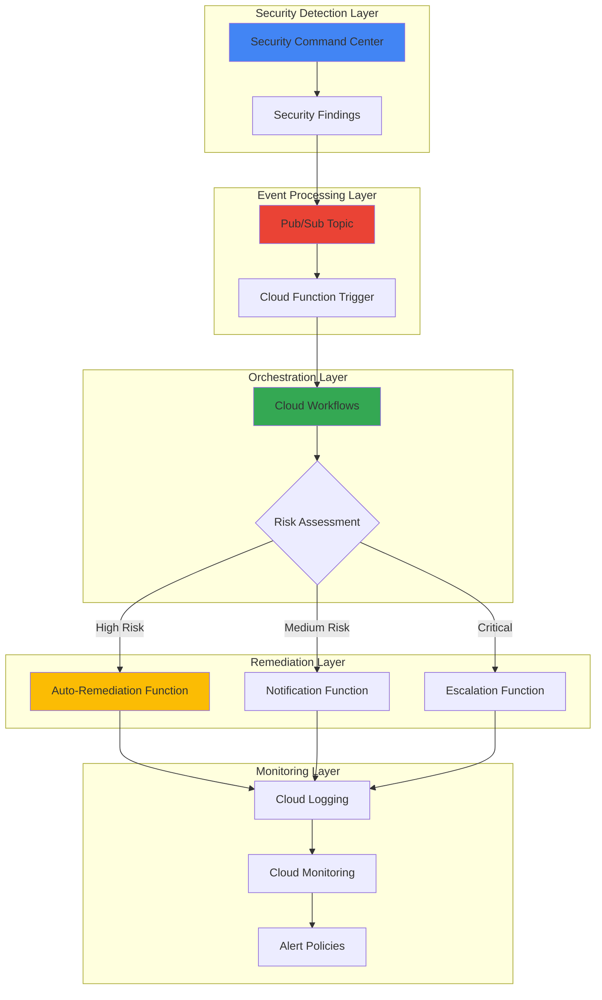

# Security Compliance Monitoring with Security Command Center and Cloud Workflows

## Problem

Organizations struggle to maintain continuous security compliance across their Google Cloud environments, facing challenges with manual security monitoring, delayed incident response, and inconsistent remediation processes. Security teams often discover policy violations hours or days after they occur, making it difficult to maintain regulatory compliance and respond to threats in real-time. Without automated workflows, security findings require manual triage and remediation, leading to increased mean time to resolution and potential security gaps.

## Solution

This solution creates an automated security compliance monitoring system that leverages Security Command Center for real-time threat detection and policy violation monitoring, Cloud Workflows for orchestrating automated remediation processes, and Cloud Functions for executing specific remediation actions. The system automatically detects security issues, triggers appropriate response workflows, and sends notifications to security teams, enabling proactive security posture management and rapid incident response.

## Architecture Diagram



## Prerequisites

1. Google Cloud account with Organization Admin or Security Admin permissions
2. Google Cloud CLI installed and authenticated
3. Security Command Center Premium or Enterprise tier enabled
4. Basic understanding of Google Cloud security concepts and IAM
5. Familiarity with YAML syntax for workflow definitions
6. Estimated cost: $50-100/month for small to medium environments

> **Note**: Security Command Center Standard tier has limited features. Premium or Enterprise tier is required for continuous exports and advanced automation capabilities.

## Preparation

```bash
# Set environment variables for the project
export PROJECT_ID="security-compliance-$(date +%s)"
export REGION="us-central1"
export ZONE="us-central1-a"

# Generate unique suffix for resource names
RANDOM_SUFFIX=$(openssl rand -hex 3)
export TOPIC_NAME="security-findings-${RANDOM_SUFFIX}"
export WORKFLOW_NAME="security-compliance-workflow-${RANDOM_SUFFIX}"
export FUNCTION_NAME="security-processor-${RANDOM_SUFFIX}"

# Create and set the project
gcloud projects create ${PROJECT_ID} \
    --name="Security Compliance Monitoring"

gcloud config set project ${PROJECT_ID}
gcloud config set compute/region ${REGION}
gcloud config set compute/zone ${ZONE}

# Enable required APIs
gcloud services enable securitycenter.googleapis.com
gcloud services enable pubsub.googleapis.com
gcloud services enable workflows.googleapis.com
gcloud services enable cloudfunctions.googleapis.com
gcloud services enable cloudbuild.googleapis.com
gcloud services enable eventarc.googleapis.com
gcloud services enable logging.googleapis.com
gcloud services enable monitoring.googleapis.com

echo "✅ Project configured: ${PROJECT_ID}"
echo "✅ APIs enabled successfully"
```

## Steps

1. **Create Pub/Sub Topic for Security Findings**:

   Google Cloud Pub/Sub provides a scalable, durable messaging service that enables asynchronous communication between services. Creating a dedicated topic for security findings ensures reliable delivery of Security Command Center notifications and enables multiple downstream consumers to process security events independently.

   ```bash
   # Create Pub/Sub topic for security findings
   gcloud pubsub topics create ${TOPIC_NAME}
   
   # Create subscription for workflow triggers
   gcloud pubsub subscriptions create ${TOPIC_NAME}-sub \
       --topic=${TOPIC_NAME}
   
   # Verify topic creation
   gcloud pubsub topics describe ${TOPIC_NAME}
   
   echo "✅ Pub/Sub topic created: ${TOPIC_NAME}"
   ```

   The Pub/Sub topic is now ready to receive security findings from Security Command Center. This messaging infrastructure provides the foundation for decoupled, event-driven security automation that can scale to handle thousands of security events per hour.

2. **Configure Security Command Center Notification**:

   Security Command Center's notification feature enables real-time delivery of security findings to Pub/Sub topics, allowing for immediate response to security threats and policy violations. This configuration ensures that all security findings are automatically published to our processing pipeline within minutes of detection.

   ```bash
   # Create notification configuration for Security Command Center
   gcloud scc notifications create ${TOPIC_NAME}-notification \
       --organization=${ORGANIZATION_ID} \
       --pubsub-topic=projects/${PROJECT_ID}/topics/${TOPIC_NAME} \
       --description="Automated security findings notification" \
       --filter='state="ACTIVE"'
   
   # Grant Security Command Center permission to publish to topic
   gcloud pubsub topics add-iam-policy-binding ${TOPIC_NAME} \
       --member="serviceAccount:service-${PROJECT_NUMBER}@gcp-sa-securitycenter.iam.gserviceaccount.com" \
       --role="roles/pubsub.publisher"
   
   echo "✅ Security Command Center notification configured"
   ```

   Security Command Center is now configured to automatically publish active security findings to our Pub/Sub topic, enabling real-time security monitoring and automated response capabilities.

3. **Create Cloud Function for Initial Processing**:

   Cloud Functions provide serverless compute capabilities that automatically scale to handle security events. This function performs initial processing of security findings, including data validation, severity assessment, and workflow triggering based on configurable criteria.

   ```bash
   # Create directory for function code
   mkdir -p security-processor-function
   cd security-processor-function
   
   # Create function requirements
   cat > requirements.txt << 'EOF'
   functions-framework==3.5.0
   google-cloud-workflows==1.14.0
   google-cloud-logging==3.8.0
   google-cloud-pubsub==2.18.4
   EOF
   
   # Create the main function code
   cat > main.py << 'EOF'
   import functions_framework
   import json
   import base64
   import logging
   from google.cloud import workflows_v1
   from google.cloud import logging as cloud_logging
   
   # Configure logging
   cloud_logging.Client().setup_logging()
   logger = logging.getLogger(__name__)
   
   @functions_framework.cloud_event
   def process_security_finding(cloud_event):
       """Process security findings and trigger workflows."""
       try:
           # Decode Pub/Sub message
           message_data = base64.b64decode(cloud_event.data["message"]["data"])
           finding = json.loads(message_data.decode('utf-8'))
           
           # Extract finding details
           finding_id = finding.get('name', 'unknown')
           severity = finding.get('severity', 'LOW')
           category = finding.get('category', 'unknown')
           
           logger.info(f"Processing finding: {finding_id} with severity: {severity}")
           
           # Determine workflow based on severity
           workflow_name = determine_workflow(severity, category)
           
           if workflow_name:
               # Trigger appropriate workflow
               trigger_workflow(workflow_name, finding)
               
           return 'OK'
           
       except Exception as e:
           logger.error(f"Error processing security finding: {str(e)}")
           raise
   
   def determine_workflow(severity, category):
       """Determine which workflow to trigger based on finding."""
       if severity in ['HIGH', 'CRITICAL']:
           return 'high-severity-workflow'
       elif severity == 'MEDIUM':
           return 'medium-severity-workflow'
       else:
           return 'low-severity-workflow'
   
   def trigger_workflow(workflow_name, finding):
       """Trigger Cloud Workflow with finding data."""
       client = workflows_v1.WorkflowsClient()
       
       # Prepare workflow input
       workflow_input = {
           'finding': finding,
           'timestamp': finding.get('eventTime', ''),
           'severity': finding.get('severity', 'LOW')
       }
       
       # Execute workflow
       execution = client.create_execution(
           parent=f"projects/{PROJECT_ID}/locations/{REGION}/workflows/{workflow_name}",
           execution=workflows_v1.Execution(argument=json.dumps(workflow_input))
       )
       
       logger.info(f"Triggered workflow: {workflow_name}")
   EOF
   
   # Deploy the function
   gcloud functions deploy ${FUNCTION_NAME} \
       --gen2 \
       --runtime=python311 \
       --source=. \
       --entry-point=process_security_finding \
       --trigger-topic=${TOPIC_NAME} \
       --region=${REGION} \
       --memory=512MB \
       --timeout=300s \
       --set-env-vars=PROJECT_ID=${PROJECT_ID},REGION=${REGION}
   
   cd ..
   
   echo "✅ Security processor function deployed"
   ```

   The Cloud Function is now deployed and will automatically process security findings from the Pub/Sub topic, providing the initial triage and workflow orchestration capabilities for our security automation system.

4. **Create Remediation Workflows**:

   Cloud Workflows provides serverless orchestration capabilities that enable complex, multi-step security remediation processes. These workflows implement security playbooks that automatically assess threats, execute remediation actions, and escalate issues based on predefined criteria and organizational policies.

   ```bash
   # Create high-severity workflow
   cat > high-severity-workflow.yaml << 'EOF'
   main:
     params: [input]
     steps:
       - init:
           assign:
             - finding: ${input.finding}
             - severity: ${input.severity}
             - project_id: ${sys.get_env("GOOGLE_CLOUD_PROJECT_ID")}
       
       - log_incident:
           call: http.post
           args:
             url: https://logging.googleapis.com/v2/entries:write
             auth:
               type: OAuth2
             body:
               entries:
                 - logName: projects/${project_id}/logs/security-compliance
                   severity: CRITICAL
                   jsonPayload:
                     finding_id: ${finding.name}
                     severity: ${severity}
                     action: "high_severity_workflow_triggered"
       
       - assess_threat:
           assign:
             - requires_immediate_action: ${severity == "CRITICAL"}
             - requires_escalation: true
       
       - immediate_remediation:
           switch:
             - condition: ${requires_immediate_action}
               steps:
                 - disable_compromised_resource:
                     call: execute_remediation
                     args:
                       action: "disable_resource"
                       resource: ${finding.resourceName}
       
       - notify_security_team:
           call: send_notification
           args:
             severity: ${severity}
             finding: ${finding}
             action_taken: "immediate_remediation"
       
       - escalate_to_incident_response:
           switch:
             - condition: ${requires_escalation}
               steps:
                 - create_incident:
                     call: create_security_incident
                     args:
                       finding: ${finding}
                       severity: ${severity}
   
   execute_remediation:
     params: [action, resource]
     steps:
       - log_action:
           call: http.post
           args:
             url: https://logging.googleapis.com/v2/entries:write
             auth:
               type: OAuth2
             body:
               entries:
                 - logName: projects/${project_id}/logs/security-actions
                   severity: INFO
                   jsonPayload:
                     action: ${action}
                     resource: ${resource}
                     timestamp: ${time.now()}
   
   send_notification:
     params: [severity, finding, action_taken]
     steps:
       - send_alert:
           call: http.post
           args:
             url: https://logging.googleapis.com/v2/entries:write
             auth:
               type: OAuth2
             body:
               entries:
                 - logName: projects/${project_id}/logs/security-notifications
                   severity: WARNING
                   jsonPayload:
                     alert_type: "security_finding"
                     severity: ${severity}
                     finding_id: ${finding.name}
                     action_taken: ${action_taken}
   
   create_security_incident:
     params: [finding, severity]
     steps:
       - log_incident:
           call: http.post
           args:
             url: https://logging.googleapis.com/v2/entries:write
             auth:
               type: OAuth2
             body:
               entries:
                 - logName: projects/${project_id}/logs/security-incidents
                   severity: ERROR
                   jsonPayload:
                     incident_type: "security_finding"
                     severity: ${severity}
                     finding_id: ${finding.name}
                     status: "created"
   EOF
   
   # Deploy high-severity workflow
   gcloud workflows deploy high-severity-workflow \
       --source=high-severity-workflow.yaml \
       --location=${REGION}
   
   echo "✅ High-severity workflow deployed"
   ```

   The high-severity workflow is now deployed and ready to handle critical security findings with automated remediation capabilities, immediate notification processes, and incident escalation procedures.

5. **Create Medium-Severity Workflow**:

   Medium-severity workflows handle security findings that require attention but don't necessitate immediate automated remediation. These workflows focus on notification, documentation, and guided manual remediation processes while maintaining audit trails for compliance purposes.

   ```bash
   # Create medium-severity workflow
   cat > medium-severity-workflow.yaml << 'EOF'
   main:
     params: [input]
     steps:
       - init:
           assign:
             - finding: ${input.finding}
             - severity: ${input.severity}
             - project_id: ${sys.get_env("GOOGLE_CLOUD_PROJECT_ID")}
       
       - log_finding:
           call: http.post
           args:
             url: https://logging.googleapis.com/v2/entries:write
             auth:
               type: OAuth2
             body:
               entries:
                 - logName: projects/${project_id}/logs/security-compliance
                   severity: WARNING
                   jsonPayload:
                     finding_id: ${finding.name}
                     severity: ${severity}
                     action: "medium_severity_workflow_triggered"
       
       - assess_risk:
           assign:
             - requires_notification: true
             - requires_tracking: true
       
       - create_remediation_ticket:
           call: create_tracking_entry
           args:
             finding: ${finding}
             priority: "medium"
       
       - notify_security_team:
           call: send_notification
           args:
             severity: ${severity}
             finding: ${finding}
             action_taken: "ticket_created"
       
       - schedule_follow_up:
           call: create_follow_up_task
           args:
             finding: ${finding}
             follow_up_hours: 24
   
   create_tracking_entry:
     params: [finding, priority]
     steps:
       - log_tracking:
           call: http.post
           args:
             url: https://logging.googleapis.com/v2/entries:write
             auth:
               type: OAuth2
             body:
               entries:
                 - logName: projects/${project_id}/logs/security-tracking
                   severity: INFO
                   jsonPayload:
                     tracking_type: "remediation_ticket"
                     finding_id: ${finding.name}
                     priority: ${priority}
                     status: "created"
   
   send_notification:
     params: [severity, finding, action_taken]
     steps:
       - send_alert:
           call: http.post
           args:
             url: https://logging.googleapis.com/v2/entries:write
             auth:
               type: OAuth2
             body:
               entries:
                 - logName: projects/${project_id}/logs/security-notifications
                   severity: INFO
                   jsonPayload:
                     alert_type: "security_finding"
                     severity: ${severity}
                     finding_id: ${finding.name}
                     action_taken: ${action_taken}
   
   create_follow_up_task:
     params: [finding, follow_up_hours]
     steps:
       - schedule_task:
           call: http.post
           args:
             url: https://logging.googleapis.com/v2/entries:write
             auth:
               type: OAuth2
             body:
               entries:
                 - logName: projects/${project_id}/logs/security-tasks
                   severity: INFO
                   jsonPayload:
                     task_type: "follow_up"
                     finding_id: ${finding.name}
                     scheduled_hours: ${follow_up_hours}
                     status: "scheduled"
   EOF
   
   # Deploy medium-severity workflow
   gcloud workflows deploy medium-severity-workflow \
       --source=medium-severity-workflow.yaml \
       --location=${REGION}
   
   echo "✅ Medium-severity workflow deployed"
   ```

   The medium-severity workflow is now operational and will handle security findings that require notification and tracking without immediate automated remediation, ensuring proper documentation and follow-up processes.

6. **Create Low-Severity Workflow**:

   Low-severity workflows handle routine security findings and informational alerts that require minimal immediate attention but should be tracked for trend analysis and compliance reporting. These workflows focus on documentation, aggregation, and periodic review processes.

   ```bash
   # Create low-severity workflow
   cat > low-severity-workflow.yaml << 'EOF'
   main:
     params: [input]
     steps:
       - init:
           assign:
             - finding: ${input.finding}
             - severity: ${input.severity}
             - project_id: ${sys.get_env("GOOGLE_CLOUD_PROJECT_ID")}
       
       - log_finding:
           call: http.post
           args:
             url: https://logging.googleapis.com/v2/entries:write
             auth:
               type: OAuth2
             body:
               entries:
                 - logName: projects/${project_id}/logs/security-compliance
                   severity: INFO
                   jsonPayload:
                     finding_id: ${finding.name}
                     severity: ${severity}
                     action: "low_severity_workflow_triggered"
       
       - assess_finding:
           assign:
             - requires_aggregation: true
             - requires_periodic_review: true
       
       - aggregate_for_reporting:
           call: aggregate_finding
           args:
             finding: ${finding}
             category: "low_severity_findings"
       
       - check_threshold:
           call: check_aggregation_threshold
           args:
             category: "low_severity_findings"
             threshold: 100
       
       - conditional_notification:
           switch:
             - condition: ${threshold_exceeded}
               steps:
                 - notify_trend:
                     call: send_trend_notification
                     args:
                       category: "low_severity_findings"
                       count: ${finding_count}
   
   aggregate_finding:
     params: [finding, category]
     steps:
       - log_aggregation:
           call: http.post
           args:
             url: https://logging.googleapis.com/v2/entries:write
             auth:
               type: OAuth2
             body:
               entries:
                 - logName: projects/${project_id}/logs/security-aggregation
                   severity: INFO
                   jsonPayload:
                     aggregation_type: ${category}
                     finding_id: ${finding.name}
                     timestamp: ${time.now()}
   
   check_aggregation_threshold:
     params: [category, threshold]
     steps:
       - check_count:
           assign:
             - threshold_exceeded: false
             - finding_count: 0
   
   send_trend_notification:
     params: [category, count]
     steps:
       - send_alert:
           call: http.post
           args:
             url: https://logging.googleapis.com/v2/entries:write
             auth:
               type: OAuth2
             body:
               entries:
                 - logName: projects/${project_id}/logs/security-trends
                   severity: WARNING
                   jsonPayload:
                     alert_type: "trend_notification"
                     category: ${category}
                     count: ${count}
                     message: "Low severity findings threshold exceeded"
   EOF
   
   # Deploy low-severity workflow
   gcloud workflows deploy low-severity-workflow \
       --source=low-severity-workflow.yaml \
       --location=${REGION}
   
   echo "✅ Low-severity workflow deployed"
   ```

   The low-severity workflow is now active and will handle routine security findings with appropriate aggregation and trend monitoring capabilities, providing valuable insights for security posture management.

7. **Configure Monitoring and Alerting**:

   Cloud Monitoring provides comprehensive observability for security workflows, enabling real-time visibility into security incident processing rates, workflow execution success rates, and system health metrics. This monitoring infrastructure ensures operational transparency and enables proactive maintenance of the security automation system.

   ```bash
   # Create log-based metrics for security findings
   gcloud logging metrics create security_findings_processed \
       --description="Count of security findings processed" \
       --log-filter='resource.type="cloud_function" AND textPayload:"Processing finding"' \
       --region=${REGION}
   
   # Create metric for workflow executions
   gcloud logging metrics create workflow_executions \
       --description="Count of workflow executions" \
       --log-filter='resource.type="workflows.googleapis.com/Workflow"' \
       --region=${REGION}
   
   # Create alerting policy for high-severity findings
   cat > alert-policy.yaml << 'EOF'
   displayName: "High Severity Security Findings Alert"
   conditions:
     - displayName: "High severity findings rate"
       conditionThreshold:
         filter: 'resource.type="cloud_function" AND textPayload:"high-severity-workflow"'
         comparison: COMPARISON_GREATER_THAN
         thresholdValue: 5
         duration: 300s
   notificationChannels: []
   alertStrategy:
     autoClose: 86400s
   EOF
   
   # Create notification channel (email)
   gcloud alpha monitoring channels create \
       --display-name="Security Team Email" \
       --type=email \
       --channel-labels=email_address=security-team@company.com
   
   echo "✅ Monitoring and alerting configured"
   ```

   The monitoring infrastructure is now established with custom metrics and alerting policies that provide real-time visibility into security workflow performance and enable immediate notification of critical security events.

8. **Create Compliance Dashboard**:

   A comprehensive compliance dashboard provides security teams with real-time visibility into security posture, finding trends, and remediation effectiveness. This dashboard aggregates security metrics and provides actionable insights for continuous security improvement.

   ```bash
   # Create custom dashboard configuration
   cat > compliance-dashboard.json << 'EOF'
   {
     "displayName": "Security Compliance Dashboard",
     "mosaicLayout": {
       "tiles": [
         {
           "width": 6,
           "height": 4,
           "widget": {
             "title": "Security Findings by Severity",
             "scorecard": {
               "timeSeriesQuery": {
                 "timeSeriesFilter": {
                   "filter": "resource.type=\"cloud_function\"",
                   "aggregation": {
                     "alignmentPeriod": "3600s",
                     "perSeriesAligner": "ALIGN_RATE"
                   }
                 }
               }
             }
           }
         },
         {
           "width": 6,
           "height": 4,
           "xPos": 6,
           "widget": {
             "title": "Workflow Execution Success Rate",
             "scorecard": {
               "timeSeriesQuery": {
                 "timeSeriesFilter": {
                   "filter": "resource.type=\"workflows.googleapis.com/Workflow\"",
                   "aggregation": {
                     "alignmentPeriod": "3600s",
                     "perSeriesAligner": "ALIGN_RATE"
                   }
                 }
               }
             }
           }
         },
         {
           "width": 12,
           "height": 4,
           "yPos": 4,
           "widget": {
             "title": "Security Findings Timeline",
             "xyChart": {
               "dataSets": [
                 {
                   "timeSeriesQuery": {
                     "timeSeriesFilter": {
                       "filter": "resource.type=\"cloud_function\"",
                       "aggregation": {
                         "alignmentPeriod": "3600s",
                         "perSeriesAligner": "ALIGN_RATE"
                       }
                     }
                   },
                   "plotType": "LINE"
                 }
               ]
             }
           }
         }
       ]
     }
   }
   EOF
   
   # Create the dashboard
   gcloud monitoring dashboards create \
       --config-from-file=compliance-dashboard.json
   
   echo "✅ Compliance dashboard created"
   ```

   The compliance dashboard is now available in the Google Cloud Console, providing security teams with comprehensive visibility into security findings, workflow performance, and compliance metrics for effective security posture management.

## Validation & Testing

1. **Test Security Finding Processing**:

   ```bash
   # Create a test security finding message
   cat > test-finding.json << 'EOF'
   {
     "name": "organizations/123456789/sources/123456789/findings/test-finding-001",
     "parent": "organizations/123456789/sources/123456789",
     "resourceName": "//compute.googleapis.com/projects/test-project/zones/us-central1-a/instances/test-instance",
     "state": "ACTIVE",
     "category": "MALWARE",
     "severity": "HIGH",
     "eventTime": "2025-07-12T10:30:00Z",
     "createTime": "2025-07-12T10:30:00Z"
   }
   EOF
   
   # Publish test message to Pub/Sub topic
   gcloud pubsub topics publish ${TOPIC_NAME} \
       --message="$(cat test-finding.json)"
   
   echo "✅ Test finding published to Pub/Sub"
   ```

   Expected output: Message published successfully and workflow execution triggered

2. **Verify Function Execution**:

   ```bash
   # Check function logs
   gcloud functions logs read ${FUNCTION_NAME} \
       --gen2 \
       --region=${REGION} \
       --limit=50 \
       --format="value(textPayload)"
   
   # Verify workflow executions
   gcloud workflows executions list \
       --workflow=high-severity-workflow \
       --location=${REGION}
   ```

   Expected output: Function logs showing successful processing and workflow execution entries

3. **Test Workflow Execution**:

   ```bash
   # Manually trigger workflow for testing
   gcloud workflows run high-severity-workflow \
       --location=${REGION} \
       --data='{"finding":{"name":"test-finding","severity":"HIGH"},"timestamp":"2025-07-12T10:30:00Z","severity":"HIGH"}'
   
   echo "✅ Workflow execution test completed"
   ```

   Expected output: Workflow execution completes successfully with proper logging

## Cleanup

1. **Delete Workflows**:

   ```bash
   # Delete all workflows
   gcloud workflows delete high-severity-workflow \
       --location=${REGION} \
       --quiet
   
   gcloud workflows delete medium-severity-workflow \
       --location=${REGION} \
       --quiet
   
   gcloud workflows delete low-severity-workflow \
       --location=${REGION} \
       --quiet
   
   echo "✅ Workflows deleted"
   ```

2. **Delete Cloud Functions**:

   ```bash
   # Delete the security processor function
   gcloud functions delete ${FUNCTION_NAME} \
       --gen2 \
       --region=${REGION} \
       --quiet
   
   echo "✅ Cloud Functions deleted"
   ```

3. **Delete Pub/Sub Resources**:

   ```bash
   # Delete subscription and topic
   gcloud pubsub subscriptions delete ${TOPIC_NAME}-sub \
       --quiet
   
   gcloud pubsub topics delete ${TOPIC_NAME} \
       --quiet
   
   echo "✅ Pub/Sub resources deleted"
   ```

4. **Delete Monitoring Resources**:

   ```bash
   # Delete log-based metrics
   gcloud logging metrics delete security_findings_processed \
       --quiet
   
   gcloud logging metrics delete workflow_executions \
       --quiet
   
   echo "✅ Monitoring resources deleted"
   ```

5. **Delete Project**:

   ```bash
   # Delete the entire project
   gcloud projects delete ${PROJECT_ID} \
       --quiet
   
   echo "✅ Project deleted: ${PROJECT_ID}"
   echo "Note: Project deletion may take several minutes to complete"
   ```

## Discussion

This automated security compliance monitoring solution demonstrates how Google Cloud's native security services can be orchestrated to create a comprehensive, real-time security response system. The architecture leverages Security Command Center's advanced threat detection capabilities, combined with Cloud Workflows' orchestration power and Cloud Functions' serverless execution model, to create a scalable and maintainable security automation platform.

The solution addresses critical security operations challenges by providing immediate visibility into security threats, automated triage based on severity levels, and orchestrated response procedures that follow security best practices. The event-driven architecture ensures that security teams can respond to threats within minutes rather than hours, significantly reducing the potential impact of security incidents. The use of Cloud Workflows enables complex, multi-step remediation processes that can be easily modified and version-controlled, providing flexibility as security requirements evolve.

The integration with Google Cloud's monitoring and logging infrastructure provides comprehensive observability into security operations, enabling continuous improvement of security processes and compliance reporting. This approach follows Google Cloud's [security best practices](https://cloud.google.com/security/best-practices) and aligns with the [Google Cloud Security Command Center documentation](https://cloud.google.com/security-command-center/docs/concepts-security-command-center-overview) for enterprise security management.

The modular design allows organizations to customize workflows based on their specific security requirements, compliance standards, and operational procedures. The solution can be extended to integrate with external security tools, ticketing systems, and communication platforms, making it adaptable to diverse enterprise environments. For organizations requiring additional security capabilities, this foundation can be enhanced with [Cloud Security Command Center Premium features](https://cloud.google.com/security-command-center/docs/service-tiers) and integrated with [Google Cloud's security operations platform](https://cloud.google.com/security/products/security-operations).

> **Tip**: Implement gradual rollout of automated remediation actions, starting with low-risk findings and progressively enabling automation for higher-severity incidents as confidence in the system increases.

## Challenge

Extend this solution by implementing these enhancements:

1. **Advanced Threat Intelligence Integration**: Integrate with Google Cloud's threat intelligence services and external threat feeds to enrich security findings with additional context and improve automated decision-making processes.

2. **Multi-Cloud Security Orchestration**: Expand the solution to monitor and respond to security events across multiple cloud providers, creating a unified security operations center with cross-cloud visibility and remediation capabilities.

3. **Machine Learning-Enhanced Response**: Implement Cloud ML models to analyze security finding patterns and recommend optimal response strategies based on historical incident data and organizational security policies.

4. **Compliance Automation Framework**: Build automated compliance checking and reporting capabilities that continuously assess security posture against frameworks like SOC 2, ISO 27001, and industry-specific regulations.

5. **Security Incident Response Automation**: Create sophisticated incident response workflows that automatically coordinate with human security analysts, manage evidence collection, and execute forensic procedures based on the type and severity of security incidents.

## Infrastructure Code

*Infrastructure code will be generated after recipe approval.*