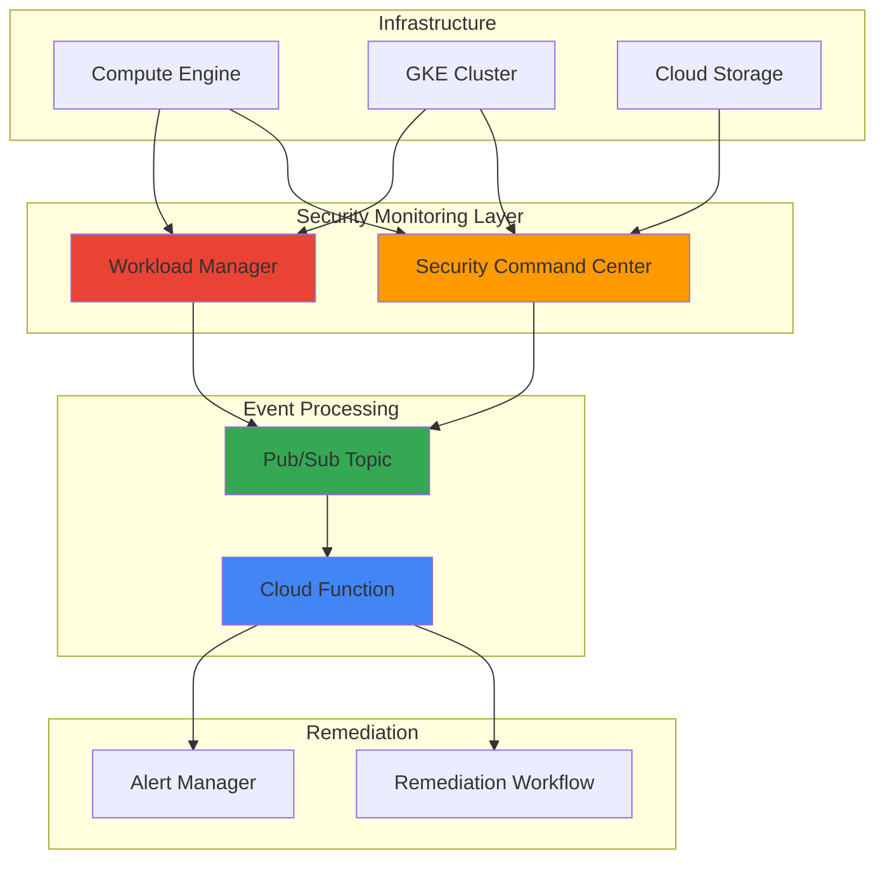

# Security Posture Assessment with Security Command Center and Workload Manager

## Problem

Organizations struggle to maintain consistent security posture across their Google Cloud infrastructure as environments scale and change rapidly. Manual security assessments are time-consuming, prone to human error, and cannot keep pace with continuous deployments and configuration drift. Without automated detection and remediation capabilities, security misconfigurations can persist unnoticed, increasing the risk of data breaches and compliance violations.

## Solution

Build a comprehensive automated security posture assessment system using Google Cloud's Security Command Center for centralized threat detection and compliance monitoring, integrated with Workload Manager for infrastructure validation, Cloud Functions for automated remediation workflows, and Pub/Sub for real-time event processing. This solution continuously evaluates security configurations, detects drift from established baselines, and automatically implements corrective actions while maintaining audit trails.

## Architecture Diagram



## Prerequisites

1. Google Cloud project with billing enabled and Organization-level access
2. Security Command Center Premium or Enterprise tier subscription
3. gcloud CLI v2 installed and configured (or Cloud Shell)
4. IAM permissions: Security Admin, Workload Manager Admin, Cloud Functions Admin
5. Basic understanding of security posture management and compliance frameworks
6. Estimated cost: $50-100/month for Security Command Center Premium + compute resources

> **Note**: Security Command Center Premium tier is required for security posture service and custom detectors. Consider starting with a trial subscription to evaluate the solution.

## Preparation

```bash
# Set environment variables for project configuration
export PROJECT_ID="security-posture-$(date +%s)"
export REGION="us-central1"
export ZONE="us-central1-a"
export ORGANIZATION_ID=$(gcloud organizations list \
    --format="value(name)" --limit=1)

# Generate unique suffix for resource names
RANDOM_SUFFIX=$(openssl rand -hex 3)
export TOPIC_NAME="security-events-${RANDOM_SUFFIX}"
export FUNCTION_NAME="security-remediation-${RANDOM_SUFFIX}"
export BUCKET_NAME="${PROJECT_ID}-security-logs-${RANDOM_SUFFIX}"

# Set default project and region
gcloud config set project ${PROJECT_ID}
gcloud config set compute/region ${REGION}
gcloud config set compute/zone ${ZONE}

# Enable required APIs
gcloud services enable securitycenter.googleapis.com
gcloud services enable workloadmanager.googleapis.com
gcloud services enable cloudfunctions.googleapis.com
gcloud services enable pubsub.googleapis.com
gcloud services enable compute.googleapis.com
gcloud services enable logging.googleapis.com

echo "✅ Project configured: ${PROJECT_ID}"
echo "✅ Organization ID: ${ORGANIZATION_ID}"
```

## Steps

1. **Enable Security Command Center and Configure Security Posture**:

   Security Command Center provides centralized security management and visibility across your Google Cloud resources. The security posture service allows you to define, deploy, and monitor security controls against established benchmarks like CIS or custom organizational standards. This foundational step establishes the security baseline and detection capabilities.

   ```bash
   # Enable Security Command Center at organization level
   gcloud scc organizations activate ${ORGANIZATION_ID}
   
   # Create security posture using predefined template
   gcloud scc postures create secure-baseline \
       --organization=${ORGANIZATION_ID} \
       --location=global \
       --template=secure_by_default_essential \
       --description="Automated security baseline posture"
   
   # Deploy the posture to the organization
   gcloud scc posture-deployments create baseline-deployment \
       --organization=${ORGANIZATION_ID} \
       --location=global \
       --posture=secure-baseline \
       --posture-revision-id=1 \
       --target-resource=organizations/${ORGANIZATION_ID}
   
   echo "✅ Security Command Center activated with baseline posture"
   ```

   The security posture is now deployed across your organization, establishing automated detection of common misconfigurations and security issues. This provides continuous monitoring against security best practices and enables early detection of compliance drift.

2. **Configure Workload Manager for Infrastructure Validation**:

   Workload Manager provides rule-based validation for infrastructure configurations and best practices. By integrating custom validation rules, we can detect configuration drift and ensure workloads comply with organizational standards. This complements Security Command Center by focusing on operational excellence and reliability aspects.

   ```bash
   # Create custom validation rules for security compliance
   cat > security-validation-rules.yaml << 'EOF'
   apiVersion: workloadmanager.cnrm.cloud.google.com/v1beta1
   kind: WorkloadManagerEvaluation
   metadata:
     name: security-compliance-check
   spec:
     projectId: ${PROJECT_ID}
     schedule: "0 */6 * * *"  # Run every 6 hours
     description: "Security compliance validation"
     customRules:
       - name: "ensure-vm-shielded"
         description: "Verify VMs have Shielded VM enabled"
         type: "COMPUTE_ENGINE"
         severity: "HIGH"
       - name: "check-storage-encryption"
         description: "Ensure Cloud Storage uses CMEK"
         type: "CLOUD_STORAGE"
         severity: "CRITICAL"
   EOF
   
   # Deploy validation rules
   gcloud workload-manager evaluations create security-compliance \
       --location=${REGION} \
       --description="Automated security compliance validation" \
       --custom-rules-file=security-validation-rules.yaml
   
   echo "✅ Workload Manager configured with security validation rules"
   ```

   Workload Manager now performs regular infrastructure assessments against your custom security rules, providing detailed reports on compliance status and recommendations for remediation.

3. **Create Pub/Sub Topic for Security Event Processing**:

   Pub/Sub enables real-time processing of security events from multiple sources including Security Command Center findings and Workload Manager evaluation results. This messaging backbone allows for scalable, asynchronous processing of security events and enables integration with various remediation systems.

   ```bash
   # Create Pub/Sub topic for security events
   gcloud pubsub topics create ${TOPIC_NAME}
   
   # Create subscription for Cloud Function processing
   gcloud pubsub subscriptions create ${TOPIC_NAME}-subscription \
       --topic=${TOPIC_NAME} \
       --ack-deadline=300 \
       --max-delivery-attempts=5
   
   # Configure Security Command Center to publish findings
   gcloud scc notifications create security-findings-notification \
       --organization=${ORGANIZATION_ID} \
       --pubsub-topic=projects/${PROJECT_ID}/topics/${TOPIC_NAME} \
       --description="Security findings for automated processing" \
       --filter="state=\"ACTIVE\""
   
   echo "✅ Pub/Sub infrastructure configured for security events"
   ```

   The pub/sub infrastructure now captures all active security findings in real-time, enabling immediate response to critical security events and maintaining a complete audit trail of security activities.

4. **Develop Cloud Function for Automated Remediation**:

   Cloud Functions provide serverless compute for processing security events and implementing automated remediation workflows. This function analyzes incoming security findings, determines appropriate remediation actions based on severity and type, and either automatically fixes issues or alerts security teams for manual intervention.

   ```bash
   # Create source directory and function code
   mkdir security-remediation-function
   cd security-remediation-function
   
   cat > main.py << 'EOF'
   import json
   import base64
   import logging
   from google.cloud import compute_v1
   from google.cloud import storage
   from google.cloud import logging as cloud_logging
   
   # Configure logging
   cloud_logging.Client().setup_logging()
   logger = logging.getLogger(__name__)
   
   def process_security_event(event, context):
       """Process security events and implement remediation"""
       try:
           # Decode Pub/Sub message
           message_data = base64.b64decode(event['data']).decode('utf-8')
           security_finding = json.loads(message_data)
           
           finding_type = security_finding.get('category', '')
           severity = security_finding.get('severity', 'LOW')
           resource_name = security_finding.get('resourceName', '')
           
           logger.info(f"Processing finding: {finding_type}, Severity: {severity}")
           
           # Implement remediation based on finding type
           if finding_type == 'COMPUTE_INSECURE_CONFIGURATION':
               remediate_compute_issue(resource_name, security_finding)
           elif finding_type == 'STORAGE_MISCONFIGURATION':
               remediate_storage_issue(resource_name, security_finding)
           elif severity == 'CRITICAL':
               send_critical_alert(security_finding)
           
           logger.info(f"Successfully processed security finding: {finding_type}")
           
       except Exception as e:
           logger.error(f"Error processing security event: {str(e)}")
           raise
   
   def remediate_compute_issue(resource_name, finding):
       """Remediate compute engine security issues"""
       # Extract project, zone, instance from resource name
       parts = resource_name.split('/')
       project_id = parts[1]
       zone = parts[3]
       instance_name = parts[5]
       
       # Enable Shielded VM if not configured
       compute_client = compute_v1.InstancesClient()
       # Implementation would include specific remediation logic
       logger.info(f"Remediated compute issue for {instance_name}")
   
   def remediate_storage_issue(resource_name, finding):
       """Remediate storage security issues"""
       # Implementation for storage bucket remediation
       logger.info(f"Remediated storage issue for {resource_name}")
   
   def send_critical_alert(finding):
       """Send alert for critical findings requiring manual intervention"""
       logger.critical(f"CRITICAL SECURITY FINDING: {finding}")
   EOF
   
   cat > requirements.txt << 'EOF'
   google-cloud-compute
   google-cloud-storage
   google-cloud-logging
   EOF
   
   # Deploy the Cloud Function
   gcloud functions deploy ${FUNCTION_NAME} \
       --runtime=python39 \
       --trigger-topic=${TOPIC_NAME} \
       --entry-point=process_security_event \
       --memory=512MB \
       --timeout=300s \
       --env-vars-file=.env.yaml
   
   cd ..
   echo "✅ Cloud Function deployed for automated remediation"
   ```

   The remediation function is now active and will automatically process security findings, implementing appropriate fixes based on the severity and type of security issues detected across your infrastructure.

5. **Configure Security Monitoring Dashboard**:

   Google Cloud Monitoring provides visibility into security posture metrics and remediation activities. Creating custom dashboards enables security teams to monitor the effectiveness of automated remediation and track security metrics over time, facilitating continuous improvement of security processes.

   ```bash
   # Create Cloud Storage bucket for dashboard configuration
   gsutil mb -p ${PROJECT_ID} -l ${REGION} gs://${BUCKET_NAME}
   
   # Create monitoring dashboard configuration
   cat > security-dashboard.json << 'EOF'
   {
     "displayName": "Security Posture Dashboard",
     "mosaicLayout": {
       "tiles": [
         {
           "width": 6,
           "height": 4,
           "widget": {
             "title": "Security Findings by Severity",
             "xyChart": {
               "dataSets": [
                 {
                   "timeSeriesQuery": {
                     "timeSeriesFilter": {
                       "filter": "resource.type=\"gce_instance\"",
                       "aggregation": {
                         "alignmentPeriod": "300s",
                         "perSeriesAligner": "ALIGN_RATE",
                         "crossSeriesReducer": "REDUCE_SUM"
                       }
                     }
                   }
                 }
               ]
             }
           }
         }
       ]
     }
   }
   EOF
   
   # Deploy monitoring dashboard
   gcloud monitoring dashboards create \
       --config-from-file=security-dashboard.json
   
   echo "✅ Security monitoring dashboard configured"
   ```

   The monitoring dashboard provides real-time visibility into security posture status, enabling proactive management of security risks and compliance tracking across your Google Cloud environment.

6. **Implement Security Posture Automation Workflows**:

   Advanced automation workflows coordinate multiple security tools and responses based on threat intelligence and organizational policies. This step creates sophisticated response patterns that can adapt to different types of security events and maintain consistency across your security operations.

   ```bash
   # Create IAM service account for automation workflows
   gcloud iam service-accounts create security-automation \
       --display-name="Security Automation Service Account" \
       --description="Service account for automated security operations"
   
   # Grant necessary permissions
   gcloud projects add-iam-policy-binding ${PROJECT_ID} \
       --member="serviceAccount:security-automation@${PROJECT_ID}.iam.gserviceaccount.com" \
       --role="roles/securitycenter.admin"
   
   gcloud projects add-iam-policy-binding ${PROJECT_ID} \
       --member="serviceAccount:security-automation@${PROJECT_ID}.iam.gserviceaccount.com" \
       --role="roles/workloadmanager.admin"
   
   # Create scheduled evaluation trigger
   gcloud scheduler jobs create pubsub security-posture-evaluation \
       --schedule="0 */4 * * *" \
       --topic=${TOPIC_NAME} \
       --message-body='{"event_type":"scheduled_evaluation","source":"automation"}' \
       --description="Trigger security posture evaluation every 4 hours"
   
   echo "✅ Security automation workflows configured"
   ```

   Automated workflows now coordinate security assessments and responses across your entire Google Cloud environment, ensuring consistent security posture management without manual intervention.

## Validation & Testing

1. **Verify Security Command Center Configuration**:

   ```bash
   # Check Security Command Center status
   gcloud scc organizations describe ${ORGANIZATION_ID}
   
   # List active security postures
   gcloud scc postures list --organization=${ORGANIZATION_ID} \
       --location=global
   ```

   Expected output: Security Command Center should show as "ACTIVE" with security postures deployed.

2. **Test Workload Manager Evaluations**:

   ```bash
   # Run manual evaluation
   gcloud workload-manager evaluations run security-compliance \
       --location=${REGION}
   
   # Check evaluation results
   gcloud workload-manager evaluations describe security-compliance \
       --location=${REGION} \
       --format="table(name,state,createTime)"
   ```

   Expected output: Evaluation should complete successfully and show infrastructure compliance status.

3. **Validate Event Processing Pipeline**:

   ```bash
   # Publish test security event
   gcloud pubsub topics publish ${TOPIC_NAME} \
       --message='{"category":"TEST_FINDING","severity":"MEDIUM","resourceName":"test-resource"}'
   
   # Check Cloud Function logs
   gcloud functions logs read ${FUNCTION_NAME} \
       --limit=10 \
       --format="table(timestamp,message)"
   ```

   Expected output: Function logs should show successful processing of the test security event.

4. **Monitor Security Dashboard**:

   ```bash
   # List monitoring dashboards
   gcloud monitoring dashboards list \
       --filter="displayName:Security Posture Dashboard"
   
   # Get dashboard URL
   echo "Dashboard available at: https://console.cloud.google.com/monitoring/dashboards"
   ```

## Cleanup

1. **Remove Security Command Center configurations**:

   ```bash
   # Delete posture deployment
   gcloud scc posture-deployments delete baseline-deployment \
       --organization=${ORGANIZATION_ID} \
       --location=global \
       --quiet
   
   # Delete security posture
   gcloud scc postures delete secure-baseline \
       --organization=${ORGANIZATION_ID} \
       --location=global \
       --quiet
   
   echo "✅ Security Command Center configurations removed"
   ```

2. **Delete Cloud Function and Pub/Sub resources**:

   ```bash
   # Delete Cloud Function
   gcloud functions delete ${FUNCTION_NAME} --quiet
   
   # Delete Pub/Sub subscription and topic
   gcloud pubsub subscriptions delete ${TOPIC_NAME}-subscription --quiet
   gcloud pubsub topics delete ${TOPIC_NAME} --quiet
   
   echo "✅ Serverless components deleted"
   ```

3. **Remove Workload Manager evaluations**:

   ```bash
   # Delete Workload Manager evaluation
   gcloud workload-manager evaluations delete security-compliance \
       --location=${REGION} \
       --quiet
   
   echo "✅ Workload Manager evaluations removed"
   ```

4. **Clean up storage and monitoring resources**:

   ```bash
   # Delete Cloud Storage bucket
   gsutil -m rm -r gs://${BUCKET_NAME}
   
   # Remove scheduled jobs
   gcloud scheduler jobs delete security-posture-evaluation --quiet
   
   # Delete service account
   gcloud iam service-accounts delete \
       security-automation@${PROJECT_ID}.iam.gserviceaccount.com \
       --quiet
   
   echo "✅ All resources cleaned up successfully"
   ```

## Discussion

This comprehensive security posture assessment solution leverages Google Cloud's native security services to create a robust, automated security management system. Security Command Center serves as the central nervous system, providing continuous monitoring and threat detection across your entire Google Cloud infrastructure. The integration with predefined security postures ensures that your environment adheres to industry best practices and compliance frameworks like CIS benchmarks.

Workload Manager complements this approach by focusing on infrastructure validation and operational best practices. Unlike traditional security tools that primarily detect threats, Workload Manager proactively evaluates your infrastructure configurations against established standards, helping prevent security issues before they become vulnerabilities. The custom rule framework allows organizations to codify their specific security requirements and ensure consistent enforcement across all deployments.

The event-driven architecture built on Pub/Sub and Cloud Functions enables real-time response to security events while maintaining scalability and cost efficiency. This serverless approach ensures that remediation actions scale automatically with the volume of security events, and the pay-per-use model keeps operational costs predictable. The integration of multiple data sources through Pub/Sub creates a single point of orchestration for all security events, enabling sophisticated correlation and automated response workflows.

The monitoring and alerting capabilities provide essential visibility into both security posture status and the effectiveness of automated remediation efforts. This observability enables continuous improvement of security processes and helps security teams focus on high-value activities rather than routine remediation tasks. For more information, refer to the [Security Command Center documentation](https://cloud.google.com/security-command-center/docs), [Workload Manager best practices](https://cloud.google.com/workload-manager/docs/best-practices), [Cloud Functions security patterns](https://cloud.google.com/functions/docs/securing), [Google Cloud Security Architecture Framework](https://cloud.google.com/architecture/security-foundations), and [Pub/Sub event-driven architectures](https://cloud.google.com/pubsub/docs/overview).

> **Tip**: Start with predefined security postures and gradually customize them based on your organization's specific requirements. Monitor remediation success rates and adjust automation rules to balance security effectiveness with operational efficiency.

## Challenge

Extend this solution by implementing these enhancements:

1. **Multi-Cloud Security Integration**: Integrate AWS Security Hub and Azure Security Center findings through Cloud Functions to create a unified security posture across cloud providers.

2. **Machine Learning-Based Threat Detection**: Implement custom Security Command Center detectors using Vertex AI to identify anomalous patterns in user behavior and resource usage.

3. **Advanced Remediation Workflows**: Build sophisticated remediation workflows using Cloud Workflows that can coordinate multiple remediation steps, including infrastructure changes, user notifications, and compliance reporting.

4. **Security Posture as Code**: Develop Terraform modules and CI/CD pipelines that automatically deploy and update security postures based on infrastructure changes and policy updates.

5. **Compliance Automation**: Create automated compliance reporting systems that generate SOC 2, ISO 27001, and PCI DSS compliance reports based on Security Command Center findings and Workload Manager evaluations.

## Infrastructure Code

*Infrastructure code will be generated after recipe approval.*