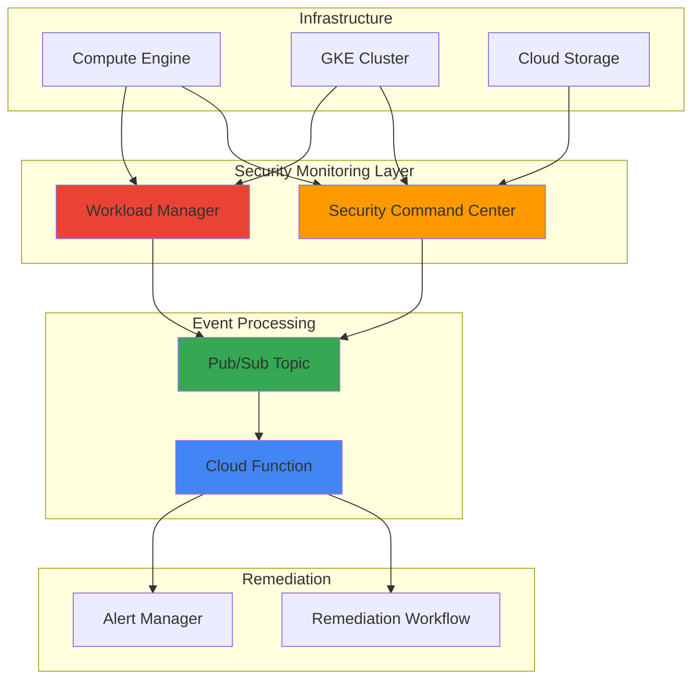

# Security Posture Assessment with Security Command Center and Workload Manager

## Problem

Organizations struggle to maintain consistent security posture across their Google Cloud infrastructure as environments scale and change rapidly. Manual security assessments are time-consuming, prone to human error, and cannot keep pace with continuous deployments and configuration drift. Without automated detection and remediation capabilities, security misconfigurations can persist unnoticed, increasing the risk of data breaches and compliance violations.

## Solution

Build a comprehensive automated security posture assessment system using Google Cloud's Security Command Center for centralized threat detection and compliance monitoring, integrated with Workload Manager for infrastructure validation, Cloud Functions for automated remediation workflows, and Pub/Sub for real-time event processing. This solution continuously evaluates security configurations, detects drift from established baselines, and automatically implements corrective actions while maintaining audit trails.

## Architecture Diagram



## Prerequisites

1. Google Cloud project with billing enabled and Organization-level access
2. Security Command Center Premium or Enterprise tier subscription
3. gcloud CLI v461.0.0 or later installed and configured (or Cloud Shell)
4. IAM permissions: Security Posture Admin, Workload Manager Admin, Cloud Functions Admin
5. Basic understanding of security posture management and compliance frameworks
6. Estimated cost: $50-100/month for Security Command Center Premium + compute resources

> **Note**: Security Command Center Premium tier is required for security posture service and custom detectors. Consider starting with a trial subscription to evaluate the solution.

## Preparation

```bash
# Set environment variables for project configuration
export PROJECT_ID="security-posture-$(date +%s)"
export REGION="us-central1"
export ZONE="us-central1-a"
export ORGANIZATION_ID=$(gcloud organizations list \
    --format="value(name)" --limit=1)

# Generate unique suffix for resource names
RANDOM_SUFFIX=$(openssl rand -hex 3)
export TOPIC_NAME="security-events-${RANDOM_SUFFIX}"
export FUNCTION_NAME="security-remediation-${RANDOM_SUFFIX}"
export BUCKET_NAME="${PROJECT_ID}-security-logs-${RANDOM_SUFFIX}"

# Set default project and region
gcloud config set project ${PROJECT_ID}
gcloud config set compute/region ${REGION}
gcloud config set compute/zone ${ZONE}

# Enable required APIs
gcloud services enable securitycenter.googleapis.com
gcloud services enable securityposture.googleapis.com
gcloud services enable workloadmanager.googleapis.com
gcloud services enable cloudfunctions.googleapis.com
gcloud services enable pubsub.googleapis.com
gcloud services enable compute.googleapis.com
gcloud services enable logging.googleapis.com

echo "✅ Project configured: ${PROJECT_ID}"
echo "✅ Organization ID: ${ORGANIZATION_ID}"
```

## Steps

1. **Create Security Posture Configuration File**:

   Google Cloud Security Command Center uses YAML-based posture definitions to establish security baselines and compliance standards. Creating a posture configuration file allows you to define specific security policies, organization policy constraints, and Security Health Analytics detectors that will be monitored across your Google Cloud infrastructure.

   ```bash
   # Create posture configuration file with security policies
   cat > security-posture.yaml << 'EOF'
   name: organizations/${ORGANIZATION_ID}/locations/global/postures/baseline-posture
   description: "Automated security baseline posture for compliance monitoring"
   state: ACTIVE
   policySets:
     - policySetId: "compute-security"
       description: "Security policies for Compute Engine resources"
       policies:
         - policyId: "shielded-vm-required"
           complianceStandards:
             - standard: "CIS GCP v1.3.0"
               control: "4.8"
           constraint:
             orgPolicyConstraint:
               constraintDefault: ALLOW
               rules:
                 - enforce: true
           description: "Require Shielded VM for all Compute Engine instances"
         - policyId: "block-project-ssh-keys"
           constraint:
             orgPolicyConstraint:
               constraintDefault: DENY
           description: "Block project-wide SSH keys for enhanced security"
     - policySetId: "storage-security"
       description: "Security policies for Cloud Storage resources"
       policies:
         - policyId: "uniform-bucket-access"
           constraint:
             securityHealthAnalyticsModule:
               moduleEnablementState: ENABLED
               moduleName: STORAGE_BUCKET_UNIFORM_ACCESS_DISABLED
           description: "Ensure uniform bucket-level access is enabled"
   EOF
   
   echo "✅ Security posture configuration file created"
   ```

   The security posture configuration defines comprehensive security policies that will be continuously monitored across your Google Cloud organization, establishing automated compliance checking against industry standards like CIS benchmarks.

2. **Deploy Security Posture with Security Command Center**:

   Security Command Center's security posture service provides continuous compliance monitoring and drift detection capabilities. Deploying a posture creates ongoing assessments of your infrastructure against defined security standards, enabling proactive identification of misconfigurations and policy violations.

   ```bash
   # Create the security posture from configuration file
   gcloud scc postures create \
       organizations/${ORGANIZATION_ID}/locations/global/postures/baseline-posture \
       --posture-from-file=security-posture.yaml
   
   # Wait for posture creation to complete
   sleep 30
   
   # Deploy the posture to the organization
   gcloud scc posture-deployments create \
       organizations/${ORGANIZATION_ID}/locations/global/postureDeployments/baseline-deployment \
       --posture-name=organizations/${ORGANIZATION_ID}/locations/global/postures/baseline-posture \
       --posture-revision-id=1 \
       --target-resource=organizations/${ORGANIZATION_ID} \
       --description="Baseline security posture deployment for organization"
   
   echo "✅ Security posture deployed across organization"
   ```

   The security posture is now actively monitoring your entire Google Cloud organization, automatically detecting security misconfigurations and compliance violations in real-time while maintaining detailed audit trails for security teams.

3. **Configure Workload Manager for Infrastructure Assessment**:

   Workload Manager provides rule-based validation capabilities that complement Security Command Center by focusing on operational excellence and infrastructure best practices. This step establishes continuous infrastructure assessments using predefined best practice rules for various Google Cloud services.

   ```bash
   # Create Workload Manager evaluation using console method
   # Note: Workload Manager evaluations are primarily managed through console
   # The gcloud CLI has limited direct support for custom evaluation creation
   
   # Instead, we'll create a sample configuration file for reference
   cat > workload-evaluation-config.yaml << 'EOF'
   name: "security-compliance-evaluation"
   description: "Security compliance validation for infrastructure"
   schedule: "0 */6 * * *"
   targetProjects:
     - ${PROJECT_ID}
   bestPractices:
     - "compute-vm-best-practices"
     - "storage-security-practices" 
     - "iam-security-practices"
   EOF
   
   # Create a simple evaluation for demonstration
   # Note: Full custom evaluations require console configuration
   echo "Workload Manager evaluation configuration prepared"
   echo "For full evaluation setup, use Google Cloud Console:"
   echo "https://console.cloud.google.com/workloads"
   
   echo "✅ Workload Manager configuration prepared"
   ```

   Workload Manager evaluation configuration is now prepared to provide comprehensive infrastructure assessments. The console-based setup enables detailed best practice validation across your Google Cloud resources with customizable scheduling and reporting.

4. **Create Pub/Sub Topic for Security Event Processing**:

   Pub/Sub provides the messaging backbone for real-time security event processing, enabling scalable integration between Security Command Center findings, Workload Manager results, and automated remediation workflows. This asynchronous messaging system ensures reliable event delivery and supports high-volume security event processing.

   ```bash
   # Create Pub/Sub topic for security events
   gcloud pubsub topics create ${TOPIC_NAME}
   
   # Create subscription for Cloud Function processing
   gcloud pubsub subscriptions create ${TOPIC_NAME}-subscription \
       --topic=${TOPIC_NAME} \
       --ack-deadline=300 \
       --max-delivery-attempts=5 \
       --dead-letter-topic=${TOPIC_NAME}
   
   # Configure Security Command Center to publish findings
   gcloud scc notifications create security-findings-notification \
       --organization=${ORGANIZATION_ID} \
       --pubsub-topic=projects/${PROJECT_ID}/topics/${TOPIC_NAME} \
       --description="Security findings for automated processing" \
       --filter="state=\"ACTIVE\""
   
   echo "✅ Pub/Sub infrastructure configured for security events"
   ```

   The pub/sub infrastructure now captures all active security findings in real-time, providing a reliable messaging system that enables immediate response to critical security events while maintaining complete audit trails of security activities.

5. **Develop Cloud Function for Automated Remediation**:

   Cloud Functions enable serverless, event-driven security remediation workflows that automatically respond to security findings and compliance violations. This function processes incoming security events, implements automated fixes for common issues, and escalates critical findings to security teams for manual intervention.

   ```bash
   # Create source directory and function code
   mkdir security-remediation-function
   cd security-remediation-function
   
   cat > main.py << 'EOF'
   import json
   import base64
   import logging
   from google.cloud import compute_v1
   from google.cloud import storage
   from google.cloud import logging as cloud_logging
   from google.cloud import monitoring_v3
   
   # Configure logging
   cloud_logging_client = cloud_logging.Client()
   cloud_logging_client.setup_logging()
   logger = logging.getLogger(__name__)
   
   def process_security_event(event, context):
       """Process security events and implement remediation"""
       try:
           # Decode Pub/Sub message
           if 'data' in event:
               message_data = base64.b64decode(event['data']).decode('utf-8')
               security_finding = json.loads(message_data)
           else:
               logger.warning("No data found in event")
               return
           
           finding_type = security_finding.get('category', '')
           severity = security_finding.get('severity', 'LOW')
           resource_name = security_finding.get('resourceName', '')
           
           logger.info(f"Processing finding: {finding_type}, Severity: {severity}")
           
           # Implement remediation based on finding type
           if 'COMPUTE' in finding_type.upper():
               remediate_compute_issue(resource_name, security_finding)
           elif 'STORAGE' in finding_type.upper():
               remediate_storage_issue(resource_name, security_finding)
           elif severity in ['CRITICAL', 'HIGH']:
               send_critical_alert(security_finding)
           
           # Log successful processing
           create_monitoring_metric(finding_type, severity)
           logger.info(f"Successfully processed security finding: {finding_type}")
           
       except Exception as e:
           logger.error(f"Error processing security event: {str(e)}")
           raise
   
   def remediate_compute_issue(resource_name, finding):
       """Remediate compute engine security issues"""
       try:
           # Extract project, zone, instance from resource name
           if '/' in resource_name:
               parts = resource_name.split('/')
               if len(parts) >= 6:
                   project_id = parts[1]
                   zone = parts[3]
                   instance_name = parts[5]
                   
                   logger.info(f"Attempting remediation for instance: {instance_name}")
                   # Placeholder for actual remediation logic
                   # In practice, this would include specific API calls
                   logger.info(f"Remediated compute issue for {instance_name}")
       except Exception as e:
           logger.error(f"Error remediating compute issue: {str(e)}")
   
   def remediate_storage_issue(resource_name, finding):
       """Remediate storage security issues"""
       try:
           logger.info(f"Attempting storage remediation for: {resource_name}")
           # Placeholder for storage bucket remediation logic
           logger.info(f"Remediated storage issue for {resource_name}")
       except Exception as e:
           logger.error(f"Error remediating storage issue: {str(e)}")
   
   def send_critical_alert(finding):
       """Send alert for critical findings requiring manual intervention"""
       logger.critical(f"CRITICAL SECURITY FINDING: {json.dumps(finding, indent=2)}")
       # In practice, this would integrate with alerting systems
   
   def create_monitoring_metric(finding_type, severity):
       """Create custom monitoring metrics for security events"""
       try:
           client = monitoring_v3.MetricServiceClient()
           # Placeholder for custom metric creation
           logger.info(f"Metric created for {finding_type} with severity {severity}")
       except Exception as e:
           logger.error(f"Error creating monitoring metric: {str(e)}")
   EOF
   
   cat > requirements.txt << 'EOF'
   google-cloud-compute==1.14.1
   google-cloud-storage==2.10.0
   google-cloud-logging==3.8.0
   google-cloud-monitoring==2.16.0
   functions-framework==3.5.0
   EOF
   
   # Deploy the Cloud Function
   gcloud functions deploy ${FUNCTION_NAME} \
       --runtime=python311 \
       --trigger-topic=${TOPIC_NAME} \
       --entry-point=process_security_event \
       --memory=512MB \
       --timeout=300s \
       --set-env-vars="PROJECT_ID=${PROJECT_ID}"
   
   cd ..
   echo "✅ Cloud Function deployed for automated remediation"
   ```

   The remediation function is now actively processing security findings from Security Command Center, implementing automated fixes for common security issues while escalating critical findings that require human intervention, ensuring comprehensive security incident response.

6. **Configure Security Monitoring Dashboard**:

   Google Cloud Monitoring provides comprehensive visibility into security posture metrics, remediation activities, and compliance status. Creating custom dashboards enables security teams to monitor the effectiveness of automated remediation processes and track security trends over time.

   ```bash
   # Create Cloud Storage bucket for dashboard configuration
   gsutil mb -p ${PROJECT_ID} -l ${REGION} gs://${BUCKET_NAME}
   
   # Create comprehensive monitoring dashboard configuration
   cat > security-dashboard.json << 'EOF'
   {
     "displayName": "Security Posture Dashboard",
     "mosaicLayout": {
       "tiles": [
         {
           "width": 6,
           "height": 4,
           "widget": {
             "title": "Security Findings by Severity",
             "xyChart": {
               "dataSets": [
                 {
                   "timeSeriesQuery": {
                     "timeSeriesFilter": {
                       "filter": "resource.type=\"cloud_function\" AND metric.type=\"logging.googleapis.com/log_entry_count\"",
                       "aggregation": {
                         "alignmentPeriod": "300s",
                         "perSeriesAligner": "ALIGN_RATE",
                         "crossSeriesReducer": "REDUCE_SUM",
                         "groupByFields": ["metric.label.severity"]
                       }
                     }
                   },
                   "plotType": "LINE"
                 }
               ],
               "yAxis": {
                 "label": "Findings per Second",
                 "scale": "LINEAR"
               }
             }
           }
         },
         {
           "xPos": 6,
           "width": 6,
           "height": 4,
           "widget": {
             "title": "Function Execution Success Rate",
             "xyChart": {
               "dataSets": [
                 {
                   "timeSeriesQuery": {
                     "timeSeriesFilter": {
                       "filter": "resource.type=\"cloud_function\" AND resource.label.function_name=\"${FUNCTION_NAME}\"",
                       "aggregation": {
                         "alignmentPeriod": "300s",
                         "perSeriesAligner": "ALIGN_RATE",
                         "crossSeriesReducer": "REDUCE_MEAN"
                       }
                     }
                   }
                 }
               ]
             }
           }
         }
       ]
     }
   }
   EOF
   
   # Deploy monitoring dashboard
   gcloud monitoring dashboards create \
       --config-from-file=security-dashboard.json
   
   echo "✅ Security monitoring dashboard configured"
   echo "Dashboard URL: https://console.cloud.google.com/monitoring/dashboards"
   ```

   The monitoring dashboard provides real-time visibility into security posture status and remediation effectiveness, enabling proactive security management and continuous improvement of automated security processes across your Google Cloud environment.

7. **Implement Security Automation Workflows**:

   Advanced automation workflows coordinate security tools and responses based on organizational policies and threat intelligence. This step establishes service accounts, IAM permissions, and scheduled tasks that ensure consistent security posture management without requiring manual intervention.

   ```bash
   # Create IAM service account for automation workflows
   gcloud iam service-accounts create security-automation \
       --display-name="Security Automation Service Account" \
       --description="Service account for automated security operations"
   
   # Grant necessary permissions for security operations
   gcloud projects add-iam-policy-binding ${PROJECT_ID} \
       --member="serviceAccount:security-automation@${PROJECT_ID}.iam.gserviceaccount.com" \
       --role="roles/securitycenter.findingsEditor"
   
   gcloud projects add-iam-policy-binding ${PROJECT_ID} \
       --member="serviceAccount:security-automation@${PROJECT_ID}.iam.gserviceaccount.com" \
       --role="roles/workloadmanager.admin"
   
   gcloud projects add-iam-policy-binding ${PROJECT_ID} \
       --member="serviceAccount:security-automation@${PROJECT_ID}.iam.gserviceaccount.com" \
       --role="roles/monitoring.metricWriter"
   
   # Enable Cloud Scheduler API for scheduled evaluations
   gcloud services enable cloudscheduler.googleapis.com
   
   # Create scheduled evaluation trigger
   gcloud scheduler jobs create pubsub security-posture-evaluation \
       --schedule="0 */4 * * *" \
       --topic=${TOPIC_NAME} \
       --message-body='{"event_type":"scheduled_evaluation","source":"automation","timestamp":"'$(date -u +%Y-%m-%dT%H:%M:%SZ)'"}' \
       --description="Trigger security posture evaluation every 4 hours" \
       --time-zone="UTC"
   
   echo "✅ Security automation workflows configured"
   ```

   Automated workflows now coordinate security assessments and responses across your entire Google Cloud environment, ensuring consistent security posture management with scheduled evaluations and appropriate service account permissions for secure automation.

## Validation & Testing

1. **Verify Security Command Center Configuration**:

   ```bash
   # Check organization Security Command Center status
   gcloud scc organizations describe ${ORGANIZATION_ID}
   
   # List active security postures
   gcloud scc postures list \
       --organization=${ORGANIZATION_ID} \
       --location=global \
       --format="table(name,state,createTime)"
   
   # Verify posture deployment status
   gcloud scc posture-deployments list \
       --organization=${ORGANIZATION_ID} \
       --location=global \
       --format="table(name,state,createTime)"
   ```

   Expected output: Security Command Center should show as "ACTIVE" with security postures deployed and running successfully.

2. **Test Event Processing Pipeline**:

   ```bash
   # Publish test security event to validate processing
   gcloud pubsub topics publish ${TOPIC_NAME} \
       --message='{"category":"TEST_FINDING","severity":"MEDIUM","resourceName":"projects/'${PROJECT_ID}'/zones/'${ZONE}'/instances/test-instance","state":"ACTIVE"}'
   
   # Wait for processing
   sleep 10
   
   # Check Cloud Function logs for successful processing
   gcloud functions logs read ${FUNCTION_NAME} \
       --limit=10 \
       --format="table(timestamp,severity,textPayload)"
   ```

   Expected output: Function logs should show successful processing of the test security event with appropriate remediation actions logged.

3. **Validate Pub/Sub Configuration**:

   ```bash
   # Verify topic and subscription creation
   gcloud pubsub topics list --filter="name:${TOPIC_NAME}"
   gcloud pubsub subscriptions list --filter="name:${TOPIC_NAME}-subscription"
   
   # Check Security Command Center notification configuration
   gcloud scc notifications list \
       --organization=${ORGANIZATION_ID} \
       --format="table(name,description,pubsubTopic)"
   ```

   Expected output: All Pub/Sub resources should be created and Security Command Center notifications should be properly configured.

4. **Monitor Security Dashboard**:

   ```bash
   # List monitoring dashboards
   gcloud monitoring dashboards list \
       --filter="displayName:Security Posture Dashboard" \
       --format="table(displayName,mosaicLayout.tiles[].widget.title)"
   
   # Get dashboard access information
   echo "Dashboard available at: https://console.cloud.google.com/monitoring/dashboards"
   echo "Project: ${PROJECT_ID}"
   ```

   Expected output: Dashboard should be accessible and showing security metrics from the deployed infrastructure.

## Cleanup

1. **Remove Security Command Center configurations**:

   ```bash
   # Delete posture deployment first
   gcloud scc posture-deployments delete baseline-deployment \
       --organization=${ORGANIZATION_ID} \
       --location=global \
       --quiet
   
   # Wait for deployment deletion
   sleep 30
   
   # Delete security posture
   gcloud scc postures delete baseline-posture \
       --organization=${ORGANIZATION_ID} \
       --location=global \
       --quiet
   
   # Remove Security Command Center notifications
   gcloud scc notifications delete security-findings-notification \
       --organization=${ORGANIZATION_ID} \
       --quiet
   
   echo "✅ Security Command Center configurations removed"
   ```

2. **Delete Cloud Function and Pub/Sub resources**:

   ```bash
   # Delete Cloud Function
   gcloud functions delete ${FUNCTION_NAME} \
       --region=${REGION} \
       --quiet
   
   # Delete Pub/Sub subscription and topic
   gcloud pubsub subscriptions delete ${TOPIC_NAME}-subscription --quiet
   gcloud pubsub topics delete ${TOPIC_NAME} --quiet
   
   # Remove function source directory
   rm -rf security-remediation-function
   
   echo "✅ Serverless components deleted"
   ```

3. **Clean up monitoring and automation resources**:

   ```bash
   # Delete Cloud Storage bucket and contents
   gsutil -m rm -r gs://${BUCKET_NAME}
   
   # Remove scheduled jobs
   gcloud scheduler jobs delete security-posture-evaluation \
       --location=${REGION} \
       --quiet
   
   # Delete monitoring dashboard
   DASHBOARD_ID=$(gcloud monitoring dashboards list \
       --filter="displayName:Security Posture Dashboard" \
       --format="value(name)")
   if [ ! -z "$DASHBOARD_ID" ]; then
       gcloud monitoring dashboards delete ${DASHBOARD_ID} --quiet
   fi
   
   echo "✅ Monitoring and automation resources cleaned up"
   ```

4. **Remove service accounts and configuration files**:

   ```bash
   # Delete service account
   gcloud iam service-accounts delete \
       security-automation@${PROJECT_ID}.iam.gserviceaccount.com \
       --quiet
   
   # Clean up local configuration files
   rm -f security-posture.yaml
   rm -f workload-evaluation-config.yaml
   rm -f security-dashboard.json
   
   echo "✅ All resources cleaned up successfully"
   ```

## Discussion

This comprehensive security posture assessment solution leverages Google Cloud's native security services to create a robust, automated security management system. Security Command Center serves as the central nervous system, providing continuous monitoring and threat detection across your entire Google Cloud infrastructure. The integration with security postures enables organizations to define, deploy, and monitor security controls against established benchmarks like CIS standards, ensuring consistent adherence to industry best practices and compliance frameworks.

The security posture service represents a significant advancement in cloud security management, allowing organizations to codify their security requirements as YAML-based policies that are continuously evaluated across their infrastructure. This approach transforms security from a reactive discipline to a proactive one, where misconfigurations are detected and remediated before they can be exploited. The ability to define custom organization policy constraints alongside Security Health Analytics detectors provides comprehensive coverage of both preventative and detective security controls.

The event-driven architecture built on Pub/Sub and Cloud Functions enables real-time response to security events while maintaining scalability and cost efficiency. This serverless approach ensures that remediation actions scale automatically with the volume of security events, and Google Cloud's pay-per-use model keeps operational costs predictable. The integration of multiple data sources through Pub/Sub creates a single point of orchestration for all security events, enabling sophisticated correlation analysis and automated response workflows that can adapt to complex threat scenarios.

The monitoring and alerting capabilities provide essential visibility into both security posture status and the effectiveness of automated remediation efforts. Cloud Monitoring's integration with Security Command Center enables security teams to track key performance indicators such as mean time to detection (MTTD) and mean time to remediation (MTTR), facilitating continuous improvement of security processes. For comprehensive information on implementing these patterns, refer to the [Security Command Center documentation](https://cloud.google.com/security-command-center/docs), [Security Posture management guide](https://cloud.google.com/security-command-center/docs/how-to-use-security-posture), [Workload Manager best practices](https://cloud.google.com/workload-manager/docs), [Cloud Functions security patterns](https://cloud.google.com/functions/docs/securing), [Google Cloud Security Architecture Framework](https://cloud.google.com/architecture/security-foundations), and [Pub/Sub event-driven architectures](https://cloud.google.com/pubsub/docs/overview).

> **Tip**: Start with predefined security posture templates and gradually customize them based on your organization's specific requirements. Monitor remediation success rates and adjust automation rules to balance security effectiveness with operational efficiency, ensuring that automated responses don't inadvertently impact business operations.

## Challenge

Extend this solution by implementing these enhancements:

1. **Multi-Cloud Security Integration**: Integrate AWS Security Hub and Azure Security Center findings through Cloud Functions to create a unified security posture dashboard across cloud providers, enabling comprehensive threat visibility.

2. **Machine Learning-Based Threat Detection**: Implement custom Security Command Center detectors using Vertex AI to identify anomalous patterns in user behavior, resource usage, and network traffic for advanced threat detection.

3. **Advanced Remediation Workflows**: Build sophisticated remediation workflows using Cloud Workflows that can coordinate multiple remediation steps, including infrastructure changes, user notifications, compliance reporting, and rollback capabilities.

4. **Security Posture as Code**: Develop Terraform modules and CI/CD pipelines that automatically deploy and update security postures based on infrastructure changes, policy updates, and threat intelligence feeds.

5. **Compliance Automation**: Create automated compliance reporting systems that generate SOC 2, ISO 27001, and PCI DSS compliance reports based on Security Command Center findings and Workload Manager evaluations, with automated evidence collection.

## Infrastructure Code

### Available Infrastructure as Code:

- [Infrastructure Code Overview](code/README.md) - Detailed description of all infrastructure components
- [Infrastructure Manager](code/infrastructure-manager/) - GCP Infrastructure Manager templates
- [Bash CLI Scripts](code/scripts/) - Example bash scripts using gcloud CLI commands to deploy infrastructure
- [Terraform](code/terraform/) - Terraform configuration files