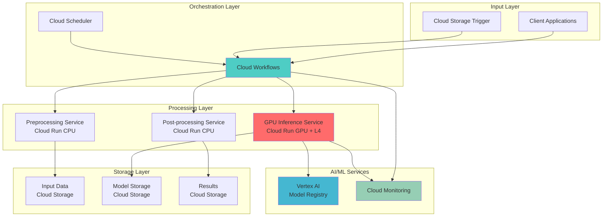

# Serverless GPU Computing Pipelines with Cloud Run GPU and Cloud Workflows

## Problem

Modern machine learning teams face significant challenges when deploying GPU-accelerated inference workloads that have unpredictable demand patterns. Traditional GPU infrastructure requires constant provisioning and incurs high costs during idle periods, while manual pipeline orchestration leads to operational overhead and delayed model deployment cycles. Organizations need cost-effective, automated solutions that can dynamically scale GPU resources and orchestrate complex ML workflows without infrastructure management.

## Solution

This solution combines Cloud Run GPU services with Cloud Workflows to create fully serverless, GPU-accelerated machine learning pipelines that automatically scale from zero to handle inference workloads on-demand. Cloud Run GPU provides NVIDIA L4 GPU acceleration with pay-per-second billing and sub-5-second cold starts, while Cloud Workflows orchestrates the entire pipeline including data preprocessing, model inference, and result processing. This architecture delivers cost-effective AI processing that scales automatically and requires zero infrastructure maintenance.

## Architecture Diagram



## Prerequisites

1. Google Cloud Project with billing enabled and the following APIs:
   - Cloud Run API
   - Cloud Workflows API
   - Cloud Storage API
   - Vertex AI API
   - Cloud Build API
   - Eventarc API
2. gcloud CLI latest version (450.0.0+) with beta components installed
3. Docker installed locally for container building
4. Basic understanding of machine learning inference workflows
5. Estimated cost: $0.50-$2.00 per hour during active pipeline execution (GPU usage: $0.71/hour per L4 GPU based on current pricing)

> **Note**: Cloud Run GPU is available in us-central1, europe-west1, europe-west4, asia-southeast1, and asia-south1 regions. GPU quotas may apply for large-scale deployments.

## Preparation

```bash
# Set environment variables for Google Cloud resources
export PROJECT_ID=$(gcloud config get-value project)
export REGION="us-central1"
export ZONE="us-central1-a"

# Generate unique suffix for resource names
RANDOM_SUFFIX=$(openssl rand -hex 3)
export SERVICE_PREFIX="ml-pipeline-${RANDOM_SUFFIX}"

# Set default project and region
gcloud config set project ${PROJECT_ID}
gcloud config set compute/region ${REGION}

# Enable required APIs
gcloud services enable run.googleapis.com \
    workflows.googleapis.com \
    storage.googleapis.com \
    aiplatform.googleapis.com \
    cloudbuild.googleapis.com \
    eventarc.googleapis.com

# Create Cloud Storage buckets for the pipeline
gsutil mb -p ${PROJECT_ID} \
    -c STANDARD \
    -l ${REGION} \
    gs://${SERVICE_PREFIX}-input

gsutil mb -p ${PROJECT_ID} \
    -c STANDARD \
    -l ${REGION} \
    gs://${SERVICE_PREFIX}-models

gsutil mb -p ${PROJECT_ID} \
    -c STANDARD \
    -l ${REGION} \
    gs://${SERVICE_PREFIX}-output

echo "✅ Project configured: ${PROJECT_ID}"
echo "✅ Storage buckets created with prefix: ${SERVICE_PREFIX}"
```

## Steps

1. **Create GPU-Accelerated Inference Service Container**:

   Cloud Run GPU enables serverless deployment of GPU-accelerated containers with NVIDIA L4 GPUs, providing the computational power needed for machine learning inference while maintaining the serverless benefits of automatic scaling and pay-per-use billing. This step creates a containerized inference service that can leverage GPU acceleration for model predictions.

   ```bash
   # Create directory for the inference service
   mkdir -p gpu-inference-service
   cd gpu-inference-service

   # Create Dockerfile for GPU inference service
   cat > Dockerfile << 'EOF'
   FROM nvidia/cuda:12.1-runtime-ubuntu22.04

   # Install Python and dependencies
   RUN apt-get update && apt-get install -y \
       python3 \
       python3-pip \
       && rm -rf /var/lib/apt/lists/*

   # Install ML libraries with GPU support (updated versions)
   RUN pip3 install --no-cache-dir \
       torch==2.1.2 \
       torchvision==0.16.2 \
       transformers==4.36.0 \
       accelerate==0.25.0 \
       flask==3.0.0 \
       google-cloud-storage==2.10.0 \
       pillow==10.1.0

   WORKDIR /app
   COPY . .

   EXPOSE 8080
   CMD ["python3", "inference_server.py"]
   EOF

   # Create the inference server application
   cat > inference_server.py << 'EOF'
   import os
   import torch
   from flask import Flask, request, jsonify
   from transformers import AutoTokenizer, AutoModelForSequenceClassification
   from google.cloud import storage
   import logging

   app = Flask(__name__)
   logging.basicConfig(level=logging.INFO)

   # Global variables for model
   model = None
   tokenizer = None
   device = None

   def initialize_model():
       global model, tokenizer, device
       
       # Check for GPU availability
       device = torch.device("cuda" if torch.cuda.is_available() else "cpu")
       logging.info(f"Using device: {device}")
       
       # Load a simple classification model (can be replaced with custom models)
       model_name = "distilbert-base-uncased-finetuned-sst-2-english"
       tokenizer = AutoTokenizer.from_pretrained(model_name)
       model = AutoModelForSequenceClassification.from_pretrained(model_name)
       model.to(device)
       model.eval()
       
       logging.info("Model initialized successfully")

   @app.route("/health", methods=["GET"])
   def health_check():
       return {"status": "healthy", "gpu_available": torch.cuda.is_available()}

   @app.route("/predict", methods=["POST"])
   def predict():
       try:
           data = request.get_json()
           text = data.get("text", "")
           
           if not text:
               return jsonify({"error": "No text provided"}), 400
           
           # Tokenize and predict
           inputs = tokenizer(text, return_tensors="pt", truncation=True, padding=True)
           inputs = {k: v.to(device) for k, v in inputs.items()}
           
           with torch.no_grad():
               outputs = model(**inputs)
               predictions = torch.nn.functional.softmax(outputs.logits, dim=-1)
               
           result = {
               "prediction": predictions.cpu().numpy().tolist()[0],
               "confidence": float(torch.max(predictions)),
               "device_used": str(device)
           }
           
           return jsonify(result)
           
       except Exception as e:
           logging.error(f"Prediction error: {str(e)}")
           return jsonify({"error": str(e)}), 500

   if __name__ == "__main__":
       initialize_model()
       app.run(host="0.0.0.0", port=8080)
   EOF

   echo "✅ GPU inference service container created"
   ```

   The GPU inference service is now configured with CUDA support and machine learning frameworks optimized for GPU acceleration. This containerized service can load and run transformer models on NVIDIA L4 GPUs, providing fast inference capabilities that scale automatically with Cloud Run.

2. **Build and Deploy GPU Inference Service to Cloud Run**:

   Cloud Run GPU deployment requires specific configuration parameters to enable GPU acceleration, including GPU type specification and compute resource allocation. This deployment leverages Cloud Build to create optimized container images and deploys them with proper GPU configuration for maximum performance.

   ```bash
   # Build the container image using Cloud Build
   gcloud builds submit --tag gcr.io/${PROJECT_ID}/${SERVICE_PREFIX}-gpu-inference .

   # Deploy to Cloud Run with GPU configuration
   gcloud run deploy ${SERVICE_PREFIX}-gpu-inference \
       --image gcr.io/${PROJECT_ID}/${SERVICE_PREFIX}-gpu-inference \
       --platform managed \
       --region ${REGION} \
       --gpu 1 \
       --gpu-type nvidia-l4 \
       --memory 16Gi \
       --cpu 4 \
       --timeout 300 \
       --concurrency 4 \
       --max-instances 10 \
       --no-cpu-throttling \
       --allow-unauthenticated

   # Get the service URL
   export GPU_SERVICE_URL=$(gcloud run services describe ${SERVICE_PREFIX}-gpu-inference \
       --region ${REGION} \
       --format 'value(status.url)')

   cd ..
   echo "✅ GPU inference service deployed: ${GPU_SERVICE_URL}"
   ```

   The GPU-enabled Cloud Run service is now active and ready to handle inference requests. With NVIDIA L4 GPU acceleration, this service can process machine learning workloads significantly faster than CPU-only alternatives while automatically scaling based on demand and billing only for actual usage.

3. **Create Data Preprocessing Service**:

   Data preprocessing is essential for machine learning pipelines to transform raw input data into formats suitable for model inference. This CPU-optimized service handles data validation, transformation, and preparation tasks efficiently without requiring expensive GPU resources, optimizing the overall pipeline cost structure.

   ```bash
   # Create directory for preprocessing service
   mkdir -p preprocessing-service
   cd preprocessing-service

   # Create Dockerfile for preprocessing
   cat > Dockerfile << 'EOF'
   FROM python:3.11-slim

   RUN pip install --no-cache-dir \
       flask==3.0.0 \
       google-cloud-storage==2.10.0 \
       pillow==10.1.0 \
       pandas==2.1.4 \
       numpy==1.26.2

   WORKDIR /app
   COPY . .

   EXPOSE 8080
   CMD ["python", "preprocess_server.py"]
   EOF

   # Create preprocessing server
   cat > preprocess_server.py << 'EOF'
   import os
   import json
   from flask import Flask, request, jsonify
   from google.cloud import storage
   import logging
   from PIL import Image
   import base64
   import io

   app = Flask(__name__)
   logging.basicConfig(level=logging.INFO)

   storage_client = storage.Client()

   @app.route("/health", methods=["GET"])
   def health_check():
       return {"status": "healthy", "service": "preprocessing"}

   @app.route("/preprocess", methods=["POST"])
   def preprocess_data():
       try:
           data = request.get_json()
           input_bucket = data.get("input_bucket")
           input_file = data.get("input_file")
           
           if not input_bucket or not input_file:
               return jsonify({"error": "Missing input_bucket or input_file"}), 400
           
           # Download file from Cloud Storage
           bucket = storage_client.bucket(input_bucket)
           blob = bucket.blob(input_file)
           
           if input_file.endswith(('.txt', '.json')):
               # Process text data
               content = blob.download_as_text()
               processed_data = {
                   "text": content.strip(),
                   "length": len(content),
                   "type": "text"
               }
           elif input_file.endswith(('.jpg', '.jpeg', '.png')):
               # Process image data (convert to base64 for JSON transport)
               image_bytes = blob.download_as_bytes()
               image = Image.open(io.BytesIO(image_bytes))
               
               # Resize image if too large
               if image.size[0] > 1024 or image.size[1] > 1024:
                   image.thumbnail((1024, 1024), Image.Resampling.LANCZOS)
               
               # Convert back to bytes
               buffer = io.BytesIO()
               image.save(buffer, format='JPEG')
               image_b64 = base64.b64encode(buffer.getvalue()).decode()
               
               processed_data = {
                   "image_data": image_b64,
                   "dimensions": image.size,
                   "type": "image"
               }
           else:
               return jsonify({"error": "Unsupported file type"}), 400
           
           result = {
               "status": "success",
               "processed_data": processed_data,
               "input_file": input_file
           }
           
           return jsonify(result)
           
       except Exception as e:
           logging.error(f"Preprocessing error: {str(e)}")
           return jsonify({"error": str(e)}), 500

   if __name__ == "__main__":
       app.run(host="0.0.0.0", port=8080)
   EOF

   # Build and deploy preprocessing service
   gcloud builds submit --tag gcr.io/${PROJECT_ID}/${SERVICE_PREFIX}-preprocess .

   gcloud run deploy ${SERVICE_PREFIX}-preprocess \
       --image gcr.io/${PROJECT_ID}/${SERVICE_PREFIX}-preprocess \
       --platform managed \
       --region ${REGION} \
       --memory 2Gi \
       --cpu 1 \
       --timeout 60 \
       --max-instances 50 \
       --allow-unauthenticated

   export PREPROCESS_SERVICE_URL=$(gcloud run services describe ${SERVICE_PREFIX}-preprocess \
       --region ${REGION} \
       --format 'value(status.url)')

   cd ..
   echo "✅ Preprocessing service deployed: ${PREPROCESS_SERVICE_URL}"
   ```

   The preprocessing service is now operational and can handle various data types including text and images. This service optimizes data for downstream GPU inference while running on cost-effective CPU instances, demonstrating how to balance performance and cost in serverless ML pipelines.

4. **Create Post-processing Service**:

   Post-processing transforms raw model outputs into business-ready results, including confidence scoring, result formatting, and integration with downstream systems. This service completes the ML pipeline by handling result aggregation, quality checks, and output formatting for various consumption patterns.

   ```bash
   # Create directory for post-processing service
   mkdir -p postprocessing-service
   cd postprocessing-service

   # Create Dockerfile for post-processing
   cat > Dockerfile << 'EOF'
   FROM python:3.11-slim

   RUN pip install --no-cache-dir \
       flask==3.0.0 \
       google-cloud-storage==2.10.0 \
       pandas==2.1.4 \
       numpy==1.26.2

   WORKDIR /app
   COPY . .

   EXPOSE 8080
   CMD ["python", "postprocess_server.py"]
   EOF

   # Create post-processing server
   cat > postprocess_server.py << 'EOF'
   import os
   import json
   from flask import Flask, request, jsonify
   from google.cloud import storage
   import logging
   from datetime import datetime

   app = Flask(__name__)
   logging.basicConfig(level=logging.INFO)

   storage_client = storage.Client()

   @app.route("/health", methods=["GET"])
   def health_check():
       return {"status": "healthy", "service": "postprocessing"}

   @app.route("/postprocess", methods=["POST"])
   def postprocess_results():
       try:
           data = request.get_json()
           prediction_result = data.get("prediction_result")
           input_metadata = data.get("input_metadata", {})
           output_bucket = data.get("output_bucket")
           
           if not prediction_result or not output_bucket:
               return jsonify({"error": "Missing prediction_result or output_bucket"}), 400
           
           # Process the prediction result
           confidence = prediction_result.get("confidence", 0.0)
           prediction = prediction_result.get("prediction", [])
           
           # Determine classification result
           if len(prediction) >= 2:
               sentiment_score = prediction[1] - prediction[0]  # Positive - Negative
               sentiment_label = "positive" if sentiment_score > 0 else "negative"
           else:
               sentiment_score = 0.0
               sentiment_label = "neutral"
           
           # Create enhanced result
           enhanced_result = {
               "input_metadata": input_metadata,
               "prediction": {
                   "sentiment_label": sentiment_label,
                   "sentiment_score": float(sentiment_score),
                   "confidence": float(confidence),
                   "raw_prediction": prediction
               },
               "processing_info": {
                   "timestamp": datetime.utcnow().isoformat(),
                   "service_version": "1.0",
                   "gpu_accelerated": prediction_result.get("device_used", "").startswith("cuda")
               },
               "quality_metrics": {
                   "high_confidence": confidence > 0.8,
                   "requires_review": confidence < 0.6
               }
           }
           
           # Save result to Cloud Storage
           output_filename = f"result_{datetime.now().strftime('%Y%m%d_%H%M%S')}.json"
           bucket = storage_client.bucket(output_bucket)
           blob = bucket.blob(output_filename)
           blob.upload_from_string(
               json.dumps(enhanced_result, indent=2),
               content_type='application/json'
           )
           
           result = {
               "status": "success",
               "output_file": output_filename,
               "output_bucket": output_bucket,
               "summary": {
                   "sentiment": sentiment_label,
                   "confidence": confidence,
                   "requires_review": confidence < 0.6
               }
           }
           
           return jsonify(result)
           
       except Exception as e:
           logging.error(f"Post-processing error: {str(e)}")
           return jsonify({"error": str(e)}), 500

   if __name__ == "__main__":
       app.run(host="0.0.0.0", port=8080)
   EOF

   # Build and deploy post-processing service
   gcloud builds submit --tag gcr.io/${PROJECT_ID}/${SERVICE_PREFIX}-postprocess .

   gcloud run deploy ${SERVICE_PREFIX}-postprocess \
       --image gcr.io/${PROJECT_ID}/${SERVICE_PREFIX}-postprocess \
       --platform managed \
       --region ${REGION} \
       --memory 1Gi \
       --cpu 1 \
       --timeout 60 \
       --max-instances 50 \
       --allow-unauthenticated

   export POSTPROCESS_SERVICE_URL=$(gcloud run services describe ${SERVICE_PREFIX}-postprocess \
       --region ${REGION} \
       --format 'value(status.url)')

   cd ..
   echo "✅ Post-processing service deployed: ${POSTPROCESS_SERVICE_URL}"
   ```

   The post-processing service now provides comprehensive result enhancement, including confidence scoring, quality metrics, and structured output storage. This completes the serverless ML pipeline by ensuring results are properly formatted and stored for downstream consumption.

5. **Create Cloud Workflows Pipeline Definition**:

   Cloud Workflows provides serverless orchestration for complex multi-step processes, enabling reliable coordination of the ML pipeline components with built-in error handling, retries, and state management. This workflow definition orchestrates the entire pipeline from data ingestion through result delivery while maintaining observability and fault tolerance.

   ```bash
   # Create the workflow definition file
   cat > ml-pipeline-workflow.yaml << EOF
   main:
     params: [input]
     steps:
       - init:
           assign:
             - project_id: \${sys.get_env("GOOGLE_CLOUD_PROJECT_ID")}
             - input_bucket: "${SERVICE_PREFIX}-input"
             - output_bucket: "${SERVICE_PREFIX}-output"
             - input_file: \${input.input_file}
             - preprocess_url: "${PREPROCESS_SERVICE_URL}"
             - inference_url: "${GPU_SERVICE_URL}"
             - postprocess_url: "${POSTPROCESS_SERVICE_URL}"
       
       - log_start:
           call: sys.log
           args:
             text: \${"Starting ML pipeline for file: " + input_file}
             severity: INFO
       
       - preprocess_step:
           call: http.post
           args:
             url: \${preprocess_url + "/preprocess"}
             headers:
               Content-Type: "application/json"
             body:
               input_bucket: \${input_bucket}
               input_file: \${input_file}
             timeout: 60
           result: preprocess_result
       
       - check_preprocess:
           switch:
             - condition: \${preprocess_result.body.status == "success"}
               next: inference_step
           next: preprocess_error
       
       - inference_step:
           call: http.post
           args:
             url: \${inference_url + "/predict"}
             headers:
               Content-Type: "application/json"
             body:
               text: \${preprocess_result.body.processed_data.text}
             timeout: 300
           result: inference_result
       
       - check_inference:
           switch:
             - condition: \${inference_result.status == 200}
               next: postprocess_step
           next: inference_error
       
       - postprocess_step:
           call: http.post
           args:
             url: \${postprocess_url + "/postprocess"}
             headers:
               Content-Type: "application/json"
             body:
               prediction_result: \${inference_result.body}
               input_metadata:
                 input_file: \${input_file}
                 input_bucket: \${input_bucket}
               output_bucket: \${output_bucket}
             timeout: 60
           result: postprocess_result
       
       - log_success:
           call: sys.log
           args:
             text: \${"Pipeline completed successfully. Output: " + postprocess_result.body.output_file}
             severity: INFO
       
       - return_result:
           return:
             status: "success"
             input_file: \${input_file}
             output_file: \${postprocess_result.body.output_file}
             output_bucket: \${output_bucket}
             summary: \${postprocess_result.body.summary}
             execution_time: \${time.format(sys.now())}
       
       - preprocess_error:
           call: sys.log
           args:
             text: \${"Preprocessing failed: " + string(preprocess_result.body)}
             severity: ERROR
           next: error_return
       
       - inference_error:
           call: sys.log
           args:
             text: \${"Inference failed: " + string(inference_result)}
             severity: ERROR
           next: error_return
       
       - error_return:
           return:
             status: "error"
             input_file: \${input_file}
             error: "Pipeline execution failed"
             execution_time: \${time.format(sys.now())}
   EOF

   echo "✅ Workflow definition created"
   ```

   The Cloud Workflows definition provides comprehensive orchestration with error handling, logging, and conditional execution paths. This workflow coordinates all pipeline components while providing observability and resilience for production ML workloads.

6. **Deploy Cloud Workflows Pipeline**:

   Deploying the workflow creates a managed orchestration service that can be triggered by various events including HTTP requests, Cloud Storage changes, or scheduled executions. This deployment establishes the central coordination point for the entire serverless GPU computing pipeline.

   ```bash
   # Deploy the workflow
   gcloud workflows deploy ${SERVICE_PREFIX}-ml-pipeline \
       --source ml-pipeline-workflow.yaml \
       --location ${REGION}

   # Get workflow information
   export WORKFLOW_NAME="${SERVICE_PREFIX}-ml-pipeline"
   export WORKFLOW_URL="https://workflowexecutions.googleapis.com/v1/projects/${PROJECT_ID}/locations/${REGION}/workflows/${WORKFLOW_NAME}/executions"

   echo "✅ Workflow deployed: ${WORKFLOW_NAME}"
   echo "✅ Workflow execution URL: ${WORKFLOW_URL}"
   ```

   The Cloud Workflows pipeline is now deployed and ready to orchestrate GPU-accelerated machine learning workloads. This serverless orchestration service provides reliable execution with automatic scaling, error handling, and comprehensive logging for production ML pipelines.

7. **Create Cloud Storage Event Trigger**:

   Event-driven architectures enable automatic pipeline execution when new data arrives, eliminating manual intervention and enabling real-time processing. This trigger configuration uses Eventarc to automatically start the ML pipeline when files are uploaded to the input bucket, creating a fully automated serverless ML system.

   ```bash
   # Create service account for Eventarc
   gcloud iam service-accounts create ${SERVICE_PREFIX}-eventarc \
       --display-name "Eventarc Service Account for ML Pipeline"

   # Grant necessary permissions
   gcloud projects add-iam-policy-binding ${PROJECT_ID} \
       --member "serviceAccount:${SERVICE_PREFIX}-eventarc@${PROJECT_ID}.iam.gserviceaccount.com" \
       --role "roles/workflows.invoker"

   gcloud projects add-iam-policy-binding ${PROJECT_ID} \
       --member "serviceAccount:${SERVICE_PREFIX}-eventarc@${PROJECT_ID}.iam.gserviceaccount.com" \
       --role "roles/eventarc.eventReceiver"

   # Create Eventarc trigger for Cloud Storage
   gcloud eventarc triggers create ${SERVICE_PREFIX}-storage-trigger \
       --location ${REGION} \
       --destination-workflow ${WORKFLOW_NAME} \
       --destination-workflow-location ${REGION} \
       --event-filters "type=google.cloud.storage.object.v1.finalized" \
       --event-filters "bucket=${SERVICE_PREFIX}-input" \
       --service-account ${SERVICE_PREFIX}-eventarc@${PROJECT_ID}.iam.gserviceaccount.com

   echo "✅ Event trigger created for bucket: ${SERVICE_PREFIX}-input"
   echo "✅ Pipeline will automatically execute when files are uploaded"
   ```

   The event-driven trigger is now active and will automatically execute the ML pipeline whenever new files are uploaded to the input bucket. This creates a fully automated serverless system that responds to data availability in real-time while scaling resources dynamically.

## Validation & Testing

1. **Test Individual Services**:

   ```bash
   # Test preprocessing service
   curl -X POST ${PREPROCESS_SERVICE_URL}/health
   
   # Test GPU inference service health
   curl -X GET ${GPU_SERVICE_URL}/health
   
   # Test post-processing service
   curl -X POST ${POSTPROCESS_SERVICE_URL}/health
   ```

   Expected output: Each service should return `{"status": "healthy"}` with service-specific information.

2. **Test End-to-End Pipeline**:

   ```bash
   # Create a test file
   echo "This is a positive sentiment test message that should be classified correctly." > test-input.txt
   
   # Upload test file to trigger the pipeline
   gsutil cp test-input.txt gs://${SERVICE_PREFIX}-input/
   
   # Check workflow executions
   gcloud workflows executions list \
       --workflow ${WORKFLOW_NAME} \
       --location ${REGION} \
       --limit 5
   
   # Wait a few moments and check for output
   sleep 30
   gsutil ls gs://${SERVICE_PREFIX}-output/
   ```

   Expected behavior: The file upload should trigger the workflow automatically, and a result JSON file should appear in the output bucket within 1-2 minutes.

3. **Monitor Pipeline Performance**:

   ```bash
   # Check Cloud Run service metrics
   gcloud run services describe ${SERVICE_PREFIX}-gpu-inference \
       --region ${REGION} \
       --format "table(metadata.name,status.conditions[0].type,status.conditions[0].status)"
   
   # View workflow execution details
   EXECUTION_ID=$(gcloud workflows executions list \
       --workflow ${WORKFLOW_NAME} \
       --location ${REGION} \
       --limit 1 \
       --format "value(name)")
   
   if [ ! -z "$EXECUTION_ID" ]; then
       gcloud workflows executions describe $EXECUTION_ID \
           --workflow ${WORKFLOW_NAME} \
           --location ${REGION}
   fi
   ```

## Cleanup

1. **Remove Cloud Run Services**:

   ```bash
   # Delete Cloud Run services
   gcloud run services delete ${SERVICE_PREFIX}-gpu-inference \
       --region ${REGION} \
       --quiet
   
   gcloud run services delete ${SERVICE_PREFIX}-preprocess \
       --region ${REGION} \
       --quiet
   
   gcloud run services delete ${SERVICE_PREFIX}-postprocess \
       --region ${REGION} \
       --quiet
   
   echo "✅ Cloud Run services deleted"
   ```

2. **Remove Workflow and Triggers**:

   ```bash
   # Delete Eventarc trigger
   gcloud eventarc triggers delete ${SERVICE_PREFIX}-storage-trigger \
       --location ${REGION} \
       --quiet
   
   # Delete workflow
   gcloud workflows delete ${WORKFLOW_NAME} \
       --location ${REGION} \
       --quiet
   
   # Delete service account
   gcloud iam service-accounts delete \
       ${SERVICE_PREFIX}-eventarc@${PROJECT_ID}.iam.gserviceaccount.com \
       --quiet
   
   echo "✅ Workflows and triggers deleted"
   ```

3. **Remove Storage Resources**:

   ```bash
   # Delete Cloud Storage buckets and contents
   gsutil -m rm -r gs://${SERVICE_PREFIX}-input
   gsutil -m rm -r gs://${SERVICE_PREFIX}-models
   gsutil -m rm -r gs://${SERVICE_PREFIX}-output
   
   # Delete container images
   gcloud container images delete gcr.io/${PROJECT_ID}/${SERVICE_PREFIX}-gpu-inference --quiet
   gcloud container images delete gcr.io/${PROJECT_ID}/${SERVICE_PREFIX}-preprocess --quiet
   gcloud container images delete gcr.io/${PROJECT_ID}/${SERVICE_PREFIX}-postprocess --quiet
   
   # Clean up local files
   rm -rf gpu-inference-service preprocessing-service postprocessing-service
   rm -f ml-pipeline-workflow.yaml test-input.txt
   
   echo "✅ All resources cleaned up"
   ```

## Discussion

This serverless GPU computing pipeline demonstrates the transformative potential of combining Cloud Run GPU with Cloud Workflows for machine learning workloads. The architecture addresses key challenges in modern ML operations: cost optimization, automatic scaling, and operational simplicity. By leveraging NVIDIA L4 GPUs through Cloud Run's serverless platform, organizations can achieve GPU acceleration without the traditional overhead of infrastructure management or the cost burden of idle GPU resources.

The integration with Cloud Workflows provides enterprise-grade orchestration capabilities including comprehensive error handling, automatic retries, and detailed execution logging. This approach enables complex ML pipelines to run reliably at scale while maintaining full observability. The event-driven architecture using Eventarc creates truly reactive systems that respond instantly to new data availability, enabling real-time ML processing without manual intervention.

Performance characteristics of this solution are particularly compelling for unpredictable workloads. Cloud Run GPU achieves cold start times under 5 seconds and can scale from zero to hundreds of instances within minutes, making it ideal for bursty ML inference patterns. The pay-per-second billing model ensures cost efficiency even for sporadic workloads, while the automatic scaling handles traffic spikes without capacity planning. Current pricing for NVIDIA L4 GPUs on Google Cloud is approximately $0.71 per hour, making it cost-effective for intermittent AI workloads.

The architectural pattern demonstrated here can be extended to support various ML use cases including computer vision, natural language processing, and time series analysis. By separating preprocessing, inference, and post-processing into distinct services, teams can optimize each component independently and leverage different compute resources appropriately. This microservices approach also enables easier testing, deployment, and maintenance of complex ML systems.

> **Tip**: Use Cloud Monitoring dashboards to track GPU utilization, request latency, and workflow execution metrics. Set up alerting for failed executions or high latency to maintain pipeline reliability.

For comprehensive documentation on the services used, refer to the [Cloud Run GPU documentation](https://cloud.google.com/run/docs/configuring/services/gpu), [Cloud Workflows syntax guide](https://cloud.google.com/workflows/docs/reference/syntax), [Eventarc triggers documentation](https://cloud.google.com/eventarc/docs/run/create-trigger-storage-gcloud), [Cloud Build container optimization](https://cloud.google.com/build/docs/optimize-builds), and the [Vertex AI integration patterns](https://cloud.google.com/vertex-ai/docs/pipelines/introduction).

## Challenge

Extend this serverless GPU computing pipeline by implementing these advanced capabilities:

1. **Multi-Model Inference Pipeline**: Deploy multiple specialized models (text classification, image recognition, sentiment analysis) and create a workflow that intelligently routes requests to appropriate models based on input data type and content analysis.

2. **A/B Testing Integration**: Implement model versioning with Vertex AI Model Registry and create workflows that automatically split traffic between model versions, collect performance metrics, and promote winning models based on accuracy and latency metrics.

3. **Batch Processing Optimization**: Enhance the pipeline to handle batch inference requests efficiently by implementing request queuing, dynamic batching, and parallel processing across multiple GPU instances for large-scale data processing scenarios.

4. **Cost Optimization Dashboard**: Build a comprehensive monitoring solution using Cloud Monitoring and Looker Studio that tracks GPU utilization, cost per inference, and pipeline performance metrics with automated recommendations for resource optimization.

5. **Global Deployment Strategy**: Implement multi-region deployment with intelligent request routing based on user location, model availability, and resource costs, including automatic failover and load balancing across regions for global-scale ML services.

## Infrastructure Code

### Available Infrastructure as Code:

- [Infrastructure Code Overview](code/README.md) - Detailed description of all infrastructure components
- [Infrastructure Manager](code/infrastructure-manager/) - GCP Infrastructure Manager templates
- [Bash CLI Scripts](code/scripts/) - Example bash scripts using gcloud CLI commands to deploy infrastructure
- [Terraform](code/terraform/) - Terraform configuration files