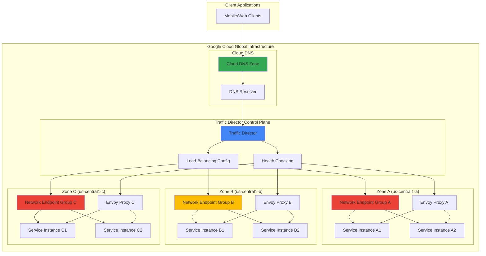

# Service Discovery with Traffic Director and Cloud DNS

## Problem

Modern microservices architectures struggle with dynamic service discovery as applications scale across multiple zones and regions. Traditional DNS-based approaches lack intelligent traffic routing capabilities, resulting in suboptimal load distribution, increased latency, and difficulty implementing zero-downtime deployments. Organizations need a solution that can automatically route traffic between services while providing advanced traffic management features like circuit breaking, load balancing, and health checking.

## Solution

Implement an intelligent service discovery system using Google Cloud Traffic Director as the global control plane for service mesh traffic management, integrated with Cloud DNS for service-aware resolution. This approach provides automated traffic routing, intelligent load balancing across multiple zones, and zero-downtime deployment capabilities through progressive traffic shifting. The solution leverages Traffic Director's advanced traffic management policies and Cloud DNS's global anycast network for optimal performance.

## Architecture Diagram



## Prerequisites

1. Google Cloud account with appropriate permissions for Compute Engine, Cloud DNS, and Traffic Director
2. Google Cloud SDK (gcloud CLI) installed and configured (version 450.0.0 or later)
3. Basic understanding of microservices architecture and DNS concepts
4. Knowledge of load balancing and service mesh principles
5. Estimated cost: $50-100 for running resources during this tutorial (delete resources after completion to avoid ongoing charges)

> **Note**: Traffic Director is now part of Cloud Service Mesh, Google's fully managed service mesh solution. This recipe demonstrates the underlying concepts while leveraging Google Cloud's global infrastructure for optimal performance.

## Preparation

```bash
# Set environment variables for GCP resources
export PROJECT_ID="intelligent-discovery-$(date +%s)"
export REGION="us-central1"
export ZONE_A="us-central1-a"
export ZONE_B="us-central1-b"
export ZONE_C="us-central1-c"

# Generate unique suffix for resource names
RANDOM_SUFFIX=$(openssl rand -hex 3)
export SERVICE_NAME="microservice-${RANDOM_SUFFIX}"
export DNS_ZONE_NAME="discovery-zone-${RANDOM_SUFFIX}"
export DOMAIN_NAME="${SERVICE_NAME}.example.com"

# Set default project and region
gcloud config set project ${PROJECT_ID}
gcloud config set compute/region ${REGION}
gcloud config set compute/zone ${ZONE_A}

# Enable required APIs
gcloud services enable compute.googleapis.com \
    dns.googleapis.com \
    trafficdirector.googleapis.com \
    container.googleapis.com \
    servicenetworking.googleapis.com

# Create VPC network for the service mesh
gcloud compute networks create service-mesh-vpc \
    --subnet-mode=custom \
    --bgp-routing-mode=global

# Create subnet in the primary region
gcloud compute networks subnets create service-mesh-subnet \
    --network=service-mesh-vpc \
    --range=10.0.0.0/24 \
    --region=${REGION}

echo "✅ Project ${PROJECT_ID} created and configured"
echo "✅ APIs enabled and VPC network established"
```

## Steps

1. **Create Cloud DNS Zone for Service Discovery**:

   Cloud DNS provides a highly available and scalable DNS service that integrates seamlessly with Google Cloud's global infrastructure. Creating a managed DNS zone establishes the foundation for service discovery by providing a centralized naming system that can dynamically resolve service endpoints based on Traffic Director's intelligent routing decisions.

   ```bash
   # Create private DNS zone for internal service discovery
   gcloud dns managed-zones create ${DNS_ZONE_NAME} \
       --description="Private DNS zone for microservice discovery" \
       --dns-name="${DOMAIN_NAME}." \
       --visibility=private \
       --networks=service-mesh-vpc
   
   # Create a public DNS zone for external access (optional)
   gcloud dns managed-zones create ${DNS_ZONE_NAME}-public \
       --description="Public DNS zone for external service access" \
       --dns-name="${DOMAIN_NAME}."
   
   echo "✅ DNS zones created for service discovery"
   ```

   The DNS zones are now configured to handle both internal service-to-service communication within the VPC and external client access. The private zone ensures secure internal resolution while the public zone enables external connectivity when needed.

2. **Deploy Service Instances Across Multiple Zones**:

   Distributing service instances across multiple zones provides high availability and enables Traffic Director to implement intelligent load balancing strategies. This deployment pattern follows Google Cloud best practices for resilient microservices architectures, ensuring that service failures in one zone don't impact overall application availability.

   ```bash
   # Create instance template for service deployment
   gcloud compute instance-templates create ${SERVICE_NAME}-template \
       --machine-type=e2-medium \
       --network-interface=subnet=service-mesh-subnet \
       --metadata=startup-script='#!/bin/bash
   apt-get update
   apt-get install -y nginx
   
   # Configure nginx as a simple web service
   cat > /var/www/html/index.html << EOF
   {
     "service": "'${SERVICE_NAME}'",
     "zone": "'$(curl -H "Metadata-Flavor: Google" http://metadata.google.internal/computeMetadata/v1/instance/zone | cut -d/ -f4)'",
     "instance": "'$(hostname)'",
     "timestamp": "'$(date)'",
     "health": "healthy"
   }
   EOF
   
   # Enable health check endpoint
   cat > /var/www/html/health << EOF
   {"status": "healthy", "timestamp": "$(date)"}
   EOF
   
   systemctl enable nginx
   systemctl start nginx' \
       --tags=http-server,service-mesh \
       --image-family=debian-11 \
       --image-project=debian-cloud
   
   # Deploy instances in each zone
   for zone in ${ZONE_A} ${ZONE_B} ${ZONE_C}; do
       gcloud compute instances create ${SERVICE_NAME}-${zone}-1 \
           --source-instance-template=${SERVICE_NAME}-template \
           --zone=${zone}
       
       gcloud compute instances create ${SERVICE_NAME}-${zone}-2 \
           --source-instance-template=${SERVICE_NAME}-template \
           --zone=${zone}
   done
   
   echo "✅ Service instances deployed across three zones"
   ```

   Six service instances are now running across three zones, each serving a simple web service that returns zone and instance information. This setup simulates a real microservices deployment where services need to be discovered and load balanced intelligently.

3. **Configure Network Endpoint Groups for Traffic Director**:

   Network Endpoint Groups (NEGs) are the fundamental building blocks for Traffic Director's load balancing. They provide a way to group service endpoints and enable Traffic Director to perform health checking, load balancing, and traffic routing at the individual endpoint level rather than just at the instance level.

   ```bash
   # Create zonal NEGs for each zone
   for zone in ${ZONE_A} ${ZONE_B} ${ZONE_C}; do
       gcloud compute network-endpoint-groups create ${SERVICE_NAME}-neg-${zone} \
           --network-endpoint-type=GCE_VM_IP_PORT \
           --zone=${zone} \
           --network=service-mesh-vpc \
           --subnet=service-mesh-subnet
       
       # Add instance endpoints to NEGs
       for instance_num in 1 2; do
           INSTANCE_NAME="${SERVICE_NAME}-${zone}-${instance_num}"
           
           gcloud compute network-endpoint-groups update ${SERVICE_NAME}-neg-${zone} \
               --zone=${zone} \
               --add-endpoint=instance=${INSTANCE_NAME},port=80
       done
   done
   
   echo "✅ Network Endpoint Groups created and populated"
   ```

   The NEGs now contain all service endpoints organized by zone, enabling Traffic Director to make intelligent routing decisions based on zone affinity, health status, and load balancing algorithms. This granular endpoint management is crucial for advanced traffic management features.

4. **Create Health Check for Service Monitoring**:

   Health checking is essential for Traffic Director to make intelligent routing decisions. By continuously monitoring service health, Traffic Director can automatically route traffic away from unhealthy instances and implement circuit breaker patterns to prevent cascading failures across the service mesh.

   ```bash
   # Create HTTP health check for the service
   gcloud compute health-checks create http ${SERVICE_NAME}-health-check \
       --port=80 \
       --request-path="/health" \
       --check-interval=10s \
       --timeout=5s \
       --healthy-threshold=2 \
       --unhealthy-threshold=3 \
       --description="Health check for ${SERVICE_NAME} instances"
   
   # Create firewall rule to allow health check traffic
   gcloud compute firewall-rules create allow-health-check-${RANDOM_SUFFIX} \
       --network=service-mesh-vpc \
       --source-ranges=130.211.0.0/22,35.191.0.0/16 \
       --target-tags=service-mesh \
       --allow=tcp:80 \
       --description="Allow Google Cloud health check traffic"
   
   echo "✅ Health check configured with appropriate firewall rules"
   ```

   The health check system is now actively monitoring all service instances every 10 seconds, providing Traffic Director with real-time health information. This enables automatic failover and ensures that traffic is only routed to healthy instances.

5. **Configure Traffic Director Backend Service**:

   The backend service is Traffic Director's core component for intelligent load balancing. It defines how traffic should be distributed across service endpoints, including load balancing algorithms, session affinity, and traffic routing policies. This configuration enables advanced features like weighted traffic splitting for canary deployments.

   ```bash
   # Create backend service for Traffic Director
   gcloud compute backend-services create ${SERVICE_NAME}-backend \
       --global \
       --load-balancing-scheme=INTERNAL_SELF_MANAGED \
       --protocol=HTTP \
       --health-checks=${SERVICE_NAME}-health-check \
       --connection-draining-timeout=60s \
       --description="Backend service for intelligent service discovery"
   
   # Add NEGs as backends with zone-aware configuration
   for zone in ${ZONE_A} ${ZONE_B} ${ZONE_C}; do
       gcloud compute backend-services add-backend ${SERVICE_NAME}-backend \
           --global \
           --network-endpoint-group=${SERVICE_NAME}-neg-${zone} \
           --network-endpoint-group-zone=${zone} \
           --balancing-mode=RATE \
           --max-rate-per-endpoint=100
   done
   
   echo "✅ Backend service configured with intelligent load balancing"
   ```

   Traffic Director now has a complete understanding of the service topology and can implement intelligent routing decisions based on zone affinity, endpoint health, and configured load balancing policies. The rate-based balancing ensures even distribution across healthy endpoints.

6. **Create URL Map and HTTP Proxy for Traffic Routing**:

   URL maps and HTTP proxies enable Traffic Director to implement advanced traffic routing policies based on request attributes like paths, headers, and hostnames. This layer provides the foundation for implementing canary deployments, A/B testing, and progressive traffic rollouts essential for zero-downtime deployments.

   ```bash
   # Create URL map for intelligent routing
   gcloud compute url-maps create ${SERVICE_NAME}-url-map \
       --default-service=${SERVICE_NAME}-backend \
       --description="URL map for intelligent service discovery routing"
   
   # Add path-based routing rules for advanced traffic management
   gcloud compute url-maps add-path-matcher ${SERVICE_NAME}-url-map \
       --path-matcher-name=service-matcher \
       --default-service=${SERVICE_NAME}-backend \
       --new-hosts=${DOMAIN_NAME}
   
   # Create target HTTP proxy
   gcloud compute target-http-proxies create ${SERVICE_NAME}-proxy \
       --url-map=${SERVICE_NAME}-url-map \
       --description="HTTP proxy for Traffic Director service mesh"
   
   echo "✅ URL map and HTTP proxy configured for advanced routing"
   ```

   The URL map and HTTP proxy provide the routing intelligence layer that enables Traffic Director to make sophisticated routing decisions. This configuration supports advanced deployment patterns and traffic management strategies essential for modern microservices architectures.

7. **Configure Global Forwarding Rule for Service Access**:

   The global forwarding rule creates the entry point for Traffic Director's intelligent routing system. It establishes the IP address that clients will use to access the service while enabling Traffic Director to implement global load balancing across all configured zones and regions.

   ```bash
   # Create global forwarding rule for the service
   gcloud compute forwarding-rules create ${SERVICE_NAME}-forwarding-rule \
       --global \
       --load-balancing-scheme=INTERNAL_SELF_MANAGED \
       --address=10.0.1.100 \
       --ports=80 \
       --target-http-proxy=${SERVICE_NAME}-proxy \
       --network=service-mesh-vpc \
       --subnet=service-mesh-subnet
   
   # Get the assigned VIP for DNS configuration
   SERVICE_VIP=$(gcloud compute forwarding-rules describe ${SERVICE_NAME}-forwarding-rule \
       --global \
       --format="value(IPAddress)")
   
   echo "✅ Global forwarding rule created with VIP: ${SERVICE_VIP}"
   ```

   The forwarding rule now provides a stable virtual IP address that clients can use to access the service. Traffic Director will intelligently route requests to the optimal backend instances based on proximity, health, and load balancing policies.

8. **Update DNS Records for Service Discovery**:

   Integrating the Traffic Director VIP with Cloud DNS completes the intelligent service discovery system. This integration enables clients to discover services through standard DNS resolution while benefiting from Traffic Director's advanced traffic management capabilities, creating a seamless experience for both service consumers and operators.

   ```bash
   # Create DNS A record pointing to the Traffic Director VIP
   gcloud dns record-sets create ${DOMAIN_NAME}. \
       --zone=${DNS_ZONE_NAME} \
       --type=A \
       --ttl=300 \
       --rrdatas=${SERVICE_VIP}
   
   # Create SRV record for service discovery with port information
   gcloud dns record-sets create _http._tcp.${DOMAIN_NAME}. \
       --zone=${DNS_ZONE_NAME} \
       --type=SRV \
       --ttl=300 \
       --rrdatas="10 5 80 ${DOMAIN_NAME}."
   
   # Create health check record for monitoring
   gcloud dns record-sets create health.${DOMAIN_NAME}. \
       --zone=${DNS_ZONE_NAME} \
       --type=A \
       --ttl=60 \
       --rrdatas=${SERVICE_VIP}
   
   echo "✅ DNS records configured for intelligent service discovery"
   ```

   The DNS configuration now provides multiple discovery mechanisms including standard A records, SRV records for service-aware applications, and dedicated health check endpoints. This comprehensive DNS setup ensures compatibility with various client applications and monitoring systems.

## Validation & Testing

1. **Verify Traffic Director Configuration**:

   ```bash
   # Check backend service status
   gcloud compute backend-services get-health ${SERVICE_NAME}-backend \
       --global
   
   # Verify NEG endpoints are healthy
   for zone in ${ZONE_A} ${ZONE_B} ${ZONE_C}; do
       echo "Checking NEG in zone: ${zone}"
       gcloud compute network-endpoint-groups list-network-endpoints \
           ${SERVICE_NAME}-neg-${zone} \
           --zone=${zone}
   done
   ```

   Expected output: All endpoints should show as "HEALTHY" with proper IP addresses and ports.

2. **Test DNS Resolution**:

   ```bash
   # Test DNS resolution from a Compute Engine instance
   TEST_INSTANCE="test-client-${RANDOM_SUFFIX}"
   gcloud compute instances create ${TEST_INSTANCE} \
       --zone=${ZONE_A} \
       --machine-type=e2-micro \
       --subnet=service-mesh-subnet \
       --image-family=debian-11 \
       --image-project=debian-cloud
   
   # Test DNS resolution
   gcloud compute ssh ${TEST_INSTANCE} \
       --zone=${ZONE_A} \
       --command="nslookup ${DOMAIN_NAME}"
   ```

   Expected output: DNS should resolve to the Traffic Director VIP (10.0.1.100).

3. **Validate Intelligent Load Balancing**:

   ```bash
   # Test load balancing across zones
   for i in {1..10}; do
       gcloud compute ssh ${TEST_INSTANCE} \
           --zone=${ZONE_A} \
           --command="curl -s http://${DOMAIN_NAME}/ | jq -r '.zone + \" - \" + .instance'"
   done
   ```

   Expected output: Requests should be distributed across different zones and instances, demonstrating intelligent load balancing.

4. **Test Health Check Failover**:

   ```bash
   # Simulate instance failure
   gcloud compute instances stop ${SERVICE_NAME}-${ZONE_A}-1 \
       --zone=${ZONE_A}
   
   # Wait for health check to detect failure
   echo "Waiting 30 seconds for health check detection..."
   sleep 30
   
   # Test traffic routing after failure
   for i in {1..5}; do
       gcloud compute ssh ${TEST_INSTANCE} \
           --zone=${ZONE_A} \
           --command="curl -s http://${DOMAIN_NAME}/ | jq -r '.zone + \" - \" + .instance'"
   done
   ```

   Expected output: Traffic should not be routed to the stopped instance, demonstrating automatic failover.

## Cleanup

1. **Remove DNS records and zones**:

   ```bash
   # Delete DNS records
   gcloud dns record-sets delete ${DOMAIN_NAME}. \
       --zone=${DNS_ZONE_NAME} \
       --type=A \
       --quiet
   
   gcloud dns record-sets delete _http._tcp.${DOMAIN_NAME}. \
       --zone=${DNS_ZONE_NAME} \
       --type=SRV \
       --quiet
   
   gcloud dns record-sets delete health.${DOMAIN_NAME}. \
       --zone=${DNS_ZONE_NAME} \
       --type=A \
       --quiet
   
   # Delete DNS zones
   gcloud dns managed-zones delete ${DNS_ZONE_NAME} --quiet
   gcloud dns managed-zones delete ${DNS_ZONE_NAME}-public --quiet
   
   echo "✅ DNS resources cleaned up"
   ```

2. **Remove Traffic Director configuration**:

   ```bash
   # Delete forwarding rule and proxy
   gcloud compute forwarding-rules delete ${SERVICE_NAME}-forwarding-rule \
       --global --quiet
   
   gcloud compute target-http-proxies delete ${SERVICE_NAME}-proxy --quiet
   
   gcloud compute url-maps delete ${SERVICE_NAME}-url-map --quiet
   
   # Delete backend service
   gcloud compute backend-services delete ${SERVICE_NAME}-backend \
       --global --quiet
   
   echo "✅ Traffic Director resources cleaned up"
   ```

3. **Remove compute resources**:

   ```bash
   # Delete test instance
   gcloud compute instances delete ${TEST_INSTANCE} \
       --zone=${ZONE_A} --quiet
   
   # Delete service instances
   for zone in ${ZONE_A} ${ZONE_B} ${ZONE_C}; do
       gcloud compute instances delete ${SERVICE_NAME}-${zone}-1 \
           --zone=${zone} --quiet
       gcloud compute instances delete ${SERVICE_NAME}-${zone}-2 \
           --zone=${zone} --quiet
   done
   
   # Delete instance template
   gcloud compute instance-templates delete ${SERVICE_NAME}-template --quiet
   
   echo "✅ Compute instances cleaned up"
   ```

4. **Remove networking resources**:

   ```bash
   # Delete NEGs
   for zone in ${ZONE_A} ${ZONE_B} ${ZONE_C}; do
       gcloud compute network-endpoint-groups delete ${SERVICE_NAME}-neg-${zone} \
           --zone=${zone} --quiet
   done
   
   # Delete health check and firewall rule
   gcloud compute health-checks delete ${SERVICE_NAME}-health-check --quiet
   gcloud compute firewall-rules delete allow-health-check-${RANDOM_SUFFIX} --quiet
   
   # Delete VPC network
   gcloud compute networks subnets delete service-mesh-subnet \
       --region=${REGION} --quiet
   gcloud compute networks delete service-mesh-vpc --quiet
   
   echo "✅ Networking resources cleaned up"
   ```

5. **Delete project (optional)**:

   ```bash
   # Delete the entire project to ensure no ongoing charges
   gcloud projects delete ${PROJECT_ID} --quiet
   
   echo "✅ Project ${PROJECT_ID} deletion initiated"
   echo "Note: Project deletion may take several minutes to complete"
   ```

## Discussion

This intelligent service discovery implementation demonstrates how Traffic Director and Cloud DNS work together to create a sophisticated service mesh infrastructure. Traffic Director serves as Google Cloud's fully managed traffic control plane, providing advanced load balancing, health checking, and traffic routing capabilities that go far beyond traditional DNS-based service discovery approaches. The integration with Cloud DNS creates a seamless experience where services can be discovered through standard DNS mechanisms while benefiting from Traffic Director's intelligent routing decisions.

The architecture leverages Google Cloud's global infrastructure to provide zone-aware load balancing, automatic failover, and optimized routing based on network proximity and service health. This approach is particularly valuable for organizations implementing microservices architectures that require high availability, zero-downtime deployments, and sophisticated traffic management policies. The combination of Network Endpoint Groups, health checking, and intelligent load balancing enables advanced deployment patterns like canary releases, blue-green deployments, and progressive traffic shifting.

Traffic Director's integration with Cloud Service Mesh represents Google Cloud's evolution toward fully managed service mesh solutions. This approach reduces operational complexity while providing enterprise-grade features like observability, security policy enforcement, and traffic analytics. The global control plane architecture ensures consistent traffic management policies across multiple regions and environments, making it ideal for large-scale distributed applications. For more information on Traffic Director capabilities, see the [Cloud Service Mesh documentation](https://cloud.google.com/service-mesh/docs/overview).

Understanding the relationship between NEGs, backend services, and URL maps is crucial for implementing advanced traffic management scenarios. NEGs provide the granular endpoint management necessary for precise traffic control, while backend services define load balancing policies and health check requirements. URL maps enable sophisticated routing logic based on request attributes, supporting complex application architectures and gradual rollout strategies. This layered approach provides the flexibility needed for modern application deployment patterns. Detailed configuration options can be found in the [Traffic Director configuration guide](https://cloud.google.com/traffic-director/docs/traffic-director-concepts).

> **Tip**: Consider implementing Traffic Director's traffic splitting features for canary deployments and A/B testing. The URL map configuration can be extended to route different percentages of traffic to different backend services, enabling safe rollout of new application versions with minimal risk.

## Challenge

Extend this intelligent service discovery solution by implementing these advanced features:

1. **Implement Weighted Traffic Splitting**: Configure URL maps to route 90% of traffic to the stable version and 10% to a new canary version, enabling safe deployment validation with real user traffic.

2. **Add Cross-Region Load Balancing**: Extend the architecture to include service instances in multiple regions (us-west1, europe-west1) and configure Traffic Director for global load balancing with failover capabilities.

3. **Integrate with Cloud Monitoring**: Implement comprehensive observability by configuring Cloud Monitoring dashboards for Traffic Director metrics, health check status, and service performance indicators.

4. **Enable Mutual TLS (mTLS)**: Enhance security by implementing mTLS between services using Cloud Service Mesh capabilities, including certificate management and policy enforcement.

5. **Implement Circuit Breaker Patterns**: Configure advanced health checking and outlier detection to automatically isolate unhealthy services and implement circuit breaker functionality for improved resilience.

## Infrastructure Code

### Available Infrastructure as Code:

- [Infrastructure Code Overview](code/README.md) - Detailed description of all infrastructure components
- [Infrastructure Manager](code/infrastructure-manager/) - GCP Infrastructure Manager templates
- [Bash CLI Scripts](code/scripts/) - Example bash scripts using gcloud CLI commands to deploy infrastructure
- [Terraform](code/terraform/) - Terraform configuration files