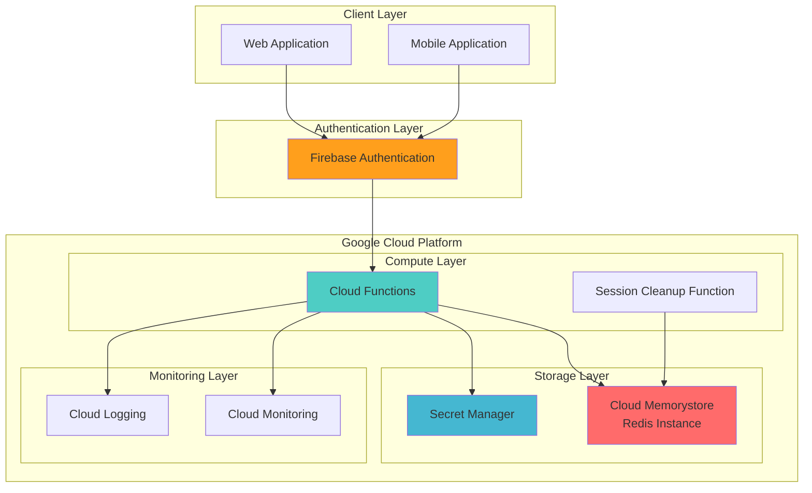

# Session Management with Cloud Memorystore and Firebase Auth

## Problem

Modern web and mobile applications require robust session management that can handle millions of concurrent users while maintaining fast response times and seamless authentication across platforms. Traditional database-backed session storage creates bottlenecks during peak traffic, while simple in-memory solutions lack the persistence and scalability needed for enterprise applications.

## Solution

This solution combines Google Cloud Memorystore for Redis with Firebase Authentication to create a high-performance, intelligent session management system. Cloud Memorystore provides microsecond-latency session storage with automatic scaling, while Firebase Auth handles user authentication seamlessly across web and mobile platforms, creating a unified session experience with intelligent analytics and automatic cleanup.

## Architecture Diagram



## Prerequisites

1. Google Cloud account with billing enabled and appropriate permissions for Cloud Memorystore, Cloud Functions, and Secret Manager
2. Google Cloud CLI installed and configured (or Cloud Shell access)
3. Firebase CLI installed (`npm install -g firebase-tools`)
4. Basic knowledge of Redis, session management, and serverless functions
5. Node.js 18+ for local development and testing
6. Estimated cost: $25-50/month for Redis instance, minimal cost for Cloud Functions and Secret Manager

> **Note**: This recipe uses managed services that automatically scale, reducing operational overhead while maintaining enterprise-grade security and performance standards.

## Preparation

```bash
# Set environment variables for consistent resource naming
export PROJECT_ID=$(gcloud config get-value project)
export REGION="us-central1"
export ZONE="us-central1-a"
export REDIS_INSTANCE_NAME="session-store"
export FIREBASE_PROJECT_ID="${PROJECT_ID}"

# Generate unique suffix for resource names to avoid conflicts
RANDOM_SUFFIX=$(openssl rand -hex 3)
export FUNCTION_NAME="session-manager-${RANDOM_SUFFIX}"
export SECRET_NAME="redis-connection-${RANDOM_SUFFIX}"

# Configure gcloud defaults for consistent operations
gcloud config set project ${PROJECT_ID}
gcloud config set compute/region ${REGION}
gcloud config set compute/zone ${ZONE}

# Enable required Google Cloud APIs for the session management system
gcloud services enable redis.googleapis.com
gcloud services enable cloudfunctions.googleapis.com
gcloud services enable secretmanager.googleapis.com
gcloud services enable firebase.googleapis.com
gcloud services enable logging.googleapis.com
gcloud services enable monitoring.googleapis.com

# Authenticate Firebase CLI
firebase login

echo "✅ Project configured: ${PROJECT_ID}"
echo "✅ Region set to: ${REGION}"
echo "✅ Required APIs enabled"
```

## Steps

1. **Create Cloud Memorystore Redis Instance for Session Storage**:

   Cloud Memorystore for Redis provides a fully managed, in-memory data store that delivers sub-millisecond latency and automatic scaling. This managed service eliminates the operational overhead of maintaining Redis clusters while providing enterprise-grade security, high availability, and seamless integration with Google Cloud services.

   ```bash
   # Create Redis instance with optimized settings for session storage
   gcloud redis instances create ${REDIS_INSTANCE_NAME} \
       --size=1 \
       --region=${REGION} \
       --redis-version=redis_7_0 \
       --tier=basic \
       --display-name="Session Store" \
       --labels=purpose=session-management,environment=production
   
   # Wait for instance creation to complete (typically 3-5 minutes)
   gcloud redis instances describe ${REDIS_INSTANCE_NAME} \
       --region=${REGION} \
       --format="value(state)"
   
   echo "✅ Redis instance created for high-performance session storage"
   ```

   The Redis instance is now provisioned with automatic backups, monitoring, and security configurations. This foundation provides the low-latency storage required for session data while Google's global infrastructure ensures consistent performance across regions.

2. **Store Redis Connection Details in Secret Manager**:

   Secret Manager provides secure, centralized storage for sensitive configuration data like database connection strings. This approach follows security best practices by keeping credentials separate from application code and enables automatic rotation and access control through IAM policies.

   ```bash
   # Retrieve Redis instance connection details
   REDIS_HOST=$(gcloud redis instances describe ${REDIS_INSTANCE_NAME} \
       --region=${REGION} \
       --format="value(host)")
   
   REDIS_PORT=$(gcloud redis instances describe ${REDIS_INSTANCE_NAME} \
       --region=${REGION} \
       --format="value(port)")
   
   # Create connection string for Redis client
   REDIS_CONNECTION_STRING="redis://${REDIS_HOST}:${REDIS_PORT}"
   
   # Store connection details securely in Secret Manager
   echo "${REDIS_CONNECTION_STRING}" | gcloud secrets create ${SECRET_NAME} \
       --data-file=-
   
   echo "✅ Redis connection details stored securely in Secret Manager"
   ```

   The connection string is now securely stored and can be accessed by Cloud Functions with appropriate IAM permissions. This separation of configuration from code enhances security and enables environment-specific configurations without code changes.

3. **Set Up Firebase Authentication Configuration**:

   Firebase Authentication provides a comprehensive identity platform that handles user sign-in, registration, and session management across web and mobile applications. The integration with Google Cloud services enables seamless user experience while maintaining security standards and compliance requirements.

   ```bash
   # Initialize Firebase project if not already done
   firebase projects:addfirebase ${PROJECT_ID} 2>/dev/null || \
       echo "Firebase already initialized for project"
   
   # Create Firebase project configuration
   cat > firebase.json << EOF
   {
     "functions": {
       "runtime": "nodejs18"
     }
   }
   EOF
   
   # Configure Firebase Auth settings for session management
   cat > firebase-auth-config.json << EOF
   {
     "signIn": {
       "allowDuplicateEmails": false,
       "anonymous": {
         "enabled": false
       },
       "email": {
         "enabled": true,
         "passwordRequired": true
       }
     },
     "blockingFunctions": {
       "triggers": {}
     }
   }
   EOF
   
   echo "✅ Firebase Authentication configured for secure user management"
   ```

   Firebase Authentication is now configured to handle user registration and login with email/password authentication. This provides the foundation for secure user identity management that will integrate with our Redis-based session storage system.

4. **Create Cloud Function for Session Management Logic**:

   Cloud Functions provides serverless compute that automatically scales based on demand, making it ideal for session management operations. This function will handle session creation, validation, and analytics while integrating with both Firebase Auth and Cloud Memorystore.

   ```bash
   # Create deployment directory and package.json for dependencies
   mkdir -p session-function && cd session-function
   
   cat > package.json << EOF
   {
     "name": "session-manager",
     "version": "1.0.0",
     "main": "index.js",
     "dependencies": {
       "redis": "^4.6.0",
       "firebase-admin": "^12.0.0",
       "@google-cloud/functions-framework": "^3.3.0",
       "@google-cloud/secret-manager": "^5.0.0",
       "@google-cloud/logging": "^10.0.0"
     }
   }
   EOF
   
   # Create the main session management function
   cat > index.js << 'EOF'
   const functions = require('@google-cloud/functions-framework');
   const admin = require('firebase-admin');
   const redis = require('redis');
   const { SecretManagerServiceClient } = require('@google-cloud/secret-manager');
   const { Logging } = require('@google-cloud/logging');
   
   // Initialize Firebase Admin SDK
   admin.initializeApp();
   
   // Initialize clients
   const secretClient = new SecretManagerServiceClient();
   const logging = new Logging();
   const log = logging.log('session-manager');
   
   let redisClient;
   
   async function initializeRedis() {
     if (!redisClient) {
       const [version] = await secretClient.accessSecretVersion({
         name: `projects/${process.env.GOOGLE_CLOUD_PROJECT}/secrets/${process.env.SECRET_NAME}/versions/latest`,
       });
       const connectionString = version.payload.data.toString();
       
       redisClient = redis.createClient({ url: connectionString });
       await redisClient.connect();
     }
     return redisClient;
   }
   
   // Session management function
   functions.http('sessionManager', async (req, res) => {
     try {
       const client = await initializeRedis();
       const { action, token, sessionData } = req.body;
       
       // Verify Firebase token
       const decodedToken = await admin.auth().verifyIdToken(token);
       const userId = decodedToken.uid;
       const sessionKey = `session:${userId}`;
       
       switch (action) {
         case 'create':
           const session = {
             userId,
             email: decodedToken.email,
             createdAt: Date.now(),
             lastAccessed: Date.now(),
             deviceInfo: req.headers['user-agent'],
             ipAddress: req.ip,
             ...sessionData
           };
           
           await client.setEx(sessionKey, 3600, JSON.stringify(session));
           await log.info({ message: 'Session created', userId, sessionKey });
           
           res.json({ success: true, sessionId: sessionKey });
           break;
           
         case 'validate':
           const existingSession = await client.get(sessionKey);
           if (existingSession) {
             const sessionObj = JSON.parse(existingSession);
             sessionObj.lastAccessed = Date.now();
             await client.setEx(sessionKey, 3600, JSON.stringify(sessionObj));
             
             res.json({ valid: true, session: sessionObj });
           } else {
             res.json({ valid: false });
           }
           break;
           
         case 'destroy':
           await client.del(sessionKey);
           await log.info({ message: 'Session destroyed', userId, sessionKey });
           res.json({ success: true });
           break;
           
         default:
           res.status(400).json({ error: 'Invalid action' });
       }
     } catch (error) {
       await log.error({ message: 'Session operation failed', error: error.message });
       res.status(500).json({ error: 'Internal server error' });
     }
   });
   EOF
   
   echo "✅ Session management function code created with comprehensive session operations"
   ```

   The Cloud Function now includes sophisticated session management logic that handles creation, validation, and destruction of user sessions. It integrates Firebase Authentication for user verification and Redis for high-performance session storage, with comprehensive logging for monitoring and debugging.

5. **Deploy Cloud Function with Environment Configuration**:

   Deploying the Cloud Function with proper environment variables and IAM permissions ensures secure access to Secret Manager and Cloud Memorystore. The serverless nature of Cloud Functions provides automatic scaling and high availability for session management operations.

   ```bash
   # Deploy the session management function with required permissions
   gcloud functions deploy ${FUNCTION_NAME} \
       --gen2 \
       --runtime=nodejs18 \
       --source=. \
       --entry-point=sessionManager \
       --trigger=http \
       --allow-unauthenticated \
       --set-env-vars="SECRET_NAME=${SECRET_NAME}" \
       --memory=512MB \
       --timeout=60s \
       --region=${REGION}
   
   # Grant function access to Secret Manager
   gcloud projects add-iam-policy-binding ${PROJECT_ID} \
       --member="serviceAccount:${PROJECT_ID}@appspot.gserviceaccount.com" \
       --role="roles/secretmanager.secretAccessor"
   
   # Get function URL for client integration
   FUNCTION_URL=$(gcloud functions describe ${FUNCTION_NAME} \
       --region=${REGION} \
       --format="value(serviceConfig.uri)")
   
   echo "✅ Session management function deployed successfully"
   echo "Function URL: ${FUNCTION_URL}"
   ```

   The Cloud Function is now deployed and accessible via HTTP endpoints. It has the necessary permissions to access Secret Manager for Redis connection details and can automatically scale to handle varying session management loads without manual intervention.

6. **Create Automated Session Cleanup Function**:

   Automated session cleanup prevents memory bloat and ensures optimal Redis performance by removing expired or inactive sessions. This Cloud Function runs on a schedule to maintain session store health and provides analytics about session usage patterns.

   ```bash
   # Create cleanup function directory
   mkdir -p ../cleanup-function && cd ../cleanup-function
   
   cat > package.json << EOF
   {
     "name": "session-cleanup",
     "version": "1.0.0",
     "main": "index.js",
     "dependencies": {
       "redis": "^4.6.0",
       "@google-cloud/functions-framework": "^3.3.0",
       "@google-cloud/secret-manager": "^5.0.0",
       "@google-cloud/logging": "^10.0.0"
     }
   }
   EOF
   
   # Create cleanup logic with analytics
   cat > index.js << 'EOF'
   const functions = require('@google-cloud/functions-framework');
   const redis = require('redis');
   const { SecretManagerServiceClient } = require('@google-cloud/secret-manager');
   const { Logging } = require('@google-cloud/logging');
   
   const secretClient = new SecretManagerServiceClient();
   const logging = new Logging();
   const log = logging.log('session-cleanup');
   
   functions.http('sessionCleanup', async (req, res) => {
     try {
       // Get Redis connection from Secret Manager
       const [version] = await secretClient.accessSecretVersion({
         name: `projects/${process.env.GOOGLE_CLOUD_PROJECT}/secrets/${process.env.SECRET_NAME}/versions/latest`,
       });
       const connectionString = version.payload.data.toString();
       
       const client = redis.createClient({ url: connectionString });
       await client.connect();
       
       // Find sessions older than 24 hours
       const keys = await client.keys('session:*');
       let cleanedCount = 0;
       let activeCount = 0;
       
       for (const key of keys) {
         const sessionData = await client.get(key);
         if (sessionData) {
           const session = JSON.parse(sessionData);
           const hoursSinceLastAccess = (Date.now() - session.lastAccessed) / (1000 * 60 * 60);
           
           if (hoursSinceLastAccess > 24) {
             await client.del(key);
             cleanedCount++;
           } else {
             activeCount++;
           }
         }
       }
       
       await log.info({
         message: 'Session cleanup completed',
         cleanedSessions: cleanedCount,
         activeSessions: activeCount,
         totalProcessed: keys.length
       });
       
       await client.disconnect();
       res.json({ 
         success: true, 
         cleanedSessions: cleanedCount, 
         activeSessions: activeCount 
       });
     } catch (error) {
       await log.error({ message: 'Cleanup failed', error: error.message });
       res.status(500).json({ error: 'Cleanup failed' });
     }
   });
   EOF
   
   # Deploy cleanup function
   gcloud functions deploy session-cleanup-${RANDOM_SUFFIX} \
       --gen2 \
       --runtime=nodejs18 \
       --source=. \
       --entry-point=sessionCleanup \
       --trigger=http \
       --set-env-vars="SECRET_NAME=${SECRET_NAME}" \
       --memory=256MB \
       --timeout=300s \
       --region=${REGION}
   
   echo "✅ Automated session cleanup function deployed with performance analytics"
   ```

   The cleanup function is now deployed and ready to maintain Redis performance by removing stale sessions. It provides detailed logging about session usage patterns and cleanup statistics, enabling monitoring of system health and user behavior analytics.

7. **Configure Cloud Scheduler for Automated Cleanup**:

   Cloud Scheduler provides reliable, managed cron job functionality that ensures session cleanup runs consistently. This automation maintains optimal Redis performance and provides regular system maintenance without manual intervention.

   ```bash
   # Enable Cloud Scheduler API
   gcloud services enable cloudscheduler.googleapis.com
   
   # Get cleanup function URL
   CLEANUP_FUNCTION_URL=$(gcloud functions describe session-cleanup-${RANDOM_SUFFIX} \
       --region=${REGION} \
       --format="value(serviceConfig.uri)")
   
   # Create scheduled job to run cleanup every 6 hours
   gcloud scheduler jobs create http session-cleanup-job-${RANDOM_SUFFIX} \
       --location=${REGION} \
       --schedule="0 */6 * * *" \
       --uri="${CLEANUP_FUNCTION_URL}" \
       --http-method=POST \
       --headers="Content-Type=application/json" \
       --message-body='{"trigger":"scheduled"}' \
       --description="Automated session cleanup every 6 hours"
   
   echo "✅ Automated cleanup scheduled to run every 6 hours"
   ```

   Cloud Scheduler is now configured to trigger session cleanup every 6 hours, ensuring consistent Redis performance and preventing memory bloat. This automation reduces operational overhead while maintaining optimal system performance.

8. **Set Up Monitoring and Alerting**:

   Comprehensive monitoring provides visibility into session management performance, Redis health, and user behavior patterns. Cloud Monitoring and Cloud Logging enable proactive system management and troubleshooting capabilities.

   ```bash
   # Create alerting policy for Redis memory usage
   gcloud alpha monitoring policies create \
       --policy-from-file=<(cat << 'EOF'
   {
     "displayName": "Redis Memory Usage Alert",
     "conditions": [
       {
         "displayName": "Redis memory usage high",
         "conditionThreshold": {
           "filter": "resource.type=\"redis_instance\"",
           "comparison": "COMPARISON_GREATER_THAN",
           "thresholdValue": 0.8
         }
       }
     ],
     "notificationChannels": [],
     "alertStrategy": {
       "autoClose": "1800s"
     }
   }
   EOF
   )
   
   # Create log-based metric for session operations
   gcloud logging metrics create session_operations_count \
       --description="Count of session operations" \
       --log-filter='resource.type="cloud_function" AND jsonPayload.message:"Session"'
   
   echo "✅ Monitoring and alerting configured for session management system"
   ```

   Monitoring is now configured to track Redis performance, session metrics, and system health. Alerts will notify administrators of potential issues before they impact user experience, enabling proactive system management.

## Validation & Testing

1. **Verify Redis Instance Status and Connectivity**:

   ```bash
   # Check Redis instance status
   gcloud redis instances describe ${REDIS_INSTANCE_NAME} \
       --region=${REGION} \
       --format="table(state,host,port,memorySizeGb)"
   
   # Verify network connectivity
   REDIS_HOST=$(gcloud redis instances describe ${REDIS_INSTANCE_NAME} \
       --region=${REGION} \
       --format="value(host)")
   
   echo "Redis instance should show STATE: READY"
   echo "Host: ${REDIS_HOST}"
   ```

   Expected output: Redis instance status should show "READY" state with allocated memory and network details.

2. **Test Session Management Function**:

   ```bash
   # Note: This test requires a valid Firebase ID token
   # In a real implementation, obtain token from Firebase Auth SDK
   echo "To test the session function, use a valid Firebase ID token:"
   echo "curl -X POST ${FUNCTION_URL} \\"
   echo "    -H \"Content-Type: application/json\" \\"
   echo "    -d '{\"action\": \"create\", \"token\": \"VALID_FIREBASE_TOKEN\", \"sessionData\": {\"device\": \"web\"}}'"
   ```

   Expected output: Function should return session creation confirmation with session ID when using a valid Firebase token.

3. **Verify Secret Manager Integration**:

   ```bash
   # Test secret access
   gcloud secrets versions access latest --secret=${SECRET_NAME}
   
   # Verify function can access secrets
   gcloud functions logs read ${FUNCTION_NAME} \
       --region=${REGION} \
       --limit=10
   ```

   Expected output: Secret should display Redis connection string and function logs should show successful secret access.

4. **Test Cleanup Function Execution**:

   ```bash
   # Manually trigger cleanup function
   CLEANUP_FUNCTION_URL=$(gcloud functions describe session-cleanup-${RANDOM_SUFFIX} \
       --region=${REGION} \
       --format="value(serviceConfig.uri)")
   
   curl -X POST ${CLEANUP_FUNCTION_URL} \
       -H "Content-Type: application/json" \
       -d '{"trigger":"manual"}'
   
   # Check cleanup logs
   gcloud functions logs read session-cleanup-${RANDOM_SUFFIX} \
       --region=${REGION} \
       --limit=5
   ```

   Expected output: Cleanup function should execute successfully and log session statistics.

## Cleanup

1. **Remove Cloud Scheduler Jobs**:

   ```bash
   # Delete scheduled cleanup job
   gcloud scheduler jobs delete session-cleanup-job-${RANDOM_SUFFIX} \
       --location=${REGION} \
       --quiet
   
   echo "✅ Scheduler job removed"
   ```

2. **Delete Cloud Functions**:

   ```bash
   # Remove session management function
   gcloud functions delete ${FUNCTION_NAME} \
       --region=${REGION} \
       --quiet
   
   # Remove cleanup function
   gcloud functions delete session-cleanup-${RANDOM_SUFFIX} \
       --region=${REGION} \
       --quiet
   
   echo "✅ Cloud Functions deleted"
   ```

3. **Remove Secret Manager Secrets**:

   ```bash
   # Delete Redis connection secret
   gcloud secrets delete ${SECRET_NAME} --quiet
   
   echo "✅ Secrets removed"
   ```

4. **Delete Redis Instance**:

   ```bash
   # Remove Redis instance (this will permanently delete all session data)
   gcloud redis instances delete ${REDIS_INSTANCE_NAME} \
       --region=${REGION} \
       --quiet
   
   echo "✅ Redis instance deleted"
   ```

5. **Clean Up Local Files**:

   ```bash
   # Remove function directories
   cd .. && rm -rf session-function cleanup-function
   rm -f firebase-auth-config.json firebase.json
   
   echo "✅ Local files cleaned up"
   ```

## Discussion

This intelligent session management solution demonstrates the power of combining Google Cloud's managed services to create enterprise-grade session handling capabilities. Cloud Memorystore for Redis provides the high-performance storage backbone with microsecond latency and automatic scaling, while Firebase Authentication handles the complex authentication flows across web and mobile platforms. The integration creates a seamless user experience that can scale to millions of concurrent sessions.

The serverless architecture using Cloud Functions ensures cost-effectiveness and automatic scaling based on demand. Unlike traditional session management approaches that require dedicated infrastructure and complex clustering configurations, this solution leverages Google's managed services to eliminate operational overhead while maintaining enterprise-grade reliability and security. The automated cleanup functionality prevents memory bloat and provides valuable analytics about user behavior patterns.

Security is built into every layer of this architecture. Secret Manager protects sensitive configuration data, Firebase Authentication provides industry-standard identity verification, and Cloud Memorystore operates within Google's secure network infrastructure. The solution follows zero-trust principles by validating every session operation and maintaining detailed audit logs through Cloud Logging. This approach ensures compliance with security standards while providing the performance characteristics needed for modern applications.

The monitoring and alerting capabilities provide essential visibility into system performance and user behavior. Custom metrics enable tracking of session creation rates, cleanup efficiency, and Redis performance characteristics, allowing for proactive optimization and capacity planning. For more details on Redis best practices, see the [Cloud Memorystore memory management guide](https://cloud.google.com/memorystore/docs/redis/memory-management-best-practices). Firebase Authentication documentation provides comprehensive guidance on [session management patterns](https://firebase.google.com/docs/auth/admin/manage-sessions) and security considerations.

> **Tip**: Consider implementing session data encryption at the application level for additional security, especially when storing sensitive user information in session objects. Use Cloud KMS for key management to maintain security standards.

## Challenge

Extend this session management solution with these advanced capabilities:

1. **Multi-Region Session Replication**: Implement cross-region session replication using Cloud Memorystore global replicas to ensure session persistence during regional outages and improve global performance.

2. **Advanced Session Analytics**: Build real-time dashboards using BigQuery and Looker Studio to analyze session patterns, user behavior, and performance metrics for business intelligence insights.

3. **Intelligent Session Optimization**: Implement machine learning-based session timeout prediction using Vertex AI to optimize session lifetime based on user behavior patterns and reduce unnecessary authentication prompts.

4. **Progressive Web App Integration**: Extend the solution to support Progressive Web App (PWA) offline capabilities with service worker integration for session state management during network interruptions.

5. **Enterprise SSO Integration**: Integrate with Google Workspace or third-party identity providers using OpenID Connect to support enterprise single sign-on requirements while maintaining session consistency.

## Infrastructure Code

*Infrastructure code will be generated after recipe approval.*