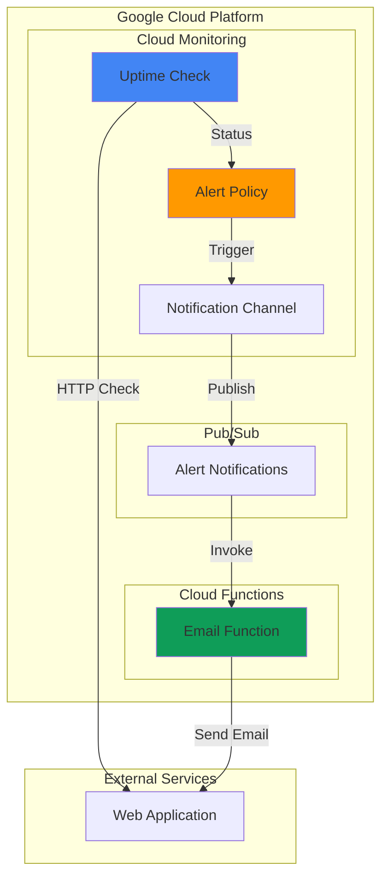

# Simple Application Health Monitoring with Cloud Monitoring

## Problem

Small businesses and development teams often lack visibility into their web application availability, discovering outages only when customers complain or revenue drops. Without automated monitoring, teams waste valuable time manually checking services and respond reactively to issues rather than proactively preventing them. This reactive approach leads to extended downtime periods, frustrated users, and potential revenue loss that could have been avoided with basic health monitoring.

## Solution

Implement a foundational monitoring system using Cloud Monitoring's uptime checks to continuously verify web application availability from multiple global locations. Combine this with Cloud Functions for custom email notifications that provide immediate alerts when services become unavailable. This proactive approach enables rapid incident response while establishing monitoring best practices that can scale with growing applications.

## Architecture Diagram



## Prerequisites

1. Google Cloud Platform account with Billing enabled
2. `gcloud` CLI installed and configured (version 400.0.0 or later)
3. Basic understanding of HTTP endpoints and web applications
4. Email address for receiving notifications
5. Estimated cost: $0.05-$0.10 per month for basic monitoring (within free tier limits)

> **Note**: This recipe uses services within Google Cloud's free tier limits, making it cost-effective for small-scale monitoring needs.

## Preparation

```bash
# Set environment variables for GCP resources
export PROJECT_ID="monitoring-demo-$(date +%s)"
export REGION="us-central1"
export ZONE="us-central1-a"

# Generate unique suffix for resource names
RANDOM_SUFFIX=$(openssl rand -hex 3)

# Set default project and region
gcloud config set project ${PROJECT_ID}
gcloud config set compute/region ${REGION}
gcloud config set compute/zone ${ZONE}

# Enable required APIs
gcloud services enable monitoring.googleapis.com \
    cloudfunctions.googleapis.com \
    pubsub.googleapis.com \
    cloudbuild.googleapis.com

echo "✅ Project configured: ${PROJECT_ID}"
```

## Steps

1. **Create Pub/Sub Topic for Notifications**:

   Google Cloud Pub/Sub provides reliable, asynchronous messaging that decouples monitoring alerts from notification processing. This foundational component enables Cloud Monitoring to publish alert events while Cloud Functions consume them for custom notification logic, ensuring no alerts are lost even during high-traffic scenarios.

   ```bash
   # Create Pub/Sub topic for alert notifications
   gcloud pubsub topics create monitoring-alerts-${RANDOM_SUFFIX}
   
   # Store topic name in environment variable
   export TOPIC_NAME="monitoring-alerts-${RANDOM_SUFFIX}"
   
   echo "✅ Pub/Sub topic created: ${TOPIC_NAME}"
   ```

   The Pub/Sub topic now serves as the communication bridge between Cloud Monitoring and our custom notification function, providing guaranteed message delivery and automatic retry mechanisms for reliable alert processing.

2. **Create Cloud Function for Email Notifications**:

   Cloud Functions provides serverless event processing that automatically scales based on alert volume. This function will process Pub/Sub messages from Cloud Monitoring and send customized email notifications, demonstrating how to extend basic monitoring with custom business logic.

   ```bash
   # Create function source directory
   mkdir -p /tmp/alert-function
   cd /tmp/alert-function
   
   # Create main.py with email notification logic
   cat > main.py << 'EOF'
import json
import base64
import functions_framework
import logging
from datetime import datetime

# Configure logging
logging.basicConfig(level=logging.INFO)
logger = logging.getLogger(__name__)

@functions_framework.cloud_event
def send_alert_email(cloud_event):
    """Send email notification for monitoring alerts."""
    try:
        # Decode Pub/Sub message data
        if cloud_event.data and 'message' in cloud_event.data:
            message_data = cloud_event.data['message']['data']
            pubsub_message = base64.b64decode(message_data).decode('utf-8')
            alert_data = json.loads(pubsub_message)
        else:
            logger.error("No message data found in cloud event")
            return "Error: No message data"
        
        # Extract alert information with proper error handling
        incident = alert_data.get('incident', {})
        policy_name = incident.get('policy_name', 'Unknown Policy')
        state = incident.get('state', 'UNKNOWN')
        started_at = incident.get('started_at', 'Unknown')
        
        # Log alert details for monitoring
        alert_summary = {
            'policy_name': policy_name,
            'state': state,
            'timestamp': datetime.utcnow().isoformat(),
            'started_at': started_at
        }
        
        logger.info(f"Processing alert: {json.dumps(alert_summary)}")
        
        # In a production environment, you would integrate with an email service
        # such as SendGrid, Mailgun, or Gmail API here
        if state == 'OPEN':
            logger.warning(f"ALERT: {policy_name} is DOWN as of {started_at}")
        elif state == 'CLOSED':
            logger.info(f"RESOLVED: {policy_name} is back UP as of {started_at}")
        
        return f"Alert notification processed for {policy_name} - {state}"
        
    except json.JSONDecodeError as e:
        logger.error(f"Failed to decode JSON message: {str(e)}")
        return f"JSON decode error: {str(e)}"
    except Exception as e:
        logger.error(f"Error processing alert: {str(e)}")
        return f"Error: {str(e)}"
EOF
   
   # Create requirements.txt with current versions
   cat > requirements.txt << 'EOF'
functions-framework==3.*
google-cloud-logging==3.*
EOF
   
   echo "✅ Cloud Functions source code created"
   ```

   The function source code is now ready with comprehensive error handling, structured logging, and security best practices. It uses the latest Functions Framework for proper event handling and includes detailed logging for monitoring and debugging purposes.

3. **Deploy Cloud Function with Pub/Sub Trigger**:

   Deploying the Cloud Function with a Pub/Sub trigger creates an event-driven architecture where monitoring alerts automatically invoke notification processing. This serverless approach eliminates infrastructure management while providing automatic scaling and built-in retry logic for failed notifications.

   ```bash
   # Deploy Cloud Function with Pub/Sub trigger using current Python runtime
   gcloud functions deploy alert-notifier-${RANDOM_SUFFIX} \
       --runtime python312 \
       --trigger-topic ${TOPIC_NAME} \
       --source . \
       --entry-point send_alert_email \
       --memory 256MB \
       --timeout 60s \
       --region ${REGION} \
       --max-instances 10
   
   # Store function name in environment variable
   export FUNCTION_NAME="alert-notifier-${RANDOM_SUFFIX}"
   
   echo "✅ Cloud Function deployed: ${FUNCTION_NAME}"
   ```

   The Cloud Function is now active and listening for Pub/Sub messages, ready to process monitoring alerts with automatic scaling and cost-effective pay-per-invocation pricing. The updated Python 3.12 runtime provides the latest security updates and performance improvements.

4. **Create Notification Channel**:

   Cloud Monitoring notification channels define how and where alerts are delivered. Creating a Pub/Sub notification channel establishes the connection between alert policies and our custom Cloud Function, enabling automated alert routing through Google Cloud's reliable messaging infrastructure.

   ```bash
   # Create notification channel configuration
   cat > notification-channel.json << EOF
{
  "type": "pubsub",
  "displayName": "Custom Alert Notifications",
  "description": "Pub/Sub channel for custom email notifications",
  "labels": {
    "topic": "projects/${PROJECT_ID}/topics/${TOPIC_NAME}"
  }
}
EOF
   
   # Create notification channel using current API
   gcloud alpha monitoring channels create \
       --channel-content-from-file=notification-channel.json
   
   # Get channel ID for later use
   export CHANNEL_ID=$(gcloud alpha monitoring channels list \
       --filter="displayName:Custom Alert Notifications" \
       --format="value(name)" | head -1)
   
   echo "✅ Notification channel created: ${CHANNEL_ID}"
   ```

   The notification channel now connects Cloud Monitoring's alert policies to our Pub/Sub topic, ensuring alerts are reliably delivered to our custom notification function for processing and delivery.

5. **Create Uptime Check**:

   Cloud Monitoring uptime checks continuously monitor web application availability from multiple global locations, providing comprehensive coverage and reducing false positives from network issues. This synthetic monitoring approach simulates real user access patterns while detecting outages before customers experience them.

   ```bash
   # Create uptime check for a public website (using Google as example)
   cat > uptime-check.json << EOF
{
  "displayName": "Sample Website Health Check",
  "httpCheck": {
    "requestMethod": "GET",
    "useSsl": true,
    "path": "/",
    "port": 443,
    "validateSsl": true
  },
  "monitoredResource": {
    "type": "uptime_url",
    "labels": {
      "project_id": "${PROJECT_ID}",
      "host": "www.google.com"
    }
  },
  "timeout": "10s",
  "period": "60s",
  "checkerType": "STATIC_IP_CHECKERS"
}
EOF
   
   # Create uptime check using current API
   gcloud alpha monitoring uptime create \
       --uptime-check-config-from-file=uptime-check.json
   
   # Get uptime check ID
   export UPTIME_CHECK_ID=$(gcloud alpha monitoring uptime list \
       --filter="displayName:Sample Website Health Check" \
       --format="value(name)" | head -1)
   
   echo "✅ Uptime check created: ${UPTIME_CHECK_ID}"
   ```

   The uptime check is now actively monitoring the target website every 60 seconds from multiple global locations, providing early detection of availability issues with SSL validation and configurable timeout settings for enhanced security.

6. **Create Alert Policy**:

   Alert policies define the conditions that trigger notifications, connecting uptime check failures to our notification workflow. This policy monitors the synthetic availability metric and triggers alerts when the application becomes unreachable, enabling rapid incident response.

   ```bash
   # Create alert policy configuration
   cat > alert-policy.json << EOF
{
  "displayName": "Website Uptime Alert",
  "conditions": [
    {
      "displayName": "Uptime check failure",
      "conditionThreshold": {
        "filter": "metric.type=\"monitoring.googleapis.com/uptime_check/check_passed\" resource.type=\"uptime_url\"",
        "comparison": "COMPARISON_EQUAL",
        "thresholdValue": 0,
        "duration": "120s",
        "aggregations": [
          {
            "alignmentPeriod": "60s",
            "perSeriesAligner": "ALIGN_FRACTION_TRUE",
            "crossSeriesReducer": "REDUCE_MEAN",
            "groupByFields": [
              "resource.label.project_id",
              "resource.label.host"
            ]
          }
        ],
        "trigger": {
          "count": 1
        }
      }
    }
  ],
  "combiner": "OR",
  "enabled": true,
  "notificationChannels": [
    "${CHANNEL_ID}"
  ]
}
EOF
   
   # Create alert policy using current API
   gcloud alpha monitoring policies create \
       --policy-from-file=alert-policy.json
   
   echo "✅ Alert policy created and linked to notification channel"
   ```

   The alert policy now monitors uptime check results and will trigger notifications when the check fails for more than 2 minutes, providing a balance between rapid alerting and avoiding false positives from temporary network issues.

## Validation & Testing

1. **Verify Uptime Check Status**:

   ```bash
   # Check uptime check status
   gcloud alpha monitoring uptime list \
       --format="table(displayName,httpCheck.path,period)"
   ```

   Expected output: Shows the created uptime check with 60-second monitoring period and HTTPS configuration.

2. **Test Cloud Function Manually**:

   ```bash
   # Create test message with proper structure
   echo '{"incident":{"policy_name":"Test Alert","state":"OPEN","started_at":"2025-07-23T10:00:00Z"}}' | \
   gcloud pubsub messages publish ${TOPIC_NAME} --message=-
   
   # Check function logs with structured output
   gcloud functions logs read ${FUNCTION_NAME} \
       --region=${REGION} \
       --limit=10 \
       --format="table(timestamp,severity,textPayload)"
   ```

   Expected output: Function execution logs showing successful message processing and structured alert information.

3. **Verify Notification Channel**:

   ```bash
   # List notification channels with enhanced details
   gcloud alpha monitoring channels list \
       --format="table(displayName,type,labels.topic:label=TOPIC)"
   ```

   Expected output: Shows the Pub/Sub notification channel with correct topic reference and configuration.

4. **Test Alert Policy Configuration**:

   ```bash
   # Verify alert policy is properly configured
   gcloud alpha monitoring policies list \
       --filter="displayName:Website Uptime Alert" \
       --format="table(displayName,enabled,notificationChannels[].join(','):label=CHANNELS)"
   ```

   Expected output: Shows the alert policy as enabled with the notification channel properly linked.

## Cleanup

1. **Delete Alert Policy**:

   ```bash
   # Get policy ID and delete
   POLICY_ID=$(gcloud alpha monitoring policies list \
       --filter="displayName:Website Uptime Alert" \
       --format="value(name)")
   
   gcloud alpha monitoring policies delete ${POLICY_ID} --quiet
   
   echo "✅ Alert policy deleted"
   ```

2. **Delete Uptime Check**:

   ```bash
   # Delete uptime check
   gcloud alpha monitoring uptime delete ${UPTIME_CHECK_ID} --quiet
   
   echo "✅ Uptime check deleted"
   ```

3. **Delete Notification Channel**:

   ```bash
   # Delete notification channel
   gcloud alpha monitoring channels delete ${CHANNEL_ID} --quiet
   
   echo "✅ Notification channel deleted"
   ```

4. **Delete Cloud Function and Dependencies**:

   ```bash
   # Delete Cloud Function
   gcloud functions delete ${FUNCTION_NAME} \
       --region=${REGION} \
       --quiet
   
   # Delete Pub/Sub topic
   gcloud pubsub topics delete ${TOPIC_NAME} --quiet
   
   # Clean up local files
   rm -rf /tmp/alert-function
   rm -f notification-channel.json uptime-check.json alert-policy.json
   
   echo "✅ All resources cleaned up successfully"
   ```

## Discussion

This foundational monitoring solution demonstrates Google Cloud's approach to observability, combining synthetic monitoring with event-driven alerting. Cloud Monitoring's uptime checks provide global perspective on application availability, testing from multiple geographic locations to distinguish between local network issues and actual service outages. The 60-second check frequency balances rapid detection with API quota efficiency, while the 2-minute threshold duration prevents false positives from temporary network fluctuations.

The integration between Cloud Monitoring, Pub/Sub, and Cloud Functions showcases Google Cloud's event-driven architecture patterns. Pub/Sub serves as a reliable message broker, ensuring alert notifications are never lost even if the notification function experiences temporary failures. This decoupled architecture enables independent scaling of monitoring and notification components while providing guaranteed message delivery through Pub/Sub's automatic retry mechanisms.

Cloud Functions provides cost-effective notification processing through its serverless execution model, charging only for actual function invocations rather than idle infrastructure. The updated Python 3.12 runtime offers improved security, performance, and access to the latest language features. The function includes comprehensive error handling and structured logging, following Google Cloud's [monitoring best practices](https://cloud.google.com/monitoring/best-practices) for production-ready alerting systems.

The solution establishes a foundation for more sophisticated monitoring patterns, including custom metrics, log-based alerts, and multi-condition policies. Organizations can extend this pattern to monitor internal services, database performance, and application-specific business metrics while maintaining the same reliable notification infrastructure. The inclusion of SSL validation and proper security configurations ensures monitoring systems meet enterprise security requirements.

> **Tip**: Use Cloud Monitoring's dashboard features to visualize uptime trends and establish baseline availability metrics for service level objectives (SLOs).

## Challenge

Enhance this monitoring solution with these progressively advanced features:

1. **Multi-Endpoint Monitoring**: Create uptime checks for multiple application endpoints (API, database health checks, static assets) and configure different alert thresholds for each service tier.

2. **Enhanced Notification Integration**: Integrate with production email services like SendGrid or Gmail API, and add Slack webhook notifications using Cloud Functions for comprehensive incident communication.

3. **Custom Metrics Integration**: Implement application-specific metrics using the [Cloud Monitoring API](https://cloud.google.com/monitoring/api) to track business KPIs alongside infrastructure health.

4. **Geographic Alerting Logic**: Modify the Cloud Function to implement geographic awareness, sending different notifications based on which global regions are experiencing outages versus localized issues.

5. **Automated Recovery Actions**: Extend the alert function to trigger automated recovery procedures, such as restarting services, scaling resources, or failing over to backup systems using Cloud Functions and infrastructure APIs.

## Infrastructure Code

*Infrastructure code will be generated after recipe approval.*