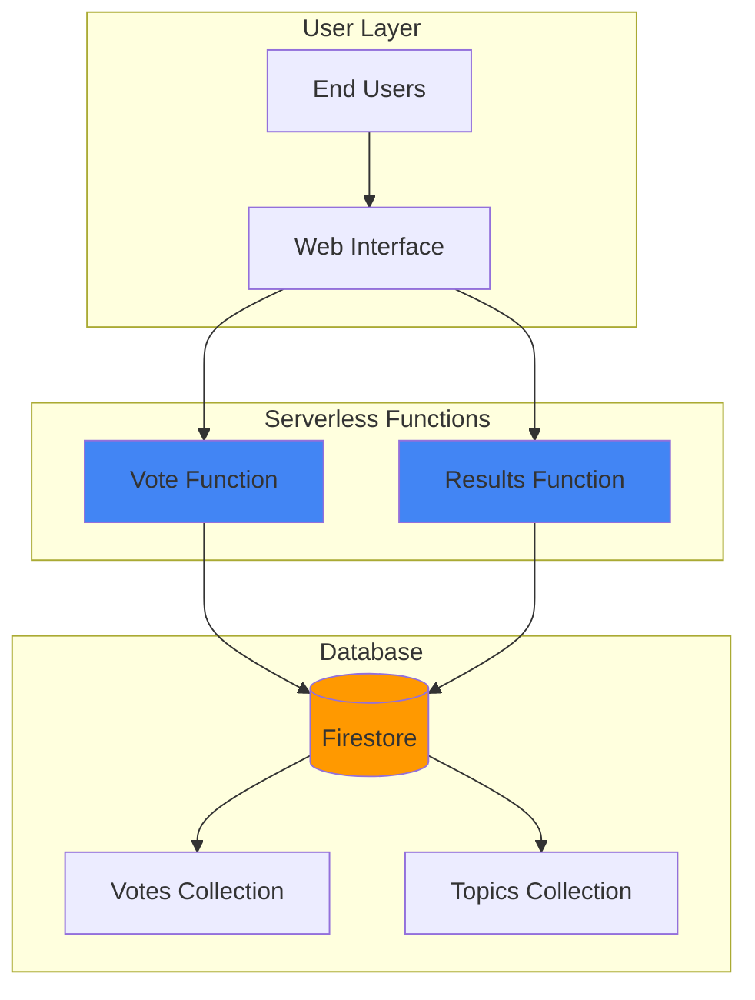

# Simple Voting System with Cloud Functions and Firestore

## Problem

Organizations need simple voting systems for polls, feedback collection, or decision-making processes, but building traditional server-based solutions requires significant infrastructure management and scaling concerns. Creating a reliable voting system that prevents duplicate votes while providing real-time results visibility becomes complex when managing servers, databases, and authentication systems manually.

## Solution

Build a serverless voting system using Google Cloud Functions for HTTP endpoints and Firestore for real-time data storage. This approach eliminates server management while providing automatic scaling, built-in security, and real-time synchronization. The serverless architecture ensures cost efficiency through pay-per-use pricing and automatic scaling based on voting volume.

## Architecture Diagram



## Prerequisites

1. Google Cloud account with billing enabled
2. Google Cloud CLI installed and configured
3. Basic understanding of JavaScript/Node.js
4. Basic understanding of NoSQL databases
5. Estimated cost: $0-2 USD for testing (functions and Firestore usage)

> **Note**: This recipe uses Firebase services which are part of Google Cloud Platform and follow the same billing structure.

## Preparation

```bash
# Set environment variables for GCP resources
export PROJECT_ID="voting-system-$(date +%s)"
export REGION="us-central1"

# Generate unique suffix for resource names
RANDOM_SUFFIX=$(openssl rand -hex 3)
export FUNCTION_NAME="vote-handler-${RANDOM_SUFFIX}"

# Create and configure Google Cloud project
gcloud projects create ${PROJECT_ID}
gcloud config set project ${PROJECT_ID}
gcloud config set compute/region ${REGION}

# Enable required APIs
gcloud services enable cloudfunctions.googleapis.com
gcloud services enable firestore.googleapis.com
gcloud services enable cloudbuild.googleapis.com

echo "✅ Project configured: ${PROJECT_ID}"
echo "✅ Region set to: ${REGION}"
```

## Steps

1. **Initialize Firestore Database**:

   Firestore provides a flexible, scalable NoSQL cloud database with real-time synchronization capabilities. Setting up Firestore creates the foundation for storing voting data with automatic scaling and global distribution. The database initialization establishes the document structure needed for organizing votes and topics efficiently.

   ```bash
   # Create Firestore database in Native mode
   gcloud firestore databases create \
       --region=${REGION} \
       --type=firestore-native
   
   echo "✅ Firestore database created in ${REGION}"
   ```

   The Firestore database is now ready with Native mode enabled, providing strong consistency and ACID transactions. This configuration supports complex queries and real-time listeners essential for a responsive voting system.

2. **Create Project Directory Structure**:

   ```bash
   # Create function source directory
   mkdir -p voting-functions
   cd voting-functions
   
   # Initialize Node.js project
   npm init -y
   
   # Install required dependencies
   npm install @google-cloud/firestore@^7.9.0
   npm install @google-cloud/functions-framework@^3.4.0
   
   echo "✅ Project structure created with dependencies"
   ```

3. **Create Vote Handler Function**:

   Cloud Functions provides serverless compute that automatically scales based on request volume. Creating the vote handler function establishes the core logic for processing votes while preventing duplicates and maintaining data integrity. The function includes input validation and atomic operations to ensure reliable vote counting.

   ```bash
   # Create the main function file
   cat > index.js << 'EOF'
const { Firestore } = require('@google-cloud/firestore');
const functions = require('@google-cloud/functions-framework');

const firestore = new Firestore();

// Vote submission endpoint
functions.http('submitVote', async (req, res) => {
  // Enable CORS
  res.set('Access-Control-Allow-Origin', '*');
  res.set('Access-Control-Allow-Methods', 'GET, POST, OPTIONS');
  res.set('Access-Control-Allow-Headers', 'Content-Type');
  
  if (req.method === 'OPTIONS') {
    res.status(204).send('');
    return;
  }
  
  try {
    const { topicId, option, userId } = req.body;
    
    if (!topicId || !option || !userId) {
      res.status(400).json({ error: 'Missing required fields' });
      return;
    }
    
    // Check if user already voted
    const userVoteRef = firestore
      .collection('votes')
      .doc(`${topicId}_${userId}`);
    
    const userVoteDoc = await userVoteRef.get();
    
    if (userVoteDoc.exists) {
      res.status(409).json({ error: 'User already voted on this topic' });
      return;
    }
    
    // Use transaction to ensure atomicity
    await firestore.runTransaction(async (transaction) => {
      // Record the vote
      transaction.set(userVoteRef, {
        topicId,
        option,
        userId,
        timestamp: Firestore.Timestamp.now()
      });
      
      // Update vote count
      const countRef = firestore
        .collection('voteCounts')
        .doc(`${topicId}_${option}`);
      
      const countDoc = await transaction.get(countRef);
      const currentCount = countDoc.exists ? countDoc.data().count : 0;
      
      transaction.set(countRef, {
        topicId,
        option,
        count: currentCount + 1,
        lastUpdated: Firestore.Timestamp.now()
      });
    });
    
    res.status(200).json({ success: true, message: 'Vote recorded' });
  } catch (error) {
    console.error('Error processing vote:', error);
    res.status(500).json({ error: 'Internal server error' });
  }
});

// Get results endpoint
functions.http('getResults', async (req, res) => {
  res.set('Access-Control-Allow-Origin', '*');
  res.set('Access-Control-Allow-Methods', 'GET, POST, OPTIONS');
  
  if (req.method === 'OPTIONS') {
    res.status(204).send('');
    return;
  }
  
  try {
    const { topicId } = req.query;
    
    if (!topicId) {
      res.status(400).json({ error: 'Missing topicId parameter' });
      return;
    }
    
    const countsSnapshot = await firestore
      .collection('voteCounts')
      .where('topicId', '==', topicId)
      .get();
    
    const results = {};
    countsSnapshot.forEach(doc => {
      const data = doc.data();
      results[data.option] = data.count;
    });
    
    res.status(200).json({ topicId, results });
  } catch (error) {
    console.error('Error getting results:', error);
    res.status(500).json({ error: 'Internal server error' });
  }
});
EOF

   echo "✅ Vote handler function created with duplicate prevention"
   ```

   The function now handles vote submissions with atomic transactions and duplicate prevention. The implementation uses Firestore transactions to ensure data consistency and prevents race conditions during concurrent voting.

4. **Create Package Configuration**:

   ```bash
   # Create package.json with proper configuration
   cat > package.json << EOF
{
  "name": "voting-system-functions",
  "version": "1.0.0",
  "description": "Serverless voting system using Cloud Functions and Firestore",
  "main": "index.js",
  "scripts": {
    "start": "functions-framework --target=submitVote"
  },
  "dependencies": {
    "@google-cloud/firestore": "^7.9.0",
    "@google-cloud/functions-framework": "^3.4.0"
  },
  "engines": {
    "node": "20"
  }
}
EOF

   echo "✅ Package configuration created"
   ```

5. **Deploy Vote Submission Function**:

   Deploying the Cloud Function creates a managed HTTP endpoint that automatically scales based on request volume. The deployment process builds the function code, configures the runtime environment, and creates the necessary infrastructure for handling HTTP requests securely.

   ```bash
   # Deploy the vote submission function
   gcloud functions deploy ${FUNCTION_NAME}-submit \
       --gen2 \
       --runtime=nodejs20 \
       --region=${REGION} \
       --source=. \
       --entry-point=submitVote \
       --trigger-http \
       --allow-unauthenticated \
       --memory=256MB \
       --timeout=60s
   
   # Get the function URL
   SUBMIT_URL=$(gcloud functions describe ${FUNCTION_NAME}-submit \
       --region=${REGION} \
       --format="value(serviceConfig.uri)")
   
   echo "✅ Vote submission function deployed: ${SUBMIT_URL}"
   ```

   The vote submission function is now live with automatic scaling and built-in security. The HTTP trigger enables direct API access while the serverless architecture ensures cost efficiency through pay-per-invocation pricing.

6. **Deploy Results Function**:

   ```bash
   # Deploy the results retrieval function
   gcloud functions deploy ${FUNCTION_NAME}-results \
       --gen2 \
       --runtime=nodejs20 \
       --region=${REGION} \
       --source=. \
       --entry-point=getResults \
       --trigger-http \
       --allow-unauthenticated \
       --memory=256MB \
       --timeout=60s
   
   # Get the results function URL
   RESULTS_URL=$(gcloud functions describe ${FUNCTION_NAME}-results \
       --region=${REGION} \
       --format="value(serviceConfig.uri)")
   
   echo "✅ Results function deployed: ${RESULTS_URL}"
   ```

7. **Create Simple Web Interface**:

   ```bash
   # Create a basic HTML interface for testing
   cat > voting-interface.html << EOF
<!DOCTYPE html>
<html lang="en">
<head>
    <meta charset="UTF-8">
    <meta name="viewport" content="width=device-width, initial-scale=1.0">
    <title>Simple Voting System</title>
    <style>
        body { font-family: Arial, sans-serif; max-width: 600px; margin: 50px auto; padding: 20px; }
        .vote-option { margin: 10px 0; }
        button { background: #4285F4; color: white; border: none; padding: 10px 20px; border-radius: 4px; cursor: pointer; }
        button:hover { background: #3367D6; }
        .results { margin-top: 30px; padding: 20px; background: #f0f0f0; border-radius: 4px; }
    </style>
</head>
<body>
    <h1>Simple Voting System</h1>
    
    <div>
        <h3>Vote on: What's your favorite cloud service?</h3>
        <div class="vote-option">
            <button onclick="submitVote('cloud-services', 'compute-engine')">Compute Engine</button>
        </div>
        <div class="vote-option">
            <button onclick="submitVote('cloud-services', 'cloud-functions')">Cloud Functions</button>
        </div>
        <div class="vote-option">
            <button onclick="submitVote('cloud-services', 'cloud-storage')">Cloud Storage</button>
        </div>
        <div class="vote-option">
            <button onclick="submitVote('cloud-services', 'firestore')">Firestore</button>
        </div>
    </div>
    
    <button onclick="getResults('cloud-services')" style="margin-top: 20px;">View Results</button>
    
    <div id="results" class="results" style="display: none;">
        <h3>Current Results:</h3>
        <div id="results-content"></div>
    </div>

    <script>
        const SUBMIT_URL = '${SUBMIT_URL}';
        const RESULTS_URL = '${RESULTS_URL}';
        const USER_ID = 'user-' + Math.random().toString(36).substr(2, 9);
        
        async function submitVote(topicId, option) {
            try {
                const response = await fetch(SUBMIT_URL, {
                    method: 'POST',
                    headers: { 'Content-Type': 'application/json' },
                    body: JSON.stringify({ topicId, option, userId: USER_ID })
                });
                
                const result = await response.json();
                
                if (response.ok) {
                    alert('Vote submitted successfully!');
                    getResults(topicId);
                } else {
                    alert('Error: ' + result.error);
                }
            } catch (error) {
                alert('Network error: ' + error.message);
            }
        }
        
        async function getResults(topicId) {
            try {
                const response = await fetch(RESULTS_URL + '?topicId=' + topicId);
                const data = await response.json();
                
                if (response.ok) {
                    displayResults(data.results);
                } else {
                    alert('Error getting results: ' + data.error);
                }
            } catch (error) {
                alert('Network error: ' + error.message);
            }
        }
        
        function displayResults(results) {
            const resultsDiv = document.getElementById('results');
            const contentDiv = document.getElementById('results-content');
            
            let html = '';
            for (const [option, count] of Object.entries(results)) {
                html += '<p><strong>' + option.replace('-', ' ').toUpperCase() + ':</strong> ' + count + ' votes</p>';
            }
            
            contentDiv.innerHTML = html || '<p>No votes yet!</p>';
            resultsDiv.style.display = 'block';
        }
    </script>
</body>
</html>
EOF

   echo "✅ Web interface created: voting-interface.html"
   echo "📝 Open voting-interface.html in your browser to test the voting system"
   ```

## Validation & Testing

1. **Verify Functions Deployment**:

   ```bash
   # Check function status
   gcloud functions list --filter="name:${FUNCTION_NAME}" \
       --format="table(name,status,trigger.httpsTrigger.url)"
   ```

   Expected output: Both functions should show "ACTIVE" status with their respective URLs.

2. **Test Vote Submission**:

   ```bash
   # Test submitting a vote
   curl -X POST ${SUBMIT_URL} \
       -H "Content-Type: application/json" \
       -d '{
         "topicId": "test-topic",
         "option": "option-a",
         "userId": "test-user-123"
       }'
   ```

   Expected output: `{"success":true,"message":"Vote recorded"}`

3. **Test Results Retrieval**:

   ```bash
   # Get voting results
   curl "${RESULTS_URL}?topicId=test-topic"
   ```

   Expected output: `{"topicId":"test-topic","results":{"option-a":1}}`

4. **Test Duplicate Vote Prevention**:

   ```bash
   # Try to vote again with same user
   curl -X POST ${SUBMIT_URL} \
       -H "Content-Type: application/json" \
       -d '{
         "topicId": "test-topic",
         "option": "option-b",
         "userId": "test-user-123"
       }'
   ```

   Expected output: `{"error":"User already voted on this topic"}`

## Cleanup

1. **Delete Cloud Functions**:

   ```bash
   # Delete both deployed functions
   gcloud functions delete ${FUNCTION_NAME}-submit \
       --region=${REGION} \
       --quiet
   
   gcloud functions delete ${FUNCTION_NAME}-results \
       --region=${REGION} \
       --quiet
   
   echo "✅ Cloud Functions deleted"
   ```

2. **Remove Firestore Data**:

   ```bash
   # Note: Firestore database deletion requires manual action in console
   echo "⚠️  Manually delete Firestore database in the Google Cloud Console"
   echo "   Go to: https://console.cloud.google.com/firestore/databases"
   echo "   Select your database and click 'Delete Database'"
   ```

3. **Delete Project**:

   ```bash
   # Delete the entire project (if created specifically for this recipe)
   gcloud projects delete ${PROJECT_ID} --quiet
   
   echo "✅ Project deletion initiated: ${PROJECT_ID}"
   echo "Note: Project deletion may take several minutes to complete"
   ```

4. **Clean Local Files**:

   ```bash
   # Remove local files
   cd ..
   rm -rf voting-functions
   rm -f voting-interface.html
   
   echo "✅ Local files cleaned up"
   ```

## Discussion

This serverless voting system demonstrates the power of combining Google Cloud Functions with Firestore to create scalable, real-time applications without infrastructure management. The architecture leverages Google Cloud's managed services to provide automatic scaling, built-in security, and cost efficiency through pay-per-use pricing models.

The solution implements several key patterns for production voting systems. First, it uses Firestore transactions to ensure atomic operations when recording votes and updating counts, preventing race conditions during concurrent voting. Second, the duplicate vote prevention mechanism stores individual vote records with composite keys, enabling efficient lookups while maintaining user privacy. Third, the CORS configuration allows cross-origin requests, making the API accessible from web applications hosted on different domains.

Firestore's real-time capabilities enable instant result updates without polling, while Cloud Functions provide automatic scaling from zero to thousands of concurrent requests. The serverless architecture eliminates server management overhead and provides built-in monitoring through Google Cloud's observability stack. This approach is particularly effective for applications with unpredictable traffic patterns, as costs scale directly with usage rather than requiring pre-provisioned capacity. Additional information about Google Cloud's serverless offerings can be found in the [Google Cloud Architecture Center](https://cloud.google.com/architecture).

The implementation follows Google Cloud security best practices by using IAM for access control and enabling HTTPS endpoints by default. For production deployments, consider adding authentication through Firebase Auth or Google Cloud Identity, implementing rate limiting to prevent abuse, and adding input validation for enhanced security. The modular function design supports independent scaling and deployment, making it easy to extend with additional features like vote analytics or administrative interfaces. See the [Google Cloud Functions documentation](https://cloud.google.com/functions/docs) for more advanced deployment patterns.

> **Tip**: Use Cloud Monitoring to track function performance and set up alerts for error rates or response times to maintain system reliability.

## Challenge

Extend this solution by implementing these enhancements:

1. **Add User Authentication**: Integrate Firebase Authentication to replace the random user ID system with proper user accounts and secure login flows.

2. **Implement Real-time Updates**: Use Firestore real-time listeners to automatically update vote results in the web interface without requiring manual refresh clicks.

3. **Create Admin Dashboard**: Build an administrative interface that allows creating new voting topics, viewing detailed analytics, and managing active polls with start/end times.

4. **Add Vote Analytics**: Implement time-series analysis to track voting patterns over time, including hourly breakdowns and demographic insights using BigQuery integration.

5. **Deploy with Custom Domain**: Set up Cloud Load Balancer with SSL certificates to serve the application through a custom domain with production-grade performance and security.

## Infrastructure Code

*Infrastructure code will be generated after recipe approval.*