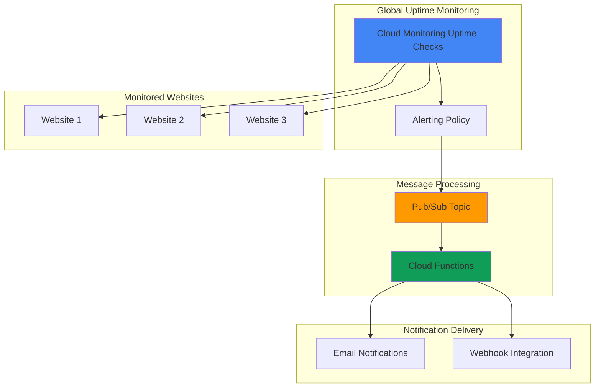

# Simple Website Uptime Monitoring with Cloud Monitoring and Pub/Sub

## Problem

Organizations rely on website availability for business operations, but manual monitoring doesn't scale across multiple websites or provide real-time incident response. Without automated uptime monitoring, downtime incidents may go undetected for extended periods, resulting in lost revenue, damaged customer trust, and missed SLA targets.

## Solution

Build an automated website uptime monitoring system using Cloud Monitoring's synthetic uptime checks, Pub/Sub for reliable alert delivery, and Cloud Functions for intelligent notification processing. This serverless architecture automatically detects website outages across multiple geographic regions and delivers customized email alerts with incident details and recovery actions.

## Architecture Diagram



## Prerequisites

1. Google Cloud project with billing enabled and Owner or Editor permissions
2. Google Cloud CLI installed and configured or access to Cloud Shell
3. Basic understanding of website monitoring concepts and HTTP status codes
4. Email address for receiving uptime notifications
5. Estimated cost: $2-5 per month for 5-10 websites with standard monitoring frequency

> **Note**: Cloud Monitoring provides a free tier that includes uptime checks and basic alerting. See [Cloud Monitoring pricing](https://cloud.google.com/monitoring/pricing) for current rates.

## Preparation

```bash
# Set environment variables for GCP resources
export PROJECT_ID="uptime-monitor-$(date +%s)"
export REGION="us-central1"
export ZONE="us-central1-a"

# Generate unique suffix for resource names
RANDOM_SUFFIX=$(openssl rand -hex 3)
export TOPIC_NAME="uptime-alerts-${RANDOM_SUFFIX}"
export FUNCTION_NAME="uptime-processor-${RANDOM_SUFFIX}"
export NOTIFICATION_EMAIL="your-email@example.com"

# Set default project and region
gcloud config set project ${PROJECT_ID}
gcloud config set compute/region ${REGION}
gcloud config set compute/zone ${ZONE}

# Enable required APIs
gcloud services enable monitoring.googleapis.com
gcloud services enable pubsub.googleapis.com
gcloud services enable cloudfunctions.googleapis.com
gcloud services enable cloudbuild.googleapis.com

echo "✅ Project configured: ${PROJECT_ID}"
echo "✅ Required APIs enabled"
```

## Steps

1. **Create Pub/Sub Topic for Alert Distribution**:

   Pub/Sub provides reliable, asynchronous message delivery for alert notifications with built-in retry logic and dead letter queues. Creating a dedicated topic for uptime alerts enables decoupled processing where multiple systems can subscribe to the same alert stream without affecting each other's processing capabilities.

   ```bash
   # Create Pub/Sub topic for uptime alerts
   gcloud pubsub topics create ${TOPIC_NAME}
   
   # Verify topic creation
   gcloud pubsub topics list --filter="name:${TOPIC_NAME}"
   
   echo "✅ Pub/Sub topic created: ${TOPIC_NAME}"
   ```

   The Pub/Sub topic now provides a reliable messaging backbone that can handle high-volume alert processing with automatic scaling and guaranteed message delivery.

2. **Create Cloud Function for Alert Processing**:

   Cloud Functions provides serverless event processing that automatically scales based on Pub/Sub messages. This function will parse monitoring alerts, enrich them with contextual information, and deliver customized notifications through multiple channels while maintaining cost efficiency through pay-per-invocation pricing.

   ```bash
   # Create function source directory
   mkdir -p uptime-function
   cd uptime-function
   
   # Create function source code
   cat > main.py << 'EOF'
import json
import base64
import os
from datetime import datetime
import functions_framework
from google.cloud import logging

# Initialize Cloud Logging client
logging_client = logging.Client()
logging_client.setup_logging()

@functions_framework.cloud_event
def process_uptime_alert(cloud_event):
    """Process uptime monitoring alerts from Pub/Sub."""
    
    try:
        # Parse the Pub/Sub message
        message_data = cloud_event.data.get("message", {})
        
        # Decode base64 message data
        if "data" in message_data:
            decoded_data = base64.b64decode(message_data["data"]).decode("utf-8")
            alert_data = json.loads(decoded_data)
        else:
            alert_data = {}
        
        # Extract alert information from Cloud Monitoring format
        incident = alert_data.get("incident", {})
        policy_name = incident.get("policy_name", 
                     alert_data.get("policy", {}).get("displayName", "Unknown Policy"))
        condition_name = incident.get("condition_name", 
                        alert_data.get("condition", {}).get("displayName", "Unknown Condition"))
        state = incident.get("state", alert_data.get("state", "UNKNOWN"))
        started_at = incident.get("started_at", 
                    alert_data.get("startedAt", ""))
        url = incident.get("url", 
              alert_data.get("resource", {}).get("labels", {}).get("host", "Unknown URL"))
        
        # Format alert message
        timestamp = datetime.now().strftime("%Y-%m-%d %H:%M:%S UTC")
        
        if state == "OPEN" or state == "FIRING":
            subject = f"🚨 Website Down Alert: {url}"
            status_emoji = "🚨"
            status_text = "DOWN"
            action_text = "Please investigate immediately"
        else:
            subject = f"✅ Website Restored: {url}"
            status_emoji = "✅"
            status_text = "RESTORED"
            action_text = "Service has been restored"
        
        # Create detailed message body
        message_body = f"""
Website Uptime Alert

{status_emoji} Status: {status_text}
🌐 Website: {url}
📋 Policy: {policy_name}
🔍 Condition: {condition_name}
⏰ Alert Time: {timestamp}
🕐 Started At: {started_at}

{action_text}

This alert was generated by Google Cloud Monitoring.
        """
        
        # Log alert details for debugging
        print(f"Processing alert for {url}: {state}")
        print(f"Subject: {subject}")
        print(f"Message body: {message_body}")
        
        # In production, integrate with your notification system here
        # Examples: send_email(), send_slack_message(), call_pagerduty()
        
        return {"status": "processed", "url": url, "state": state}
        
    except Exception as e:
        print(f"Error processing alert: {str(e)}")
        print(f"Raw cloud event data: {cloud_event.data}")
        return {"status": "error", "error": str(e)}
EOF
   
   # Create requirements file
   cat > requirements.txt << 'EOF'
functions-framework==3.*
google-cloud-logging>=3.8.0
EOF
   
   # Return to parent directory
   cd ..
   
   echo "✅ Cloud Function source code created"
   ```

   The function source code includes comprehensive alert parsing, message formatting, and logging capabilities that can be extended with additional notification channels like Slack, PagerDuty, or custom webhooks.

3. **Deploy Cloud Function with Pub/Sub Trigger**:

   Deploying the Cloud Function with a Pub/Sub trigger creates an event-driven architecture that automatically processes monitoring alerts with built-in scaling and error handling. The function will receive structured alert data and can enrich it with additional context before delivering notifications.

   ```bash
   # Deploy Cloud Function with Pub/Sub trigger
   gcloud functions deploy ${FUNCTION_NAME} \
       --gen2 \
       --runtime python312 \
       --trigger-topic ${TOPIC_NAME} \
       --source uptime-function/ \
       --entry-point process_uptime_alert \
       --memory 256Mi \
       --timeout 60s \
       --max-instances 10 \
       --region ${REGION}
   
   # Verify function deployment
   gcloud functions describe ${FUNCTION_NAME} \
       --region ${REGION} \
       --format="value(state)"
   
   echo "✅ Cloud Function deployed with Pub/Sub trigger"
   ```

   The Cloud Function now automatically processes Pub/Sub messages with built-in scaling and error handling, providing reliable alert processing while maintaining cost efficiency through serverless pricing.

4. **Create Notification Channel for Pub/Sub**:

   Cloud Monitoring notification channels define how alerts are delivered to external systems. Creating a Pub/Sub notification channel enables reliable, programmatic alert processing while maintaining separation between monitoring and notification logic for better system maintainability.

   ```bash
   # Create Pub/Sub notification channel
   cat > notification-channel.json << EOF
{
  "type": "pubsub",
  "displayName": "Uptime Alerts Pub/Sub Channel",
  "description": "Delivers uptime monitoring alerts to Pub/Sub topic",
  "labels": {
    "topic": "projects/${PROJECT_ID}/topics/${TOPIC_NAME}"
  }
}
EOF
   
   # Create the notification channel
   CHANNEL_ID=$(gcloud alpha monitoring channels create \
       --channel-content-from-file=notification-channel.json \
       --format="value(name)")
   
   echo "✅ Notification channel created: ${CHANNEL_ID}"
   echo "Channel ID stored in variable: CHANNEL_ID"
   ```

   The notification channel now provides a reliable connection between Cloud Monitoring alerts and your Pub/Sub topic, enabling automated alert processing with guaranteed message delivery.

5. **Create Uptime Checks for Multiple Websites**:

   Cloud Monitoring uptime checks perform synthetic monitoring from multiple global locations, providing comprehensive availability monitoring with configurable success criteria. Creating checks for multiple websites establishes baseline monitoring that can detect regional outages and performance degradations.

   ```bash
   # Define websites to monitor
   WEBSITES=(
       "https://www.google.com"
       "https://www.github.com"
       "https://www.stackoverflow.com"
   )
   
   # Create uptime checks for each website
   for WEBSITE in "${WEBSITES[@]}"; do
       # Extract hostname for display name
       HOSTNAME=$(echo $WEBSITE | sed 's|https\?://||' | sed 's|/.*||')
       CHECK_NAME="uptime-check-${HOSTNAME}-${RANDOM_SUFFIX}"
       
       # Create the uptime check using gcloud command
       gcloud monitoring uptime create ${CHECK_NAME} \
           --resource-type=uptime-url \
           --resource-labels="host=${HOSTNAME},project_id=${PROJECT_ID}" \
           --protocol=https \
           --port=443 \
           --path=/ \
           --request-method=get \
           --validate-ssl=true \
           --status-codes=200 \
           --period=60 \
           --timeout=10 \
           --checker-regions=us-central1,europe-west1,asia-east1
       
       echo "✅ Uptime check created for: ${WEBSITE}"
   done
   
   # List all uptime checks
   gcloud monitoring uptime list \
       --filter="displayName:uptime-check-*"
   ```

   The uptime checks now monitor your websites from multiple global regions every 60 seconds, providing comprehensive availability monitoring with automatic failure detection across different geographic locations.

6. **Create Alerting Policy for Uptime Failures**:

   Alerting policies define when and how to trigger notifications based on monitoring data. Creating a comprehensive uptime alerting policy ensures rapid incident detection with appropriate notification thresholds while avoiding false positives from transient network issues.

   ```bash
   # Create alerting policy for uptime failures
   cat > alerting-policy.json << EOF
{
  "displayName": "Website Uptime Alert Policy",
  "documentation": {
    "content": "Alert when websites fail uptime checks from multiple regions",
    "mimeType": "text/markdown"
  },
  "conditions": [
    {
      "displayName": "Uptime check failures",
      "conditionThreshold": {
        "filter": "resource.type=\"uptime_url\"",
        "comparison": "COMPARISON_GREATER_THAN",
        "thresholdValue": 1,
        "duration": "60s",
        "aggregations": [
          {
            "alignmentPeriod": "60s",
            "perSeriesAligner": "ALIGN_NEXT_OLDER",
            "crossSeriesReducer": "REDUCE_COUNT_FALSE",
            "groupByFields": [
              "resource.label.host"
            ]
          }
        ],
        "trigger": {
          "count": 1
        }
      }
    }
  ],
  "alertStrategy": {
    "autoClose": "1800s"
  },
  "combiner": "OR",
  "enabled": true,
  "notificationChannels": [
    "${CHANNEL_ID}"
  ]
}
EOF
   
   # Create the alerting policy
   POLICY_ID=$(gcloud alpha monitoring policies create \
       --policy-from-file=alerting-policy.json \
       --format="value(name)")
   
   echo "✅ Alerting policy created: ${POLICY_ID}"
   echo "Policy will trigger when uptime checks fail from multiple regions"
   ```

   The alerting policy now monitors all uptime checks and triggers notifications when websites become unavailable, with automatic alert resolution when services recover.

## Validation & Testing

1. **Verify uptime checks are running**:

   ```bash
   # Check uptime check status
   gcloud monitoring uptime list \
       --format="table(displayName,httpCheck.path,period)"
   
   # View recent uptime check results via Cloud Logging
   gcloud logging read "resource.type=uptime_url" \
       --limit=10 \
       --format="table(timestamp,jsonPayload.status,jsonPayload.target_url)"
   ```

   Expected output: List of active uptime checks with status information and recent check results showing successful responses from monitored websites.

2. **Test alert processing function**:

   ```bash
   # Send test message to Pub/Sub topic
   cat > test-alert.json << 'EOF'
{
  "incident": {
    "policy_name": "Test Website Uptime Policy",
    "condition_name": "Website availability check",
    "state": "OPEN",
    "started_at": "2025-07-23T10:00:00Z",
    "url": "https://test-website.example.com"
  }
}
EOF
   
   # Publish test message
   gcloud pubsub topics publish ${TOPIC_NAME} \
       --message="$(cat test-alert.json)"
   
   # Check function execution logs
   gcloud functions logs read ${FUNCTION_NAME} \
       --region ${REGION} \
       --limit=5
   ```

   Expected output: Function logs showing successful message processing with formatted alert details and status information.

3. **Verify notification channel configuration**:

   ```bash
   # List notification channels
   gcloud alpha monitoring channels list \
       --filter="type=pubsub" \
       --format="table(displayName,type,labels.topic)"
   
   # Check alerting policy status
   gcloud alpha monitoring policies list \
       --filter="displayName:Website*" \
       --format="table(displayName,enabled,conditions[0].displayName)"
   ```

   Expected output: Active notification channels and alerting policies with proper configuration and enabled status.

## Cleanup

1. **Delete alerting policy and notification channels**:

   ```bash
   # Delete alerting policy
   gcloud alpha monitoring policies delete ${POLICY_ID} --quiet
   
   # Delete notification channel
   gcloud alpha monitoring channels delete ${CHANNEL_ID} --quiet
   
   echo "✅ Deleted alerting policy and notification channel"
   ```

2. **Remove uptime checks**:

   ```bash
   # List and delete all uptime checks
   for CHECK_ID in $(gcloud monitoring uptime list \
       --filter="displayName:uptime-check-*" \
       --format="value(name)"); do
       gcloud monitoring uptime delete ${CHECK_ID} --quiet
   done
   
   echo "✅ Deleted all uptime checks"
   ```

3. **Delete Cloud Function and Pub/Sub resources**:

   ```bash
   # Delete Cloud Function
   gcloud functions delete ${FUNCTION_NAME} \
       --region=${REGION} \
       --quiet
   
   # Delete Pub/Sub topic
   gcloud pubsub topics delete ${TOPIC_NAME} --quiet
   
   # Remove local files
   rm -rf uptime-function/
   rm -f *.json
   
   echo "✅ Deleted Cloud Function and Pub/Sub resources"
   ```

4. **Clean up environment variables**:

   ```bash
   # Unset environment variables
   unset PROJECT_ID REGION ZONE RANDOM_SUFFIX
   unset TOPIC_NAME FUNCTION_NAME NOTIFICATION_EMAIL
   unset CHANNEL_ID POLICY_ID
   
   echo "✅ Environment variables cleaned up"
   ```

## Discussion

This uptime monitoring solution leverages Google Cloud's global infrastructure to provide comprehensive website availability monitoring with intelligent alert processing. Cloud Monitoring's synthetic uptime checks run from multiple regions worldwide, ensuring that local network issues don't trigger false positives while providing accurate detection of actual service outages. The integration with Pub/Sub creates a reliable, scalable messaging backbone that can handle high-volume alert processing with guaranteed delivery and automatic retry capabilities.

The serverless architecture using Cloud Functions provides cost-effective alert processing that scales automatically based on incident volume. This design pattern separates monitoring logic from notification logic, enabling you to modify alert formatting, add new notification channels, or integrate with external systems without affecting the core monitoring infrastructure. The function can be easily extended to integrate with popular incident management tools like PagerDuty, Slack, or Microsoft Teams, creating a comprehensive alerting ecosystem.

Cloud Monitoring's uptime checks provide several advantages over traditional monitoring approaches, including built-in geographic distribution, SSL certificate monitoring, and integration with Google Cloud's observability stack. The service automatically handles probe distribution, data aggregation, and historical trending, while providing detailed metrics about response times, availability percentages, and failure patterns that can inform capacity planning and SLA reporting. For more detailed guidance, see the [Cloud Monitoring documentation](https://cloud.google.com/monitoring/docs) and [Google Cloud Architecture Framework](https://cloud.google.com/architecture).

> **Tip**: Configure multiple notification channels for redundancy and use Cloud Monitoring's incident management features to track alert resolution times and identify recurring issues that may require infrastructure improvements.

## Challenge

Extend this solution by implementing these enhancements:

1. **Multi-channel notifications**: Add Slack and email integrations to the Cloud Function, with different notification channels for different severity levels and escalation workflows.

2. **Advanced health checks**: Implement custom HTTP checks that verify specific application functionality, database connectivity, and API response validation beyond simple availability monitoring.

3. **Geographic alerting intelligence**: Enhance the alerting logic to only trigger notifications when failures occur across multiple regions, reducing false positives from regional network issues.

4. **Performance monitoring dashboard**: Create Cloud Monitoring dashboards that display uptime trends, response time percentiles, and availability SLA metrics with custom visualization and automated reporting.

5. **Automated incident response**: Integrate with Cloud Workflows to automatically execute remediation actions like restarting services, scaling resources, or triggering failover procedures when specific failure patterns are detected.

## Infrastructure Code

### Available Infrastructure as Code:

- [Infrastructure Code Overview](code/README.md) - Detailed description of all infrastructure components
- [Infrastructure Manager](code/infrastructure-manager/) - GCP Infrastructure Manager templates
- [Bash CLI Scripts](code/scripts/) - Example bash scripts using gcloud CLI commands to deploy infrastructure
- [Terraform](code/terraform/) - Terraform configuration files