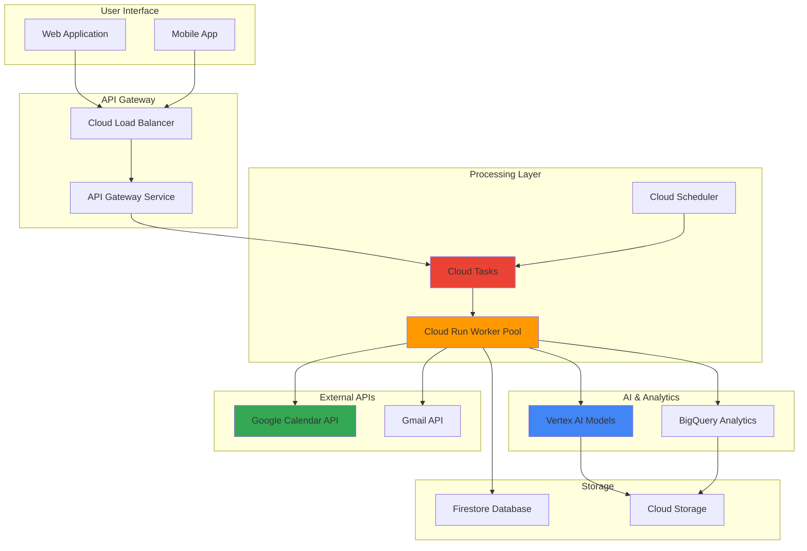

# Smart Calendar Intelligence with Cloud Calendar API and Cloud Run Worker Pools

## Problem

Organizations struggle with inefficient meeting scheduling patterns, double bookings, and suboptimal calendar management that reduces productivity and creates scheduling conflicts. Traditional calendar systems lack intelligence to automatically analyze meeting patterns, suggest optimal time slots based on participant availability, or provide actionable insights about time allocation and productivity trends.

## Solution

Build an intelligent calendar management system using Google Calendar API for calendar data access, Cloud Run Worker Pools for background AI processing, Vertex AI for pattern analysis and optimization recommendations, and Cloud Tasks for reliable job scheduling. This solution automatically analyzes meeting patterns, provides scheduling optimization suggestions, and delivers productivity insights through AI-powered calendar intelligence.

## Architecture Diagram



## Prerequisites

1. Google Cloud Platform account with billing enabled and appropriate permissions for Calendar API, Cloud Run, Vertex AI, and Cloud Tasks
2. Google Cloud CLI installed and configured or access to Cloud Shell
3. Basic understanding of REST APIs, serverless computing, and machine learning concepts
4. Google Workspace account for Calendar API testing and development
5. Estimated cost: $15-25 USD for resources created during this recipe (primarily Vertex AI model usage and BigQuery storage)

> **Note**: Ensure you have domain-wide delegation configured for accessing Google Calendar API across your organization if building an enterprise solution.

## Preparation

```bash
# Set environment variables for GCP resources
export PROJECT_ID="calendar-ai-$(date +%s)"
export REGION="us-central1"
export ZONE="us-central1-a"

# Generate unique suffix for resource names
RANDOM_SUFFIX=$(openssl rand -hex 3)

# Set calendar intelligence specific variables
export WORKER_POOL_NAME="calendar-intelligence-${RANDOM_SUFFIX}"
export TASK_QUEUE_NAME="calendar-tasks-${RANDOM_SUFFIX}"
export DATASET_NAME="calendar_analytics_${RANDOM_SUFFIX}"
export BUCKET_NAME="calendar-intelligence-${PROJECT_ID}"

# Set default project and region
gcloud config set project ${PROJECT_ID}
gcloud config set compute/region ${REGION}
gcloud config set compute/zone ${ZONE}

# Enable required APIs
gcloud services enable calendar-json.googleapis.com
gcloud services enable run.googleapis.com
gcloud services enable cloudtasks.googleapis.com
gcloud services enable aiplatform.googleapis.com
gcloud services enable bigquery.googleapis.com
gcloud services enable storage.googleapis.com
gcloud services enable artifactregistry.googleapis.com
gcloud services enable cloudbuild.googleapis.com

echo "✅ Project configured: ${PROJECT_ID}"
echo "✅ Calendar intelligence environment prepared"

# Create Cloud Storage bucket for model artifacts and data
gsutil mb -p ${PROJECT_ID} \
    -c STANDARD \
    -l ${REGION} \
    gs://${BUCKET_NAME}

# Enable versioning for data protection
gsutil versioning set on gs://${BUCKET_NAME}

# Create BigQuery dataset for analytics
bq mk --dataset \
    --location=${REGION} \
    --description="Calendar intelligence analytics dataset" \
    ${PROJECT_ID}:${DATASET_NAME}

echo "✅ Storage and analytics foundations created"
```

## Steps

1. **Create Artifact Registry Repository and Build Container**:

   Artifact Registry provides secure, private container image storage with vulnerability scanning and access controls. Creating a dedicated repository for our calendar intelligence application ensures reliable, secure container deployment across Cloud Run services with integrated CI/CD capabilities.

   ```bash
   # Create Artifact Registry repository
   gcloud artifacts repositories create calendar-intelligence \
       --repository-format=docker \
       --location=${REGION} \
       --description="Calendar intelligence container repository"
   
   # Configure Docker authentication
   gcloud auth configure-docker ${REGION}-docker.pkg.dev
   
   # Create application directory structure
   mkdir -p calendar-intelligence/{src,tests,config}
   cd calendar-intelligence
   
   echo "✅ Container registry and project structure created"
   ```

   The Artifact Registry repository now provides secure container storage with built-in vulnerability scanning, enabling reliable deployment of our calendar intelligence services across Google Cloud's serverless platform.

2. **Implement Calendar Intelligence Worker Application**:

   Cloud Run Worker Pools excel at processing background tasks without HTTP endpoints, making them ideal for calendar analysis workloads. The worker application leverages Google Calendar API for data retrieval, Vertex AI for pattern analysis, and implements sophisticated algorithms for meeting optimization and productivity insights.

   ```bash
   # Create Python application for calendar intelligence
   cat > src/calendar_worker.py << 'EOF'
   import os
   import json
   import logging
   from datetime import datetime, timedelta
   from google.cloud import tasks_v2
   from google.cloud import aiplatform
   from google.cloud import bigquery
   from google.oauth2 import service_account
   from googleapiclient.discovery import build
   import vertexai
   from vertexai.generative_models import GenerativeModel
   
   class CalendarIntelligenceWorker:
       def __init__(self):
           self.project_id = os.environ['GOOGLE_CLOUD_PROJECT']
           self.region = os.environ['GOOGLE_CLOUD_REGION']
           self.setup_clients()
       
       def setup_clients(self):
           """Initialize Google Cloud and Calendar API clients"""
           self.tasks_client = tasks_v2.CloudTasksClient()
           self.bq_client = bigquery.Client(project=self.project_id)
           
           # Initialize Vertex AI
           vertexai.init(project=self.project_id, location=self.region)
           self.ai_model = GenerativeModel("gemini-2.5-flash")
           
           # Calendar API setup (requires service account with domain delegation)
           credentials = service_account.Credentials.from_service_account_file(
               '/app/service-account.json',
               scopes=['https://www.googleapis.com/auth/calendar.readonly']
           )
           self.calendar_service = build('calendar', 'v3', credentials=credentials)
       
       def analyze_calendar_patterns(self, calendar_id, days_back=30):
           """Analyze calendar patterns using AI"""
           try:
               # Fetch calendar events
               now = datetime.utcnow()
               time_min = (now - timedelta(days=days_back)).isoformat() + 'Z'
               time_max = now.isoformat() + 'Z'
               
               events_result = self.calendar_service.events().list(
                   calendarId=calendar_id,
                   timeMin=time_min,
                   timeMax=time_max,
                   maxResults=1000,
                   singleEvents=True,
                   orderBy='startTime'
               ).execute()
               
               events = events_result.get('items', [])
               
               # Analyze patterns with Vertex AI
               pattern_analysis = self.ai_analyze_patterns(events)
               
               # Store results in BigQuery
               self.store_analysis_results(calendar_id, pattern_analysis)
               
               return pattern_analysis
           
           except Exception as e:
               logging.error(f"Calendar analysis error: {str(e)}")
               raise
       
       def ai_analyze_patterns(self, events):
           """Use Vertex AI to analyze meeting patterns"""
           # Prepare event data for analysis
           event_summary = []
           for event in events:
               event_data = {
                   'summary': event.get('summary', 'No title'),
                   'duration': self.calculate_duration(event),
                   'attendees': len(event.get('attendees', [])),
                   'hour': datetime.fromisoformat(
                       event['start'].get('dateTime', event['start'].get('date'))
                       .replace('Z', '+00:00')
                   ).hour
               }
               event_summary.append(event_data)
           
           # AI analysis prompt
           prompt = f"""
           Analyze the following calendar data and provide insights:
           {json.dumps(event_summary, indent=2)}
           
           Please provide:
           1. Meeting frequency patterns
           2. Optimal meeting times based on patterns
           3. Productivity recommendations
           4. Time allocation insights
           5. Scheduling optimization suggestions
           
           Format as JSON with specific recommendations.
           """
           
           response = self.ai_model.generate_content(prompt)
           return response.text
       
       def calculate_duration(self, event):
           """Calculate event duration in minutes"""
           start = event['start'].get('dateTime', event['start'].get('date'))
           end = event['end'].get('dateTime', event['end'].get('date'))
           
           if 'T' in start:  # dateTime format
               start_dt = datetime.fromisoformat(start.replace('Z', '+00:00'))
               end_dt = datetime.fromisoformat(end.replace('Z', '+00:00'))
               return int((end_dt - start_dt).total_seconds() / 60)
           return 0  # All-day events
       
       def store_analysis_results(self, calendar_id, analysis):
           """Store analysis results in BigQuery"""
           table_id = f"{self.project_id}.{os.environ['DATASET_NAME']}.calendar_insights"
           
           rows_to_insert = [{
               'calendar_id': calendar_id,
               'analysis_timestamp': datetime.utcnow().isoformat(),
               'insights': analysis,
               'processed_date': datetime.utcnow().date().isoformat()
           }]
           
           errors = self.bq_client.insert_rows_json(table_id, rows_to_insert)
           if errors:
               logging.error(f"BigQuery insert errors: {errors}")
           else:
               logging.info("Analysis results stored successfully")
   
   def main():
       """Main worker function"""
       worker = CalendarIntelligenceWorker()
       
       # Process calendar intelligence tasks
       # In production, this would receive calendar IDs from Cloud Tasks
       calendar_id = os.environ.get('CALENDAR_ID', 'primary')
       
       logging.info(f"Starting calendar analysis for: {calendar_id}")
       results = worker.analyze_calendar_patterns(calendar_id)
       logging.info("Calendar intelligence processing completed")
   
   if __name__ == "__main__":
       logging.basicConfig(level=logging.INFO)
       main()
   EOF
   
   # Create requirements file with updated versions
   cat > requirements.txt << 'EOF'
   google-cloud-tasks==2.16.4
   google-cloud-aiplatform==1.60.0
   google-cloud-bigquery==3.25.0
   google-api-python-client==2.147.0
   google-auth==2.34.0
   google-auth-oauthlib==1.2.1
   google-auth-httplib2==0.2.0
   google-cloud-storage==2.18.0
   EOF
   
   echo "✅ Calendar intelligence worker application created"
   ```

   The worker application now implements sophisticated calendar analysis using Vertex AI's latest Gemini 2.5 Flash model, providing intelligent insights about meeting patterns, optimal scheduling times, and productivity recommendations through advanced machine learning capabilities.

3. **Create Cloud Run Worker Pool Configuration**:

   Cloud Run Worker Pools provide serverless, scalable background processing specifically designed for non-HTTP workloads like calendar analysis. The worker pool configuration enables automatic scaling based on Cloud Tasks queue depth, ensuring responsive processing during peak analysis periods while maintaining cost efficiency.

   ```bash
   # Create Dockerfile for the worker application
   cat > Dockerfile << 'EOF'
   FROM python:3.11-slim
   
   WORKDIR /app
   
   # Install system dependencies
   RUN apt-get update && apt-get install -y \
       gcc \
       && rm -rf /var/lib/apt/lists/*
   
   # Copy requirements and install Python dependencies
   COPY requirements.txt .
   RUN pip install --no-cache-dir -r requirements.txt
   
   # Copy application code
   COPY src/ ./src/
   COPY config/ ./config/
   
   # Set environment variables
   ENV PYTHONPATH=/app
   ENV GOOGLE_CLOUD_REGION=us-central1
   
   # Run the worker application
   CMD ["python", "src/calendar_worker.py"]
   EOF
   
   # Build and push container image
   export IMAGE_URL="${REGION}-docker.pkg.dev/${PROJECT_ID}/calendar-intelligence/worker:latest"
   
   gcloud builds submit --tag ${IMAGE_URL} .
   
   echo "✅ Container image built and pushed to Artifact Registry"
   ```

   The containerized application is now ready for deployment to Cloud Run Worker Pools, providing a scalable, serverless foundation for calendar intelligence processing with automatic scaling and cost optimization.

4. **Deploy Cloud Run Worker Pool with Calendar Intelligence**:

   Deploying the worker pool establishes a serverless processing environment that automatically scales based on Cloud Tasks queue depth. The worker pool configuration includes specific resource allocations, environment variables, and service account permissions required for calendar analysis and AI processing workloads.

   ```bash
   # Create service account for worker pool
   gcloud iam service-accounts create calendar-intelligence-worker \
       --description="Service account for calendar intelligence worker pool" \
       --display-name="Calendar Intelligence Worker"
   
   # Grant necessary permissions
   gcloud projects add-iam-policy-binding ${PROJECT_ID} \
       --member="serviceAccount:calendar-intelligence-worker@${PROJECT_ID}.iam.gserviceaccount.com" \
       --role="roles/aiplatform.user"
   
   gcloud projects add-iam-policy-binding ${PROJECT_ID} \
       --member="serviceAccount:calendar-intelligence-worker@${PROJECT_ID}.iam.gserviceaccount.com" \
       --role="roles/bigquery.dataEditor"
   
   gcloud projects add-iam-policy-binding ${PROJECT_ID} \
       --member="serviceAccount:calendar-intelligence-worker@${PROJECT_ID}.iam.gserviceaccount.com" \
       --role="roles/storage.objectAdmin"
   
   # Deploy worker pool using correct syntax
   gcloud beta run worker-pools deploy ${WORKER_POOL_NAME} \
       --image=${IMAGE_URL} \
       --service-account=calendar-intelligence-worker@${PROJECT_ID}.iam.gserviceaccount.com \
       --memory=2Gi \
       --cpu=1 \
       --min-instances=0 \
       --max-instances=10 \
       --region=${REGION} \
       --set-env-vars="GOOGLE_CLOUD_PROJECT=${PROJECT_ID},GOOGLE_CLOUD_REGION=${REGION},DATASET_NAME=${DATASET_NAME}"
   
   echo "✅ Calendar intelligence worker pool deployed successfully"
   ```

   The worker pool is now operational with proper IAM permissions, resource allocations, and scaling configuration, ready to process calendar intelligence tasks with automatic scaling based on workload demand and cost-efficient resource management.

5. **Create Cloud Tasks Queue for Job Distribution**:

   Cloud Tasks provides reliable, asynchronous task distribution with built-in retry logic and rate limiting. Creating a dedicated queue for calendar intelligence jobs ensures ordered processing, handles task failures gracefully, and enables efficient distribution of calendar analysis workloads across worker pool instances.

   ```bash
   # Create Cloud Tasks queue
   gcloud tasks queues create ${TASK_QUEUE_NAME} \
       --location=${REGION} \
       --max-concurrent-dispatches=10 \
       --max-dispatches-per-second=5 \
       --max-retry-duration=3600s \
       --max-attempts=3
   
   # Create BigQuery tables for analytics
   cat > calendar_insights_schema.json << 'EOF'
   [
       {
           "name": "calendar_id",
           "type": "STRING",
           "mode": "REQUIRED"
       },
       {
           "name": "analysis_timestamp",
           "type": "TIMESTAMP",
           "mode": "REQUIRED"
       },
       {
           "name": "insights",
           "type": "STRING",
           "mode": "NULLABLE"
       },
       {
           "name": "processed_date",
           "type": "DATE",
           "mode": "REQUIRED"
       }
   ]
   EOF
   
   # Create BigQuery table
   bq mk --table \
       --schema=calendar_insights_schema.json \
       --description="Calendar intelligence insights storage" \
       ${PROJECT_ID}:${DATASET_NAME}.calendar_insights
   
   echo "✅ Cloud Tasks queue and BigQuery analytics table created"
   ```

   The task distribution infrastructure is now configured with appropriate retry policies, rate limiting, and analytics storage, enabling reliable processing of calendar intelligence workloads with comprehensive tracking and monitoring capabilities.

6. **Implement Calendar Analysis Trigger System**:

   Cloud Scheduler provides cron-based job scheduling that automatically triggers calendar analysis tasks. The trigger system creates Cloud Tasks for each calendar to be analyzed, enabling periodic intelligence updates, pattern analysis, and optimization recommendations on a configurable schedule.

   ```bash
   # Create API service for task creation
   mkdir -p api
   cat > api/task_creator.py << 'EOF'
   import os
   import json
   from flask import Flask, request, jsonify
   from google.cloud import tasks_v2
   from google.protobuf import timestamp_pb2
   
   app = Flask(__name__)
   
   class CalendarTaskCreator:
       def __init__(self):
           self.project_id = os.environ['GOOGLE_CLOUD_PROJECT']
           self.region = os.environ['GOOGLE_CLOUD_REGION']
           self.queue_name = os.environ['TASK_QUEUE_NAME']
           self.client = tasks_v2.CloudTasksClient()
           self.parent = self.client.queue_path(
               self.project_id, self.region, self.queue_name
           )
       
       def create_calendar_analysis_task(self, calendar_id, priority=0):
           """Create a calendar analysis task"""
           task = {
               'http_request': {
                   'http_method': tasks_v2.HttpMethod.POST,
                   'url': 'https://example.com/process-calendar',
                   'headers': {'Content-Type': 'application/json'},
                   'body': json.dumps({
                       'calendar_id': calendar_id,
                       'analysis_type': 'intelligence'
                   }).encode()
               }
           }
           
           response = self.client.create_task(
               request={"parent": self.parent, "task": task}
           )
           return response.name
   
   task_creator = CalendarTaskCreator()
   
   @app.route('/trigger-analysis', methods=['POST'])
   def trigger_calendar_analysis():
       """API endpoint to trigger calendar analysis"""
       data = request.get_json()
       calendar_ids = data.get('calendar_ids', ['primary'])
       
       created_tasks = []
       for calendar_id in calendar_ids:
           task_name = task_creator.create_calendar_analysis_task(calendar_id)
           created_tasks.append({
               'calendar_id': calendar_id,
               'task_name': task_name
           })
       
       return jsonify({
           'status': 'success',
           'created_tasks': created_tasks
       })
   
   @app.route('/health', methods=['GET'])
   def health_check():
       return jsonify({'status': 'healthy'})
   
   if __name__ == '__main__':
       app.run(host='0.0.0.0', port=int(os.environ.get('PORT', 8080)))
   EOF
   
   # Create API requirements
   cat > api/requirements.txt << 'EOF'
   Flask==3.0.3
   google-cloud-tasks==2.16.4
   gunicorn==23.0.0
   EOF
   
   # Create API Dockerfile
   cat > api/Dockerfile << 'EOF'
   FROM python:3.11-slim
   
   WORKDIR /app
   
   COPY requirements.txt .
   RUN pip install --no-cache-dir -r requirements.txt
   
   COPY task_creator.py .
   
   ENV PORT=8080
   CMD exec gunicorn --bind :$PORT --workers 1 --threads 8 task_creator:app
   EOF
   
   echo "✅ Calendar analysis trigger system implemented"
   ```

   The trigger system now provides a REST API for initiating calendar analysis tasks, enabling both scheduled and on-demand processing of calendar intelligence workloads with proper task distribution and queue management.

7. **Deploy API Service and Configure Scheduled Analysis**:

   Cloud Run services provide HTTP endpoints with automatic scaling and integrated load balancing. Deploying the API service enables external systems to trigger calendar analysis while Cloud Scheduler ensures regular, automated processing of calendar intelligence tasks for continuous insights and optimization.

   ```bash
   # Build and deploy API service
   cd api
   export API_IMAGE_URL="${REGION}-docker.pkg.dev/${PROJECT_ID}/calendar-intelligence/api:latest"
   
   gcloud builds submit --tag ${API_IMAGE_URL} .
   
   # Deploy Cloud Run service
   gcloud run deploy calendar-intelligence-api \
       --image=${API_IMAGE_URL} \
       --platform=managed \
       --region=${REGION} \
       --allow-unauthenticated \
       --memory=1Gi \
       --cpu=1 \
       --min-instances=0 \
       --max-instances=5 \
       --set-env-vars="GOOGLE_CLOUD_PROJECT=${PROJECT_ID},GOOGLE_CLOUD_REGION=${REGION},TASK_QUEUE_NAME=${TASK_QUEUE_NAME}"
   
   # Get service URL
   export API_URL=$(gcloud run services describe calendar-intelligence-api \
       --region=${REGION} \
       --format="value(status.url)")
   
   # Create scheduled job for daily analysis
   gcloud scheduler jobs create http calendar-daily-analysis \
       --location=${REGION} \
       --schedule="0 9 * * *" \
       --uri="${API_URL}/trigger-analysis" \
       --http-method=POST \
       --headers="Content-Type=application/json" \
       --message-body='{"calendar_ids": ["primary"]}'
   
   cd ..
   echo "✅ API service deployed and daily analysis scheduled"
   echo "API URL: ${API_URL}"
   ```

   The complete calendar intelligence system is now operational with automatic daily analysis scheduling, providing continuous insights and optimization recommendations through Cloud Scheduler and Cloud Run's serverless architecture.

8. **Configure Vertex AI Model for Advanced Analytics**:

   Vertex AI provides access to Google's latest generative AI models for advanced calendar analytics. Configuring specialized models enables sophisticated pattern recognition, meeting optimization algorithms, and predictive scheduling recommendations based on historical calendar data and user behavior patterns.

   ```bash
   # Create Vertex AI model configuration
   cat > vertex_ai_config.py << 'EOF'
   import vertexai
   from vertexai.generative_models import GenerativeModel, Part
   import json
   
   def setup_calendar_intelligence_model(project_id, region):
       """Configure Vertex AI for calendar intelligence"""
       vertexai.init(project=project_id, location=region)
       
       # Initialize the Gemini model with specific instructions
       model = GenerativeModel(
           "gemini-2.5-flash",
           system_instruction="""
           You are a calendar intelligence assistant specialized in:
           1. Analyzing meeting patterns and productivity trends
           2. Identifying optimal scheduling opportunities
           3. Providing actionable productivity recommendations
           4. Detecting schedule conflicts and inefficiencies
           5. Suggesting meeting consolidation opportunities
           
           Always provide structured JSON responses with specific, actionable insights.
           """
       )
       
       return model
   
   def create_analysis_prompt(calendar_data):
       """Create structured prompt for calendar analysis"""
       prompt = f"""
       Analyze this calendar data and provide detailed insights:
       
       Calendar Data:
       {json.dumps(calendar_data, indent=2)}
       
       Please provide a JSON response with:
       {{
           "meeting_frequency_analysis": {{
               "total_meetings": number,
               "average_daily_meetings": number,
               "peak_meeting_hours": [hours],
               "meeting_duration_distribution": {{}}
           }},
           "productivity_insights": {{
               "focus_time_availability": "analysis",
               "meeting_overload_risk": "assessment",
               "optimal_scheduling_windows": [time_slots]
           }},
           "optimization_recommendations": [
               "specific recommendation 1",
               "specific recommendation 2"
           ],
           "scheduling_conflicts": [
               {{
                   "type": "conflict_type",
                   "description": "conflict_description",
                   "suggested_resolution": "resolution_approach"
               }}
           ]
       }}
       """
       return prompt
   EOF
   
   # Create model training dataset template
   gsutil cp vertex_ai_config.py gs://${BUCKET_NAME}/config/
   
   echo "✅ Vertex AI model configuration created for advanced analytics"
   ```

   The Vertex AI configuration now provides specialized calendar intelligence capabilities with structured analysis prompts, enabling sophisticated pattern recognition and actionable productivity recommendations through Google's latest Gemini 2.5 Flash model.

## Validation & Testing

1. **Verify Cloud Run Worker Pool Deployment**:

   ```bash
   # Check worker pool status
   gcloud beta run worker-pools describe ${WORKER_POOL_NAME} \
       --region=${REGION} \
       --format="table(metadata.name,status.conditions[0].type,status.conditions[0].status)"
   ```

   Expected output: Worker pool should show "Ready" status with "True" condition, indicating successful deployment and readiness to process calendar intelligence tasks.

2. **Test Calendar Analysis API Endpoint**:

   ```bash
   # Test API health endpoint
   curl -X GET "${API_URL}/health"
   
   # Trigger test calendar analysis
   curl -X POST "${API_URL}/trigger-analysis" \
       -H "Content-Type: application/json" \
       -d '{"calendar_ids": ["primary"]}'
   ```

   Expected output: Health check should return `{"status": "healthy"}` and analysis trigger should return task creation confirmation with unique task names.

3. **Verify Cloud Tasks Queue Processing**:

   ```bash
   # Check task queue status
   gcloud tasks queues describe ${TASK_QUEUE_NAME} \
       --location=${REGION} \
       --format="table(name,state,rateLimits.maxConcurrentDispatches)"
   
   # List recent tasks
   gcloud tasks list --queue=${TASK_QUEUE_NAME} \
       --location=${REGION} \
       --limit=5
   ```

   Expected output: Queue should show "RUNNING" state with configured rate limits, and recent tasks should display processing status and timestamps.

4. **Validate BigQuery Analytics Data**:

   ```bash
   # Query calendar insights data
   bq query --use_legacy_sql=false \
       "SELECT 
           calendar_id,
           analysis_timestamp,
           processed_date,
           SUBSTR(insights, 1, 100) as insights_preview
       FROM \`${PROJECT_ID}.${DATASET_NAME}.calendar_insights\`
       ORDER BY analysis_timestamp DESC
       LIMIT 5"
   ```

   Expected output: Query should return recent calendar analysis results with timestamps, calendar IDs, and preview of AI-generated insights stored in BigQuery.

## Cleanup

1. **Remove Cloud Run Services and Worker Pools**:

   ```bash
   # Delete worker pool
   gcloud beta run worker-pools delete ${WORKER_POOL_NAME} \
       --region=${REGION} \
       --quiet
   
   # Delete API service
   gcloud run services delete calendar-intelligence-api \
       --region=${REGION} \
       --quiet
   
   echo "✅ Cloud Run services and worker pools deleted"
   ```

2. **Remove Cloud Tasks and Scheduler Jobs**:

   ```bash
   # Delete scheduled job
   gcloud scheduler jobs delete calendar-daily-analysis \
       --location=${REGION} \
       --quiet
   
   # Delete task queue
   gcloud tasks queues delete ${TASK_QUEUE_NAME} \
       --location=${REGION} \
       --quiet
   
   echo "✅ Cloud Tasks queue and scheduler jobs removed"
   ```

3. **Clean Up Storage and Analytics Resources**:

   ```bash
   # Delete BigQuery dataset
   bq rm -r -f ${PROJECT_ID}:${DATASET_NAME}
   
   # Remove Cloud Storage bucket and contents
   gsutil -m rm -r gs://${BUCKET_NAME}
   
   # Delete Artifact Registry repository
   gcloud artifacts repositories delete calendar-intelligence \
       --location=${REGION} \
       --quiet
   
   echo "✅ Storage and analytics resources cleaned up"
   ```

4. **Remove IAM Service Accounts and Project**:

   ```bash
   # Delete service account
   gcloud iam service-accounts delete \
       calendar-intelligence-worker@${PROJECT_ID}.iam.gserviceaccount.com \
       --quiet
   
   # Delete project (if created specifically for this recipe)
   gcloud projects delete ${PROJECT_ID} --quiet
   
   echo "✅ IAM resources and project deleted"
   echo "Note: Project deletion may take several minutes to complete"
   ```

## Discussion

This calendar intelligence solution demonstrates the power of combining Google Cloud's serverless computing platform with advanced AI capabilities to solve real-world productivity challenges. Cloud Run Worker Pools provide the ideal serverless foundation for background processing tasks like calendar analysis, offering automatic scaling without the complexity of managing HTTP endpoints or ingress configurations. The worker pool architecture automatically scales based on Cloud Tasks queue depth, ensuring responsive processing during peak analysis periods while maintaining cost efficiency through pay-per-use pricing.

The integration of Vertex AI's latest Gemini 2.5 Flash model enables sophisticated pattern recognition and natural language generation for actionable productivity insights. With improved pricing at $0.30 per million input tokens and $2.50 per million output tokens, this solution provides cost-effective AI analysis that scales with usage. By analyzing meeting frequency, duration patterns, and scheduling conflicts, the system provides intelligent recommendations that go beyond simple calendar management to deliver strategic productivity optimization.

The architectural pattern of combining Cloud Tasks for reliable job distribution with Cloud Scheduler for automated triggers creates a robust, enterprise-ready system that handles task failures gracefully and ensures consistent processing. This approach is particularly valuable for organizations managing multiple calendars across teams, where coordinated analysis and optimization can deliver significant productivity improvements. The system's ability to process calendar data asynchronously while maintaining strong consistency guarantees makes it suitable for both real-time insights and batch analytics workloads.

The use of BigQuery for analytics storage creates a foundation for long-term trend analysis and organizational productivity metrics, enabling data-driven decisions about meeting culture and time allocation strategies. Combined with Cloud Run's automatic scaling and built-in monitoring, this architecture provides a production-ready solution that can handle enterprise-scale calendar analysis workloads.

> **Tip**: Monitor Cloud Run Worker Pool metrics through Cloud Monitoring to optimize instance allocation and identify processing bottlenecks. The combination of custom metrics and Vertex AI model performance data provides valuable insights for system optimization.

**References:**
- [Cloud Run Worker Pools Documentation](https://cloud.google.com/run/docs/deploy-worker-pools)
- [Google Calendar API Best Practices](https://developers.google.com/workspace/calendar/api/guides/best-practices)
- [Vertex AI Generative AI Pricing](https://cloud.google.com/vertex-ai/generative-ai/pricing)
- [Cloud Tasks Queue Management](https://cloud.google.com/tasks/docs/creating-queues)
- [BigQuery Analytics Patterns](https://cloud.google.com/bigquery/docs/best-practices-performance-patterns)

## Challenge

Extend this calendar intelligence solution by implementing these enhancements:

1. **Multi-Calendar Coordination**: Implement cross-calendar optimization that suggests optimal meeting times considering multiple participants' calendars, integrating with Google Workspace directory APIs for organizational scheduling intelligence.

2. **Predictive Scheduling Analytics**: Develop machine learning models using Vertex AI AutoML to predict optimal meeting outcomes based on factors like time of day, participant combinations, and meeting duration, training on historical calendar and productivity data.

3. **Smart Meeting Room Integration**: Connect with Google Workspace room booking APIs and IoT sensors to optimize physical meeting space allocation, implementing location intelligence that considers room capacity, equipment requirements, and participant proximity.

4. **Real-time Conflict Resolution**: Build a notification system using Cloud Pub/Sub and Firebase Cloud Messaging that provides real-time scheduling conflict alerts with AI-powered resolution suggestions, integrating with Google Chat and Gmail for seamless communication workflows.

5. **Enterprise Productivity Dashboard**: Create a comprehensive analytics dashboard using Looker Studio and BigQuery that provides organization-wide productivity insights, meeting effectiveness metrics, and executive-level reporting on calendar optimization impact across teams and departments.

## Infrastructure Code

### Available Infrastructure as Code:

- [Infrastructure Code Overview](code/README.md) - Detailed description of all infrastructure components
- [Infrastructure Manager](code/infrastructure-manager/) - GCP Infrastructure Manager templates
- [Bash CLI Scripts](code/scripts/) - Example bash scripts using gcloud CLI commands to deploy infrastructure
- [Terraform](code/terraform/) - Terraform configuration files