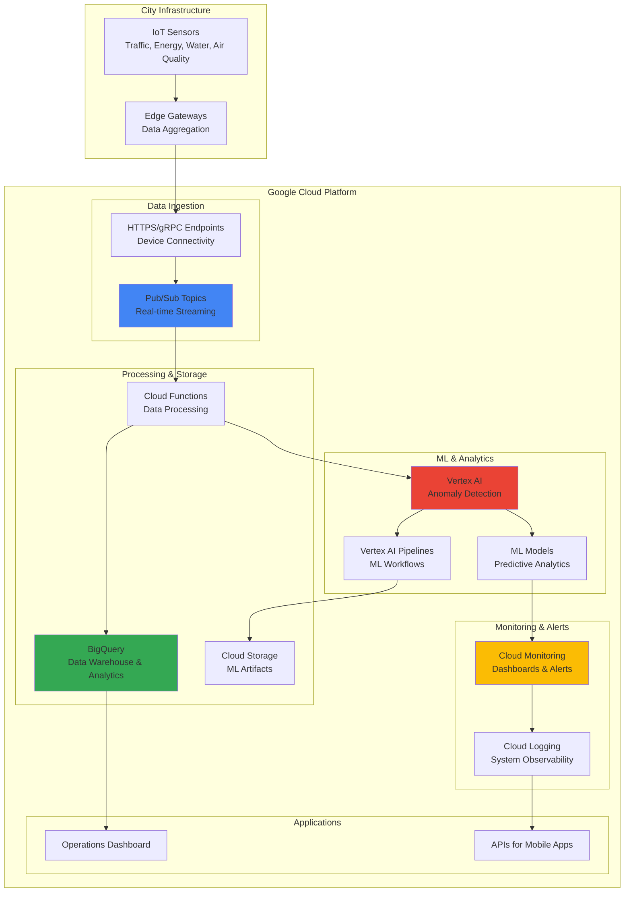

# Smart City Infrastructure Monitoring with IoT and AI

## Problem

Modern cities struggle with aging infrastructure, traffic congestion, and energy inefficiency, leading to increased maintenance costs, citizen dissatisfaction, and environmental impact. Traditional monitoring systems lack real-time intelligence and predictive capabilities, making it difficult to proactively address issues before they become critical. Cities need an intelligent monitoring system that can collect data from thousands of IoT sensors, detect anomalies in real-time, and provide actionable insights to optimize urban operations and improve quality of life for residents.

## Solution

Build an intelligent monitoring system using Google Cloud Pub/Sub for scalable IoT data ingestion, Vertex AI to detect anomalies and predict maintenance needs, and BigQuery for real-time analytics and historical trend analysis. Cloud Monitoring provides centralized alerting and dashboards, enabling city operations teams to respond quickly to issues and optimize resource allocation. This solution enables predictive maintenance, reduces operational costs, and improves citizen services through data-driven decision making.

## Architecture Diagram



## Prerequisites

1. Google Cloud account with billing enabled and project owner permissions
2. Google Cloud CLI installed and configured (or Cloud Shell access)
3. Basic understanding of IoT protocols (HTTPS/gRPC) and machine learning concepts
4. Familiarity with SQL and data analytics workflows
5. Estimated cost: $15-25 per day for active monitoring (includes Pub/Sub messages, ML training, and BigQuery queries)

> **Note**: This recipe demonstrates smart city monitoring principles using simulated sensor data and direct Pub/Sub connectivity. For production deployments with thousands of devices, consider implementing an MQTT broker architecture.

## Preparation

```bash
# Set environment variables for GCP resources
export PROJECT_ID="smart-city-$(date +%s)"
export REGION="us-central1"
export ZONE="us-central1-a"

# Generate unique suffix for resource names
RANDOM_SUFFIX=$(openssl rand -hex 3)
export DATASET_NAME="smart_city_data"
export TOPIC_NAME="sensor-telemetry"
export BUCKET_NAME="smart-city-ml-${RANDOM_SUFFIX}"
export SERVICE_ACCOUNT_NAME="city-sensors-${RANDOM_SUFFIX}"

# Set default project and region
gcloud config set project ${PROJECT_ID}
gcloud config set compute/region ${REGION}
gcloud config set compute/zone ${ZONE}

# Enable required APIs
gcloud services enable pubsub.googleapis.com
gcloud services enable bigquery.googleapis.com
gcloud services enable aiplatform.googleapis.com
gcloud services enable monitoring.googleapis.com
gcloud services enable cloudfunctions.googleapis.com
gcloud services enable storage.googleapis.com

echo "✅ Project configured: ${PROJECT_ID}"
echo "✅ APIs enabled for smart city monitoring"
```

## Steps

1. **Create Service Account for IoT Device Authentication**:

   Service accounts provide secure, token-based authentication for IoT devices connecting to Google Cloud services. This approach follows Google Cloud's recommended pattern for IoT device authentication, replacing the deprecated IoT Core with direct Pub/Sub connectivity using workload identity federation.

   ```bash
   # Create service account for IoT devices
   gcloud iam service-accounts create ${SERVICE_ACCOUNT_NAME} \
       --display-name="Smart City IoT Sensors" \
       --description="Service account for city sensor data ingestion"
   
   # Grant Pub/Sub publisher role
   gcloud projects add-iam-policy-binding ${PROJECT_ID} \
       --member="serviceAccount:${SERVICE_ACCOUNT_NAME}@${PROJECT_ID}.iam.gserviceaccount.com" \
       --role="roles/pubsub.publisher"
   
   # Create and download service account key
   gcloud iam service-accounts keys create sensor-key.json \
       --iam-account=${SERVICE_ACCOUNT_NAME}@${PROJECT_ID}.iam.gserviceaccount.com
   
   echo "✅ Service account created for IoT device authentication"
   ```

   The service account now enables secure device-to-cloud communication using Google Cloud's current recommended architecture for IoT applications, providing the authentication foundation for direct Pub/Sub connectivity.

2. **Create Pub/Sub Topic for Sensor Data Streaming**:

   Pub/Sub provides the scalable messaging backbone for ingesting real-time IoT sensor data from across the city. The topic-subscription model enables multiple consumers to process the same sensor data stream for different purposes, such as real-time monitoring, analytics, and machine learning model training.

   ```bash
   # Create the main telemetry topic
   gcloud pubsub topics create ${TOPIC_NAME}
   
   # Create subscription for BigQuery streaming
   gcloud pubsub subscriptions create \
       ${TOPIC_NAME}-bigquery \
       --topic=${TOPIC_NAME} \
       --ack-deadline=60
   
   # Create subscription for ML processing
   gcloud pubsub subscriptions create \
       ${TOPIC_NAME}-ml \
       --topic=${TOPIC_NAME} \
       --ack-deadline=120
   
   # Create dead letter topic for failed messages
   gcloud pubsub topics create ${TOPIC_NAME}-dlq
   gcloud pubsub subscriptions create \
       ${TOPIC_NAME}-dlq-sub \
       --topic=${TOPIC_NAME}-dlq
   
   echo "✅ Pub/Sub infrastructure created with dead letter queue"
   ```

   The Pub/Sub infrastructure now supports parallel processing of sensor data with built-in reliability through dead letter queues, enabling real-time analytics while simultaneously feeding machine learning pipelines for anomaly detection and predictive maintenance.

3. **Create BigQuery Dataset and Tables for Analytics**:

   BigQuery serves as the central data warehouse for all city sensor data, enabling real-time analytics and historical trend analysis. The schema design accommodates multiple sensor types while supporting efficient querying for operational dashboards and reporting.

   ```bash
   # Create BigQuery dataset with proper location
   bq mk \
       --dataset \
       --location=${REGION} \
       --description="Smart city sensor data and analytics" \
       ${PROJECT_ID}:${DATASET_NAME}
   
   # Create sensor data table with optimized schema
   bq mk \
       --table \
       --description="Real-time sensor readings from city infrastructure" \
       --time_partitioning_field=timestamp \
       --clustering_fields=sensor_type,location \
       ${PROJECT_ID}:${DATASET_NAME}.sensor_readings \
       device_id:STRING,sensor_type:STRING,location:STRING,timestamp:TIMESTAMP,value:FLOAT,unit:STRING,metadata:JSON,ingestion_time:TIMESTAMP
   
   # Create anomalies table for ML results
   bq mk \
       --table \
       --description="Anomaly detection results from ML models" \
       --time_partitioning_field=timestamp \
       ${PROJECT_ID}:${DATASET_NAME}.anomalies \
       device_id:STRING,timestamp:TIMESTAMP,anomaly_score:FLOAT,anomaly_type:STRING,confidence:FLOAT,model_version:STRING
   
   # Create aggregated metrics table for dashboards
   bq mk \
       --table \
       ${PROJECT_ID}:${DATASET_NAME}.sensor_metrics \
       sensor_type:STRING,location:STRING,date:DATE,avg_value:FLOAT,min_value:FLOAT,max_value:FLOAT,anomaly_count:INTEGER
   
   echo "✅ BigQuery dataset and tables created with partitioning"
   ```

   The BigQuery data warehouse now provides petabyte-scale analytics capabilities with optimized table partitioning and clustering, enabling city operations teams to analyze trends, generate reports, and make data-driven decisions for infrastructure optimization.

4. **Deploy Cloud Function for Sensor Data Processing**:

   Cloud Functions provide serverless event processing for incoming sensor data, transforming and enriching messages before storing them in BigQuery. This approach enables real-time data processing with automatic scaling based on sensor message volume while implementing data quality checks and enrichment.

   ```bash
   # Create directory for Cloud Function code
   mkdir -p sensor-processor
   cd sensor-processor
   
   # Create the main function file with enhanced processing
   cat > main.py << 'EOF'
import json
import base64
import logging
from google.cloud import bigquery
from google.cloud import monitoring_v3
from datetime import datetime, timezone
import os
import hashlib

def process_sensor_data(event, context):
    """Process IoT sensor data with validation and BigQuery insertion"""
    
    try:
        # Decode Pub/Sub message
        if 'data' in event:
            message_data = base64.b64decode(event['data']).decode('utf-8')
            sensor_data = json.loads(message_data)
        else:
            logging.error("No data field in Pub/Sub message")
            return 'Error: Missing data'
        
        # Validate required fields
        required_fields = ['device_id', 'sensor_type', 'value']
        for field in required_fields:
            if field not in sensor_data:
                logging.error(f"Missing required field: {field}")
                return f'Error: Missing {field}'
        
        # Initialize BigQuery client
        client = bigquery.Client()
        table_id = f"{os.environ['PROJECT_ID']}.{os.environ['DATASET_NAME']}.sensor_readings"
        
        # Add data quality checks
        sensor_value = sensor_data.get('value')
        if not isinstance(sensor_value, (int, float)):
            logging.error(f"Invalid sensor value type: {type(sensor_value)}")
            return 'Error: Invalid value type'
        
        # Generate data hash for deduplication
        data_hash = hashlib.md5(
            f"{sensor_data.get('device_id')}{sensor_data.get('timestamp', '')}{sensor_value}".encode()
        ).hexdigest()
        
        # Prepare enriched row for insertion
        current_time = datetime.now(timezone.utc)
        row = {
            "device_id": sensor_data.get("device_id"),
            "sensor_type": sensor_data.get("sensor_type"),
            "location": sensor_data.get("location", "unknown"),
            "timestamp": sensor_data.get("timestamp", current_time.isoformat()),
            "value": float(sensor_value),
            "unit": sensor_data.get("unit", ""),
            "metadata": sensor_data.get("metadata", {}),
            "ingestion_time": current_time.isoformat()
        }
        
        # Insert into BigQuery with streaming
        errors = client.insert_rows_json(table_id, [row])
        
        if errors:
            logging.error(f"BigQuery insertion errors: {errors}")
            return f'Error: {errors}'
        
        # Log successful processing
        logging.info(f"Successfully processed data from {sensor_data.get('device_id')}")
        
        # Send custom metric to Cloud Monitoring
        monitoring_client = monitoring_v3.MetricServiceClient()
        project_name = f"projects/{os.environ['PROJECT_ID']}"
        
        # Create time series data point
        series = monitoring_v3.TimeSeries()
        series.metric.type = "custom.googleapis.com/iot/sensor_messages_processed"
        series.resource.type = "global"
        
        point = monitoring_v3.Point()
        point.value.int64_value = 1
        point.interval.end_time.seconds = int(current_time.timestamp())
        series.points = [point]
        
        # Send metric
        monitoring_client.create_time_series(
            name=project_name, 
            time_series=[series]
        )
        
        return 'OK'
        
    except Exception as e:
        logging.error(f"Error processing sensor data: {str(e)}")
        return f'Error: {str(e)}'
EOF
   
   # Create requirements file with latest versions
   cat > requirements.txt << 'EOF'
google-cloud-bigquery==3.17.2
google-cloud-monitoring==2.19.0
google-cloud-pubsub==2.20.1
functions-framework==3.5.0
EOF
   
   # Deploy the Cloud Function with proper configuration
   gcloud functions deploy process-sensor-data \
       --runtime python311 \
       --trigger-topic ${TOPIC_NAME} \
       --source . \
       --entry-point process_sensor_data \
       --memory 512MB \
       --timeout 120s \
       --max-instances 100 \
       --set-env-vars PROJECT_ID=${PROJECT_ID},DATASET_NAME=${DATASET_NAME} \
       --service-account=${SERVICE_ACCOUNT_NAME}@${PROJECT_ID}.iam.gserviceaccount.com
   
   cd ..
   echo "✅ Cloud Function deployed with enhanced data processing"
   ```

   The Cloud Function now automatically processes all incoming sensor data with comprehensive validation, data quality checks, and monitoring integration, ensuring consistent data quality and real-time availability for analytics and monitoring dashboards.

5. **Create Cloud Storage Bucket for ML Models and Data**:

   Cloud Storage provides the foundation for machine learning workflows, storing training data, model artifacts, and pipeline configurations. The bucket configuration includes appropriate security settings and lifecycle management for cost optimization.

   ```bash
   # Create Cloud Storage bucket for ML artifacts
   gsutil mb -p ${PROJECT_ID} \
       -c STANDARD \
       -l ${REGION} \
       gs://${BUCKET_NAME}
   
   # Enable versioning and set lifecycle policy
   gsutil versioning set on gs://${BUCKET_NAME}
   
   # Create lifecycle policy for cost optimization
   cat > lifecycle.json << EOF
{
  "lifecycle": {
    "rule": [
      {
        "action": {"type": "SetStorageClass", "storageClass": "NEARLINE"},
        "condition": {"age": 30}
      },
      {
        "action": {"type": "SetStorageClass", "storageClass": "COLDLINE"},
        "condition": {"age": 90}
      },
      {
        "action": {"type": "Delete"},
        "condition": {"age": 365}
      }
    ]
  }
}
EOF
   
   gsutil lifecycle set lifecycle.json gs://${BUCKET_NAME}
   
   # Create organized folder structure
   echo "Creating ML pipeline structure..." | gsutil cp - gs://${BUCKET_NAME}/models/.gitkeep
   echo "Training data storage" | gsutil cp - gs://${BUCKET_NAME}/training-data/.gitkeep
   echo "Pipeline artifacts" | gsutil cp - gs://${BUCKET_NAME}/pipelines/.gitkeep
   echo "Model monitoring" | gsutil cp - gs://${BUCKET_NAME}/monitoring/.gitkeep
   
   echo "✅ Cloud Storage bucket created with lifecycle management"
   ```

   The storage infrastructure now supports the complete ML lifecycle with automatic cost optimization through intelligent tiering, providing organized storage for data preparation through model deployment and monitoring.

6. **Set Up Vertex AI Anomaly Detection Pipeline**:

   Vertex AI provides managed machine learning capabilities for detecting anomalies in sensor data patterns. The pipeline automatically trains models on historical data and provides real-time anomaly scoring for proactive infrastructure monitoring.

   ```bash
   # Create training dataset preparation script
   cat > prepare_training_data.py << 'EOF'
from google.cloud import bigquery
from google.cloud import aiplatform
import pandas as pd
import numpy as np
from datetime import datetime, timedelta
import json
import os

def prepare_anomaly_training_data():
    """Prepare training dataset from BigQuery sensor data"""
    
    # Initialize clients
    bq_client = bigquery.Client()
    project_id = os.environ['PROJECT_ID']
    dataset_name = os.environ['DATASET_NAME']
    
    # Query to extract features for anomaly detection
    query = f"""
    WITH sensor_features AS (
      SELECT 
        device_id,
        sensor_type,
        location,
        timestamp,
        value,
        EXTRACT(HOUR FROM timestamp) as hour_of_day,
        EXTRACT(DAYOFWEEK FROM timestamp) as day_of_week,
        EXTRACT(MONTH FROM timestamp) as month,
        LAG(value, 1) OVER (PARTITION BY device_id ORDER BY timestamp) as prev_value_1,
        LAG(value, 2) OVER (PARTITION BY device_id ORDER BY timestamp) as prev_value_2,
        LAG(value, 3) OVER (PARTITION BY device_id ORDER BY timestamp) as prev_value_3,
        AVG(value) OVER (
          PARTITION BY device_id 
          ORDER BY timestamp 
          ROWS BETWEEN 23 PRECEDING AND CURRENT ROW
        ) as rolling_avg_24h,
        STDDEV(value) OVER (
          PARTITION BY device_id 
          ORDER BY timestamp 
          ROWS BETWEEN 23 PRECEDING AND CURRENT ROW
        ) as rolling_stddev_24h,
        PERCENTILE_CONT(value, 0.5) OVER (
          PARTITION BY device_id, EXTRACT(HOUR FROM timestamp)
          ORDER BY timestamp 
          ROWS BETWEEN 167 PRECEDING AND CURRENT ROW
        ) as hourly_median_week
      FROM `{project_id}.{dataset_name}.sensor_readings`
      WHERE timestamp >= TIMESTAMP_SUB(CURRENT_TIMESTAMP(), INTERVAL 30 DAY)
        AND value IS NOT NULL
    ),
    labeled_data AS (
      SELECT 
        *,
        -- Create anomaly labels based on statistical thresholds
        CASE 
          WHEN ABS(value - rolling_avg_24h) > 3 * rolling_stddev_24h THEN 1
          WHEN ABS(value - hourly_median_week) > 2 * rolling_stddev_24h THEN 1
          ELSE 0
        END as anomaly_label
      FROM sensor_features
      WHERE prev_value_1 IS NOT NULL 
        AND rolling_avg_24h IS NOT NULL
        AND rolling_stddev_24h > 0
    )
    SELECT * FROM labeled_data
    ORDER BY device_id, timestamp
    """
    
    # Execute query and get results
    df = bq_client.query(query).to_dataframe()
    print(f"Training dataset prepared with {len(df)} records")
    print(f"Anomaly ratio: {df['anomaly_label'].mean():.3f}")
    
    return df

if __name__ == "__main__":
    # Set environment variables
    os.environ['PROJECT_ID'] = '{PROJECT_ID}'
    os.environ['DATASET_NAME'] = '{DATASET_NAME}'
    
    # Prepare training data
    training_data = prepare_anomaly_training_data()
    
    # Save to Cloud Storage for model training
    training_data.to_csv('gs://{BUCKET_NAME}/training-data/sensor_anomaly_training.csv', index=False)
    print("Training data saved to Cloud Storage")
EOF
   
   # Create Vertex AI training job configuration
   cat > anomaly_training_job.yaml << EOF
displayName: "smart-city-anomaly-detection"
trainingTaskDefinition: gs://google-cloud-aiplatform/schema/trainingjob/definition/automl_tabular_1.0.0.yaml
trainingTaskInputs:
  targetColumn: "anomaly_label"
  predictionType: "classification"
  optimizationObjective: "maximize-au-prc"
  budgetMilliNodeHours: 8000
  disableEarlyStopping: false
  exportEvaluatedDataItemsConfig:
    destinationBigqueryUri: "bq://${PROJECT_ID}.${DATASET_NAME}.model_evaluation"
modelToUpload:
  displayName: "city-sensor-anomaly-model"
  description: "Anomaly detection model for smart city sensor data"
EOF
   
   # Upload configuration to Cloud Storage
   gsutil cp anomaly_training_job.yaml gs://${BUCKET_NAME}/models/
   gsutil cp prepare_training_data.py gs://${BUCKET_NAME}/training-data/
   
   # Create Vertex AI dataset
   gcloud ai datasets create \
       --display-name="smart-city-sensor-data" \
       --metadata-schema-uri="gs://google-cloud-aiplatform/schema/dataset/metadata/tabular_1.0.0.yaml" \
       --region=${REGION}
   
   echo "✅ Vertex AI anomaly detection pipeline configured"
   echo "📝 Run prepare_training_data.py when you have sufficient sensor data"
   ```

   The ML pipeline is now ready to train on historical sensor data using AutoML for anomaly detection, providing continuous monitoring capabilities that enable predictive maintenance and early warning systems for city infrastructure.

7. **Configure Cloud Monitoring Dashboards and Alerts**:

   Cloud Monitoring provides comprehensive observability for the smart city infrastructure, with custom dashboards showing real-time sensor metrics and automated alerts for anomalies or system issues. This enables operations teams to respond quickly to infrastructure problems.

   ```bash
   # Create custom dashboard configuration
   cat > smart_city_dashboard.json << EOF
{
  "displayName": "Smart City Infrastructure Monitoring",
  "mosaicLayout": {
    "tiles": [
      {
        "width": 6,
        "height": 4,
        "widget": {
          "title": "Sensor Message Rate (per minute)",
          "xyChart": {
            "dataSets": [{
              "timeSeriesQuery": {
                "timeSeriesFilter": {
                  "filter": "resource.type=\"pubsub_topic\" AND resource.labels.topic_id=\"${TOPIC_NAME}\"",
                  "aggregation": {
                    "alignmentPeriod": "60s",
                    "perSeriesAligner": "ALIGN_RATE",
                    "crossSeriesReducer": "REDUCE_SUM"
                  }
                }
              },
              "plotType": "LINE"
            }],
            "yAxis": {
              "label": "Messages/minute",
              "scale": "LINEAR"
            }
          }
        }
      },
      {
        "width": 6,
        "height": 4,
        "xPos": 6,
        "widget": {
          "title": "Cloud Function Executions",
          "xyChart": {
            "dataSets": [{
              "timeSeriesQuery": {
                "timeSeriesFilter": {
                  "filter": "resource.type=\"cloud_function\" AND resource.labels.function_name=\"process-sensor-data\"",
                  "aggregation": {
                    "alignmentPeriod": "60s",
                    "perSeriesAligner": "ALIGN_RATE",
                    "crossSeriesReducer": "REDUCE_SUM"
                  }
                }
              },
              "plotType": "STACKED_AREA"
            }]
          }
        }
      },
      {
        "width": 12,
        "height": 4,
        "yPos": 4,
        "widget": {
          "title": "BigQuery Data Ingestion Rate",
          "xyChart": {
            "dataSets": [{
              "timeSeriesQuery": {
                "timeSeriesFilter": {
                  "filter": "resource.type=\"bigquery_table\" AND resource.labels.table_id=\"sensor_readings\"",
                  "aggregation": {
                    "alignmentPeriod": "300s",
                    "perSeriesAligner": "ALIGN_RATE"
                  }
                }
              },
              "plotType": "LINE"
            }]
          }
        }
      }
    ]
  }
}
EOF
   
   # Create alert policy for high anomaly scores
   cat > anomaly_alert_policy.json << EOF
{
  "displayName": "Smart City - High Anomaly Detection Alert",
  "documentation": {
    "content": "Alert when anomaly detection scores exceed threshold, indicating potential infrastructure issues"
  },
  "conditions": [
    {
      "displayName": "Anomaly score threshold exceeded",
      "conditionThreshold": {
        "filter": "metric.type=\"custom.googleapis.com/iot/sensor_messages_processed\"",
        "comparison": "COMPARISON_GT",
        "thresholdValue": 0.85,
        "duration": "300s",
        "aggregations": [
          {
            "alignmentPeriod": "60s",
            "perSeriesAligner": "ALIGN_RATE",
            "crossSeriesReducer": "REDUCE_SUM"
          }
        ]
      }
    }
  ],
  "alertStrategy": {
    "autoClose": "1800s"
  },
  "enabled": true,
  "severity": "WARNING"
}
EOF
   
   # Create dashboard
   gcloud monitoring dashboards create \
       --config-from-file=smart_city_dashboard.json
   
   # Create alert policy
   gcloud alpha monitoring policies create \
       --policy-from-file=anomaly_alert_policy.json
   
   # Create notification channel (email example)
   echo "📧 To complete alert setup, create notification channels:"
   echo "gcloud alpha monitoring channels create \\"
   echo "  --display-name='City Operations Team' \\"
   echo "  --type=email \\"
   echo "  --channel-labels=email_address=operations@city.gov"
   
   echo "✅ Cloud Monitoring dashboards and alerts configured"
   ```

   The monitoring infrastructure now provides real-time visibility into sensor health, data quality, and system performance, enabling proactive infrastructure management and rapid incident response with automated alerting.

## Validation & Testing

1. **Verify Pub/Sub Infrastructure and Service Account**:

   ```bash
   # Check Pub/Sub topic and subscriptions
   gcloud pubsub topics describe ${TOPIC_NAME} \
       --format="table(name,messageStoragePolicy.allowedPersistenceRegions)"
   
   # Verify subscriptions are active
   gcloud pubsub subscriptions list \
       --filter="topic:${TOPIC_NAME}" \
       --format="table(name,topic,ackDeadlineSeconds)"
   
   # Check service account permissions
   gcloud iam service-accounts get-iam-policy \
       ${SERVICE_ACCOUNT_NAME}@${PROJECT_ID}.iam.gserviceaccount.com
   ```

   Expected output: Topic should show active status with subscriptions created and service account with proper IAM bindings.

2. **Test Sensor Data Ingestion via HTTPS API**:

   ```bash
   # Simulate sensor data using Pub/Sub REST API
   cat > test_sensor_payload.json << EOF
{
  "device_id": "traffic-sensor-001",
  "sensor_type": "traffic_flow",
  "location": "Main St & 1st Ave",
  "value": 45.2,
  "unit": "vehicles_per_minute",
  "timestamp": "$(date -u +%Y-%m-%dT%H:%M:%S.%3NZ)",
  "metadata": {
    "intersection_id": "INT-001",
    "lane_count": 4,
    "weather_condition": "clear"
  }
}
EOF
   
   # Publish test message using service account authentication
   gcloud pubsub topics publish ${TOPIC_NAME} \
       --message="$(cat test_sensor_payload.json)" \
       --attribute="device_type=traffic_sensor,priority=normal"
   
   # Verify Cloud Function processing
   sleep 10
   gcloud functions logs read process-sensor-data \
       --limit=5 \
       --format="value(textPayload,timestamp)"
   ```

   Expected output: Cloud Function logs should show successful processing and BigQuery insertion with data validation.

3. **Validate BigQuery Data Storage and Schema**:

   ```bash
   # Query recently ingested sensor data
   bq query \
       --use_legacy_sql=false \
       --format=prettyjson \
       --max_rows=5 \
       "SELECT 
          device_id, 
          sensor_type, 
          location, 
          timestamp, 
          value,
          ingestion_time
        FROM \`${PROJECT_ID}.${DATASET_NAME}.sensor_readings\`
        WHERE timestamp >= TIMESTAMP_SUB(CURRENT_TIMESTAMP(), INTERVAL 1 HOUR)
        ORDER BY timestamp DESC"
   
   # Check data quality and volume metrics
   bq query \
       --use_legacy_sql=false \
       "SELECT 
          sensor_type,
          COUNT(*) as total_records,
          COUNT(DISTINCT device_id) as unique_devices,
          MIN(timestamp) as earliest_reading,
          MAX(timestamp) as latest_reading,
          AVG(value) as avg_value
        FROM \`${PROJECT_ID}.${DATASET_NAME}.sensor_readings\`
        GROUP BY sensor_type
        ORDER BY total_records DESC"
   ```

   Expected output: Query should return sensor data with recent timestamps, proper JSON metadata parsing, and data quality metrics.

4. **Test Cloud Monitoring and Custom Metrics**:

   ```bash
   # Verify custom metrics are being recorded
   gcloud monitoring metrics list \
       --filter="metric.type:custom.googleapis.com/iot" \
       --format="table(metric.type,metric.displayName)"
   
   # Check dashboard creation
   gcloud monitoring dashboards list \
       --format="table(displayName,createTime)"
   
   # Verify alert policies
   gcloud alpha monitoring policies list \
       --format="table(displayName,enabled,conditions[0].displayName)"
   ```

   Expected output: Custom metrics should be visible, dashboard created, and alert policies active.

## Cleanup

1. **Remove Vertex AI resources and models**:

   ```bash
   # List and delete Vertex AI datasets
   gcloud ai datasets list --region=${REGION} \
       --format="value(name)" | \
       xargs -I {} gcloud ai datasets delete {} --region=${REGION} --quiet
   
   # Clean up any training jobs
   gcloud ai custom-jobs list --region=${REGION} \
       --format="value(name)" | \
       xargs -I {} gcloud ai custom-jobs cancel {} --region=${REGION} --quiet
   
   echo "✅ Vertex AI resources cleaned up"
   ```

2. **Clean up Cloud Functions and monitoring**:

   ```bash
   # Delete Cloud Function
   gcloud functions delete process-sensor-data \
       --region=${REGION} \
       --quiet
   
   # Remove monitoring dashboards
   gcloud monitoring dashboards list \
       --format="value(name)" | \
       grep -i "smart.*city" | \
       xargs -I {} gcloud monitoring dashboards delete {} --quiet
   
   # Remove alert policies
   gcloud alpha monitoring policies list \
       --format="value(name)" | \
       xargs -I {} gcloud alpha monitoring policies delete {} --quiet
   
   echo "✅ Cloud Functions and monitoring resources cleaned up"
   ```

3. **Remove storage and BigQuery resources**:

   ```bash
   # Remove Cloud Storage bucket and contents
   gsutil -m rm -r gs://${BUCKET_NAME}
   
   # Delete BigQuery dataset and all tables
   bq rm -r -f ${PROJECT_ID}:${DATASET_NAME}
   
   echo "✅ Storage and BigQuery resources cleaned up"
   ```

4. **Clean up Pub/Sub and IAM resources**:

   ```bash
   # Delete Pub/Sub subscriptions
   gcloud pubsub subscriptions delete ${TOPIC_NAME}-bigquery --quiet
   gcloud pubsub subscriptions delete ${TOPIC_NAME}-ml --quiet
   gcloud pubsub subscriptions delete ${TOPIC_NAME}-dlq-sub --quiet
   
   # Delete Pub/Sub topics
   gcloud pubsub topics delete ${TOPIC_NAME} --quiet
   gcloud pubsub topics delete ${TOPIC_NAME}-dlq --quiet
   
   # Remove service account and keys
   gcloud iam service-accounts delete \
       ${SERVICE_ACCOUNT_NAME}@${PROJECT_ID}.iam.gserviceaccount.com \
       --quiet
   
   # Clean up local files
   rm -f sensor-key.json lifecycle.json *.py *.yaml *.json
   rm -rf sensor-processor/
   
   echo "✅ Pub/Sub and IAM resources cleaned up"
   ```

5. **Optional: Delete the entire project**:

   ```bash
   # Optionally delete the entire project
   echo "To delete the entire project and all resources, run:"
   echo "gcloud projects delete ${PROJECT_ID}"
   echo ""
   echo "✅ All resources cleaned up successfully"
   echo "Note: Project deletion may take several minutes to complete"
   ```

## Discussion

This smart city infrastructure monitoring solution demonstrates Google Cloud's modern IoT architecture following the post-IoT Core era recommendations. The architecture leverages **Pub/Sub** for scalable message ingestion, **Vertex AI** for machine learning-powered anomaly detection, **BigQuery** for analytics at scale, and **Cloud Monitoring** for comprehensive observability. This combination enables cities to transition from reactive to predictive infrastructure management using current Google Cloud best practices.

The **direct device-to-Pub/Sub connectivity** approach represents Google Cloud's current recommended pattern for IoT applications, replacing the deprecated IoT Core service. This architecture provides greater flexibility and leverages Google Cloud's serverless services for automatic scaling and cost optimization. Service account-based authentication ensures secure device connectivity, while Cloud Functions provide event-driven data processing with built-in error handling and monitoring integration.

**Security and reliability** are built into every layer of this modern solution. Service accounts provide secure, token-based authentication for IoT devices, while IAM roles ensure least-privilege access to cloud resources. All data is encrypted in transit and at rest, and **Cloud Audit Logs** provide complete traceability of all system interactions. The addition of dead letter queues ensures message reliability, while Cloud Monitoring provides comprehensive observability for proactive issue detection and resolution.

The **scalability and cost optimization** aspects leverage Google Cloud's serverless architecture principles. Pub/Sub automatically scales to handle message spikes during peak traffic periods or emergency situations, while **Cloud Functions** scale to zero when no sensor data is being processed, minimizing operational costs. BigQuery's serverless architecture with intelligent table partitioning and clustering ensures cost-effective analytics at any scale. For additional optimization, the solution implements **Cloud Storage lifecycle policies** to automatically tier data based on access patterns, reducing long-term storage costs.

> **Tip**: For production deployments with thousands of IoT devices, consider implementing a **standalone MQTT broker architecture** on Google Kubernetes Engine (GKE) with HiveMQ or Eclipse Mosquitto, which provides full MQTT protocol support and better device management capabilities for large-scale deployments.

**References:**
- [Google Cloud Connected Device Architectures](https://cloud.google.com/architecture/connected-devices)
- [Device to Pub/Sub Architecture Guide](https://cloud.google.com/architecture/connected-devices/device-pubsub-architecture)
- [Vertex AI Machine Learning Platform](https://cloud.google.com/vertex-ai/docs)
- [BigQuery Data Warehouse Best Practices](https://cloud.google.com/bigquery/docs/best-practices)
- [Cloud Monitoring for IoT Applications](https://cloud.google.com/monitoring/docs)
- [IoT Platform Product Architecture](https://cloud.google.com/architecture/connected-devices/iot-platform-product-architecture)

## Challenge

Extend this smart city monitoring solution with these enhancements:

1. **Implement MQTT broker architecture** using **Google Kubernetes Engine (GKE)** and **HiveMQ Cloud** to support thousands of simultaneous device connections with full MQTT protocol features, including QoS levels and retained messages for more robust device communication.

2. **Add real-time streaming analytics** using **Dataflow** with Apache Beam pipelines to process sensor data streams in real-time, implementing complex event processing for traffic optimization and emergency response automation based on multiple sensor correlations.

3. **Create predictive maintenance workflows** using **Vertex AI Pipelines** to train time-series forecasting models that predict equipment failures 2-4 weeks in advance, automatically generating maintenance tickets and optimizing repair schedules based on predicted failure patterns.

4. **Integrate external data sources** using **Cloud Functions** and **Cloud Scheduler** to incorporate weather APIs, traffic APIs, and social media sentiment data, enabling more sophisticated anomaly detection that considers external factors affecting city infrastructure performance.

5. **Implement edge computing capabilities** using **Google Distributed Cloud Edge** or **IoT Edge** devices that can process sensor data locally using TensorFlow Lite models, reducing bandwidth costs and enabling real-time responses for critical infrastructure monitoring while maintaining cloud connectivity for model updates.

## Infrastructure Code

### Available Infrastructure as Code:

- [Infrastructure Code Overview](code/README.md) - Detailed description of all infrastructure components
- [Infrastructure Manager](code/infrastructure-manager/) - GCP Infrastructure Manager templates
- [Bash CLI Scripts](code/scripts/) - Example bash scripts using gcloud CLI commands to deploy infrastructure
- [Terraform](code/terraform/) - Terraform configuration files