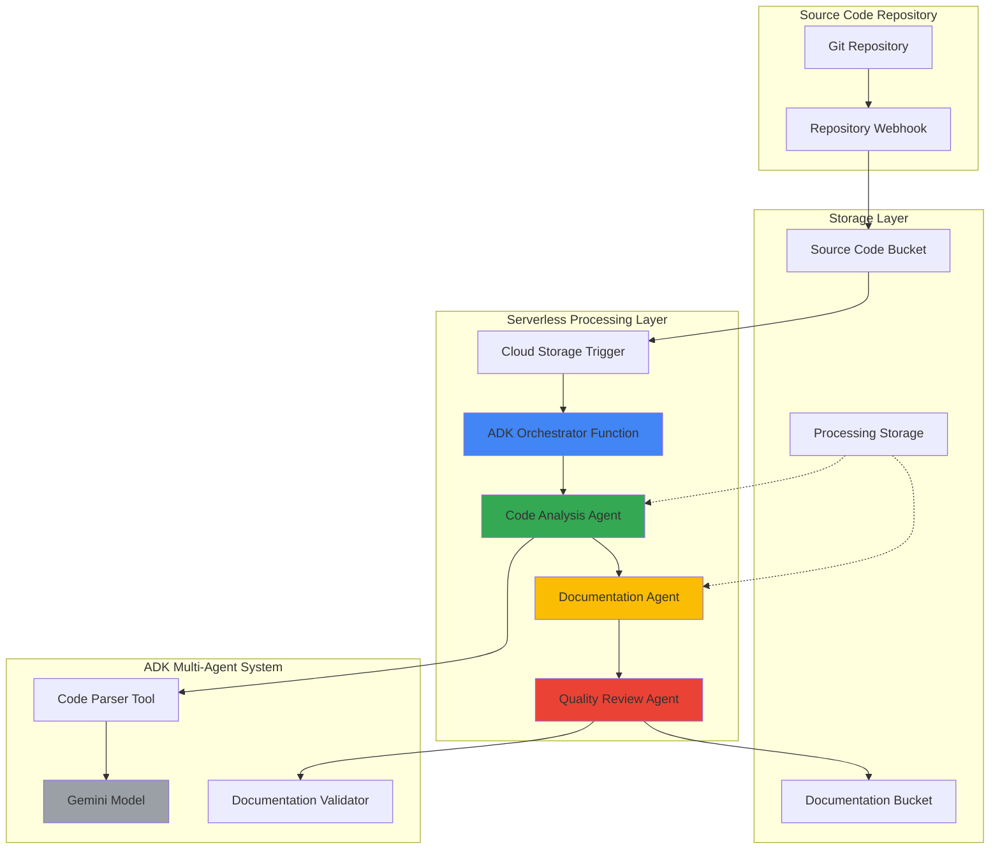

# Smart Code Documentation with Agent Development Kit and Functions

## Problem

Development teams struggle with maintaining comprehensive, up-to-date code documentation as codebases evolve rapidly. Manual documentation efforts often lag behind code changes, leading to outdated or incomplete documentation that hinders new developer onboarding, code reviews, and knowledge transfer. Traditional documentation tools lack the intelligence to understand code context, relationships between components, and the ability to automatically generate meaningful explanations that reflect both technical implementation and business logic.

## Solution

Build an intelligent multi-agent documentation system using Google Cloud's Agent Development Kit (ADK) that automatically analyzes code repositories, understands code structure and functionality, and generates comprehensive documentation. The solution leverages ADK's multi-agent architecture to create specialized agents for different documentation tasks, deployed as serverless Cloud Functions that trigger on code repository changes, with results stored in Cloud Storage for seamless integration with existing development workflows.

## Architecture Diagram



## Prerequisites

1. Google Cloud project with billing enabled and the following APIs:
   - Vertex AI API
   - Cloud Functions API
   - Cloud Storage API
   - Cloud Build API
2. Google Cloud CLI installed and authenticated (or Cloud Shell)
3. Python 3.11+ development environment for testing ADK agents locally
4. Basic understanding of AI agents, serverless functions, and multi-agent systems
5. Estimated cost: $15-25 for a full development cycle including AI model usage

> **Note**: ADK is a production-ready open-source framework optimized for Gemini models but supports model-agnostic deployment. This recipe uses Vertex AI's Gemini models for optimal integration with Google Cloud services.

## Preparation

```bash
# Set environment variables for GCP resources
export PROJECT_ID="adk-docs-$(date +%s)"
export REGION="us-central1"
export ZONE="us-central1-a"

# Generate unique suffix for resource names
RANDOM_SUFFIX=$(openssl rand -hex 3)

# Set default project and region
gcloud config set project ${PROJECT_ID}
gcloud config set compute/region ${REGION}
gcloud config set compute/zone ${ZONE}

# Enable required APIs
gcloud services enable aiplatform.googleapis.com
gcloud services enable cloudfunctions.googleapis.com
gcloud services enable storage.googleapis.com
gcloud services enable cloudbuild.googleapis.com

# Create Cloud Storage buckets for code input and documentation output
export INPUT_BUCKET="${PROJECT_ID}-code-input-${RANDOM_SUFFIX}"
export OUTPUT_BUCKET="${PROJECT_ID}-docs-output-${RANDOM_SUFFIX}"
export TEMP_BUCKET="${PROJECT_ID}-processing-${RANDOM_SUFFIX}"

gsutil mb -p ${PROJECT_ID} -c STANDARD -l ${REGION} gs://${INPUT_BUCKET}
gsutil mb -p ${PROJECT_ID} -c STANDARD -l ${REGION} gs://${OUTPUT_BUCKET}
gsutil mb -p ${PROJECT_ID} -c STANDARD -l ${REGION} gs://${TEMP_BUCKET}

# Set up authentication for ADK
gcloud auth application-default login

echo "✅ Project configured: ${PROJECT_ID}"
echo "✅ Storage buckets created successfully"
```

## Steps

1. **Install and Configure Agent Development Kit**:

   Google's Agent Development Kit (ADK) provides a flexible framework for building multi-agent systems that can understand and analyze code repositories. The framework's model-agnostic design allows us to leverage Vertex AI's Gemini models while maintaining compatibility with other AI providers for future extensibility.

   ```bash
   # Create local development directory
   mkdir -p ~/adk-code-docs && cd ~/adk-code-docs
   
   # Create virtual environment for ADK development
   python3 -m venv adk-env
   source adk-env/bin/activate
   
   # Install ADK v1.0.0 (stable release) and required dependencies
   pip install google-adk==1.0.0
   pip install functions-framework==3.5.0
   pip install google-cloud-storage==2.14.0
   pip install gitpython==3.1.43
   
   echo "✅ ADK environment configured successfully"
   ```

2. **Create Code Analysis Agent with ADK**:

   The code analysis agent serves as the foundation of our multi-agent system, responsible for parsing code structures, identifying functions and classes, and understanding code relationships. ADK's tool ecosystem enables sophisticated code parsing capabilities through its rich integration patterns.

   ```bash
   # Create the main application structure
   cat > main.py << 'EOF'
   import os
   from google.adk import LlmAgent
   from google.adk.tools import Tool
   from google.cloud import storage
   import tempfile
   import git
   import json
   from typing import Dict, List, Any
   
   class CodeAnalysisAgent:
       def __init__(self, project_id: str):
           self.project_id = project_id
           self.storage_client = storage.Client()
           
           # Initialize ADK LLM Agent with Vertex AI Gemini
           self.agent = LlmAgent(
               model_name="gemini-1.5-pro",
               project_id=project_id,
               location="us-central1",
               system_prompt="""You are a code analysis expert specializing in 
               understanding software architecture, function relationships, and 
               code patterns. Analyze code repositories to extract structural 
               information, identify key components, and understand business logic."""
           )
           
           # Add code parsing tools
           self.agent.add_tool(self._create_code_parser_tool())
   
       def _create_code_parser_tool(self) -> Tool:
           def parse_code_structure(file_content: str, file_path: str) -> Dict[str, Any]:
               """Parse code to extract functions, classes, and imports."""
               import ast
               import re
               
               structure = {
                   "file_path": file_path,
                   "functions": [],
                   "classes": [],
                   "imports": [],
                   "complexity_score": 0
               }
               
               try:
                   if file_path.endswith('.py'):
                       tree = ast.parse(file_content)
                       
                       for node in ast.walk(tree):
                           if isinstance(node, ast.FunctionDef):
                               structure["functions"].append({
                                   "name": node.name,
                                   "line_start": node.lineno,
                                   "args": [arg.arg for arg in node.args.args],
                                   "docstring": ast.get_docstring(node)
                               })
                           elif isinstance(node, ast.ClassDef):
                               structure["classes"].append({
                                   "name": node.name,
                                   "line_start": node.lineno,
                                   "methods": [n.name for n in node.body if isinstance(n, ast.FunctionDef)],
                                   "docstring": ast.get_docstring(node)
                               })
                           elif isinstance(node, ast.Import):
                               for alias in node.names:
                                   structure["imports"].append(alias.name)
                           elif isinstance(node, ast.ImportFrom):
                               if node.module:
                                   for alias in node.names:
                                       structure["imports"].append(f"{node.module}.{alias.name}")
                   
                   structure["complexity_score"] = len(structure["functions"]) * 2 + len(structure["classes"]) * 5
                   
               except Exception as e:
                   structure["error"] = str(e)
               
               return structure
           
           return Tool(
               name="code_parser",
               description="Parse code files to extract structural information",
               func=parse_code_structure
           )
   
       def analyze_repository(self, repo_path: str) -> Dict[str, Any]:
           """Analyze a complete repository for documentation generation."""
           analysis_result = {
               "repository_structure": {},
               "file_analyses": [],
               "overall_complexity": 0,
               "documentation_suggestions": []
           }
           
           total_complexity = 0
           
           # Process repository files
           for root, dirs, files in os.walk(repo_path):
               for file in files:
                   if file.endswith(('.py', '.js', '.ts', '.java', '.cpp', '.c')):
                       file_path = os.path.join(root, file)
                       relative_path = os.path.relpath(file_path, repo_path)
                       
                       with open(file_path, 'r', encoding='utf-8', errors='ignore') as f:
                           content = f.read()
                       
                       # Use ADK agent to analyze the file
                       prompt = f"""
                       Analyze this code file and provide insights:
                       File: {relative_path}
                       Content: {content[:2000]}...
                       
                       Please provide:
                       1. Purpose and functionality
                       2. Key components and their roles
                       3. Dependencies and relationships
                       4. Documentation quality assessment
                       5. Suggestions for improvement
                       """
                       
                       response = self.agent.generate(prompt)
                       
                       # Parse code structure
                       structure = self.agent.tools[0].func(content, relative_path)
                       total_complexity += structure.get("complexity_score", 0)
                       
                       analysis_result["file_analyses"].append({
                           "file_path": relative_path,
                           "analysis": response,
                           "structure": structure
                       })
           
           analysis_result["overall_complexity"] = total_complexity
           return analysis_result
   EOF
   
   echo "✅ Code Analysis Agent created successfully"
   ```

3. **Implement Documentation Generation Agent**:

   The documentation generation agent transforms code analysis results into comprehensive, human-readable documentation. This agent leverages ADK's LLM capabilities to understand code context and generate explanations that bridge technical implementation with business value.

   ```bash
   # Create documentation generation agent
   cat > documentation_agent.py << 'EOF'
   from google.adk import LlmAgent
   from typing import Dict, Any, List
   import json
   import re
   
   class DocumentationAgent:
       def __init__(self, project_id: str):
           self.agent = LlmAgent(
               model_name="gemini-1.5-pro",
               project_id=project_id,
               location="us-central1",
               system_prompt="""You are a technical documentation expert who creates 
               clear, comprehensive documentation from code analysis. Generate 
               documentation that helps developers understand both the technical 
               implementation and business purpose of code components."""
           )
   
       def generate_documentation(self, analysis_data: Dict[str, Any]) -> Dict[str, Any]:
           """Generate comprehensive documentation from code analysis."""
           
           documentation = {
               "overview": "",
               "architecture": "",
               "components": [],
               "api_reference": [],
               "usage_examples": [],
               "setup_instructions": ""
           }
           
           # Generate overview documentation
           overview_prompt = f"""
           Based on this code analysis, generate a comprehensive overview:
           {json.dumps(analysis_data, indent=2)[:3000]}
           
           Create an overview that includes:
           1. Project purpose and goals
           2. Main architecture patterns used
           3. Key technologies and frameworks
           4. High-level component relationships
           """
           
           overview_response = self.agent.generate(overview_prompt)
           documentation["overview"] = overview_response
           
           # Generate component documentation
           for file_analysis in analysis_data.get("file_analyses", []):
               component_prompt = f"""
               Generate detailed component documentation for:
               File: {file_analysis['file_path']}
               Analysis: {file_analysis['analysis']}
               Structure: {json.dumps(file_analysis['structure'], indent=2)}
               
               Create documentation including:
               1. Component purpose and responsibilities
               2. Public APIs and interfaces
               3. Usage examples
               4. Configuration options
               5. Dependencies and relationships
               """
               
               component_response = self.agent.generate(component_prompt)
               
               documentation["components"].append({
                   "file_path": file_analysis['file_path'],
                   "documentation": component_response,
                   "functions": file_analysis['structure'].get('functions', []),
                   "classes": file_analysis['structure'].get('classes', [])
               })
           
           return documentation
   
       def format_markdown_documentation(self, documentation: Dict[str, Any]) -> str:
           """Format documentation as structured markdown."""
           
           markdown_content = f"""# Project Documentation

## Overview
{documentation['overview']}

## Architecture
{documentation.get('architecture', 'Architecture documentation will be generated based on component analysis.')}

## Components

"""
           
           for component in documentation["components"]:
               markdown_content += f"""
### {component['file_path']}

{component['documentation']}

#### Functions

"""
               for func in component.get('functions', []):
                   docstring = func.get('docstring', 'No description available')
                   args = ', '.join(func.get('args', []))
                   markdown_content += f"- **{func['name']}({args})**: {docstring}\n"
               
               markdown_content += "\n#### Classes\n\n"
               for cls in component.get('classes', []):
                   docstring = cls.get('docstring', 'No description available')
                   methods = ', '.join(cls.get('methods', []))
                   markdown_content += f"- **{cls['name']}**: {docstring}\n"
                   if methods:
                       markdown_content += f"  - Methods: {methods}\n"
               
               markdown_content += "\n---\n\n"
           
           return markdown_content
   EOF
   
   echo "✅ Documentation Generation Agent created successfully"
   ```

4. **Create Quality Review Agent**:

   The quality review agent ensures generated documentation meets high standards for accuracy, completeness, and usefulness. This agent implements quality gates that validate documentation against best practices and provides improvement suggestions.

   ```bash
   # Create quality review agent
   cat > review_agent.py << 'EOF'
   from google.adk import LlmAgent
   from typing import Dict, Any, List, Tuple
   import re
   
   class QualityReviewAgent:
       def __init__(self, project_id: str):
           self.agent = LlmAgent(
               model_name="gemini-1.5-pro",
               project_id=project_id,
               location="us-central1",
               system_prompt="""You are a documentation quality expert who reviews 
               technical documentation for accuracy, completeness, clarity, and 
               usefulness. Provide constructive feedback and improvement suggestions."""
           )
   
       def review_documentation(self, documentation: str, code_analysis: Dict[str, Any]) -> Dict[str, Any]:
           """Review generated documentation for quality and completeness."""
           
           review_prompt = f"""
           Review this technical documentation for quality:
           
           Documentation:
           {documentation[:4000]}
           
           Original Code Analysis:
           {str(code_analysis)[:2000]}
           
           Evaluate the documentation on:
           1. Accuracy - Does it correctly represent the code?
           2. Completeness - Are all important components covered?
           3. Clarity - Is it easy to understand?
           4. Structure - Is it well-organized?
           5. Usefulness - Will it help developers?
           
           Provide:
           - Overall quality score (1-10)
           - Specific strengths
           - Areas for improvement
           - Actionable recommendations
           """
           
           review_response = self.agent.generate(review_prompt)
           
           # Extract quality metrics
           quality_metrics = self._extract_quality_metrics(review_response)
           
           return {
               "review_summary": review_response,
               "quality_score": quality_metrics.get("score", 7),
               "strengths": quality_metrics.get("strengths", []),
               "improvements": quality_metrics.get("improvements", []),
               "recommendations": quality_metrics.get("recommendations", []),
               "approved": quality_metrics.get("score", 7) >= 7
           }
   
       def _extract_quality_metrics(self, review_text: str) -> Dict[str, Any]:
           """Extract structured quality metrics from review text."""
           metrics = {
               "score": 7,
               "strengths": [],
               "improvements": [],
               "recommendations": []
           }
           
           # Extract quality score
           score_match = re.search(r'score[:\s]*(\d+)', review_text.lower())
           if score_match:
               metrics["score"] = int(score_match.group(1))
           
           # Extract sections using simple parsing
           sections = review_text.split('\n')
           current_section = None
           
           for line in sections:
               line = line.strip()
               if 'strength' in line.lower():
                   current_section = 'strengths'
               elif 'improvement' in line.lower() or 'area' in line.lower():
                   current_section = 'improvements'
               elif 'recommend' in line.lower():
                   current_section = 'recommendations'
               elif line.startswith('-') or line.startswith('•'):
                   if current_section and current_section in metrics:
                       metrics[current_section].append(line.lstrip('- •'))
           
           return metrics
   
       def suggest_improvements(self, documentation: str, review_results: Dict[str, Any]) -> str:
           """Generate improved documentation based on review feedback."""
           
           improvement_prompt = f"""
           Improve this documentation based on the review feedback:
           
           Original Documentation:
           {documentation}
           
           Review Feedback:
           {review_results['review_summary']}
           
           Key Areas for Improvement:
           {chr(10).join(f"- {item}" for item in review_results.get('improvements', []))}
           
           Generate an improved version that addresses the feedback while maintaining 
           the original structure and adding missing information.
           """
           
           improved_response = self.agent.generate(improvement_prompt)
           return improved_response
   EOF
   
   echo "✅ Quality Review Agent created successfully"
   ```

5. **Create ADK Orchestrator Function**:

   The orchestrator function coordinates the multi-agent workflow, managing the interaction between analysis, documentation, and review agents. This serverless function leverages Cloud Functions' event-driven architecture to process code repositories automatically when changes are detected.

   ```bash
   # Create the main orchestrator function
   cat > main.py << 'EOF'
   import functions_framework
   from google.cloud import storage
   import tempfile
   import os
   import json
   import zipfile
   import git
   from main import CodeAnalysisAgent
   from documentation_agent import DocumentationAgent
   from review_agent import QualityReviewAgent
   
   @functions_framework.cloud_event
   def process_code_repository(cloud_event):
       """
       Cloud Function triggered by Cloud Storage events to process code repositories
       and generate intelligent documentation using ADK multi-agent system.
       """
       
       # Extract event data
       data = cloud_event.data
       bucket_name = data['bucket']
       file_name = data['name']
       
       if not file_name.endswith('.zip'):
           print(f"Skipping non-zip file: {file_name}")
           return
       
       project_id = os.environ.get('GCP_PROJECT')
       output_bucket = os.environ.get('OUTPUT_BUCKET')
       temp_bucket = os.environ.get('TEMP_BUCKET')
       
       storage_client = storage.Client()
       
       try:
           # Download and extract repository
           with tempfile.TemporaryDirectory() as temp_dir:
               repo_path = download_and_extract_repo(
                   storage_client, bucket_name, file_name, temp_dir
               )
               
               # Initialize ADK agents
               print("Initializing ADK multi-agent system...")
               code_agent = CodeAnalysisAgent(project_id)
               doc_agent = DocumentationAgent(project_id)
               review_agent = QualityReviewAgent(project_id)
               
               # Step 1: Analyze code repository
               print("Analyzing code repository...")
               analysis_results = code_agent.analyze_repository(repo_path)
               
               # Store intermediate results
               store_intermediate_results(
                   storage_client, temp_bucket, f"{file_name}/analysis.json", 
                   analysis_results
               )
               
               # Step 2: Generate documentation
               print("Generating documentation...")
               documentation = doc_agent.generate_documentation(analysis_results)
               markdown_docs = doc_agent.format_markdown_documentation(documentation)
               
               # Step 3: Quality review
               print("Performing quality review...")
               review_results = review_agent.review_documentation(
                   markdown_docs, analysis_results
               )
               
               # Step 4: Improve documentation if needed
               if not review_results.get('approved', False):
                   print("Improving documentation based on review feedback...")
                   improved_docs = review_agent.suggest_improvements(
                       markdown_docs, review_results
                   )
                   final_documentation = improved_docs
               else:
                   final_documentation = markdown_docs
               
               # Step 5: Store final results
               output_data = {
                   "repository": file_name,
                   "analysis": analysis_results,
                   "documentation": final_documentation,
                   "review": review_results,
                   "metadata": {
                       "processing_timestamp": cloud_event.timestamp,
                       "agent_versions": {
                           "adk_version": "1.0.0",
                           "model": "gemini-1.5-pro"
                       }
                   }
               }
               
               store_final_documentation(
                   storage_client, output_bucket, file_name, output_data
               )
               
               print(f"✅ Successfully processed repository: {file_name}")
               print(f"Quality Score: {review_results.get('quality_score', 'N/A')}")
               
       except Exception as e:
           print(f"Error processing repository {file_name}: {str(e)}")
           raise
   
   def download_and_extract_repo(storage_client, bucket_name, file_name, temp_dir):
       """Download and extract repository zip file."""
       bucket = storage_client.bucket(bucket_name)
       blob = bucket.blob(file_name)
       
       zip_path = os.path.join(temp_dir, 'repo.zip')
       blob.download_to_filename(zip_path)
       
       extract_path = os.path.join(temp_dir, 'extracted')
       os.makedirs(extract_path, exist_ok=True)
       
       with zipfile.ZipFile(zip_path, 'r') as zip_ref:
           zip_ref.extractall(extract_path)
       
       return extract_path
   
   def store_intermediate_results(storage_client, bucket_name, object_name, data):
       """Store intermediate processing results."""
       bucket = storage_client.bucket(bucket_name)
       blob = bucket.blob(object_name)
       
       json_data = json.dumps(data, indent=2, ensure_ascii=False, default=str)
       blob.upload_from_string(json_data, content_type='application/json')
   
   def store_final_documentation(storage_client, bucket_name, repo_name, output_data):
       """Store final documentation results."""
       bucket = storage_client.bucket(bucket_name)
       
       # Store complete results as JSON
       json_blob = bucket.blob(f"{repo_name}/complete_results.json")
       json_data = json.dumps(output_data, indent=2, ensure_ascii=False, default=str)
       json_blob.upload_from_string(json_data, content_type='application/json')
       
       # Store markdown documentation separately
       docs_blob = bucket.blob(f"{repo_name}/README.md")
       docs_blob.upload_from_string(
           output_data['documentation'], 
           content_type='text/markdown'
       )
       
       # Store analysis summary
       summary_blob = bucket.blob(f"{repo_name}/analysis_summary.json")
       summary_data = {
           "total_files": len(output_data['analysis'].get('file_analyses', [])),
           "complexity_score": output_data['analysis'].get('overall_complexity', 0),
           "quality_score": output_data['review'].get('quality_score', 0),
           "processing_timestamp": output_data['metadata']['processing_timestamp']
       }
       summary_blob.upload_from_string(
           json.dumps(summary_data, indent=2, default=str), 
           content_type='application/json'
       )
   EOF
   
   echo "✅ ADK Orchestrator Function created successfully"
   ```

6. **Create Cloud Function Requirements and Deploy**:

   Cloud Functions provides the serverless execution environment for our ADK-powered documentation system. The function scales automatically based on repository processing demand while maintaining cost efficiency through pay-per-invocation pricing.

   ```bash
   # Create requirements.txt for Cloud Function dependencies
   cat > requirements.txt << 'EOF'
   google-adk==1.0.0
   google-cloud-storage==2.14.0
   functions-framework==3.5.0
   GitPython==3.1.43
   google-cloud-aiplatform==1.46.0
   EOF
   
   # Deploy the Cloud Function with proper configuration
   gcloud functions deploy adk-code-documentation \
       --gen2 \
       --runtime python311 \
       --trigger-bucket ${INPUT_BUCKET} \
       --source . \
       --entry-point process_code_repository \
       --memory 1024MB \
       --timeout 540s \
       --set-env-vars "GCP_PROJECT=${PROJECT_ID},OUTPUT_BUCKET=${OUTPUT_BUCKET},TEMP_BUCKET=${TEMP_BUCKET}" \
       --region ${REGION}
   
   echo "✅ Cloud Function deployed successfully"
   echo "Function Name: adk-code-documentation"
   echo "Trigger Bucket: ${INPUT_BUCKET}"
   ```

7. **Create Sample Code Repository for Testing**:

   To demonstrate the multi-agent documentation system, we'll create a sample Python project that showcases various code patterns and complexity levels that our ADK agents can effectively analyze and document.

   ```bash
   # Create sample repository structure
   mkdir -p sample_project/src/utils sample_project/tests
   
   # Create sample Python modules
   cat > sample_project/src/main.py << 'EOF'
   """
   Main application module for demonstrating ADK documentation capabilities.
   This module orchestrates various services and handles user interactions.
   """
   
   from typing import Dict, List, Optional
   import asyncio
   from utils.data_processor import DataProcessor
   from utils.config_manager import ConfigManager
   
   class ApplicationService:
       """
       Core application service that manages business logic and coordinates
       between different system components for optimal performance.
       """
       
       def __init__(self, config_path: str):
           self.config = ConfigManager(config_path)
           self.processor = DataProcessor(self.config.get_db_settings())
           self.is_running = False
       
       async def start_service(self) -> bool:
           """
           Initialize and start the application service with proper error handling
           and resource management.
           """
           try:
               await self.processor.initialize_connections()
               self.is_running = True
               return True
           except Exception as e:
               print(f"Failed to start service: {e}")
               return False
       
       def process_user_data(self, user_id: str, data: Dict) -> Optional[Dict]:
           """Process user data through the configured data pipeline."""
           if not self.is_running:
               raise RuntimeError("Service not started")
           
           return self.processor.transform_data(user_id, data)
   EOF
   
   cat > sample_project/src/utils/data_processor.py << 'EOF'
   """
   Data processing utilities for handling various data transformation tasks
   with support for multiple data formats and validation rules.
   """
   
   from typing import Dict, Any, List
   import json
   import asyncio
   
   class DataProcessor:
       """Handles data transformation and validation for the application."""
       
       def __init__(self, db_config: Dict[str, Any]):
           self.db_config = db_config
           self.connection_pool = None
       
       async def initialize_connections(self):
           """Set up database connections and connection pooling."""
           # Simulate async database connection setup
           await asyncio.sleep(0.1)
           self.connection_pool = {"status": "connected", "pool_size": 10}
       
       def transform_data(self, user_id: str, raw_data: Dict) -> Dict:
           """
           Transform raw user data according to business rules and validation schema.
           
           Args:
               user_id: Unique identifier for the user
               raw_data: Raw data dictionary to be processed
               
           Returns:
               Transformed and validated data dictionary
           """
           transformed = {
               "user_id": user_id,
               "processed_at": "2025-07-12T00:00:00Z",
               "data": self._validate_and_clean(raw_data),
               "status": "processed"
           }
           return transformed
       
       def _validate_and_clean(self, data: Dict) -> Dict:
           """Internal method for data validation and cleaning."""
           # Remove None values and empty strings
           cleaned = {k: v for k, v in data.items() if v is not None and v != ""}
           return cleaned
   EOF
   
   cat > sample_project/src/utils/config_manager.py << 'EOF'
   """Configuration management utilities for application settings."""
   
   import json
   from typing import Dict, Any
   
   class ConfigManager:
       """Manages application configuration with support for multiple environments."""
       
       def __init__(self, config_path: str):
           self.config_path = config_path
           self.config_data = self._load_config()
       
       def _load_config(self) -> Dict[str, Any]:
           """Load configuration from file or return defaults."""
           try:
               with open(self.config_path, 'r') as f:
                   return json.load(f)
           except FileNotFoundError:
               return self._get_default_config()
       
       def _get_default_config(self) -> Dict[str, Any]:
           """Return default configuration settings."""
           return {
               "database": {
                   "host": "localhost",
                   "port": 5432,
                   "name": "app_db"
               },
               "api": {
                   "timeout": 30,
                   "retry_attempts": 3
               }
           }
       
       def get_db_settings(self) -> Dict[str, Any]:
           """Get database configuration settings."""
           return self.config_data.get("database", {})
   EOF
   
   # Create package and zip the sample project
   cd sample_project && zip -r ../sample_project.zip . && cd ..
   
   echo "✅ Sample code repository created successfully"
   ```

8. **Test the Multi-Agent Documentation System**:

   Testing validates that our ADK agents correctly analyze code, generate meaningful documentation, and maintain quality standards through the review process. This step demonstrates the complete workflow from code ingestion to documentation output.

   ```bash
   # Upload sample repository to trigger the documentation process
   gsutil cp sample_project.zip gs://${INPUT_BUCKET}/
   
   # Monitor Cloud Function execution
   echo "Monitoring function execution..."
   sleep 10
   
   # Check function logs for processing status
   gcloud functions logs read adk-code-documentation \
       --gen2 \
       --region ${REGION} \
       --limit 20
   
   # Wait for processing to complete
   echo "Waiting for documentation generation to complete..."
   sleep 30
   
   # Verify output documentation was generated
   echo "Checking generated documentation..."
   gsutil ls gs://${OUTPUT_BUCKET}/sample_project.zip/
   
   # Download and preview generated documentation
   gsutil cp gs://${OUTPUT_BUCKET}/sample_project.zip/README.md ./generated_docs.md
   gsutil cp gs://${OUTPUT_BUCKET}/sample_project.zip/analysis_summary.json ./analysis_summary.json
   
   echo "✅ Documentation generation completed successfully"
   echo "Generated files:"
   echo "- README.md: Comprehensive project documentation"
   echo "- analysis_summary.json: Code analysis metrics"
   echo "- complete_results.json: Full ADK processing results"
   ```

## Validation & Testing

1. **Verify ADK Multi-Agent System Deployment**:

   ```bash
   # Check Cloud Function deployment status
   gcloud functions describe adk-code-documentation \
       --gen2 \
       --region ${REGION} \
       --format="value(state)"
   ```

   Expected output: `ACTIVE`

2. **Test Code Analysis Capabilities**:

   ```bash
   # Create a more complex test repository
   mkdir -p complex_test/api complex_test/models complex_test/services
   
   # Add various code patterns to test ADK analysis depth
   cat > complex_test/api/endpoints.py << 'EOF'
   from fastapi import APIRouter, HTTPException, Depends
   from typing import List, Optional
   from models.user import User, UserCreate
   from services.user_service import UserService
   
   router = APIRouter(prefix="/api/v1")
   
   @router.post("/users/", response_model=User)
   async def create_user(user_data: UserCreate, service: UserService = Depends()):
       """Create a new user with validation and error handling."""
       try:
           return await service.create_user(user_data)
       except ValueError as e:
           raise HTTPException(status_code=400, detail=str(e))
   
   @router.get("/users/{user_id}", response_model=Optional[User])
   async def get_user(user_id: str, service: UserService = Depends()):
       """Retrieve user by ID with optional caching."""
       user = await service.get_user_by_id(user_id)
       if not user:
           raise HTTPException(status_code=404, detail="User not found")
       return user
   EOF
   
   cd complex_test && zip -r ../complex_test.zip . && cd ..
   gsutil cp complex_test.zip gs://${INPUT_BUCKET}/
   
   # Monitor processing
   sleep 45
   gsutil ls gs://${OUTPUT_BUCKET}/complex_test.zip/
   ```

3. **Validate Documentation Quality Metrics**:

   ```bash
   # Download and analyze quality metrics
   gsutil cp gs://${OUTPUT_BUCKET}/complex_test.zip/analysis_summary.json ./metrics.json
   
   # Check quality score
   python3 -c "
   import json
   with open('metrics.json') as f:
       data = json.load(f)
   print(f'Quality Score: {data.get(\"quality_score\", \"N/A\")}/10')
   print(f'Total Files Analyzed: {data.get(\"total_files\", 0)}')
   print(f'Complexity Score: {data.get(\"complexity_score\", 0)}')
   "
   ```

   Expected output should show quality scores ≥ 7 and meaningful complexity metrics.

## Cleanup

1. **Remove Cloud Function and associated resources**:

   ```bash
   # Delete Cloud Function
   gcloud functions delete adk-code-documentation \
       --gen2 \
       --region ${REGION} \
       --quiet
   
   echo "✅ Cloud Function deleted"
   ```

2. **Remove Cloud Storage buckets and contents**:

   ```bash
   # Remove all bucket contents and buckets
   gsutil -m rm -r gs://${INPUT_BUCKET}
   gsutil -m rm -r gs://${OUTPUT_BUCKET}
   gsutil -m rm -r gs://${TEMP_BUCKET}
   
   echo "✅ Storage buckets cleaned up"
   ```

3. **Clean up local development environment**:

   ```bash
   # Remove local files and environment
   cd ~ && rm -rf ~/adk-code-docs
   rm -f sample_project.zip complex_test.zip
   rm -f generated_docs.md analysis_summary.json metrics.json
   
   echo "✅ Local environment cleaned up"
   ```

4. **Disable APIs and delete project (optional)**:

   ```bash
   # Disable APIs to stop billing
   gcloud services disable aiplatform.googleapis.com \
       cloudfunctions.googleapis.com \
       storage.googleapis.com \
       cloudbuild.googleapis.com \
       --project ${PROJECT_ID}
   
   # Optionally delete the entire project
   # gcloud projects delete ${PROJECT_ID} --quiet
   
   echo "✅ Project resources cleaned up"
   echo "Note: Project deletion may take several minutes to complete"
   ```

## Discussion

This recipe demonstrates the power of Google Cloud's Agent Development Kit (ADK) for building sophisticated multi-agent systems that automate complex documentation workflows. The solution leverages ADK's flexible orchestration capabilities to create specialized agents that work together: a code analysis agent that understands software architecture and component relationships, a documentation generation agent that transforms technical analysis into human-readable explanations, and a quality review agent that ensures output meets professional standards.

The multi-agent architecture showcases several key benefits of the ADK framework. First, the modular design allows each agent to specialize in specific tasks while maintaining loose coupling through well-defined interfaces. The code analysis agent focuses purely on understanding code structure and extracting meaningful insights, while the documentation agent concentrates on generating clear, comprehensive explanations. This separation of concerns makes the system more maintainable and allows for independent improvement of each component. Second, ADK's model-agnostic design means the solution can evolve with advancing AI capabilities without requiring fundamental architectural changes.

The serverless deployment using Cloud Functions provides automatic scaling and cost optimization for documentation workflows. When development teams commit code changes, the system processes repositories on-demand without maintaining idle infrastructure. This event-driven architecture integrates seamlessly with existing development workflows through Cloud Storage triggers, making intelligent documentation generation a natural part of the software development lifecycle. The combination of ADK's agent orchestration with Cloud Functions' serverless execution creates a robust, scalable solution that can handle repositories of varying complexity while maintaining consistent quality standards. According to the [Google Cloud Functions pricing documentation](https://cloud.google.com/functions/pricing), this pay-per-invocation model ensures cost efficiency for variable workloads.

The quality review component implements an important safeguard that distinguishes this solution from simpler automated documentation tools. By using an ADK agent to evaluate generated documentation against multiple criteria—accuracy, completeness, clarity, structure, and usefulness—the system ensures that output meets professional standards. This automated quality assurance reduces the manual review burden on development teams while maintaining high documentation quality that actually helps developers understand and use the codebase effectively. The [Google Cloud Agent Development Kit documentation](https://google.github.io/adk-docs/) provides comprehensive guidance on implementing robust multi-agent workflows.

> **Tip**: Leverage ADK's tool ecosystem to extend this solution with additional capabilities like API documentation generation, test case creation, or integration with development tools like Jira or Confluence for seamless workflow integration.

## Challenge

Extend this solution by implementing these enhancements:

1. **Multi-Language Support**: Modify the code analysis agent to handle additional programming languages (JavaScript, TypeScript, Java, Go) with language-specific parsing tools and documentation patterns. Implement language-aware documentation templates that follow community conventions for each ecosystem.

2. **Interactive Documentation Portal**: Build a web interface using Cloud Run that allows developers to browse generated documentation, search across codebases, and provide feedback to improve future documentation generation. Integrate with authentication systems and implement role-based access for different documentation consumers.

3. **Continuous Documentation Updates**: Implement a CI/CD integration that automatically updates documentation when code changes are detected in version control systems. Use Cloud Build triggers and GitHub webhooks to maintain real-time documentation synchronization across multiple repositories and branches.

4. **Advanced Code Relationships**: Enhance the analysis agent to understand complex code relationships including dependency graphs, design patterns, and architectural decisions. Generate UML diagrams and architectural documentation that helps developers understand system-wide design choices and component interactions.

5. **Documentation Analytics and Insights**: Add monitoring and analytics capabilities that track documentation usage, identify gaps in coverage, and provide recommendations for improving code documentation practices across development teams. Integrate with Google Analytics or build custom dashboards using BigQuery and Looker.

## Infrastructure Code

### Available Infrastructure as Code:

- [Infrastructure Code Overview](code/README.md) - Detailed description of all infrastructure components
- [Infrastructure Manager](code/infrastructure-manager/) - GCP Infrastructure Manager templates
- [Bash CLI Scripts](code/scripts/) - Example bash scripts using gcloud CLI commands to deploy infrastructure
- [Terraform](code/terraform/) - Terraform configuration files