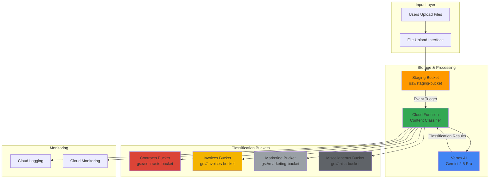

# Smart Content Classification with Gemini and Cloud Storage

## Problem

Modern organizations receive thousands of documents, images, and multimedia files daily through various channels, creating massive unorganized data repositories that make content discovery and compliance nearly impossible. Manual classification is time-consuming, inconsistent, and doesn't scale with business growth, while traditional keyword-based systems fail to understand context, sentiment, and complex business relationships across different content types.

## Solution

Build an intelligent content classification system that leverages Gemini 2.5's multimodal capabilities to automatically analyze uploaded files in Cloud Storage, extracting content meaning, sentiment, and business context to categorize documents into organized folder structures. This event-driven architecture uses Cloud Functions to trigger AI analysis upon file uploads, enabling real-time content organization with human-level understanding.

## Architecture Diagram



## Prerequisites

1. Google Cloud account with billing enabled and Vertex AI API access
2. Google Cloud CLI (gcloud) installed and authenticated
3. Basic understanding of Cloud Storage bucket management and event-driven architectures
4. Python 3.9+ knowledge for Cloud Functions development
5. Estimated cost: $15-25 per month for moderate usage (1000 files/month, Gemini 2.5 Pro calls)

> **Note**: Gemini 2.5 Pro provides the most advanced reasoning capabilities for complex content classification but consider Gemini 2.5 Flash for high-volume, cost-sensitive operations.

## Preparation

Google Cloud Functions with event triggers provide serverless, automatic scaling for file processing workflows. Setting up the foundational infrastructure establishes the event-driven pipeline that will respond to Cloud Storage object creation events with zero manual intervention.

```bash
# Set environment variables for GCP resources
export PROJECT_ID="content-classifier-$(date +%s)"
export REGION="us-central1"
export ZONE="us-central1-a"

# Generate unique suffix for resource names
RANDOM_SUFFIX=$(openssl rand -hex 3)

# Set default project and region configuration
gcloud config set project ${PROJECT_ID}
gcloud config set compute/region ${REGION}
gcloud config set compute/zone ${ZONE}

# Enable required APIs for the content classification pipeline
gcloud services enable artifactregistry.googleapis.com \
    cloudbuild.googleapis.com \
    cloudfunctions.googleapis.com \
    eventarc.googleapis.com \
    logging.googleapis.com \
    storage.googleapis.com \
    aiplatform.googleapis.com \
    run.googleapis.com

echo "✅ Project configured: ${PROJECT_ID}"
echo "✅ Required APIs enabled for content classification"
```

The API enablement creates the foundation for event-driven content processing, with Vertex AI providing the intelligence layer and Cloud Functions handling the orchestration between storage events and AI analysis.

## Steps

1. **Create Cloud Storage Buckets for Classification Pipeline**:

   Cloud Storage buckets serve as the foundation for the content classification system, with each bucket representing a different content category. The staging bucket receives all incoming files, while classification buckets store files organized by AI-determined categories, enabling efficient content discovery and compliance management.

   ```bash
   # Create staging bucket for incoming files
   export STAGING_BUCKET="staging-content-${RANDOM_SUFFIX}"
   gsutil mb -p ${PROJECT_ID} \
       -c STANDARD \
       -l ${REGION} \
       gs://${STAGING_BUCKET}
   
   # Create classification buckets for organized content
   export CONTRACTS_BUCKET="contracts-${RANDOM_SUFFIX}"
   export INVOICES_BUCKET="invoices-${RANDOM_SUFFIX}"
   export MARKETING_BUCKET="marketing-${RANDOM_SUFFIX}"
   export MISC_BUCKET="miscellaneous-${RANDOM_SUFFIX}"
   
   # Create all classification buckets
   for bucket in ${CONTRACTS_BUCKET} ${INVOICES_BUCKET} \
     ${MARKETING_BUCKET} ${MISC_BUCKET}; do
       gsutil mb -p ${PROJECT_ID} \
           -c STANDARD \
           -l ${REGION} \
           gs://${bucket}
   done
   
   echo "✅ Created staging bucket: gs://${STAGING_BUCKET}"
   echo "✅ Created classification buckets for content organization"
   ```

   The multi-bucket architecture enables automatic content segregation based on AI classification results, supporting both compliance requirements and content discovery workflows across different business functions.

2. **Create Service Account for Cloud Function**:

   Service accounts provide secure, least-privilege access for Cloud Functions to interact with Vertex AI and Cloud Storage. This configuration follows Google Cloud security best practices by granting only the permissions necessary for content classification operations.

   ```bash
   # Create service account for content classification function
   export SERVICE_ACCOUNT="content-classifier-sa"
   gcloud iam service-accounts create ${SERVICE_ACCOUNT} \
       --display-name="Content Classifier Service Account" \
       --description="Service account for AI-powered content classification"
   
   # Assign necessary IAM roles for Vertex AI and Storage access
   gcloud projects add-iam-policy-binding ${PROJECT_ID} \
       --member="serviceAccount:${SERVICE_ACCOUNT}@${PROJECT_ID}.iam.gserviceaccount.com" \
       --role="roles/aiplatform.user"
   
   gcloud projects add-iam-policy-binding ${PROJECT_ID} \
       --member="serviceAccount:${SERVICE_ACCOUNT}@${PROJECT_ID}.iam.gserviceaccount.com" \
       --role="roles/storage.admin"
   
   gcloud projects add-iam-policy-binding ${PROJECT_ID} \
       --member="serviceAccount:${SERVICE_ACCOUNT}@${PROJECT_ID}.iam.gserviceaccount.com" \
       --role="roles/logging.logWriter"
   
   echo "✅ Service account created with appropriate permissions"
   ```

   The role assignments enable the function to analyze content with Vertex AI, move files between buckets, and log classification activities for monitoring and audit purposes.

3. **Create Cloud Function Source Code**:

   The Cloud Function orchestrates the content classification workflow by receiving Cloud Storage events, analyzing content with Gemini 2.5, and organizing files based on AI-determined categories. The multimodal capabilities enable classification of text documents, images, and mixed content types.

   ```bash
   # Create function directory and source files
   mkdir -p cloud-function
   cd cloud-function
   
   # Create requirements.txt for dependencies
   cat > requirements.txt << 'EOF'
google-cloud-aiplatform==1.70.0
google-cloud-storage==2.18.0
google-cloud-logging==3.11.0
functions-framework==3.8.0
Pillow==10.4.0
EOF
   
   # Create main.py with content classification logic
   cat > main.py << 'EOF'
import json
import logging
import os
from google.cloud import aiplatform
from google.cloud import storage
from google.cloud import logging as cloud_logging
import vertexai
from vertexai.generative_models import GenerativeModel, Part
import mimetypes

# Initialize cloud logging
cloud_logging.Client().setup_logging()
logger = logging.getLogger(__name__)

# Initialize Vertex AI
PROJECT_ID = os.environ.get('GCP_PROJECT')
REGION = os.environ.get('FUNCTION_REGION', 'us-central1')
vertexai.init(project=PROJECT_ID, location=REGION)

# Initialize clients
storage_client = storage.Client()
model = GenerativeModel("gemini-2.5-pro")

# Classification bucket mapping
CLASSIFICATION_BUCKETS = {
    'contracts': os.environ.get('CONTRACTS_BUCKET'),
    'invoices': os.environ.get('INVOICES_BUCKET'),
    'marketing': os.environ.get('MARKETING_BUCKET'),
    'miscellaneous': os.environ.get('MISC_BUCKET')
}

def classify_content_with_gemini(file_content, file_name, mime_type):
    """Classify content using Gemini 2.5 multimodal capabilities."""
    
    classification_prompt = """
    Analyze the provided content and classify it into one of these categories:
    
    1. CONTRACTS: Legal agreements, terms of service, NDAs, employment contracts, vendor agreements
    2. INVOICES: Bills, receipts, purchase orders, financial statements, payment requests
    3. MARKETING: Promotional materials, advertisements, brochures, marketing campaigns, social media content
    4. MISCELLANEOUS: Any content that doesn't fit the above categories
    
    Consider:
    - Document structure and layout
    - Text content and terminology
    - Visual elements and design
    - Business context and purpose
    
    Respond with ONLY the category name (contracts, invoices, marketing, or miscellaneous).
    Provide your reasoning in a second line.
    """
    
    try:
        # Handle different content types
        if mime_type.startswith('image/'):
            # Image content
            image_part = Part.from_data(file_content, mime_type)
            response = model.generate_content([classification_prompt, image_part])
        elif mime_type.startswith('text/') or 'document' in mime_type:
            # Text content
            if isinstance(file_content, bytes):
                text_content = file_content.decode('utf-8', errors='ignore')
            else:
                text_content = str(file_content)
            
            combined_prompt = f"{classification_prompt}\n\nContent to classify:\n{text_content[:2000]}"
            response = model.generate_content(combined_prompt)
        else:
            # Default handling for other file types
            combined_prompt = f"{classification_prompt}\n\nFile: {file_name}\nMIME Type: {mime_type}"
            response = model.generate_content(combined_prompt)
        
        # Extract classification from response
        response_text = response.text.strip().lower()
        lines = response_text.split('\n')
        classification = lines[0].strip()
        reasoning = lines[1] if len(lines) > 1 else "No reasoning provided"
        
        # Validate classification
        if classification in CLASSIFICATION_BUCKETS:
            return classification, reasoning
        else:
            return 'miscellaneous', f"Unknown classification: {classification}"
            
    except Exception as e:
        logger.error(f"Error in Gemini classification: {e}")
        return 'miscellaneous', f"Classification error: {str(e)}"

def move_file_to_classified_bucket(source_bucket, source_blob_name, classification):
    """Move file to appropriate classification bucket."""
    
    try:
        target_bucket_name = CLASSIFICATION_BUCKETS[classification]
        if not target_bucket_name:
            logger.error(f"No bucket configured for classification: {classification}")
            return False
        
        # Get source blob
        source_bucket_obj = storage_client.bucket(source_bucket)
        source_blob = source_bucket_obj.blob(source_blob_name)
        
        # Get target bucket
        target_bucket_obj = storage_client.bucket(target_bucket_name)
        
        # Copy to target bucket
        target_blob = target_bucket_obj.blob(source_blob_name)
        target_blob.upload_from_string(
            source_blob.download_as_bytes(),
            content_type=source_blob.content_type
        )
        
        # Add metadata
        target_blob.metadata = {
            'classification': classification,
            'classified_by': 'gemini-2.5-pro',
            'original_bucket': source_bucket
        }
        target_blob.patch()
        
        # Delete from source
        source_blob.delete()
        
        logger.info(f"Moved {source_blob_name} to {target_bucket_name}")
        return True
        
    except Exception as e:
        logger.error(f"Error moving file: {e}")
        return False

def content_classifier(cloud_event):
    """Main Cloud Function entry point."""
    
    try:
        # Extract event data
        data = cloud_event.data
        bucket_name = data['bucket']
        blob_name = data['name']
        
        logger.info(f"Processing file: {blob_name} from bucket: {bucket_name}")
        
        # Skip if already in a classification bucket
        if bucket_name in CLASSIFICATION_BUCKETS.values():
            logger.info(f"File already in classification bucket, skipping")
            return
        
        # Download file content
        bucket = storage_client.bucket(bucket_name)
        blob = bucket.blob(blob_name)
        
        # Get file metadata
        blob.reload()
        mime_type = blob.content_type or mimetypes.guess_type(blob_name)[0] or 'application/octet-stream'
        
        # Download content (limit size for processing)
        if blob.size > 10 * 1024 * 1024:  # 10MB limit
            logger.warning(f"File too large for processing: {blob.size} bytes")
            classification = 'miscellaneous'
            reasoning = "File too large for content analysis"
        else:
            file_content = blob.download_as_bytes()
            classification, reasoning = classify_content_with_gemini(file_content, blob_name, mime_type)
        
        logger.info(f"Classification: {classification}, Reasoning: {reasoning}")
        
        # Move file to appropriate bucket
        success = move_file_to_classified_bucket(bucket_name, blob_name, classification)
        
        if success:
            logger.info(f"Successfully classified and moved {blob_name} to {classification}")
        else:
            logger.error(f"Failed to move {blob_name} to {classification}")
        
    except Exception as e:
        logger.error(f"Error in content classification: {e}")

if __name__ == "__main__":
    # For local testing
    print("Content Classifier Cloud Function")
EOF
   
   echo "✅ Cloud Function source code created with Gemini 2.5 integration"
   ```

   The function implements a comprehensive classification workflow that handles multiple file types, uses Gemini 2.5's advanced reasoning capabilities, and includes error handling and logging for production reliability.

4. **Deploy Cloud Function with Storage Trigger**:

   Cloud Functions deployment with Eventarc triggers creates the event-driven processing pipeline that automatically responds to Cloud Storage object creation events. The function configuration optimizes for content processing workloads with appropriate memory allocation and timeout settings.

   ```bash
   # Deploy Cloud Function with Cloud Storage trigger
   gcloud functions deploy content-classifier \
       --gen2 \
       --runtime python39 \
       --source . \
       --entry-point content_classifier \
       --trigger-event-filters="type=google.cloud.storage.object.v1.finalized" \
       --trigger-event-filters="bucket=${STAGING_BUCKET}" \
       --service-account="${SERVICE_ACCOUNT}@${PROJECT_ID}.iam.gserviceaccount.com" \
       --memory 1024MB \
       --timeout 540s \
       --max-instances 10 \
       --set-env-vars="CONTRACTS_BUCKET=${CONTRACTS_BUCKET},INVOICES_BUCKET=${INVOICES_BUCKET},MARKETING_BUCKET=${MARKETING_BUCKET},MISC_BUCKET=${MISC_BUCKET}" \
       --region ${REGION}
   
   # Wait for deployment to complete
   echo "⏳ Waiting for function deployment to complete..."
   sleep 30
   
   echo "✅ Cloud Function deployed with storage trigger"
   echo "✅ Function will automatically process files uploaded to gs://${STAGING_BUCKET}"
   ```

   The deployment configuration includes appropriate resource allocation for AI processing, environment variables for bucket routing, and trigger configuration that responds to file upload events in real-time.

5. **Create Sample Test Files**:

   Sample test files demonstrate the classification system's capabilities across different content types and business contexts. These files help validate the AI's understanding of document structure, content meaning, and business categorization logic.

   ```bash
   # Return to parent directory
   cd ..
   
   # Create sample contract document
   cat > sample_contract.txt << 'EOF'
NON-DISCLOSURE AGREEMENT

This Non-Disclosure Agreement ("Agreement") is entered into on [Date] by and between:

Company ABC, a corporation organized under the laws of [State] ("Disclosing Party")
Company XYZ, a corporation organized under the laws of [State] ("Receiving Party")

WHEREAS, the parties wish to engage in discussions regarding potential business opportunities;
WHEREAS, such discussions may involve disclosure of confidential information;

NOW THEREFORE, the parties agree as follows:

1. CONFIDENTIAL INFORMATION: Any information disclosed by one party to the other, whether oral, written, or electronic, shall be considered confidential.

2. NON-DISCLOSURE: The Receiving Party agrees not to disclose any confidential information to third parties.

3. TERM: This Agreement shall remain in effect for a period of three (3) years from the date of execution.

IN WITNESS WHEREOF, the parties have executed this Agreement.
EOF
   
   # Create sample invoice document
   cat > sample_invoice.txt << 'EOF'
INVOICE

Invoice Number: INV-2025-001
Date: January 15, 2025

Bill To:
ABC Corporation
123 Business Street
City, State 12345

From:
XYZ Services LLC
456 Service Avenue
City, State 67890

Description                    Quantity    Rate        Total
Professional Services         40 hours    $150/hour   $6,000.00
Project Management            1 month     $2,000      $2,000.00
                                                      ----------
                                          Subtotal:   $8,000.00
                                          Tax (8.5%): $680.00
                                          TOTAL:      $8,680.00

Payment Terms: Net 30 days
Due Date: February 14, 2025

Thank you for your business!
EOF
   
   # Create sample marketing content
   cat > sample_marketing.txt << 'EOF'
EXCITING NEW PRODUCT LAUNCH!

🚀 Introducing CloudMax Pro - The Future of Cloud Computing

Are you ready to revolutionize your business operations?

CloudMax Pro delivers:
✅ 99.99% uptime guarantee
✅ Lightning-fast performance
✅ Enterprise-grade security
✅ 24/7 expert support

LIMITED TIME OFFER: 50% OFF your first year!

Join thousands of satisfied customers who have transformed their business with CloudMax Pro.

Don't miss out - this exclusive offer expires January 31st!

CLICK HERE TO GET STARTED TODAY!

Contact us: sales@cloudmax.com | 1-800-CLOUDMAX
Follow us on social media for more updates and special offers!

#CloudComputing #DigitalTransformation #TechInnovation
EOF
   
   echo "✅ Sample test files created for classification testing"
   ```

   The sample files represent common business document types with distinctive formatting, terminology, and structural elements that enable effective AI classification testing and validation.

6. **Upload Test Files and Trigger Classification**:

   File uploads to the staging bucket trigger the automatic classification workflow, demonstrating the real-time content processing capabilities. The system analyzes content using Gemini 2.5's multimodal understanding and routes files to appropriate destination buckets.

   ```bash
   # Upload sample files to staging bucket to trigger classification
   gsutil cp sample_contract.txt gs://${STAGING_BUCKET}/
   gsutil cp sample_invoice.txt gs://${STAGING_BUCKET}/
   gsutil cp sample_marketing.txt gs://${STAGING_BUCKET}/
   
   echo "✅ Test files uploaded to staging bucket"
   echo "⏳ Cloud Function will automatically process files and classify them"
   echo "⏳ This may take 30-60 seconds for AI analysis and file movement"
   
   # Wait for processing to complete
   sleep 60
   ```

   The file upload process triggers the event-driven pipeline, with Cloud Functions receiving storage events and initiating AI-powered content analysis using Vertex AI's Gemini 2.5 model for intelligent classification.

## Validation & Testing

1. **Verify Function Execution and Logs**:

   ```bash
   # Check Cloud Function logs for classification results
   gcloud functions logs read content-classifier \
       --region ${REGION} \
       --limit 20 \
       --format "value(timestamp,message)"
   ```

   Expected output: Function execution logs showing file processing, Gemini API calls, and file movement operations with classification results.

2. **Verify File Classification and Organization**:

   ```bash
   # Check each classification bucket for properly organized files
   echo "=== Contracts Bucket ==="
   gsutil ls -la gs://${CONTRACTS_BUCKET}/
   
   echo "=== Invoices Bucket ==="
   gsutil ls -la gs://${INVOICES_BUCKET}/
   
   echo "=== Marketing Bucket ==="
   gsutil ls -la gs://${MARKETING_BUCKET}/
   
   echo "=== Miscellaneous Bucket ==="
   gsutil ls -la gs://${MISC_BUCKET}/
   
   echo "=== Staging Bucket (should be empty) ==="
   gsutil ls -la gs://${STAGING_BUCKET}/
   ```

   Expected output: Files should be distributed across classification buckets based on their content, with the staging bucket empty after processing.

3. **Test Classification Accuracy with Additional Files**:

   ```bash
   # Create and upload additional test files
   echo "Purchase Order #PO-2025-100 - Office Supplies" > test_invoice.txt
   echo "Join our exclusive webinar on digital transformation!" > test_marketing.txt
   
   gsutil cp test_invoice.txt gs://${STAGING_BUCKET}/
   gsutil cp test_marketing.txt gs://${STAGING_BUCKET}/
   
   # Wait and verify classification
   sleep 30
   gsutil ls gs://${INVOICES_BUCKET}/test_invoice.txt
   gsutil ls gs://${MARKETING_BUCKET}/test_marketing.txt
   ```

   Expected output: New files should be correctly classified and moved to appropriate buckets, demonstrating consistent AI performance.

## Cleanup

1. **Remove Cloud Function and Event Triggers**:

   ```bash
   # Delete Cloud Function
   gcloud functions delete content-classifier \
       --region ${REGION} \
       --quiet
   
   echo "✅ Cloud Function deleted"
   ```

2. **Remove All Storage Buckets and Contents**:

   ```bash
   # Delete all buckets and their contents
   gsutil -m rm -r gs://${STAGING_BUCKET}
   gsutil -m rm -r gs://${CONTRACTS_BUCKET}
   gsutil -m rm -r gs://${INVOICES_BUCKET}
   gsutil -m rm -r gs://${MARKETING_BUCKET}
   gsutil -m rm -r gs://${MISC_BUCKET}
   
   echo "✅ All storage buckets deleted"
   ```

3. **Remove Service Account and Local Files**:

   ```bash
   # Delete service account
   gcloud iam service-accounts delete \
       "${SERVICE_ACCOUNT}@${PROJECT_ID}.iam.gserviceaccount.com" \
       --quiet
   
   # Remove local files
   rm -rf cloud-function/
   rm -f sample_*.txt test_*.txt
   
   # Clear environment variables
   unset PROJECT_ID REGION ZONE RANDOM_SUFFIX
   unset STAGING_BUCKET CONTRACTS_BUCKET INVOICES_BUCKET MARKETING_BUCKET MISC_BUCKET
   unset SERVICE_ACCOUNT
   
   echo "✅ Service account deleted and local files cleaned up"
   ```

## Discussion

This content classification system demonstrates the power of combining Google Cloud's serverless architecture with Gemini 2.5's advanced AI capabilities to solve real-world business challenges. The event-driven design using Cloud Functions and Eventarc creates a scalable, cost-effective solution that processes content automatically without manual intervention, while Gemini 2.5's multimodal understanding enables sophisticated classification across text, images, and mixed content types.

The architecture follows Google Cloud's Well-Architected Framework principles by implementing operational excellence through automated monitoring and logging, security through least-privilege service accounts and IAM controls, reliability through serverless scaling and error handling, and cost optimization through pay-per-use pricing models. The system scales automatically based on file upload volume, with Cloud Functions providing zero-infrastructure-management serverless execution and Vertex AI offering enterprise-grade AI capabilities with built-in security and compliance features.

Key architectural decisions include using separate buckets for each content category to enable simple file discovery and compliance management, implementing comprehensive error handling and logging for production reliability, and leveraging Gemini 2.5 Pro for maximum classification accuracy while providing configuration options for cost optimization. The classification logic considers both document structure and semantic content meaning, enabling accurate categorization even for ambiguous or mixed-content files that traditional keyword-based systems would misclassify.

Performance optimization strategies include file size limits to manage processing costs, configurable memory allocation for Cloud Functions based on content complexity, and automatic scaling configuration to handle traffic spikes. The system provides extensive monitoring through Cloud Logging and can be extended with Cloud Monitoring alerts for classification accuracy tracking and error rate monitoring. For high-volume scenarios, consider implementing batch processing workflows or using Gemini 2.5 Flash for cost-effective classification of simple document types.

> **Tip**: For production deployments, implement content validation workflows and human-in-the-loop verification for high-sensitivity classifications. Consider using Cloud DLP API alongside Gemini classification for compliance-sensitive content identification and automated redaction workflows.

**Documentation Sources:**
- [Vertex AI Gemini 2.5 Pro Model Documentation](https://cloud.google.com/vertex-ai/generative-ai/docs/models/gemini/2-5-pro)
- [Cloud Functions Event-Driven Architecture Guide](https://cloud.google.com/functions/docs/writing/write-event-driven-functions)
- [Cloud Storage Automated Classification Best Practices](https://cloud.google.com/sensitive-data-protection/docs/automating-classification-of-data-uploaded-to-cloud-storage)
- [Google Cloud Architecture Framework](https://cloud.google.com/architecture/framework)
- [Eventarc Storage Triggers Documentation](https://cloud.google.com/run/docs/triggering/storage-triggers)

## Challenge

Extend this content classification system with these advanced capabilities:

1. **Multi-Language Support**: Implement classification for documents in multiple languages using Gemini's multilingual capabilities and Cloud Translation API for content normalization, enabling global content organization workflows.

2. **Confidence Scoring and Human Review**: Add classification confidence scoring using Gemini's response analysis and implement human review workflows for low-confidence classifications using Cloud Tasks and Cloud Workflows for approval processes.

3. **Advanced Content Analytics**: Integrate BigQuery for classification analytics, trend analysis, and compliance reporting, with Looker dashboards for business intelligence and content governance insights across organizational content repositories.

4. **Real-time Content Search**: Implement full-text search capabilities using Cloud Search or Elasticsearch integration, with AI-powered semantic search using Vertex AI embeddings for advanced content discovery and knowledge management.

5. **Compliance and Audit Workflows**: Add automated compliance checking using Cloud DLP API for sensitive data detection, implement audit trails with Cloud Asset Inventory, and create automated retention policies based on content classification and regulatory requirements.

## Infrastructure Code

### Available Infrastructure as Code:

- [Infrastructure Code Overview](code/README.md) - Detailed description of all infrastructure components
- [Infrastructure Manager](code/infrastructure-manager/) - GCP Infrastructure Manager templates
- [Bash CLI Scripts](code/scripts/) - Example bash scripts using gcloud CLI commands to deploy infrastructure
- [Terraform](code/terraform/) - Terraform configuration files