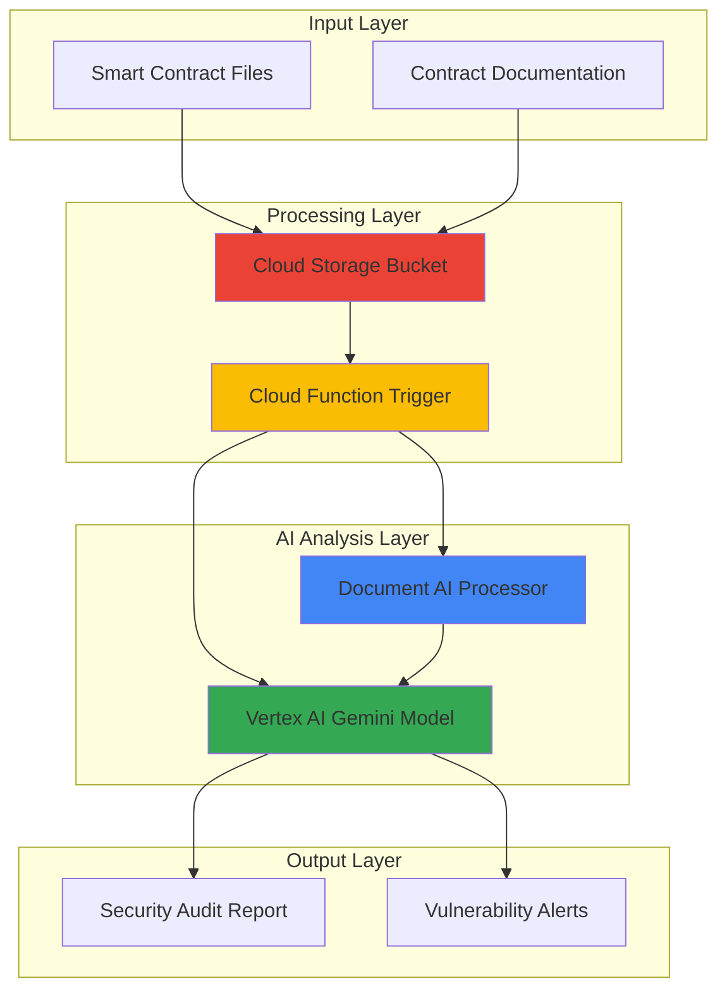

# Smart Contract Security Auditing with Document AI and Vertex AI

## Problem

Enterprise blockchain development teams face critical security challenges when auditing smart contracts for vulnerabilities like reentrancy attacks, integer overflows, and access control flaws. With over $1.42 billion lost to smart contract vulnerabilities in 2024 alone, manual code review processes are insufficient for identifying the sophisticated attack vectors that characterize modern blockchain threats. Organizations need automated, AI-powered solutions that can systematically analyze contract code, documentation, and audit reports to detect security risks and ensure compliance with industry standards.

## Solution

This solution creates an automated smart contract security auditing pipeline using Google Cloud's Document AI for contract document parsing and Vertex AI for intelligent vulnerability detection. The system processes smart contract source code files, extracts security-relevant patterns using Document AI's advanced text processing capabilities, and employs Vertex AI's generative models to identify potential vulnerabilities based on OWASP Smart Contract Top 10 security patterns. Cloud Functions orchestrate the analysis workflow while Cloud Storage manages contract artifacts and audit reports.

## Architecture Diagram



## Prerequisites

1. Google Cloud Project with billing enabled and necessary APIs activated
2. Google Cloud CLI installed and authenticated with Document AI Editor and Vertex AI User roles
3. Knowledge of smart contract development, Solidity programming, and blockchain security concepts
4. Understanding of Google Cloud serverless services and AI/ML APIs
5. Estimated cost: $15-25 for Document AI processing, Vertex AI inference, and Cloud Functions execution during recipe completion

> **Note**: This advanced recipe requires familiarity with blockchain security principles and Google Cloud AI services for optimal implementation results.

## Preparation

```bash
# Set environment variables for GCP resources
export PROJECT_ID="smart-contract-audit-$(date +%s)"
export REGION="us-central1"
export ZONE="us-central1-a"

# Generate unique suffix for resource names
RANDOM_SUFFIX=$(openssl rand -hex 3)
export BUCKET_NAME="contract-audit-${RANDOM_SUFFIX}"
export FUNCTION_NAME="contract-security-analyzer"

# Set default project and region
gcloud config set project ${PROJECT_ID}
gcloud config set compute/region ${REGION}
gcloud config set compute/zone ${ZONE}

# Enable required APIs for Document AI, Vertex AI, and Cloud Functions
gcloud services enable documentai.googleapis.com
gcloud services enable aiplatform.googleapis.com
gcloud services enable cloudfunctions.googleapis.com
gcloud services enable storage.googleapis.com
gcloud services enable eventarc.googleapis.com
gcloud services enable artifactregistry.googleapis.com

echo "✅ Project configured: ${PROJECT_ID}"
echo "✅ APIs enabled for smart contract security analysis"
```

## Steps

1. **Create Cloud Storage Bucket for Contract Artifacts**:

   Cloud Storage provides the foundation for our smart contract security pipeline by securely storing contract source code, documentation, and generated audit reports. Configuring lifecycle policies and versioning ensures comprehensive audit trails while maintaining cost efficiency for large-scale contract analysis workflows.

   ```bash
   # Create storage bucket with uniform access control
   gsutil mb -p ${PROJECT_ID} \
       -c STANDARD \
       -l ${REGION} \
       gs://${BUCKET_NAME}
   
   # Enable versioning for audit trail compliance
   gsutil versioning set on gs://${BUCKET_NAME}
   
   # Set bucket lifecycle policy for cost optimization
   echo '{
     "lifecycle": {
       "rule": [
         {
           "action": {"type": "SetStorageClass", "storageClass": "NEARLINE"},
           "condition": {"age": 30}
         }
       ]
     }
   }' > lifecycle.json
   
   gsutil lifecycle set lifecycle.json gs://${BUCKET_NAME}
   
   echo "✅ Storage bucket created: gs://${BUCKET_NAME}"
   ```

   The storage bucket now serves as the central repository for all contract security artifacts, with automated lifecycle management to optimize costs while maintaining compliance requirements for enterprise blockchain development.

2. **Create Document AI Processor for Contract Analysis**:

   Document AI processors provide specialized capabilities for extracting structured data from smart contract documentation and source code files. The form parser processor excels at identifying key-value pairs, function signatures, and security annotations that are critical for comprehensive vulnerability assessment.

   ```bash
   # Create Document AI processor for smart contract parsing
   gcloud documentai processors create \
       --location=${REGION} \
       --display-name="Smart Contract Security Parser" \
       --type="FORM_PARSER_PROCESSOR"
   
   # Get the processor ID for use in Cloud Functions
   export PROCESSOR_ID=$(gcloud documentai processors list \
       --location=${REGION} \
       --filter="displayName:'Smart Contract Security Parser'" \
       --format="value(name)" | cut -d'/' -f6)
   
   echo "✅ Document AI processor created: ${PROCESSOR_ID}"
   echo "Processor location: projects/${PROJECT_ID}/locations/${REGION}/processors/${PROCESSOR_ID}"
   ```

   The Document AI processor is now configured to extract structured information from smart contract files, enabling automated identification of security-relevant code patterns and documentation elements.

3. **Prepare Cloud Function Source Code for Security Analysis**:

   Cloud Functions orchestrate the security analysis workflow by integrating Document AI's text extraction capabilities with Vertex AI's advanced reasoning models. This serverless approach ensures scalable processing of contract uploads while maintaining cost efficiency through pay-per-execution pricing.

   ```bash
   # Create function source directory
   mkdir -p contract-security-function
   cd contract-security-function
   
   # Create main function file with security analysis logic
   cat > main.py << 'EOF'
import functions_framework
from google.cloud import documentai_v1 as documentai
from google.cloud import aiplatform
from google.cloud import storage
import json
import os
import re
from typing import Dict, List

# Initialize clients
storage_client = storage.Client()
docai_client = documentai.DocumentProcessorServiceClient()

@functions_framework.cloud_event
def analyze_contract_security(cloud_event):
    """Analyze smart contract for security vulnerabilities using Document AI and Vertex AI"""
    
    # Extract file information from Cloud Storage event
    data = cloud_event.data
    bucket_name = data['bucket']
    file_name = data['name']
    
    print(f"Processing contract file: {file_name}")
    
    # Download contract file from Cloud Storage
    bucket = storage_client.bucket(bucket_name)
    blob = bucket.blob(file_name)
    
    if not file_name.endswith(('.sol', '.txt', '.md', '.pdf')):
        print(f"Skipping non-contract file: {file_name}")
        return
    
    # Extract text using Document AI
    extracted_text = process_with_document_ai(blob)
    
    # Analyze for security vulnerabilities using Vertex AI
    vulnerability_report = analyze_with_vertex_ai(extracted_text, file_name)
    
    # Save audit report to Cloud Storage
    save_audit_report(bucket, file_name, vulnerability_report)
    
    print(f"Security analysis completed for: {file_name}")

def process_with_document_ai(blob) -> str:
    """Extract text from contract file using Document AI"""
    
    project_id = os.environ.get('GCP_PROJECT')
    location = os.environ.get('PROCESSOR_LOCATION', 'us-central1')
    processor_id = os.environ.get('PROCESSOR_ID')
    
    # Read file content
    file_content = blob.download_as_bytes()
    
    # Create Document AI request
    name = f"projects/{project_id}/locations/{location}/processors/{processor_id}"
    
    request = documentai.ProcessRequest(
        name=name,
        raw_document=documentai.RawDocument(
            content=file_content,
            mime_type=get_mime_type(blob.name)
        )
    )
    
    # Process document
    result = docai_client.process_document(request=request)
    document = result.document
    
    return document.text

def get_mime_type(filename: str) -> str:
    """Determine MIME type based on file extension"""
    
    if filename.endswith('.pdf'):
        return 'application/pdf'
    elif filename.endswith(('.sol', '.txt', '.md')):
        return 'text/plain'
    else:
        return 'application/octet-stream'

def analyze_with_vertex_ai(contract_text: str, filename: str) -> Dict:
    """Analyze contract for security vulnerabilities using Vertex AI"""
    
    # Initialize Vertex AI
    aiplatform.init(project=os.environ.get('GCP_PROJECT'), location=os.environ.get('PROCESSOR_LOCATION', 'us-central1'))
    
    # Security analysis prompt based on OWASP Smart Contract Top 10
    security_prompt = f"""
    Analyze the following smart contract for security vulnerabilities based on the OWASP Smart Contract Top 10 (2025):

    Contract File: {filename}
    Contract Code:
    {contract_text}

    Please identify and analyze potential vulnerabilities in these categories:
    1. Access Control Flaws - Check for missing or improper access modifiers
    2. Logic Errors - Look for calculation errors, race conditions, or flawed business logic
    3. Lack of Input Validation - Identify missing input checks and validation
    4. Reentrancy Vulnerabilities - Check for state changes after external calls
    5. Integer Overflow/Underflow - Look for arithmetic operations without safe math
    6. Gas Limit Issues - Identify unbounded loops or expensive operations
    7. Timestamp Dependence - Check for reliance on block.timestamp
    8. Front-running Vulnerabilities - Look for transaction ordering dependencies
    9. Denial of Service - Identify potential DoS attack vectors
    10. Cryptographic Issues - Check for weak randomness or poor key management

    For each vulnerability found, provide:
    - Severity Level (Critical/High/Medium/Low)
    - Line numbers or code sections affected
    - Detailed explanation of the vulnerability
    - Recommended remediation steps
    - Code examples of secure alternatives

    Format your response as JSON with the following structure:
    {{
        "contract_name": "{filename}",
        "overall_risk_score": "1-10",
        "vulnerabilities_found": [],
        "recommendations": [],
        "compliance_status": "Pass/Fail/Needs Review"
    }}
    """
    
    try:
        # Use Gemini Pro for analysis
        from vertexai.generative_models import GenerativeModel
        
        model = GenerativeModel("gemini-1.5-pro")
        response = model.generate_content(security_prompt)
        
        # Parse response as JSON
        try:
            vulnerability_report = json.loads(response.text)
        except json.JSONDecodeError:
            # Fallback if response isn't valid JSON
            vulnerability_report = {
                "contract_name": filename,
                "overall_risk_score": "5",
                "vulnerabilities_found": [response.text],
                "recommendations": ["Review the analysis above for detailed findings"],
                "compliance_status": "Needs Review"
            }
        
        return vulnerability_report
        
    except Exception as e:
        print(f"Error in Vertex AI analysis: {str(e)}")
        return {
            "contract_name": filename,
            "error": str(e),
            "status": "Analysis Failed"
        }

def save_audit_report(bucket, original_filename: str, report: Dict):
    """Save security audit report to Cloud Storage"""
    
    # Create report filename
    base_name = original_filename.split('.')[0]
    report_filename = f"audit-reports/{base_name}_security_audit.json"
    
    # Upload report to Cloud Storage
    report_blob = bucket.blob(report_filename)
    report_blob.upload_from_string(
        json.dumps(report, indent=2),
        content_type='application/json'
    )
    
    print(f"Audit report saved: {report_filename}")
EOF
   
   # Create requirements.txt for Cloud Function dependencies
   cat > requirements.txt << 'EOF'
functions-framework==3.*
google-cloud-documentai==2.*
google-cloud-aiplatform==1.*
google-cloud-storage==2.*
google-cloud-core==2.*
vertexai==1.*
EOF
   
   echo "✅ Cloud Function source code created"
   cd ..
   ```

   The Cloud Function source code integrates Document AI for text extraction with Vertex AI's Gemini model for sophisticated security analysis, implementing industry-standard vulnerability detection based on the OWASP Smart Contract Top 10 framework.

4. **Deploy Cloud Function with Storage Trigger**:

   Deploying the Cloud Function with Cloud Storage trigger enables automatic security analysis whenever new smart contract files are uploaded. The event-driven architecture ensures immediate processing while maintaining scalability for enterprise development workflows with multiple concurrent contract uploads.

   ```bash
   # Deploy Cloud Function with Cloud Storage trigger
   gcloud functions deploy ${FUNCTION_NAME} \
       --gen2 \
       --region=${REGION} \
       --runtime=python311 \
       --source=./contract-security-function \
       --entry-point=analyze_contract_security \
       --trigger-bucket=${BUCKET_NAME} \
       --memory=1GB \
       --timeout=540s \
       --set-env-vars=PROCESSOR_ID=${PROCESSOR_ID},PROCESSOR_LOCATION=${REGION}
   
   echo "✅ Cloud Function deployed: ${FUNCTION_NAME}"
   echo "Function will trigger on uploads to: gs://${BUCKET_NAME}"
   ```

   The Cloud Function is now deployed with automatic scaling capabilities and optimized resource allocation for processing smart contract security analysis workloads with enterprise-grade reliability.

5. **Create Sample Smart Contract for Testing**:

   Testing the security analysis pipeline requires realistic smart contract examples that contain common vulnerability patterns. Creating sample contracts with intentional security flaws validates the AI-powered detection capabilities and demonstrates the system's effectiveness in identifying real-world threats.

   ```bash
   # Create sample smart contract with security vulnerabilities
   cat > sample_vulnerable_contract.sol << 'EOF'
// SPDX-License-Identifier: MIT
pragma solidity ^0.8.0;

contract VulnerableBank {
    mapping(address => uint256) public balances;
    mapping(address => bool) public isAdmin;
    
    event Deposit(address indexed user, uint256 amount);
    event Withdrawal(address indexed user, uint256 amount);
    
    constructor() {
        isAdmin[msg.sender] = true;
    }
    
    // Vulnerability: Missing access control
    function setAdmin(address _admin) public {
        isAdmin[_admin] = true;
    }
    
    function deposit() public payable {
        require(msg.value > 0, "Must deposit positive amount");
        balances[msg.sender] += msg.value;
        emit Deposit(msg.sender, msg.value);
    }
    
    // Vulnerability: Reentrancy attack vector
    function withdraw(uint256 _amount) public {
        require(balances[msg.sender] >= _amount, "Insufficient balance");
        
        // External call before state change - reentrancy vulnerability
        (bool success, ) = msg.sender.call{value: _amount}("");
        require(success, "Transfer failed");
        
        balances[msg.sender] -= _amount;
        emit Withdrawal(msg.sender, _amount);
    }
    
    // Vulnerability: Integer overflow in older Solidity versions
    function unsafeAdd(uint256 a, uint256 b) public pure returns (uint256) {
        return a + b; // Could overflow in Solidity < 0.8.0
    }
    
    // Vulnerability: Timestamp dependence
    function isLuckyTime() public view returns (bool) {
        return block.timestamp % 2 == 0;
    }
    
    // Admin function with proper access control
    function emergencyWithdraw() public {
        require(isAdmin[msg.sender], "Only admin");
        payable(msg.sender).transfer(address(this).balance);
    }
    
    function getBalance() public view returns (uint256) {
        return balances[msg.sender];
    }
}
EOF
   
   # Upload sample contract to trigger analysis
   gsutil cp sample_vulnerable_contract.sol gs://${BUCKET_NAME}/contracts/
   
   echo "✅ Sample vulnerable contract uploaded for analysis"
   ```

   The sample contract contains multiple intentional vulnerabilities including reentrancy, access control flaws, and timestamp dependence, providing comprehensive testing for the AI-powered security analysis pipeline.

6. **Create Contract Documentation for Enhanced Analysis**:

   Contract documentation provides crucial context for security analysis by explaining intended functionality, access patterns, and business logic. Document AI processes this information alongside source code to enable more comprehensive vulnerability detection and compliance assessment.

   ```bash
   # Create contract documentation with security specifications
   cat > contract_security_spec.md << 'EOF'
# VulnerableBank Smart Contract Security Specification

## Contract Overview
VulnerableBank is a demonstration smart contract showing common security vulnerabilities in DeFi applications.

## Security Requirements
- Only contract owner should have admin privileges
- All withdrawals must prevent reentrancy attacks
- Balance updates must occur before external calls
- Input validation required for all public functions
- Time-based logic should not depend on block.timestamp

## Known Vulnerabilities (Intentional)
1. **Access Control**: setAdmin function lacks proper access control
2. **Reentrancy**: withdraw function vulnerable to reentrancy attacks
3. **State Management**: External calls before state updates
4. **Timestamp Dependence**: isLuckyTime relies on block.timestamp

## Compliance Requirements
- Must pass OWASP Smart Contract Top 10 security checks
- Requires integration with OpenZeppelin security libraries
- All admin functions must emit appropriate events

## Audit History
- Initial deployment: Never audited (demonstration purposes)
- Known issues: Multiple critical vulnerabilities present
EOF
   
   # Upload documentation for enhanced analysis context
   gsutil cp contract_security_spec.md gs://${BUCKET_NAME}/documentation/
   
   echo "✅ Contract documentation uploaded for context analysis"
   ```

   The documentation provides structured context that enhances AI analysis by establishing security requirements, compliance standards, and known vulnerability patterns for comprehensive audit coverage.

## Validation & Testing

1. **Verify Cloud Function Execution and Processing**:

   ```bash
   # Check Cloud Function logs for processing activity
   gcloud logging read "resource.type=cloud_function \
       AND resource.labels.function_name=${FUNCTION_NAME}" \
       --limit=10 \
       --format="value(timestamp,severity,textPayload)"
   
   # Verify function deployment status
   gcloud functions describe ${FUNCTION_NAME} \
       --region=${REGION} \
       --format="value(status,updateTime)"
   ```

   Expected output: Function logs showing successful processing of uploaded contract files with Document AI and Vertex AI integration.

2. **Check Generated Security Audit Reports**:

   ```bash
   # List generated audit reports
   gsutil ls gs://${BUCKET_NAME}/audit-reports/
   
   # Download and view security analysis results
   gsutil cp gs://${BUCKET_NAME}/audit-reports/sample_vulnerable_contract_security_audit.json ./
   
   # Display vulnerability findings (requires jq)
   cat sample_vulnerable_contract_security_audit.json | \
       python3 -m json.tool | grep -A 5 '"vulnerabilities_found"'
   ```

   Expected output: JSON audit report containing identified vulnerabilities with severity levels, affected code sections, and remediation recommendations.

3. **Test Document AI Processing Capabilities**:

   ```bash
   # Verify Document AI processor status
   gcloud documentai processors list \
       --location=${REGION} \
       --format="table(name,displayName,state)"
   
   # Check processor processing history
   gcloud logging read "resource.type=documentai_processor" \
       --limit=5 \
       --format="value(timestamp,severity,textPayload)"
   ```

   Expected output: Active Document AI processor with successful text extraction from uploaded contract files.

## Cleanup

1. **Remove Cloud Function and Related Resources**:

   ```bash
   # Delete Cloud Function
   gcloud functions delete ${FUNCTION_NAME} \
       --region=${REGION} \
       --quiet
   
   echo "✅ Cloud Function deleted"
   ```

2. **Delete Document AI Processor**:

   ```bash
   # Delete Document AI processor
   gcloud documentai processors delete \
       projects/${PROJECT_ID}/locations/${REGION}/processors/${PROCESSOR_ID} \
       --quiet
   
   echo "✅ Document AI processor deleted"
   ```

3. **Remove Storage Bucket and Contents**:

   ```bash
   # Delete all objects and bucket
   gsutil -m rm -r gs://${BUCKET_NAME}
   
   echo "✅ Storage bucket and contents deleted"
   ```

4. **Clean Up Local Files and Environment Variables**:

   ```bash
   # Remove local files
   rm -rf contract-security-function/
   rm -f sample_vulnerable_contract.sol
   rm -f contract_security_spec.md
   rm -f lifecycle.json
   rm -f sample_vulnerable_contract_security_audit.json
   
   # Unset environment variables
   unset PROJECT_ID REGION ZONE RANDOM_SUFFIX
   unset BUCKET_NAME FUNCTION_NAME PROCESSOR_ID
   
   echo "✅ Local files and environment cleaned up"
   ```

## Discussion

This smart contract security auditing solution demonstrates the powerful integration of Google Cloud's AI services for automated vulnerability detection in blockchain applications. By combining Document AI's advanced text processing capabilities with Vertex AI's generative models, organizations can implement systematic security analysis that scales across large smart contract portfolios while maintaining consistency with industry security standards.

The architecture leverages Google Cloud's serverless computing model through Cloud Functions, which provides automatic scaling and cost optimization for varying audit workloads. When new smart contracts are uploaded to Cloud Storage, the system immediately triggers comprehensive analysis without requiring dedicated infrastructure management. This event-driven approach ensures rapid security feedback in continuous integration pipelines while supporting enterprise compliance requirements.

Document AI's form parsing capabilities excel at extracting structured information from both source code and documentation, enabling context-aware security analysis that considers intended functionality alongside actual implementation. The integration with Vertex AI's Gemini model provides sophisticated reasoning about complex vulnerability patterns, including subtle logic errors and multi-step attack vectors that traditional static analysis tools might miss. This AI-powered approach adapts to evolving threat landscapes and emerging vulnerability patterns without requiring manual rule updates.

The solution addresses critical pain points in smart contract security by automating the detection of OWASP Smart Contract Top 10 vulnerabilities, which represent the most common and dangerous attack vectors in blockchain applications. With over $1.42 billion lost to smart contract vulnerabilities in 2024, automated security analysis provides essential protection for enterprise blockchain investments while reducing the time and expertise required for comprehensive security reviews.

> **Tip**: Enhance accuracy by training custom Vertex AI models on your organization's specific smart contract patterns and security requirements, enabling more targeted vulnerability detection.

> **Warning**: While AI-powered analysis provides excellent coverage for common vulnerabilities, complex business logic errors may require human expert review for complete security assurance.

### Documentation Sources

This recipe implementation follows Google Cloud best practices and incorporates insights from the following official documentation:

1. [Google Cloud Document AI Overview](https://cloud.google.com/document-ai/docs/overview) - Comprehensive guide to Document AI capabilities and processor configuration
2. [Vertex AI Generative AI Documentation](https://cloud.google.com/vertex-ai/docs/generative-ai/learn/overview) - Foundation models and prompt engineering best practices
3. [Cloud Functions Deployment Guide](https://cloud.google.com/functions/docs/deploy) - Serverless function deployment and trigger configuration
4. [Google Cloud Security Best Practices](https://cloud.google.com/security/best-practices) - Enterprise security implementation guidelines
5. [OWASP Smart Contract Top 10 (2025)](https://owasp.org/www-project-smart-contract-top-10/) - Industry-standard vulnerability classification framework

## Challenge

Extend this smart contract security auditing solution by implementing these advanced enhancements:

1. **Multi-Language Contract Support**: Integrate additional Document AI processors to analyze Vyper, Rust (for Solana), and other smart contract languages, expanding coverage beyond Solidity to support diverse blockchain ecosystems.

2. **Real-Time Threat Intelligence Integration**: Connect the system to external threat intelligence feeds and vulnerability databases to automatically update detection patterns for newly discovered attack vectors and zero-day vulnerabilities.

3. **Automated Remediation Suggestions**: Enhance the Vertex AI analysis to generate specific code fixes and security improvements, integrating with development workflows to provide pull request suggestions for identified vulnerabilities.

4. **Compliance Dashboard and Reporting**: Build a comprehensive web dashboard using Cloud Run and BigQuery to visualize security trends, track compliance metrics across contract portfolios, and generate executive reports for audit and governance requirements.

5. **Advanced ML Model Training**: Implement custom machine learning models using Vertex AI AutoML to train on your organization's specific contract patterns, vulnerability history, and security requirements, improving detection accuracy and reducing false positives over time.

## Infrastructure Code

### Available Infrastructure as Code:

- [Infrastructure Code Overview](code/README.md) - Detailed description of all infrastructure components
- [Infrastructure Manager](code/infrastructure-manager/) - GCP Infrastructure Manager templates
- [Bash CLI Scripts](code/scripts/) - Example bash scripts using gcloud CLI commands to deploy infrastructure
- [Terraform](code/terraform/) - Terraform configuration files