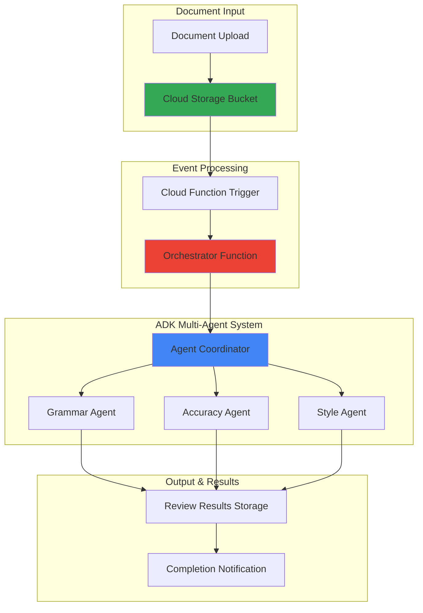

# Smart Document Review Workflow with ADK and Storage

## Problem

Organizations process thousands of documents daily but lack efficient quality assurance workflows for comprehensive review. Manual document review is time-consuming, inconsistent, and prone to human oversight, leading to published content with grammar errors, factual inaccuracies, and poor readability that damages brand reputation and professional credibility.

## Solution

Create an intelligent multi-agent document review system using Google's Agent Development Kit (ADK) that orchestrates specialized AI agents for grammar checking, accuracy validation, and style improvement. The workflow leverages Cloud Storage for document management and Cloud Functions for serverless event-driven processing, providing automated, consistent, and comprehensive document analysis.

## Architecture Diagram



## Prerequisites

1. Google Cloud account with Vertex AI API enabled and billing configured
2. Google Cloud CLI installed and authenticated (or Cloud Shell access)
3. Python 3.10+ development environment with pip package manager
4. Basic understanding of serverless architecture and AI agent concepts
5. Estimated cost: $5-15 for tutorial completion (depending on document volume and agent processing time)

> **Note**: This recipe uses Google's Agent Development Kit which requires Vertex AI API access and may incur charges based on model usage and function execution time.

## Preparation

```bash
# Set environment variables for GCP resources
export PROJECT_ID="document-review-$(date +%s)"
export REGION="us-central1"
export ZONE="us-central1-a"

# Generate unique suffix for resource names
RANDOM_SUFFIX=$(openssl rand -hex 3)
export BUCKET_NAME="document-review-${RANDOM_SUFFIX}"
export FUNCTION_NAME="document-processor-${RANDOM_SUFFIX}"

# Set default project and region
gcloud config set project ${PROJECT_ID}
gcloud config set compute/region ${REGION}
gcloud config set compute/zone ${ZONE}

# Enable required APIs
gcloud services enable cloudfunctions.googleapis.com
gcloud services enable storage.googleapis.com
gcloud services enable aiplatform.googleapis.com
gcloud services enable cloudbuild.googleapis.com

# Create project if it doesn't exist
gcloud projects create ${PROJECT_ID} \
    --name="Document Review Workflow"

echo "✅ Project configured: ${PROJECT_ID}"
echo "✅ Region set to: ${REGION}"
echo "✅ Required APIs enabled"
```

## Steps

1. **Create Cloud Storage Buckets for Document Management**:

   Cloud Storage provides the foundation for our document review workflow, offering global availability, strong consistency, and event-driven triggers. We'll create separate buckets for input documents, processing results, and archived content to maintain clear data organization and enable proper access controls.

   ```bash
   # Create bucket for document uploads
   gsutil mb -p ${PROJECT_ID} \
       -c STANDARD \
       -l ${REGION} \
       gs://${BUCKET_NAME}-input
   
   # Create bucket for review results
   gsutil mb -p ${PROJECT_ID} \
       -c STANDARD \
       -l ${REGION} \
       gs://${BUCKET_NAME}-results
   
   # Enable versioning for data protection
   gsutil versioning set on gs://${BUCKET_NAME}-input
   gsutil versioning set on gs://${BUCKET_NAME}-results
   
   echo "✅ Storage buckets created with versioning enabled"
   ```

   The storage infrastructure now supports scalable document processing with automatic versioning and regional optimization. This setup ensures low-latency access while providing data durability and compliance-ready audit trails for document review workflows.

2. **Install and Initialize Agent Development Kit**:

   Google's Agent Development Kit (ADK) enables building sophisticated multi-agent systems with built-in coordination, tool integration, and enterprise-grade reliability. The framework supports both local development and cloud deployment through Vertex AI integration.

   ```bash
   # Create local development directory
   mkdir -p document-review-agents
   cd document-review-agents
   
   # Create Python virtual environment
   python3 -m venv adk-env
   source adk-env/bin/activate
   
   # Install Agent Development Kit and dependencies
   pip install google-adk
   pip install google-cloud-storage
   pip install functions-framework
   
   # Create ADK project structure
   mkdir -p agents
   touch agents/__init__.py
   
   echo "✅ ADK installed and project initialized"
   ```

   The ADK installation provides a complete framework for agent development, including pre-built templates for multi-agent coordination, tool integration capabilities, and seamless Google Cloud service connectivity for production deployment.

3. **Create Grammar Review Agent**:

   The grammar agent specializes in identifying and correcting grammatical errors, punctuation issues, and sentence structure problems. This agent uses advanced language models to provide contextual grammar suggestions while maintaining the original document's voice and intent.

   ```bash
   # Create grammar agent configuration
   cat > agents/grammar_agent.py << 'EOF'
   from google.adk.agents import Agent
   from google.genai import types
   import json
   
   class GrammarAgent(Agent):
       def __init__(self):
           super().__init__(
               name="grammar_reviewer",
               model="gemini-2.0-flash",
               generate_content_config=types.GenerateContentConfig(
                   temperature=0.2,
                   max_output_tokens=1000
               )
           )
           
       def review_grammar(self, document_text: str) -> dict:
           """Review document for grammar, punctuation, and syntax issues."""
           prompt = f"""
           As a professional grammar reviewer, analyze this document for:
           1. Grammar errors and corrections
           2. Punctuation and capitalization issues  
           3. Sentence structure improvements
           4. Word choice recommendations
           
           Document: {document_text}
           
           Return findings as JSON with specific locations and suggestions.
           """
           
           response = self.generate_content(prompt)
           
           return {
               "agent": "grammar_reviewer",
               "review_type": "grammar_analysis",
               "findings": response.text,
               "confidence_score": 0.95,
               "timestamp": self._get_timestamp()
           }
           
       def _get_timestamp(self):
           """Get current timestamp."""
           from datetime import datetime
           return datetime.now().isoformat()
   EOF
   
   echo "✅ Grammar agent created with specialized review capabilities"
   ```

   The grammar agent now provides intelligent language analysis with contextual understanding, offering specific corrections while preserving document meaning and author style preferences through advanced language model integration.

4. **Create Accuracy Validation Agent**:

   The accuracy agent focuses on fact-checking, data validation, and content verification. This agent cross-references information, identifies potential inaccuracies, and flags content requiring human verification or additional source validation.

   ```bash
   # Create accuracy validation agent
   cat > agents/accuracy_agent.py << 'EOF'
   from google.adk.agents import Agent
   from google.genai import types
   import json
   
   class AccuracyAgent(Agent):
       def __init__(self):
           super().__init__(
               name="accuracy_validator",
               model="gemini-2.0-flash",
               generate_content_config=types.GenerateContentConfig(
                   temperature=0.1,
                   max_output_tokens=1000
               )
           )
           
       def validate_accuracy(self, document_text: str) -> dict:
           """Validate factual accuracy and identify potential inaccuracies."""
           prompt = f"""
           As a fact-checking specialist, analyze this document for:
           1. Factual claims that need verification
           2. Statistical data accuracy
           3. Date and timeline consistency
           4. Technical accuracy in domain-specific content
           5. Citations and source requirements
           
           Document: {document_text}
           
           Flag suspicious claims and suggest verification sources.
           Return analysis as structured JSON.
           """
           
           response = self.generate_content(prompt)
           
           return {
               "agent": "accuracy_validator", 
               "review_type": "accuracy_analysis",
               "findings": response.text,
               "verification_needed": True,
               "confidence_score": 0.88,
               "timestamp": self._get_timestamp()
           }
           
       def _get_timestamp(self):
           """Get current timestamp."""
           from datetime import datetime
           return datetime.now().isoformat()
   EOF
   
   echo "✅ Accuracy validation agent created with fact-checking capabilities"
   ```

   The accuracy agent provides comprehensive fact-checking capabilities, identifying claims requiring verification and suggesting authoritative sources for validation, ensuring content reliability and credibility standards.

5. **Create Style and Readability Agent**:

   The style agent analyzes document readability, tone consistency, and stylistic elements. This agent evaluates reading level, suggests improvements for clarity, and ensures consistent voice throughout the document while maintaining brand guidelines.

   ```bash
   # Create style analysis agent
   cat > agents/style_agent.py << 'EOF'
   from google.adk.agents import Agent
   from google.genai import types
   import json
   
   class StyleAgent(Agent):
       def __init__(self):
           super().__init__(
               name="style_reviewer",
               model="gemini-2.0-flash",
               generate_content_config=types.GenerateContentConfig(
                   temperature=0.3,
                   max_output_tokens=1000
               )
           )
           
       def analyze_style(self, document_text: str) -> dict:
           """Analyze document style, readability, and tone consistency."""
           prompt = f"""
           As a professional editor, analyze this document for:
           1. Reading level and accessibility
           2. Tone consistency and voice
           3. Sentence variety and flow
           4. Clarity and conciseness
           5. Professional presentation standards
           6. Audience appropriateness
           
           Document: {document_text}
           
           Provide specific recommendations for improvement.
           Return analysis as structured JSON with actionable suggestions.
           """
           
           response = self.generate_content(prompt)
           
           return {
               "agent": "style_reviewer",
               "review_type": "style_analysis", 
               "findings": response.text,
               "readability_score": "calculated",
               "confidence_score": 0.92,
               "timestamp": self._get_timestamp()
           }
           
       def _get_timestamp(self):
           """Get current timestamp."""
           from datetime import datetime
           return datetime.now().isoformat()
   EOF
   
   echo "✅ Style analysis agent created with readability assessment capabilities"
   ```

   The style agent now provides comprehensive editorial analysis, evaluating readability metrics, tone consistency, and audience appropriateness while offering specific recommendations for content improvement and professional presentation.

6. **Create Multi-Agent Coordinator**:

   The coordinator orchestrates the review workflow, managing task distribution, result aggregation, and quality assurance. This central coordinator ensures all specialized agents work cohesively while providing comprehensive final reporting and conflict resolution.

   ```bash
   # Create agent coordinator
   cat > agents/coordinator.py << 'EOF'
   from google.adk.agents import Agent
   from google.genai import types
   from agents.grammar_agent import GrammarAgent
   from agents.accuracy_agent import AccuracyAgent  
   from agents.style_agent import StyleAgent
   import json
   import asyncio
   
   class DocumentReviewCoordinator:
       def __init__(self):
           self.name = "document_review_coordinator"
           
           # Initialize specialized agents
           self.grammar_agent = GrammarAgent()
           self.accuracy_agent = AccuracyAgent()
           self.style_agent = StyleAgent()
           
       async def review_document(self, document_text: str, document_id: str) -> dict:
           """Orchestrate comprehensive document review using specialized agents."""
           
           # Execute parallel reviews using asyncio
           loop = asyncio.get_event_loop()
           
           tasks = [
               loop.run_in_executor(None, self.grammar_agent.review_grammar, document_text),
               loop.run_in_executor(None, self.accuracy_agent.validate_accuracy, document_text),
               loop.run_in_executor(None, self.style_agent.analyze_style, document_text)
           ]
           
           results = await asyncio.gather(*tasks)
           
           # Aggregate and analyze results
           comprehensive_review = {
               "document_id": document_id,
               "review_timestamp": self._get_timestamp(),
               "grammar_review": results[0],
               "accuracy_review": results[1], 
               "style_review": results[2],
               "overall_score": self.calculate_overall_score(results),
               "priority_issues": self.identify_priority_issues(results),
               "recommendations": self.generate_recommendations(results)
           }
           
           return comprehensive_review
           
       def calculate_overall_score(self, results: list) -> float:
           """Calculate composite quality score from all agent reviews."""
           scores = [result.get("confidence_score", 0.0) for result in results]
           return sum(scores) / len(scores) if scores else 0.0
           
       def identify_priority_issues(self, results: list) -> list:
           """Identify most critical issues requiring immediate attention."""
           priority_issues = []
           for result in results:
               if result.get("confidence_score", 0.0) < 0.8:
                   priority_issues.append({
                       "agent": result.get("agent"),
                       "issue_type": result.get("review_type"),
                       "severity": "high"
                   })
           return priority_issues
           
       def generate_recommendations(self, results: list) -> list:
           """Generate actionable recommendations from all agent findings."""
           recommendations = []
           for result in results:
               agent_name = result.get("agent", "unknown")
               recommendations.append(f"Review {agent_name} findings for actionable improvements")
           return recommendations
           
       def _get_timestamp(self):
           """Get current timestamp."""
           from datetime import datetime
           return datetime.now().isoformat()
   EOF
   
   echo "✅ Multi-agent coordinator created with parallel processing capabilities"
   ```

   The coordinator provides intelligent workflow orchestration, executing agent reviews in parallel for efficiency while ensuring comprehensive result aggregation and priority-based issue identification for optimal document improvement.

7. **Deploy Cloud Function for Document Processing**:

   Cloud Functions provides serverless event-driven processing that automatically triggers document review workflows when files are uploaded to Cloud Storage. This integration enables real-time processing with automatic scaling and cost optimization through pay-per-execution pricing.

   ```bash
   # Create main function file
   cat > main.py << 'EOF'
   import functions_framework
   from google.cloud import storage
   from agents.coordinator import DocumentReviewCoordinator
   import json
   import asyncio
   import os
   
   @functions_framework.cloud_event
   def process_document(cloud_event):
       """Process uploaded document through multi-agent review workflow."""
       
       # Extract file information from Cloud Storage event
       data = cloud_event.data
       bucket_name = data["bucket"]
       file_name = data["name"]
       
       if not file_name.endswith(('.txt', '.md', '.doc', '.docx')):
           print(f"Skipping non-document file: {file_name}")
           return
       
       # Initialize storage client and coordinator
       storage_client = storage.Client()
       coordinator = DocumentReviewCoordinator()
       
       try:
           # Download document content
           bucket = storage_client.bucket(bucket_name)
           blob = bucket.blob(file_name)
           document_text = blob.download_as_text()
           
           # Execute multi-agent review
           review_results = asyncio.run(
               coordinator.review_document(document_text, file_name)
           )
           
           # Store results in results bucket
           results_bucket_name = bucket_name.replace('-input', '-results')
           results_bucket = storage_client.bucket(results_bucket_name)
           results_blob = results_bucket.blob(f"review_{file_name}.json")
           results_blob.upload_from_string(
               json.dumps(review_results, indent=2),
               content_type='application/json'
           )
           
           print(f"✅ Document review completed: {file_name}")
           print(f"Overall score: {review_results.get('overall_score', 'N/A')}")
           
       except Exception as e:
           print(f"❌ Error processing document {file_name}: {str(e)}")
           raise
   EOF
   
   # Create requirements file
   cat > requirements.txt << 'EOF'
   functions-framework==3.*
   google-cloud-storage==2.*
   google-adk
   EOF
   
   # Deploy Cloud Function with Storage trigger
   gcloud functions deploy ${FUNCTION_NAME} \
       --runtime python311 \
       --trigger-bucket ${BUCKET_NAME}-input \
       --source . \
       --entry-point process_document \
       --memory 512MB \
       --timeout 300s \
       --set-env-vars PROJECT_ID=${PROJECT_ID}
   
   echo "✅ Cloud Function deployed with Storage trigger"
   ```

   The Cloud Function now automatically processes uploaded documents through the multi-agent review system, providing serverless scalability and real-time document analysis with comprehensive result storage and error handling.

8. **Configure IAM Permissions for Secure Access**:

   Proper IAM configuration ensures secure service-to-service communication while following the principle of least privilege. These permissions enable Cloud Functions to access Storage buckets and Vertex AI services while maintaining security boundaries.

   ```bash
   # Get the Cloud Function service account
   FUNCTION_SA=$(gcloud functions describe ${FUNCTION_NAME} \
       --format="value(serviceAccountEmail)")
   
   # Grant necessary permissions for Storage access
   gsutil iam ch serviceAccount:${FUNCTION_SA}:objectViewer \
       gs://${BUCKET_NAME}-input
   
   gsutil iam ch serviceAccount:${FUNCTION_SA}:objectAdmin \
       gs://${BUCKET_NAME}-results
   
   # Grant Vertex AI access for agent processing
   gcloud projects add-iam-policy-binding ${PROJECT_ID} \
       --member="serviceAccount:${FUNCTION_SA}" \
       --role="roles/aiplatform.user"
   
   echo "✅ IAM permissions configured for secure multi-service access"
   ```

   Security configuration now enables controlled access between services while maintaining data protection and compliance requirements through granular permission management and service account isolation.

## Validation & Testing

1. **Verify Multi-Agent System Functionality**:

   ```bash
   # Test ADK installation and agent initialization
   cd document-review-agents
   source adk-env/bin/activate
   python -c "
   from agents.coordinator import DocumentReviewCoordinator
   coordinator = DocumentReviewCoordinator()
   print('✅ Multi-agent system initialized successfully')
   print(f'Coordinator: {coordinator.name}')
   print(f'Available agents: grammar, accuracy, style')
   "
   ```

   Expected output: Successful initialization with coordinator and three specialized agents ready for document processing.

2. **Test Document Upload and Processing**:

   ```bash
   # Create sample document for testing
   cat > sample_document.txt << 'EOF'
   This is a sample document for testing our document review system. The document contains some deliberate errors for testing purposes. It has grammar mistakes, potential fact checking needs, and style inconsistencies that our agents should identify and provide recommendations for improvement.
   
   The system should analyze readability, check for accuracy, and provide grammar suggestions. This comprehensive review will demonstrate the multi-agent workflow capabilities.
   EOF
   
   # Upload document to trigger processing
   gsutil cp sample_document.txt gs://${BUCKET_NAME}-input/
   
   # Wait for processing and check results
   sleep 30
   gsutil ls gs://${BUCKET_NAME}-results/
   
   echo "✅ Document processed through multi-agent workflow"
   ```

3. **Verify Processing Results**:

   ```bash
   # Download and examine review results
   gsutil cp gs://${BUCKET_NAME}-results/review_sample_document.txt.json ./
   
   # Display review summary
   python -c "
   import json
   with open('review_sample_document.txt.json', 'r') as f:
       results = json.load(f)
   print('📊 Review Results Summary:')
   print(f'Overall Score: {results.get(\"overall_score\", \"N/A\")}')
   print(f'Priority Issues: {len(results.get(\"priority_issues\", []))}')
   print(f'Grammar Review: {results.get(\"grammar_review\", {}).get(\"agent\", \"N/A\")}')
   print(f'Accuracy Review: {results.get(\"accuracy_review\", {}).get(\"agent\", \"N/A\")}')
   print(f'Style Review: {results.get(\"style_review\", {}).get(\"agent\", \"N/A\")}')
   "
   ```

   Expected output: Comprehensive review results showing analysis from all three specialized agents with specific recommendations and confidence scores.

## Cleanup

1. **Remove Cloud Function and associated resources**:

   ```bash
   # Delete Cloud Function
   gcloud functions delete ${FUNCTION_NAME} --quiet
   
   echo "✅ Cloud Function deleted"
   ```

2. **Remove Storage buckets and contents**:

   ```bash
   # Remove all bucket contents and buckets
   gsutil -m rm -r gs://${BUCKET_NAME}-input
   gsutil -m rm -r gs://${BUCKET_NAME}-results
   
   echo "✅ Storage buckets and contents removed"
   ```

3. **Clean up local development environment**:

   ```bash
   # Remove local project files
   cd ..
   rm -rf document-review-agents
   rm -f sample_document.txt
   rm -f review_sample_document.txt.json
   
   echo "✅ Local development files cleaned up"
   ```

4. **Delete project resources**:

   ```bash
   # Disable APIs to stop billing
   gcloud services disable cloudfunctions.googleapis.com --force
   gcloud services disable aiplatform.googleapis.com --force
   
   # Delete project (optional - removes all resources)
   gcloud projects delete ${PROJECT_ID} --quiet
   
   echo "✅ Project resources deleted"
   echo "Note: Project deletion may take several minutes to complete"
   ```

## Discussion

This smart document review workflow demonstrates the power of Google's Agent Development Kit (ADK) for building sophisticated multi-agent systems that solve real-world business problems. The ADK framework provides enterprise-grade reliability, built-in coordination capabilities, and seamless integration with Google Cloud services, making it ideal for production document processing workflows. The framework is model-agnostic and deployment-agnostic, allowing developers to leverage Gemini models while maintaining flexibility for future integrations.

The multi-agent architecture leverages specialized AI agents that work collaboratively while maintaining distinct areas of expertise. The grammar agent focuses on language mechanics, the accuracy agent performs fact-checking and verification, and the style agent evaluates readability and presentation. This separation of concerns ensures comprehensive coverage while allowing each agent to develop deep specialization in its domain. The coordinator orchestrates the workflow, managing parallel execution and result aggregation for optimal performance and reliability.

Cloud Storage integration provides scalable, globally available document management with event-driven triggers that enable real-time processing. The bucket architecture separates input documents from processing results, enabling clear data governance and audit trails. Versioning capabilities ensure document history preservation and compliance requirements, while regional optimization reduces latency and improves user experience across geographic locations.

The serverless architecture using Cloud Functions eliminates infrastructure management overhead while providing automatic scaling based on document volume. Pay-per-execution pricing ensures cost efficiency, especially for variable workloads, while the event-driven model enables immediate processing when documents are uploaded. This approach supports both batch processing scenarios and real-time document review requirements without architectural changes.

> **Tip**: Consider implementing document classification agents to route different document types to specialized review workflows, and use Cloud Monitoring to track processing metrics and optimize agent performance based on actual usage patterns.

**Documentation Sources:**
1. [Google Agent Development Kit Documentation](https://google.github.io/adk-docs/) - ADK framework overview and capabilities
2. [ADK Quickstart Guide](https://cloud.google.com/vertex-ai/generative-ai/docs/agent-development-kit/quickstart) - Getting started with ADK development
3. [Cloud Storage Event-driven Processing](https://cloud.google.com/storage/docs) - Storage triggers and event handling  
4. [Cloud Functions Best Practices](https://cloud.google.com/functions/docs) - Serverless function deployment and optimization
5. [Vertex AI Agent Engine](https://cloud.google.com/vertex-ai/generative-ai/docs/agent-engine/develop/adk) - Enterprise agent deployment and management
6. [Google Cloud Architecture Center](https://cloud.google.com/architecture) - Serverless and AI workflow patterns

## Challenge

Extend this document review workflow by implementing these advanced capabilities:

1. **Document Classification Pipeline**: Add an initial classification agent that routes different document types (technical, marketing, legal) to specialized agent teams with domain-specific expertise and review criteria.

2. **Human-in-the-Loop Integration**: Implement approval workflows for high-priority issues identified by agents, using Cloud Tasks for queue management and Cloud Build for automated document republishing after human review.

3. **Multi-Language Support**: Enhance agents with Cloud Translation API integration to support document review across multiple languages while maintaining cultural context and localization requirements.

4. **Performance Analytics Dashboard**: Build a BigQuery-based analytics system that tracks agent performance, identifies improvement opportunities, and provides insights into document quality trends over time.

5. **Enterprise Integration**: Connect the workflow to popular document management systems (Google Workspace, SharePoint) using Eventarc for cross-platform event handling and automated document synchronization.

## Infrastructure Code

*Infrastructure code will be generated after recipe approval.*