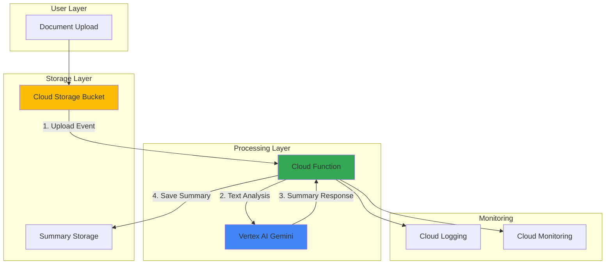

# Smart Document Summarization with Vertex AI and Functions

## Problem

Organizations process thousands of documents daily, from legal contracts to research papers, but manually reviewing and summarizing these documents consumes valuable time and resources. Business teams need instant, accurate summaries to make informed decisions quickly, yet traditional document review workflows create bottlenecks that slow critical business processes and increase operational costs.

## Solution

Build an automated document processing pipeline using Cloud Storage for file ingestion, Cloud Functions for serverless processing orchestration, and Vertex AI's Gemini models for intelligent document summarization. This event-driven architecture automatically processes uploaded documents and generates high-quality summaries, enabling teams to quickly understand document content without manual review.

## Architecture Diagram



## Prerequisites

1. Google Cloud Project with billing enabled and sufficient quota for Vertex AI
2. gcloud CLI installed and configured (version 450.0.0 or later)
3. Basic understanding of serverless computing and document processing concepts
4. Python development experience for Cloud Functions
5. Estimated cost: $5-15 for testing (varies by document volume and AI model usage)

> **Note**: Vertex AI Gemini models have usage-based pricing. Monitor your usage through the Cloud Console to avoid unexpected charges.

## Preparation

Google Cloud Functions and Vertex AI work together to create scalable, event-driven document processing workflows. Cloud Storage triggers enable automatic processing when documents are uploaded, while Vertex AI's Gemini models provide state-of-the-art natural language understanding for generating accurate summaries.

```bash
# Set environment variables for GCP resources
export PROJECT_ID="doc-summarizer-$(date +%s)"
export REGION="us-central1"

# Generate unique suffix for resource names
RANDOM_SUFFIX=$(openssl rand -hex 3)
export BUCKET_NAME="doc-summarizer-${RANDOM_SUFFIX}"
export FUNCTION_NAME="summarize-document"

# Set default project and region
gcloud config set project ${PROJECT_ID}
gcloud config set compute/region ${REGION}
gcloud config set functions/region ${REGION}

# Enable required APIs
gcloud services enable cloudfunctions.googleapis.com
gcloud services enable storage.googleapis.com
gcloud services enable aiplatform.googleapis.com
gcloud services enable cloudbuild.googleapis.com
gcloud services enable eventarc.googleapis.com

echo "✅ Project configured: ${PROJECT_ID}"
echo "✅ Region set to: ${REGION}"
echo "✅ APIs enabled successfully"
```

This preparation establishes the foundational Google Cloud services required for our document summarization pipeline, including the AI Platform for Vertex AI models, Cloud Build for function deployment, and Eventarc for event-driven triggers.

## Steps

1. **Create Cloud Storage Bucket for Document Processing**:

   Cloud Storage provides unified object storage with global edge caching and strong consistency guarantees. Creating a bucket with appropriate location and storage class settings establishes the foundation for a document processing pipeline that can scale from megabytes to petabytes while maintaining high performance and cost efficiency.

   ```bash
   # Create storage bucket for document uploads
   gsutil mb -p ${PROJECT_ID} \
       -c STANDARD \
       -l ${REGION} \
       gs://${BUCKET_NAME}
   
   # Enable versioning for document protection
   gsutil versioning set on gs://${BUCKET_NAME}
   
   # Create folder structure for organized processing
   echo "Processing pipeline ready" | \
       gsutil cp - gs://${BUCKET_NAME}/ready.txt
   
   echo "✅ Cloud Storage bucket created: gs://${BUCKET_NAME}"
   ```

   The storage bucket is now ready with versioning enabled, providing both scalability and data protection. This foundational component supports the entire document processing pipeline, from ingestion through summary generation, while Google's global infrastructure ensures low-latency access.

2. **Prepare Cloud Function Source Code**:

   Cloud Functions provides serverless event processing that automatically scales based on Cloud Storage events. The Python runtime environment includes access to Vertex AI SDKs and handles all infrastructure management, enabling developers to focus on business logic rather than server administration.

   ```bash
   # Create function directory and source files
   mkdir -p cloud-function
   cd cloud-function
   
   # Create requirements.txt for dependencies
   cat > requirements.txt << 'EOF'
   google-cloud-aiplatform>=1.45.0
   google-cloud-storage>=2.10.0
   functions-framework>=3.5.0
   PyPDF2>=3.0.1
   python-docx>=1.1.0
   vertexai>=1.45.0
   EOF
   
   echo "✅ Function dependencies configured"
   ```

   The requirements file specifies the latest Vertex AI SDK version, ensuring access to the newest Gemini model features and optimizations. The additional libraries support various document formats commonly used in business environments.

3. **Implement Document Processing Function**:

   The Cloud Function orchestrates the entire document processing workflow, from file extraction through AI-powered summarization. This serverless approach provides automatic scaling, built-in error handling, and cost-effective processing that charges only for actual execution time.

   ```bash
   # Create main function code
   cat > main.py << 'EOF'
   import os
   import json
   import tempfile
   from typing import Optional
   from google.cloud import storage
   from google.cloud.functions import CloudEvent
   import functions_framework
   import vertexai
   from vertexai.generative_models import GenerativeModel
   import PyPDF2
   import docx
   
   # Initialize Vertex AI
   PROJECT_ID = os.environ.get('GCP_PROJECT')
   REGION = 'us-central1'
   vertexai.init(project=PROJECT_ID, location=REGION)
   
   def extract_text_from_file(file_path: str, file_name: str) -> str:
       """Extract text from various document formats."""
       text = ""
       
       try:
           if file_name.lower().endswith('.pdf'):
               with open(file_path, 'rb') as file:
                   pdf_reader = PyPDF2.PdfReader(file)
                   for page in pdf_reader.pages:
                       text += page.extract_text() + "\n"
           
           elif file_name.lower().endswith('.docx'):
               doc = docx.Document(file_path)
               for paragraph in doc.paragraphs:
                   text += paragraph.text + "\n"
           
           elif file_name.lower().endswith('.txt'):
               with open(file_path, 'r', encoding='utf-8') as file:
                   text = file.read()
           
           else:
               # Attempt to read as plain text
               with open(file_path, 'r', encoding='utf-8') as file:
                   text = file.read()
                   
       except Exception as e:
           print(f"Error extracting text: {str(e)}")
           text = f"Error processing file: {str(e)}"
       
       return text
   
   def generate_summary(text: str, file_name: str) -> str:
       """Generate document summary using Vertex AI Gemini."""
       try:
           model = GenerativeModel("gemini-1.5-pro")
           
           prompt = f"""
           Please provide a comprehensive summary of the following document.
           
           Document: {file_name}
           
           Requirements for the summary:
           1. Identify the main topic and purpose
           2. List key points and findings
           3. Highlight important dates, numbers, or decisions
           4. Keep the summary concise but informative (2-3 paragraphs)
           5. Use clear, professional language
           
           Document content:
           {text[:8000]}  # Limit content to stay within token limits
           """
           
           response = model.generate_content(prompt)
           return response.text
           
       except Exception as e:
           print(f"Error generating summary: {str(e)}")
           return f"Error generating summary: {str(e)}"
   
   @functions_framework.cloud_event
   def summarize_document(cloud_event: CloudEvent) -> None:
       """Main function triggered by Cloud Storage events."""
       try:
           # Parse the Cloud Storage event
           data = cloud_event.data
           bucket_name = data["bucket"]
           file_name = data["name"]
           
           print(f"Processing file: {file_name} from bucket: {bucket_name}")
           
           # Skip processing summary files to avoid recursion
           if file_name.endswith('_summary.txt') or file_name == 'ready.txt':
               print(f"Skipping {file_name}")
               return
           
           # Initialize Cloud Storage client
           storage_client = storage.Client()
           bucket = storage_client.bucket(bucket_name)
           blob = bucket.blob(file_name)
           
           # Download file to temporary location
           with tempfile.NamedTemporaryFile(delete=False) as temp_file:
               blob.download_to_filename(temp_file.name)
               
               # Extract text from document
               text_content = extract_text_from_file(temp_file.name, file_name)
               
               # Generate summary using Vertex AI
               summary = generate_summary(text_content, file_name)
               
               # Create summary metadata
               metadata = {
                   "original_file": file_name,
                   "processed_at": cloud_event.time,
                   "file_size_bytes": blob.size,
                   "content_length": len(text_content),
                   "summary_length": len(summary)
               }
               
               # Save summary with metadata
               summary_content = f"""DOCUMENT SUMMARY
   ==================
   
   Original File: {file_name}
   Processed: {cloud_event.time}
   File Size: {blob.size} bytes
   
   SUMMARY:
   {summary}
   
   METADATA:
   {json.dumps(metadata, indent=2)}
   """
               
               # Upload summary to Cloud Storage
               summary_file_name = f"{file_name}_summary.txt"
               summary_blob = bucket.blob(summary_file_name)
               summary_blob.upload_from_string(summary_content)
               
               print(f"✅ Summary created: {summary_file_name}")
               
               # Clean up temporary file
               os.unlink(temp_file.name)
               
       except Exception as e:
           print(f"Error processing document: {str(e)}")
           raise e
   EOF
   
   echo "✅ Cloud Function code created"
   ```

   This function implements a robust document processing pipeline with error handling, multiple file format support, and intelligent text extraction. The Vertex AI integration uses the latest Gemini model for high-quality summarization that understands context and generates professional summaries.

4. **Deploy Cloud Function with Storage Trigger**:

   Cloud Functions deployment integrates with Google Cloud Build for automated containerization and provides seamless integration with Cloud Storage events. The Eventarc trigger ensures reliable, scalable processing of document uploads with built-in retry logic and monitoring capabilities.

   ```bash
   # Deploy function with Cloud Storage trigger
   gcloud functions deploy ${FUNCTION_NAME} \
       --gen2 \
       --runtime python311 \
       --source . \
       --entry-point summarize_document \
       --trigger-bucket ${BUCKET_NAME} \
       --memory 1Gi \
       --timeout 540s \
       --max-instances 10 \
       --set-env-vars "GCP_PROJECT=${PROJECT_ID}"
   
   echo "✅ Cloud Function deployed with storage trigger"
   echo "Function will process files uploaded to: gs://${BUCKET_NAME}"
   
   # Return to main directory
   cd ..
   ```

   The function is now deployed with optimal resource allocation for document processing, including sufficient memory for large files and extended timeout for AI model inference. The environment variable configuration ensures proper Vertex AI project initialization.

5. **Configure IAM Permissions for AI Access**:

   Google Cloud's Identity and Access Management ensures secure access to Vertex AI services while following the principle of least privilege. The Cloud Function service account needs specific permissions to interact with AI Platform services and generate model predictions.

   ```bash
   # Get the Cloud Function service account
   FUNCTION_SA=$(gcloud functions describe ${FUNCTION_NAME} \
       --region=${REGION} \
       --gen2 \
       --format="value(serviceConfig.serviceAccountEmail)")
   
   # Grant Vertex AI User role for model access
   gcloud projects add-iam-policy-binding ${PROJECT_ID} \
       --member="serviceAccount:${FUNCTION_SA}" \
       --role="roles/aiplatform.user"
   
   # Grant additional storage permissions
   gcloud projects add-iam-policy-binding ${PROJECT_ID} \
       --member="serviceAccount:${FUNCTION_SA}" \
       --role="roles/storage.objectAdmin"
   
   echo "✅ IAM permissions configured for AI access"
   echo "Service account: ${FUNCTION_SA}"
   ```

   These permissions enable the Cloud Function to authenticate with Vertex AI services and access the Gemini models for document summarization while maintaining security best practices through role-based access control.

6. **Create Sample Documents for Testing**:

   Testing with realistic document samples validates the entire pipeline functionality and demonstrates the system's capability to handle various document formats and content types commonly found in business environments.

   ```bash
   # Create sample business documents
   cat > sample_report.txt << 'EOF'
   QUARTERLY BUSINESS REPORT - Q4 2024
   
   Executive Summary:
   This report presents the financial and operational performance for Q4 2024. 
   Revenue increased by 15% compared to Q3, reaching $2.4 million. Key achievements 
   include successful product launch, expansion into new markets, and improved 
   customer satisfaction scores.
   
   Financial Highlights:
   - Total Revenue: $2,400,000 (15% increase)
   - Net Profit: $360,000 (18% increase) 
   - Operating Expenses: $1,890,000
   - Customer Acquisition Cost: $120 (down from $145)
   
   Strategic Initiatives:
   1. Launched AI-powered customer service platform
   2. Expanded operations to European markets
   3. Implemented new data analytics infrastructure
   4. Achieved ISO 27001 security certification
   
   Market Analysis:
   The competitive landscape shows continued growth opportunities in emerging 
   markets. Customer feedback indicates strong satisfaction with new product 
   features, particularly the mobile application updates released in November.
   
   Recommendations:
   - Increase marketing spend in European markets by 25%
   - Hire additional technical support staff
   - Invest in advanced analytics capabilities
   - Continue focus on customer experience improvements
   EOF
   
   # Create technical documentation sample
   cat > api_documentation.txt << 'EOF'
   API INTEGRATION GUIDE - Version 2.1
   
   Overview:
   This document provides comprehensive guidance for integrating with our REST API.
   The API supports authentication via OAuth 2.0 and returns data in JSON format.
   Rate limiting is set to 1000 requests per hour for standard accounts.
   
   Authentication:
   All API requests require a valid access token obtained through OAuth 2.0 flow.
   Token expiration is set to 24 hours. Refresh tokens are valid for 30 days.
   
   Endpoints:
   - GET /api/v2/users - Retrieve user information
   - POST /api/v2/documents - Upload new documents
   - GET /api/v2/documents/{id} - Retrieve specific document
   - PUT /api/v2/documents/{id} - Update document metadata
   - DELETE /api/v2/documents/{id} - Remove document
   
   Error Handling:
   The API returns standard HTTP status codes. Error responses include detailed 
   error messages and suggested remediation steps. Common errors include 401 
   (unauthorized), 403 (forbidden), 404 (not found), and 429 (rate limited).
   
   Best Practices:
   - Implement exponential backoff for retry logic
   - Cache authentication tokens appropriately
   - Use pagination for large result sets
   - Monitor API usage to stay within rate limits
   EOF
   
   echo "✅ Sample documents created for testing"
   ```

   These sample documents represent common business content types, providing realistic test cases that demonstrate the system's ability to extract key information and generate meaningful summaries for different document categories.

## Validation & Testing

1. **Test Document Upload and Processing**:

   ```bash
   # Upload sample documents to trigger processing
   gsutil cp sample_report.txt gs://${BUCKET_NAME}/
   gsutil cp api_documentation.txt gs://${BUCKET_NAME}/
   
   echo "✅ Documents uploaded for processing"
   echo "Waiting for function execution..."
   
   # Wait for processing to complete (usually 30-60 seconds)
   sleep 60
   ```

2. **Verify Summary Generation**:

   ```bash
   # List generated summaries
   echo "Generated summaries:"
   gsutil ls gs://${BUCKET_NAME}/*_summary.txt
   
   # View first summary
   echo -e "\n=== Business Report Summary ==="
   gsutil cat gs://${BUCKET_NAME}/sample_report.txt_summary.txt
   
   # View second summary
   echo -e "\n=== API Documentation Summary ==="
   gsutil cat gs://${BUCKET_NAME}/api_documentation.txt_summary.txt
   ```

   Expected output: Well-formatted summaries with key points extracted, metadata included, and professional language used.

3. **Monitor Function Execution**:

   ```bash
   # Check function logs for successful processing
   gcloud functions logs read ${FUNCTION_NAME} \
       --region=${REGION} \
       --gen2 \
       --limit=20
   
   # Check function metrics
   echo "Function execution metrics:"
   gcloud functions describe ${FUNCTION_NAME} \
       --region=${REGION} \
       --gen2 \
       --format="value(state,updateTime)"
   ```

4. **Test Error Handling**:

   ```bash
   # Test with unsupported file type
   echo "Binary content test" > test_binary.bin
   gsutil cp test_binary.bin gs://${BUCKET_NAME}/
   
   # Wait and check error handling
   sleep 30
   gcloud functions logs read ${FUNCTION_NAME} \
       --region=${REGION} \
       --gen2 \
       --limit=5
   ```

## Cleanup

1. **Remove Cloud Function**:

   ```bash
   # Delete the Cloud Function
   gcloud functions delete ${FUNCTION_NAME} \
       --region=${REGION} \
       --gen2 \
       --quiet
   
   echo "✅ Cloud Function deleted"
   ```

2. **Clean Up Storage Resources**:

   ```bash
   # Remove all objects from bucket
   gsutil -m rm -r gs://${BUCKET_NAME}
   
   # Remove local test files
   rm -f sample_report.txt api_documentation.txt test_binary.bin
   rm -rf cloud-function/
   
   echo "✅ Storage resources cleaned up"
   ```

3. **Remove IAM Policy Bindings**:

   ```bash
   # Note: Service account is automatically deleted with function
   echo "✅ IAM permissions automatically removed with function deletion"
   ```

4. **Optional: Delete Project**:

   ```bash
   # Delete entire project if created specifically for this recipe
   # gcloud projects delete ${PROJECT_ID} --quiet
   
   echo "✅ Cleanup completed successfully"
   echo "Note: Vertex AI usage charges may apply based on model calls made"
   ```

## Discussion

This document summarization pipeline demonstrates the power of combining Google Cloud's serverless computing platform with advanced AI capabilities to solve real business problems. Cloud Functions provides the perfect orchestration layer for event-driven document processing, automatically scaling from zero to handle variable workloads while maintaining cost efficiency through pay-per-use pricing. The integration with Cloud Storage creates a seamless workflow where document uploads immediately trigger processing without requiring complex infrastructure management.

Vertex AI's Gemini models represent the current state-of-the-art in natural language understanding and generation, offering sophisticated document comprehension capabilities that rival human-level summarization quality. The 2 million token context window supported by Gemini 1.5 models enables processing of very large documents while maintaining coherent understanding across the entire content. This architecture pattern scales horizontally to handle enterprise-level document volumes while providing consistent, high-quality results through Google's managed AI infrastructure.

The serverless approach offers significant advantages over traditional document processing systems, including automatic scaling, built-in monitoring, and reduced operational overhead. Cloud Functions handle all infrastructure concerns, from container management to load balancing, allowing developers to focus on business logic rather than system administration. The event-driven trigger mechanism ensures zero cold-start delays for active workloads while automatically provisioning resources based on actual demand patterns.

This solution can be extended to support additional document formats, implement custom summarization templates for different document types, or integrate with enterprise content management systems. Organizations can customize the AI prompts to extract specific information relevant to their business processes, such as action items from meeting notes, compliance requirements from legal documents, or technical specifications from product documentation. For more information, see the [Cloud Functions documentation](https://cloud.google.com/functions/docs), [Vertex AI generative AI guide](https://cloud.google.com/vertex-ai/generative-ai/docs), [Cloud Storage triggers guide](https://cloud.google.com/functions/docs/calling/storage), and [Google Cloud Architecture Framework](https://cloud.google.com/architecture/framework).

> **Tip**: Use Cloud Monitoring to track function execution metrics and set up alerts for processing failures. Consider implementing batch processing for high-volume scenarios to optimize costs and throughput.

## Challenge

Extend this solution by implementing these enhancements:

1. **Multi-format Document Processing**: Add support for PowerPoint presentations, Excel spreadsheets, and image-based documents using Cloud Vision API for OCR capabilities.

2. **Custom Summarization Templates**: Implement different summarization styles based on document type detection (legal, technical, financial) with specialized prompts and output formats.

3. **Real-time Notifications**: Integrate with Pub/Sub and Cloud Messaging to send real-time notifications when summaries are complete, including email or Slack integration.

4. **Advanced Analytics Dashboard**: Build a web interface using Cloud Run and BigQuery to display processing metrics, summary quality scores, and document insights over time.

5. **Enterprise Integration**: Connect with Google Workspace APIs to automatically process documents from Google Drive, Gmail attachments, or Google Docs with appropriate access controls and audit logging.

## Infrastructure Code

*Infrastructure code will be generated after recipe approval.*