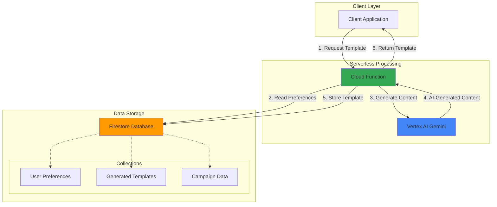

# Smart Email Template Generation with Gemini and Firestore

## Problem

Marketing teams struggle to create personalized email content at scale, often spending hours crafting templates for different customer segments, campaigns, and purposes. Manual template creation is time-consuming, inconsistent in tone and messaging, and difficult to optimize for engagement across diverse audiences and use cases.

## Solution

Build an AI-powered email template generator using Vertex AI Gemini for intelligent content creation, Firestore for storing user preferences and templates, and Cloud Functions for serverless orchestration. This solution automatically generates contextually relevant, personalized email templates based on campaign parameters, target audience data, and brand guidelines stored in Firestore.

## Architecture Diagram



## Prerequisites

1. Google Cloud account with billing enabled and appropriate permissions for Vertex AI, Firestore, and Cloud Functions
2. Google Cloud CLI installed and configured (or Cloud Shell)
3. Basic understanding of serverless architecture and NoSQL databases
4. Python development experience for Cloud Functions
5. Estimated cost: $2-5 for testing (Firestore operations, Vertex AI API calls, Cloud Functions invocations)

> **Note**: This recipe uses Vertex AI Gemini API which requires enabling generative AI services and may have usage quotas for free tier accounts.

## Preparation

```bash
# Set environment variables for GCP resources
export PROJECT_ID="email-gen-$(date +%s)"
export REGION="us-central1"
export ZONE="us-central1-a"

# Generate unique suffix for resource names
RANDOM_SUFFIX=$(openssl rand -hex 3)
export FUNCTION_NAME="email-template-generator-${RANDOM_SUFFIX}"
export DATABASE_ID="email-templates-${RANDOM_SUFFIX}"

# Set default project and region
gcloud config set project ${PROJECT_ID}
gcloud config set compute/region ${REGION}
gcloud config set compute/zone ${ZONE}

# Enable required APIs
gcloud services enable cloudfunctions.googleapis.com
gcloud services enable firestore.googleapis.com
gcloud services enable aiplatform.googleapis.com
gcloud services enable cloudbuild.googleapis.com

echo "✅ Project configured: ${PROJECT_ID}"
echo "✅ Function name: ${FUNCTION_NAME}"
echo "✅ Database ID: ${DATABASE_ID}"
```

## Steps

1. **Create Firestore Database with Collections**:

   Firestore provides a fully managed, serverless NoSQL document database with real-time synchronization and strong consistency guarantees. Creating a native mode database enables powerful querying capabilities and seamless integration with other Google Cloud services, particularly important for storing structured user preferences and generated templates.

   ```bash
   # Create Firestore database in native mode
   gcloud firestore databases create \
       --database=${DATABASE_ID} \
       --location=${REGION} \
       --type=firestore-native
   
   # Wait for database creation to complete
   echo "Waiting for Firestore database creation..."
   sleep 15
   
   echo "✅ Firestore database created: ${DATABASE_ID}"
   ```

   The Firestore database is now ready with native mode capabilities, providing strong consistency, ACID transactions, and advanced querying features essential for managing email template data and user preferences at scale.

2. **Initialize Sample Data Structure**:

   Establishing a well-defined data structure in Firestore provides the foundation for intelligent email generation. This approach allows the system to understand user preferences, campaign requirements, and brand guidelines without requiring complex data imports.

   ```bash
   # Create initialization script for sample data
   cat > init_firestore_data.py << 'EOF'
import os
from google.cloud import firestore

# Initialize Firestore client with specific database
db = firestore.Client(database=os.environ.get('DATABASE_ID'))

# Sample user preferences
user_prefs = {
    "company": "TechStart Solutions",
    "industry": "Software",
    "tone": "professional yet friendly",
    "primaryColor": "#2196F3",
    "targetAudience": "B2B technology decision makers",
    "brandVoice": "innovative, trustworthy, solution-focused"
}

# Sample campaign types
campaign_types = {
    "newsletter": {
        "purpose": "weekly company updates and industry insights",
        "cta": "Read More",
        "length": "medium"
    },
    "product_launch": {
        "purpose": "introduce new features and capabilities",
        "cta": "Learn More",
        "length": "long"
    },
    "welcome": {
        "purpose": "onboard new subscribers",
        "cta": "Get Started",
        "length": "short"
    }
}

# Initialize default user preferences
db.collection('userPreferences').document('default').set(user_prefs)

# Initialize campaign types
for campaign_type, config in campaign_types.items():
    db.collection('campaignTypes').document(campaign_type).set(config)

print("✅ Sample data initialized in Firestore")
EOF
   
   # Run initialization script
   python3 init_firestore_data.py
   
   echo "✅ Sample data structure prepared"
   ```

   The sample data structure provides Gemini with contextual information about brand preferences, campaign types, and target audiences, enabling more accurate and relevant email template generation based on business requirements and marketing objectives.

3. **Create Cloud Function Directory and Dependencies**:

   Setting up the Cloud Function environment with proper dependencies ensures seamless integration between Vertex AI, Firestore, and the email generation logic. The function structure follows Google Cloud best practices for serverless application development and AI service integration.

   ```bash
   # Create function directory
   mkdir email-template-function
   cd email-template-function
   
   # Create requirements.txt with current stable versions
   cat > requirements.txt << 'EOF'
google-cloud-firestore==2.16.0
google-cloud-aiplatform==1.70.0
functions-framework==3.8.1
google-auth==2.35.0
flask==3.0.3
vertexai==1.71.1
EOF
   
   echo "✅ Function directory and dependencies created"
   ```

   The dependency configuration includes the latest stable versions of Google Cloud client libraries, ensuring optimal performance and security for Firestore operations and Vertex AI Gemini integration within the serverless environment.

4. **Implement Email Template Generation Function**:

   The Cloud Function serves as the intelligent orchestrator, combining user preferences from Firestore with Gemini's natural language generation capabilities. This implementation follows serverless best practices with proper error handling, logging, and structured response formatting for reliable email template production.

   ```bash
   # Create main function file
   cat > main.py << 'EOF'
import json
import logging
import os
from google.cloud import firestore
import vertexai
from vertexai.generative_models import GenerativeModel
import functions_framework

# Initialize Firestore client with specific database
db = firestore.Client(database=os.environ.get('DATABASE_ID'))

# Initialize Vertex AI
project_id = os.environ.get('PROJECT_ID', os.environ.get('GCP_PROJECT'))
vertexai.init(project=project_id, location="us-central1")

@functions_framework.http
def generate_email_template(request):
    """
    Generate personalized email templates using Gemini and Firestore.
    """
    # Set CORS headers for web requests
    if request.method == 'OPTIONS':
        headers = {
            'Access-Control-Allow-Origin': '*',
            'Access-Control-Allow-Methods': 'GET, POST',
            'Access-Control-Allow-Headers': 'Content-Type',
            'Access-Control-Max-Age': '3600'
        }
        return ('', 204, headers)

    headers = {'Access-Control-Allow-Origin': '*'}
    
    try:
        # Parse request data
        request_json = request.get_json(silent=True)
        if not request_json:
            return {"error": "Invalid JSON request"}, 400, headers
        
        campaign_type = request_json.get('campaign_type', 'newsletter')
        subject_theme = request_json.get('subject_theme', 'company updates')
        custom_context = request_json.get('custom_context', '')
        
        # Fetch user preferences from Firestore
        prefs_ref = db.collection('userPreferences').document('default')
        prefs_doc = prefs_ref.get()
        
        if not prefs_doc.exists:
            # Create default preferences if none exist
            default_prefs = {
                "company": "Your Company",
                "industry": "Technology",
                "tone": "professional yet friendly",
                "targetAudience": "business professionals",
                "brandVoice": "trustworthy and innovative"
            }
            prefs_ref.set(default_prefs)
            user_prefs = default_prefs
        else:
            user_prefs = prefs_doc.to_dict()
        
        # Fetch campaign configuration
        campaign_ref = db.collection('campaignTypes').document(campaign_type)
        campaign_doc = campaign_ref.get()
        
        if not campaign_doc.exists:
            # Create default campaign type
            default_campaign = {
                "purpose": "general communication",
                "cta": "Learn More",
                "length": "medium"
            }
            campaign_ref.set(default_campaign)
            campaign_config = default_campaign
        else:
            campaign_config = campaign_doc.to_dict()
        
        # Generate email template using Gemini
        template = generate_with_gemini(
            user_prefs, campaign_config, subject_theme, custom_context
        )
        
        # Store generated template in Firestore
        template_data = {
            "campaign_type": campaign_type,
            "subject_theme": subject_theme,
            "subject_line": template["subject"],
            "email_body": template["body"],
            "generated_at": firestore.SERVER_TIMESTAMP,
            "user_preferences": user_prefs
        }
        
        template_ref = db.collection('generatedTemplates').add(template_data)
        template_id = template_ref[1].id
        
        # Return successful response
        return {
            "success": True,
            "template_id": template_id,
            "template": template,
            "campaign_type": campaign_type
        }, 200, headers
        
    except Exception as e:
        logging.error(f"Error generating email template: {str(e)}")
        return {"error": f"Template generation failed: {str(e)}"}, 500, headers

def generate_with_gemini(user_prefs, campaign_config, subject_theme, custom_context):
    """
    Use Vertex AI Gemini to generate email content.
    """
    try:
        # Initialize Gemini model
        model = GenerativeModel("gemini-1.5-flash")
        
        # Construct detailed prompt for email generation
        prompt = f"""
You are an expert email marketing copywriter. Generate a professional email template with the following specifications:

Company Information:
- Company: {user_prefs.get('company', 'Your Company')}
- Industry: {user_prefs.get('industry', 'Technology')}
- Brand Voice: {user_prefs.get('brandVoice', 'professional')}
- Target Audience: {user_prefs.get('targetAudience', 'professionals')}

Email Configuration:
- Campaign Type: {campaign_config.get('purpose', 'general communication')}
- Tone: {user_prefs.get('tone', 'professional')}
- Call-to-Action: {campaign_config.get('cta', 'Learn More')}
- Length: {campaign_config.get('length', 'medium')}
- Subject Theme: {subject_theme}

Additional Context: {custom_context}

Please generate:
1. A compelling subject line (under 60 characters)
2. Email body with proper structure (greeting, body paragraphs, call-to-action, closing)
3. Maintain the specified tone and brand voice
4. Include placeholders for personalization like [First Name], [Company Name]

Format the response as JSON with "subject" and "body" fields only.
"""
        
        # Generate content with Gemini
        response = model.generate_content(
            prompt,
            generation_config={
                "temperature": 0.7,
                "top_p": 0.8,
                "top_k": 40,
                "max_output_tokens": 1024,
            }
        )
        
        try:
            # Parse JSON response from Gemini
            content = response.text.strip()
            if content.startswith('```json'):
                content = content[7:-3]
            elif content.startswith('```'):
                content = content[3:-3]
            
            template_data = json.loads(content)
            
            # Validate required fields
            if "subject" not in template_data or "body" not in template_data:
                raise ValueError("Missing required fields in generated template")
            
            return template_data
            
        except json.JSONDecodeError:
            # Fallback: parse unstructured response
            subject_line = f"Exciting Updates from {user_prefs.get('company', 'Your Company')}"
            body_content = response.text
            
            return {
                "subject": subject_line,
                "body": body_content
            }
    
    except Exception as e:
        logging.error(f"Gemini generation error: {str(e)}")
        # Fallback template
        return {
            "subject": f"Updates from {user_prefs.get('company', 'Your Company')}",
            "body": f"Hello [First Name],\n\nWe hope this email finds you well. We wanted to share some exciting updates about {subject_theme}.\n\n[Email content will be generated here]\n\nBest regards,\nThe {user_prefs.get('company', 'Your Company')} Team"
        }
EOF
   
   echo "✅ Email template generation function implemented"
   ```

   This implementation combines Firestore data retrieval with Vertex AI Gemini's natural language generation, creating a robust system for producing contextually relevant email templates. The function includes proper error handling, CORS support for web applications, and fallback mechanisms to ensure reliable operation even under adverse conditions.

5. **Deploy Cloud Function with Proper Configuration**:

   Deploying the Cloud Function with appropriate memory allocation and timeout settings ensures optimal performance for AI-powered content generation. The deployment configuration balances cost efficiency with processing requirements for Gemini API calls and Firestore operations.

   ```bash
   # Deploy Cloud Function with optimized settings
   gcloud functions deploy ${FUNCTION_NAME} \
       --gen2 \
       --runtime python311 \
       --trigger-http \
       --allow-unauthenticated \
       --source . \
       --entry-point generate_email_template \
       --memory 512Mi \
       --timeout 120s \
       --max-instances 10 \
       --set-env-vars "PROJECT_ID=${PROJECT_ID},DATABASE_ID=${DATABASE_ID}"
   
   # Get function URL
   FUNCTION_URL=$(gcloud functions describe ${FUNCTION_NAME} \
       --gen2 \
       --format="value(serviceConfig.uri)")
   
   echo "✅ Cloud Function deployed successfully"
   echo "Function URL: ${FUNCTION_URL}"
   ```

   The Cloud Function is now deployed with generation 2 runtime, providing improved performance, better resource utilization, and enhanced integration with Google Cloud services for reliable email template generation at scale.

6. **Test Email Template Generation with Sample Requests**:

   Testing the complete workflow validates the integration between Firestore, Gemini, and Cloud Functions while demonstrating various email template generation scenarios. This comprehensive testing ensures the system responds correctly to different campaign types and content requirements.

   ```bash
   # Test newsletter template generation
   curl -X POST "${FUNCTION_URL}" \
       -H "Content-Type: application/json" \
       -d '{
         "campaign_type": "newsletter",
         "subject_theme": "quarterly product updates",
         "custom_context": "announcing new AI features and customer success stories"
       }' | jq '.'
   
   echo "✅ Newsletter template generation tested"
   
   # Test product launch template
   curl -X POST "${FUNCTION_URL}" \
       -H "Content-Type: application/json" \
       -d '{
         "campaign_type": "product_launch",
         "subject_theme": "revolutionary new dashboard",
         "custom_context": "introducing advanced analytics and real-time insights"
       }' | jq '.'
   
   echo "✅ Product launch template generation tested"
   
   # Test welcome email template
   curl -X POST "${FUNCTION_URL}" \
       -H "Content-Type: application/json" \
       -d '{
         "campaign_type": "welcome",
         "subject_theme": "welcome to our platform",
         "custom_context": "helping new users get started with onboarding resources"
       }' | jq '.'
   
   echo "✅ Welcome email template generation tested"
   ```

   The testing demonstrates the system's ability to generate contextually appropriate email templates for different campaign types, incorporating user preferences and campaign-specific requirements through intelligent AI-powered content creation.

## Validation & Testing

1. Verify Firestore database and collections were created:

   ```bash
   # Check Firestore database status
   gcloud firestore databases describe ${DATABASE_ID} \
       --format="table(name,type,locationId,createTime)"
   
   # Verify collections exist and contain data
   python3 -c "
from google.cloud import firestore
import os
db = firestore.Client(database=os.environ.get('DATABASE_ID'))
collections = ['userPreferences', 'campaignTypes', 'generatedTemplates']
for collection in collections:
    docs = list(db.collection(collection).limit(1).stream())
    print(f'Collection {collection}: {len(docs)} documents found')
   "
   ```

   Expected output: Database status should show ACTIVE state with proper configuration and collections should contain sample data.

2. Test Cloud Function accessibility and response:

   ```bash
   # Test function health with simple GET request
   curl -X GET "${FUNCTION_URL}" \
       -H "Content-Type: application/json"
   
   # Verify function logs for successful deployment
   gcloud functions logs read ${FUNCTION_NAME} \
       --gen2 \
       --limit 10 \
       --format="table(timestamp,severity,textPayload)"
   ```

   Expected output: Function should respond with proper HTTP status and logs should show successful initialization without errors.

3. Validate email template generation quality:

   ```bash
   # Generate a test template and examine structure
   TEMPLATE_RESPONSE=$(curl -s -X POST "${FUNCTION_URL}" \
       -H "Content-Type: application/json" \
       -d '{
         "campaign_type": "newsletter",
         "subject_theme": "testing email generation quality",
         "custom_context": "validation test for recipe completion"
       }')
   
   echo "Generated template structure:"
   echo "${TEMPLATE_RESPONSE}" | jq '.template'
   
   # Verify template was stored in Firestore
   echo "Template stored with ID:"
   echo "${TEMPLATE_RESPONSE}" | jq '.template_id'
   
   # Validate response format
   echo "${TEMPLATE_RESPONSE}" | jq 'has("success") and has("template") and has("template_id")'
   ```

   Expected output: Well-formatted email template with appropriate subject line and body content matching the specified tone and campaign type.

## Cleanup

1. Remove Cloud Function:

   ```bash
   # Delete Cloud Function
   gcloud functions delete ${FUNCTION_NAME} \
       --gen2 \
       --region=${REGION} \
       --quiet
   
   echo "✅ Cloud Function deleted"
   ```

2. Remove Firestore database:

   ```bash
   # Delete Firestore database (note: this operation may take time)
   gcloud firestore databases delete ${DATABASE_ID} \
       --quiet
   
   echo "✅ Firestore database deletion initiated"
   echo "Note: Database deletion may take several minutes to complete"
   ```

3. Clean up local files and environment variables:

   ```bash
   # Remove function directory
   cd ..
   rm -rf email-template-function
   rm -f init_firestore_data.py
   
   # Clear environment variables
   unset FUNCTION_NAME
   unset DATABASE_ID
   unset FUNCTION_URL
   unset PROJECT_ID
   unset REGION
   unset ZONE
   unset RANDOM_SUFFIX
   
   echo "✅ Local cleanup completed"
   ```

4. Disable APIs if no longer needed:

   ```bash
   # Disable APIs (optional - only if not used by other resources)
   gcloud services disable cloudfunctions.googleapis.com --force
   gcloud services disable firestore.googleapis.com --force
   gcloud services disable aiplatform.googleapis.com --force
   gcloud services disable cloudbuild.googleapis.com --force
   
   echo "✅ APIs disabled"
   ```

## Discussion

This solution demonstrates the powerful integration of Google Cloud's AI and serverless technologies for intelligent content generation. Vertex AI Gemini provides state-of-the-art natural language generation capabilities, while Firestore offers real-time data synchronization and complex querying features essential for managing user preferences and campaign configurations. The serverless architecture using Cloud Functions ensures cost-effective scaling and eliminates infrastructure management overhead.

The email template generation system leverages Gemini's multimodal understanding to create contextually relevant content that maintains brand consistency while adapting to different campaign types and target audiences. By storing user preferences and campaign data in Firestore, the system builds institutional knowledge that improves template relevance over time. The structured approach to prompt engineering ensures consistent output quality while allowing for customization based on specific business requirements.

The solution architecture follows [Google Cloud's Well-Architected Framework](https://cloud.google.com/architecture/framework) principles, particularly emphasizing operational excellence through automated scaling and performance efficiency via optimized resource allocation. The integration pattern demonstrated here can be extended to support additional AI services, such as [Cloud Translation](https://cloud.google.com/translate) for multilingual campaigns or [Natural Language AI](https://cloud.google.com/natural-language) for content optimization. The serverless approach provides inherent reliability through Google Cloud's managed infrastructure while maintaining cost efficiency through pay-per-use billing.

For production deployments, consider implementing additional features such as A/B testing integration using [Google Optimize](https://developers.google.com/analytics/devguides/collection/gtagjs/enhanced-ecommerce), template version control using [Cloud Source Repositories](https://cloud.google.com/source-repositories), and advanced analytics for campaign performance tracking with [BigQuery](https://cloud.google.com/bigquery). The Firestore vector search capabilities can be leveraged to find similar successful templates, while [Cloud Monitoring](https://cloud.google.com/monitoring) can provide insights into generation patterns and performance optimization opportunities.

> **Tip**: Use Firestore's real-time listeners to implement collaborative template editing features, allowing marketing teams to refine AI-generated content in real-time while maintaining version history and approval workflows through [Firebase Authentication](https://firebase.google.com/docs/auth).

## Challenge

Extend this solution by implementing these enhancements:

1. **Multi-language Support**: Integrate [Cloud Translation API](https://cloud.google.com/translate) to generate email templates in multiple languages based on audience preferences stored in Firestore, with automatic language detection and cultural adaptation using Gemini's multilingual capabilities.

2. **Template Performance Analytics**: Add [BigQuery](https://cloud.google.com/bigquery) integration to track email campaign performance metrics, correlating template characteristics with engagement rates to improve future generation prompts and user preferences through machine learning insights.

3. **Advanced Personalization**: Implement customer data integration using [Dataflow](https://cloud.google.com/dataflow) to process CRM data and create highly personalized email content based on purchase history, behavior patterns, and demographic information stored in Firestore collections.

4. **Interactive Template Editor**: Build a web application using [Firebase Hosting](https://firebase.google.com/docs/hosting) and [Firebase Authentication](https://firebase.google.com/docs/auth) that provides a visual interface for refining AI-generated templates with real-time collaboration features and approval workflows.

5. **Intelligent Template Optimization**: Use [Vertex AI AutoML](https://cloud.google.com/vertex-ai/docs/start/automl-users) to train custom models on historical email performance data, enabling the system to automatically optimize subject lines, content structure, and call-to-action placement for maximum engagement based on A/B testing results.

## Infrastructure Code

### Available Infrastructure as Code:

- [Infrastructure Code Overview](code/README.md) - Detailed description of all infrastructure components
- [Infrastructure Manager](code/infrastructure-manager/) - GCP Infrastructure Manager templates
- [Bash CLI Scripts](code/scripts/) - Example bash scripts using gcloud CLI commands to deploy infrastructure
- [Terraform](code/terraform/) - Terraform configuration files