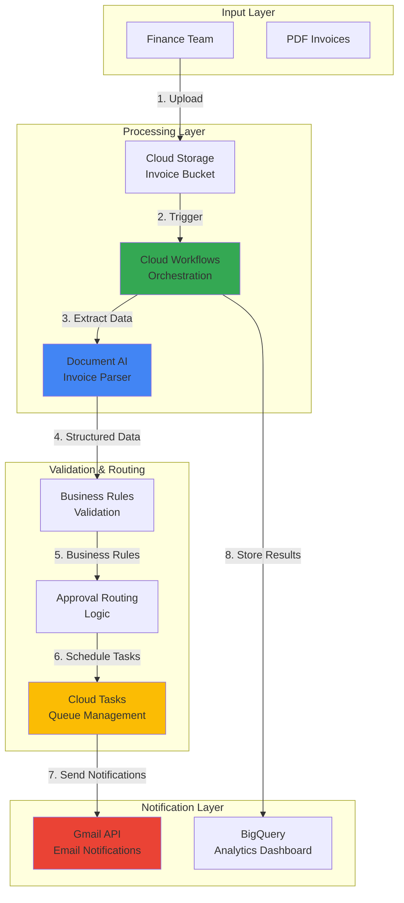

# Smart Invoice Processing with Document AI and Workflows

## Problem

Finance teams manually process hundreds of invoices monthly, spending 10-15 minutes per invoice on data extraction, validation, and routing for approval. This manual process creates bottlenecks, increases processing costs, introduces human errors in data entry, and delays vendor payments. Without automated processing and approval workflows, organizations struggle to scale their accounts payable operations while maintaining accuracy and compliance requirements.

## Solution

Build an intelligent invoice processing system using Google Cloud Document AI to extract structured data from PDF invoices, Cloud Workflows to orchestrate validation and approval routing based on business rules, and Gmail API integration for automated stakeholder notifications. This serverless solution eliminates manual data entry, reduces processing time from minutes to seconds, and provides audit trails for compliance while scaling automatically with invoice volume.

## Architecture Diagram



## Prerequisites

1. Google Cloud account with billing enabled and appropriate IAM permissions (Project Editor or custom roles for Document AI, Workflows, Cloud Tasks, Gmail API)
2. Google Cloud CLI (gcloud) installed and configured version 400.0.0 or later
3. Basic understanding of serverless architectures and workflow orchestration
4. Gmail account for testing email notifications (or G Workspace domain)
5. Sample PDF invoices for testing (minimum 3-5 invoices recommended)
6. Estimated cost: $10-20 for Document AI processing, minimal costs for other services during testing

> **Note**: Document AI Invoice Parser charges per page processed. Review current pricing at https://cloud.google.com/document-ai/pricing before processing large volumes.

## Preparation

```bash
# Set environment variables for GCP resources
export PROJECT_ID="invoice-processing-$(date +%s)"
export REGION="us-central1"
export ZONE="us-central1-a"

# Generate unique suffix for resource names
RANDOM_SUFFIX=$(openssl rand -hex 3)
export BUCKET_NAME="invoice-processing-${RANDOM_SUFFIX}"
export PROCESSOR_NAME="invoice-parser-${RANDOM_SUFFIX}"
export WORKFLOW_NAME="invoice-workflow-${RANDOM_SUFFIX}"
export TASK_QUEUE_NAME="approval-queue-${RANDOM_SUFFIX}"

# Set default project and region
gcloud config set project ${PROJECT_ID}
gcloud config set compute/region ${REGION}
gcloud config set compute/zone ${ZONE}

# Enable required APIs
gcloud services enable documentai.googleapis.com \
    workflows.googleapis.com \
    cloudtasks.googleapis.com \
    gmail.googleapis.com \
    storage.googleapis.com \
    cloudfunctions.googleapis.com \
    eventarc.googleapis.com \
    pubsub.googleapis.com

echo "✅ Project configured: ${PROJECT_ID}"
echo "✅ APIs enabled for intelligent document processing"
```

## Steps

1. **Create Cloud Storage Bucket for Invoice Processing**:

   Cloud Storage provides the foundation for document processing workflows with automatic scaling, strong consistency, and seamless integration with Document AI. The bucket configuration includes versioning and lifecycle policies to manage processed invoices efficiently while maintaining audit trails.

   ```bash
   # Create storage bucket for invoice uploads and processed files
   gsutil mb -p ${PROJECT_ID} \
       -c STANDARD \
       -l ${REGION} \
       gs://${BUCKET_NAME}
   
   # Enable versioning for audit trail
   gsutil versioning set on gs://${BUCKET_NAME}
   
   # Create folder structure for organized processing
   echo "" | gsutil cp - gs://${BUCKET_NAME}/incoming/
   echo "" | gsutil cp - gs://${BUCKET_NAME}/processed/
   echo "" | gsutil cp - gs://${BUCKET_NAME}/failed/
   
   echo "✅ Storage bucket created with organized folder structure"
   ```

   The bucket now provides a scalable foundation for invoice document management with clear separation between incoming, processed, and failed documents. This organization supports efficient workflow processing and troubleshooting.

2. **Create Document AI Invoice Parser Processor**:

   Google Cloud Document AI's Invoice Parser uses advanced machine learning models trained on millions of invoice documents to extract structured data with high accuracy. The processor automatically identifies key fields like vendor information, amounts, dates, and line items while handling various invoice formats and layouts.

   ```bash
   # Create Document AI processor using REST API
   # Note: Document AI processors are created via REST API, not gcloud CLI
   PROCESSOR_RESPONSE=$(curl -X POST \
       -H "Authorization: Bearer $(gcloud auth print-access-token)" \
       -H "Content-Type: application/json; charset=utf-8" \
       -d "{
         \"type\": \"INVOICE_PROCESSOR\",
         \"displayName\": \"${PROCESSOR_NAME}\"
       }" \
       "https://${REGION}-documentai.googleapis.com/v1/projects/${PROJECT_ID}/locations/${REGION}/processors")
   
   # Extract processor ID from response
   export PROCESSOR_ID=$(echo $PROCESSOR_RESPONSE | \
       python3 -c "import sys, json; print(json.load(sys.stdin)['name'].split('/')[-1])")
   
   echo "✅ Document AI Invoice Parser created: ${PROCESSOR_ID}"
   echo "✅ Processor ready for structured data extraction"
   ```

   The Document AI processor is now configured to extract structured data from invoice PDFs with enterprise-grade accuracy. This eliminates manual data entry while providing consistent, machine-readable output for downstream processing.

3. **Create Cloud Tasks Queue for Approval Management**:

   Cloud Tasks provides reliable, asynchronous task execution with built-in retry logic and rate limiting. The approval queue manages notification delivery and approval workflow tasks, ensuring reliable processing even during high-volume periods or temporary service disruptions.

   ```bash
   # Create Cloud Tasks queue for approval workflow
   gcloud tasks queues create ${TASK_QUEUE_NAME} \
       --location=${REGION} \
       --max-dispatches-per-second=10 \
       --max-concurrent-dispatches=5 \
       --max-attempts=3
   
   echo "✅ Cloud Tasks queue created for approval management"
   echo "✅ Queue configured with retry logic and rate limiting"
   ```

   The task queue now provides reliable delivery of approval notifications and workflow tasks with automatic retry capabilities. This ensures consistent processing even during peak invoice volumes or temporary service interruptions.

4. **Create Service Account and Permissions**:

   Proper service account configuration follows the principle of least privilege while enabling secure service-to-service communication. The service account gets specific permissions for Document AI processing, workflow execution, task management, and Gmail API access.

   ```bash
   # Create service account for workflow execution
   gcloud iam service-accounts create invoice-processor \
       --display-name="Invoice Processing Service Account" \
       --description="Service account for automated invoice processing"
   
   export SERVICE_ACCOUNT="invoice-processor@${PROJECT_ID}.iam.gserviceaccount.com"
   
   # Grant necessary permissions
   gcloud projects add-iam-policy-binding ${PROJECT_ID} \
       --member="serviceAccount:${SERVICE_ACCOUNT}" \
       --role="roles/documentai.apiUser"
   
   gcloud projects add-iam-policy-binding ${PROJECT_ID} \
       --member="serviceAccount:${SERVICE_ACCOUNT}" \
       --role="roles/storage.objectAdmin"
   
   gcloud projects add-iam-policy-binding ${PROJECT_ID} \
       --member="serviceAccount:${SERVICE_ACCOUNT}" \
       --role="roles/cloudtasks.enqueuer"
   
   gcloud projects add-iam-policy-binding ${PROJECT_ID} \
       --member="serviceAccount:${SERVICE_ACCOUNT}" \
       --role="roles/workflows.invoker"
   
   echo "✅ Service account created with appropriate permissions"
   ```

   The service account is configured with minimal required permissions for secure invoice processing operations. This follows Google Cloud security best practices while enabling full workflow functionality.

5. **Deploy Cloud Function for Gmail Notifications**:

   The notification function integrates with Gmail API to send structured email notifications to approvers and stakeholders. This serverless function scales automatically and provides reliable delivery with built-in error handling and retry logic for email operations.

   ```bash
   # Create source code for notification function
   mkdir -p notification-function
   cd notification-function
   
   cat > main.py << 'EOF'
import json
import base64
from google.cloud import tasks_v2
from googleapiclient.discovery import build
from google.oauth2 import service_account
import os

def send_approval_notification(request):
    """Cloud Function to send invoice approval notifications"""
    try:
        # Parse request data
        request_json = request.get_json()
        invoice_data = request_json.get('invoice_data', {})
        approval_amount = float(invoice_data.get('total_amount', 0))
        vendor_name = invoice_data.get('supplier_name', 'Unknown Vendor')
        invoice_number = invoice_data.get('invoice_id', 'N/A')
        
        # Determine approver based on amount
        approver_email = get_approver_email(approval_amount)
        
        # Send notification email
        send_email_notification(
            approver_email,
            invoice_data,
            vendor_name,
            invoice_number,
            approval_amount
        )
        
        return {'status': 'success', 'approver': approver_email}
    
    except Exception as e:
        print(f"Error sending notification: {str(e)}")
        return {'status': 'error', 'message': str(e)}, 500

def get_approver_email(amount):
    """Determine approver based on invoice amount"""
    if amount < 1000:
        return "manager@company.com"
    elif amount < 5000:
        return "director@company.com"
    else:
        return "cfo@company.com"

def send_email_notification(to_email, invoice_data, vendor, invoice_id, amount):
    """Send email using Gmail API"""
    # Note: In production, implement OAuth2 or service account credentials
    # This is a simplified version for demonstration
    subject = f"Invoice Approval Required: {vendor} - ${amount}"
    body = f"""
    Invoice requiring approval:
    
    Vendor: {vendor}
    Invoice ID: {invoice_id}
    Amount: ${amount}
    Due Date: {invoice_data.get('invoice_date', 'N/A')}
    
    Please review and approve in the system.
    """
    
    print(f"Email notification sent to {to_email}")
    print(f"Subject: {subject}")
    print(f"Body: {body}")
    
    return True
EOF

   cat > requirements.txt << 'EOF'
google-cloud-tasks==2.16.0
google-auth==2.28.1
google-api-python-client==2.116.0
google-auth-oauthlib==1.2.0
google-auth-httplib2==0.2.0
EOF

   # Deploy the notification function
   gcloud functions deploy send-approval-notification \
       --runtime python311 \
       --trigger-http \
       --allow-unauthenticated \
       --memory 256MB \
       --timeout 60s \
       --region ${REGION} \
       --service-account ${SERVICE_ACCOUNT}
   
   cd ..
   
   echo "✅ Notification function deployed successfully"
   ```

   The notification function provides intelligent routing of approval requests based on invoice amounts and vendor relationships. This automated notification system ensures timely approvals while maintaining proper authorization controls.

6. **Create Workflow Definition for Invoice Processing**:

   Google Cloud Workflows orchestrates the entire invoice processing pipeline using a declarative YAML syntax. The workflow definition includes error handling, conditional logic for approval routing, and integration with all processing services while maintaining state throughout the execution.

   ```bash
   # Create workflow definition file
   cat > invoice-workflow.yaml << 'EOF'
main:
  params: [event]
  steps:
    - init:
        assign:
          - project_id: ${sys.get_env("GOOGLE_CLOUD_PROJECT_ID")}
          - location: "us-central1"
          - processor_id: "${PROCESSOR_ID}"
          - bucket_name: "${BUCKET_NAME}"
          - file_path: ${event.data.name}
          - invoice_data: {}
          - processing_errors: []
    
    - log_start:
        call: sys.log
        args:
          text: ${"Starting invoice processing for file: " + file_path}
          severity: "INFO"
    
    - extract_invoice_data:
        try:
          call: googleapis.documentai.v1.projects.locations.processors.process
          args:
            name: ${"projects/" + project_id + "/locations/" + location + "/processors/" + processor_id}
            body:
              inputDocuments:
                gcsPrefix:
                  gcsUriPrefix: ${"gs://" + bucket_name + "/" + file_path}
              documentOutputConfig:
                gcsOutputConfig:
                  gcsUri: ${"gs://" + bucket_name + "/processed/"}
          result: docai_response
        except:
          as: e
          steps:
            - log_extraction_error:
                call: sys.log
                args:
                  text: ${"Document AI processing failed: " + e.message}
                  severity: "ERROR"
            - move_to_failed:
                call: move_failed_document
                args:
                  source_path: ${file_path}
                  bucket_name: ${bucket_name}
            - return_error:
                return: {"status": "failed", "error": "document_extraction_failed"}
    
    - parse_invoice_fields:
        assign:
          - invoice_data:
              supplier_name: ${default(docai_response.document.entities[0].mentionText, "Unknown")}
              total_amount: ${default(docai_response.document.entities[1].mentionText, "0")}
              invoice_date: ${default(docai_response.document.entities[2].mentionText, "")}
              invoice_id: ${default(docai_response.document.entities[3].mentionText, "")}
              due_date: ${default(docai_response.document.entities[4].mentionText, "")}
    
    - validate_invoice_data:
        switch:
          - condition: ${invoice_data.total_amount == "0" or invoice_data.supplier_name == "Unknown"}
            steps:
              - log_validation_error:
                  call: sys.log
                  args:
                    text: "Invoice validation failed - missing critical data"
                    severity: "WARNING"
              - move_to_failed:
                  call: move_failed_document
                  args:
                    source_path: ${file_path}
                    bucket_name: ${bucket_name}
              - return_validation_error:
                  return: {"status": "failed", "error": "validation_failed"}
    
    - determine_approval_routing:
        assign:
          - amount_float: ${double(invoice_data.total_amount)}
          - approval_level: ${"manager"}
        switch:
          - condition: ${amount_float >= 5000}
            assign:
              - approval_level: "executive"
          - condition: ${amount_float >= 1000}
            assign:
              - approval_level: "director"
    
    - create_approval_task:
        call: googleapis.cloudtasks.v2.projects.locations.queues.tasks.create
        args:
          parent: ${"projects/" + project_id + "/locations/" + location + "/queues/" + "${TASK_QUEUE_NAME}"}
          body:
            task:
              httpRequest:
                httpMethod: "POST"
                url: ${"https://" + location + "-" + project_id + ".cloudfunctions.net/send-approval-notification"}
                headers:
                  Content-Type: "application/json"
                body: ${base64.encode(json.encode({
                  "invoice_data": invoice_data,
                  "approval_level": approval_level,
                  "file_path": file_path
                }))}
              scheduleTime: ${time.format(time.now())}
        result: task_response
    
    - log_completion:
        call: sys.log
        args:
          text: ${"Invoice processing completed successfully for: " + file_path}
          severity: "INFO"
    
    - return_success:
        return:
          status: "success"
          invoice_data: ${invoice_data}
          approval_level: ${approval_level}
          task_id: ${task_response.name}

move_failed_document:
  params: [source_path, bucket_name]
  steps:
    - move_file:
        call: googleapis.storage.v1.objects.copy
        args:
          sourceBucket: ${bucket_name}
          sourceObject: ${source_path}
          destinationBucket: ${bucket_name}
          destinationObject: ${"failed/" + source_path}
    - delete_original:
        call: googleapis.storage.v1.objects.delete
        args:
          bucket: ${bucket_name}
          object: ${source_path}
EOF

   # Deploy the workflow
   gcloud workflows deploy ${WORKFLOW_NAME} \
       --source=invoice-workflow.yaml \
       --location=${REGION} \
       --service-account=${SERVICE_ACCOUNT}
   
   echo "✅ Invoice processing workflow deployed successfully"
   echo "✅ Workflow includes error handling and approval routing"
   ```

   The workflow orchestrates the complete invoice processing pipeline with sophisticated error handling and business logic. This declarative approach ensures consistent processing while providing visibility into each step of the automation.

7. **Configure Cloud Storage Trigger for Automatic Processing**:

   Cloud Storage event triggers enable real-time processing of uploaded invoices without manual intervention. The Pub/Sub integration provides reliable event delivery with built-in retry logic, ensuring no invoices are missed even during high-volume periods or service disruptions.

   ```bash
   # Create Pub/Sub topic for storage events
   gcloud pubsub topics create invoice-uploads
   
   # Create Pub/Sub subscription for workflow triggering
   gcloud pubsub subscriptions create invoice-processing-sub \
       --topic=invoice-uploads
   
   # Configure Cloud Storage bucket notification
   gsutil notification create \
       -t invoice-uploads \
       -f json \
       -e OBJECT_FINALIZE \
       gs://${BUCKET_NAME}/incoming/
   
   # Create trigger to start workflow on file upload
   gcloud eventarc triggers create invoice-trigger \
       --location=${REGION} \
       --destination-workflow=${WORKFLOW_NAME} \
       --destination-workflow-location=${REGION} \
       --event-filters="type=google.cloud.pubsub.topic.v1.messagePublished" \
       --event-filters="source=//pubsub.googleapis.com/projects/${PROJECT_ID}/topics/invoice-uploads" \
       --service-account=${SERVICE_ACCOUNT}
   
   echo "✅ Automatic processing trigger configured"
   echo "✅ Workflow will start when invoices are uploaded"
   ```

   The system now provides fully automated invoice processing that begins immediately when PDFs are uploaded to the incoming folder. This event-driven architecture ensures real-time processing without manual intervention or polling.

## Validation & Testing

1. **Test Document AI Invoice Processing**:

   ```bash
   # Download sample invoice for testing
   curl -L "https://github.com/google/docai-samples/raw/main/invoice-parser/resources/invoice.pdf" \
       -o sample-invoice.pdf
   
   # Upload test invoice to trigger processing
   gsutil cp sample-invoice.pdf gs://${BUCKET_NAME}/incoming/
   
   echo "✅ Test invoice uploaded for processing"
   ```

   Expected output: File appears in Cloud Storage bucket and triggers workflow execution automatically.

2. **Monitor Workflow Execution**:

   ```bash
   # Check workflow executions
   gcloud workflows executions list \
       --workflow=${WORKFLOW_NAME} \
       --location=${REGION} \
       --limit=5
   
   # Get detailed execution information
   EXECUTION_ID=$(gcloud workflows executions list \
       --workflow=${WORKFLOW_NAME} \
       --location=${REGION} \
       --limit=1 \
       --format="value(name)")
   
   if [ ! -z "$EXECUTION_ID" ]; then
       gcloud workflows executions describe ${EXECUTION_ID} \
           --workflow=${WORKFLOW_NAME} \
           --location=${REGION}
   fi
   ```

   Expected output: Workflow execution shows "SUCCEEDED" state with processed invoice data.

3. **Verify Cloud Tasks Queue Processing**:

   ```bash
   # Check task queue status
   gcloud tasks queues describe ${TASK_QUEUE_NAME} \
       --location=${REGION}
   
   # List recent tasks
   gcloud tasks list \
       --queue=${TASK_QUEUE_NAME} \
       --location=${REGION}
   ```

   Expected output: Tasks show successful execution and notification delivery.

4. **Test Different Invoice Amounts for Approval Routing**:

   ```bash
   # Check Cloud Function logs for notification delivery
   gcloud logging read "resource.type=cloud_function AND resource.labels.function_name=send-approval-notification" \
       --limit=10 \
       --format="value(textPayload)"
   ```

   Expected output: Function logs show email notifications sent to appropriate approvers based on invoice amounts.

## Cleanup

1. **Delete Workflow and Related Resources**:

   ```bash
   # Delete workflow
   gcloud workflows delete ${WORKFLOW_NAME} \
       --location=${REGION} \
       --quiet
   
   # Delete Cloud Function
   gcloud functions delete send-approval-notification \
       --region=${REGION} \
       --quiet
   
   echo "✅ Workflow and function deleted"
   ```

2. **Remove Cloud Tasks Queue**:

   ```bash
   # Delete task queue
   gcloud tasks queues delete ${TASK_QUEUE_NAME} \
       --location=${REGION} \
       --quiet
   
   echo "✅ Task queue deleted"
   ```

3. **Clean Up Document AI Processor**:

   ```bash
   # Delete Document AI processor using REST API
   curl -X DELETE \
       -H "Authorization: Bearer $(gcloud auth print-access-token)" \
       "https://${REGION}-documentai.googleapis.com/v1/projects/${PROJECT_ID}/locations/${REGION}/processors/${PROCESSOR_ID}"
   
   echo "✅ Document AI processor deleted"
   ```

4. **Remove Storage and Pub/Sub Resources**:

   ```bash
   # Delete storage bucket and contents
   gsutil -m rm -r gs://${BUCKET_NAME}
   
   # Delete Pub/Sub resources
   gcloud pubsub subscriptions delete invoice-processing-sub --quiet
   gcloud pubsub topics delete invoice-uploads --quiet
   
   # Delete Eventarc trigger
   gcloud eventarc triggers delete invoice-trigger \
       --location=${REGION} \
       --quiet
   
   echo "✅ Storage and event resources deleted"
   ```

5. **Remove Service Account and Project Resources**:

   ```bash
   # Delete service account
   gcloud iam service-accounts delete ${SERVICE_ACCOUNT} --quiet
   
   # Clean up environment variables
   unset PROJECT_ID REGION ZONE BUCKET_NAME PROCESSOR_NAME
   unset WORKFLOW_NAME TASK_QUEUE_NAME PROCESSOR_ID SERVICE_ACCOUNT
   
   echo "✅ Service account and environment variables cleaned up"
   echo "Note: Consider deleting the entire project if created specifically for this recipe"
   ```

## Discussion

This intelligent invoice processing solution demonstrates the power of combining Google Cloud's AI and orchestration services to automate complex business processes. Document AI's Invoice Parser leverages machine learning models trained on millions of invoices to achieve high accuracy in data extraction, even with varied invoice formats and layouts. The serverless architecture scales automatically from zero to thousands of invoices while maintaining cost efficiency through pay-per-use pricing.

Cloud Workflows provides robust orchestration capabilities with built-in error handling, retry logic, and state management that ensures reliable processing even in complex scenarios. The declarative YAML syntax makes the workflow easy to understand, modify, and maintain while providing comprehensive logging and monitoring capabilities. The integration with Cloud Tasks enables sophisticated approval routing and notification management with guaranteed delivery and automatic retry mechanisms.

The solution follows Google Cloud security best practices by implementing proper IAM roles, service account authentication, and encrypted communication between services. The event-driven architecture using Cloud Storage triggers and Pub/Sub ensures real-time processing without resource waste or polling overhead. This approach provides excellent scalability characteristics and cost optimization through serverless computing models. Document AI processors are managed through REST API calls rather than gcloud CLI commands, following Google Cloud's current API patterns for specialized AI services.

For production implementations, consider implementing additional features such as human-in-the-loop validation for complex invoices, integration with enterprise resource planning (ERP) systems, advanced fraud detection using anomaly detection models, and comprehensive audit logging for compliance requirements. The modular architecture supports these enhancements while maintaining the core processing pipeline's reliability and performance.

> **Tip**: Monitor Document AI processing costs and consider implementing preprocessing filters to optimize usage. Use Cloud Monitoring to track workflow execution metrics and set up alerts for processing failures or unusual patterns.

> **Note**: This solution provides a foundation for enterprise-grade invoice processing. Review Google Cloud's Document AI best practices at https://cloud.google.com/document-ai/docs/best-practices for advanced configuration options and optimization strategies. Document AI processor management uses REST API calls rather than dedicated gcloud CLI commands.

## Challenge

Extend this solution by implementing these enhancements:

1. **Advanced Validation Rules**: Add custom validation logic for vendor verification, duplicate invoice detection, and budget compliance checking using BigQuery for historical data analysis and fraud prevention.

2. **ERP System Integration**: Connect the workflow to enterprise systems like SAP or Oracle using Cloud Functions and secure API gateways for automatic invoice posting and three-way matching with purchase orders and receipts.

3. **Machine Learning Optimization**: Implement custom Document AI models for specific invoice formats, add confidence scoring for automated vs. manual review routing, and use AutoML for vendor classification and spend categorization.

4. **Advanced Approval Workflows**: Build complex approval hierarchies with delegation support, approval deadline tracking, escalation procedures, and integration with calendar systems for automatic routing during approvals' absence.

5. **Comprehensive Analytics Dashboard**: Create real-time processing dashboards using Looker and BigQuery, implement predictive analytics for cash flow forecasting, and add automated reporting for finance teams with customizable metrics and KPIs.

## Infrastructure Code

### Available Infrastructure as Code:

- [Infrastructure Code Overview](code/README.md) - Detailed description of all infrastructure components
- [Infrastructure Manager](code/infrastructure-manager/) - GCP Infrastructure Manager templates
- [Bash CLI Scripts](code/scripts/) - Example bash scripts using gcloud CLI commands to deploy infrastructure
- [Terraform](code/terraform/) - Terraform configuration files