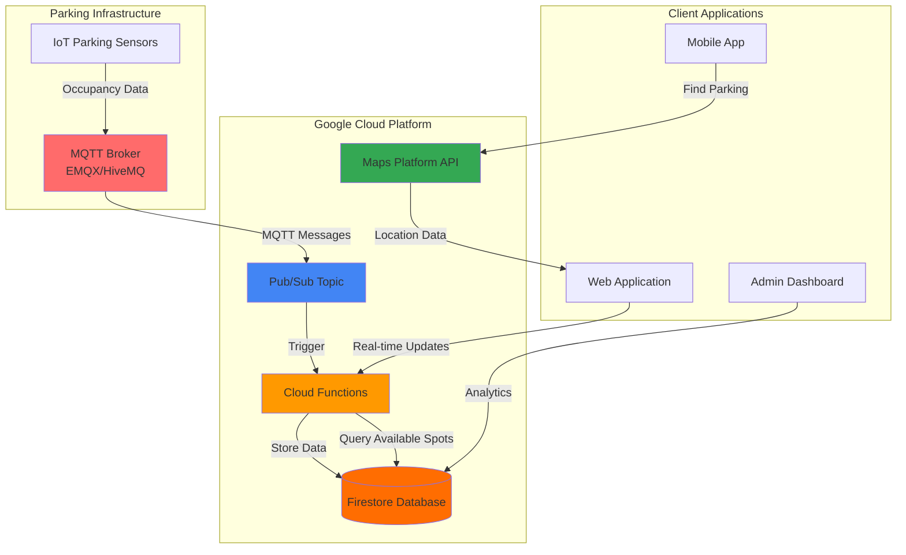

# Smart Parking Management with Maps Platform and MQTT Brokers

## Problem

Urban parking management faces critical challenges with limited visibility into real-time space availability, leading to traffic congestion as drivers search for parking and frustrated customers abandoning visits to businesses. Traditional parking systems rely on manual monitoring or basic entry/exit counts, providing no granular data about individual space occupancy, making it impossible to optimize utilization and provide real-time guidance to drivers.

## Solution

Build a comprehensive smart parking management system using Google Cloud Pub/Sub for scalable message ingestion, Cloud Functions for real-time data processing, Firestore for scalable data storage, and Maps Platform for interactive visualization and mobile integration. This solution provides real-time parking space monitoring through IoT sensors connected via MQTT brokers, instant availability updates on interactive maps, and mobile-friendly APIs for finding the nearest available parking spots.

## Architecture Diagram



## Prerequisites

1. Google Cloud account with billing enabled and appropriate permissions for Pub/Sub, Cloud Functions, Firestore, and Maps Platform
2. Google Cloud CLI installed and configured (or use Cloud Shell)
3. Basic understanding of IoT protocols (MQTT), serverless functions, and NoSQL databases
4. Knowledge of JavaScript/Node.js for Cloud Functions development
5. MQTT broker service (EMQX Cloud, HiveMQ, or self-hosted) for IoT device connectivity
6. Estimated cost: $5-15 per month for development/testing (varies by device count and API usage)

> **Note**: Google Cloud IoT Core was retired in August 2023. This recipe uses third-party MQTT brokers integrated with Google Cloud Pub/Sub as the recommended alternative architecture.

## Preparation

```bash
# Set environment variables for GCP resources
export PROJECT_ID="smart-parking-$(date +%s)"
export REGION="us-central1"
export ZONE="us-central1-a"

# Generate unique suffix for resource names
RANDOM_SUFFIX=$(openssl rand -hex 3)
export PUBSUB_TOPIC="parking-events-${RANDOM_SUFFIX}"
export FUNCTION_NAME="process-parking-data-${RANDOM_SUFFIX}"
export FIRESTORE_COLLECTION="parking_spaces"

# Create new project for isolation
gcloud projects create ${PROJECT_ID} \
    --name="Smart Parking Management"

# Set default project and region
gcloud config set project ${PROJECT_ID}
gcloud config set compute/region ${REGION}
gcloud config set compute/zone ${ZONE}

# Enable required APIs
gcloud services enable pubsub.googleapis.com \
    cloudfunctions.googleapis.com \
    firestore.googleapis.com \
    maps-backend.googleapis.com \
    cloudbuild.googleapis.com

echo "✅ Project configured: ${PROJECT_ID}"
echo "✅ APIs enabled for Pub/Sub, Cloud Functions, Firestore, and Maps Platform"
```

## Steps

1. **Create Pub/Sub Topic for Device Messages**:

   Google Cloud Pub/Sub provides reliable, asynchronous message delivery that enables decoupled communication between IoT devices and processing functions. Creating a dedicated topic for parking sensor data ensures scalable ingestion and processing of real-time occupancy events, supporting thousands of sensors with automatic scaling and guaranteed message delivery.

   ```bash
   # Create Pub/Sub topic for parking sensor data
   gcloud pubsub topics create ${PUBSUB_TOPIC}
   
   # Create subscription for message processing
   gcloud pubsub subscriptions create parking-processing \
       --topic=${PUBSUB_TOPIC}
   
   echo "✅ Pub/Sub topic and subscription created: ${PUBSUB_TOPIC}"
   ```

   The Pub/Sub infrastructure now provides the messaging backbone for real-time sensor data, enabling reliable delivery and automatic scaling based on message volume while maintaining order and consistency for parking space updates.

2. **Configure MQTT Broker Integration**:

   Since Google Cloud IoT Core was retired in 2023, modern IoT architectures use dedicated MQTT brokers that integrate with Google Cloud services. EMQX Cloud provides enterprise-grade MQTT broker services with direct Pub/Sub integration, ensuring secure device connectivity and seamless message routing to Google Cloud processing pipelines.

   ```bash
   # Note: This step requires external MQTT broker setup
   # Example configuration for EMQX Cloud or HiveMQ integration
   
   # Create service account for MQTT broker authentication
   gcloud iam service-accounts create mqtt-pubsub-publisher \
       --display-name="MQTT to Pub/Sub Publisher"
   
   # Grant Pub/Sub publisher permissions
   gcloud projects add-iam-policy-binding ${PROJECT_ID} \
       --member="serviceAccount:mqtt-pubsub-publisher@${PROJECT_ID}.iam.gserviceaccount.com" \
       --role="roles/pubsub.publisher"
   
   # Create and download service account key
   gcloud iam service-accounts keys create mqtt-sa-key.json \
       --iam-account=mqtt-pubsub-publisher@${PROJECT_ID}.iam.gserviceaccount.com
   
   echo "✅ Service account created for MQTT broker integration"
   echo "✅ Configure your MQTT broker to publish to topic: ${PUBSUB_TOPIC}"
   ```

   The MQTT broker integration now enables secure device connectivity with enterprise-grade message routing to Pub/Sub, providing the foundation for scalable sensor network management with automatic failover and device lifecycle management capabilities.

3. **Initialize Firestore Database**:

   Firestore provides a NoSQL document database with real-time synchronization capabilities, making it ideal for storing parking space data that requires instant updates across multiple client applications. The real-time listeners enable immediate UI updates when parking availability changes, while the scalable architecture supports city-wide deployments.

   ```bash
   # Initialize Firestore database in Native mode
   gcloud firestore databases create --region=${REGION}
   
   # Create initial parking space document structure
   cat > parking_space_init.json << 'EOF'
   {
     "space_id": "A001",
     "location": {
       "lat": 37.7749,
       "lng": -122.4194,
       "address": "123 Main St, San Francisco, CA"
     },
     "status": "available",
     "last_updated": null,
     "sensor_id": "parking-sensor-01",
     "zone": "downtown",
     "pricing": {
       "hourly_rate": 3.50,
       "max_duration": 120
     }
   }
   EOF
   
   echo "✅ Firestore database initialized in Native mode"
   echo "✅ Sample parking space data structure created"
   ```

   Firestore is now configured for real-time parking data with document structure supporting location data, occupancy status, pricing information, and automatic timestamp tracking for comprehensive parking space management and analytics.

4. **Deploy Cloud Function for Data Processing**:

   Cloud Functions provides serverless processing that automatically scales based on incoming Pub/Sub messages from IoT sensors. This function processes raw sensor data, updates parking space availability in Firestore, and maintains real-time synchronization across all connected applications while handling data validation and error recovery.

   ```bash
   # Create Cloud Function source directory
   mkdir parking-function && cd parking-function
   
   # Create package.json for dependencies
   cat > package.json << 'EOF'
   {
     "name": "parking-data-processor",
     "version": "1.0.0",
     "dependencies": {
       "@google-cloud/firestore": "^7.0.0",
       "@google-cloud/functions-framework": "^3.0.0"
     }
   }
   EOF
   
   # Create Cloud Function code for processing parking sensor data
   cat > index.js << 'EOF'
   const {Firestore} = require('@google-cloud/firestore');
   const firestore = new Firestore();
   
   exports.processParkingData = async (message, context) => {
     try {
       // Parse sensor data from Pub/Sub message
       const sensorData = JSON.parse(
         Buffer.from(message.data, 'base64').toString()
       );
       
       console.log('Processing sensor data:', sensorData);
       
       // Update parking space status in Firestore
       const spaceRef = firestore
         .collection('parking_spaces')
         .doc(sensorData.space_id);
       
       await spaceRef.set({
         space_id: sensorData.space_id,
         status: sensorData.occupied ? 'occupied' : 'available',
         last_updated: Firestore.Timestamp.now(),
         sensor_id: sensorData.sensor_id,
         location: sensorData.location || null,
         confidence: sensorData.confidence || 0.95
       }, { merge: true });
       
       console.log(`Updated parking space ${sensorData.space_id}: ${sensorData.occupied ? 'occupied' : 'available'}`);
       
       // Update zone statistics
       const zoneRef = firestore
         .collection('parking_zones')
         .doc(sensorData.zone || 'default');
       
       await firestore.runTransaction(async (t) => {
         const zoneDoc = await t.get(zoneRef);
         const zoneData = zoneDoc.data() || { available: 0, total: 0 };
         
         // Calculate new availability
         const isNowAvailable = !sensorData.occupied;
         const wasAvailable = zoneData.spaces?.[sensorData.space_id] !== 'occupied';
         
         if (isNowAvailable && !wasAvailable) {
           zoneData.available = (zoneData.available || 0) + 1;
         } else if (!isNowAvailable && wasAvailable) {
           zoneData.available = Math.max((zoneData.available || 0) - 1, 0);
         }
         
         zoneData.spaces = zoneData.spaces || {};
         zoneData.spaces[sensorData.space_id] = sensorData.occupied ? 'occupied' : 'available';
         zoneData.last_updated = Firestore.Timestamp.now();
         
         t.set(zoneRef, zoneData, { merge: true });
       });
       
       return { success: true, space_id: sensorData.space_id };
       
     } catch (error) {
       console.error('Error processing parking data:', error);
       throw error;
     }
   };
   EOF
   
   # Deploy Cloud Function with Pub/Sub trigger
   gcloud functions deploy ${FUNCTION_NAME} \
       --gen2 \
       --runtime nodejs20 \
       --trigger-topic ${PUBSUB_TOPIC} \
       --source . \
       --entry-point processParkingData \
       --memory 256MB \
       --timeout 60s \
       --region ${REGION}
   
   cd ..
   
   echo "✅ Cloud Function deployed with Pub/Sub trigger"
   echo "✅ Real-time parking data processing pipeline established"
   ```

   The Cloud Function now automatically processes incoming sensor data with built-in error handling, atomic Firestore updates, and zone-level aggregation statistics, providing a reliable foundation for real-time parking management with automatic scaling based on sensor message volume.

5. **Create Maps Platform API Key**:

   Google Maps Platform provides comprehensive location services including interactive maps, geocoding, and real-time visualization capabilities. Creating an API key with appropriate restrictions ensures secure access to mapping services while enabling parking space visualization, turn-by-turn navigation to available spots, and location-based search functionality.

   ```bash
   # Create Maps Platform API key
   gcloud services api-keys create \
       --display-name="Smart Parking Maps API"
   
   # Get the API key value (store securely in production)
   API_KEY_NAME=$(gcloud services api-keys list \
       --filter="displayName:'Smart Parking Maps API'" \
       --format="value(name)" | head -1)
   
   export MAPS_API_KEY=$(gcloud services api-keys get-key-string $API_KEY_NAME)
   
   # Restrict API key to Maps services
   gcloud services api-keys update $API_KEY_NAME \
       --api-target=service=maps-backend.googleapis.com
   
   echo "✅ Maps Platform API key created"
   echo "✅ API key configured for location services and mapping"
   ```

   The Maps Platform integration now enables real-time parking visualization with interactive maps, location search, and navigation features while maintaining secure API access through restricted key usage and monitoring capabilities.

6. **Deploy Parking Management API**:

   Creating a comprehensive API layer enables mobile applications and web interfaces to interact with the parking system through standard HTTP endpoints. This Cloud Function provides REST API functionality for finding available parking spaces, retrieving zone statistics, and managing real-time updates with proper authentication and rate limiting.

   ```bash
   # Create API function directory
   mkdir parking-api && cd parking-api
   
   # Create package.json for API dependencies
   cat > package.json << 'EOF'
   {
     "name": "parking-management-api",
     "version": "1.0.0",
     "dependencies": {
       "@google-cloud/firestore": "^7.0.0",
       "@google-cloud/functions-framework": "^3.0.0",
       "express": "^4.19.0",
       "cors": "^2.8.5"
     }
   }
   EOF
   
   # Create API function for parking management
   cat > index.js << 'EOF'
   const {Firestore} = require('@google-cloud/firestore');
   const express = require('express');
   const cors = require('cors');
   
   const firestore = new Firestore();
   const app = express();
   
   app.use(cors());
   app.use(express.json());
   
   // Get available parking spaces near location
   app.get('/parking/search', async (req, res) => {
     try {
       const { lat, lng, radius = 1000 } = req.query;
       
       if (!lat || !lng) {
         return res.status(400).json({ error: 'Latitude and longitude required' });
       }
       
       // Query available parking spaces
       const spacesSnapshot = await firestore
         .collection('parking_spaces')
         .where('status', '==', 'available')
         .limit(20)
         .get();
       
       const availableSpaces = [];
       spacesSnapshot.forEach(doc => {
         const space = doc.data();
         // Simple distance calculation (production should use proper geospatial queries)
         if (space.location) {
           const distance = calculateDistance(
             parseFloat(lat), parseFloat(lng),
             space.location.lat, space.location.lng
           );
           
           if (distance <= radius) {
             availableSpaces.push({
               ...space,
               distance: Math.round(distance),
               id: doc.id
             });
           }
         }
       });
       
       // Sort by distance
       availableSpaces.sort((a, b) => a.distance - b.distance);
       
       res.json({
         total: availableSpaces.length,
         spaces: availableSpaces.slice(0, 10)
       });
       
     } catch (error) {
       console.error('Search error:', error);
       res.status(500).json({ error: 'Internal server error' });
     }
   });
   
   // Get zone statistics
   app.get('/parking/zones/:zoneId/stats', async (req, res) => {
     try {
       const { zoneId } = req.params;
       
       const zoneDoc = await firestore
         .collection('parking_zones')
         .doc(zoneId)
         .get();
       
       if (!zoneDoc.exists) {
         return res.status(404).json({ error: 'Zone not found' });
       }
       
       const zoneData = zoneDoc.data();
       
       res.json({
         zone_id: zoneId,
         available: zoneData.available || 0,
         total: zoneData.total || 0,
         occupancy_rate: zoneData.total > 0 ? 
           ((zoneData.total - zoneData.available) / zoneData.total * 100).toFixed(1) : '0.0',
         last_updated: zoneData.last_updated
       });
       
     } catch (error) {
       console.error('Zone stats error:', error);
       res.status(500).json({ error: 'Internal server error' });
     }
   });
   
   // Simple distance calculation (Haversine formula)
   function calculateDistance(lat1, lon1, lat2, lon2) {
     const R = 6371000; // Earth's radius in meters
     const dLat = (lat2 - lat1) * Math.PI / 180;
     const dLon = (lon2 - lon1) * Math.PI / 180;
     const a = Math.sin(dLat/2) * Math.sin(dLat/2) +
               Math.cos(lat1 * Math.PI / 180) * Math.cos(lat2 * Math.PI / 180) *
               Math.sin(dLon/2) * Math.sin(dLon/2);
     const c = 2 * Math.atan2(Math.sqrt(a), Math.sqrt(1-a));
     return R * c;
   }
   
   exports.parkingApi = app;
   EOF
   
   # Deploy API function
   gcloud functions deploy parking-management-api \
       --gen2 \
       --runtime nodejs20 \
       --trigger-http \
       --allow-unauthenticated \
       --source . \
       --entry-point parkingApi \
       --memory 256MB \
       --timeout 60s \
       --region ${REGION}
   
   # Get API endpoint URL
   export API_ENDPOINT=$(gcloud functions describe parking-management-api \
       --region=${REGION} \
       --gen2 \
       --format="value(serviceConfig.uri)")
   
   cd ..
   
   echo "✅ Parking Management API deployed"
   echo "✅ API endpoint: ${API_ENDPOINT}"
   ```

   The API layer now provides HTTP endpoints for parking space search, zone statistics, and real-time data access, enabling mobile applications and web interfaces to integrate with the parking management system through standard REST APIs with proper error handling and CORS support.

7. **Test MQTT Message Simulation**:

   Simulating MQTT sensor data validates the complete data pipeline from device connectivity through real-time processing to database updates. This testing ensures proper message handling through the MQTT broker, Pub/Sub ingestion, Cloud Function processing, and Firestore synchronization before deploying actual hardware sensors in the parking infrastructure.

   ```bash
   # Create test sensor data
   cat > test_sensor_data.json << 'EOF'
   {
     "space_id": "A001",
     "sensor_id": "parking-sensor-01",
     "occupied": false,
     "confidence": 0.98,
     "zone": "downtown",
     "location": {
       "lat": 37.7749,
       "lng": -122.4194
     },
     "timestamp": "2025-07-23T10:30:00Z"
   }
   EOF
   
   # Publish test message directly to Pub/Sub topic (simulating MQTT broker)
   gcloud pubsub topics publish ${PUBSUB_TOPIC} \
       --message="$(cat test_sensor_data.json)"
   
   # Wait for processing
   sleep 10
   
   # Test a second sensor reading with occupation change
   cat > test_sensor_occupied.json << 'EOF'
   {
     "space_id": "A001",
     "sensor_id": "parking-sensor-01",
     "occupied": true,
     "confidence": 0.97,
     "zone": "downtown",
     "location": {
       "lat": 37.7749,
       "lng": -122.4194
     },
     "timestamp": "2025-07-23T10:35:00Z"
   }
   EOF
   
   gcloud pubsub topics publish ${PUBSUB_TOPIC} \
       --message="$(cat test_sensor_occupied.json)"
   
   # Verify data was processed and stored in Firestore
   echo "✅ Test sensor data published to Pub/Sub"
   echo "✅ Check Cloud Function logs and Firestore console for processing results"
   ```

   The sensor simulation confirms end-to-end data flow from MQTT brokers through the processing pipeline to database storage, validating the complete smart parking system architecture and ensuring readiness for production sensor deployment.

## Validation & Testing

1. **Verify Pub/Sub Topic and Subscription**:

   ```bash
   # Check Pub/Sub topic status
   gcloud pubsub topics describe ${PUBSUB_TOPIC} \
       --format="table(name)"
   
   # Verify subscription status
   gcloud pubsub subscriptions describe parking-processing \
       --format="table(name,topic,ackDeadlineSeconds)"
   ```

   Expected output: Topic shows active status, and subscription appears linked to the correct topic with appropriate acknowledgment settings.

2. **Test Cloud Function Processing**:

   ```bash
   # Check Cloud Function deployment status
   gcloud functions describe ${FUNCTION_NAME} \
       --region=${REGION} \
       --gen2 \
       --format="table(name,state,eventTrigger.eventType)"
   
   # View recent function logs
   gcloud functions logs read ${FUNCTION_NAME} \
       --region=${REGION} \
       --gen2 \
       --limit=10
   ```

   Expected output: Function shows "ACTIVE" state with Pub/Sub trigger, and logs display successful message processing without errors.

3. **Validate Firestore Data Storage**:

   ```bash
   # Check if Firestore database is active
   gcloud firestore databases list \
       --format="table(name,type,locationId)"
   
   # Verify parking space data (using REST API)
   curl -s "${API_ENDPOINT}/parking/zones/downtown/stats" | \
       jq '.' || echo "API response validation"
   ```

   Expected output: Firestore database appears as "Native" type in the specified region, and API returns JSON response with parking zone statistics.

4. **Test Maps Platform API Integration**:

   ```bash
   # Test parking space search API
   curl -s "${API_ENDPOINT}/parking/search?lat=37.7749&lng=-122.4194&radius=1000" | \
       jq '.total, .spaces[0]' 2>/dev/null || echo "Testing API endpoint..."
   
   # Verify Maps API key functionality
   echo "Maps API Key configured: ${MAPS_API_KEY:0:20}..."
   ```

   Expected output: API returns structured JSON with parking space data including location coordinates, availability status, and distance calculations.

## Cleanup

1. **Remove Cloud Functions**:

   ```bash
   # Delete parking data processing function
   gcloud functions delete ${FUNCTION_NAME} \
       --region=${REGION} \
       --gen2 \
       --quiet
   
   # Delete parking management API
   gcloud functions delete parking-management-api \
       --region=${REGION} \
       --gen2 \
       --quiet
   
   echo "✅ Cloud Functions deleted"
   ```

2. **Remove Pub/Sub Resources**:

   ```bash
   # Delete Pub/Sub subscription
   gcloud pubsub subscriptions delete parking-processing --quiet
   
   # Delete Pub/Sub topic
   gcloud pubsub topics delete ${PUBSUB_TOPIC} --quiet
   
   echo "✅ Pub/Sub topic and subscription deleted"
   ```

3. **Clean up Maps Platform API Key**:

   ```bash
   # Delete Maps Platform API key
   if [ ! -z "${API_KEY_NAME}" ]; then
     gcloud services api-keys delete ${API_KEY_NAME} --quiet
   fi
   
   echo "✅ Maps Platform API key deleted"
   ```

4. **Remove Service Account and Keys**:

   ```bash
   # Delete service account key file
   rm -f mqtt-sa-key.json
   
   # Delete service account
   gcloud iam service-accounts delete \
       mqtt-pubsub-publisher@${PROJECT_ID}.iam.gserviceaccount.com \
       --quiet
   
   echo "✅ Service account and keys removed"
   ```

5. **Remove Project and All Resources**:

   ```bash
   # Delete the entire project (removes all resources)
   gcloud projects delete ${PROJECT_ID} --quiet
   
   # Clean up local files
   rm -rf parking-function parking-api
   rm -f test_sensor_data.json test_sensor_occupied.json parking_space_init.json
   
   # Clear environment variables
   unset PROJECT_ID REGION ZONE PUBSUB_TOPIC FUNCTION_NAME
   unset FIRESTORE_COLLECTION MAPS_API_KEY API_ENDPOINT API_KEY_NAME
   
   echo "✅ Project deleted and local files cleaned up"
   echo "Note: Project deletion may take several minutes to complete"
   ```

## Discussion

Smart parking management systems represent a practical application of IoT and cloud technologies that address real urban challenges while demonstrating key architectural patterns for scalable, real-time applications. With Google Cloud IoT Core retired as of August 2023, modern IoT architectures leverage specialized MQTT brokers like EMQX Cloud or HiveMQ that integrate seamlessly with Google Cloud services through Pub/Sub. This approach provides enterprise-grade device connectivity, ensuring that parking sensors can reliably transmit occupancy data through MQTT protocol with robust security and automatic failover capabilities.

The integration between MQTT brokers, Pub/Sub, and Firestore creates a robust event-driven architecture that maintains real-time synchronization across all client applications. Firestore's real-time listeners enable instant UI updates when parking availability changes, while the NoSQL document structure supports flexible data modeling for different parking space types, pricing models, and location hierarchies. This architectural approach supports city-wide deployments with hundreds of thousands of parking spaces while maintaining sub-second response times for availability queries.

Google Maps Platform integration provides comprehensive location services that extend beyond simple visualization to include geocoding, route optimization, and location-based search capabilities. The API layer design enables multiple client applications—mobile apps, web dashboards, and third-party integrations—to access parking data through standard HTTP endpoints with proper authentication and rate limiting. Performance optimization strategies include geospatial indexing for location-based queries using Firestore's GeoPoint fields, data aggregation at the zone level for dashboard analytics, and caching mechanisms for frequently accessed parking space information through Cloud Functions memory optimization.

The solution demonstrates several Google Cloud best practices including least-privilege IAM roles for service-to-service communication, proper API key restrictions for Maps Platform access, and comprehensive monitoring through Cloud Logging and Cloud Monitoring. Security considerations include MQTT broker certificate management, encrypted data transmission using TLS, and secure API endpoints with CORS configuration for web application integration. For production deployments, additional considerations include implementing device firmware over-the-air updates through the MQTT broker management interface, establishing data retention policies for historical parking analytics in Firestore, and integrating with existing city infrastructure through standardized APIs and data formats. Consider deploying MQTT brokers on Google Kubernetes Engine for enhanced scalability and using [Google Cloud Architecture Center's MQTT broker patterns](https://cloud.google.com/architecture/connected-devices/mqtt-broker-architecture) for production-ready deployments.

> **Tip**: Monitor MQTT broker connectivity and message processing through Cloud Monitoring dashboards integrated with Pub/Sub metrics to identify sensor malfunctions or connectivity issues before they impact parking availability accuracy.

## Challenge

Extend this smart parking management system by implementing these sophisticated enhancements:

1. **Advanced MQTT Broker Deployment**: Deploy a self-managed MQTT broker cluster on Google Kubernetes Engine with auto-scaling capabilities, implementing custom authentication and authorization policies for enterprise-scale device management.

2. **Predictive Analytics Integration**: Implement machine learning models using Vertex AI to predict parking demand patterns based on historical data, events, weather, and traffic conditions, enabling proactive parking management and dynamic pricing strategies.

3. **Multi-Modal Transportation Integration**: Integrate with public transit APIs and ride-sharing services to provide comprehensive mobility recommendations, suggesting optimal combinations of parking and public transport based on real-time conditions and user preferences.

4. **Advanced Sensor Fusion**: Expand beyond simple occupancy detection by integrating computer vision using Cloud Vision API for vehicle type recognition, license plate reading for enforcement, and detection of improperly parked vehicles or accessibility violations.

5. **Edge Computing Optimization**: Deploy edge computing nodes using Google Distributed Cloud for local processing of sensor data, reducing latency for real-time decisions and enabling offline operation during network connectivity issues.

## Infrastructure Code

### Available Infrastructure as Code:

- [Infrastructure Code Overview](code/README.md) - Detailed description of all infrastructure components
- [Infrastructure Manager](code/infrastructure-manager/) - GCP Infrastructure Manager templates
- [Bash CLI Scripts](code/scripts/) - Example bash scripts using gcloud CLI commands to deploy infrastructure
- [Terraform](code/terraform/) - Terraform configuration files